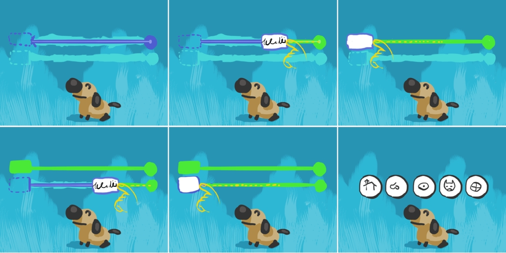

# MiniGame: Reading Game

## Testing procedure
Total tests: 2
- Variations
    1. Alphabet Song
    2. Reading Game
- Difficulty Levels: ininfluent

### Shortcuts
_none_

## Variations
### 1. Alphabet Song
Player must follow the song.

#### Difficulty
Ignored

#### Scoring
- 3 stars if...
- 2 stars if...
- 1 star if...
---
### 2. Reading Game
Player must find the correct letters in order.

#### Difficulty
Time to answer decreases with difficulty.

#### Scoring
- 3 stars if...
- 2 stars if...
- 1 star if...
---
## Developer notes

## Issues

## Warnings to be fixed

## Optimization

---

## Game Design Docs

### Objectives
**Pedagogical**: Teach reading fluency.
**Play**: The player must follow a sentence/alphabet correctly and fill the world.

### Mechanics
**Life-based**: score is based on reading speed and correct answers to each round's quiz (wrong answer loses a life).
A sentence (or a series of letters in the Alphabet variation) appears in the center of the screen, hidden except for a small **Reading Window (RW)**. The player will have to drag the RW over the sentence (which is otherwise obscured). When the finger/RW reaches the end, a popup appears with N buttons representing various images. The player will be asked to identify the correct image relative to the sentence he just read (so we know if he understood what he read or not).

NOTE: the popup quiz should show how many points (based on the round's reading speed) you would get if you answer correctly. If you answer wrongly, all points are lost, otherwise they are validated and added to the starbar.

### Antura

Antura would work just as a feedback, in the lower part of the screen. If the player reads fast, he jumps/moves happily, otherwise he runs around angrily.

### Feedback

If the player moves fast, the RW pulses with bright and cheerful colors, otherwise it goes from yellow to red.
The environment would work as the round's feedback. Each time the player gets a correct quiz answer, trees, bushes and moving clouds popup in the background. These elements increase during the whole game (meaning are not reset between rounds).
Difficulty variations
Gameplay: Smaller RW.
Pedagogical: Longer sentences.

### Endgame

The game will end under after N (5?) sentences have been read, successfully or not, or if all lives (3) are lost.
The score/stars will be calculated based on the reading speed and correct quiz answers. Failing to answer the quiz invalidates any score achieved during the round.
When a round ends the quiz buttons disappear with a POOF and a new sentence arrives.

**Success** (repeated per round)
The score is validated, Antura yaps happily, new trees/bushes/clouds appear.

**Failure** (repeated per round)
The score is invalidated, Antura barks angrily, the correct image is highlighted while the sentence is being read by the voice.

### Variations

- Sentence
- Alphabet song: in this case the player has to follow the voice singing the song
