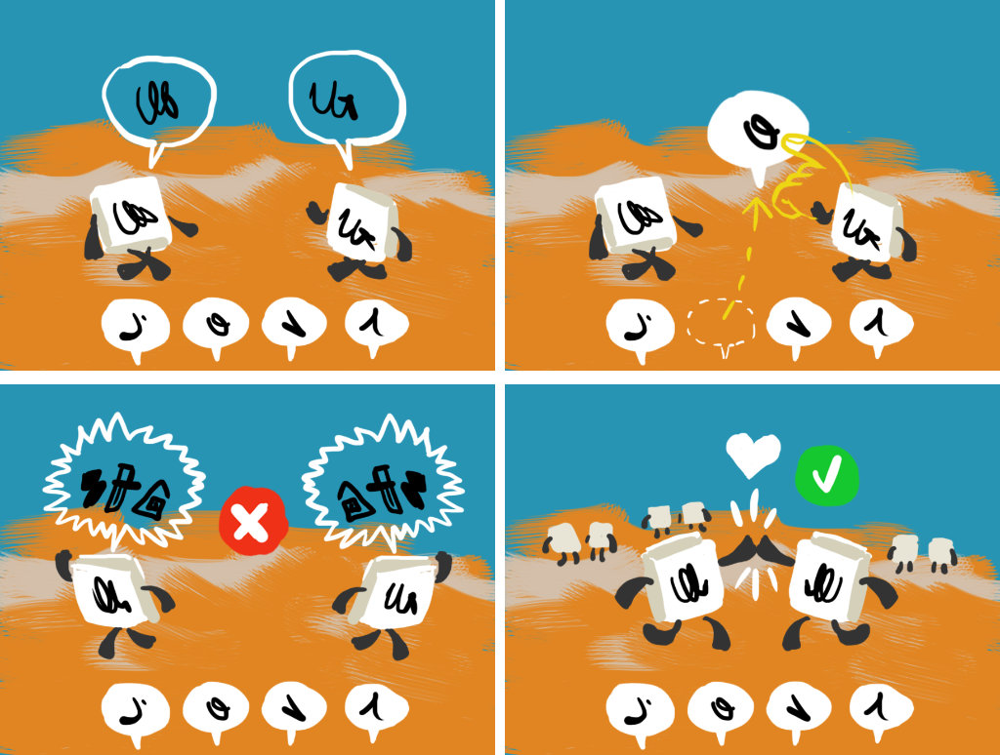

# MiniGame: Make Friends

## Testing procedure
Total tests: 1
- Variations
	1. MakeFriends
- Difficulty Levels: 2
	1. Low difficulty (value = 0)
	2. Medium difficulty (value = 1)

### Shared Difficulty
- Letters provide hints at lower difficulties

### Shortcuts
_none_

## Variations

### 1. MakeFriends
Player must find the correct letter.

#### Scoring
- 3 stars if...
- 2 stars if...
- 1 star if...
---
## Developer notes

## Issues
- The expected difficulty goes from 0 to 2, but the core system will only provide a varying difficulty between 0 and 1

## Warnings to be fixed

## Optimization

---

## Game Design Docs
**Pedagogical Objectives**: Recognize letter sound in words.

**Play Objectives**: Create as many friendships as possible: inspire friendship between LLs by showing they have common arguments.

### Mechanics

**Attempt-based**: no time-limit.

Two LLs appear (showing or not showing their word, depending on the difficulty) walking from off-screen (they enter moving from the front side so we see their back, and they turn—if necessary based on pedagogical level—to show their written word). Each of them says their word. The player then can choose between N letters to **drag** to the center of the screen (inside a comic balloon).

- Touching an LL will have it repeat its word.
- Touching a letter will play the letter's sound (change).
- When the letter is dropped in the center of the screen, a comic balloon shows with that letter and it's pronounced.
- **If the letter was right**, the LLs will say something (gibberish) happily, show their word with the common letter evidenced, then slap a highfive (or hug, but hugging might be complicated for animations) and move to the "friendship area" in the background. New LLs will appear with new words, and new letters to choose from.
- **If the letter was wrong**, the LLs will say something (gibberish) angrily and move away from each other. The dragged letter will be marked as wrong in the UI.

### Antura

Now and then Antura will fall from the sky and land on his ass between the LLs, causing them to move away from each other. Antura will then jump back on his feet, [bark/woof/burp], and run away off-screen _(by running away from the camera for a little then curving left or right to exit)_.

**NOTE**: When Antura runs away the movement will have to consider the objects in the environment and prevent sliding. If this might be an issue, we could also just make him disappear with a POOF.

### Difficulty variations
Gameplay

    3 possible mistakes
    Timer

Pedagogical

    One common letter
    Multiple common letters
    Various degrees of showing the words on the LL (show, show only at startup, not show at all)

### Endgame

The game will end under one of these conditions:

    Too many friendships were broken
    The required amount of friendships were won

### Success

The camera zooms to the "friendship area" and shows all friends interacting happily.

### Failure
**Condition**: too many wrong letters chosen.
The current LLs show their word and the correct letter is evidenced. Then the camera zooms out from the "friendship area".
