# Cards(fr)

Language: [english](./index.md) - french - [polish](./index.pl.md) - [italian](./index.it.md)

!!! note "Educators: help improving these cards!"
    **Improve translations**: [comment here](https://docs.google.com/spreadsheets/d/1M3uOeqkbE4uyDs5us5vO-nAFT8Aq0LGBxjjT_CSScWw/edit?gid=415931977#gid=415931977)  

Total found:** 358**

## International

### Affiche de l'école française

Un grand tableau avec des informations qui s'affiche sur les murs des salles de classe dans les écoles françaises.

- Type: Object
- Subjects: Education
- Country: International
- Quests: [Jules Verne et les transports (fr_03)](../quest/fr_03.fr.md)

### Alpes

Une haute chaîne de montagnes en Europe.

- Type: Place
- Subjects: Geography, Environment
- Country: International
- Quests: [Mont Blanc et montagnes (fr_08)](../quest/fr_08.fr.md)

### animal_chimpanzee

- Type: None
- Country: International
- Quests: [Le zoo (pl_04)](../quest/pl_04.fr.md)

### animal_lion_cub

- Type: Object
- Country: International
- Quests: [Le zoo (pl_04)](../quest/pl_04.fr.md)

### animal_lion_young_male

- Type: Object
- Country: International
- Quests: [Le zoo (pl_04)](../quest/pl_04.fr.md)

### Apiculteur
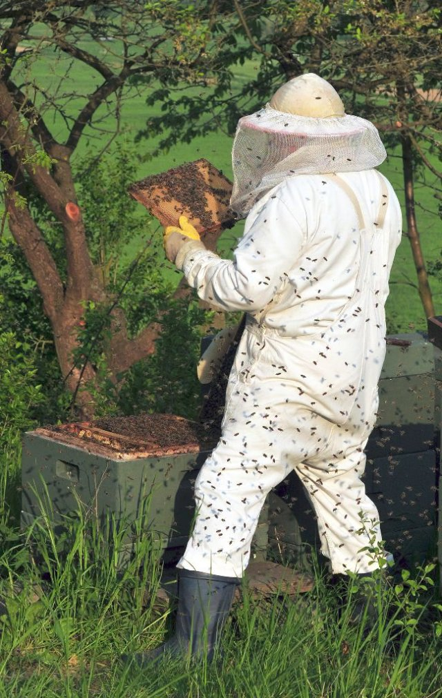

Une personne qui s’occupe des abeilles et récolte le miel.

- Type: Person
- Subjects: Community, Animal, Food
- Country: International
- Quests: [Pain d'épices et marché alimentaire (pl_06)](../quest/pl_06.fr.md)

### Balle

Un objet rond utilisé dans de nombreux jeux.

- Type: Object
- Subjects: Sport, Recreation
- Country: International
- Quests: [Découvrir Varsovie (pl_01)](../quest/pl_01.fr.md)

### BANANE

- Type: Object
- Country: International
- Quests: [Le zoo (pl_04)](../quest/pl_04.fr.md)

### bateau fluvial

Un bateau qui navigue sur les rivières. Les rivières sont comme des routes faites d'eau !

- Type: Place
- Subjects: Geography, Environment
- Country: International
- Quests: [Paris Seine (fr_10)](../quest/fr_10.fr.md)

### Bateau pour marchandises

Un grand bateau qui transporte des cartons, de la nourriture et d’autres choses d’un endroit à un autre.

- Type: Place
- Subjects: Geography, Environment
- Country: International

### Belgique

Un pays d'Europe. Sa capitale est Bruxelles.

- Type: Place
- Subjects: Geography, Culture
- Country: International

### Bern

La capitale de la Suisse.

- Type: Place
- Subjects: Geography, Culture
- Country: International

### Beurre

Une matière grasse jaune issue du lait, utilisée pour la cuisine et la pâtisserie.

- Type: Object
- Subjects: Food, Animal
- Country: International
- Quests: [Pain d'épices et marché alimentaire (pl_06)](../quest/pl_06.fr.md)

### Billet pour la Tour Eiffel

Un document spécial qui vous permet de visiter la célèbre haute tour de Paris, en France.

- Type: Object
- Subjects: Science
- Country: International
- Quests: [Paris ! (fr_01)](../quest/fr_01.fr.md)

### Biélorussie

Un pays d'Europe. La capitale est Minsk.

- Type: Place
- Subjects: Geography, Culture
- Country: International

### Bobsleigh

Un traîneau rapide utilisé pour glisser sur la glace.

- Type: Object
- Subjects: Sport, Recreation
- Country: International
- Quests: [Mont Blanc et montagnes (fr_08)](../quest/fr_08.fr.md)

### Boucher

Une personne qui vend de la viande.

- Type: Person
- Subjects: Community, Food
- Country: International
- Quests: [Pain d'épices et marché alimentaire (pl_06)](../quest/pl_06.fr.md)

### Boulanger

Une personne qui fait du pain, des gâteaux et des pâtisseries.

- Type: Person
- Subjects: History, Culture
- Country: International
- Quests: [Nourriture et marché (fr_09)](../quest/fr_09.fr.md)

### Boussole

Un outil qui permet de dessiner des cercles parfaits. Il possède deux branches, comme des ciseaux.

- Type: Object
- Subjects: Math
- Country: International
- Quests: [Le système scolaire (fr_02)](../quest/fr_02.fr.md)

### Bratislava

La capitale de la Slovaquie.

- Type: Place
- Subjects: Geography, Culture
- Country: International

### Bruxelles

La capitale de la Belgique.

- Type: Place
- Subjects: Geography, Culture
- Country: International

### Bus
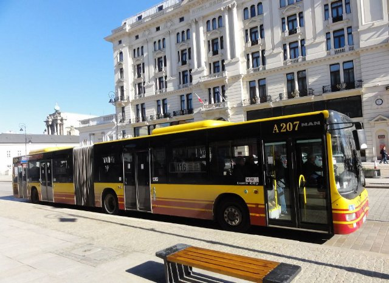

Un gros véhicule qui transporte de nombreuses personnes.

- Type: Object
- Subjects: Transportation, Community
- Country: International
- Quests: [Découvrir Varsovie (pl_01)](../quest/pl_01.fr.md)

### But

Le filet dans lequel vous essayez de marquer.

- Type: Object
- Subjects: Sport, Recreation
- Country: International
- Quests: [Découvrir Varsovie (pl_01)](../quest/pl_01.fr.md)

### Cannelle

Une épice douce fabriquée à partir d'écorce d'arbre.

- Type: Object
- Subjects: Food, Plant
- Country: International
- Quests: [Pain d'épices et marché alimentaire (pl_06)](../quest/pl_06.fr.md)

### Carré

Un outil en forme de triangle utilisé pour dessiner des lignes droites et des angles droits en mathématiques.

- Type: Object
- Subjects: Math
- Country: International
- Quests: [Le système scolaire (fr_02)](../quest/fr_02.fr.md)

### Cartable
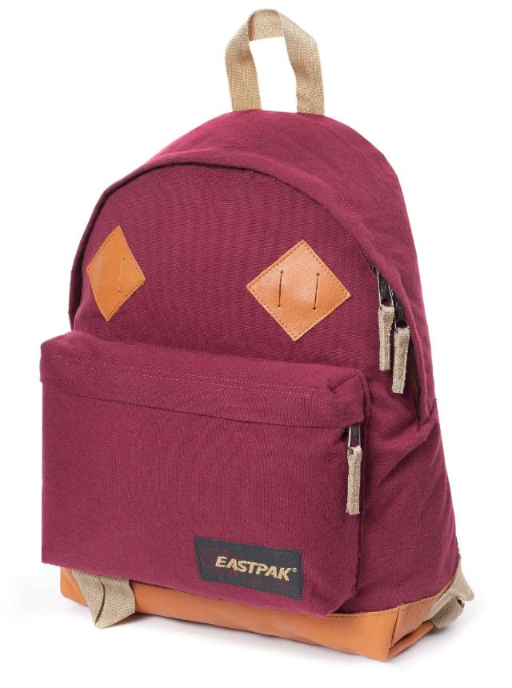

Un sac que les élèves utilisent pour transporter leurs livres, crayons et devoirs à l'école.

- Type: Object
- Subjects: Science
- Country: International
- Quests: [Le système scolaire (fr_02)](../quest/fr_02.fr.md)

### Carte de l'Europe

Une carte montrant tous les pays d'Europe. Vous pouvez voir où se trouvent la France, la Pologne, l'Allemagne et d'autres pays.

- Rationale: Maps help kids understand where different countries are and how they connect
- Type: Concept
- Subjects: Geography, Education
- Year: 2000
- Country: International
- Quests: [Les voisins de la France (fr_00)](../quest/fr_00.fr.md), [Les voisins de la Pologne (pl_00)](../quest/pl_00.fr.md)

### Carte de la Tour Eiffel

Une carte qui montre où se trouve la célèbre haute tour de Paris.

- Type: Object
- Subjects: Community, Culture
- Country: International
- Quests: [Paris ! (fr_01)](../quest/fr_01.fr.md)

### Cercle

Une forme ronde sans coins. Les cercles ressemblent à des roues, des boules et des pièces de monnaie !

- Type: Concept
- Subjects: Math
- Country: International
- Quests: [Le système scolaire (fr_02)](../quest/fr_02.fr.md)

### Chambres du Parlement polonais

Là où les lois sont faites : la Diète et le Sénat.

- Type: Place
- Subjects: Civics, History, Geography
- Country: International
- Quests: [Découvrir Varsovie (pl_01)](../quest/pl_01.fr.md)

### Chapeau

Un bonnet chaud pour votre tête.

- Type: Object
- Subjects: Health, Safety, Weather
- Country: International
- Quests: [Mont Blanc et montagnes (fr_08)](../quest/fr_08.fr.md)

### Château Royal (Varsovie)

Un château historique des rois polonais, aujourd'hui un musée.

- Type: Place
- Subjects: History, Culture, Geography
- Country: International
- Quests: [Découvrir Varsovie (pl_01)](../quest/pl_01.fr.md)

### Chéri
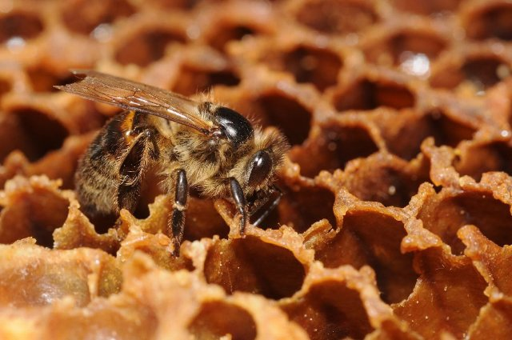

Un aliment sucré fabriqué par les abeilles.

- Type: Object
- Subjects: Food, Animal
- Country: International
- Quests: [Pain d'épices et marché alimentaire (pl_06)](../quest/pl_06.fr.md)

### Citron

Un fruit jaune au goût très acide. On utilise le citron pour faire de la limonade !

- Type: Object
- Subjects: Food, Culture
- Country: International
- Quests: [Nourriture et marché (fr_09)](../quest/fr_09.fr.md)

### Classe

Une salle à l'école où les élèves s'assoient et apprennent de nouvelles choses de leur professeur.

- Type: Place
- Subjects: Education, Community
- Country: International
- Quests: [Le système scolaire (fr_02)](../quest/fr_02.fr.md), [Jules Verne et les transports (fr_03)](../quest/fr_03.fr.md)

### clous de girofle

Une épice forte utilisée pour ajouter de la saveur aux aliments.

- Type: Object
- Subjects: Food, Plant
- Country: International
- Quests: [Pain d'épices et marché alimentaire (pl_06)](../quest/pl_06.fr.md)

### Constitution du 3 mai

Une constitution polonaise historique célébrée le 3 mai.

- Type: Concept
- Subjects: Civics, History, Time
- Country: International
- Quests: [Découvrir Varsovie (pl_01)](../quest/pl_01.fr.md)

### Corde
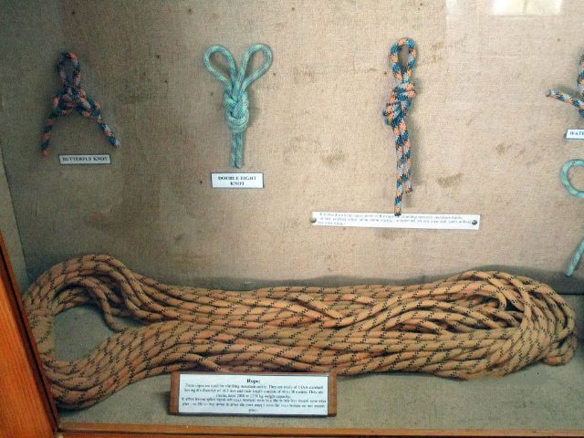

Une ligne solide utilisée pour la sécurité lors de l'escalade.

- Type: Object
- Subjects: Safety, Technology, Sport
- Country: International
- Quests: [Mont Blanc et montagnes (fr_08)](../quest/fr_08.fr.md)

### Crabe

Un animal marin doté de grandes pinces et d'une carapace dure. Les crabes marchent latéralement sur la plage !

- Type: Object
- Subjects: Food, Culture
- Country: International
- Quests: [Nourriture et marché (fr_09)](../quest/fr_09.fr.md)

### Crampons
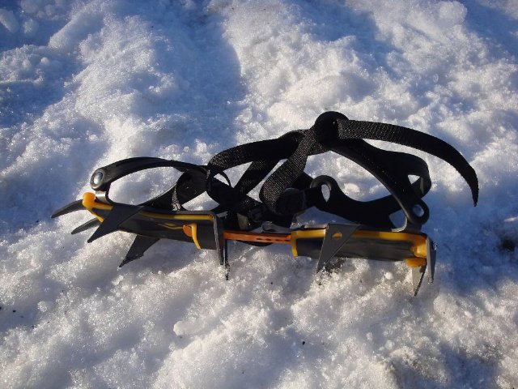

Poignées métalliques pointues que vous attachez aux bottes pour la glace.

- Type: Object
- Subjects: Safety, Technology, Sport
- Country: International
- Quests: [Mont Blanc et montagnes (fr_08)](../quest/fr_08.fr.md)

### Cuisine

Une pièce où les gens cuisinent et font des pâtisseries.

- Type: Place
- Subjects: Food
- Country: International
- Quests: [Pain d'épices et marché alimentaire (pl_06)](../quest/pl_06.fr.md)

### Cuisiner

Une personne qui prépare de la nourriture.

- Type: Person
- Subjects: Community, Food
- Country: International
- Quests: [Pain d'épices et marché alimentaire (pl_06)](../quest/pl_06.fr.md)

### Doubler

Une ligne droite reliant un point à un autre. Les lignes peuvent être longues ou courtes.

- Type: Concept
- Subjects: Math
- Country: International
- Quests: [Le système scolaire (fr_02)](../quest/fr_02.fr.md)

### Drapeau de l'Ukraine

Un drapeau bleu et jaune, comme le ciel et le soleil. Il représente l'Ukraine.

- Type: Concept
- Subjects: Community, Culture
- Country: International
- Quests: [Les voisins de la France (fr_00)](../quest/fr_00.fr.md), [Les voisins de la Pologne (pl_00)](../quest/pl_00.fr.md)

### Drapeau de la Belgique

Le drapeau belge comporte trois bandes verticales : noire, jaune et rouge. La Belgique est célèbre pour son chocolat et ses gaufres !

- Rationale: Belgium's unique vertical stripes help kids distinguish different flag patterns
- Type: Concept
- Subjects: Geography, Culture
- Year: 1831
- Country: International
- Quests: [Les voisins de la France (fr_00)](../quest/fr_00.fr.md)

### Drapeau de la Biélorussie

Le drapeau de la Biélorussie est composé de bandes horizontales rouges et vertes, ornées de magnifiques motifs traditionnels sur les côtés. La Biélorussie est voisine de la Pologne.

- Rationale: Learning neighboring countries helps kids understand regional geography
- Type: Concept
- Subjects: Geography, Culture
- Year: 1995
- Country: International
- Quests: [Les voisins de la Pologne (pl_00)](../quest/pl_00.fr.md)

### Drapeau de la Lituanie

Le drapeau est composé de bandes horizontales jaunes, vertes et rouges. La Lituanie est un pays balte doté de magnifiques forêts et plages.

- Rationale: Baltic countries teach kids about northern European geography and Poland's neighbors
- Type: Concept
- Subjects: Geography, Culture
- Year: 1988
- Country: International
- Quests: [Les voisins de la Pologne (pl_00)](../quest/pl_00.fr.md)

### Drapeau de la Russie

Un drapeau à rayures blanches, bleues et rouges. Il représente la Russie.

- Type: Concept
- Subjects: Community, Culture
- Country: International
- Quests: [Les voisins de la Pologne (pl_00)](../quest/pl_00.fr.md)

### Drapeau de la République tchèque

Le drapeau est composé de bandes blanches et rouges avec un triangle bleu. La République tchèque est célèbre pour son magnifique château de Prague et sa cristallerie.

- Rationale: Central European countries help kids understand the region around Poland
- Type: Concept
- Subjects: Geography, Culture
- Year: 1920
- Country: International
- Quests: [Les voisins de la France (fr_00)](../quest/fr_00.fr.md), [Les voisins de la Pologne (pl_00)](../quest/pl_00.fr.md)

### Drapeau de la Slovaquie

Un drapeau aux couleurs blanche, bleue et rouge. Il représente la Slovaquie.

- Type: Concept
- Subjects: Community, Culture
- Country: International
- Quests: [Les voisins de la France (fr_00)](../quest/fr_00.fr.md), [Les voisins de la Pologne (pl_00)](../quest/pl_00.fr.md)

### Drapeau de la Suisse

Le drapeau suisse est rouge avec une croix blanche au milieu. On dirait une trousse de premiers secours ! La Suisse est célèbre pour ses montagnes et son fromage.

- Rationale: The Swiss flag's unique cross design helps kids remember this mountain country
- Type: Concept
- Subjects: Geography, Culture
- Year: 1889
- Country: International
- Quests: [Les voisins de la France (fr_00)](../quest/fr_00.fr.md)

### Drapeau du Luxembourg

Le drapeau luxembourgeois est composé de bandes horizontales rouges, blanches et bleu clair. Le Luxembourg est un tout petit pays qui parle trois langues !

- Rationale: Small multilingual countries teach kids about European diversity
- Type: Concept
- Subjects: Geography, Culture
- Year: 1972
- Country: International
- Quests: [Les voisins de la France (fr_00)](../quest/fr_00.fr.md)

### Eau

L'eau est essentielle à toute vie

- Type: Object
- Subjects: Food, Culture
- Country: International

### Escalade

Escalader des rochers ou de la glace avec un équipement spécial.

- Type: Concept
- Subjects: Sport, Safety, Recreation
- Country: International
- Quests: [Mont Blanc et montagnes (fr_08)](../quest/fr_08.fr.md)

### Farine

Poudre blanche fabriquée à partir de blé qui est utilisée pour faire du pain.

- Type: Object
- Subjects: Food, Science
- Country: International

### Fer

Un outil chauffant utilisé pour lisser et aplatir les vêtements froissés. Attention, les fers à repasser sont très chauds !

- Type: Object
- Subjects: Science
- Country: International

### Football (soccer)

Un jeu d'équipe joué avec un ballon que vous frappez.

- Type: Object
- Subjects: Sport, Recreation, Community
- Country: International
- Quests: [Découvrir Varsovie (pl_01)](../quest/pl_01.fr.md)

### Former

Les trains transportent rapidement des personnes et des marchandises à travers le pays.

- Type: Object
- Subjects: Transportation
- Country: International

### Foulard

Un tissu chaud que vous portez autour du cou.

- Type: Object
- Subjects: Health, Safety, Weather
- Country: International
- Quests: [Mont Blanc et montagnes (fr_08)](../quest/fr_08.fr.md)

### Fromager

Une personne qui vend de nombreux types de fromages.

- Type: Person
- Subjects: History, Culture
- Country: International
- Quests: [Nourriture et marché (fr_09)](../quest/fr_09.fr.md)

### Fusée spatiale
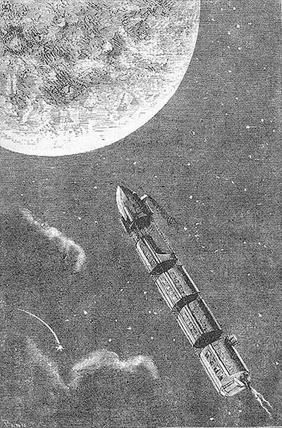

Une fusée qui va dans l'espace.

- Type: Object
- Subjects: Science
- Country: International
- Quests: [Jules Verne et les transports (fr_03)](../quest/fr_03.fr.md)

### Gants

Des couvertures chaudes pour vos mains.

- Type: Object
- Subjects: Health, Safety, Weather
- Country: International
- Quests: [Mont Blanc et montagnes (fr_08)](../quest/fr_08.fr.md)

### Gingembre

Une racine épicée utilisée en cuisine et dans les biscuits.

- Type: Object
- Subjects: Food, Plant
- Country: International
- Quests: [Pain d'épices et marché alimentaire (pl_06)](../quest/pl_06.fr.md)

### Girafe

Un animal très grand avec un long cou. Les girafes sont plus hautes que les arbres ! Elles mangent des feuilles inaccessibles aux autres animaux.

- Rationale: Giraffes are fascinating animals that show kids how nature adapts to find food
- Type: Object
- Subjects: Animal, Environment
- Country: International

### Glace

Eau gelée qui peut être très glissante.

- Type: Concept
- Subjects: Weather, Environment, Science
- Country: International
- Quests: [Mont Blanc et montagnes (fr_08)](../quest/fr_08.fr.md)

### Glacier

Glace à mouvement lent trouvée sur les hautes montagnes.

- Type: Concept
- Subjects: Geography, Science, Environment
- Country: International
- Quests: [Mont Blanc et montagnes (fr_08)](../quest/fr_08.fr.md)

### Guide de montagne
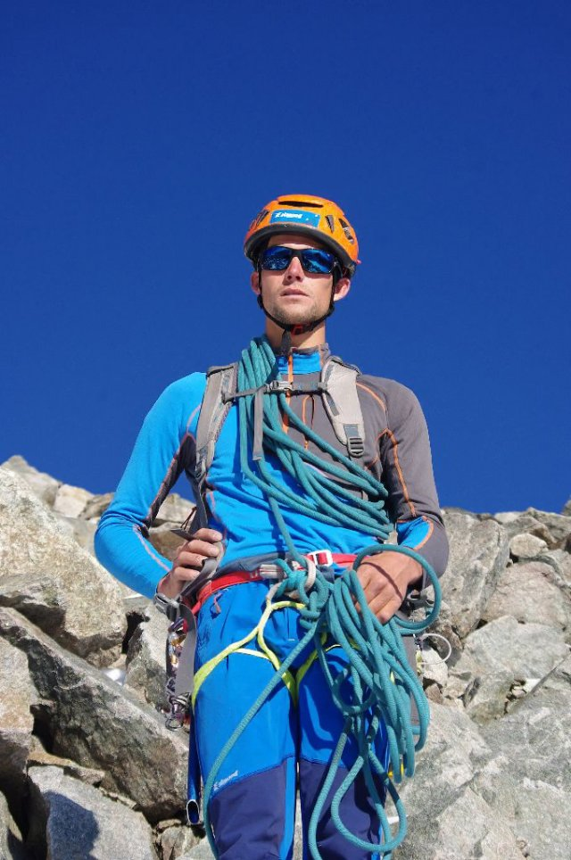

Une personne qui aide les gens à grimper en toute sécurité.

- Type: Person
- Subjects: Community, Safety, Education
- Country: International
- Quests: [Mont Blanc et montagnes (fr_08)](../quest/fr_08.fr.md)

### hangar à bateaux

Une maison flottant sur l'eau comme un bateau. On peut vivre dans des cabanes-bateaux !

- Type: Place
- Subjects: Geography, Environment
- Country: International

### Huile d'olive

Une huile spéciale à base d'olives. On l'utilise pour cuisiner des plats savoureux.

- Type: Object
- Subjects: Food, Culture
- Country: International
- Quests: [Nourriture et marché (fr_09)](../quest/fr_09.fr.md)

### ice_arctic

- Type: Place
- Country: International
- Quests: [Le zoo (pl_04)](../quest/pl_04.fr.md)

### Jour de l'Indépendance (Pologne)

Un jour férié national le 11 novembre.

- Type: Concept
- Subjects: Civics, History, Time
- Country: International
- Quests: [Découvrir Varsovie (pl_01)](../quest/pl_01.fr.md)

### Kyiv

La capitale de l'Ukraine.

- Type: Place
- Subjects: Geography, Culture
- Country: International

### L'épée de la sirène

L'épée de la sirène qui doit être rendue.

- Type: Object
- Subjects: Culture, History
- Country: International
- Quests: [Découvrir Varsovie (pl_01)](../quest/pl_01.fr.md)

### La colonne du roi Sigismond

Une haute colonne honorant le roi Sigismond sur la place du château.

- Type: Place
- Subjects: History, Culture
- Country: International
- Quests: [Découvrir Varsovie (pl_01)](../quest/pl_01.fr.md)

### La couronne du roi Sigismond

La couronne du roi qui est tombée et qui doit être retrouvée.

- Type: Object
- Subjects: History, Culture
- Country: International
- Quests: [Découvrir Varsovie (pl_01)](../quest/pl_01.fr.md)

### Lait

Une boisson blanche issue du lait de vache. Le lait contribue à la solidité des os et des dents !

- Type: Object
- Subjects: Food, Culture
- Country: International
- Quests: [Nourriture et marché (fr_09)](../quest/fr_09.fr.md)

### Levure

La levure est comme une poudre magique qui rend le pain moelleux et savoureux !

- Type: Object
- Subjects: Food, Culture
- Country: International

### Lion

Un grand félin surnommé le roi des animaux. Il vit en groupes appelés troupes.

- Type: Object
- Subjects: Animal, Environment
- Country: International
- Quests: [Le zoo (pl_04)](../quest/pl_04.fr.md)

### Lituanie

Un pays d'Europe dont la capitale est Vilnius.

- Type: Place
- Subjects: Geography, Culture
- Country: International

### Lunettes de soleil

Des lunettes qui protègent vos yeux de la lumière vive.

- Type: Object
- Subjects: Health, Safety, Weather
- Country: International
- Quests: [Mont Blanc et montagnes (fr_08)](../quest/fr_08.fr.md)

### Luxembourg

Un pays d'Europe dont la capitale est la ville de Luxembourg.

- Type: Place
- Subjects: Geography, Culture
- Country: International

### Léonard de Vinci

Un artiste et scientifique italien exceptionnel. Il a peint la Joconde et inventé les machines volantes des siècles avant les avions !

- Type: Person
- Subjects: Art, Science, History
- Year: 1452
- Country: International

### Manchot

Un oiseau qui ne peut pas voler mais qui nage très bien. Il vit dans les régions froides.

- Type: Object
- Subjects: Animal, Environment
- Country: International
- Quests: [Le zoo (pl_04)](../quest/pl_04.fr.md)

### Manteau

Une veste chaude pour le temps froid.

- Type: Object
- Subjects: Health, Safety, Weather
- Country: International
- Quests: [Mont Blanc et montagnes (fr_08)](../quest/fr_08.fr.md)

### Marchand de légumes

Une personne qui vend des fruits et légumes frais.

- Type: Person
- Subjects: History, Culture
- Country: International
- Quests: [Nourriture et marché (fr_09)](../quest/fr_09.fr.md)

### Marché médiéval

Un marché à l'ancienne où les gens achètent et vendent des marchandises.

- Type: Place
- Subjects: History, Culture, Community
- Country: International
- Quests: [Pain d'épices et marché alimentaire (pl_06)](../quest/pl_06.fr.md)

### Maria Skłodowska-Curie

Un scientifique qui a remporté deux prix Nobel.

- Type: Person
- Subjects: Science, History
- Country: International
- Quests: [Découvrir Varsovie (pl_01)](../quest/pl_01.fr.md)

### Marmotte

Un animal de montagne à fourrure qui siffle.

- Type: Object
- Subjects: Animal, Environment, Science
- Country: International
- Quests: [Mont Blanc et montagnes (fr_08)](../quest/fr_08.fr.md)

### Mazurek Dąbrowskiego

L'hymne national de la Pologne.

- Type: Concept
- Subjects: Music, History, Culture
- Country: International
- Quests: [Découvrir Varsovie (pl_01)](../quest/pl_01.fr.md)

### Menu de la cantine

Une liste des aliments autorisés à la cantine. Elle vous aide à choisir vos repas !

- Type: Object
- Subjects: Community, Culture
- Country: International
- Quests: [Le système scolaire (fr_02)](../quest/fr_02.fr.md)

### mer Baltique

Une grande mer du nord de l'Europe, où se rencontrent la Pologne, l'Allemagne et d'autres pays. Elle possède de magnifiques plages et est célèbre pour ses trésors d'ambre !

- Rationale: The Baltic Sea teaches kids about marine geography and Poland's coastal access
- Type: Place
- Subjects: Geography, Environment
- Country: International
- Quests: [Le collier d'ambre de Gdańsk (pl_05)](../quest/pl_05.fr.md)

### Minsk

La capitale de la Biélorussie.

- Type: Place
- Subjects: Geography, Culture
- Country: International

### Monnaie euro

Monnaie utilisée dans de nombreux pays d'Europe. Vous pouvez acheter des jouets et des glaces avec des euros !

- Type: Concept
- Subjects: Money, Geography
- Country: International
- Quests: [Nourriture et marché (fr_09)](../quest/fr_09.fr.md)

### Mont Blanc

La plus haute montagne d'Europe occidentale. Recouverte de neige toute l'année.

- Type: Place
- Subjects: Geography, Environment
- Country: International

### Montagne

Les piliers de la terre

- Type: Concept
- Subjects: Environment, Education
- Country: International
- Quests: [Mont Blanc et montagnes (fr_08)](../quest/fr_08.fr.md)

### Monument Nicolas Copernic (Varsovie)

Un monument à l'astronome Nicolas Copernic.

- Type: Place
- Subjects: Science, History, Culture
- Country: International
- Quests: [Découvrir Varsovie (pl_01)](../quest/pl_01.fr.md)

### Moscou

La capitale de la Russie.

- Type: Place
- Subjects: Geography, Culture
- Country: International

### Moule à pain d'épices

Un outil de forme qui permet de créer des formes de biscuits amusantes.

- Type: Object
- Subjects: Food, Art
- Country: International
- Quests: [Pain d'épices et marché alimentaire (pl_06)](../quest/pl_06.fr.md)

### Neige

Eau gelée qui tombe par temps froid.

- Type: Concept
- Subjects: Weather, Environment, Science
- Country: International
- Quests: [Mont Blanc et montagnes (fr_08)](../quest/fr_08.fr.md)

### Orange

Un fruit rond et orange, au goût sucré et juteux. L'orange est riche en vitamine C !

- Type: Object
- Subjects: Food, Culture
- Country: International
- Quests: [Nourriture et marché (fr_09)](../quest/fr_09.fr.md)

### PAIN

Un délicieux aliment à base de farine et d'eau. Vous pouvez faire des sandwichs avec du pain !

- Type: Object
- Subjects: Food, Culture
- Country: International
- Quests: [Nourriture et marché (fr_09)](../quest/fr_09.fr.md)

### Palais de la culture et de la science

Un grand bâtiment pour les musées, les théâtres et l'apprentissage.

- Type: Place
- Subjects: Culture, Education, History
- Country: International
- Quests: [Découvrir Varsovie (pl_01)](../quest/pl_01.fr.md)

### Palais présidentiel

La résidence officielle du président de la Pologne.

- Type: Place
- Subjects: Civics, History, Culture
- Country: International
- Quests: [Découvrir Varsovie (pl_01)](../quest/pl_01.fr.md)

### Panneau de DANGER

Un panneau avertissant d'un danger imminent. Soyez extrêmement prudent.

- Type: Object
- Subjects: Safety
- Country: International

### Panneau STOP

Un panneau rouge qui signifie que vous devez arrêter votre véhicule.

- Type: Object
- Subjects: Safety, Transportation
- Country: International

### Paris

Paris, capitale de la France, possède une célèbre tour haute appelée la Tour Eiffel !

- Type: Place
- Subjects: Geography, Culture
- Country: International
- Quests: [Paris ! (fr_01)](../quest/fr_01.fr.md)

### Passerelles

De petits ponts pour les piétons. Ils vous protègent de la circulation.

- Type: Place
- Subjects: Geography, Environment
- Country: International
- Quests: [Paris Seine (fr_10)](../quest/fr_10.fr.md)

### Pièces

Petite monnaie ronde en métal.

- Type: Object
- Subjects: Money
- Country: International
- Quests: [Pain d'épices et marché alimentaire (pl_06)](../quest/pl_06.fr.md)

### Pièces de złoty
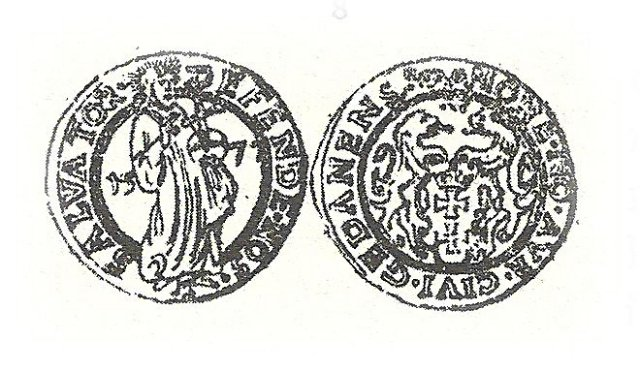

Monnaie polonaise (złoty) représentée sous forme de pièces de monnaie.

- Type: Object
- Subjects: Money, Geography
- Country: International
- Quests: [Découvrir Varsovie (pl_01)](../quest/pl_01.fr.md)

### plant_apple

- Type: Object
- Country: International
- Quests: [Le zoo (pl_04)](../quest/pl_04.fr.md)

### plant_banana

- Type: Object
- Country: International
- Quests: [Le zoo (pl_04)](../quest/pl_04.fr.md)

### plant_orange

- Type: Object
- Country: International
- Quests: [Le zoo (pl_04)](../quest/pl_04.fr.md)

### plant_wattle

- Type: Object
- Country: International
- Quests: [Le zoo (pl_04)](../quest/pl_04.fr.md)

### POISSON

Un animal qui vit et nage dans l'eau. Les poissons ont des nageoires et des branchies pour respirer sous l'eau.

- Type: Object
- Subjects: Food, Culture
- Country: International
- Quests: [Nourriture et marché (fr_09)](../quest/fr_09.fr.md)

### Poissonnier

Une personne qui vend du poisson frais et des fruits de mer.

- Type: Person
- Subjects: History, Culture
- Country: International
- Quests: [Nourriture et marché (fr_09)](../quest/fr_09.fr.md)

### Poivre Sel

Des épices qui rehaussent le goût des aliments. Le sel est blanc et le poivre est noir avec de petits morceaux.

- Type: Object
- Subjects: Food, Culture
- Country: International
- Quests: [Nourriture et marché (fr_09)](../quest/fr_09.fr.md)

### Pologne

Un pays d'Europe dont la capitale est Varsovie. La Pologne est célèbre pour ses scientifiques comme Copernic et ses délicieux pierogi !

- Type: Place
- Subjects: Geography, Culture
- Country: International

### POMME

- Type: Object
- Country: International
- Quests: [Le zoo (pl_04)](../quest/pl_04.fr.md)

### Pont du Château
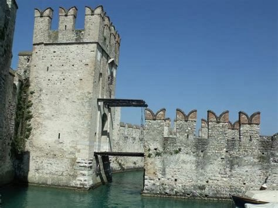

Un pont près d'un château. Les châteaux sont de grands bâtiments solides où vivaient autrefois rois et reines.

- Type: Place
- Subjects: Culture, Community
- Country: International

### Pont pour trains

Un pont spécial construit suffisamment solide pour que les trains lourds puissent traverser l'eau.

- Type: Place
- Subjects: Geography, Environment
- Country: International
- Quests: [Paris Seine (fr_10)](../quest/fr_10.fr.md)

### Pont pour voitures

Une route qui traverse l'eau pour que les voitures puissent traverser les rivières et les lacs.

- Type: Place
- Subjects: Geography, Environment
- Country: International
- Quests: [Paris Seine (fr_10)](../quest/fr_10.fr.md)

### Prague

La capitale de la République tchèque.

- Type: Place
- Subjects: Geography, Culture
- Country: International

### Président

Le dirigeant choisi pour diriger le pays. Les citoyens votent aux élections.

- Type: Person
- Subjects: History, Culture
- Country: International

### Randonnée

Promenade sur des sentiers en pleine nature.

- Type: Concept
- Subjects: Recreation, Sport, Environment
- Country: International
- Quests: [Mont Blanc et montagnes (fr_08)](../quest/fr_08.fr.md)

### Robert Lewandowski

Un célèbre joueur de football polonais.

- Type: Person
- Subjects: Sport, Culture
- Country: International
- Quests: [Découvrir Varsovie (pl_01)](../quest/pl_01.fr.md)

### Russie

Un pays d'Europe. La capitale est Moscou.

- Type: Place
- Subjects: Geography, Culture
- Country: International

### Règle

Un outil droit utilisé pour mesurer la longueur des objets. Les règles comportent des chiffres et des lignes.

- Type: Object
- Subjects: Math
- Country: International
- Quests: [Le système scolaire (fr_02)](../quest/fr_02.fr.md)

### République tchèque

Un pays d'Europe dont la capitale est Prague.

- Type: Place
- Subjects: Geography, Culture
- Country: International

### Sac à dos

Un sac que vous portez sur votre dos.

- Type: Object
- Subjects: Recreation, Transportation, Education
- Country: International
- Quests: [Mont Blanc et montagnes (fr_08)](../quest/fr_08.fr.md)

### SEL

Des cristaux blancs qui améliorent le goût des aliments.

- Type: Object
- Subjects: Food, Culture
- Country: International

### Singe

Un animal intelligent qui peut grimper et jouer. Certains singes vivent en grandes familles.

- Type: Object
- Subjects: Animal, Environment
- Country: International
- Quests: [Le zoo (pl_04)](../quest/pl_04.fr.md)

### Ski

Glisser sur la neige avec des skis.

- Type: Concept
- Subjects: Sport, Recreation
- Country: International
- Quests: [Mont Blanc et montagnes (fr_08)](../quest/fr_08.fr.md)

### Slovaquie

Un pays d'Europe dont la capitale est Bratislava.

- Type: Place
- Subjects: Geography, Culture
- Country: International

### Soleil

Une lumière vive qui peut se refléter sur la neige.

- Type: Concept
- Subjects: Science, Weather, Environment
- Country: International
- Quests: [Mont Blanc et montagnes (fr_08)](../quest/fr_08.fr.md)

### Sommet

Le sommet d'une montagne.

- Type: Concept
- Subjects: Geography, Environment, Education
- Country: International
- Quests: [Mont Blanc et montagnes (fr_08)](../quest/fr_08.fr.md)

### Stade national (Varsovie)

Un stade moderne pour les matchs de football et les concerts.

- Type: Place
- Subjects: Sport, Culture, Community
- Country: International
- Quests: [Découvrir Varsovie (pl_01)](../quest/pl_01.fr.md)

### Statue des Guerres et de Sawa

Une statue représentant la légende de la ville sur les guerres et Sawa.

- Type: Place
- Subjects: Culture, History
- Country: International
- Quests: [Découvrir Varsovie (pl_01)](../quest/pl_01.fr.md)

### Suisse

Un pays d'Europe dont la capitale est Berne. La Suisse est célèbre pour ses montagnes et son fromage.

- Type: Place
- Subjects: Geography, Culture
- Country: International

### terrain de football

Le terrain en herbe où se joue le football.

- Type: Place
- Subjects: Sport, Recreation, Community
- Country: International
- Quests: [Découvrir Varsovie (pl_01)](../quest/pl_01.fr.md)

### Tomate

Un fruit rouge et rond qui pousse sur les plantes. On utilise les tomates pour faire de la sauce à pizza !

- Type: Object
- Subjects: Food, Culture
- Country: International
- Quests: [Nourriture et marché (fr_09)](../quest/fr_09.fr.md)

### Tram

Un train urbain qui circule sur des rails dans la rue.

- Type: Object
- Subjects: Transportation, Technology, Community
- Country: International
- Quests: [Découvrir Varsovie (pl_01)](../quest/pl_01.fr.md)

### Triangle

Une forme à trois côtés droits et trois coins. Les triangles ressemblent à des parts de pizza !

- Type: Concept
- Subjects: Math
- Country: International
- Quests: [Le système scolaire (fr_02)](../quest/fr_02.fr.md)

### Ukraine

Un pays d'Europe. La capitale est Kyiv.

- Type: Place
- Subjects: Geography, Culture
- Country: International

### Un bateau pour les gens

Un bateau qui transporte des personnes d'un endroit à un autre à travers l'eau.

- Type: Place
- Subjects: Geography, Environment
- Country: International

### Varsovie

La capitale de la Pologne.

- Type: Place
- Subjects: Geography, Culture
- Country: International

### Vendeur d'œufs

Une personne qui vend des œufs.

- Type: Person
- Subjects: Community, Food
- Country: International
- Quests: [Pain d'épices et marché alimentaire (pl_06)](../quest/pl_06.fr.md)

### Vendeur de produits laitiers

Une personne qui vend du lait, du beurre et du fromage.

- Type: Person
- Subjects: Community, Food
- Country: International
- Quests: [Pain d'épices et marché alimentaire (pl_06)](../quest/pl_06.fr.md)

### Vent

Un air en mouvement qui peut sembler fort en montagne.

- Type: Concept
- Subjects: Weather, Environment
- Country: International
- Quests: [Mont Blanc et montagnes (fr_08)](../quest/fr_08.fr.md)

### Ville de Luxembourg

La capitale du Luxembourg.

- Type: Place
- Subjects: Geography, Culture
- Country: International

### Vilnius

La capitale de la Lituanie.

- Type: Place
- Subjects: Geography, Culture
- Country: International

### Voiture

Un petit véhicule pour les routes.

- Type: Object
- Subjects: Transportation
- Country: International
- Quests: [Découvrir Varsovie (pl_01)](../quest/pl_01.fr.md)

### Vélo

Un véhicule à deux roues sur lequel on pédale.

- Type: Object
- Subjects: Transportation, Sport, Health
- Country: International
- Quests: [Découvrir Varsovie (pl_01)](../quest/pl_01.fr.md)

### Éléphant

Un gros animal avec une trompe. Les éléphants sont les plus grands animaux terrestres. Ils ont de grandes oreilles et adorent arroser !

- Rationale: Elephants are amazing animals that kids love learning about at the zoo!
- Type: Object
- Subjects: Animal, Environment
- Country: International
- Words: [elephant](../words/elephant.md), [zoo](../words/zoo.md)
- Quests: [Le zoo (pl_04)](../quest/pl_04.fr.md)

### Épicier

Une personne qui vend de nombreux types d’aliments et de boissons.

- Type: Person
- Subjects: History, Culture
- Country: International
- Quests: [Nourriture et marché (fr_09)](../quest/fr_09.fr.md)

### Île-de-France

Région de France où se trouve la capitale Paris. De nombreuses personnes y vivent !

- Type: Place
- Subjects: Geography, Environment
- Country: International
- Quests: [Paris ! (fr_01)](../quest/fr_01.fr.md)

### Œufs

Nourriture provenant de poulets utilisée pour la cuisson et la pâtisserie.

- Type: Object
- Subjects: Food, Animal
- Country: International
- Quests: [Pain d'épices et marché alimentaire (pl_06)](../quest/pl_06.fr.md)

## France

### 20 000 lieues sous les mers

Un livre de Jules Verne relatant des aventures sous-marines à bord du sous-marin Nautilus. Vous y rencontrerez des créatures marines géantes !

- Type: Object
- Subjects: Literature
- Year: 1871
- Country: France
- Quests: [Jules Verne et les transports (fr_03)](../quest/fr_03.fr.md)

### 24 Heures du Mans

Une course automobile qui dure 24 heures. Les équipes roulent jour et nuit.

- Type: Concept
- Subjects: Sport, Culture, History
- Country: France

### Allons les enfants

Les premiers mots de la première ligne de l’hymne.

- Type: Object
- Subjects: Music, Education, Culture
- Country: France
- Quests: [La Marseillaise (fr_11)](../quest/fr_11.fr.md)

### Arc

Une arme qui tire des flèches.

- Type: Object
- Subjects: History, Technology
- Country: France

### Arc-boutant

Bras de pierre à l'extérieur qui aident à soutenir les hauts murs.

- Type: Concept
- Subjects: Technology, History, Art
- Country: France
- Quests: [Paris ! (fr_01)](../quest/fr_01.fr.md)

### Armure

Vêtement de protection en métal pour chevalier.

- Type: Object
- Subjects: History, Safety
- Country: France

### Ascenseurs de la Tour Eiffel

Ascenseurs qui emmènent les visiteurs jusqu'à la tour de fer.

- Type: Object
- Subjects: Technology, Transportation
- Country: France
- Quests: [Paris ! (fr_01)](../quest/fr_01.fr.md)

### Baguette française

Un pain long et croustillant, l'aliment le plus célèbre en France. Les Français achètent des baguettes fraîches tous les jours à la boulangerie !

- Rationale: Baguettes are iconic French culture that kids can easily understand and remember
- Type: Object
- Subjects: Food, Culture
- Year: 1700
- Country: France
- Quests: [Paris ! (fr_01)](../quest/fr_01.fr.md), [Développement (dev)](../quest/dev.fr.md)

### Bateau sur la Seine

Un bateau exceptionnel qui navigue sur la Seine à Paris. Depuis l'eau, vous pourrez admirer la Tour Eiffel et d'autres magnifiques monuments !

- Rationale: Boat tours help kids see Paris from a different perspective and understand river transportation
- Type: Concept
- Subjects: Transportation, Geography, Culture
- Year: 1900
- Country: France
- Quests: [Paris Seine (fr_10)](../quest/fr_10.fr.md)

### Bouillabaisse

Une soupe de poisson typique de Marseille, dans le sud de la France. Elle est composée de différentes variétés de poissons et dégage une délicieuse odeur !

- Type: Object
- Subjects: Food, Culture
- Year: 1700
- Country: France
- Quests: [Nourriture et marché (fr_09)](../quest/fr_09.fr.md)

### Carte de la Seine

Une image qui montre la Seine et où elle coule à travers le pays.

- Type: Object
- Subjects: Geography, Environment
- Country: France
- Quests: [Paris Seine (fr_10)](../quest/fr_10.fr.md)

### Carte de la Seine à Paris

Une image qui montre comment la Seine traverse la ville de Paris.

- Type: Object
- Subjects: Science
- Country: France
- Quests: [Paris Seine (fr_10)](../quest/fr_10.fr.md)

### Casque

Un chapeau en métal qui protège la tête.

- Type: Object
- Subjects: History, Safety
- Country: France

### Casque (sécurité routière)

Un casque de sécurité pour protéger votre tête lorsque vous roulez.

- Type: Object
- Subjects: Safety, Health, Education
- Country: France

### Catapulte

Une machine qui lance des pierres au loin.

- Type: Object
- Subjects: Technology, History
- Country: France

### Cathédrale

Une église très grande et importante dans une ville.

- Type: Place
- Subjects: Culture, History, Education
- Country: France
- Quests: [Paris ! (fr_01)](../quest/fr_01.fr.md)

### Chambre royale

Une chambre élégante avec un grand lit à baldaquin.

- Type: Place
- Subjects: Culture, History
- Country: France

### chapeau à plumes

Un beau chapeau avec une plume pour le style.

- Type: Object
- Subjects: Culture, History
- Country: France

### Charte de la laïcité

Un ensemble de règles visant à respecter les croyances de chacun. Il contribue à une coexistence pacifique.

- Type: Concept
- Subjects: Community, Culture
- Year: 2013
- Country: France
- Quests: [Le système scolaire (fr_02)](../quest/fr_02.fr.md), [Jules Verne et les transports (fr_03)](../quest/fr_03.fr.md)

### Chaussures de danse

Chaussures conçues pour danser dans une salle de bal.

- Type: Object
- Subjects: Culture, Recreation
- Country: France

### Château de Chambord

Un grand palais avec de nombreuses fenêtres et jardins.

- Type: Place
- Subjects: History, Culture, Geography
- Country: France

### Château de Chinon

Le château de Chinon est une puissante forteresse de pierre perchée sur une colline surplombant la Loire. Jadis, des rois y séjournèrent, et Jeanne d'Arc vint y rencontrer le futur roi de France.

- Type: Place
- Subjects: History
- Country: France
- Quests: [Un conte de deux châteaux (fr_05)](../quest/fr_05.fr.md)

### Château de Chinon

Une solide forteresse en pierre utilisée pour la défense.

- Type: Place
- Subjects: History, Geography, Culture
- Country: France

### Cinq semaines en ballon

Un livre de Jules Verne sur la traversée de l'Afrique en montgolfière. Plein d'aventures et de découvertes !

- Type: Object
- Subjects: Literature
- Year: 1863
- Country: France
- Quests: [Jules Verne et les transports (fr_03)](../quest/fr_03.fr.md)

### Code d'Hammourabi

Une pierre sur laquelle sont gravées de très vieilles lois.

- Type: Object
- Subjects: History, Civics
- Country: France
- Quests: [Paris ! (fr_01)](../quest/fr_01.fr.md)

### Collège en France
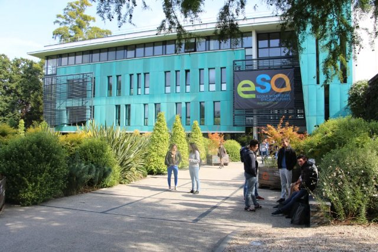

Collège en France pour les enfants de 11 à 15 ans. Les élèves apprennent de nombreuses matières et se préparent au lycée.

- Rationale: Understanding the French school system helps kids compare education across countries
- Type: Concept
- Subjects: Education, Culture
- Year: 1975
- Country: France
- Quests: [Le système scolaire (fr_02)](../quest/fr_02.fr.md), [Jules Verne et les transports (fr_03)](../quest/fr_03.fr.md)

### Concernant

Une note de musique.

- Type: Concept
- Subjects: Music, Education
- Country: France

### Couronnement de Napoléon (David)

Un immense tableau représentant une cérémonie d’un empereur français.

- Type: Object
- Subjects: Art, History
- Country: France
- Quests: [Paris ! (fr_01)](../quest/fr_01.fr.md)

### De la patrie

Paroles de la première ligne de l’hymne.

- Type: Object
- Subjects: Music, Education, Culture
- Country: France
- Quests: [La Marseillaise (fr_11)](../quest/fr_11.fr.md)

### De la Terre à la Lune

Un livre de Jules Verne sur la Lune dans un grand canon ! Il a été écrit avant l'existence des vraies fusées.

- Type: Object
- Subjects: Literature, Space, Science
- Year: 1865
- Country: France
- Quests: [Jules Verne et les transports (fr_03)](../quest/fr_03.fr.md)

### Drapeau de la France

Le drapeau français comporte trois bandes verticales : bleu, blanc et rouge. Ces couleurs représentent la liberté, l'égalité et la fraternité !

- Rationale: The French flag is essential for teaching French national identity and values
- Type: Concept
- Subjects: Geography, Culture
- Year: 1794
- Country: France
- Quests: [Les voisins de la France (fr_00)](../quest/fr_00.fr.md)

### Drapeau de Monaco

Le drapeau de Monaco est composé de bandes horizontales rouges et blanches. Monaco est une petite ville, mais célèbre pour ses voitures de luxe et ses palais royaux en bord de mer !

- Rationale: Monaco shows kids how small places can be special and important
- Type: Concept
- Subjects: Geography, Culture
- Year: 1881
- Country: France
- Quests: [Les voisins de la France (fr_00)](../quest/fr_00.fr.md)

### Entrée du circuit du Mans

La zone d'entrée du circuit du Mans.

- Type: Place
- Subjects: Geography, Sport, Culture
- Country: France

### Est arrivé

Paroles de la première ligne de l’hymne.

- Type: Object
- Subjects: Music, Education, Culture
- Country: France
- Quests: [La Marseillaise (fr_11)](../quest/fr_11.fr.md)

### Exposition universelle (1889)

La grande exposition universelle où la Tour Eiffel a été présentée.

- Type: Concept
- Subjects: History, Culture
- Country: France
- Quests: [Paris ! (fr_01)](../quest/fr_01.fr.md)

### Fa

Une note de musique.

- Type: Concept
- Subjects: Music, Education
- Country: France

### Failles

Fenêtres étroites pour tirer des flèches en toute sécurité.

- Type: Concept
- Subjects: History, Technology
- Country: France

### Façade du château (fenêtres)

Un mur avant avec de nombreuses grandes fenêtres pour la lumière et les vues.

- Type: Concept
- Subjects: Culture, Technology
- Country: France

### Feux de signalisation
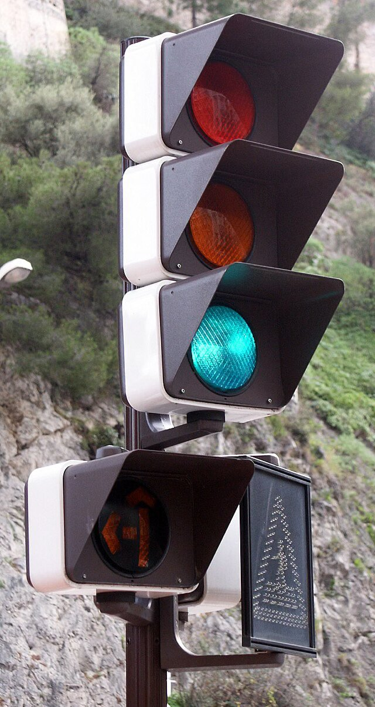

Des lampadaires qui vous indiquent quand vous devez vous ARRÊTER ou PARTIR.

- Type: Object
- Subjects: Safety, Education, Transportation
- Country: France

### Flèches

Des bâtons pointus tirés d'un arc.

- Type: Object
- Subjects: History, Technology
- Country: France

### France

Un pays d'Europe. La capitale est Paris.

- Type: Place
- Subjects: Geography, Culture
- Country: France

### Gare du Mans

La gare où vous prenez le train pour rentrer chez vous.

- Type: Place
- Subjects: Geography, Transportation, Community
- Country: France

### Gargouille

Une statue drôle ou effrayante qui fonctionne également comme une gouttière.

- Type: Concept
- Subjects: Art, Technology, History
- Country: France
- Quests: [Paris ! (fr_01)](../quest/fr_01.fr.md)

### Gustave Eiffel
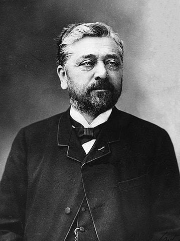

L'homme qui a construit la tour Eiffel ! C'était un ingénieur passionné de construction en fer et il a créé la tour la plus célèbre du monde.

- Type: Person
- Subjects: History, Culture, Science
- Year: 1832
- Country: France
- Quests: [Paris ! (fr_01)](../quest/fr_01.fr.md)

### Herse

Une lourde porte qui s'abaisse pour bloquer la porte.

- Type: Object
- Subjects: Technology, History, Safety
- Country: France

### Incendie de Notre-Dame

En 2019, un important incendie a endommagé la magnifique cathédrale Notre-Dame de Paris. De nombreuses personnes ont œuvré ensemble pour sauver cet important édifice.

- Rationale: This event teaches kids about protecting cultural heritage and community cooperation
- Type: Concept
- Subjects: History, Culture, Environment
- Year: 2019
- Country: France
- Quests: [Paris ! (fr_01)](../quest/fr_01.fr.md)

### Jardins formels

Jardins décoratifs pour promenades et fêtes.

- Type: Place
- Subjects: Culture, Environment
- Country: France

### Jean Michel Jarre

Musicien français célèbre pour sa musique électronique, il réalise de grands spectacles de lumière.

- Type: Person
- Subjects: Music, Culture, Technology
- Year: 2000
- Country: France

### Jules Verne

Un écrivain français qui a imaginé des aventures extraordinaires avant même qu'elles ne soient possibles ! Il a écrit sur les sous-marins, les fusées et les voyages autour du monde.

- Rationale: Jules Verne shows kids how imagination and science can work together
- Type: Person
- Subjects: Literature, Science, History
- Year: 1828
- Country: France
- Quests: [Jules Verne et les transports (fr_03)](../quest/fr_03.fr.md)

### La

Une note de musique.

- Type: Concept
- Subjects: Music, Education
- Country: France

### La liberté guidant le peuple

Un célèbre tableau sur la liberté et le courage. Il représente une femme courageuse brandissant le drapeau français et menant le peuple à la lutte pour ses droits.

- Rationale: This painting teaches kids about fighting for freedom and the French Revolution
- Type: Object
- Subjects: Art, History, Culture
- Year: 1830
- Country: France

### La Marseillaise

L'hymne national français. On le chante lors des grands événements et des compétitions sportives.

- Type: Concept
- Subjects: Music, Culture
- Year: 1885
- Country: France
- Quests: [La Marseillaise (fr_11)](../quest/fr_11.fr.md)

### Le jour de la gloire

Paroles de la première ligne de l’hymne.

- Type: Object
- Subjects: Music, Education, Culture
- Country: France
- Quests: [La Marseillaise (fr_11)](../quest/fr_11.fr.md)

### Le Mans

Une ville de France, célèbre pour une course automobile de 24 heures.

- Type: Place
- Subjects: Geography, Culture, Community
- Country: France

### Le scribe assis

Une ancienne statue égyptienne d'une personne en train d'écrire.

- Type: Object
- Subjects: Art, History
- Country: France
- Quests: [Paris ! (fr_01)](../quest/fr_01.fr.md)

### Le tour du monde en quatre-vingts jours

Un livre passionnant de Jules Verne sur les voyages autour du monde très rapidement en utilisant des trains, des bateaux et des montgolfières !

- Type: Object
- Subjects: Literature
- Year: 1873
- Country: France
- Quests: [Jules Verne et les transports (fr_03)](../quest/fr_03.fr.md)

### Loire

Un long fleuve en France avec de nombreux châteaux le long de ses rives.

- Type: Place
- Subjects: Geography, Environment
- Country: France

### Luth

Un instrument à cordes joué à la cour.

- Type: Object
- Subjects: Music, Culture, History
- Country: France

### Lycée en France

Lycée en France pour les adolescents de 16 à 18 ans. Les élèves étudient dur pour l'examen du baccalauréat pour aller à l'université.

- Rationale: The Lycée system shows kids the path to higher education in France
- Type: Concept
- Subjects: Education, Culture
- Year: 1975
- Country: France
- Quests: [Le système scolaire (fr_02)](../quest/fr_02.fr.md)

### Masque de mascarade

Un masque pour les fêtes et les bals.

- Type: Object
- Subjects: Culture, History, Recreation
- Country: France

### Mi

Une note de musique.

- Type: Concept
- Subjects: Music, Education
- Country: France

### Montgolfière

Un ballon volant à l'air chaud. Le premier a volé en France.

- Type: Object
- Subjects: Transportation
- Country: France
- Quests: [Jules Verne et les transports (fr_03)](../quest/fr_03.fr.md)

### Notre-Dame de Paris

Une magnifique cathédrale de Paris. Ses vitraux colorés racontent des histoires.

- Type: Place
- Subjects: Geography, Environment
- Year: 1885
- Country: France
- Quests: [Paris ! (fr_01)](../quest/fr_01.fr.md)

### Parapet
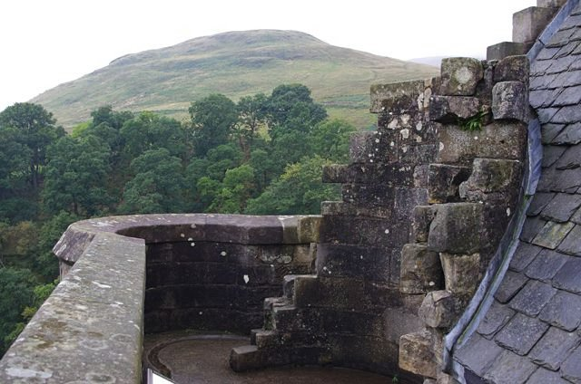

Le muret au bord des remparts.

- Type: Concept
- Subjects: History, Technology
- Country: France

### Partition musicale

Les notes écrites et les paroles d'une chanson.

- Type: Object
- Subjects: Education, Music
- Country: France

### Passage piéton

Bandes blanches là où les gens traversent la rue.

- Type: Object
- Subjects: Safety, Education, Transportation
- Country: France

### Passeur

Une personne qui rame en barque sur la Loire.

- Type: Person
- Subjects: Community, Transportation
- Country: France

### Persienne

Un immense musée rempli d'œuvres d'art. C'est là que vit la Joconde.

- Type: Place
- Subjects: Art, Culture, History
- Year: 1793
- Country: France
- Quests: [Paris ! (fr_01)](../quest/fr_01.fr.md)

### Piano

Un instrument à clavier utilisé pour jouer des mélodies et des accords.

- Type: Object
- Subjects: Music, Education
- Country: France

### Pirates français

De braves marins qui sillonnaient les mers pour le roi de France. On les appelait corsaires et ils protégeaient les navires français de l'ennemi.

- Rationale: Pirates capture kids' imagination while teaching about maritime history and French naval power
- Type: Concept
- Subjects: History, Culture, Transportation
- Year: 1600
- Country: France
- Quests: [Nourriture et marché (fr_09)](../quest/fr_09.fr.md)

### Pont Alexandre III

Un beau pont à Paris avec des décorations fantaisistes et des statues dorées dessus.

- Type: Place
- Subjects: Geography, Environment
- Country: France
- Quests: [Paris Seine (fr_10)](../quest/fr_10.fr.md)

### Pont-levis

Un pont qui se lève pour protéger l'entrée d'un château.

- Type: Object
- Subjects: Technology, History, Safety
- Country: France

### Pyramide du Louvre
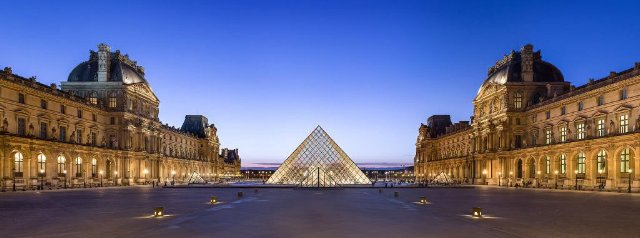

La pyramide de verre qui constitue l’entrée moderne du Louvre.

- Type: Place
- Subjects: Art, Culture, Technology
- Country: France
- Quests: [Paris ! (fr_01)](../quest/fr_01.fr.md)

### Remparts

De hauts murs sur lesquels vous pouvez marcher pour garder le château.

- Type: Concept
- Subjects: History, Technology
- Country: France

### Rosace

Un grand vitrail rond qui raconte des histoires avec la lumière.

- Type: Concept
- Subjects: Art, Culture, History
- Country: France
- Quests: [Paris ! (fr_01)](../quest/fr_01.fr.md)

### Révolution française

Une époque dans les années 1790 où la France a changé de gouvernement.

- Type: Concept
- Subjects: History, Civics, Time, Culture
- Country: France

### Salle de bal
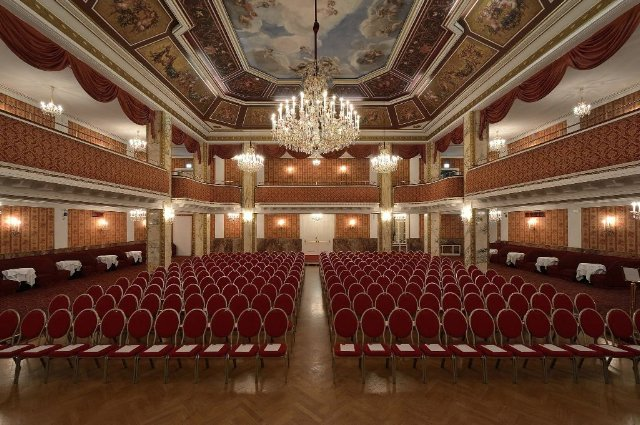

Une grande salle pour la danse et la musique.

- Type: Place
- Subjects: Culture, History
- Country: France

### Scooter

Une petite trottinette à deux roues.

- Type: Object
- Subjects: Transportation, Recreation, Safety
- Country: France

### Seine

Un fleuve de 777 kilomètres de long dans le nord de la France

- Type: Place
- Subjects: Geography
- Country: France
- Quests: [Paris Seine (fr_10)](../quest/fr_10.fr.md)

### Serment des Horaces (David)

Un tableau de trois frères faisant une promesse courageuse.

- Type: Object
- Subjects: Art, History
- Country: France
- Quests: [Paris ! (fr_01)](../quest/fr_01.fr.md)

### Si

Une note de musique.

- Type: Concept
- Subjects: Music, Education
- Country: France

### Sol

Une note de musique.

- Type: Concept
- Subjects: Music, Education
- Country: France

### Sous-marin (Le Nautilus)

Un sous-marin du roman de Jules Verne. Il pouvait explorer les profondeurs marines.

- Type: Object
- Subjects: Literature, Science
- Country: France
- Quests: [Jules Verne et les transports (fr_03)](../quest/fr_03.fr.md)

### Tour Eiffel

Une haute tour, symbole de Paris. Construite en fer, elle mesure 300 mètres de haut. De là-haut, on peut admirer toute la ville.

- Type: Place
- Subjects: Geography, History, Culture
- Year: 1889
- Country: France
- Quests: [Paris ! (fr_01)](../quest/fr_01.fr.md)

### Ut

Une note de musique.

- Type: Concept
- Subjects: Music, Education
- Country: France

### Vallée de la Loire

Une région française célèbre avec de nombreux châteaux.

- Type: Place
- Subjects: Geography, History, Culture
- Country: France

### Victoire ailée de Samothrace

Une célèbre sculpture antique d'une déesse avec des ailes.

- Type: Object
- Subjects: Art, History
- Country: France
- Quests: [Paris ! (fr_01)](../quest/fr_01.fr.md)

### Voiture de course

Une voiture très rapide utilisée sur les pistes de course.

- Type: Object
- Subjects: Sport, Technology
- Country: France

### Vélo

Un véhicule à deux roues sur lequel on pédale.

- Type: Object
- Subjects: Transportation, Health, Recreation
- Country: France

### Xylophone

Un instrument avec des barres sur lesquelles on frappe pour prendre des notes.

- Type: Object
- Subjects: Music, Education
- Country: France

### École maternelle

École pour les petits de 3 à 5 ans. On apprend en jouant et en explorant.

- Type: Concept
- Subjects: Education, Culture
- Year: 1975
- Country: France
- Quests: [Le système scolaire (fr_02)](../quest/fr_02.fr.md)

### École primaire en France

École pour les enfants de 6 à 10 ans. Vous apprenez à lire, à écrire et à compter.

- Type: Concept
- Subjects: Education, Culture
- Year: 1975
- Country: France
- Quests: [Le système scolaire (fr_02)](../quest/fr_02.fr.md)

### Écriture cursive

Une façon particulière d'écrire où toutes les lettres d'un mot sont reliées entre elles. En France, les enfants apprennent cette écriture à l'école.

- Rationale: Cursive writing is an important part of French education and cultural identity
- Type: Concept
- Subjects: Education, Culture, Art
- Year: 1800
- Country: France
- Quests: [Le système scolaire (fr_02)](../quest/fr_02.fr.md)

### Église

Un bâtiment spécial où les gens se réunissent pour prier et chanter.

- Type: Place
- Subjects: Culture, Civics, Education
- Country: France
- Quests: [Paris ! (fr_01)](../quest/fr_01.fr.md)

### Épée

Une longue lame utilisée par les chevaliers.

- Type: Object
- Subjects: History, Culture
- Country: France

## Poland

### Ambre

Résine d'arbre fossile brillante appelée « Or de la Baltique ».

- Type: Object
- Subjects: History, Culture, Science
- Country: Poland
- Quests: [Le collier d'ambre de Gdańsk (pl_05)](../quest/pl_05.fr.md)

### Ancien hôtel de ville (Wroclaw)
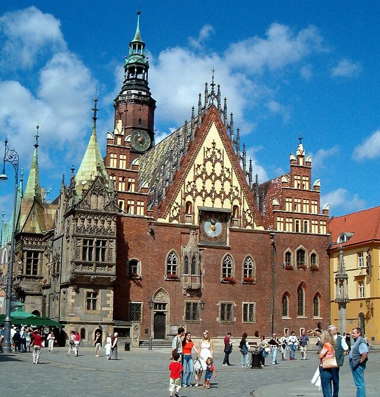

Un magnifique édifice gothique sur la place principale. Il possède une horloge célèbre.

- Type: Place
- Subjects: Geography, Environment
- Country: Poland
- Quests: [Le grand sauvetage des nains de Wrocław (pl_02)](../quest/pl_02.fr.md)

### Astronomie

La science qui étudie le Soleil, la Lune, les étoiles et les planètes.

- Type: Concept
- Subjects: Science, Space
- Country: Poland
- Quests: [Copernic et le système solaire (pl_07)](../quest/pl_07.fr.md)

### Barge

Un bateau long et plat qui transporte des marchandises sur les rivières.

- Type: Object
- Subjects: Transportation, Geography
- Country: Poland
- Quests: [Fleuve Oder (pl_03)](../quest/pl_03.fr.md)

### Bateau

Un véhicule qui se déplace sur l'eau.

- Type: Object
- Subjects: Transportation
- Country: Poland
- Quests: [Fleuve Oder (pl_03)](../quest/pl_03.fr.md)

### Bateau

Un grand bateau qui transporte des personnes ou des marchandises.

- Type: Object
- Subjects: Transportation
- Country: Poland
- Quests: [Le collier d'ambre de Gdańsk (pl_05)](../quest/pl_05.fr.md)

### Chambre d'ambre

Une célèbre pièce en ambre avec une histoire mystérieuse.

- Type: Concept
- Subjects: History, Culture
- Country: Poland
- Quests: [Le collier d'ambre de Gdańsk (pl_05)](../quest/pl_05.fr.md)

### Collier

Un collier de perles ou de coquillages que vous portez autour du cou.

- Type: Object
- Subjects: Art, Culture
- Country: Poland
- Quests: [Le collier d'ambre de Gdańsk (pl_05)](../quest/pl_05.fr.md)

### Coquillage

Une coquille dure provenant d'un animal marin ; idéale pour l'artisanat.

- Type: Object
- Subjects: Animal, Environment, Art
- Country: Poland
- Quests: [Le collier d'ambre de Gdańsk (pl_05)](../quest/pl_05.fr.md)

### Coupeur

Un petit bateau de pêche utilisé en mer.

- Type: Object
- Subjects: Transportation, Technology
- Country: Poland
- Quests: [Le collier d'ambre de Gdańsk (pl_05)](../quest/pl_05.fr.md)

### Côte de la mer Baltique

La côte sablonneuse le long de la mer Baltique.

- Type: Place
- Subjects: Geography, Environment
- Country: Poland
- Quests: [Le collier d'ambre de Gdańsk (pl_05)](../quest/pl_05.fr.md)

### Directeur du zoo

La personne qui dirige le zoo et aide les visiteurs.

- Type: Person
- Subjects: Community, Education
- Country: Poland
- Quests: [Le zoo (pl_04)](../quest/pl_04.fr.md)

### Drapeau de la Pologne

Le drapeau polonais est orné de bandes horizontales blanches et rouges. La Pologne est célèbre pour ses scientifiques comme Copernic et ses délicieux pierogi !

- Rationale: The Polish flag is essential for Polish language learning and cultural identity
- Type: Concept
- Subjects: Geography, Culture
- Year: 1919
- Country: Poland
- Quests: [Les voisins de la Pologne (pl_00)](../quest/pl_00.fr.md)

### Drapeau de Wrocław

Le drapeau de la ville qu'il faut retrouver et restituer.

- Type: Object
- Subjects: Culture, Community, History
- Country: Poland
- Quests: [Le zoo (pl_04)](../quest/pl_04.fr.md)

### Enclos pour animaux

Un espace sûr conçu pour que les animaux puissent vivre au zoo.

- Type: Place
- Subjects: Animal, Safety
- Country: Poland
- Quests: [Le zoo (pl_04)](../quest/pl_04.fr.md)

### Expert nain

Un guide sympathique qui connaît tout sur les nains.

- Type: Person
- Subjects: Education, Culture
- Country: Poland
- Quests: [Le grand sauvetage des nains de Wrocław (pl_02)](../quest/pl_02.fr.md)

### Filet de pêche

Un filet utilisé pour attraper du poisson.

- Type: Object
- Subjects: Technology, Community
- Country: Poland
- Quests: [Le collier d'ambre de Gdańsk (pl_05)](../quest/pl_05.fr.md)

### Flots

Eau en mouvement sur la mer.

- Type: Concept
- Subjects: Environment, Science
- Country: Poland
- Quests: [Le collier d'ambre de Gdańsk (pl_05)](../quest/pl_05.fr.md)

### Fontaine multimédia de Wrocław
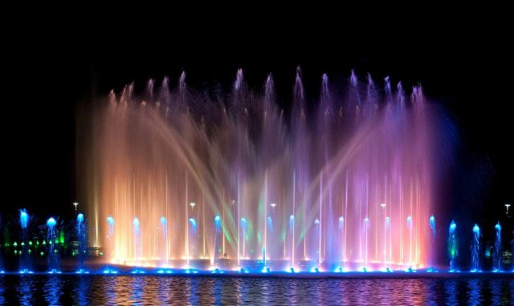

De l'eau qui danse avec de la musique et des lumières colorées.

- Type: Place
- Subjects: Culture, Technology, Recreation
- Country: Poland
- Quests: [Le grand sauvetage des nains de Wrocław (pl_02)](../quest/pl_02.fr.md)

### Frédéric Chopin

Célèbre compositeur polonais pour piano, il a composé une musique magnifique qui évoque la danse ou les histoires. Sa musique rend les gens heureux ou tristes.

- Rationale: Chopin introduces kids to classical music and shows how music can express emotions
- Type: Person
- Subjects: Music, History, Culture
- Year: 1810
- Country: Poland
- Quests: [Découvrir Varsovie (pl_01)](../quest/pl_01.fr.md)

### Gardien de zoo

Une personne qui s'occupe des animaux au zoo.

- Type: Person
- Subjects: Community, Animal, Education
- Country: Poland
- Quests: [Le zoo (pl_04)](../quest/pl_04.fr.md)

### Gdańsk

Une ville portuaire en Pologne sur la mer Baltique.

- Type: Place
- Subjects: Geography, History, Culture
- Country: Poland
- Quests: [Le collier d'ambre de Gdańsk (pl_05)](../quest/pl_05.fr.md)

### Grue Żuraw
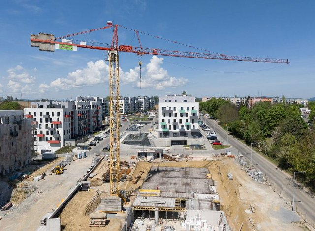

Une ancienne grue portuaire et une porte de ville sur la rivière.

- Type: Place
- Subjects: History, Technology, Geography
- Country: Poland
- Quests: [Le collier d'ambre de Gdańsk (pl_05)](../quest/pl_05.fr.md)

### Guerres et Sawa
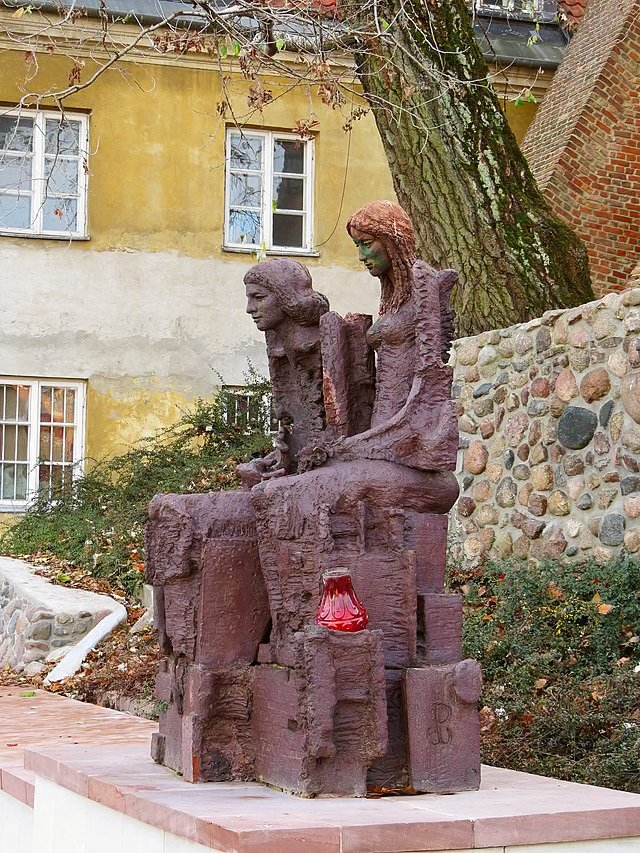

Deux personnages légendaires ont donné son nom à Varsovie. Wars était un guerrier courageux et Sawa était une belle sirène vivant dans la Vistule.

- Type: Concept
- Subjects: Community, Culture
- Year: 1300
- Country: Poland
- Quests: [Découvrir Varsovie (pl_01)](../quest/pl_01.fr.md)

### Hôtel de ville de Torun

Un grand bâtiment gothique à Toruń à côté de la place du marché.

- Type: Place
- Subjects: History, Geography, Culture
- Country: Poland
- Quests: [Pain d'épices et marché alimentaire (pl_06)](../quest/pl_06.fr.md)

### Hôtel de ville principal
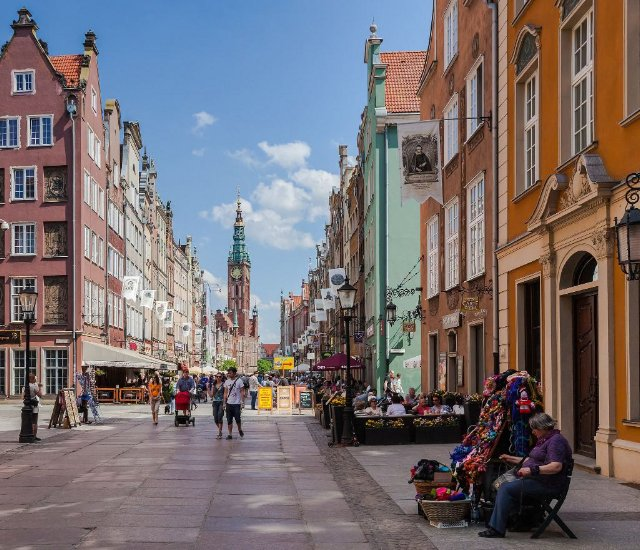

Un grand hôtel de ville avec une tour et un musée.

- Type: Place
- Subjects: History, Culture
- Country: Poland
- Quests: [Le collier d'ambre de Gdańsk (pl_05)](../quest/pl_05.fr.md)

### Joint

Un animal marin sauvage qui se repose sur les plages.

- Type: Object
- Subjects: Animal, Environment, Safety
- Country: Poland
- Quests: [Le collier d'ambre de Gdańsk (pl_05)](../quest/pl_05.fr.md)

### Jupiter

La plus grande planète, célèbre pour la Grande Tache Rouge.

- Type: Object
- Subjects: Space, Science
- Country: Poland
- Quests: [Copernic et le système solaire (pl_07)](../quest/pl_07.fr.md)

### Kayak

Un petit bateau sur lequel on pagaie.

- Type: Object
- Subjects: Recreation, Sport
- Country: Poland
- Quests: [Fleuve Oder (pl_03)](../quest/pl_03.fr.md)

### La fontaine de Neptune

Une célèbre fontaine de Gdańsk avec la statue du dieu de la mer.

- Type: Place
- Subjects: History, Culture, Community
- Country: Poland
- Quests: [Le collier d'ambre de Gdańsk (pl_05)](../quest/pl_05.fr.md)

### la Vistule

Le plus long fleuve de Pologne ; il se jette dans la mer Baltique.

- Type: Place
- Subjects: Geography, Environment
- Country: Poland
- Quests: [Le grand sauvetage des nains de Wrocław (pl_02)](../quest/pl_02.fr.md)

### La Vistule (Wisła)

Le plus long fleuve de Pologne s'appelle Wisła ou Vistule. Il traverse Cracovie et Varsovie.

- Type: Place
- Subjects: Geography, Environment
- Country: Poland
- Quests: [Fleuve Oder (pl_03)](../quest/pl_03.fr.md)

### Le roi Sigismond III

Roi de Pologne, il fit construire de nombreux et magnifiques édifices à Varsovie. Sa statue se dresse sur une haute colonne au centre-ville.

- Rationale: Historical kings help kids understand how cities were built and developed over time
- Type: Person
- Subjects: History, Culture
- Year: 1566
- Country: Poland
- Quests: [Découvrir Varsovie (pl_01)](../quest/pl_01.fr.md)

### Lentille

Un morceau de verre ou de plastique transparent qui courbe la lumière.

- Type: Object
- Subjects: Science, Technology
- Country: Poland
- Quests: [Copernic et le système solaire (pl_07)](../quest/pl_07.fr.md)

### Leonardo da Vinci Primary School

It’s a friendly place where children learn, create, and explore guided by curiosity, art, and science.

- Type: None
- Subjects: Education
- Country: Poland
- Quests: [Le grand sauvetage des nains de Wrocław (pl_02)](../quest/pl_02.fr.md)

### Louveteau

Un bébé lion.

- Type: Concept
- Subjects: Animal, Science
- Country: Poland
- Quests: [Le zoo (pl_04)](../quest/pl_04.fr.md)

### Mairie

Le lieu où les dirigeants de la ville travaillent et se rencontrent.

- Type: Concept
- Subjects: Civics, Community, History
- Country: Poland
- Quests: [Le grand sauvetage des nains de Wrocław (pl_02)](../quest/pl_02.fr.md)

### Maison de Nicolas Copernic

C'est aujourd'hui un musée où vous pourrez en apprendre davantage sur sa vie et ses réalisations scientifiques.

- Type: Place
- Subjects: Culture, Science
- Country: Poland
- Quests: [Copernic et le système solaire (pl_07)](../quest/pl_07.fr.md)

### Map of Wroklaw

A simple map of Wrocław showing the Odra River with its islands and many bridges

- Type: None
- Subjects: Geography
- Country: Poland
- Quests: [Le grand sauvetage des nains de Wrocław (pl_02)](../quest/pl_02.fr.md), [Fleuve Oder (pl_03)](../quest/pl_03.fr.md)

### Maria Curie
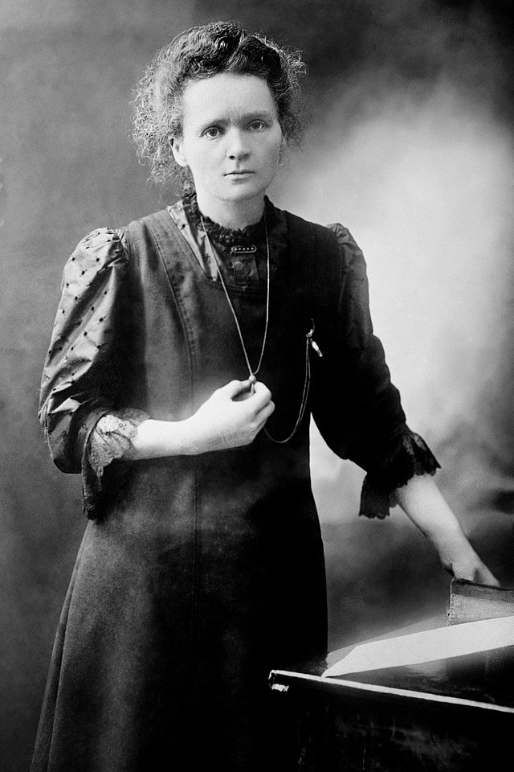

Une brillante scientifique polonaise qui a découvert la radioactivité. Elle a été la première femme à recevoir un prix Nobel, et ce, à deux reprises !

- Rationale: Maria Curie inspires kids (especially girls) to pursue science and shows Polish contributions to science
- Type: Person
- Subjects: Science, History
- Year: 1867
- Country: Poland
- Quests: [Découvrir Varsovie (pl_01)](../quest/pl_01.fr.md)

### Mars
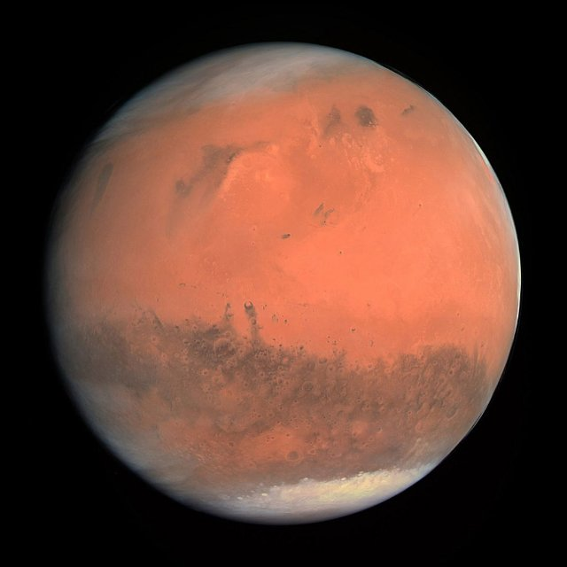

La planète rouge avec de la poussière et de grands volcans.

- Type: Object
- Subjects: Space, Science
- Country: Poland
- Quests: [Copernic et le système solaire (pl_07)](../quest/pl_07.fr.md)

### Maître des clés nain

Une statue naine gardant l'ascenseur avec une grosse clé.

- Type: Object
- Subjects: Culture
- Country: Poland
- Quests: [Le grand sauvetage des nains de Wrocław (pl_02)](../quest/pl_02.fr.md)

### Mercure

La planète la plus proche du Soleil ; petite et très rapide.

- Type: Object
- Subjects: Space, Science
- Country: Poland
- Quests: [Copernic et le système solaire (pl_07)](../quest/pl_07.fr.md)

### Modèle héliocentrique

L'idée que le Soleil est au centre et que les planètes tournent autour de lui.

- Type: Concept
- Subjects: Science, Space, History
- Country: Poland
- Quests: [Copernic et le système solaire (pl_07)](../quest/pl_07.fr.md)

### Monnaie du zloty

La monnaie polonaise s'appelle le złoty. Les pièces et les billets arborent des symboles polonais.

- Type: Concept
- Subjects: Money, Geography
- Country: Poland
- Quests: [Pain d'épices et marché alimentaire (pl_06)](../quest/pl_06.fr.md)

### Monument Chopin

Une grande statue du parc Łazienki de Varsovie est dédiée à Frédéric Chopin. C'est également le lieu de concerts de piano en plein air très populaires en été. (L'arbre sous lequel il est assis est un saule polonais typique.)

- Type: Object
- Subjects: Music, Culture
- Country: Poland
- Quests: [Découvrir Varsovie (pl_01)](../quest/pl_01.fr.md)

### Mouette

Un oiseau marin qui vit près de la côte.

- Type: Object
- Subjects: Animal, Environment
- Country: Poland
- Quests: [Le collier d'ambre de Gdańsk (pl_05)](../quest/pl_05.fr.md)

### Nain amoureux des animaux
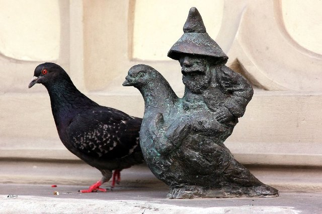

Une statue naine qui aime le zoo et les animaux.

- Type: Object
- Subjects: Culture, Animal, Education
- Country: Poland
- Quests: [Le grand sauvetage des nains de Wrocław (pl_02)](../quest/pl_02.fr.md)

### Nain polonais (gnomes de Wrocław)

De petites statues de nains se cachent un peu partout à Wrocław. Les trouver est un jeu de ville amusant.

- Type: Concept
- Subjects: Community, Culture
- Year: 1700
- Country: Poland
- Quests: [Découvrir Varsovie (pl_01)](../quest/pl_01.fr.md), [Le grand sauvetage des nains de Wrocław (pl_02)](../quest/pl_02.fr.md)

### Nains de Wrocław
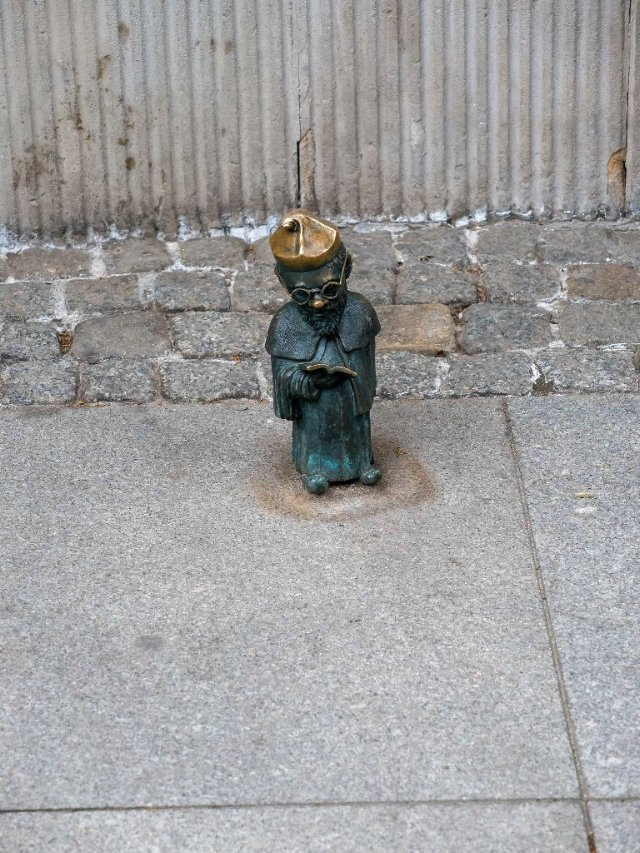

De minuscules statues à travers la ville qui aiment jouer des tours.

- Type: Concept
- Subjects: Culture, Community, History
- Country: Poland
- Quests: [Le grand sauvetage des nains de Wrocław (pl_02)](../quest/pl_02.fr.md)

### Navigation

Trouver son chemin en mer à l'aide de lumières, de cartes et d'outils.

- Type: Concept
- Subjects: Technology, Geography
- Country: Poland
- Quests: [Le collier d'ambre de Gdańsk (pl_05)](../quest/pl_05.fr.md)

### Neptune

Le dieu de la mer des vieilles histoires.

- Type: Concept
- Subjects: Culture, History
- Country: Poland
- Quests: [Copernic et le système solaire (pl_07)](../quest/pl_07.fr.md)

### Nicolas Copernic

Un brillant scientifique polonais a découvert que la Terre tourne autour du Soleil, et non l'inverse ! Cela a révolutionné notre compréhension de l'espace.

- Rationale: Copernicus teaches kids about scientific discovery and Polish contributions to astronomy
- Type: Person
- Subjects: Science, History, Space
- Year: 1473
- Country: Poland
- Quests: [Copernic et le système solaire (pl_07)](../quest/pl_07.fr.md)

### Oculaire

La petite lentille à travers laquelle vous regardez sur un télescope.

- Type: Object
- Subjects: Science, Technology
- Country: Poland
- Quests: [Copernic et le système solaire (pl_07)](../quest/pl_07.fr.md)

### Odra river map

A simple map that shows the Odra River in Poland and the way it flows to the Baltic Sea

- Type: None
- Subjects: Geography
- Country: Poland
- Quests: [Fleuve Oder (pl_03)](../quest/pl_03.fr.md)

### Olga Tokarczuk

Un célèbre écrivain polonais qui vit à Wrocław.

- Type: Person
- Subjects: Literature, Culture
- Country: Poland
- Quests: [Le grand sauvetage des nains de Wrocław (pl_02)](../quest/pl_02.fr.md)

### Pain d'épices torunois

une friandise traditionnelle polonaise à base d'épices et de miel, souvent façonnée dans de beaux motifs.

- Type: Object
- Subjects: Food
- Country: Poland
- Quests: [Pain d'épices et marché alimentaire (pl_06)](../quest/pl_06.fr.md)

### Panorama de Racławicka

Un tableau géant tout autour de vous sur une bataille historique.

- Type: Place
- Subjects: History, Art, Culture
- Country: Poland
- Quests: [Le grand sauvetage des nains de Wrocław (pl_02)](../quest/pl_02.fr.md)

### Paon

Un oiseau coloré avec une grande queue de plumes.

- Type: Object
- Subjects: Animal, Science, Art
- Country: Poland
- Quests: [Le zoo (pl_04)](../quest/pl_04.fr.md)

### Passerelle

Un pont piétonnier. Interdit aux voitures.

- Type: Object
- Subjects: Transportation, Community
- Country: Poland
- Quests: [Fleuve Oder (pl_03)](../quest/pl_03.fr.md)

### Perroquet

Un oiseau brillant qui peut copier des sons.

- Type: Object
- Subjects: Animal, Science
- Country: Poland
- Quests: [Le zoo (pl_04)](../quest/pl_04.fr.md)

### Phare de Gdańsk

Un phare historique qui aide les navires à trouver le port.

- Type: Place
- Subjects: History, Geography, Transportation
- Country: Poland
- Quests: [Le collier d'ambre de Gdańsk (pl_05)](../quest/pl_05.fr.md)

### Pierogi polonais

Raviolis farcis de pommes de terre, de fromage ou de fruits. C'est un plat polonais célèbre.

- Type: Object
- Subjects: Food, Culture
- Year: 1600
- Country: Poland
- Quests: [Pain d'épices et marché alimentaire (pl_06)](../quest/pl_06.fr.md)

### Place du marché de Wrocław

La place principale de la vieille ville, pleine de vie.

- Type: Place
- Subjects: Geography, Culture, Community, History
- Country: Poland
- Quests: [Le grand sauvetage des nains de Wrocław (pl_02)](../quest/pl_02.fr.md)

### Planétarium

Un endroit où vous pouvez voir le ciel et les étoiles à l'intérieur.

- Type: Place
- Subjects: Education, Science, Space
- Country: Poland
- Quests: [Copernic et le système solaire (pl_07)](../quest/pl_07.fr.md)

### Pont

Une structure qui permet aux personnes ou aux véhicules de traverser l’eau.

- Type: Concept
- Subjects: Technology, Transportation
- Country: Poland
- Quests: [Fleuve Oder (pl_03)](../quest/pl_03.fr.md)

### Pont de Tumski

Un pont célèbre avec des cadenas d'amour et des lanternes à gaz.

- Type: Place
- Subjects: Culture, Geography, Community
- Country: Poland
- Quests: [Fleuve Oder (pl_03)](../quest/pl_03.fr.md)

### Pont ferroviaire
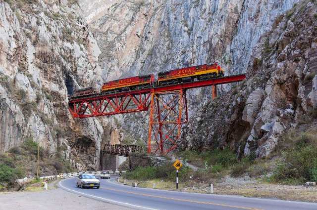

Un pont avec des voies pour les trains.

- Type: Object
- Subjects: Transportation, Technology
- Country: Poland
- Quests: [Fleuve Oder (pl_03)](../quest/pl_03.fr.md)

### Pont routier

Un pont pour voitures et bus.

- Type: Object
- Subjects: Transportation
- Country: Poland
- Quests: [Fleuve Oder (pl_03)](../quest/pl_03.fr.md)

### Pont Rędziński

Le plus long pont à haubans de Pologne.

- Type: Place
- Subjects: Geography, Transportation, Technology
- Country: Poland
- Quests: [Fleuve Oder (pl_03)](../quest/pl_03.fr.md)

### Ponts de Wrocław
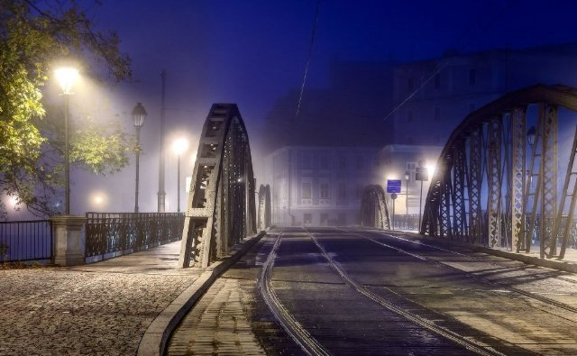

De nombreux ponts traversent la rivière Odra à Wrocław.

- Type: Concept
- Subjects: Geography, Transportation, Community
- Country: Poland
- Quests: [Fleuve Oder (pl_03)](../quest/pl_03.fr.md)

### Port

Un endroit où les navires chargent et déchargent.

- Type: Place
- Subjects: Transportation, Community, Geography
- Country: Poland
- Quests: [Le collier d'ambre de Gdańsk (pl_05)](../quest/pl_05.fr.md)

### Péniche

Un bateau fait pour vivre.

- Type: Object
- Subjects: Transportation, Community
- Country: Poland
- Quests: [Fleuve Oder (pl_03)](../quest/pl_03.fr.md)

### Pêcheur

Une personne qui attrape du poisson en mer.

- Type: Person
- Subjects: Community, Geography
- Country: Poland
- Quests: [Le collier d'ambre de Gdańsk (pl_05)](../quest/pl_05.fr.md)

### Rivière Motława

La rivière qui traverse Gdańsk jusqu'à la mer.

- Type: Place
- Subjects: Geography
- Country: Poland
- Quests: [Le collier d'ambre de Gdańsk (pl_05)](../quest/pl_05.fr.md)

### Rivière Odra

Un grand fleuve de l'ouest de la Pologne. Il facilite la navigation et le commerce.

- Type: Place
- Subjects: Geography, Environment
- Country: Poland
- Quests: [Fleuve Oder (pl_03)](../quest/pl_03.fr.md)

### Salle du Centenaire
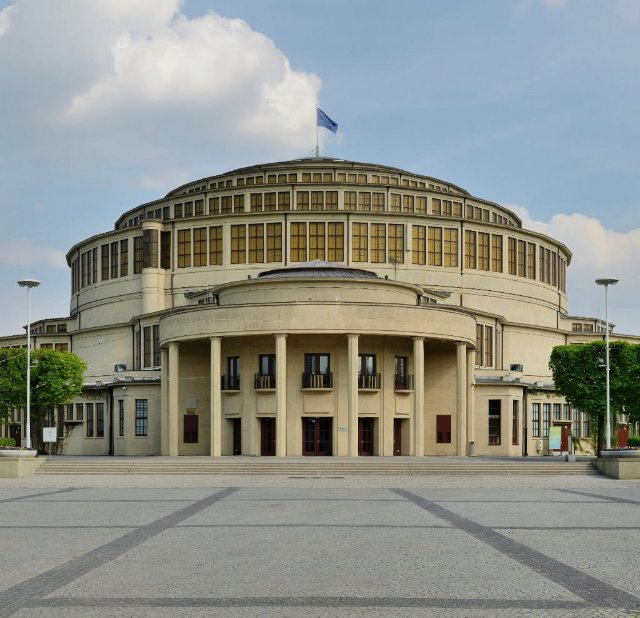

Le Centennial Hall est un immense bâtiment qui ressemble à une grande tente avec un toit. Il est très haut. À l'intérieur, vous pouvez assister à différents spectacles, écouter des concerts ou regarder des matchs.

- Type: Place
- Subjects: Culture, Recreation
- Country: Poland
- Quests: [Le grand sauvetage des nains de Wrocław (pl_02)](../quest/pl_02.fr.md)

### Saturne

Une planète géante avec des anneaux brillants et de nombreuses lunes.

- Type: Object
- Subjects: Space, Science
- Country: Poland
- Quests: [Copernic et le système solaire (pl_07)](../quest/pl_07.fr.md)

### Signe

Un tableau avec des faits simples pour vous aider à apprendre.

- Type: Object
- Subjects: Education, Community
- Country: Poland
- Quests: [Le zoo (pl_04)](../quest/pl_04.fr.md)

### Sirène de Varsovie

Le symbole de la ville est une sirène courageuse armée d'une épée et d'un bouclier. Sa statue est visible au bord de la rivière.

- Type: Object
- Subjects: Culture, History
- Country: Poland
- Quests: [Découvrir Varsovie (pl_01)](../quest/pl_01.fr.md)

### Sky Tower Plaza

Une place moderne où les gens se rencontrent près de la tour.

- Type: Place
- Subjects: Geography, Community, Recreation
- Country: Poland
- Quests: [Le grand sauvetage des nains de Wrocław (pl_02)](../quest/pl_02.fr.md)

### Statue du nain de Wrocław
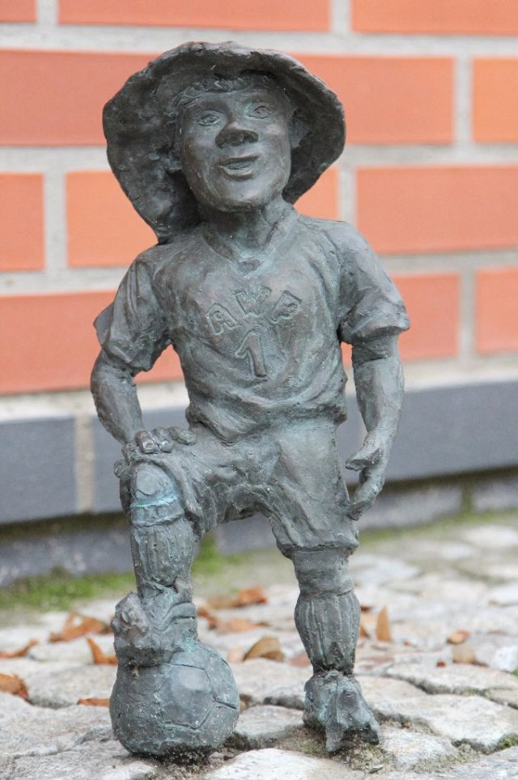

Une petite statue de la ville ; les nains sont le symbole de Wrocław.

- Type: Object
- Subjects: Culture, Community, History
- Country: Poland
- Quests: [Le grand sauvetage des nains de Wrocław (pl_02)](../quest/pl_02.fr.md)

### Système solaire

Le Soleil et les huit planètes qui tournent autour de lui.

- Type: Concept
- Subjects: Space, Science
- Country: Poland
- Quests: [Copernic et le système solaire (pl_07)](../quest/pl_07.fr.md)

### Terre

Notre planète natale avec terre, air et eau.

- Type: Object
- Subjects: Space, Science, Geography, Environment
- Country: Poland
- Quests: [Copernic et le système solaire (pl_07)](../quest/pl_07.fr.md)

### Toruń

Une ville de Pologne où est né Nicolas Copernic.

- Type: Place
- Subjects: Geography, History, Culture
- Country: Poland
- Quests: [Copernic et le système solaire (pl_07)](../quest/pl_07.fr.md)

### Télescope

Un outil qui nous aide à voir des choses lointaines dans le ciel.

- Type: Object
- Subjects: Science, Technology, Space
- Country: Poland
- Quests: [Copernic et le système solaire (pl_07)](../quest/pl_07.fr.md)

### Uranus

Une planète bleu-vert qui tourne sur le côté.

- Type: Object
- Subjects: Space, Science
- Country: Poland
- Quests: [Copernic et le système solaire (pl_07)](../quest/pl_07.fr.md)

### Vénus

Une planète très chaude recouverte de nuages ​​épais.

- Type: Object
- Subjects: Space, Science
- Country: Poland
- Quests: [Copernic et le système solaire (pl_07)](../quest/pl_07.fr.md)

### Wroclaw : Cathédrale

Une grande et importante église où l'on prie. On peut monter dans la tour pour admirer la vue.

- Type: Place
- Subjects: History, Culture
- Country: Poland
- Quests: [Le grand sauvetage des nains de Wrocław (pl_02)](../quest/pl_02.fr.md)

### Wroclaw : Sky Tower

L'un des plus hauts bâtiments de Pologne. Il abrite des boutiques et un point de vue.

- Type: Place
- Subjects: Geography, Community, Culture
- Country: Poland
- Quests: [Le grand sauvetage des nains de Wrocław (pl_02)](../quest/pl_02.fr.md)

### Wrocław

Une ville de Pologne avec des rivières, des ponts et de l'histoire.

- Type: Place
- Subjects: Geography, History, Culture
- Country: Poland
- Quests: [Le zoo (pl_04)](../quest/pl_04.fr.md)

### Zoo de Wrocław

Un grand zoo à Wrocław avec de nombreux animaux à découvrir.

- Type: Place
- Subjects: Geography, Education, Animal
- Country: Poland
- Quests: [Le zoo (pl_04)](../quest/pl_04.fr.md)

### Écosystème

Les êtres vivants et leur habitat dans la nature, travaillant ensemble.

- Type: Concept
- Subjects: Environment, Science
- Country: Poland
- Quests: [Le collier d'ambre de Gdańsk (pl_05)](../quest/pl_05.fr.md)

### Église

Une grande sculpture en métal à côté du Centennial Hall.

- Type: Place
- Subjects: History, Culture
- Country: Poland
- Quests: [Le zoo (pl_04)](../quest/pl_04.fr.md)

### Évêque Nain

Une statue naine qui pose une question d'église.

- Type: Object
- Subjects: Culture, History
- Country: Poland
- Quests: [Le grand sauvetage des nains de Wrocław (pl_02)](../quest/pl_02.fr.md)

