# Cards(it)

Language: [english](./index.md) - [french](./index.fr.md) - [polish](./index.pl.md) - italian

!!! note "Educators: help improving these cards!"
    **Improve translations**: [comment here](https://docs.google.com/spreadsheets/d/1M3uOeqkbE4uyDs5us5vO-nAFT8Aq0LGBxjjT_CSScWw/edit?gid=415931977#gid=415931977)  

Total found:** 358**

## International

### Acqua

L'acqua è essenziale per tutta la vita

- Type: Object
- Subjects: Food, Culture
- Country: International

### Alpi

Un'alta catena montuosa in Europa.

- Type: Place
- Subjects: Geography, Environment
- Country: International
- Quests: [Monte Bianco e montagne (fr_08)](../quest/fr_08.it.md)

### animal_chimpanzee

- Type: None
- Country: International
- Quests: [Lo zoo (pl_04)](../quest/pl_04.it.md)

### animal_lion_cub

- Type: Object
- Country: International
- Quests: [Lo zoo (pl_04)](../quest/pl_04.it.md)

### animal_lion_young_male

- Type: Object
- Country: International
- Quests: [Lo zoo (pl_04)](../quest/pl_04.it.md)

### Apicoltore

Persona che si prende cura delle api e raccoglie il miele.

- Type: Person
- Subjects: Community, Animal, Food
- Country: International
- Quests: [Pan di zenzero e mercato alimentare (pl_06)](../quest/pl_06.it.md)

### Arancia

Un frutto rotondo e arancione, dal sapore dolce e succoso. Le arance sono ricche di vitamina C!

- Type: Object
- Subjects: Food, Culture
- Country: International
- Quests: [Cibo e mercato (fr_09)](../quest/fr_09.it.md)

### Arrampicata

Salire su rocce o ghiaccio con attrezzatura speciale.

- Type: Concept
- Subjects: Sport, Safety, Recreation
- Country: International
- Quests: [Monte Bianco e montagne (fr_08)](../quest/fr_08.it.md)

### Aula

Un'aula della scuola dove gli studenti si siedono e imparano cose nuove dal loro insegnante.

- Type: Place
- Subjects: Education, Community
- Country: International
- Quests: [Il sistema scolastico (fr_02)](../quest/fr_02.it.md), [Jules Verne e i trasporti (fr_03)](../quest/fr_03.it.md)

### Auto

Un piccolo veicolo per le strade.

- Type: Object
- Subjects: Transportation
- Country: International
- Quests: [Scopri Varsavia (pl_01)](../quest/pl_01.it.md)

### Autobus

Un veicolo di grandi dimensioni che trasporta molte persone.

- Type: Object
- Subjects: Transportation, Community
- Country: International
- Quests: [Scopri Varsavia (pl_01)](../quest/pl_01.it.md)

### BANANA

- Type: Object
- Country: International
- Quests: [Lo zoo (pl_04)](../quest/pl_04.it.md)

### Bandiera del Belgio

La bandiera del Belgio ha tre strisce verticali: nera, gialla e rossa. Il Belgio è famoso per il cioccolato e i waffle!

- Rationale: Belgium's unique vertical stripes help kids distinguish different flag patterns
- Type: Concept
- Subjects: Geography, Culture
- Year: 1831
- Country: International
- Quests: [I vicini della Francia (fr_00)](../quest/fr_00.it.md)

### Bandiera del Lussemburgo

La bandiera del Lussemburgo è a strisce orizzontali rosse, bianche e azzurre. Il Lussemburgo è un paese molto piccolo in cui si parlano tre lingue!

- Rationale: Small multilingual countries teach kids about European diversity
- Type: Concept
- Subjects: Geography, Culture
- Year: 1972
- Country: International
- Quests: [I vicini della Francia (fr_00)](../quest/fr_00.it.md)

### Bandiera dell'Ucraina
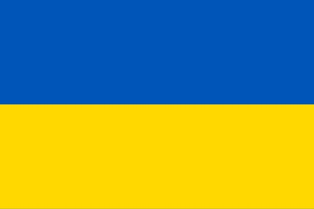

Una bandiera con i colori blu e giallo, come il cielo e il sole. Rappresenta il paese dell'Ucraina.

- Type: Concept
- Subjects: Community, Culture
- Country: International
- Quests: [I vicini della Francia (fr_00)](../quest/fr_00.it.md), [I vicini della Polonia (pl_00)](../quest/pl_00.it.md)

### Bandiera della Bielorussia

La bandiera della Bielorussia presenta strisce orizzontali rosse e verdi con splendidi motivi tradizionali sui lati. La Bielorussia è uno stato vicino alla Polonia.

- Rationale: Learning neighboring countries helps kids understand regional geography
- Type: Concept
- Subjects: Geography, Culture
- Year: 1995
- Country: International
- Quests: [I vicini della Polonia (pl_00)](../quest/pl_00.it.md)

### Bandiera della Lituania

La bandiera presenta strisce orizzontali gialle, verdi e rosse. La Lituania è un paese baltico con splendide foreste e spiagge.

- Rationale: Baltic countries teach kids about northern European geography and Poland's neighbors
- Type: Concept
- Subjects: Geography, Culture
- Year: 1988
- Country: International
- Quests: [I vicini della Polonia (pl_00)](../quest/pl_00.it.md)

### Bandiera della Repubblica Ceca

La bandiera è a strisce bianche e rosse con un triangolo blu. La Repubblica Ceca è famosa per il suo splendido Castello di Praga e per la produzione di cristalli.

- Rationale: Central European countries help kids understand the region around Poland
- Type: Concept
- Subjects: Geography, Culture
- Year: 1920
- Country: International
- Quests: [I vicini della Francia (fr_00)](../quest/fr_00.it.md), [I vicini della Polonia (pl_00)](../quest/pl_00.it.md)

### Bandiera della Russia
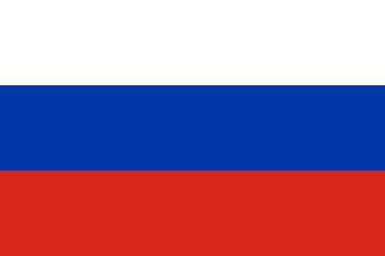

Una bandiera a strisce bianche, blu e rosse. Rappresenta la Russia.

- Type: Concept
- Subjects: Community, Culture
- Country: International
- Quests: [I vicini della Polonia (pl_00)](../quest/pl_00.it.md)

### Bandiera della Slovacchia

Una bandiera con i colori bianco, blu e rosso. Rappresenta la Slovacchia.

- Type: Concept
- Subjects: Community, Culture
- Country: International
- Quests: [I vicini della Francia (fr_00)](../quest/fr_00.it.md), [I vicini della Polonia (pl_00)](../quest/pl_00.it.md)

### Bandiera della Svizzera

La bandiera svizzera è rossa con una croce bianca al centro. Sembra un kit di pronto soccorso! La Svizzera è famosa per le montagne e il formaggio.

- Rationale: The Swiss flag's unique cross design helps kids remember this mountain country
- Type: Concept
- Subjects: Geography, Culture
- Year: 1889
- Country: International
- Quests: [I vicini della Francia (fr_00)](../quest/fr_00.it.md)

### barca fluviale

Una barca che naviga sui fiumi. I fiumi sono come strade fatte d'acqua!

- Type: Place
- Subjects: Geography, Environment
- Country: International
- Quests: [Parigi Senna (fr_10)](../quest/fr_10.it.md)

### Barca per le persone

Un'imbarcazione che trasporta le persone da un luogo all'altro attraverso l'acqua.

- Type: Place
- Subjects: Geography, Environment
- Country: International

### Barca per merci

Una grande imbarcazione che trasporta scatole, cibo e altre cose da un posto all'altro.

- Type: Place
- Subjects: Geography, Environment
- Country: International

### Belgio

Un paese in Europa. La capitale è Bruxelles.

- Type: Place
- Subjects: Geography, Culture
- Country: International

### Berna

La capitale della Svizzera.

- Type: Place
- Subjects: Geography, Culture
- Country: International

### Bicicletta

Un veicolo a due ruote su cui si pedala.

- Type: Object
- Subjects: Transportation, Sport, Health
- Country: International
- Quests: [Scopri Varsavia (pl_01)](../quest/pl_01.it.md)

### Bielorussia

Un paese in Europa. La capitale è Minsk.

- Type: Place
- Subjects: Geography, Culture
- Country: International

### biglietto per la Torre Eiffel

Una carta speciale che ti consente di visitare la famosa torre alta di Parigi, in Francia.

- Type: Object
- Subjects: Science
- Country: International
- Quests: [Parigi! (fr_01)](../quest/fr_01.it.md)

### Bob

Una slitta veloce usata per scivolare sul ghiaccio.

- Type: Object
- Subjects: Sport, Recreation
- Country: International
- Quests: [Monte Bianco e montagne (fr_08)](../quest/fr_08.it.md)

### Bratislava

La capitale della Slovacchia.

- Type: Place
- Subjects: Geography, Culture
- Country: International

### Bruxelles

La capitale del Belgio.

- Type: Place
- Subjects: Geography, Culture
- Country: International

### Burro
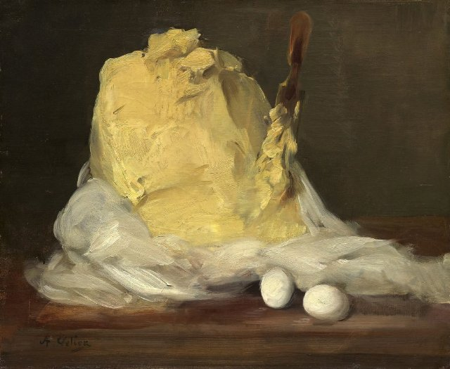

Grasso giallo ricavato dal latte, utilizzato per cucinare e cuocere al forno.

- Type: Object
- Subjects: Food, Animal
- Country: International
- Quests: [Pan di zenzero e mercato alimentare (pl_06)](../quest/pl_06.it.md)

### Bussola

Uno strumento che ti aiuta a disegnare cerchi perfetti. Ha due gambe come forbici.

- Type: Object
- Subjects: Math
- Country: International
- Quests: [Il sistema scolastico (fr_02)](../quest/fr_02.it.md)

### Calcio

Un gioco di squadra che si gioca calciando una palla.

- Type: Object
- Subjects: Sport, Recreation, Community
- Country: International
- Quests: [Scopri Varsavia (pl_01)](../quest/pl_01.it.md)

### Camere del Parlamento polacco

Dove vengono fatte le leggi: il Sejm e il Senato.

- Type: Place
- Subjects: Civics, History, Geography
- Country: International
- Quests: [Scopri Varsavia (pl_01)](../quest/pl_01.it.md)

### Campo da calcio

Il campo erboso dove si gioca a calcio.

- Type: Place
- Subjects: Sport, Recreation, Community
- Country: International
- Quests: [Scopri Varsavia (pl_01)](../quest/pl_01.it.md)

### Cannella

Una spezia dolce ricavata dalla corteccia degli alberi.

- Type: Object
- Subjects: Food, Plant
- Country: International
- Quests: [Pan di zenzero e mercato alimentare (pl_06)](../quest/pl_06.it.md)

### Cappello

Un berretto caldo per la testa.

- Type: Object
- Subjects: Health, Safety, Weather
- Country: International
- Quests: [Monte Bianco e montagne (fr_08)](../quest/fr_08.it.md)

### Cappotto

Una giacca calda per il clima freddo.

- Type: Object
- Subjects: Health, Safety, Weather
- Country: International
- Quests: [Monte Bianco e montagne (fr_08)](../quest/fr_08.it.md)

### Cartella

Una borsa che gli studenti usano per portare a scuola libri, matite e compiti.

- Type: Object
- Subjects: Science
- Country: International
- Quests: [Il sistema scolastico (fr_02)](../quest/fr_02.it.md)

### casaro

Una persona che vende molti tipi di formaggio.

- Type: Person
- Subjects: History, Culture
- Country: International
- Quests: [Cibo e mercato (fr_09)](../quest/fr_09.it.md)

### Castello Reale (Varsavia)

Uno storico castello dei re polacchi, ora un museo.

- Type: Place
- Subjects: History, Culture, Geography
- Country: International
- Quests: [Scopri Varsavia (pl_01)](../quest/pl_01.it.md)

### Cerchio

Una forma rotonda senza angoli. I cerchi sembrano ruote, palline e monete!

- Type: Concept
- Subjects: Math
- Country: International
- Quests: [Il sistema scolastico (fr_02)](../quest/fr_02.it.md)

### chiodi di garofano

Una spezia forte usata per insaporire i cibi.

- Type: Object
- Subjects: Food, Plant
- Country: International
- Quests: [Pan di zenzero e mercato alimentare (pl_06)](../quest/pl_06.it.md)

### Città di Lussemburgo

La capitale del Lussemburgo.

- Type: Place
- Subjects: Geography, Culture
- Country: International

### Colonna di Re Sigismondo
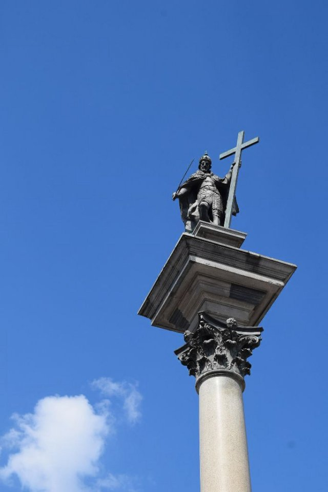

Un'alta colonna in onore di Re Sigismondo nella Piazza del Castello.

- Type: Place
- Subjects: History, Culture
- Country: International
- Quests: [Scopri Varsavia (pl_01)](../quest/pl_01.it.md)

### Corda

Una linea robusta utilizzata per la sicurezza durante l'arrampicata.

- Type: Object
- Subjects: Safety, Technology, Sport
- Country: International
- Quests: [Monte Bianco e montagne (fr_08)](../quest/fr_08.it.md)

### Corona di Re Sigismondo

La corona del re che è caduta e deve essere ritrovata.

- Type: Object
- Subjects: History, Culture
- Country: International
- Quests: [Scopri Varsavia (pl_01)](../quest/pl_01.it.md)

### Costituzione del 3 maggio

Una storica costituzione polacca celebrata il 3 maggio.

- Type: Concept
- Subjects: Civics, History, Time
- Country: International
- Quests: [Scopri Varsavia (pl_01)](../quest/pl_01.it.md)

### Cucina

Una stanza dove le persone cucinano e preparano dolci.

- Type: Place
- Subjects: Food
- Country: International
- Quests: [Pan di zenzero e mercato alimentare (pl_06)](../quest/pl_06.it.md)

### Cucinare

Una persona che prepara il cibo.

- Type: Person
- Subjects: Community, Food
- Country: International
- Quests: [Pan di zenzero e mercato alimentare (pl_06)](../quest/pl_06.it.md)

### Droghiere

Persona che vende molti tipi di cibo e bevande.

- Type: Person
- Subjects: History, Culture
- Country: International
- Quests: [Cibo e mercato (fr_09)](../quest/fr_09.it.md)

### Elefante

Un grosso animale con una proboscide. Gli elefanti sono gli animali più grandi che camminano sulla terraferma. Hanno grandi orecchie e amano spruzzare acqua!

- Rationale: Elephants are amazing animals that kids love learning about at the zoo!
- Type: Object
- Subjects: Animal, Environment
- Country: International
- Words: [elephant](../words/elephant.md), [zoo](../words/zoo.md)
- Quests: [Lo zoo (pl_04)](../quest/pl_04.it.md)

### Escursionismo

Camminare sui sentieri immersi nella natura.

- Type: Concept
- Subjects: Recreation, Sport, Environment
- Country: International
- Quests: [Monte Bianco e montagne (fr_08)](../quest/fr_08.it.md)

### Farina

Polvere bianca ricavata dal grano, utilizzata per fare il pane.

- Type: Object
- Subjects: Food, Science
- Country: International

### Ferro

Uno strumento caldo utilizzato per rendere i vestiti stropicciati lisci e piatti. Attenzione, i ferri da stiro sono molto caldi!

- Type: Object
- Subjects: Science
- Country: International

### Fruttivendolo

Una persona che vende frutta e verdura fresca.

- Type: Person
- Subjects: History, Culture
- Country: International
- Quests: [Cibo e mercato (fr_09)](../quest/fr_09.it.md)

### Ghiacciaio

Ghiaccio lento che si trova sulle alte montagne.

- Type: Concept
- Subjects: Geography, Science, Environment
- Country: International
- Quests: [Monte Bianco e montagne (fr_08)](../quest/fr_08.it.md)

### Ghiaccio

Acqua ghiacciata che può essere molto scivolosa.

- Type: Concept
- Subjects: Weather, Environment, Science
- Country: International
- Quests: [Monte Bianco e montagne (fr_08)](../quest/fr_08.it.md)

### Giorno dell'Indipendenza (Polonia)

Festa nazionale l'11 novembre.

- Type: Concept
- Subjects: Civics, History, Time
- Country: International
- Quests: [Scopri Varsavia (pl_01)](../quest/pl_01.it.md)

### Giraffa

Un animale molto alto con un collo lungo. Le giraffe sono più alte degli alberi! Mangiano foglie che altri animali non possono raggiungere.

- Rationale: Giraffes are fascinating animals that show kids how nature adapts to find food
- Type: Object
- Subjects: Animal, Environment
- Country: International

### Governate

Uno strumento dritto usato per misurare la lunghezza degli oggetti. I righelli hanno numeri e linee.

- Type: Object
- Subjects: Math
- Country: International
- Quests: [Il sistema scolastico (fr_02)](../quest/fr_02.it.md)

### Granchio

Un animale marino con grandi chele e un guscio duro. I granchi camminano di traverso sulla spiaggia!

- Type: Object
- Subjects: Food, Culture
- Country: International
- Quests: [Cibo e mercato (fr_09)](../quest/fr_09.it.md)

### Guanti

Coperture calde per le tue mani.

- Type: Object
- Subjects: Health, Safety, Weather
- Country: International
- Quests: [Monte Bianco e montagne (fr_08)](../quest/fr_08.it.md)

### Guerre e statua di Sawa

Una statua che raffigura la leggenda della città su Wars e Sawa.

- Type: Place
- Subjects: Culture, History
- Country: International
- Quests: [Scopri Varsavia (pl_01)](../quest/pl_01.it.md)

### Guida alpina

Una persona che aiuta le persone ad arrampicarsi in sicurezza.

- Type: Person
- Subjects: Community, Safety, Education
- Country: International
- Quests: [Monte Bianco e montagne (fr_08)](../quest/fr_08.it.md)

### ice_arctic

- Type: Place
- Country: International
- Quests: [Lo zoo (pl_04)](../quest/pl_04.it.md)

### Kiev

La capitale dell'Ucraina.

- Type: Place
- Subjects: Geography, Culture
- Country: International

### Latte
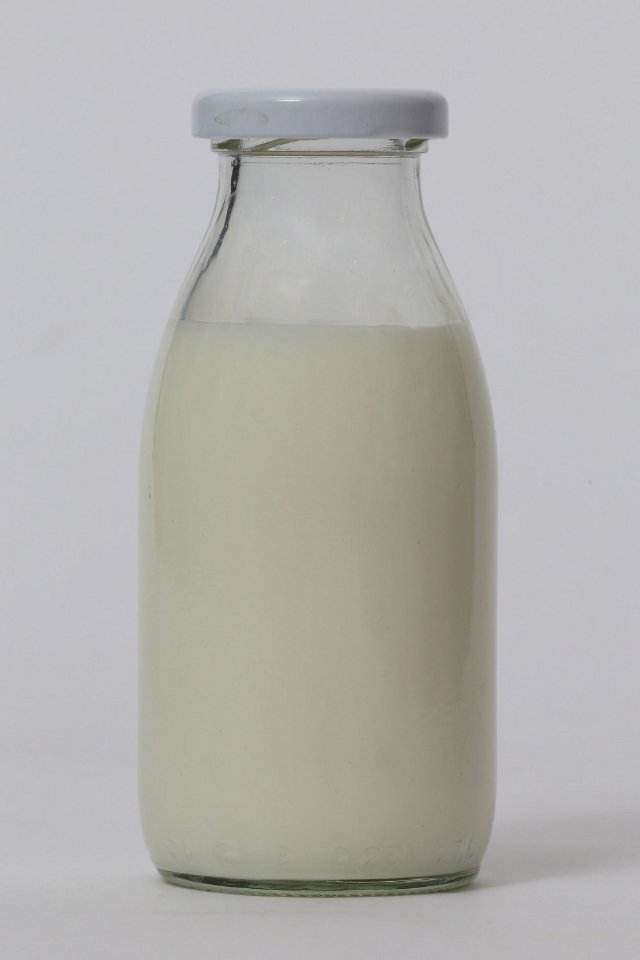

Una bevanda bianca che proviene dalle mucche. Il latte aiuta a rafforzare ossa e denti!

- Type: Object
- Subjects: Food, Culture
- Country: International
- Quests: [Cibo e mercato (fr_09)](../quest/fr_09.it.md)

### Leonardo da Vinci

Un artista e scienziato italiano straordinario. Ha dipinto la Gioconda e inventato macchine volanti centinaia di anni prima degli aeroplani!

- Type: Person
- Subjects: Art, Science, History
- Year: 1452
- Country: International

### Leone

Un grosso felino chiamato il re degli animali. Vive in gruppi chiamati branchi.

- Type: Object
- Subjects: Animal, Environment
- Country: International
- Quests: [Lo zoo (pl_04)](../quest/pl_04.it.md)

### Lievito

Il lievito è come una polvere magica che rende il pane morbido e gustoso!

- Type: Object
- Subjects: Food, Culture
- Country: International

### Limone
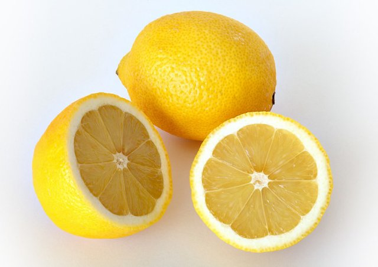

Un frutto giallo dal sapore molto aspro. I limoni vengono usati per fare la limonata!

- Type: Object
- Subjects: Food, Culture
- Country: International
- Quests: [Cibo e mercato (fr_09)](../quest/fr_09.it.md)

### Linea

Un segno dritto che va da un punto all'altro. Le linee possono essere lunghe o corte.

- Type: Concept
- Subjects: Math
- Country: International
- Quests: [Il sistema scolastico (fr_02)](../quest/fr_02.it.md)

### Lituania
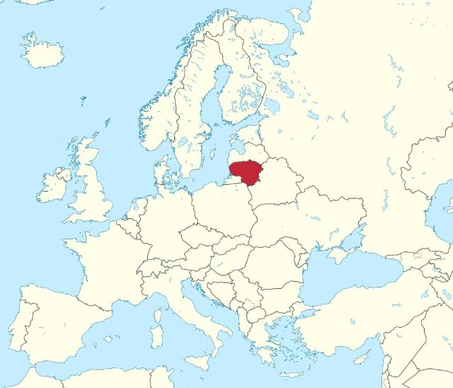

Un paese in Europa. La capitale è Vilnius.

- Type: Place
- Subjects: Geography, Culture
- Country: International

### Lussemburgo

Uno stato europeo. La capitale è la città di Lussemburgo.

- Type: Place
- Subjects: Geography, Culture
- Country: International

### Macellaio

Una persona che vende carne.

- Type: Person
- Subjects: Community, Food
- Country: International
- Quests: [Pan di zenzero e mercato alimentare (pl_06)](../quest/pl_06.it.md)

### Manifesto della scuola francese
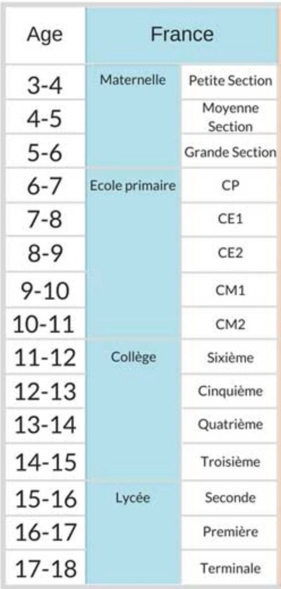

Un'immagine di grandi dimensioni con informazioni appesa alle pareti delle aule delle scuole francesi.

- Type: Object
- Subjects: Education
- Country: International
- Quests: [Jules Verne e i trasporti (fr_03)](../quest/fr_03.it.md)

### Mappa dell'Europa

Una mappa che mostra tutti i paesi d'Europa. Puoi vedere dove si trovano Francia, Polonia, Germania e altri paesi.

- Rationale: Maps help kids understand where different countries are and how they connect
- Type: Concept
- Subjects: Geography, Education
- Year: 2000
- Country: International
- Quests: [I vicini della Francia (fr_00)](../quest/fr_00.it.md), [I vicini della Polonia (pl_00)](../quest/pl_00.it.md)

### Mappa della Torre Eiffel

Una mappa che mostra dove si trova la famosa torre alta di Parigi.

- Type: Object
- Subjects: Community, Culture
- Country: International
- Quests: [Parigi! (fr_01)](../quest/fr_01.it.md)

### Mar Baltico

Un grande mare nel nord Europa, dove si incontrano Polonia, Germania e altri paesi. Ha spiagge bellissime ed è famoso per i tesori d'ambra!

- Rationale: The Baltic Sea teaches kids about marine geography and Poland's coastal access
- Type: Place
- Subjects: Geography, Environment
- Country: International
- Quests: [La collana d'ambra di Danzica (pl_05)](../quest/pl_05.it.md)

### Maria Skłodowska-Curie

Uno scienziato che ha vinto due premi Nobel.

- Type: Person
- Subjects: Science, History
- Country: International
- Quests: [Scopri Varsavia (pl_01)](../quest/pl_01.it.md)

### Marmotta

Un animale di montagna peloso che fischia.

- Type: Object
- Subjects: Animal, Environment, Science
- Country: International
- Quests: [Monte Bianco e montagne (fr_08)](../quest/fr_08.it.md)

### Mazurek Dąbrowskiego

Inno nazionale polacco.

- Type: Concept
- Subjects: Music, History, Culture
- Country: International
- Quests: [Scopri Varsavia (pl_01)](../quest/pl_01.it.md)

### MELA

- Type: Object
- Country: International
- Quests: [Lo zoo (pl_04)](../quest/pl_04.it.md)

### Menù della mensa

Un elenco che mostra quali alimenti puoi mangiare a scuola. Ti aiuta a scegliere cosa mangiare!

- Type: Object
- Subjects: Community, Culture
- Country: International
- Quests: [Il sistema scolastico (fr_02)](../quest/fr_02.it.md)

### Mercato medievale

Un mercato vecchio stile dove le persone comprano e vendono merci.

- Type: Place
- Subjects: History, Culture, Community
- Country: International
- Quests: [Pan di zenzero e mercato alimentare (pl_06)](../quest/pl_06.it.md)

### Miele

Un alimento dolce prodotto dalle api.

- Type: Object
- Subjects: Food, Animal
- Country: International
- Quests: [Pan di zenzero e mercato alimentare (pl_06)](../quest/pl_06.it.md)

### Minsk

La capitale della Bielorussia.

- Type: Place
- Subjects: Geography, Culture
- Country: International

### Monete

Piccola moneta rotonda in metallo.

- Type: Object
- Subjects: Money
- Country: International
- Quests: [Pan di zenzero e mercato alimentare (pl_06)](../quest/pl_06.it.md)

### Monete Złoty

Denaro polacco (złoty) raffigurato come monete.

- Type: Object
- Subjects: Money, Geography
- Country: International
- Quests: [Scopri Varsavia (pl_01)](../quest/pl_01.it.md)

### Montagna

I pilastri della terra

- Type: Concept
- Subjects: Environment, Education
- Country: International
- Quests: [Monte Bianco e montagne (fr_08)](../quest/fr_08.it.md)

### Monte Bianco

La montagna più alta dell'Europa occidentale. Coperta di neve tutto l'anno.

- Type: Place
- Subjects: Geography, Environment
- Country: International

### Monumento a Nicola Copernico (Varsavia)

Monumento all'astronomo Niccolò Copernico.

- Type: Place
- Subjects: Science, History, Culture
- Country: International
- Quests: [Scopri Varsavia (pl_01)](../quest/pl_01.it.md)

### Mosca

La capitale della Russia.

- Type: Place
- Subjects: Geography, Culture
- Country: International

### Nevicare

Acqua ghiacciata che cade quando fa freddo.

- Type: Concept
- Subjects: Weather, Environment, Science
- Country: International
- Quests: [Monte Bianco e montagne (fr_08)](../quest/fr_08.it.md)

### Obiettivo

La rete in cui si cerca di segnare.

- Type: Object
- Subjects: Sport, Recreation
- Country: International
- Quests: [Scopri Varsavia (pl_01)](../quest/pl_01.it.md)

### Occhiali da sole

Occhiali che proteggono gli occhi dalla luce intensa.

- Type: Object
- Subjects: Health, Safety, Weather
- Country: International
- Quests: [Monte Bianco e montagne (fr_08)](../quest/fr_08.it.md)

### Olio d'oliva

Un olio speciale ricavato dalle olive. Viene utilizzato per cucinare piatti gustosi.

- Type: Object
- Subjects: Food, Culture
- Country: International
- Quests: [Cibo e mercato (fr_09)](../quest/fr_09.it.md)

### Palazzo della Cultura e della Scienza

Un edificio alto per musei, teatri e centri di apprendimento.

- Type: Place
- Subjects: Culture, Education, History
- Country: International
- Quests: [Scopri Varsavia (pl_01)](../quest/pl_01.it.md)

### Palazzo presidenziale

La residenza ufficiale del Presidente della Polonia.

- Type: Place
- Subjects: Civics, History, Culture
- Country: International
- Quests: [Scopri Varsavia (pl_01)](../quest/pl_01.it.md)

### Palla

Un oggetto rotondo utilizzato in molti giochi.

- Type: Object
- Subjects: Sport, Recreation
- Country: International
- Quests: [Scopri Varsavia (pl_01)](../quest/pl_01.it.md)

### PANE

Un alimento delizioso a base di farina e acqua. Puoi preparare dei panini con il pane!

- Type: Object
- Subjects: Food, Culture
- Country: International
- Quests: [Cibo e mercato (fr_09)](../quest/fr_09.it.md)

### Panettiere

Una persona che prepara pane, torte e pasticcini.

- Type: Person
- Subjects: History, Culture
- Country: International
- Quests: [Cibo e mercato (fr_09)](../quest/fr_09.it.md)

### Parigi

La capitale della Francia. Parigi ha una famosa torre alta chiamata Torre Eiffel!

- Type: Place
- Subjects: Geography, Culture
- Country: International
- Quests: [Parigi! (fr_01)](../quest/fr_01.it.md)

### Passerelle

Piccoli ponti per i pedoni. Ti proteggono dal traffico.

- Type: Place
- Subjects: Geography, Environment
- Country: International
- Quests: [Parigi Senna (fr_10)](../quest/fr_10.it.md)

### PESCARE

Un animale che vive e nuota nell'acqua. I pesci hanno pinne e branchie per respirare sott'acqua.

- Type: Object
- Subjects: Food, Culture
- Country: International
- Quests: [Cibo e mercato (fr_09)](../quest/fr_09.it.md)

### Pescivendolo

Persona che vende pesce fresco e frutti di mare.

- Type: Person
- Subjects: History, Culture
- Country: International
- Quests: [Cibo e mercato (fr_09)](../quest/fr_09.it.md)

### Piazza
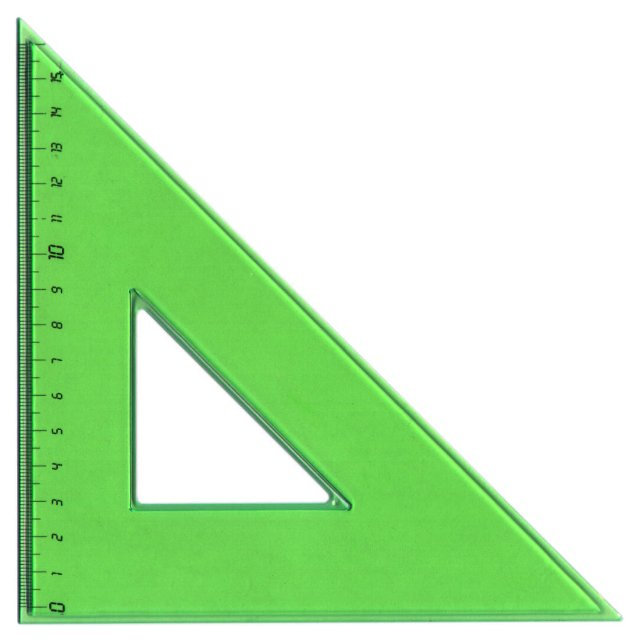

Strumento a forma di triangolo utilizzato per disegnare linee rette e angoli retti in matematica.

- Type: Object
- Subjects: Math
- Country: International
- Quests: [Il sistema scolastico (fr_02)](../quest/fr_02.it.md)

### Pinguino

Un uccello che non sa volare ma nuota molto bene. Vive in luoghi freddi.

- Type: Object
- Subjects: Animal, Environment
- Country: International
- Quests: [Lo zoo (pl_04)](../quest/pl_04.it.md)

### plant_apple

- Type: Object
- Country: International
- Quests: [Lo zoo (pl_04)](../quest/pl_04.it.md)

### plant_banana

- Type: Object
- Country: International
- Quests: [Lo zoo (pl_04)](../quest/pl_04.it.md)

### plant_orange

- Type: Object
- Country: International
- Quests: [Lo zoo (pl_04)](../quest/pl_04.it.md)

### plant_wattle
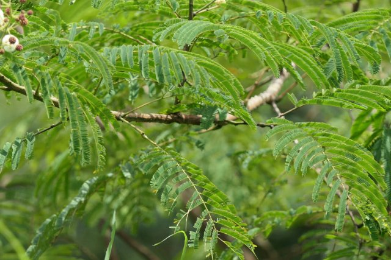

- Type: Object
- Country: International
- Quests: [Lo zoo (pl_04)](../quest/pl_04.it.md)

### Polonia

Un paese in Europa. La capitale è Varsavia. La Polonia è famosa per scienziati come Copernico e per i deliziosi pierogi!

- Type: Place
- Subjects: Geography, Culture
- Country: International

### Pomodoro

Un frutto rosso e rotondo che cresce sulle piante. I pomodori vengono usati per fare la salsa per la pizza!

- Type: Object
- Subjects: Food, Culture
- Country: International
- Quests: [Cibo e mercato (fr_09)](../quest/fr_09.it.md)

### Ponte del Castello

Un ponte vicino a un castello. I castelli sono edifici grandi e robusti, dove un tempo vivevano re e regine.

- Type: Place
- Subjects: Culture, Community
- Country: International

### Ponte per auto

Una strada che attraversa l'acqua, consentendo alle auto di attraversare fiumi e laghi.

- Type: Place
- Subjects: Geography, Environment
- Country: International
- Quests: [Parigi Senna (fr_10)](../quest/fr_10.it.md)

### Ponte per treni

Un ponte speciale costruito in modo sufficientemente robusto da consentire ai treni pesanti di attraversare l'acqua.

- Type: Place
- Subjects: Geography, Environment
- Country: International
- Quests: [Parigi Senna (fr_10)](../quest/fr_10.it.md)

### Praga

La capitale della Repubblica Ceca.

- Type: Place
- Subjects: Geography, Culture
- Country: International

### Presidente

Il leader scelto per guidare il Paese. I cittadini votano alle elezioni.

- Type: Person
- Subjects: History, Culture
- Country: International

### Ramponi

Impugnature metalliche appuntite da fissare agli scarponi per usare il ghiaccio.

- Type: Object
- Subjects: Safety, Technology, Sport
- Country: International
- Quests: [Monte Bianco e montagne (fr_08)](../quest/fr_08.it.md)

### Razzo spaziale

Un razzo che va nello spazio.

- Type: Object
- Subjects: Science
- Country: International
- Quests: [Jules Verne e i trasporti (fr_03)](../quest/fr_03.it.md)

### Repubblica Ceca

Un paese in Europa. La capitale è Praga.

- Type: Place
- Subjects: Geography, Culture
- Country: International

### Rimessa per barche
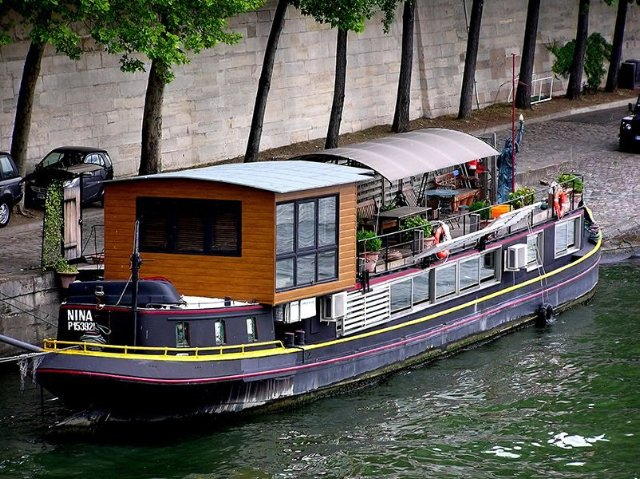

Una casa che galleggia sull'acqua come una barca. Le persone possono vivere nelle case galleggianti!

- Type: Place
- Subjects: Geography, Environment
- Country: International

### Roberto Lewandowski

Un famoso calciatore polacco.

- Type: Person
- Subjects: Sport, Culture
- Country: International
- Quests: [Scopri Varsavia (pl_01)](../quest/pl_01.it.md)

### Russia

Un paese in Europa. La capitale è Mosca.

- Type: Place
- Subjects: Geography, Culture
- Country: International

### SALE

Cristalli bianchi che migliorano il sapore del cibo.

- Type: Object
- Subjects: Food, Culture
- Country: International

### Sale al pepe

Spezie che migliorano il sapore del cibo. Il sale è bianco e il pepe è nero, con pezzetti minuscoli.

- Type: Object
- Subjects: Food, Culture
- Country: International
- Quests: [Cibo e mercato (fr_09)](../quest/fr_09.it.md)

### Sciare

Scivolare sulla neve con gli sci.

- Type: Concept
- Subjects: Sport, Recreation
- Country: International
- Quests: [Monte Bianco e montagne (fr_08)](../quest/fr_08.it.md)

### Sciarpa

Un panno caldo da indossare intorno al collo.

- Type: Object
- Subjects: Health, Safety, Weather
- Country: International
- Quests: [Monte Bianco e montagne (fr_08)](../quest/fr_08.it.md)

### Scimmia

Un animale intelligente che sa arrampicarsi e giocare. Alcune scimmie vivono in famiglie numerose.

- Type: Object
- Subjects: Animal, Environment
- Country: International
- Quests: [Lo zoo (pl_04)](../quest/pl_04.it.md)

### Segnale di PERICOLO

Un cartello che avverte di un pericolo imminente. Prestare particolare attenzione.

- Type: Object
- Subjects: Safety
- Country: International

### Segnale di STOP

Un cartello rosso che indica che è obbligatorio fermare il veicolo.

- Type: Object
- Subjects: Safety, Transportation
- Country: International

### Slovacchia

Un paese in Europa. La capitale è Bratislava.

- Type: Place
- Subjects: Geography, Culture
- Country: International

### Sole

Luce intensa che può riflettersi sulla neve.

- Type: Concept
- Subjects: Science, Weather, Environment
- Country: International
- Quests: [Monte Bianco e montagne (fr_08)](../quest/fr_08.it.md)

### Spada della sirena

La spada della sirena che deve essere restituita.

- Type: Object
- Subjects: Culture, History
- Country: International
- Quests: [Scopri Varsavia (pl_01)](../quest/pl_01.it.md)

### Stadio Nazionale (Varsavia)

Uno stadio moderno per partite di calcio e concerti.

- Type: Place
- Subjects: Sport, Culture, Community
- Country: International
- Quests: [Scopri Varsavia (pl_01)](../quest/pl_01.it.md)

### Stampo per pan di zenzero

Uno strumento sagomato che consente di creare divertenti forme di biscotti.

- Type: Object
- Subjects: Food, Art
- Country: International
- Quests: [Pan di zenzero e mercato alimentare (pl_06)](../quest/pl_06.it.md)

### Svizzera

Un paese in Europa. La capitale è Berna. La Svizzera è famosa per le montagne e il formaggio.

- Type: Place
- Subjects: Geography, Culture
- Country: International

### Tram

Un treno urbano che corre sui binari della strada.

- Type: Object
- Subjects: Transportation, Technology, Community
- Country: International
- Quests: [Scopri Varsavia (pl_01)](../quest/pl_01.it.md)

### Treno

I treni trasportano rapidamente persone e merci in tutto il Paese.

- Type: Object
- Subjects: Transportation
- Country: International

### Triangolo

Una forma con tre lati dritti e tre angoli. I triangoli sembrano fette di pizza!

- Type: Concept
- Subjects: Math
- Country: International
- Quests: [Il sistema scolastico (fr_02)](../quest/fr_02.it.md)

### Ucraina

Un paese in Europa. La capitale è Kiev.

- Type: Place
- Subjects: Geography, Culture
- Country: International

### Uova

Cibo ricavato dai polli e utilizzato per cucinare e cuocere al forno.

- Type: Object
- Subjects: Food, Animal
- Country: International
- Quests: [Pan di zenzero e mercato alimentare (pl_06)](../quest/pl_06.it.md)

### Valuta Euro

Valuta utilizzata in molti paesi europei. Con gli euro puoi comprare giocattoli e gelati!

- Type: Concept
- Subjects: Money, Geography
- Country: International
- Quests: [Cibo e mercato (fr_09)](../quest/fr_09.it.md)

### Varsavia

La capitale della Polonia.

- Type: Place
- Subjects: Geography, Culture
- Country: International

### Venditore di latticini

Una persona che vende latte, burro e formaggio.

- Type: Person
- Subjects: Community, Food
- Country: International
- Quests: [Pan di zenzero e mercato alimentare (pl_06)](../quest/pl_06.it.md)

### Venditore di uova

Una persona che vende uova.

- Type: Person
- Subjects: Community, Food
- Country: International
- Quests: [Pan di zenzero e mercato alimentare (pl_06)](../quest/pl_06.it.md)

### Vento

Aria in movimento che può risultare forte in montagna.

- Type: Concept
- Subjects: Weather, Environment
- Country: International
- Quests: [Monte Bianco e montagne (fr_08)](../quest/fr_08.it.md)

### Vertice

La cima di una montagna.

- Type: Concept
- Subjects: Geography, Environment, Education
- Country: International
- Quests: [Monte Bianco e montagne (fr_08)](../quest/fr_08.it.md)

### Vilnius
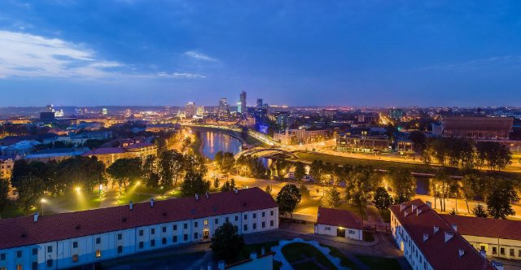

La capitale della Lituania.

- Type: Place
- Subjects: Geography, Culture
- Country: International

### Zaino

Una borsa che porti sulla schiena.

- Type: Object
- Subjects: Recreation, Transportation, Education
- Country: International
- Quests: [Monte Bianco e montagne (fr_08)](../quest/fr_08.it.md)

### Zenzero

Radice piccante utilizzata in cucina e per preparare biscotti.

- Type: Object
- Subjects: Food, Plant
- Country: International
- Quests: [Pan di zenzero e mercato alimentare (pl_06)](../quest/pl_06.it.md)

### Île-de-France

Una regione della Francia dove si trova la capitale Parigi. Qui vivono moltissime persone!

- Type: Place
- Subjects: Geography, Environment
- Country: International
- Quests: [Parigi! (fr_01)](../quest/fr_01.it.md)

## France

### 20000 leghe sotto i mari

Un libro di Jules Verne sulle avventure subacquee a bordo di un sottomarino chiamato Nautilus. Incontrerete creature marine giganti!

- Type: Object
- Subjects: Literature
- Year: 1871
- Country: France
- Quests: [Jules Verne e i trasporti (fr_03)](../quest/fr_03.it.md)

### 24 ore di Le Mans
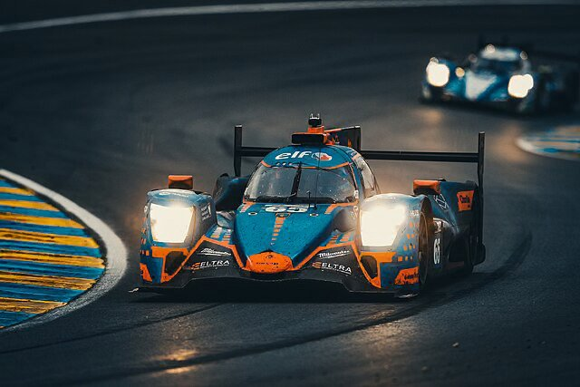

Una gara automobilistica che dura 24 ore. Le squadre guidano giorno e notte.

- Type: Concept
- Subjects: Sport, Culture, History
- Country: France

### Allons enfants

Le prime parole del primo verso dell'inno.

- Type: Object
- Subjects: Music, Education, Culture
- Country: France
- Quests: [La Marsigliese (fr_11)](../quest/fr_11.it.md)

### Arco

Un'arma che scocca frecce.

- Type: Object
- Subjects: History, Technology
- Country: France

### Arco rampante

Braccia in pietra all'esterno che aiutano a sostenere alte mura.

- Type: Concept
- Subjects: Technology, History, Art
- Country: France
- Quests: [Parigi! (fr_01)](../quest/fr_01.it.md)

### Armatura

Indumento protettivo in metallo per un cavaliere.

- Type: Object
- Subjects: History, Safety
- Country: France

### Ascensori della Torre Eiffel

Ascensori che portano i visitatori sulla torre di ferro.

- Type: Object
- Subjects: Technology, Transportation
- Country: France
- Quests: [Parigi! (fr_01)](../quest/fr_01.it.md)

### attraversamento pedonale

Strisce bianche dove le persone attraversano la strada.

- Type: Object
- Subjects: Safety, Education, Transportation
- Country: France

### Auto da corsa

Un'auto molto veloce utilizzata sulle piste da corsa.

- Type: Object
- Subjects: Sport, Technology
- Country: France

### Baguette francese

Un pane lungo e croccante, il più famoso in Francia. I francesi comprano baguette fresche ogni giorno dal panettiere!

- Rationale: Baguettes are iconic French culture that kids can easily understand and remember
- Type: Object
- Subjects: Food, Culture
- Year: 1700
- Country: France
- Quests: [Parigi! (fr_01)](../quest/fr_01.it.md), [Sviluppo (dev)](../quest/dev.it.md)

### Bandiera della Francia

La bandiera francese ha tre strisce verticali: blu, bianco e rosso. Questi colori rappresentano libertà, uguaglianza e fratellanza!

- Rationale: The French flag is essential for teaching French national identity and values
- Type: Concept
- Subjects: Geography, Culture
- Year: 1794
- Country: France
- Quests: [I vicini della Francia (fr_00)](../quest/fr_00.it.md)

### Bandiera di Monaco

La bandiera di Monaco è a strisce orizzontali rosse e bianche. Monaco è piccola ma famosa per le sue auto di lusso e i palazzi reali sul mare!

- Rationale: Monaco shows kids how small places can be special and important
- Type: Concept
- Subjects: Geography, Culture
- Year: 1881
- Country: France
- Quests: [I vicini della Francia (fr_00)](../quest/fr_00.it.md)

### Barcaiolo

Una persona che rema sulla barca sulla Loira.

- Type: Person
- Subjects: Community, Transportation
- Country: France

### Bastioni

Alte mura su cui è possibile camminare per proteggere il castello.

- Type: Concept
- Subjects: History, Technology
- Country: France

### Battello sulla Senna

Un'imbarcazione speciale che naviga sulla Senna a Parigi. Dall'acqua si possono ammirare la Torre Eiffel e altri splendidi edifici!

- Rationale: Boat tours help kids see Paris from a different perspective and understand river transportation
- Type: Concept
- Subjects: Transportation, Geography, Culture
- Year: 1900
- Country: France
- Quests: [Parigi Senna (fr_10)](../quest/fr_10.it.md)

### Bicicletta

Un veicolo con due ruote su cui si pedala.

- Type: Object
- Subjects: Transportation, Health, Recreation
- Country: France

### Bouillabaisse
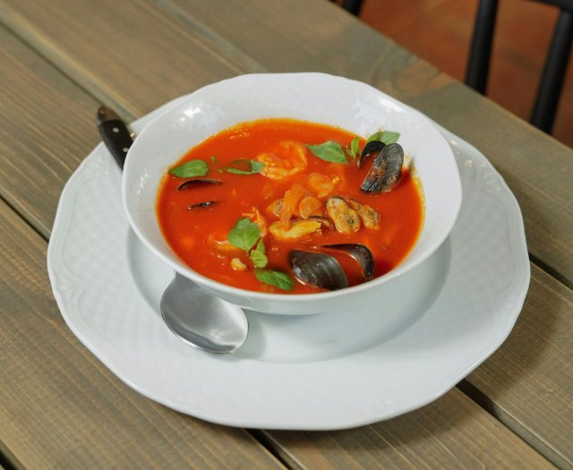

Una zuppa di pesce speciale tipica di Marsiglia, nel sud della Francia. È preparata con molti tipi diversi di pesce e ha un profumo delizioso!

- Type: Object
- Subjects: Food, Culture
- Year: 1700
- Country: France
- Quests: [Cibo e mercato (fr_09)](../quest/fr_09.it.md)

### Camera da letto reale

Una camera elegante con un grande letto a baldacchino.

- Type: Place
- Subjects: Culture, History
- Country: France

### Cappello piumato

Un bel cappello con una piuma per un tocco di stile.

- Type: Object
- Subjects: Culture, History
- Country: France

### Carta della Laicità

Un insieme di regole per rispettare le convinzioni di tutti. Aiuta le persone a vivere insieme in pace.

- Type: Concept
- Subjects: Community, Culture
- Year: 2013
- Country: France
- Quests: [Il sistema scolastico (fr_02)](../quest/fr_02.it.md), [Jules Verne e i trasporti (fr_03)](../quest/fr_03.it.md)

### Casco

Un cappello di metallo che protegge la testa.

- Type: Object
- Subjects: History, Safety
- Country: France

### Casco (sicurezza stradale)

Un casco protettivo per proteggere la testa durante la guida.

- Type: Object
- Subjects: Safety, Health, Education
- Country: France

### Castello di Chambord

Un grande palazzo con numerose finestre e giardini.

- Type: Place
- Subjects: History, Culture, Geography
- Country: France

### Castello di Chinon
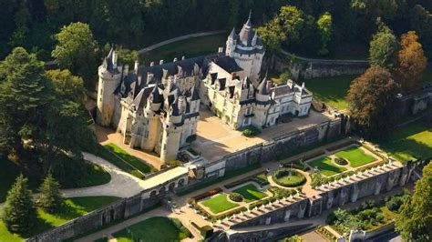

Il Castello di Chinon è una possente fortezza in pietra su una collina che domina il fiume nella Valle della Loira. Molto tempo fa, i re soggiornavano qui e Giovanna d'Arco vi si recò per incontrare il futuro re di Francia.

- Type: Place
- Subjects: History
- Country: France
- Quests: [Una storia di due castelli (fr_05)](../quest/fr_05.it.md)

### Castello di Chinon

Una robusta fortezza in pietra utilizzata a scopo difensivo.

- Type: Place
- Subjects: History, Geography, Culture
- Country: France

### Catapulta

Una macchina che lancia pietre lontano.

- Type: Object
- Subjects: Technology, History
- Country: France

### Cattedrale

Una chiesa molto grande e importante in una città.

- Type: Place
- Subjects: Culture, History, Education
- Country: France
- Quests: [Parigi! (fr_01)](../quest/fr_01.it.md)

### Chiesa

Un edificio speciale dove le persone si incontrano per pregare e cantare.

- Type: Place
- Subjects: Culture, Civics, Education
- Country: France
- Quests: [Parigi! (fr_01)](../quest/fr_01.it.md)

### Cinque settimane in mongolfiera

Un libro di Jules Verne sul volo attraverso l'Africa in mongolfiera. È pieno di avventure e scoperte!

- Type: Object
- Subjects: Literature
- Year: 1863
- Country: France
- Quests: [Jules Verne e i trasporti (fr_03)](../quest/fr_03.it.md)

### Codice di Hammurabi

Una pietra su cui sono incise leggi molto antiche.

- Type: Object
- Subjects: History, Civics
- Country: France
- Quests: [Parigi! (fr_01)](../quest/fr_01.it.md)

### Collège in Francia

Scuola media in Francia per ragazzi dagli 11 ai 15 anni. Gli studenti studiano molte materie e si preparano per la scuola superiore.

- Rationale: Understanding the French school system helps kids compare education across countries
- Type: Concept
- Subjects: Education, Culture
- Year: 1975
- Country: France
- Quests: [Il sistema scolastico (fr_02)](../quest/fr_02.it.md), [Jules Verne e i trasporti (fr_03)](../quest/fr_03.it.md)

### Dalla Terra alla Luna

Un libro di Jules Verne che parla di un viaggio sulla Luna a bordo di un enorme cannone! Fu scritto prima che esistessero i veri razzi.

- Type: Object
- Subjects: Literature, Space, Science
- Year: 1865
- Country: France
- Quests: [Jules Verne e i trasporti (fr_03)](../quest/fr_03.it.md)

### Della patria

Parole dal primo verso dell'inno.

- Type: Object
- Subjects: Music, Education, Culture
- Country: France
- Quests: [La Marsigliese (fr_11)](../quest/fr_11.it.md)

### Do

Una nota musicale.

- Type: Concept
- Subjects: Music, Education
- Country: France

### Esposizione universale (1889)

La grande esposizione universale in cui venne esposta la Torre Eiffel.

- Type: Concept
- Subjects: History, Culture
- Country: France
- Quests: [Parigi! (fr_01)](../quest/fr_01.it.md)

### Est arrivé

Parole dal primo verso dell'inno.

- Type: Object
- Subjects: Music, Education, Culture
- Country: France
- Quests: [La Marsigliese (fr_11)](../quest/fr_11.it.md)

### Fa

Una nota musicale.

- Type: Concept
- Subjects: Music, Education
- Country: France

### Facciata del castello (finestre)

Una parete frontale con numerose grandi finestre che lasciano entrare luce e vista.

- Type: Concept
- Subjects: Culture, Technology
- Country: France

### fiume Loira

Un lungo fiume in Francia con molti castelli lungo le sue rive.

- Type: Place
- Subjects: Geography, Environment
- Country: France

### Francia

Un paese in Europa. La capitale è Parigi.

- Type: Place
- Subjects: Geography, Culture
- Country: France

### Frecce

Bastoni appuntiti scagliati da un arco.

- Type: Object
- Subjects: History, Technology
- Country: France

### Gargoyle

Una statua divertente o spaventosa che funziona anche come sgorgatore di pioggia.

- Type: Concept
- Subjects: Art, Technology, History
- Country: France
- Quests: [Parigi! (fr_01)](../quest/fr_01.it.md)

### Giardini formali

Giardini decorativi per passeggiate e feste.

- Type: Place
- Subjects: Culture, Environment
- Country: France

### Giulio Verne

Uno scrittore francese che immaginava avventure incredibili prima che fossero possibili! Scrisse di sottomarini, razzi e viaggi intorno al mondo.

- Rationale: Jules Verne shows kids how imagination and science can work together
- Type: Person
- Subjects: Literature, Science, History
- Year: 1828
- Country: France
- Quests: [Jules Verne e i trasporti (fr_03)](../quest/fr_03.it.md)

### Giuramento degli Orazi (Davide)
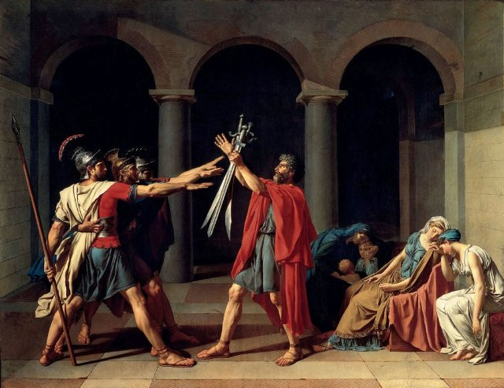

Un dipinto raffigurante tre fratelli che fanno una promessa coraggiosa.

- Type: Object
- Subjects: Art, History
- Country: France
- Quests: [Parigi! (fr_01)](../quest/fr_01.it.md)

### Gustave Eiffel

L'uomo che costruì la Torre Eiffel! Era un ingegnere che amava costruire in ferro e creò la torre più famosa del mondo.

- Type: Person
- Subjects: History, Culture, Science
- Year: 1832
- Country: France
- Quests: [Parigi! (fr_01)](../quest/fr_01.it.md)

### Il giro del mondo in ottanta giorni

Un libro emozionante di Jules Verne che racconta come viaggiare velocemente intorno al mondo utilizzando treni, navi e mongolfiere!

- Type: Object
- Subjects: Literature
- Year: 1873
- Country: France
- Quests: [Jules Verne e i trasporti (fr_03)](../quest/fr_03.it.md)

### Incendio di Notre-Dame

Nel 2019, un grande incendio ha danneggiato la splendida Cattedrale di Notre-Dame a Parigi. Molte persone hanno collaborato per salvare questo importante edificio.

- Rationale: This event teaches kids about protecting cultural heritage and community cooperation
- Type: Concept
- Subjects: History, Culture, Environment
- Year: 2019
- Country: France
- Quests: [Parigi! (fr_01)](../quest/fr_01.it.md)

### Incoronazione di Napoleone (David)

Un enorme dipinto raffigurante la cerimonia di un imperatore francese.

- Type: Object
- Subjects: Art, History
- Country: France
- Quests: [Parigi! (fr_01)](../quest/fr_01.it.md)

### Ingresso al circuito di Le Mans

L'area di ingresso del circuito di Le Mans.

- Type: Place
- Subjects: Geography, Sport, Culture
- Country: France

### Jean Michel Jarre
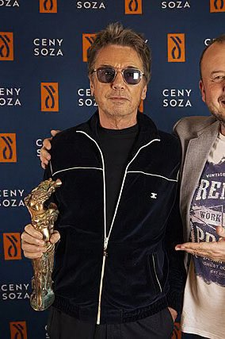

Musicista francese famoso per la musica elettronica. Crea grandi spettacoli di luci.

- Type: Person
- Subjects: Music, Culture, Technology
- Year: 2000
- Country: France

### La

Una nota musicale.

- Type: Concept
- Subjects: Music, Education
- Country: France

### La libertà che guida il popolo

Un famoso dipinto sulla libertà e il coraggio. Mostra una donna coraggiosa che regge la bandiera francese e guida il popolo nella lotta per i propri diritti.

- Rationale: This painting teaches kids about fighting for freedom and the French Revolution
- Type: Object
- Subjects: Art, History, Culture
- Year: 1830
- Country: France

### La Marsigliese

L'inno nazionale francese. Viene cantato durante i grandi eventi e le partite sportive.

- Type: Concept
- Subjects: Music, Culture
- Year: 1885
- Country: France
- Quests: [La Marsigliese (fr_11)](../quest/fr_11.it.md)

### Le jour de la gloire

Parole dal primo verso dell'inno.

- Type: Object
- Subjects: Music, Education, Culture
- Country: France
- Quests: [La Marsigliese (fr_11)](../quest/fr_11.it.md)

### Le Mans

Città francese famosa per la gara automobilistica di 24 ore.

- Type: Place
- Subjects: Geography, Culture, Community
- Country: France

### Liceo in Francia

Scuola superiore in Francia per adolescenti dai 16 ai 18 anni. Gli studenti studiano duramente per sostenere l'esame di Baccalauréat, che permette loro di accedere all'università.

- Rationale: The Lycée system shows kids the path to higher education in France
- Type: Concept
- Subjects: Education, Culture
- Year: 1975
- Country: France
- Quests: [Il sistema scolastico (fr_02)](../quest/fr_02.it.md)

### Liuto

Strumento a corda suonato a corte.

- Type: Object
- Subjects: Music, Culture, History
- Country: France

### Lo scriba seduto

Un'antica statua egizia raffigurante una persona che scrive.

- Type: Object
- Subjects: Art, History
- Country: France
- Quests: [Parigi! (fr_01)](../quest/fr_01.it.md)

### Louvre

Un enorme museo pieno d'arte. È lì che vive la Monna Lisa.

- Type: Place
- Subjects: Art, Culture, History
- Year: 1793
- Country: France
- Quests: [Parigi! (fr_01)](../quest/fr_01.it.md)

### Mappa della Senna

Un'immagine che mostra la Senna e il suo percorso attraverso il territorio.

- Type: Object
- Subjects: Geography, Environment
- Country: France
- Quests: [Parigi Senna (fr_10)](../quest/fr_10.it.md)

### Mappa della Senna a Parigi

Un'immagine che mostra come la Senna scorre attraverso la città di Parigi.

- Type: Object
- Subjects: Science
- Country: France
- Quests: [Parigi Senna (fr_10)](../quest/fr_10.it.md)

### Maschera di Carnevale

Una maschera per feste e balli.

- Type: Object
- Subjects: Culture, History, Recreation
- Country: France

### Mi

Una nota musicale.

- Type: Concept
- Subjects: Music, Education
- Country: France

### Mongolfiera

Un pallone che vola ad aria calda. Il primo esemplare volò in Francia.

- Type: Object
- Subjects: Transportation
- Country: France
- Quests: [Jules Verne e i trasporti (fr_03)](../quest/fr_03.it.md)

### Notre-Dame de Paris

Una splendida cattedrale di Parigi. Le sue vetrate colorate raccontano storie.

- Type: Place
- Subjects: Geography, Environment
- Year: 1885
- Country: France
- Quests: [Parigi! (fr_01)](../quest/fr_01.it.md)

### Parapetto

Il basso muro al limite delle mura.

- Type: Concept
- Subjects: History, Technology
- Country: France

### Pianoforte

Strumento a tastiera utilizzato per suonare melodie e accordi.

- Type: Object
- Subjects: Music, Education
- Country: France

### Piramide del Louvre

La piramide di vetro che costituisce l'ingresso moderno del Louvre.

- Type: Place
- Subjects: Art, Culture, Technology
- Country: France
- Quests: [Parigi! (fr_01)](../quest/fr_01.it.md)

### Pirati francesi
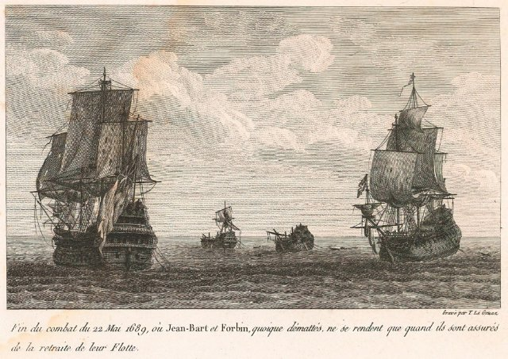

Coraggiosi marinai che solcavano i mari per il re di Francia. Venivano chiamati corsari e proteggevano le navi francesi dai nemici.

- Rationale: Pirates capture kids' imagination while teaching about maritime history and French naval power
- Type: Concept
- Subjects: History, Culture, Transportation
- Year: 1600
- Country: France
- Quests: [Cibo e mercato (fr_09)](../quest/fr_09.it.md)

### Ponte Alessandro III

Uno splendido ponte di Parigi con decorazioni fantasiose e statue dorate.

- Type: Place
- Subjects: Geography, Environment
- Country: France
- Quests: [Parigi Senna (fr_10)](../quest/fr_10.it.md)

### Ponte levatoio

Un ponte che si solleva per proteggere l'ingresso di un castello.

- Type: Object
- Subjects: Technology, History, Safety
- Country: France

### Rif

Una nota musicale.

- Type: Concept
- Subjects: Music, Education
- Country: France

### Rivoluzione francese

Periodo degli anni 1790 in cui la Francia cambiò il suo governo.

- Type: Concept
- Subjects: History, Civics, Time, Culture
- Country: France

### Rosone

Una grande vetrata rotonda che racconta storie attraverso la luce.

- Type: Concept
- Subjects: Art, Culture, History
- Country: France
- Quests: [Parigi! (fr_01)](../quest/fr_01.it.md)

### Sala da ballo

Una grande sala per ballare e ascoltare musica.

- Type: Place
- Subjects: Culture, History
- Country: France

### Saracinesca

Un pesante cancello che si abbassa bloccando l'ingresso.

- Type: Object
- Subjects: Technology, History, Safety
- Country: France

### Scappatoie
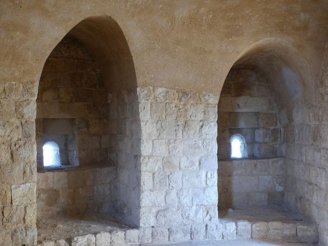

Finestre strette per scoccare le frecce in sicurezza.

- Type: Concept
- Subjects: History, Technology
- Country: France

### Scarpe da ballo

Scarpe fatte per ballare in una sala da ballo.

- Type: Object
- Subjects: Culture, Recreation
- Country: France

### Scooter

Un piccolo scooter a due ruote (trottinette).

- Type: Object
- Subjects: Transportation, Recreation, Safety
- Country: France

### Scrittura corsiva
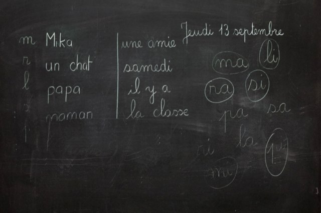

Un modo speciale di scrivere in cui tutte le lettere di una parola sono collegate. In Francia, i bambini imparano a scrivere in questo modo a scuola.

- Rationale: Cursive writing is an important part of French education and cultural identity
- Type: Concept
- Subjects: Education, Culture, Art
- Year: 1800
- Country: France
- Quests: [Il sistema scolastico (fr_02)](../quest/fr_02.it.md)

### Scuola primaria in Francia

Scuola per bambini dai 6 ai 10 anni. Si impara a leggere, scrivere e contare.

- Type: Concept
- Subjects: Education, Culture
- Year: 1975
- Country: France
- Quests: [Il sistema scolastico (fr_02)](../quest/fr_02.it.md)

### Semaforo

Lampioni che ti dicono quando FERMARTI o ANDARE.

- Type: Object
- Subjects: Safety, Education, Transportation
- Country: France

### Senna

Un fiume lungo 777 chilometri nel nord della Francia

- Type: Place
- Subjects: Geography
- Country: France
- Quests: [Parigi Senna (fr_10)](../quest/fr_10.it.md)

### Sol

Una nota musicale.

- Type: Concept
- Subjects: Music, Education
- Country: France

### Sottomarino (Il Nautilus)

Un sottomarino tratto dal racconto di Jules Verne. Poteva esplorare le profondità marine.

- Type: Object
- Subjects: Literature, Science
- Country: France
- Quests: [Jules Verne e i trasporti (fr_03)](../quest/fr_03.it.md)

### Spada

Una lunga lama usata dai cavalieri.

- Type: Object
- Subjects: History, Culture
- Country: France

### Spartito musicale
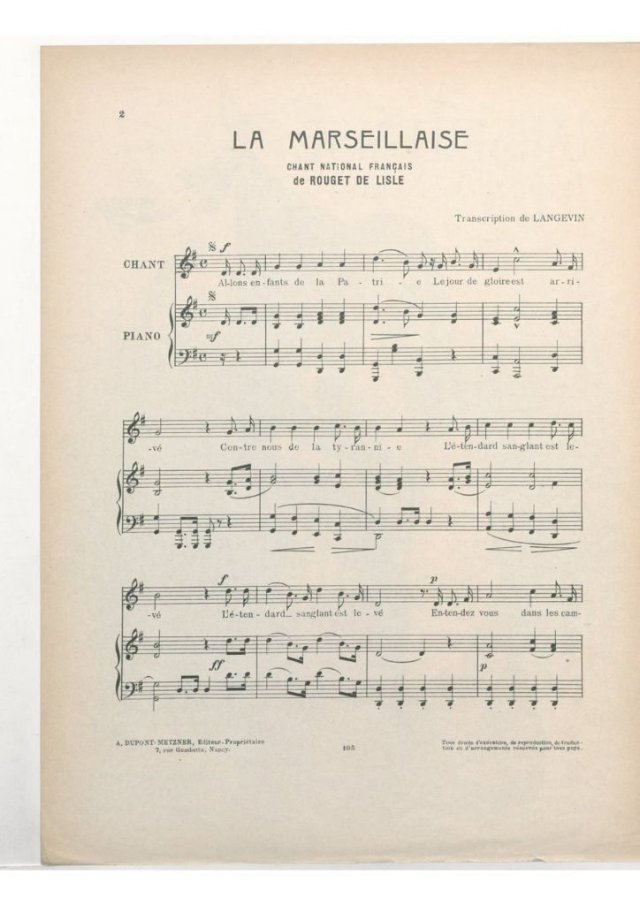

Le note scritte e le parole di una canzone.

- Type: Object
- Subjects: Education, Music
- Country: France

### Stazione ferroviaria di Le Mans
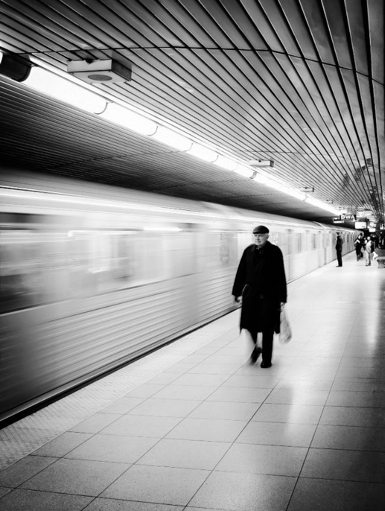

La stazione dove prendi il treno per tornare a casa.

- Type: Place
- Subjects: Geography, Transportation, Community
- Country: France

### Sì

Una nota musicale.

- Type: Concept
- Subjects: Music, Education
- Country: France

### Torre Eiffel

Un'alta torre, simbolo di Parigi. È fatta di ferro e alta 300 metri. È possibile salire e ammirare l'intera città.

- Type: Place
- Subjects: Geography, History, Culture
- Year: 1889
- Country: France
- Quests: [Parigi! (fr_01)](../quest/fr_01.it.md)

### Valle della Loira

Una famosa regione francese con molti castelli.

- Type: Place
- Subjects: Geography, History, Culture
- Country: France

### Vittoria alata di Samotracia

Una famosa scultura antica raffigurante una dea con le ali.

- Type: Object
- Subjects: Art, History
- Country: France
- Quests: [Parigi! (fr_01)](../quest/fr_01.it.md)

### Xilofono

Uno strumento con delle barre che si percuotono per produrre note.

- Type: Object
- Subjects: Music, Education
- Country: France

### École Maternelle

Scuola per bambini dai 3 ai 5 anni. Si impara giocando ed esplorando.

- Type: Concept
- Subjects: Education, Culture
- Year: 1975
- Country: France
- Quests: [Il sistema scolastico (fr_02)](../quest/fr_02.it.md)

## Poland

### Ambra

Resina fossile lucida di albero chiamata "oro baltico".

- Type: Object
- Subjects: History, Culture, Science
- Country: Poland
- Quests: [La collana d'ambra di Danzica (pl_05)](../quest/pl_05.it.md)

### Astronomia

La scienza che studia il Sole, la Luna, le stelle e i pianeti.

- Type: Concept
- Subjects: Science, Space
- Country: Poland
- Quests: [Copernico e il sistema solare (pl_07)](../quest/pl_07.it.md)

### Bandiera della Polonia

La bandiera della Polonia è a strisce orizzontali bianche e rosse. La Polonia è famosa per scienziati come Copernico e per i deliziosi pierogi!

- Rationale: The Polish flag is essential for Polish language learning and cultural identity
- Type: Concept
- Subjects: Geography, Culture
- Year: 1919
- Country: Poland
- Quests: [I vicini della Polonia (pl_00)](../quest/pl_00.it.md)

### Bandiera di Breslavia

La bandiera della città che deve essere ritrovata e restituita.

- Type: Object
- Subjects: Culture, Community, History
- Country: Poland
- Quests: [Lo zoo (pl_04)](../quest/pl_04.it.md)

### Barca

Un veicolo che si muove sull'acqua.

- Type: Object
- Subjects: Transportation
- Country: Poland
- Quests: [Fiume Odra (pl_03)](../quest/pl_03.it.md)

### Breslavia

Una città in Polonia con fiumi, ponti e storia.

- Type: Place
- Subjects: Geography, History, Culture
- Country: Poland
- Quests: [Lo zoo (pl_04)](../quest/pl_04.it.md)

### Breslavia: Cattedrale

Una chiesa grande e importante, dove la gente prega. È possibile salire sulla torre per ammirare il panorama.

- Type: Place
- Subjects: History, Culture
- Country: Poland
- Quests: [Il grande salvataggio dei nani di Breslavia (pl_02)](../quest/pl_02.it.md)

### Breslavia: Sky Tower

Uno degli edifici più alti della Polonia. Ospita negozi e un punto panoramico.

- Type: Place
- Subjects: Geography, Community, Culture
- Country: Poland
- Quests: [Il grande salvataggio dei nani di Breslavia (pl_02)](../quest/pl_02.it.md)

### Camera d'Ambra

Una famosa stanza fatta di ambra con una storia misteriosa.

- Type: Concept
- Subjects: History, Culture
- Country: Poland
- Quests: [La collana d'ambra di Danzica (pl_05)](../quest/pl_05.it.md)

### Cartello

Una lavagna con informazioni semplici per aiutarti a imparare.

- Type: Object
- Subjects: Education, Community
- Country: Poland
- Quests: [Lo zoo (pl_04)](../quest/pl_04.it.md)

### Casa di Niccolò Copernico

Ora è un museo dove è possibile scoprire di più sulla sua vita e sui suoi successi scientifici.

- Type: Place
- Subjects: Culture, Science
- Country: Poland
- Quests: [Copernico e il sistema solare (pl_07)](../quest/pl_07.it.md)

### Casa galleggiante

Una barca fatta per vivere.

- Type: Object
- Subjects: Transportation, Community
- Country: Poland
- Quests: [Fiume Odra (pl_03)](../quest/pl_03.it.md)

### Chiatta

Una lunga imbarcazione piatta che trasporta merci sui fiumi.

- Type: Object
- Subjects: Transportation, Geography
- Country: Poland
- Quests: [Fiume Odra (pl_03)](../quest/pl_03.it.md)

### Collana

Una collana di perline o conchiglie da indossare intorno al collo.

- Type: Object
- Subjects: Art, Culture
- Country: Poland
- Quests: [La collana d'ambra di Danzica (pl_05)](../quest/pl_05.it.md)

### Conchiglia

Un guscio duro di un animale marino, ottimo per i lavoretti.

- Type: Object
- Subjects: Animal, Environment, Art
- Country: Poland
- Quests: [La collana d'ambra di Danzica (pl_05)](../quest/pl_05.it.md)

### Costa del Mar Baltico

La costa sabbiosa lungo il Mar Baltico.

- Type: Place
- Subjects: Geography, Environment
- Country: Poland
- Quests: [La collana d'ambra di Danzica (pl_05)](../quest/pl_05.it.md)

### Cucciolo

Un cucciolo di leone.

- Type: Concept
- Subjects: Animal, Science
- Country: Poland
- Quests: [Lo zoo (pl_04)](../quest/pl_04.it.md)

### Danzica

Città portuale in Polonia sul Mar Baltico.

- Type: Place
- Subjects: Geography, History, Culture
- Country: Poland
- Quests: [La collana d'ambra di Danzica (pl_05)](../quest/pl_05.it.md)

### Direttore dello zoo

La persona che gestisce lo zoo e aiuta i visitatori.

- Type: Person
- Subjects: Community, Education
- Country: Poland
- Quests: [Lo zoo (pl_04)](../quest/pl_04.it.md)

### Ecosistema

Gli esseri viventi e la loro casa nella natura, che lavorano insieme.

- Type: Concept
- Subjects: Environment, Science
- Country: Poland
- Quests: [La collana d'ambra di Danzica (pl_05)](../quest/pl_05.it.md)

### Esperto di nani

Una guida amichevole che sa tutto sui nani.

- Type: Person
- Subjects: Education, Culture
- Country: Poland
- Quests: [Il grande salvataggio dei nani di Breslavia (pl_02)](../quest/pl_02.it.md)

### Faro di Danzica

Un faro storico che aiuta le navi a trovare il porto.

- Type: Place
- Subjects: History, Geography, Transportation
- Country: Poland
- Quests: [La collana d'ambra di Danzica (pl_05)](../quest/pl_05.it.md)

### Fiume Motława

Il fiume che attraversa Danzica fino al mare.

- Type: Place
- Subjects: Geography
- Country: Poland
- Quests: [La collana d'ambra di Danzica (pl_05)](../quest/pl_05.it.md)

### fiume Odra

Un grande fiume nella Polonia occidentale. Aiuta le navi a viaggiare e commerciare.

- Type: Place
- Subjects: Geography, Environment
- Country: Poland
- Quests: [Fiume Odra (pl_03)](../quest/pl_03.it.md)

### fiume Vistola

Il fiume più lungo della Polonia; sfocia nel Mar Baltico.

- Type: Place
- Subjects: Geography, Environment
- Country: Poland
- Quests: [Il grande salvataggio dei nani di Breslavia (pl_02)](../quest/pl_02.it.md)

### fiume Vistola (Wisła)

Il fiume più lungo della Polonia si chiama Wisła o Vistola. Scorre attraverso Cracovia e Varsavia.

- Type: Place
- Subjects: Geography, Environment
- Country: Poland
- Quests: [Fiume Odra (pl_03)](../quest/pl_03.it.md)

### Foca

Un animale marino selvatico che riposa sulle spiagge.

- Type: Object
- Subjects: Animal, Environment, Safety
- Country: Poland
- Quests: [La collana d'ambra di Danzica (pl_05)](../quest/pl_05.it.md)

### Fontana di Nettuno

Una famosa fontana di Danzica con la statua del dio del mare.

- Type: Place
- Subjects: History, Culture, Community
- Country: Poland
- Quests: [La collana d'ambra di Danzica (pl_05)](../quest/pl_05.it.md)

### Fontana multimediale di Breslavia

Acqua che danza con musica e luci colorate.

- Type: Place
- Subjects: Culture, Technology, Recreation
- Country: Poland
- Quests: [Il grande salvataggio dei nani di Breslavia (pl_02)](../quest/pl_02.it.md)

### Fryderyk Chopin

Un famoso compositore polacco per pianoforte. Ha scritto musica meravigliosa che sembra danzare o raccontare storie. La sua musica trasmette felicità o tristezza.

- Rationale: Chopin introduces kids to classical music and shows how music can express emotions
- Type: Person
- Subjects: Music, History, Culture
- Year: 1810
- Country: Poland
- Quests: [Scopri Varsavia (pl_01)](../quest/pl_01.it.md)

### Gabbiano

Un uccello marino che vive vicino alla costa.

- Type: Object
- Subjects: Animal, Environment
- Country: Poland
- Quests: [La collana d'ambra di Danzica (pl_05)](../quest/pl_05.it.md)

### Giove

Il pianeta più grande, famoso per la Grande Macchia Rossa.

- Type: Object
- Subjects: Space, Science
- Country: Poland
- Quests: [Copernico e il sistema solare (pl_07)](../quest/pl_07.it.md)

### guardiano dello zoo

Una persona che si prende cura degli animali allo zoo.

- Type: Person
- Subjects: Community, Animal, Education
- Country: Poland
- Quests: [Lo zoo (pl_04)](../quest/pl_04.it.md)

### Guerre e Sawa

Due figure leggendarie che diedero il nome a Varsavia: Wars era un coraggioso guerriero e Sawa era una bellissima sirena che viveva nel fiume Vistola.

- Type: Concept
- Subjects: Community, Culture
- Year: 1300
- Country: Poland
- Quests: [Scopri Varsavia (pl_01)](../quest/pl_01.it.md)

### Iglica

Un'alta scultura in metallo accanto alla Centennial Hall.

- Type: Place
- Subjects: History, Culture
- Country: Poland
- Quests: [Lo zoo (pl_04)](../quest/pl_04.it.md)

### Kayak
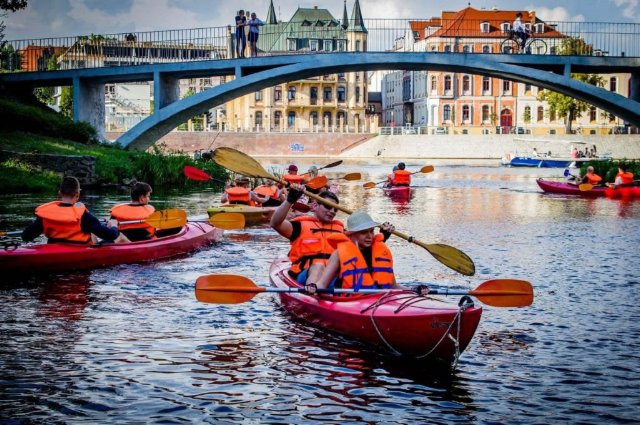

Una piccola barca su cui si pagaia.

- Type: Object
- Subjects: Recreation, Sport
- Country: Poland
- Quests: [Fiume Odra (pl_03)](../quest/pl_03.it.md)

### Lente

Un pezzo di vetro o plastica trasparente che piega la luce.

- Type: Object
- Subjects: Science, Technology
- Country: Poland
- Quests: [Copernico e il sistema solare (pl_07)](../quest/pl_07.it.md)

### Leonardo da Vinci Primary School

It’s a friendly place where children learn, create, and explore guided by curiosity, art, and science.

- Type: None
- Subjects: Education
- Country: Poland
- Quests: [Il grande salvataggio dei nani di Breslavia (pl_02)](../quest/pl_02.it.md)

### Maestro delle Chiavi Nano

Una statua nana sorveglia l'ascensore con una grande chiave.

- Type: Object
- Subjects: Culture
- Country: Poland
- Quests: [Il grande salvataggio dei nani di Breslavia (pl_02)](../quest/pl_02.it.md)

### Map of Wroklaw

A simple map of Wrocław showing the Odra River with its islands and many bridges

- Type: None
- Subjects: Geography
- Country: Poland
- Quests: [Il grande salvataggio dei nani di Breslavia (pl_02)](../quest/pl_02.it.md), [Fiume Odra (pl_03)](../quest/pl_03.it.md)

### Maria Curie

Una brillante scienziata polacca che scoprì la radioattività. Fu la prima donna a vincere il Premio Nobel, e lo vinse due volte!

- Rationale: Maria Curie inspires kids (especially girls) to pursue science and shows Polish contributions to science
- Type: Person
- Subjects: Science, History
- Year: 1867
- Country: Poland
- Quests: [Scopri Varsavia (pl_01)](../quest/pl_01.it.md)

### Marte

Il pianeta rosso con polvere e grandi vulcani.

- Type: Object
- Subjects: Space, Science
- Country: Poland
- Quests: [Copernico e il sistema solare (pl_07)](../quest/pl_07.it.md)

### Mercurio

Il pianeta più vicino al Sole; piccolo e molto veloce.

- Type: Object
- Subjects: Space, Science
- Country: Poland
- Quests: [Copernico e il sistema solare (pl_07)](../quest/pl_07.it.md)

### Modello eliocentrico

L'idea che il Sole sia al centro e che i pianeti gli girino attorno.

- Type: Concept
- Subjects: Science, Space, History
- Country: Poland
- Quests: [Copernico e il sistema solare (pl_07)](../quest/pl_07.it.md)

### Monumento a Chopin

Una grande statua nel Parco Łazienki di Varsavia, dedicata a Frédéric Chopin. È anche sede di popolari concerti di pianoforte all'aperto in estate. (L'albero speciale sotto cui è seduto è un tipico salice polacco)

- Type: Object
- Subjects: Music, Culture
- Country: Poland
- Quests: [Scopri Varsavia (pl_01)](../quest/pl_01.it.md)

### Municipio

Il luogo in cui i leader della città lavorano e si incontrano.

- Type: Concept
- Subjects: Civics, Community, History
- Country: Poland
- Quests: [Il grande salvataggio dei nani di Breslavia (pl_02)](../quest/pl_02.it.md)

### Municipio di Toruń

Un grande edificio gotico a Toruń, vicino alla piazza del mercato.

- Type: Place
- Subjects: History, Geography, Culture
- Country: Poland
- Quests: [Pan di zenzero e mercato alimentare (pl_06)](../quest/pl_06.it.md)

### Municipio principale

Un alto municipio con torre e museo.

- Type: Place
- Subjects: History, Culture
- Country: Poland
- Quests: [La collana d'ambra di Danzica (pl_05)](../quest/pl_05.it.md)

### Nani di Breslavia

Piccole statue sparse per la città che amano fare scherzi.

- Type: Concept
- Subjects: Culture, Community, History
- Country: Poland
- Quests: [Il grande salvataggio dei nani di Breslavia (pl_02)](../quest/pl_02.it.md)

### Nano amante degli animali

Una statua di un nano che ama lo zoo e gli animali.

- Type: Object
- Subjects: Culture, Animal, Education
- Country: Poland
- Quests: [Il grande salvataggio dei nani di Breslavia (pl_02)](../quest/pl_02.it.md)

### Nano polacco (gnomi di Breslavia)

Piccole statue di nani si nascondono in giro per Breslavia. Trovarle è un divertente gioco cittadino.

- Type: Concept
- Subjects: Community, Culture
- Year: 1700
- Country: Poland
- Quests: [Scopri Varsavia (pl_01)](../quest/pl_01.it.md), [Il grande salvataggio dei nani di Breslavia (pl_02)](../quest/pl_02.it.md)

### Nave

Una grande imbarcazione che trasporta persone o merci.

- Type: Object
- Subjects: Transportation
- Country: Poland
- Quests: [La collana d'ambra di Danzica (pl_05)](../quest/pl_05.it.md)

### Navigazione

Orientarsi in mare utilizzando luci, mappe e strumenti.

- Type: Concept
- Subjects: Technology, Geography
- Country: Poland
- Quests: [La collana d'ambra di Danzica (pl_05)](../quest/pl_05.it.md)

### Nettuno

Il dio del mare delle vecchie storie.

- Type: Concept
- Subjects: Culture, History
- Country: Poland
- Quests: [Copernico e il sistema solare (pl_07)](../quest/pl_07.it.md)

### Niccolò Copernico

Un brillante scienziato polacco ha scoperto che è la Terra a girare intorno al Sole, non il contrario! Questo ha cambiato il nostro modo di concepire lo spazio.

- Rationale: Copernicus teaches kids about scientific discovery and Polish contributions to astronomy
- Type: Person
- Subjects: Science, History, Space
- Year: 1473
- Country: Poland
- Quests: [Copernico e il sistema solare (pl_07)](../quest/pl_07.it.md)

### Oculare

La piccola lente attraverso cui si guarda in un telescopio.

- Type: Object
- Subjects: Science, Technology
- Country: Poland
- Quests: [Copernico e il sistema solare (pl_07)](../quest/pl_07.it.md)

### Odra river map
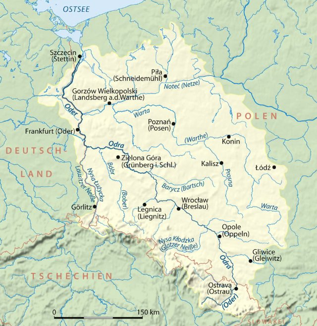

A simple map that shows the Odra River in Poland and the way it flows to the Baltic Sea

- Type: None
- Subjects: Geography
- Country: Poland
- Quests: [Fiume Odra (pl_03)](../quest/pl_03.it.md)

### Olga Tokarczuk

Un famoso scrittore polacco che vive a Breslavia.

- Type: Person
- Subjects: Literature, Culture
- Country: Poland
- Quests: [Il grande salvataggio dei nani di Breslavia (pl_02)](../quest/pl_02.it.md)

### Onde

Acqua in movimento sul mare.

- Type: Concept
- Subjects: Environment, Science
- Country: Poland
- Quests: [La collana d'ambra di Danzica (pl_05)](../quest/pl_05.it.md)

### Pan di zenzero di Torun

una delizia tradizionale polacca a base di spezie e miele, spesso decorata con bellissimi disegni.

- Type: Object
- Subjects: Food
- Country: Poland
- Quests: [Pan di zenzero e mercato alimentare (pl_06)](../quest/pl_06.it.md)

### Panorama Racławicka

Un dipinto gigante tutto intorno a te che racconta una battaglia storica.

- Type: Place
- Subjects: History, Art, Culture
- Country: Poland
- Quests: [Il grande salvataggio dei nani di Breslavia (pl_02)](../quest/pl_02.it.md)

### Pappagallo

Un uccello brillante che sa imitare i suoni.

- Type: Object
- Subjects: Animal, Science
- Country: Poland
- Quests: [Lo zoo (pl_04)](../quest/pl_04.it.md)

### Passerella

Un ponte su cui le persone possono camminare. Niente auto.

- Type: Object
- Subjects: Transportation, Community
- Country: Poland
- Quests: [Fiume Odra (pl_03)](../quest/pl_03.it.md)

### Pavone

Un uccello colorato con una grande coda di piume.

- Type: Object
- Subjects: Animal, Science, Art
- Country: Poland
- Quests: [Lo zoo (pl_04)](../quest/pl_04.it.md)

### Pescatore

Persona che pesca in mare.

- Type: Person
- Subjects: Community, Geography
- Country: Poland
- Quests: [La collana d'ambra di Danzica (pl_05)](../quest/pl_05.it.md)

### Piazza del mercato di Breslavia

La piazza principale della Città Vecchia, piena di vita.

- Type: Place
- Subjects: Geography, Culture, Community, History
- Country: Poland
- Quests: [Il grande salvataggio dei nani di Breslavia (pl_02)](../quest/pl_02.it.md)

### Pierogi polacchi
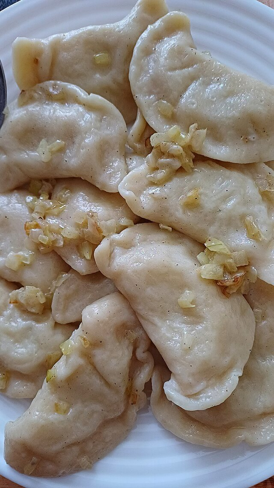

Ravioli ripieni di patate, formaggio o frutta. Sono un famoso piatto polacco.

- Type: Object
- Subjects: Food, Culture
- Year: 1600
- Country: Poland
- Quests: [Pan di zenzero e mercato alimentare (pl_06)](../quest/pl_06.it.md)

### Planetario

Un luogo dove è possibile osservare il cielo e le stelle restando al chiuso.

- Type: Place
- Subjects: Education, Science, Space
- Country: Poland
- Quests: [Copernico e il sistema solare (pl_07)](../quest/pl_07.it.md)

### Ponte
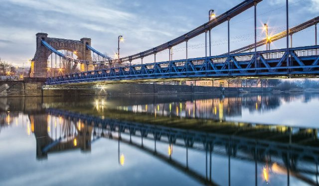

Una struttura che consente alle persone o ai veicoli di attraversare l'acqua.

- Type: Concept
- Subjects: Technology, Transportation
- Country: Poland
- Quests: [Fiume Odra (pl_03)](../quest/pl_03.it.md)

### Ponte ferroviario

Un ponte con binari per treni.

- Type: Object
- Subjects: Transportation, Technology
- Country: Poland
- Quests: [Fiume Odra (pl_03)](../quest/pl_03.it.md)

### Ponte Rędziński

Il ponte strallato più lungo della Polonia.

- Type: Place
- Subjects: Geography, Transportation, Technology
- Country: Poland
- Quests: [Fiume Odra (pl_03)](../quest/pl_03.it.md)

### Ponte stradale

Un ponte per auto e autobus.

- Type: Object
- Subjects: Transportation
- Country: Poland
- Quests: [Fiume Odra (pl_03)](../quest/pl_03.it.md)

### Ponte Tumski

Un famoso ponte con lucchetti dell'amore e lanterne a gas.

- Type: Place
- Subjects: Culture, Geography, Community
- Country: Poland
- Quests: [Fiume Odra (pl_03)](../quest/pl_03.it.md)

### Ponti di Breslavia

A Breslavia ci sono molti ponti che attraversano il fiume Odra.

- Type: Concept
- Subjects: Geography, Transportation, Community
- Country: Poland
- Quests: [Fiume Odra (pl_03)](../quest/pl_03.it.md)

### Porta

Un luogo dove le navi caricano e scaricano.

- Type: Place
- Subjects: Transportation, Community, Geography
- Country: Poland
- Quests: [La collana d'ambra di Danzica (pl_05)](../quest/pl_05.it.md)

### Re Sigismondo III

Re di Polonia, che costruì molti splendidi edifici a Varsavia. La sua statua si erge su un'alta colonna nel centro della città.

- Rationale: Historical kings help kids understand how cities were built and developed over time
- Type: Person
- Subjects: History, Culture
- Year: 1566
- Country: Poland
- Quests: [Scopri Varsavia (pl_01)](../quest/pl_01.it.md)

### Recinto per animali

Uno spazio sicuro pensato per far vivere gli animali allo zoo.

- Type: Place
- Subjects: Animal, Safety
- Country: Poland
- Quests: [Lo zoo (pl_04)](../quest/pl_04.it.md)

### Rete da pesca
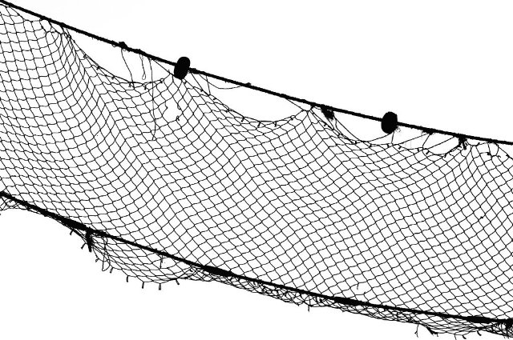

Una rete usata per catturare i pesci.

- Type: Object
- Subjects: Technology, Community
- Country: Poland
- Quests: [La collana d'ambra di Danzica (pl_05)](../quest/pl_05.it.md)

### Sala del Centenario

La Centennial Hall è un enorme edificio che sembra una grande tenda con un tetto. È molto alto. Al suo interno si possono vedere diversi spettacoli, ascoltare concerti o guardare partite sportive.

- Type: Place
- Subjects: Culture, Recreation
- Country: Poland
- Quests: [Il grande salvataggio dei nani di Breslavia (pl_02)](../quest/pl_02.it.md)

### Saturno

Un pianeta gigante con anelli luminosi e numerose lune.

- Type: Object
- Subjects: Space, Science
- Country: Poland
- Quests: [Copernico e il sistema solare (pl_07)](../quest/pl_07.it.md)

### Sirena di Varsavia

Il simbolo della città è una coraggiosa sirena con spada e scudo. La sua statua è visibile lungo il fiume.

- Type: Object
- Subjects: Culture, History
- Country: Poland
- Quests: [Scopri Varsavia (pl_01)](../quest/pl_01.it.md)

### Sistema solare

Il Sole e gli otto pianeti che gli ruotano attorno.

- Type: Concept
- Subjects: Space, Science
- Country: Poland
- Quests: [Copernico e il sistema solare (pl_07)](../quest/pl_07.it.md)

### Sky Tower Plaza

Una piazza moderna dove le persone si incontrano vicino alla torre.

- Type: Place
- Subjects: Geography, Community, Recreation
- Country: Poland
- Quests: [Il grande salvataggio dei nani di Breslavia (pl_02)](../quest/pl_02.it.md)

### Statua del nano di Breslavia

Una piccola statua cittadina; i nani sono il simbolo di Breslavia.

- Type: Object
- Subjects: Culture, Community, History
- Country: Poland
- Quests: [Il grande salvataggio dei nani di Breslavia (pl_02)](../quest/pl_02.it.md)

### Taglierina

Una piccola barca da pesca usata in mare.

- Type: Object
- Subjects: Transportation, Technology
- Country: Poland
- Quests: [La collana d'ambra di Danzica (pl_05)](../quest/pl_05.it.md)

### Telescopio

Uno strumento che ci aiuta a vedere cose lontane nel cielo.

- Type: Object
- Subjects: Science, Technology, Space
- Country: Poland
- Quests: [Copernico e il sistema solare (pl_07)](../quest/pl_07.it.md)

### Terra

Il nostro pianeta natale con terra, aria e acqua.

- Type: Object
- Subjects: Space, Science, Geography, Environment
- Country: Poland
- Quests: [Copernico e il sistema solare (pl_07)](../quest/pl_07.it.md)

### Toruń
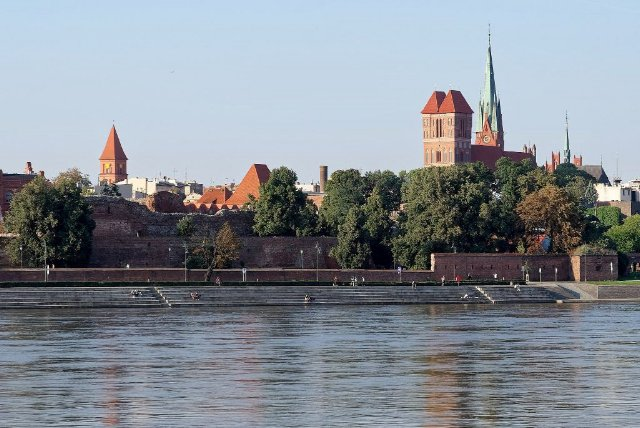

Città della Polonia in cui nacque Niccolò Copernico.

- Type: Place
- Subjects: Geography, History, Culture
- Country: Poland
- Quests: [Copernico e il sistema solare (pl_07)](../quest/pl_07.it.md)

### Urano

Un pianeta blu-verde che ruota su un lato.

- Type: Object
- Subjects: Space, Science
- Country: Poland
- Quests: [Copernico e il sistema solare (pl_07)](../quest/pl_07.it.md)

### Valuta Zloty

La valuta polacca si chiama złoty. Monete e banconote riportano simboli polacchi.

- Type: Concept
- Subjects: Money, Geography
- Country: Poland
- Quests: [Pan di zenzero e mercato alimentare (pl_06)](../quest/pl_06.it.md)

### Vecchio Municipio (Breslavia)

Uno splendido edificio gotico nella piazza principale. Ha un famoso orologio.

- Type: Place
- Subjects: Geography, Environment
- Country: Poland
- Quests: [Il grande salvataggio dei nani di Breslavia (pl_02)](../quest/pl_02.it.md)

### Venere

Un pianeta molto caldo ricoperto da spesse nubi.

- Type: Object
- Subjects: Space, Science
- Country: Poland
- Quests: [Copernico e il sistema solare (pl_07)](../quest/pl_07.it.md)

### Vescovo nano

Una statua nana che pone una domanda in chiesa.

- Type: Object
- Subjects: Culture, History
- Country: Poland
- Quests: [Il grande salvataggio dei nani di Breslavia (pl_02)](../quest/pl_02.it.md)

### Zoo di Breslavia

Un grande zoo a Breslavia con molti animali da scoprire.

- Type: Place
- Subjects: Geography, Education, Animal
- Country: Poland
- Quests: [Lo zoo (pl_04)](../quest/pl_04.it.md)

### Żuraw Crane

Una vecchia gru portuale e una porta della città sul fiume.

- Type: Place
- Subjects: History, Technology, Geography
- Country: Poland
- Quests: [La collana d'ambra di Danzica (pl_05)](../quest/pl_05.it.md)

