# Cards(it)

Language: [english](./index.md) - [french](./index.fr.md) - [polish](./index.pl.md) - italian

!!! note "Educators: help improving these cards!"
    **Comments and feedback**: [discuss in the Forum](https://vgwb.discourse.group)  
    **Improve translations**: [comment here](https://docs.google.com/spreadsheets/d/1M3uOeqkbE4uyDs5us5vO-nAFT8Aq0LGBxjjT_CSScWw/edit?gid=415931977#gid=415931977)  

Total found:** 364**

## International

### Acqua
{ loading=lazy }

L'acqua è essenziale per tutta la vita

- Type: Object
- Subjects: Food, Culture
- Country: International
- Topics: [Baguette](../topics/index.md#baguette)
- Image credit: CC0

---

### Alpi
{ loading=lazy }

Un'alta catena montuosa in Europa.

- Type: Place
- Subjects: Geography, Environment
- Country: International
- Topics: [mont blanc](../topics/index.md#mont_blanc)
- Image credit: CC_BY_SA | Drat70 | [source](https://commons.wikimedia.org/wiki/File:Alps_regions.svg)
- Quests: [Monte Bianco e montagne (fr_08)](../quest/fr_08.it.md)

---

### Apicoltore
{ loading=lazy }

Persona che si prende cura delle api e raccoglie il miele.

- Type: Person
- Subjects: Community, Animal, Food
- Country: International
- Image credit: CC_BY | Michael Gäbler | [source](https://commons.wikimedia.org/wiki/File:Beekeeper_keeping_bees.jpg)
- Quests: [Pan di zenzero e mercato alimentare (pl_06)](../quest/pl_06.it.md)

---

### Arancia
{ loading=lazy }

Un frutto rotondo e arancione, dal sapore dolce e succoso. Le arance sono ricche di vitamina C!

- Type: Object
- Subjects: Food, Culture
- Country: International
- Topics: [Bouillabaisse](../topics/index.md#bouillabaisse)
- Image credit: CC0 | [source](https://commons.wikimedia.org/wiki/File:Orange-Fruit-Pieces.jpg)
- Quests: [Cibo e mercato (fr_09)](../quest/fr_09.it.md)

---

### Arrampicata
{ loading=lazy }

Salire su rocce o ghiaccio con attrezzatura speciale.

- Type: Concept
- Subjects: Sport, Safety, Recreation
- Country: International
- Topics: [mountain activities](../topics/index.md#mountain_activities)
- Image credit: CC_BY_SA | Original version: Valentin Chapuis
Derivative version: Subsidiary account (image rotated 90 degrees CCW) | [source](https://commons.wikimedia.org/wiki/File:Flo_dans_Juvsøyla_à_Rjukan,_Norvège-rotated.jpg)
- Quests: [Monte Bianco e montagne (fr_08)](../quest/fr_08.it.md)

---

### Aula
{ loading=lazy }

Un'aula della scuola dove gli studenti si siedono e imparano cose nuove dal loro insegnante.

- Type: Place
- Subjects: Education, Community
- Country: International
- Image credit: CC0
- Quests: [Il sistema scolastico (fr_02)](../quest/fr_02.it.md), [Jules Verne e i trasporti (fr_03)](../quest/fr_03.it.md)

---

### Auto
{ loading=lazy }

Un piccolo veicolo per le strade.

- Type: Object
- Subjects: Transportation
- Country: International
- Image credit: CC_BY_SA | Rhododendrites | [source](https://commons.wikimedia.org/wiki/File:Abandoned_car_in_Marine_Park_(10852p).jpg)
- Quests: [Scopri Varsavia (pl_01)](../quest/pl_01.it.md)

---

### Autobus
{ loading=lazy }

Un veicolo di grandi dimensioni che trasporta molte persone.

- Type: Object
- Subjects: Transportation, Community
- Country: International
- Image credit: CC_BY_SA | Xosema | [source](https://commons.wikimedia.org/wiki/File:Setra_S6_-_Empresa_Mosquera_-_02.jpg)
- Quests: [Scopri Varsavia (pl_01)](../quest/pl_01.it.md)

---

### Bandiera del Belgio
{ loading=lazy }

La bandiera del Belgio ha tre strisce verticali: nera, gialla e rossa. Il Belgio è famoso per il cioccolato e i waffle!

- Rationale: Belgium's unique vertical stripes help kids distinguish different flag patterns
- Type: Concept
- Subjects: Geography, Culture
- Year: 1831
- Country: International
- Topics: [Flags of Europe](../topics/index.md#flags_euroe), [Countries around France](../topics/index.md#france_countries_around)
- Image credit: CC0
- Quests: [I vicini della Francia (fr_00)](../quest/fr_00.it.md)

---

### Bandiera del Lussemburgo
{ loading=lazy }

La bandiera del Lussemburgo è a strisce orizzontali rosse, bianche e azzurre. Il Lussemburgo è un paese molto piccolo in cui si parlano tre lingue!

- Rationale: Small multilingual countries teach kids about European diversity
- Type: Concept
- Subjects: Geography, Culture
- Year: 1972
- Country: International
- Topics: [Flags of Europe](../topics/index.md#flags_euroe), [Countries around France](../topics/index.md#france_countries_around)
- Image credit: CC0
- Quests: [I vicini della Francia (fr_00)](../quest/fr_00.it.md)

---

### Bandiera dell'Ucraina
{ loading=lazy }

Una bandiera con i colori blu e giallo, come il cielo e il sole. Rappresenta il paese dell'Ucraina.

- Type: Concept
- Subjects: Community, Culture
- Country: International
- Topics: [Flags of Europe](../topics/index.md#flags_euroe), [Poland Countries](../topics/index.md#poland_countries_around)
- Image credit: CC0
- Quests: [I vicini della Francia (fr_00)](../quest/fr_00.it.md), [I vicini della Polonia (pl_00)](../quest/pl_00.it.md)

---

### Bandiera della Bielorussia
{ loading=lazy }

La bandiera della Bielorussia presenta strisce orizzontali rosse e verdi con splendidi motivi tradizionali sui lati. La Bielorussia è uno stato vicino alla Polonia.

- Rationale: Learning neighboring countries helps kids understand regional geography
- Type: Concept
- Subjects: Geography, Culture
- Year: 1995
- Country: International
- Topics: [Poland Countries](../topics/index.md#poland_countries_around)
- Image credit: CC0
- Quests: [I vicini della Polonia (pl_00)](../quest/pl_00.it.md)

---

### Bandiera della Lituania
{ loading=lazy }

La bandiera presenta strisce orizzontali gialle, verdi e rosse. La Lituania è un paese baltico con splendide foreste e spiagge.

- Rationale: Baltic countries teach kids about northern European geography and Poland's neighbors
- Type: Concept
- Subjects: Geography, Culture
- Year: 1988
- Country: International
- Topics: [Poland Countries](../topics/index.md#poland_countries_around)
- Image credit: CC0
- Quests: [I vicini della Polonia (pl_00)](../quest/pl_00.it.md)

---

### Bandiera della Russia
{ loading=lazy }

Una bandiera a strisce bianche, blu e rosse. Rappresenta la Russia.

- Type: Concept
- Subjects: Community, Culture
- Country: International
- Topics: [Poland Countries](../topics/index.md#poland_countries_around)
- Image credit: CC0
- Quests: [I vicini della Polonia (pl_00)](../quest/pl_00.it.md)

---

### Bandiera della Slovacchia
{ loading=lazy }

Una bandiera con i colori bianco, blu e rosso. Rappresenta la Slovacchia.

- Type: Concept
- Subjects: Community, Culture
- Country: International
- Topics: [Flags of Europe](../topics/index.md#flags_euroe), [Poland Countries](../topics/index.md#poland_countries_around)
- Image credit: CC0
- Quests: [I vicini della Francia (fr_00)](../quest/fr_00.it.md), [I vicini della Polonia (pl_00)](../quest/pl_00.it.md)

---

### Bandiera della Svizzera
{ loading=lazy }

La bandiera svizzera è rossa con una croce bianca al centro. Sembra un kit di pronto soccorso! La Svizzera è famosa per le montagne e il formaggio.

- Rationale: The Swiss flag's unique cross design helps kids remember this mountain country
- Type: Concept
- Subjects: Geography, Culture
- Year: 1889
- Country: International
- Topics: [Flags of Europe](../topics/index.md#flags_euroe), [Countries around France](../topics/index.md#france_countries_around)
- Image credit: CC0
- Quests: [I vicini della Francia (fr_00)](../quest/fr_00.it.md)

---

### barca fluviale
{ loading=lazy }

Una barca che naviga sui fiumi. I fiumi sono come strade fatte d'acqua!

- Type: Place
- Subjects: Geography, Environment
- Country: International
- Topics: [Seine Bridges](../topics/index.md#seine_bridges)
- Image credit: CC0
- Quests: [Parigi Senna (fr_10)](../quest/fr_10.it.md)

---

### Barca per le persone
{ loading=lazy }

Un'imbarcazione che trasporta le persone da un luogo all'altro attraverso l'acqua.

- Type: Place
- Subjects: Geography, Environment
- Country: International
- Image credit: CC0

---

### Barca per merci
{ loading=lazy }

Una grande imbarcazione che trasporta scatole, cibo e altre cose da un posto all'altro.

- Type: Place
- Subjects: Geography, Environment
- Country: International
- Image credit: CC0

---

### Belgio
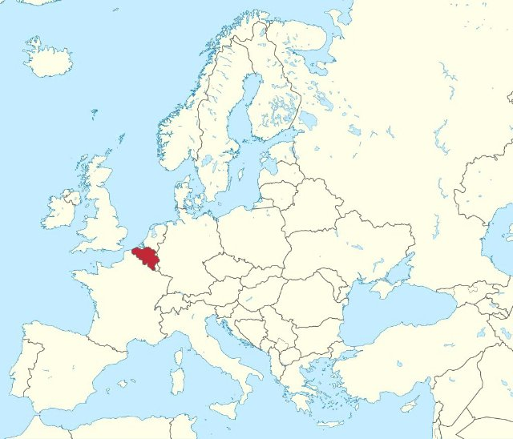{ loading=lazy }

Un paese in Europa. La capitale è Bruxelles.

- Type: Place
- Subjects: Geography, Culture
- Country: International
- Image credit: CC_BY | Loc7798_R01.jpg: Marc Ryckaert (MJJR)
derivative work: Kabelleger (talk) | [source](https://commons.wikimedia.org/wiki/File:Loc7798_R01_alt.jpg)

---

### Berna
{ loading=lazy }

La capitale della Svizzera.

- Type: Place
- Subjects: Geography, Culture
- Country: International
- Image credit: CC_BY_SA | Daniel Kraft | [source](https://commons.wikimedia.org/wiki/File:Bern_Panorama_von_Rosengarten_20211007.jpg)

---

### Bicicletta
{ loading=lazy }

Un veicolo a due ruote su cui si pedala.

- Type: Object
- Subjects: Transportation, Sport, Health
- Country: International
- Image credit: CC_BY_SA | Basile Morin | [source](https://commons.wikimedia.org/wiki/File:Parked_bicycle_with_graffitied_building_facade_and_doors_in_Amsterdam.jpg)
- Quests: [Scopri Varsavia (pl_01)](../quest/pl_01.it.md)

---

### Bielorussia
{ loading=lazy }

Un paese in Europa. La capitale è Minsk.

- Type: Place
- Subjects: Geography, Culture
- Country: International
- Topics: [Poland Countries](../topics/index.md#poland_countries_around)
- Image credit: CC0 | [source](https://commons.wikimedia.org/wiki/File:Satellite_image_of_Belarus_in_December_2002.jpg)

---

### biglietto per la Torre Eiffel
{ loading=lazy }

Una carta speciale che ti consente di visitare la famosa torre alta di Parigi, in Francia.

- Type: Object
- Subjects: Science
- Country: International
- Topics: [Eiffel Tower](../topics/index.md#eiffel-tower)
- Image credit: CC0
- Quests: [Parigi! (fr_01)](../quest/fr_01.it.md)

---

### Bob
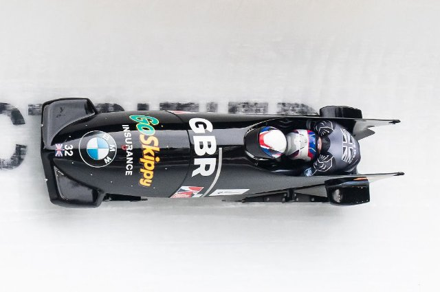{ loading=lazy }

Una slitta veloce usata per scivolare sul ghiaccio.

- Type: Object
- Subjects: Sport, Recreation
- Country: International
- Image credit: CC_BY_SA | Steffen Prößdorf | [source](https://commons.wikimedia.org/wiki/File:2020-02-22_IBSF_World_Championships_Bobsleigh_and_Skeleton_Altenberg_1DX_5978_by_Stepro.jpg)
- Quests: [Monte Bianco e montagne (fr_08)](../quest/fr_08.it.md)

---

### Bratislava
{ loading=lazy }

La capitale della Slovacchia.

- Type: Place
- Subjects: Geography, Culture
- Country: International
- Image credit: CC_BY_SA | Jakub Hałun | [source](https://commons.wikimedia.org/wiki/File:View_of_Bratislava_from_Nový_most,_20210727_1012_0262.jpg)

---

### Bruxelles
{ loading=lazy }

La capitale del Belgio.

- Type: Place
- Subjects: Geography, Culture
- Country: International
- Image credit: CC_BY_SA | Horst J. Meuter | [source](https://commons.wikimedia.org/wiki/File:Atomium,_Brüssel_2.jpg)

---

### Burro
{ loading=lazy }

Grasso giallo ricavato dal latte, utilizzato per cucinare e cuocere al forno.

- Type: Object
- Subjects: Food, Animal
- Country: International
- Topics: [Gingerbread](../topics/index.md#gingerbread)
- Image credit: CC0 | Antoine Vollon | [source](https://commons.wikimedia.org/wiki/File:Antoine_Vollon_-_Mound_of_Butter_-_National_Gallery_of_Art.jpg)
- Quests: [Pan di zenzero e mercato alimentare (pl_06)](../quest/pl_06.it.md)

---

### Bussola
{ loading=lazy }

Uno strumento che ti aiuta a disegnare cerchi perfetti. Ha due gambe come forbici.

- Type: Object
- Subjects: Math
- Country: International
- Topics: [Elementary Math](../topics/index.md#elementary-maths)
- Image credit: CC0 | [source](https://commons.wikimedia.org/wiki/File:2023070201_Voigt_Schulzirkel_gespreizt_2023.jpg)
- Quests: [Il sistema scolastico (fr_02)](../quest/fr_02.it.md)

---

### Calcio
{ loading=lazy }

Un gioco di squadra che si gioca calciando una palla.

- Type: Object
- Subjects: Sport, Recreation, Community
- Country: International
- Image credit: CC_BY_SA | Clément Bucco-Lechat | [source](https://commons.wikimedia.org/wiki/File:Algérie_-_Arménie_-_20140531_-_Yacine_Brahimi_(Alg)_face_à_Taron_Voskanyan_(Arm).jpg)
- Quests: [Scopri Varsavia (pl_01)](../quest/pl_01.it.md)

---

### Camere del Parlamento polacco
{ loading=lazy }

Dove vengono fatte le leggi: il Sejm e il Senato.

- Type: Place
- Subjects: Civics, History, Geography
- Country: International
- Image credit: CC0
- Quests: [Scopri Varsavia (pl_01)](../quest/pl_01.it.md)

---

### Campo da calcio
{ loading=lazy }

Il campo erboso dove si gioca a calcio.

- Type: Place
- Subjects: Sport, Recreation, Community
- Country: International
- Image credit: CC_BY_SA | لا روسا | [source](https://commons.wikimedia.org/wiki/File:Santiagobernabeupanoramav45.JPG)
- Quests: [Scopri Varsavia (pl_01)](../quest/pl_01.it.md)

---

### Cannella
{ loading=lazy }

Una spezia dolce ricavata dalla corteccia degli alberi.

- Type: Object
- Subjects: Food, Plant
- Country: International
- Topics: [Gingerbread](../topics/index.md#gingerbread)
- Image credit: CC_BY_SA | Simon A. Eugster | [source](https://commons.wikimedia.org/wiki/File:Cinnamomum_verum_spices.jpg)
- Quests: [Pan di zenzero e mercato alimentare (pl_06)](../quest/pl_06.it.md)

---

### Cappello
{ loading=lazy }

Un berretto caldo per la testa.

- Type: Object
- Subjects: Health, Safety, Weather
- Country: International
- Topics: [mountain tools](../topics/index.md#mountain_tools)
- Image credit: CC0 | Michael Evans | [source](https://commons.wikimedia.org/wiki/File:Ronald_Reagan_with_cowboy_hat_12-0071M_edit.jpg)
- Quests: [Monte Bianco e montagne (fr_08)](../quest/fr_08.it.md)

---

### Cappotto
{ loading=lazy }

Una giacca calda per il clima freddo.

- Type: Object
- Subjects: Health, Safety, Weather
- Country: International
- Image credit: CC_BY_SA | Calistemon | [source](https://commons.wikimedia.org/wiki/File:White_American_Staffordshire_Terrier_in_Vegemite_coat,_August_2022.jpg)
- Quests: [Monte Bianco e montagne (fr_08)](../quest/fr_08.it.md)

---

### Cartella
{ loading=lazy }

Una borsa che gli studenti usano per portare a scuola libri, matite e compiti.

- Type: Object
- Subjects: Science
- Country: International
- Image credit: CC0
- Quests: [Il sistema scolastico (fr_02)](../quest/fr_02.it.md)

---

### casaro
{ loading=lazy }

Una persona che vende molti tipi di formaggio.

- Type: Person
- Subjects: History, Culture
- Country: International
- Topics: [market traders](../topics/index.md#marketers)
- Image credit: CC0 | [source](https://commons.wikimedia.org/wiki/File:Paris_-_Cheese_seller,_Rue_Moufetard_-_3397.jpg)
- Quests: [Cibo e mercato (fr_09)](../quest/fr_09.it.md)

---

### Castello Reale (Varsavia)
{ loading=lazy }

Uno storico castello dei re polacchi, ora un museo.

- Type: Place
- Subjects: History, Culture, Geography
- Country: International
- Image credit: CC0 | Bernardo Bellotto | [source](https://commons.wikimedia.org/wiki/File:Bernardo_Bellotto_-_View_of_Warsaw_from_the_Royal_Castle_-_Google_Art_Project.jpg)
- Quests: [Scopri Varsavia (pl_01)](../quest/pl_01.it.md)

---

### Cerchio
{ loading=lazy }

Una forma rotonda senza angoli. I cerchi sembrano ruote, palline e monete!

- Type: Concept
- Subjects: Math
- Country: International
- Topics: [Elementary Math](../topics/index.md#elementary-maths)
- Image credit: CC0 | [source](https://commons.wikimedia.org/wiki/File:Squaring_the_circle_a_history_of_the_problem_%281913%29_-_illustration_-_page_29_fig_9.png)
- Quests: [Il sistema scolastico (fr_02)](../quest/fr_02.it.md)

---

### Chimpanzee
{ loading=lazy }

No translation found for 'animal_chimpanzee.desc' in Cards

- Type: None
- Country: International
- Image credit: CC0 | [source](https://commons.wikimedia.org/wiki/File:Common_chimpanzee_(Pan_troglodytes_schweinfurthii)_feeding.jpg)
- Quests: [Lo zoo (pl_04)](../quest/pl_04.it.md)

---

### chiodi di garofano
{ loading=lazy }

Una spezia forte usata per insaporire i cibi.

- Type: Object
- Subjects: Food, Plant
- Country: International
- Image credit: CC_BY_SA | Friedrich Haag | [source](https://commons.wikimedia.org/wiki/File:Gewuerze_004_2024_08_10.jpg)
- Quests: [Pan di zenzero e mercato alimentare (pl_06)](../quest/pl_06.it.md)

---

### Città di Lussemburgo
{ loading=lazy }

La capitale del Lussemburgo.

- Type: Place
- Subjects: Geography, Culture
- Country: International
- Image credit: CC_BY_SA | Krzysztof Golik | [source](https://commons.wikimedia.org/wiki/File:City_Hall_of_Luxembourg_City_01.jpg)

---

### Colonna di Re Sigismondo
{ loading=lazy }

Un'alta colonna in onore di Re Sigismondo nella Piazza del Castello.

- Type: Place
- Subjects: History, Culture
- Country: International
- Image credit: CC_BY_SA | Haydn Blackey from Cardiff, Wales | [source](https://commons.wikimedia.org/wiki/File:Column_of_King_Sigismund_III_Vasa_-_Warsaw_(53113393114).jpg)
- Quests: [Scopri Varsavia (pl_01)](../quest/pl_01.it.md)

---

### Corda
{ loading=lazy }

Una linea robusta utilizzata per la sicurezza durante l'arrampicata.

- Type: Object
- Subjects: Safety, Technology, Sport
- Country: International
- Topics: [mountain tools](../topics/index.md#mountain_tools)
- Image credit: CC_BY_SA | Nevit Dilmen | [source](https://commons.wikimedia.org/wiki/File:Coiled_rope_03235.jpg)
- Quests: [Monte Bianco e montagne (fr_08)](../quest/fr_08.it.md)

---

### Corona di Re Sigismondo
{ loading=lazy }

La corona del re che è caduta e deve essere ritrovata.

- Type: Object
- Subjects: History, Culture
- Country: International
- Image credit: CC_BY_SA | Maciej Szczepańczyk | [source](https://commons.wikimedia.org/wiki/File:Sigismund_Augustus_King_of_Poland_and_Grand_Duke_of_Lithuania_incorporates_fiefdoms,_Duchies_of_Courland_and_Semigalia_into_the_Crown_1569.png)
- Quests: [Scopri Varsavia (pl_01)](../quest/pl_01.it.md)

---

### Costituzione del 3 maggio
{ loading=lazy }

Una storica costituzione polacca celebrata il 3 maggio.

- Type: Concept
- Subjects: Civics, History, Time
- Country: International
- Image credit: CC0 | Constitutional Convention | [source](https://commons.wikimedia.org/wiki/File:Constitution_of_the_United_States,_page_1.jpg)
- Quests: [Scopri Varsavia (pl_01)](../quest/pl_01.it.md)

---

### Cucina
{ loading=lazy }

Una stanza dove le persone cucinano e preparano dolci.

- Type: Place
- Subjects: Food
- Country: International
- Image credit: CC_BY_SA | Original:  Mithun Kunwar
Derivative work:  Radomianin | [source](https://commons.wikimedia.org/wiki/File:Grandmother_preparing_food_inside_traditional_kitchen_(edited).jpg)
- Quests: [Pan di zenzero e mercato alimentare (pl_06)](../quest/pl_06.it.md)

---

### Cucinare
{ loading=lazy }

Una persona che prepara il cibo.

- Type: Person
- Subjects: Community, Food
- Country: International
- Image credit: CC_BY_SA | Basile Morin | [source](https://commons.wikimedia.org/wiki/File:Kappabashi-dori_streetcorner_(Kitchen_town_-_southern_end)_a_sunny_morning_in_Tokyo_Japan.jpg)
- Quests: [Pan di zenzero e mercato alimentare (pl_06)](../quest/pl_06.it.md)

---

### Droghiere
{ loading=lazy }

Persona che vende molti tipi di cibo e bevande.

- Type: Person
- Subjects: History, Culture
- Country: International
- Topics: [market traders](../topics/index.md#marketers)
- Image credit: CC0 | [source](https://commons.wikimedia.org/wiki/File:Mercado_del_Progreso_(7706491614).jpg)
- Quests: [Cibo e mercato (fr_09)](../quest/fr_09.it.md)

---

### Eleementary Maths
Numbers and shapes for everyday life: counting, adding and subtracting, simple fractions, measuring, telling time, and using money.

- Type: None
- Country: International
- Topics: [Elementary Math](../topics/index.md#elementary-maths)

---

### Elefante
{ loading=lazy }

Un grosso animale con una proboscide. Gli elefanti sono gli animali più grandi che camminano sulla terraferma. Hanno grandi orecchie e amano spruzzare acqua!

- Rationale: Elephants are amazing animals that kids love learning about at the zoo!
- Type: Object
- Subjects: Animal, Environment
- Country: International
- Topics: [Zoo Animals](../topics/index.md#zoo)
- Words: [elephant](../words/elephant.md), [zoo](../words/zoo.md)
- Image credit: CC0
- Quests: [Lo zoo (pl_04)](../quest/pl_04.it.md)

---

### Escursionismo
{ loading=lazy }

Camminare sui sentieri immersi nella natura.

- Type: Concept
- Subjects: Recreation, Sport, Environment
- Country: International
- Topics: [mountain activities](../topics/index.md#mountain_activities)
- Image credit: CC_BY_SA | Diego Delso | [source](https://commons.wikimedia.org/wiki/File:Roca_de_la_Ley,_Parque_Nacional_de_Þingvellir,_Suðurland,_Islandia,_2014-08-16,_DD_022.JPG)
- Quests: [Monte Bianco e montagne (fr_08)](../quest/fr_08.it.md)

---

### Farina
{ loading=lazy }

Polvere bianca ricavata dal grano, utilizzata per fare il pane.

- Type: Object
- Subjects: Food, Science
- Country: International
- Topics: [Baguette](../topics/index.md#baguette)
- Image credit: CC0

---

### Ferro
{ loading=lazy }

Uno strumento caldo utilizzato per rendere i vestiti stropicciati lisci e piatti. Attenzione, i ferri da stiro sono molto caldi!

- Type: Object
- Subjects: Science
- Country: International
- Topics: [Eiffel Tower](../topics/index.md#eiffel-tower)
- Image credit: CC0

---

### Flag of Czech Republic
{ loading=lazy }

The flag has white and red stripes with a blue triangle. The Czech Republic is famous for beautiful Prague castle and crystal glass.

- Rationale: Central European countries help kids understand the region around Poland
- Type: Concept
- Subjects: Geography, Culture
- Year: 1920
- Country: International
- Topics: [Flags of Europe](../topics/index.md#flags_euroe), [Poland Countries](../topics/index.md#poland_countries_around)
- Image credit: CC0
- Quests: [I vicini della Francia (fr_00)](../quest/fr_00.it.md), [I vicini della Polonia (pl_00)](../quest/pl_00.it.md)

---

### food_apple
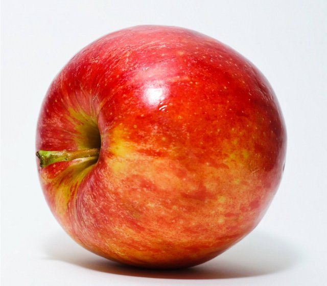{ loading=lazy }

No translation found for 'food_apple.desc' in Cards

- Type: Object
- Country: International
- Image credit: CC0 | [source](https://commons.wikimedia.org/wiki/File:Red_Apple.jpg)
- Quests: [Lo zoo (pl_04)](../quest/pl_04.it.md)

---

### food_banana
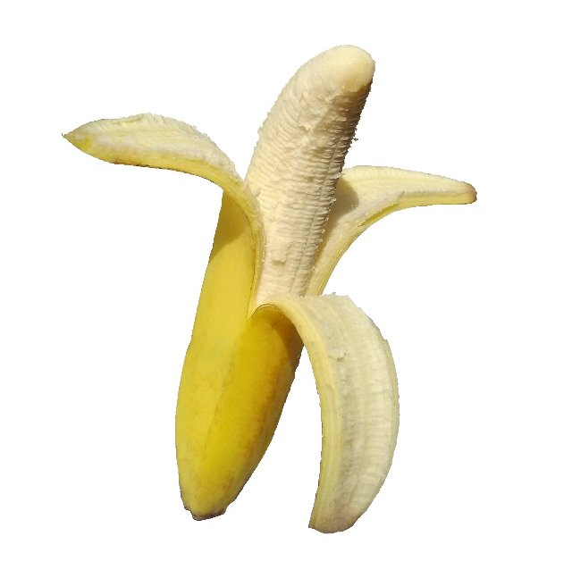{ loading=lazy }

No translation found for 'food_banana.desc' in Cards

- Type: Object
- Country: International
- Image credit: CC0 | [source](https://commons.wikimedia.org/wiki/File:Banana_on_whitebackground.jpg)
- Quests: [Lo zoo (pl_04)](../quest/pl_04.it.md)

---

### French Schools
In France, school happens in four main steps: maternelle (play-and-learn for little kids), école élémentaire (reading, writing, maths), collège (middle school), and lycée (high school). At the end of lycée, many students take a big exam called the baccalauréat (‘le bac’)

- Type: Concept
- Subjects: Education, Civics, Culture
- Country: International
- Topics: [French School](../topics/index.md#frenchschool)

---

### Fruttivendolo
{ loading=lazy }

Una persona che vende frutta e verdura fresca.

- Type: Person
- Subjects: History, Culture
- Country: International
- Topics: [market traders](../topics/index.md#marketers)
- Image credit: CC0 | [source](https://commons.wikimedia.org/wiki/File:Barcelona_330DSC_0356_(49865911251).jpg)
- Quests: [Cibo e mercato (fr_09)](../quest/fr_09.it.md)

---

### Ghiacciaio
{ loading=lazy }

Ghiaccio lento che si trova sulle alte montagne.

- Type: Concept
- Subjects: Geography, Science, Environment
- Country: International
- Image credit: CC_BY | Kelvinsong | [source](https://commons.wikimedia.org/wiki/File:Glacier_diagram.svg)
- Quests: [Monte Bianco e montagne (fr_08)](../quest/fr_08.it.md)

---

### Ghiaccio
{ loading=lazy }

Acqua ghiacciata che può essere molto scivolosa.

- Type: Concept
- Subjects: Weather, Environment, Science
- Country: International
- Topics: [mont blanc](../topics/index.md#mont_blanc)
- Image credit: CC_BY_SA | Andreas Tille | [source](https://commons.wikimedia.org/wiki/File:IceBlockNearJoekullsarlon.jpg)
- Quests: [Monte Bianco e montagne (fr_08)](../quest/fr_08.it.md)

---

### Giorno dell'Indipendenza (Polonia)
{ loading=lazy }

Festa nazionale l'11 novembre.

- Type: Concept
- Subjects: Civics, History, Time
- Country: International
- Image credit: CC_BY_SA | Patryk Matyjaszczyk | [source](https://commons.wikimedia.org/wiki/File:Narodowe_Święto_Niepodległości_2012_01.JPG)
- Quests: [Scopri Varsavia (pl_01)](../quest/pl_01.it.md)

---

### Giraffa
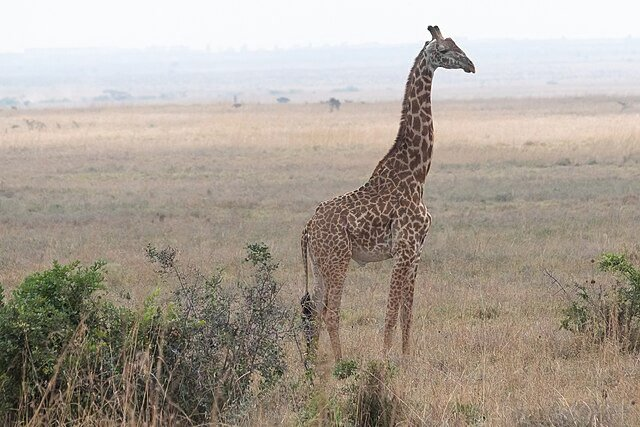{ loading=lazy }

Un animale molto alto con un collo lungo. Le giraffe sono più alte degli alberi! Mangiano foglie che altri animali non possono raggiungere.

- Rationale: Giraffes are fascinating animals that show kids how nature adapts to find food
- Type: Object
- Subjects: Animal, Environment
- Country: International
- Topics: [Zoo Animals](../topics/index.md#zoo)
- Image credit: CC0

---

### Governate
{ loading=lazy }

Uno strumento dritto usato per misurare la lunghezza degli oggetti. I righelli hanno numeri e linee.

- Type: Object
- Subjects: Math
- Country: International
- Topics: [Elementary Math](../topics/index.md#elementary-maths)
- Image credit: CC0 | [source](https://commons.wikimedia.org/wiki/File:Righello.jpg)
- Quests: [Il sistema scolastico (fr_02)](../quest/fr_02.it.md)

---

### Granchio
{ loading=lazy }

Un animale marino con grandi chele e un guscio duro. I granchi camminano di traverso sulla spiaggia!

- Type: Object
- Subjects: Food, Culture
- Country: International
- Topics: [Bouillabaisse](../topics/index.md#bouillabaisse)
- Image credit: CC0 | [source](https://commons.wikimedia.org/wiki/File:Fresh_Crab.jpg)
- Quests: [Cibo e mercato (fr_09)](../quest/fr_09.it.md)

---

### Guanti
{ loading=lazy }

Coperture calde per le tue mani.

- Type: Object
- Subjects: Health, Safety, Weather
- Country: International
- Topics: [mountain tools](../topics/index.md#mountain_tools)
- Image credit: CC_BY_SA | Kippelboy | [source](https://commons.wikimedia.org/wiki/File:Centre_de_Documentació_Museu_Tèxtil_de_Terrassa-_Reserves-_Teixits-_Guants002.JPG)
- Quests: [Monte Bianco e montagne (fr_08)](../quest/fr_08.it.md)

---

### Guerre e statua di Sawa
{ loading=lazy }

Una statua che raffigura la leggenda della città su Wars e Sawa.

- Type: Place
- Subjects: Culture, History
- Country: International
- Image credit: CC_BY_SA | Wistula
- Quests: [Scopri Varsavia (pl_01)](../quest/pl_01.it.md)

---

### Guida alpina
{ loading=lazy }

Una persona che aiuta le persone ad arrampicarsi in sicurezza.

- Type: Person
- Subjects: Community, Safety, Education
- Country: International
- Topics: [mont blanc](../topics/index.md#mont_blanc), [mountain activities](../topics/index.md#mountain_activities)
- Image credit: CC_BY | Vyacheslav Argenberg | [source](https://commons.wikimedia.org/wiki/File:Zagedan_Lakes,_Mountaineer,_Mountain_guide,_Caucasus_Mountains,_Karachay-Cherkessia.jpg)
- Quests: [Monte Bianco e montagne (fr_08)](../quest/fr_08.it.md)

---

### ice_arctic
{ loading=lazy }

No translation found for 'ice_arctic.desc' in Cards

- Type: Place
- Country: International
- Image credit: CC0 | [source](https://commons.wikimedia.org/wiki/File:Helicopter_View_(3978020016).jpg)
- Quests: [Lo zoo (pl_04)](../quest/pl_04.it.md)

---

### Kiev
{ loading=lazy }

La capitale dell'Ucraina.

- Type: Place
- Subjects: Geography, Culture
- Country: International
- Image credit: CC_BY_SA | Moahim | [source](https://commons.wikimedia.org/wiki/File:2017_-_Київ_-_Світанок_над_Дніпром.jpg)

---

### Latte
{ loading=lazy }

Una bevanda bianca che proviene dalle mucche. Il latte aiuta a rafforzare ossa e denti!

- Type: Object
- Subjects: Food, Culture
- Country: International
- Topics: [Bouillabaisse](../topics/index.md#bouillabaisse)
- Image credit: CC0 | [source](https://commons.wikimedia.org/wiki/File:Milchflasche_%2812337400564%29.jpg)
- Quests: [Cibo e mercato (fr_09)](../quest/fr_09.it.md)

---

### Leonardo da Vinci
{ loading=lazy }

Un artista e scienziato italiano straordinario. Ha dipinto la Gioconda e inventato macchine volanti centinaia di anni prima degli aeroplani!

- Type: Person
- Subjects: Art, Science, History
- Year: 1452
- Country: International
- Topics: [Louvre](../topics/index.md#louvre)
- Image credit: CC0

---

### Leone
{ loading=lazy }

Un grosso felino chiamato il re degli animali. Vive in gruppi chiamati branchi.

- Type: Object
- Subjects: Animal, Environment
- Country: International
- Topics: [Zoo Animals](../topics/index.md#zoo)
- Image credit: CC0
- Quests: [Lo zoo (pl_04)](../quest/pl_04.it.md)

---

### Lievito
{ loading=lazy }

Il lievito è come una polvere magica che rende il pane morbido e gustoso!

- Type: Object
- Subjects: Food, Culture
- Country: International
- Topics: [Baguette](../topics/index.md#baguette)
- Image credit: CC0

---

### Limone
{ loading=lazy }

Un frutto giallo dal sapore molto aspro. I limoni vengono usati per fare la limonata!

- Type: Object
- Subjects: Food, Culture
- Country: International
- Topics: [Bouillabaisse](../topics/index.md#bouillabaisse)
- Image credit: CC0 | [source](https://commons.wikimedia.org/wiki/File:Lemon.jpg)
- Quests: [Cibo e mercato (fr_09)](../quest/fr_09.it.md)

---

### Linea
{ loading=lazy }

Un segno dritto che va da un punto all'altro. Le linee possono essere lunghe o corte.

- Type: Concept
- Subjects: Math
- Country: International
- Topics: [Elementary Math](../topics/index.md#elementary-maths)
- Image credit: CC0 | [source](https://commons.wikimedia.org/wiki/File:Squaring_the_circle_a_history_of_the_problem_%281913%29_-_illustration_-_page_29_fig_9.png)
- Quests: [Il sistema scolastico (fr_02)](../quest/fr_02.it.md)

---

### Lion Cub
{ loading=lazy }

No translation found for 'animal_lion_cub.desc' in Cards

- Type: Object
- Country: International
- Image credit: CC0 | [source](https://commons.wikimedia.org/wiki/File:Lion_cub_in_Masai_Mara_National_Park.jpg)
- Quests: [Lo zoo (pl_04)](../quest/pl_04.it.md)

---

### Lituania
{ loading=lazy }

Un paese in Europa. La capitale è Vilnius.

- Type: Place
- Subjects: Geography, Culture
- Country: International
- Topics: [Poland Countries](../topics/index.md#poland_countries_around)
- Image credit: CC_BY_SA | Diliff | [source](https://commons.wikimedia.org/wiki/File:Vilnius_Modern_Skyline_At_Dusk,_Lithuania_-_Diliff.jpg)

---

### Lussemburgo
{ loading=lazy }

Uno stato europeo. La capitale è la città di Lussemburgo.

- Type: Place
- Subjects: Geography, Culture
- Country: International
- Topics: [Countries around France](../topics/index.md#france_countries_around)
- Image credit: CC_BY_SA | Cayambe | [source](https://commons.wikimedia.org/wiki/File:Luxembourg_Pfaffenthal_Alzette_Béinchen_01.jpg)

---

### Macellaio
{ loading=lazy }

Una persona che vende carne.

- Type: Person
- Subjects: Community, Food
- Country: International
- Image credit: CC_BY_SA | Sabina Bajracharya | [source](https://commons.wikimedia.org/wiki/File:A_Butcher_cutting_buffalo_meat.jpg)
- Quests: [Pan di zenzero e mercato alimentare (pl_06)](../quest/pl_06.it.md)

---

### Manifesto della scuola francese
{ loading=lazy }

Un'immagine di grandi dimensioni con informazioni appesa alle pareti delle aule delle scuole francesi.

- Type: Object
- Subjects: Education
- Country: International
- Image credit: CC0
- Quests: [Jules Verne e i trasporti (fr_03)](../quest/fr_03.it.md)

---

### Mappa dell'Europa
{ loading=lazy }

Una mappa che mostra tutti i paesi d'Europa. Puoi vedere dove si trovano Francia, Polonia, Germania e altri paesi.

- Rationale: Maps help kids understand where different countries are and how they connect
- Type: Concept
- Subjects: Geography, Education
- Year: 2000
- Country: International
- Topics: [Flags of Europe](../topics/index.md#flags_euroe)
- Image credit: CC0
- Quests: [I vicini della Francia (fr_00)](../quest/fr_00.it.md), [I vicini della Polonia (pl_00)](../quest/pl_00.it.md)

---

### Mappa della Torre Eiffel
{ loading=lazy }

Una mappa che mostra dove si trova la famosa torre alta di Parigi.

- Type: Object
- Subjects: Community, Culture
- Country: International
- Topics: [Eiffel Tower](../topics/index.md#eiffel-tower)
- Image credit: CC0
- Quests: [Parigi! (fr_01)](../quest/fr_01.it.md)

---

### Mar Baltico
{ loading=lazy }

Un grande mare nel nord Europa, dove si incontrano Polonia, Germania e altri paesi. Ha spiagge bellissime ed è famoso per i tesori d'ambra!

- Rationale: The Baltic Sea teaches kids about marine geography and Poland's coastal access
- Type: Place
- Subjects: Geography, Environment
- Country: International
- Topics: [gdansk](../topics/index.md#gdansk)
- Image credit: CC0
- Quests: [La collana d'ambra di Danzica (pl_05)](../quest/pl_05.it.md)

---

### Maria Skłodowska-Curie
{ loading=lazy }

Uno scienziato che ha vinto due premi Nobel.

- Type: Person
- Subjects: Science, History
- Country: International
- Image credit: CC0 | Henri Manuel | [source](https://commons.wikimedia.org/wiki/File:Marie_Curie_c._1920s.jpg)
- Quests: [Scopri Varsavia (pl_01)](../quest/pl_01.it.md)

---

### Market traders
People who sell food and goods at market stalls—like fishmongers, cheesemongers, and fruit sellers. They weigh, wrap, and call out today’s prices.

- Type: Person
- Subjects: Money, Community
- Country: International
- Topics: [market traders](../topics/index.md#marketers)

---

### Marmotta
{ loading=lazy }

Un animale di montagna peloso che fischia.

- Type: Object
- Subjects: Animal, Environment, Science
- Country: International
- Image credit: CC_BY_SA | Photography captured by Giles Laurent | [source](https://commons.wikimedia.org/wiki/File:071_Wild_marmot_at_Grand_Muveran_Nature_Reserve_Photo_by_Giles_Laurent.jpg)
- Quests: [Monte Bianco e montagne (fr_08)](../quest/fr_08.it.md)

---

### Mazurek Dąbrowskiego
{ loading=lazy }

Inno nazionale polacco.

- Type: Concept
- Subjects: Music, History, Culture
- Country: International
- Image credit: CC0 | Józef Wybicki (1747–1822) | [source](https://commons.wikimedia.org/wiki/File:Mazurek_Dąbrowskiego_manuscript.jpg)
- Quests: [Scopri Varsavia (pl_01)](../quest/pl_01.it.md)

---

### Menù della mensa
{ loading=lazy }

Un elenco che mostra quali alimenti puoi mangiare a scuola. Ti aiuta a scegliere cosa mangiare!

- Type: Object
- Subjects: Community, Culture
- Country: International
- Topics: [French School](../topics/index.md#frenchschool)
- Image credit: CC0 | CC0 - Valeria | [source](https://pixabay.com/photos/menu-restaurant-diner-cafe-8165227/)
- Quests: [Il sistema scolastico (fr_02)](../quest/fr_02.it.md)

---

### Mercato medievale
{ loading=lazy }

Un mercato vecchio stile dove le persone comprano e vendono merci.

- Type: Place
- Subjects: History, Culture, Community
- Country: International
- Image credit: CC_BY_SA | Axel Cotón Gutiérrez | [source](https://commons.wikimedia.org/wiki/File:Feria_Medieval_de_Hämeenlinna_2007_(Horse_Fighting).jpg)
- Quests: [Pan di zenzero e mercato alimentare (pl_06)](../quest/pl_06.it.md)

---

### Miele
{ loading=lazy }

Un alimento dolce prodotto dalle api.

- Type: Object
- Subjects: Food, Animal
- Country: International
- Topics: [Gingerbread](../topics/index.md#gingerbread)
- Image credit: CC0 | John Severns (Severnjc) | [source](https://commons.wikimedia.org/wiki/File:European_honey_bee_extracts_nectar.jpg)
- Quests: [Pan di zenzero e mercato alimentare (pl_06)](../quest/pl_06.it.md)

---

### Minsk
{ loading=lazy }

La capitale della Bielorussia.

- Type: Place
- Subjects: Geography, Culture
- Country: International
- Image credit: CC0 | Dzmitry Rylko | [source](https://commons.wikimedia.org/wiki/File:Minsk,_Belarus,_Serebryanka.jpg)

---

### Monete
{ loading=lazy }

Piccola moneta rotonda in metallo.

- Type: Object
- Subjects: Money
- Country: International
- Image credit: CC_BY_SA | Livioandronico2013 | [source](https://commons.wikimedia.org/wiki/File:Coins_of_the_Italian_Republic_(500_Lire)_silver_(Caravels).png)
- Quests: [Pan di zenzero e mercato alimentare (pl_06)](../quest/pl_06.it.md)

---

### Monete Złoty
{ loading=lazy }

Denaro polacco (złoty) raffigurato come monete.

- Type: Object
- Subjects: Money, Geography
- Country: International
- Image credit: CC0 | Kaźmirz Stronczyński | [source](https://commons.wikimedia.org/wiki/File:Czerwony_złoty_gdański_1577r.jpg)
- Quests: [Scopri Varsavia (pl_01)](../quest/pl_01.it.md)

---

### Montagna
{ loading=lazy }

I pilastri della terra

- Type: Concept
- Subjects: Environment, Education
- Country: International
- Topics: [mont blanc](../topics/index.md#mont_blanc), [mountain activities](../topics/index.md#mountain_activities), [mountain tools](../topics/index.md#mountain_tools)
- Image credit: CC_BY | Vyacheslav Argenberg | [source](https://commons.wikimedia.org/wiki/File:Himalayas,_Ama_Dablam,_Nepal.jpg)
- Quests: [Monte Bianco e montagne (fr_08)](../quest/fr_08.it.md)

---

### Monte Bianco
{ loading=lazy }

La montagna più alta dell'Europa occidentale. Coperta di neve tutto l'anno.

- Type: Place
- Subjects: Geography, Environment
- Country: International
- Topics: [mont blanc](../topics/index.md#mont_blanc)
- Image credit: CC0

---

### Monumento a Nicola Copernico (Varsavia)
{ loading=lazy }

Monumento all'astronomo Niccolò Copernico.

- Type: Place
- Subjects: Science, History, Culture
- Country: International
- Image credit: CC_BY_SA | Rhododendrites | [source](https://commons.wikimedia.org/wiki/File:Staszic_Palace_(22226p).jpg)
- Quests: [Scopri Varsavia (pl_01)](../quest/pl_01.it.md)

---

### Mosca
{ loading=lazy }

La capitale della Russia.

- Type: Place
- Subjects: Geography, Culture
- Country: International
- Image credit: CC_BY_SA | Dmitry A. Mottl (cropped by King of Hearts) | [source](https://commons.wikimedia.org/wiki/File:Moscow_State_University_crop.jpg)

---

### Nevicare
{ loading=lazy }

Acqua ghiacciata che cade quando fa freddo.

- Type: Concept
- Subjects: Weather, Environment, Science
- Country: International
- Topics: [mont blanc](../topics/index.md#mont_blanc)
- Image credit: CC_BY_SA | Psy guy | [source](https://commons.wikimedia.org/wiki/File:Snow_Scene_at_Shipka_Pass_1.JPG)
- Quests: [Monte Bianco e montagne (fr_08)](../quest/fr_08.it.md)

---

### Obiettivo
{ loading=lazy }

La rete in cui si cerca di segnare.

- Type: Object
- Subjects: Sport, Recreation
- Country: International
- Image credit: CC_BY_SA | Dietmar Rabich | [source](https://commons.wikimedia.org/wiki/File:Dülmen,_Sportzentrum_Süd_--_2012_--_4121.jpg)
- Quests: [Scopri Varsavia (pl_01)](../quest/pl_01.it.md)

---

### Occhiali da sole
{ loading=lazy }

Occhiali che proteggono gli occhi dalla luce intensa.

- Type: Object
- Subjects: Health, Safety, Weather
- Country: International
- Topics: [mountain tools](../topics/index.md#mountain_tools)
- Image credit: CC_BY_SA | Sofiane mohammed amri | [source](https://commons.wikimedia.org/wiki/File:2_الحداد.jpg)
- Quests: [Monte Bianco e montagne (fr_08)](../quest/fr_08.it.md)

---

### Olio d'oliva
{ loading=lazy }

Un olio speciale ricavato dalle olive. Viene utilizzato per cucinare piatti gustosi.

- Type: Object
- Subjects: Food, Culture
- Country: International
- Topics: [Bouillabaisse](../topics/index.md#bouillabaisse)
- Image credit: CC0 | [source](https://commons.wikimedia.org/wiki/File:Oliven_V1.jpg)
- Quests: [Cibo e mercato (fr_09)](../quest/fr_09.it.md)

---

### Palazzo della Cultura e della Scienza
{ loading=lazy }

Un edificio alto per musei, teatri e centri di apprendimento.

- Type: Place
- Subjects: Culture, Education, History
- Country: International
- Image credit: CC_BY_SA | A.Savin
- Quests: [Scopri Varsavia (pl_01)](../quest/pl_01.it.md)

---

### Palazzo presidenziale
{ loading=lazy }

La residenza ufficiale del Presidente della Polonia.

- Type: Place
- Subjects: Civics, History, Culture
- Country: International
- Image credit: CC_BY_SA | Rhododendrites | [source](https://commons.wikimedia.org/wiki/File:Warsaw_Presidential_Palace_(22248p).jpg)
- Quests: [Scopri Varsavia (pl_01)](../quest/pl_01.it.md)

---

### Palla
{ loading=lazy }

Un oggetto rotondo utilizzato in molti giochi.

- Type: Object
- Subjects: Sport, Recreation
- Country: International
- Image credit: CC_BY_SA | Marco Gualazzini | [source](https://commons.wikimedia.org/wiki/File:Playing_in_the_Nuba_mountains.jpg)
- Quests: [Scopri Varsavia (pl_01)](../quest/pl_01.it.md)

---

### PANE
{ loading=lazy }

Un alimento delizioso a base di farina e acqua. Puoi preparare dei panini con il pane!

- Type: Object
- Subjects: Food, Culture
- Country: International
- Topics: [Bouillabaisse](../topics/index.md#bouillabaisse)
- Image credit: CC0 | [source](https://commons.wikimedia.org/wiki/File:French_bread_DSC09293.jpg)
- Quests: [Cibo e mercato (fr_09)](../quest/fr_09.it.md)

---

### Panettiere
{ loading=lazy }

Una persona che prepara pane, torte e pasticcini.

- Type: Person
- Subjects: History, Culture
- Country: International
- Topics: [Baguette](../topics/index.md#baguette), [market traders](../topics/index.md#marketers)
- Image credit: CC0 | [source](https://commons.wikimedia.org/wiki/File:Baker_Oslo.jpg)
- Quests: [Cibo e mercato (fr_09)](../quest/fr_09.it.md)

---

### Parigi
{ loading=lazy }

La capitale della Francia. Parigi ha una famosa torre alta chiamata Torre Eiffel!

- Type: Place
- Subjects: Geography, Culture
- Country: International
- Topics: [France country](../topics/index.md#france), [Baguette](../topics/index.md#baguette), [Eiffel Tower](../topics/index.md#eiffel-tower), [Louvre](../topics/index.md#louvre), [Notre Dame](../topics/index.md#notredame)
- Image credit: CC0 | Yann Caradec from Paris, France, CC BY-SA 2.0 <https://creativecommons.org/licenses/by-sa/2.0>, via Wikimedia Commons | [source](https://commons.wikimedia.org/wiki/File:La_Tour_Eiffel_vue_de_la_Tour_Saint-Jacques,_Paris_ao%C3%BBt_2014_(2).jpg)
- Quests: [Parigi! (fr_01)](../quest/fr_01.it.md)

---

### Passerelle
{ loading=lazy }

Piccoli ponti per i pedoni. Ti proteggono dal traffico.

- Type: Place
- Subjects: Geography, Environment
- Country: International
- Topics: [Seine Bridges](../topics/index.md#seine_bridges)
- Image credit: CC0
- Quests: [Parigi Senna (fr_10)](../quest/fr_10.it.md)

---

### PESCARE
{ loading=lazy }

Un animale che vive e nuota nell'acqua. I pesci hanno pinne e branchie per respirare sott'acqua.

- Type: Object
- Subjects: Food, Culture
- Country: International
- Topics: [Bouillabaisse](../topics/index.md#bouillabaisse)
- Image credit: CC0 | [source](https://commons.wikimedia.org/wiki/File:Grouper_fish_for_Sale.jpg)
- Quests: [Cibo e mercato (fr_09)](../quest/fr_09.it.md)

---

### Pescivendolo
{ loading=lazy }

Persona che vende pesce fresco e frutti di mare.

- Type: Person
- Subjects: History, Culture
- Country: International
- Topics: [market traders](../topics/index.md#marketers)
- Image credit: CC0 | [source](https://commons.wikimedia.org/wiki/File:Fishmonger_weighing_fish_at_Payang_Market,_Kuala_Terengganu.jpg)
- Quests: [Cibo e mercato (fr_09)](../quest/fr_09.it.md)

---

### Piazza
{ loading=lazy }

Strumento a forma di triangolo utilizzato per disegnare linee rette e angoli retti in matematica.

- Type: Object
- Subjects: Math
- Country: International
- Topics: [Elementary Math](../topics/index.md#elementary-maths)
- Image credit: CC0 | [source](https://commons.wikimedia.org/wiki/File:Squadra_45.jpg)
- Quests: [Il sistema scolastico (fr_02)](../quest/fr_02.it.md)

---

### Pinguino
{ loading=lazy }

Un uccello che non sa volare ma nuota molto bene. Vive in luoghi freddi.

- Type: Object
- Subjects: Animal, Environment
- Country: International
- Topics: [Zoo Animals](../topics/index.md#zoo)
- Image credit: CC0
- Quests: [Lo zoo (pl_04)](../quest/pl_04.it.md)

---

### plant_apple
{ loading=lazy }

No translation found for 'plant_apple.desc' in Cards

- Type: Object
- Country: International
- Image credit: CC0 | [source](https://commons.wikimedia.org/wiki/File:Tree_with_red_apples_in_Barkedal_4.jpg)
- Quests: [Lo zoo (pl_04)](../quest/pl_04.it.md)

---

### plant_banana
{ loading=lazy }

No translation found for 'plant_banana.desc' in Cards

- Type: Object
- Country: International
- Image credit: CC0 | [source](https://commons.wikimedia.org/wiki/File:Musa_JPG01.jpg)
- Quests: [Lo zoo (pl_04)](../quest/pl_04.it.md)

---

### plant_orange
{ loading=lazy }

No translation found for 'plant_orange.desc' in Cards

- Type: Object
- Country: International
- Image credit: CC0 | [source](https://commons.wikimedia.org/wiki/File:Citrus_sinensis_JPG01.jpg)
- Quests: [Lo zoo (pl_04)](../quest/pl_04.it.md)

---

### plant_wattle
{ loading=lazy }

No translation found for 'tree_wattle.desc' in Cards

- Type: Object
- Country: International
- Image credit: CC0 | [source](https://commons.wikimedia.org/wiki/File:Acacia_sp._(51489535138).jpg)
- Quests: [Lo zoo (pl_04)](../quest/pl_04.it.md)

---

### Polonia
{ loading=lazy }

Un paese in Europa. La capitale è Varsavia. La Polonia è famosa per scienziati come Copernico e per i deliziosi pierogi!

- Type: Place
- Subjects: Geography, Culture
- Country: International
- Topics: [Poland country](../topics/index.md#poland), [Poland Countries](../topics/index.md#poland_countries_around)
- Image credit: CC_BY_SA | Diego Delso | [source](https://commons.wikimedia.org/wiki/File:Basílica_de_Nuestra_Señora_de_Licheń,_Stary_Licheń,_Polonia,_2016-12-21,_DD_39-41_HDR.jpg)

---

### Pomodoro
{ loading=lazy }

Un frutto rosso e rotondo che cresce sulle piante. I pomodori vengono usati per fare la salsa per la pizza!

- Type: Object
- Subjects: Food, Culture
- Country: International
- Topics: [Bouillabaisse](../topics/index.md#bouillabaisse)
- Image credit: CC0 | [source](https://commons.wikimedia.org/wiki/File:Tomato_je.jpg)
- Quests: [Cibo e mercato (fr_09)](../quest/fr_09.it.md)

---

### Ponte del Castello
{ loading=lazy }

Un ponte vicino a un castello. I castelli sono edifici grandi e robusti, dove un tempo vivevano re e regine.

- Type: Place
- Subjects: Culture, Community
- Country: International
- Image credit: CC0

---

### Ponte per auto
{ loading=lazy }

Una strada che attraversa l'acqua, consentendo alle auto di attraversare fiumi e laghi.

- Type: Place
- Subjects: Geography, Environment
- Country: International
- Topics: [Seine Bridges](../topics/index.md#seine_bridges)
- Image credit: CC0
- Quests: [Parigi Senna (fr_10)](../quest/fr_10.it.md)

---

### Ponte per treni
{ loading=lazy }

Un ponte speciale costruito in modo sufficientemente robusto da consentire ai treni pesanti di attraversare l'acqua.

- Type: Place
- Subjects: Geography, Environment
- Country: International
- Topics: [Seine Bridges](../topics/index.md#seine_bridges)
- Image credit: CC0
- Quests: [Parigi Senna (fr_10)](../quest/fr_10.it.md)

---

### Praga
{ loading=lazy }

La capitale della Repubblica Ceca.

- Type: Place
- Subjects: Geography, Culture
- Country: International
- Image credit: CC_BY_SA | Dmitry A. Mottl | [source](https://commons.wikimedia.org/wiki/File:Vltava_river_in_Prague.jpg)

---

### Presidente
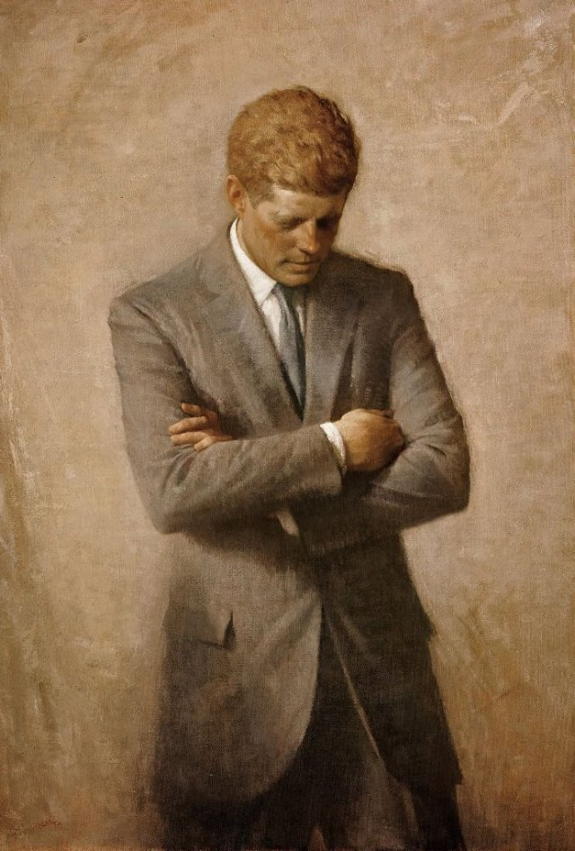{ loading=lazy }

Il leader scelto per guidare il Paese. I cittadini votano alle elezioni.

- Type: Person
- Subjects: History, Culture
- Country: International
- Image credit: CC0 | Aaron Shikler | [source](https://commons.wikimedia.org/wiki/File:John_F_Kennedy_Official_Portrait.jpg)

---

### Ramponi
{ loading=lazy }

Impugnature metalliche appuntite da fissare agli scarponi per usare il ghiaccio.

- Type: Object
- Subjects: Safety, Technology, Sport
- Country: International
- Topics: [mountain tools](../topics/index.md#mountain_tools)
- Image credit: CC_BY_SA | Clayoquot | [source](https://commons.wikimedia.org/wiki/File:Strap-on_crampon.JPG)
- Quests: [Monte Bianco e montagne (fr_08)](../quest/fr_08.it.md)

---

### Razzo spaziale
{ loading=lazy }

Un razzo che va nello spazio.

- Type: Object
- Subjects: Science
- Country: International
- Topics: [Jules Verne](../topics/index.md#jules_verne)
- Image credit: CC0
- Quests: [Jules Verne e i trasporti (fr_03)](../quest/fr_03.it.md)

---

### Repubblica Ceca
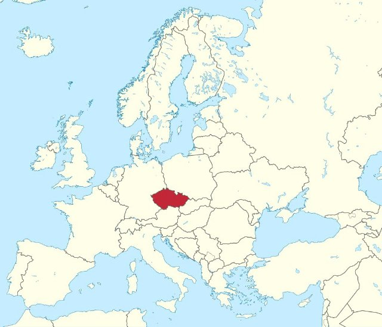{ loading=lazy }

Un paese in Europa. La capitale è Praga.

- Type: Place
- Subjects: Geography, Culture
- Country: International
- Topics: [Poland Countries](../topics/index.md#poland_countries_around)
- Image credit: CC_BY_SA | Tadeáš Bednarz | [source](https://commons.wikimedia.org/wiki/File:Daniel_Souček_U21_Czech_Republic_vs_Greece_10-10-2019.jpg)

---

### Rimessa per barche
{ loading=lazy }

Una casa che galleggia sull'acqua come una barca. Le persone possono vivere nelle case galleggianti!

- Type: Place
- Subjects: Geography, Environment
- Country: International
- Image credit: CC0

---

### Roberto Lewandowski
{ loading=lazy }

Un famoso calciatore polacco.

- Type: Person
- Subjects: Sport, Culture
- Country: International
- Image credit: CC_BY_SA | Екатерина Лаут | [source](https://commons.wikimedia.org/wiki/File:Robert_Lewandowski_2018_(cropped).jpg)
- Quests: [Scopri Varsavia (pl_01)](../quest/pl_01.it.md)

---

### Russia
{ loading=lazy }

Un paese in Europa. La capitale è Mosca.

- Type: Place
- Subjects: Geography, Culture
- Country: International
- Topics: [Poland Countries](../topics/index.md#poland_countries_around)
- Image credit: CC_BY_SA | Canes | [source](https://commons.wikimedia.org/wiki/File:Мечеть_Санкт-Петербурга._Майолика_портала.jpg)

---

### SALE
{ loading=lazy }

Cristalli bianchi che migliorano il sapore del cibo.

- Type: Object
- Subjects: Food, Culture
- Country: International
- Topics: [Baguette](../topics/index.md#baguette)
- Image credit: CC0

---

### Sale al pepe
{ loading=lazy }

Spezie che migliorano il sapore del cibo. Il sale è bianco e il pepe è nero, con pezzetti minuscoli.

- Type: Object
- Subjects: Food, Culture
- Country: International
- Topics: [Bouillabaisse](../topics/index.md#bouillabaisse)
- Image credit: CC0 | [source](https://commons.wikimedia.org/wiki/File:Salt_and_Pepper_Shakers_%284572668303%29.jpg)
- Quests: [Cibo e mercato (fr_09)](../quest/fr_09.it.md)

---

### Sciare
{ loading=lazy }

Scivolare sulla neve con gli sci.

- Type: Concept
- Subjects: Sport, Recreation
- Country: International
- Topics: [mountain activities](../topics/index.md#mountain_activities)
- Image credit: CC_BY | Letartean | [source](https://commons.wikimedia.org/wiki/File:Quebec_Sprint_Cross-country_Skiing_World_Cup_2012_(4)_V2.jpg)
- Quests: [Monte Bianco e montagne (fr_08)](../quest/fr_08.it.md)

---

### Sciarpa
{ loading=lazy }

Un panno caldo da indossare intorno al collo.

- Type: Object
- Subjects: Health, Safety, Weather
- Country: International
- Topics: [mountain tools](../topics/index.md#mountain_tools)
- Image credit: CC_BY_SA | Kritzolina | [source](https://commons.wikimedia.org/wiki/File:Colored_silk_scarf_from_India_01.jpg)
- Quests: [Monte Bianco e montagne (fr_08)](../quest/fr_08.it.md)

---

### Scimmia
{ loading=lazy }

Un animale intelligente che sa arrampicarsi e giocare. Alcune scimmie vivono in famiglie numerose.

- Type: Object
- Subjects: Animal, Environment
- Country: International
- Topics: [Zoo Animals](../topics/index.md#zoo)
- Image credit: CC0
- Quests: [Lo zoo (pl_04)](../quest/pl_04.it.md)

---

### Segnale di PERICOLO
{ loading=lazy }

Un cartello che avverte di un pericolo imminente. Prestare particolare attenzione.

- Type: Object
- Subjects: Safety
- Country: International
- Topics: [Stree safety](../topics/index.md#street-safety)
- Image credit: CC0 | Government of Singapore - Land Transport Authority, Public domain, via Wikimedia Commons | [source](https://commons.wikimedia.org/wiki/File:Singapore_road_sign_-_Warning_-_Other_danger.svg)

---

### Segnale di STOP
{ loading=lazy }

Un cartello rosso che indica che è obbligatorio fermare il veicolo.

- Type: Object
- Subjects: Safety, Transportation
- Country: International
- Topics: [Stree safety](../topics/index.md#street-safety)
- Image credit: CC0

---

### Sicurezza stradale
Regole che garantiscono la sicurezza di tutti sulla strada.

- Type: Concept
- Subjects: Transportation, Civics, Health
- Country: International
- Topics: [Stree safety](../topics/index.md#street-safety)

---

### Slovacchia
{ loading=lazy }

Un paese in Europa. La capitale è Bratislava.

- Type: Place
- Subjects: Geography, Culture
- Country: International
- Topics: [Poland Countries](../topics/index.md#poland_countries_around)
- Image credit: CC_BY_SA | Oto Zapletal | [source](https://commons.wikimedia.org/wiki/File:Suspension_pedestrian_bridge_over_the_Orava_River_in_Dolny_Kubín,_the_Slovak_republic_01.jpg)

---

### Sole
{ loading=lazy }

Luce intensa che può riflettersi sulla neve.

- Type: Concept
- Subjects: Science, Weather, Environment
- Country: International
- Image credit: CC0 | NASA/SDO (AIA) | [source](https://commons.wikimedia.org/wiki/File:The_Sun_by_the_Atmospheric_Imaging_Assembly_of_NASA's_Solar_Dynamics_Observatory_-_20100819.jpg)
- Quests: [Monte Bianco e montagne (fr_08)](../quest/fr_08.it.md)

---

### Spada della sirena
{ loading=lazy }

La spada della sirena che deve essere restituita.

- Type: Object
- Subjects: Culture, History
- Country: International
- Image credit: CC_BY_SA | Guillaume Speurt from Vilnius, Lithuania | [source](https://commons.wikimedia.org/wiki/File:Mermaid_statue_with_sword_(8121475992).jpg)
- Quests: [Scopri Varsavia (pl_01)](../quest/pl_01.it.md)

---

### Stadio Nazionale (Varsavia)
{ loading=lazy }

Uno stadio moderno per partite di calcio e concerti.

- Type: Place
- Subjects: Sport, Culture, Community
- Country: International
- Image credit: CC_BY_SA | Arne Müseler | [source](https://commons.wikimedia.org/wiki/File:National_Stadium_Warsaw_aerial_view_2.jpg)
- Quests: [Scopri Varsavia (pl_01)](../quest/pl_01.it.md)

---

### Stampo per pan di zenzero
{ loading=lazy }

Uno strumento sagomato che consente di creare divertenti forme di biscotti.

- Type: Object
- Subjects: Food, Art
- Country: International
- Topics: [Gingerbread](../topics/index.md#gingerbread)
- Image credit: CC_BY_SA | Piotr Kuczyński | [source](https://commons.wikimedia.org/wiki/File:Traditional_gingerbread_mold_2_(Piotr_Kuczynski).jpg)
- Quests: [Pan di zenzero e mercato alimentare (pl_06)](../quest/pl_06.it.md)

---

### Svizzera
{ loading=lazy }

Un paese in Europa. La capitale è Berna. La Svizzera è famosa per le montagne e il formaggio.

- Type: Place
- Subjects: Geography, Culture
- Country: International
- Topics: [Countries around France](../topics/index.md#france_countries_around)
- Image credit: CC_BY_SA | Giles Laurent | [source](https://commons.wikimedia.org/wiki/File:016_Wild_Golden_Eagle_in_flight_at_Pfyn-Finges_(Switzerland)_Photo_by_Giles_Laurent.jpg)

---

### Tram
{ loading=lazy }

Un treno urbano che corre sui binari della strada.

- Type: Object
- Subjects: Transportation, Technology, Community
- Country: International
- Image credit: CC_BY_SA | Chme82 | [source](https://commons.wikimedia.org/wiki/File:Flexity_Tram_Zürich_4001.jpg)
- Quests: [Scopri Varsavia (pl_01)](../quest/pl_01.it.md)

---

### Treno
{ loading=lazy }

I treni trasportano rapidamente persone e merci in tutto il Paese.

- Type: Object
- Subjects: Transportation
- Country: International
- Image credit: CC0

---

### Triangolo
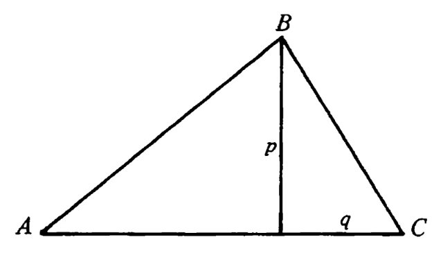{ loading=lazy }

Una forma con tre lati dritti e tre angoli. I triangoli sembrano fette di pizza!

- Type: Concept
- Subjects: Math
- Country: International
- Topics: [Elementary Math](../topics/index.md#elementary-maths)
- Image credit: CC0 | [source](https://commons.wikimedia.org/wiki/File:Lobatchevski_-_La_Th%C3%A9orie_des_parall%C3%A8les,_1980_-_Fig-1-05.png)
- Quests: [Il sistema scolastico (fr_02)](../quest/fr_02.it.md)

---

### Ucraina
{ loading=lazy }

Un paese in Europa. La capitale è Kiev.

- Type: Place
- Subjects: Geography, Culture
- Country: International
- Image credit: CC_BY_SA | Misha Reme | [source](https://commons.wikimedia.org/wiki/File:Найкращі_миті_життя.jpg)

---

### Uova
{ loading=lazy }

Cibo ricavato dai polli e utilizzato per cucinare e cuocere al forno.

- Type: Object
- Subjects: Food, Animal
- Country: International
- Topics: [Gingerbread](../topics/index.md#gingerbread)
- Image credit: CC_BY_SA | George Chernilevsky | [source](https://commons.wikimedia.org/wiki/File:Eggs_in_basket_2020_G1.jpg)
- Quests: [Pan di zenzero e mercato alimentare (pl_06)](../quest/pl_06.it.md)

---

### Valuta Euro
{ loading=lazy }

Valuta utilizzata in molti paesi europei. Con gli euro puoi comprare giocattoli e gelati!

- Type: Concept
- Subjects: Money, Geography
- Country: International
- Image credit: CC0 | [source](https://commons.wikimedia.org/wiki/File:Euro_coins_and_banknotes_%28cropped%29.jpg)
- Quests: [Cibo e mercato (fr_09)](../quest/fr_09.it.md)

---

### Varsavia
{ loading=lazy }

La capitale della Polonia.

- Type: Place
- Subjects: Geography, Culture
- Country: International
- Topics: [Poland country](../topics/index.md#poland)
- Image credit: CC_BY_SA | A.Savin | [source](https://commons.wikimedia.org/wiki/File:Warsaw_07-13_img29_View_from_Palace_of_Culture_and_Science.jpg)

---

### Venditore di latticini
{ loading=lazy }

Una persona che vende latte, burro e formaggio.

- Type: Person
- Subjects: Community, Food
- Country: International
- Image credit: CC_BY_SA | Something Original (talk) | [source](https://commons.wikimedia.org/wiki/File:Pennsylvania_State_University_Food_Science_Building_and_Berkey_Creamery_May_15,_2010.jpg)
- Quests: [Pan di zenzero e mercato alimentare (pl_06)](../quest/pl_06.it.md)

---

### Venditore di uova
{ loading=lazy }

Una persona che vende uova.

- Type: Person
- Subjects: Community, Food
- Country: International
- Image credit: CC_BY_SA | Elgabarty2002 | [source](https://commons.wikimedia.org/wiki/File:Egg_Seller_in_Nigeria.jpg)
- Quests: [Pan di zenzero e mercato alimentare (pl_06)](../quest/pl_06.it.md)

---

### Vento
{ loading=lazy }

Aria in movimento che può risultare forte in montagna.

- Type: Concept
- Subjects: Weather, Environment
- Country: International
- Topics: [mont blanc](../topics/index.md#mont_blanc)
- Image credit: CC0 | Richardfabi | [source](https://commons.wikimedia.org/wiki/File:Windbuchencom.jpg)
- Quests: [Monte Bianco e montagne (fr_08)](../quest/fr_08.it.md)

---

### Vertice
{ loading=lazy }

La cima di una montagna.

- Type: Concept
- Subjects: Geography, Environment, Education
- Country: International
- Topics: [mont blanc](../topics/index.md#mont_blanc)
- Image credit: CC_BY | Mountaineer | [source](https://commons.wikimedia.org/wiki/File:Summitting_Island_Peak.jpg)
- Quests: [Monte Bianco e montagne (fr_08)](../quest/fr_08.it.md)

---

### Vilnius
{ loading=lazy }

La capitale della Lituania.

- Type: Place
- Subjects: Geography, Culture
- Country: International
- Image credit: CC_BY_SA | Diliff | [source](https://commons.wikimedia.org/wiki/File:Vilnius_Modern_Skyline_At_Dusk,_Lithuania_-_Diliff.jpg)

---

### Young Lion Male
{ loading=lazy }

No translation found for 'animal_lion_young_male.desc' in Cards

- Type: Object
- Country: International
- Image credit: CC0 | [source](https://commons.wikimedia.org/wiki/File:Young_male_lion,_South_Luangwa_National_Park_(51871439313).jpg)
- Quests: [Lo zoo (pl_04)](../quest/pl_04.it.md)

---

### Zaino
{ loading=lazy }

Una borsa che porti sulla schiena.

- Type: Object
- Subjects: Recreation, Transportation, Education
- Country: International
- Topics: [mountain tools](../topics/index.md#mountain_tools)
- Image credit: CC_BY_SA | FOTO:Fortepan — ID 20607: Adományozó/Donor: Wein Sarolta. archive copy at the Wayback Machine | [source](https://commons.wikimedia.org/wiki/File:Colorful,_backpack_Fortepan_20607.jpg)
- Quests: [Monte Bianco e montagne (fr_08)](../quest/fr_08.it.md)

---

### Zenzero
{ loading=lazy }

Radice piccante utilizzata in cucina e per preparare biscotti.

- Type: Object
- Subjects: Food, Plant
- Country: International
- Topics: [Gingerbread](../topics/index.md#gingerbread)
- Image credit: CC0 | Franz Eugen Köhler, Köhler's Medizinal-Pflanzen | [source](https://commons.wikimedia.org/wiki/File:Koeh-146-no_text.jpg)
- Quests: [Pan di zenzero e mercato alimentare (pl_06)](../quest/pl_06.it.md)

---

### Zoo Animals
Auto-created card for topic 'Zoo Animals'.

- Type: None
- Country: International
- Topics: [Zoo Animals](../topics/index.md#zoo)

---

### Île-de-France
{ loading=lazy }

Una regione della Francia dove si trova la capitale Parigi. Qui vivono moltissime persone!

- Type: Place
- Subjects: Geography, Environment
- Country: International
- Topics: [Notre Dame](../topics/index.md#notredame)
- Image credit: CC0
- Quests: [Parigi! (fr_01)](../quest/fr_01.it.md)

## France

### 20000 Leagues Under the Sea
{ loading=lazy }

A book by Jules Verne about underwater adventures in a submarine called the Nautilus. You meet giant sea creatures!

- Type: Object
- Subjects: Literature
- Year: 1871
- Country: France
- Topics: [Jules Verne](../topics/index.md#jules_verne)
- Image credit: CC0
- Quests: [Jules Verne e i trasporti (fr_03)](../quest/fr_03.it.md)

---

### 24 ore di Le Mans
{ loading=lazy }

Una gara automobilistica che dura 24 ore. Le squadre guidano giorno e notte.

- Type: Concept
- Subjects: Sport, Culture, History
- Country: France
- Image credit: CC0

---

### Allons enfants
{ loading=lazy }

Le prime parole del primo verso dell'inno.

- Type: Object
- Subjects: Music, Education, Culture
- Country: France
- Topics: [marseillaise music](../topics/index.md#marseillaise_music)
- Image credit: CC0 | [source](https://commons.wikimedia.org/wiki/File:La_Marseillaise_chant_national_fran%C3%A7ais_de_Rouget_de_L%27Isle_Transcription_de_Langevin-2.jpg)
- Audio credit: PublicDomain | [source](https://commons.wikimedia.org/wiki/File:La_Marseillaise_(1914_Recording).ogg)
- Quests: [La Marsigliese (fr_11)](../quest/fr_11.it.md)

---

### Arco
{ loading=lazy }

Un'arma che scocca frecce.

- Type: Object
- Subjects: History, Technology
- Country: France
- Image credit: CC0 | Harold Dean Carsey (1886-1947) | [source](https://commons.wikimedia.org/wiki/File:Clara_Bow,_grayscale.jpg)

---

### Arco rampante
{ loading=lazy }

Braccia in pietra all'esterno che aiutano a sostenere alte mura.

- Type: Concept
- Subjects: Technology, History, Art
- Country: France
- Image credit: CC_BY_SA | Acroterion | [source](https://commons.wikimedia.org/wiki/File:Amiens_Cathedral_gallery_roof_and_buttresses_1980-1.jpg)
- Quests: [Parigi! (fr_01)](../quest/fr_01.it.md)

---

### Armatura
{ loading=lazy }

Indumento protettivo in metallo per un cavaliere.

- Type: Object
- Subjects: History, Safety
- Country: France
- Image credit: CC0 | [source](https://commons.wikimedia.org/wiki/File:Armor_MET_DP271145.jpg)

---

### Around the World in Eighty Days
{ loading=lazy }

An exciting book by Jules Verne about traveling around the whole world very quickly using trains, ships, and hot air balloons!

- Type: Object
- Subjects: Literature
- Year: 1873
- Country: France
- Topics: [Jules Verne](../topics/index.md#jules_verne)
- Image credit: CC0
- Quests: [Jules Verne e i trasporti (fr_03)](../quest/fr_03.it.md)

---

### Ascensori della Torre Eiffel
{ loading=lazy }

Ascensori che portano i visitatori sulla torre di ferro.

- Type: Object
- Subjects: Technology, Transportation
- Country: France
- Image credit: CC0 | Louis-Emile Durandelle | [source](https://commons.wikimedia.org/wiki/File:Louis-Emile_Durandelle,_The_Eiffel_Tower_-_State_of_the_Construction,_1888.jpg)
- Quests: [Parigi! (fr_01)](../quest/fr_01.it.md)

---

### attraversamento pedonale
{ loading=lazy }

Strisce bianche dove le persone attraversano la strada.

- Type: Object
- Subjects: Safety, Education, Transportation
- Country: France
- Topics: [Stree safety](../topics/index.md#street-safety)
- Image credit: CC_BY_SA | Shuets Udono | [source](https://commons.wikimedia.org/wiki/File:Japanese_car_accident.jpg)

---

### Auto da corsa
{ loading=lazy }

Un'auto molto veloce utilizzata sulle piste da corsa.

- Type: Object
- Subjects: Sport, Technology
- Country: France
- Image credit: CC_BY_SA | user:AngMoKio | [source](https://commons.wikimedia.org/wiki/File:Porsche_race_car_Verschuur_amk.jpg)

---

### Baguette francese
{ loading=lazy }

Un pane lungo e croccante, il più famoso in Francia. I francesi comprano baguette fresche ogni giorno dal panettiere!

- Rationale: Baguettes are iconic French culture that kids can easily understand and remember
- Type: Object
- Subjects: Food, Culture
- Year: 1700
- Country: France
- Topics: [Baguette](../topics/index.md#baguette)
- Image credit: CC0
- Quests: [Parigi! (fr_01)](../quest/fr_01.it.md), [Sviluppo (dev)](../quest/dev.it.md)

---

### Bandiera della Francia
{ loading=lazy }

La bandiera francese ha tre strisce verticali: blu, bianco e rosso. Questi colori rappresentano libertà, uguaglianza e fratellanza!

- Rationale: The French flag is essential for teaching French national identity and values
- Type: Concept
- Subjects: Geography, Culture
- Year: 1794
- Country: France
- Topics: [Flags of Europe](../topics/index.md#flags_euroe), [France country](../topics/index.md#france)
- Image credit: CC0
- Quests: [I vicini della Francia (fr_00)](../quest/fr_00.it.md)

---

### Bandiera di Monaco
{ loading=lazy }

La bandiera di Monaco è a strisce orizzontali rosse e bianche. Monaco è piccola ma famosa per le sue auto di lusso e i palazzi reali sul mare!

- Rationale: Monaco shows kids how small places can be special and important
- Type: Concept
- Subjects: Geography, Culture
- Year: 1881
- Country: France
- Topics: [Flags of Europe](../topics/index.md#flags_euroe)
- Image credit: CC0
- Quests: [I vicini della Francia (fr_00)](../quest/fr_00.it.md)

---

### Barcaiolo
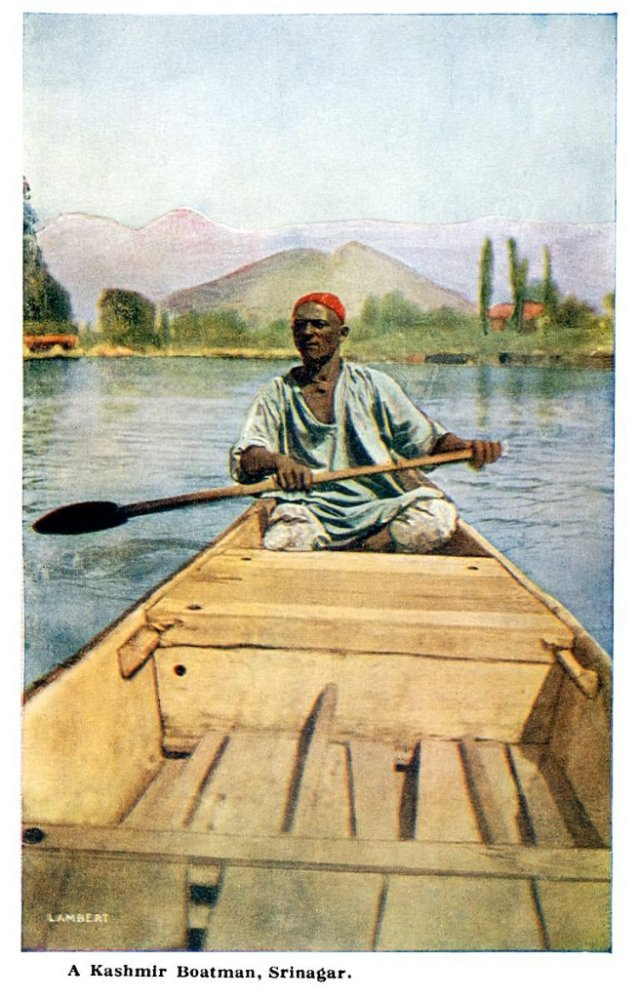{ loading=lazy }

Una persona che rema sulla barca sulla Loira.

- Type: Person
- Subjects: Community, Transportation
- Country: France
- Image credit: CC_BY | Vyacheslav Argenberg | [source](https://commons.wikimedia.org/wiki/File:Perhentian_Islands,_Boatman,_Malaysia.jpg)

---

### Bastioni
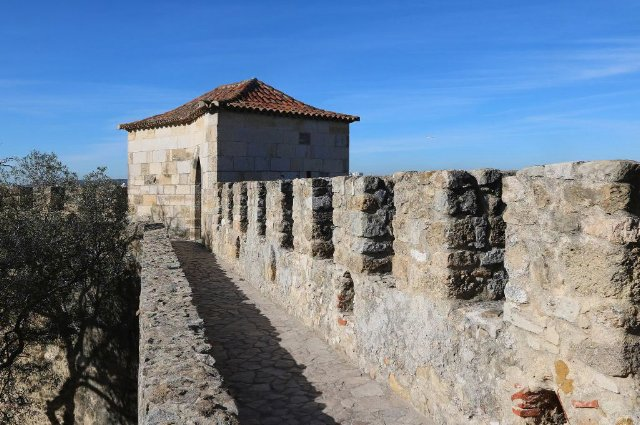{ loading=lazy }

Alte mura su cui è possibile camminare per proteggere il castello.

- Type: Concept
- Subjects: History, Technology
- Country: France
- Image credit: CC_BY_SA | Txllxt TxllxT | [source](https://commons.wikimedia.org/wiki/File:Pardubice_-_Zámek_Pardubice_-_Ramparts_View_SSE_-_Renaissance_architecture.jpg)

---

### Battello sulla Senna
{ loading=lazy }

Un'imbarcazione speciale che naviga sulla Senna a Parigi. Dall'acqua si possono ammirare la Torre Eiffel e altri splendidi edifici!

- Rationale: Boat tours help kids see Paris from a different perspective and understand river transportation
- Type: Concept
- Subjects: Transportation, Geography, Culture
- Year: 1900
- Country: France
- Image credit: CC0
- Quests: [Parigi Senna (fr_10)](../quest/fr_10.it.md)

---

### Bicicletta
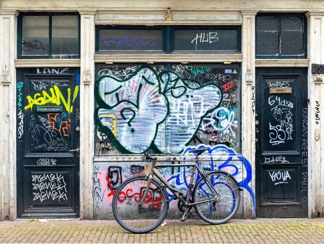{ loading=lazy }

Un veicolo con due ruote su cui si pedala.

- Type: Object
- Subjects: Transportation, Health, Recreation
- Country: France
- Image credit: CC_BY_SA | Basile Morin | [source](https://commons.wikimedia.org/wiki/File:Parked_bicycle_with_graffitied_building_facade_and_doors_in_Amsterdam.jpg)

---

### Bouillabaisse
{ loading=lazy }

Una zuppa di pesce speciale tipica di Marsiglia, nel sud della Francia. È preparata con molti tipi diversi di pesce e ha un profumo delizioso!

- Type: Object
- Subjects: Food, Culture
- Year: 1700
- Country: France
- Topics: [Bouillabaisse](../topics/index.md#bouillabaisse)
- Image credit: CC0 | [source](https://www.pexels.com/photo/delicious-red-soup-on-table-17568746/)
- Quests: [Cibo e mercato (fr_09)](../quest/fr_09.it.md)

---

### Camera da letto reale
{ loading=lazy }

Una camera elegante con un grande letto a baldacchino.

- Type: Place
- Subjects: Culture, History
- Country: France
- Image credit: CC0 | Aleksander Gryglewski | [source](https://commons.wikimedia.org/wiki/File:Aleksander_Gryglewski_-_Interior_of_the_royal_bedroom_at_the_Wilanów_Palace_-_MP_184_MNW_-_National_Museum_in_Warsaw.jpg)

---

### Cappello piumato
{ loading=lazy }

Un bel cappello con una piuma per un tocco di stile.

- Type: Object
- Subjects: Culture, History
- Country: France
- Image credit: CC0 | Gustav Klimt | [source](https://commons.wikimedia.org/wiki/File:Gustav_Klimt_019.jpg)

---

### Carta della Laicità
{ loading=lazy }

Un insieme di regole per rispettare le convinzioni di tutti. Aiuta le persone a vivere insieme in pace.

- Type: Concept
- Subjects: Community, Culture
- Year: 2013
- Country: France
- Topics: [French School](../topics/index.md#frenchschool)
- Image credit: CC0 | [source](https://camille-claudel.ecollege.haute-garonne.fr/le-college/charte-de-la-laicite/)
- Quests: [Il sistema scolastico (fr_02)](../quest/fr_02.it.md), [Jules Verne e i trasporti (fr_03)](../quest/fr_03.it.md)

---

### Casco
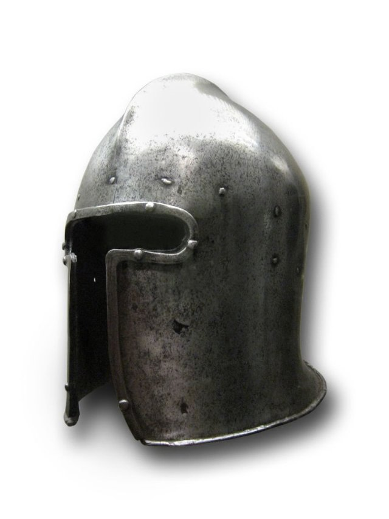{ loading=lazy }

Un cappello di metallo che protegge la testa.

- Type: Object
- Subjects: History, Safety
- Country: France
- Image credit: CC0 | Jebulon | [source](https://commons.wikimedia.org/wiki/File:Cavalier_Garde_Républicaine_trois-quart_dos.jpg)

---

### Casco (sicurezza stradale)
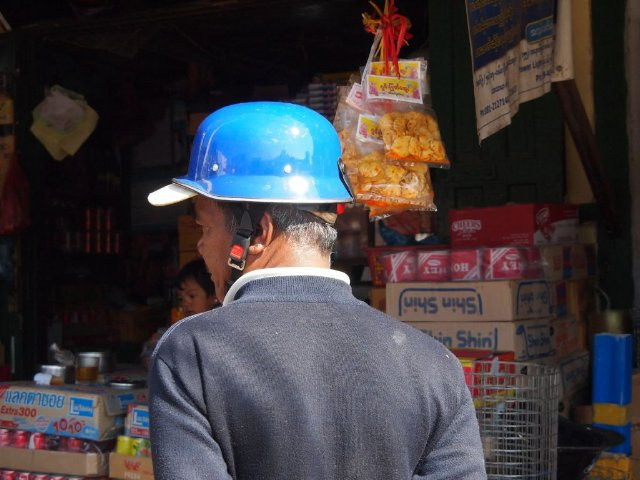{ loading=lazy }

Un casco protettivo per proteggere la testa durante la guida.

- Type: Object
- Subjects: Safety, Health, Education
- Country: France
- Topics: [Stree safety](../topics/index.md#street-safety)
- Image credit: CC_BY | Paul Arps from The Netherlands | [source](https://commons.wikimedia.org/wiki/File:Safety_helmet_(Myanmar_2013)_(11772851273).jpg)

---

### Castello di Chambord
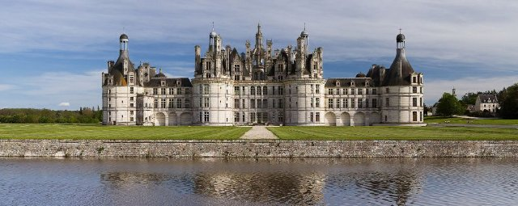{ loading=lazy }

Un grande palazzo con numerose finestre e giardini.

- Type: Place
- Subjects: History, Culture, Geography
- Country: France
- Image credit: CC_BY_SA | Benh LIEU SONG | [source](https://commons.wikimedia.org/wiki/File:Chambord_Castle_Northwest_facade.jpg)

---

### Castello di Chinon
{ loading=lazy }

Il Castello di Chinon è una possente fortezza in pietra su una collina che domina il fiume nella Valle della Loira. Molto tempo fa, i re soggiornavano qui e Giovanna d'Arco vi si recò per incontrare il futuro re di Francia.

- Type: Place
- Subjects: History
- Country: France
- Image credit: CC0
- Quests: [Una storia di due castelli (fr_05)](../quest/fr_05.it.md)

---

### Castello di Chinon
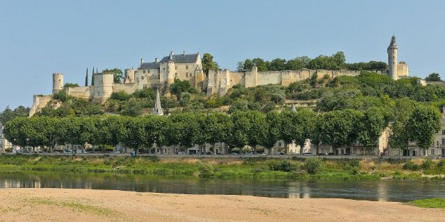{ loading=lazy }

Una robusta fortezza in pietra utilizzata a scopo difensivo.

- Type: Place
- Subjects: History, Geography, Culture
- Country: France
- Image credit: CC_BY_SA | Benjamin Smith | [source](https://commons.wikimedia.org/wiki/File:Chinon_-_Château_vu_depuis_la_plage.jpg)

---

### Catapulta
{ loading=lazy }

Una macchina che lancia pietre lontano.

- Type: Object
- Subjects: Technology, History
- Country: France
- Image credit: CC_BY_SA | Jacek Halicki | [source](https://commons.wikimedia.org/wiki/File:2023_Proca_neurobalistyczna.jpg)

---

### Cattedrale
{ loading=lazy }

Una chiesa molto grande e importante in una città.

- Type: Place
- Subjects: Culture, History, Education
- Country: France
- Image credit: CC_BY_SA | Richard Bartz, Munich aka Makro Freak | [source](https://commons.wikimedia.org/wiki/File:Svyato_Mihailovsky_Cathedral_Izhevsk_Russia_Richard_Bartz.jpg)
- Quests: [Parigi! (fr_01)](../quest/fr_01.it.md)

---

### Chiesa
{ loading=lazy }

Un edificio speciale dove le persone si incontrano per pregare e cantare.

- Type: Place
- Subjects: Culture, Civics, Education
- Country: France
- Image credit: CC_BY_SA | King of Hearts | [source](https://commons.wikimedia.org/wiki/File:Stanford_Memorial_Church_May_2011_HDR_1.jpg)
- Quests: [Parigi! (fr_01)](../quest/fr_01.it.md)

---

### Codice di Hammurabi
{ loading=lazy }

Una pietra su cui sono incise leggi molto antiche.

- Type: Object
- Subjects: History, Civics
- Country: France
- Image credit: CC_BY | Mbzt | [source](https://commons.wikimedia.org/wiki/File:P1050763_Louvre_code_Hammurabi_face_rwk.JPG)
- Quests: [Parigi! (fr_01)](../quest/fr_01.it.md)

---

### Collège in Francia
{ loading=lazy }

Scuola media in Francia per ragazzi dagli 11 ai 15 anni. Gli studenti studiano molte materie e si preparano per la scuola superiore.

- Rationale: Understanding the French school system helps kids compare education across countries
- Type: Concept
- Subjects: Education, Culture
- Year: 1975
- Country: France
- Topics: [French School](../topics/index.md#frenchschool)
- Image credit: CC0 | Marie Gaultier, CC BY-SA 4.0 <https://creativecommons.org/licenses/by-sa/4.0>, via Wikimedia Commons | [source](https://commons.wikimedia.org/wiki/File:Ecole_Sup%C3%A9rieure_d%27Agricultures.jpg)
- Quests: [Il sistema scolastico (fr_02)](../quest/fr_02.it.md), [Jules Verne e i trasporti (fr_03)](../quest/fr_03.it.md)

---

### Della patria
{ loading=lazy }

Parole dal primo verso dell'inno.

- Type: Object
- Subjects: Music, Education, Culture
- Country: France
- Topics: [marseillaise music](../topics/index.md#marseillaise_music)
- Image credit: CC0 | [source](https://commons.wikimedia.org/wiki/File:La_Marseillaise_chant_national_fran%C3%A7ais_de_Rouget_de_L%27Isle_Transcription_de_Langevin-2.jpg)
- Audio credit: PublicDomain | [source](https://commons.wikimedia.org/wiki/File:La_Marseillaise_(1914_Recording).ogg)
- Quests: [La Marsigliese (fr_11)](../quest/fr_11.it.md)

---

### Do
{ loading=lazy }

Una nota musicale.

- Type: Concept
- Subjects: Music, Education
- Country: France
- Topics: [Musical Notes](../topics/index.md#musical_notes)
- Image credit: CC_BY_SA | BrownHairedGirl | [source](https://commons.wikimedia.org/wiki/File:Dominican_Republic_Ireland_Locator.png)

---

### Esposizione universale (1889)
{ loading=lazy }

La grande esposizione universale in cui venne esposta la Torre Eiffel.

- Type: Concept
- Subjects: History, Culture
- Country: France
- Image credit: CC0 | imp. de Erhard (Paris), 1889 | [source](https://commons.wikimedia.org/wiki/File:Plan_général_exposition_universelle_de_1889.jpg)
- Quests: [Parigi! (fr_01)](../quest/fr_01.it.md)

---

### Est arrivé
{ loading=lazy }

Parole dal primo verso dell'inno.

- Type: Object
- Subjects: Music, Education, Culture
- Country: France
- Topics: [marseillaise music](../topics/index.md#marseillaise_music)
- Image credit: CC0 | [source](https://commons.wikimedia.org/wiki/File:La_Marseillaise_chant_national_fran%C3%A7ais_de_Rouget_de_L%27Isle_Transcription_de_Langevin-2.jpg)
- Audio credit: PublicDomain | [source](https://commons.wikimedia.org/wiki/File:La_Marseillaise_(1914_Recording).ogg)
- Quests: [La Marsigliese (fr_11)](../quest/fr_11.it.md)

---

### Fa
{ loading=lazy }

Una nota musicale.

- Type: Concept
- Subjects: Music, Education
- Country: France
- Topics: [Musical Notes](../topics/index.md#musical_notes)
- Image credit: CC_BY | Aleksey Gnilenkov | [source](https://commons.wikimedia.org/wiki/File:Nong_Fa_Lake.jpg)

---

### Facciata del castello (finestre)
{ loading=lazy }

Una parete frontale con numerose grandi finestre che lasciano entrare luce e vista.

- Type: Concept
- Subjects: Culture, Technology
- Country: France
- Image credit: CC_BY_SA | Scotch Mist | [source](https://commons.wikimedia.org/wiki/File:Brzeg_Castle_03.jpg)

---

### fiume Loira
{ loading=lazy }

Un lungo fiume in Francia con molti castelli lungo le sue rive.

- Type: Place
- Subjects: Geography, Environment
- Country: France
- Image credit: CC_BY_SA | Ввласенко | [source](https://commons.wikimedia.org/wiki/File:Loire_river_near_Amboise_in_September._France.jpg)

---

### Five Weeks in a Balloon
{ loading=lazy }

A book by Jules Verne about flying across Africa in a hot air balloon. It's full of adventure and discovery!

- Type: Object
- Subjects: Literature
- Year: 1863
- Country: France
- Image credit: CC0
- Quests: [Jules Verne e i trasporti (fr_03)](../quest/fr_03.it.md)

---

### Francia
{ loading=lazy }

Un paese in Europa. La capitale è Parigi.

- Type: Place
- Subjects: Geography, Culture
- Country: France
- Topics: [Countries around France](../topics/index.md#france_countries_around), [France country](../topics/index.md#france)
- Image credit: CC_BY_SA | Another one of my pictures:

This photograph was taken by Medium69 (William Crochot) and released under the license stated below. You are free to use it for any purpose as long as you credit the author (William Crochot), the Source (Wikimedia Commons) and the license (CC-BY-SA 4.0) in close relation to the image.

Please do not upload an updated image here without consultation with the Author. The author would like to make corrections only at his own source RAW. This ensures that the changes are preserved.Please if you think that any changes should be required, please inform the author.Otherwise you can upload a new image with a new name. Please use one of the templates derivative or extract. | [source](https://commons.wikimedia.org/wiki/File:Homme_statue_-_214.jpg)

---

### Frecce
{ loading=lazy }

Bastoni appuntiti scagliati da un arco.

- Type: Object
- Subjects: History, Technology
- Country: France
- Image credit: CC_BY | Julian Herzog (Website) | [source](https://commons.wikimedia.org/wiki/File:Red_Arrows_Formation_Duxford_Flying_Finale_2024_02.jpg)

---

### From the Earth to the Moon
{ loading=lazy }

A book by Jules Verne about going to the Moon in a big cannon! It was written before real rockets existed.

- Type: Object
- Subjects: Literature, Space, Science
- Year: 1865
- Country: France
- Topics: [Jules Verne](../topics/index.md#jules_verne)
- Image credit: CC0
- Quests: [Jules Verne e i trasporti (fr_03)](../quest/fr_03.it.md)

---

### Gargoyle
{ loading=lazy }

Una statua divertente o spaventosa che funziona anche come sgorgatore di pioggia.

- Type: Concept
- Subjects: Art, Technology, History
- Country: France
- Image credit: CC_BY_SA | Martinvl | [source](https://commons.wikimedia.org/wiki/File:Gargoyle_depicting_Hodgetts,_Chichester_Cathedral.jpg)
- Quests: [Parigi! (fr_01)](../quest/fr_01.it.md)

---

### Giardini formali
{ loading=lazy }

Giardini decorativi per passeggiate e feste.

- Type: Place
- Subjects: Culture, Environment
- Country: France
- Image credit: CC_BY_SA | Urban at French Wikipedia | [source](https://commons.wikimedia.org/wiki/File:Orangerie.jpg)

---

### Giuramento degli Orazi (Davide)
{ loading=lazy }

Un dipinto raffigurante tre fratelli che fanno una promessa coraggiosa.

- Type: Object
- Subjects: Art, History
- Country: France
- Image credit: CC0 | Jacques-Louis David | [source](https://commons.wikimedia.org/wiki/File:Jacques-Louis_David,_Le_Serment_des_Horaces.jpg)
- Quests: [Parigi! (fr_01)](../quest/fr_01.it.md)

---

### Gustave Eiffel
{ loading=lazy }

L'uomo che costruì la Torre Eiffel! Era un ingegnere che amava costruire in ferro e creò la torre più famosa del mondo.

- Type: Person
- Subjects: History, Culture, Science
- Year: 1832
- Country: France
- Topics: [Eiffel Tower](../topics/index.md#eiffel-tower)
- Image credit: CC0
- Quests: [Parigi! (fr_01)](../quest/fr_01.it.md)

---

### Hot-Air Balloon
{ loading=lazy }

A balloon that flies using hot air. The first one flew in France.

- Type: Object
- Subjects: Transportation
- Country: France
- Topics: [Jules Verne](../topics/index.md#jules_verne)
- Image credit: CC0
- Quests: [Jules Verne e i trasporti (fr_03)](../quest/fr_03.it.md)

---

### Incendio di Notre-Dame
{ loading=lazy }

Nel 2019, un grande incendio ha danneggiato la splendida Cattedrale di Notre-Dame a Parigi. Molte persone hanno collaborato per salvare questo importante edificio.

- Rationale: This event teaches kids about protecting cultural heritage and community cooperation
- Type: Concept
- Subjects: History, Culture, Environment
- Year: 2019
- Country: France
- Topics: [Notre Dame](../topics/index.md#notredame)
- Image credit: CC0
- Quests: [Parigi! (fr_01)](../quest/fr_01.it.md)

---

### Incoronazione di Napoleone (David)
{ loading=lazy }

Un enorme dipinto raffigurante la cerimonia di un imperatore francese.

- Type: Object
- Subjects: Art, History
- Country: France
- Image credit: CC0 | Jacques-Louis David / Georges Rouget | [source](https://commons.wikimedia.org/wiki/File:Jacques-Louis_David_-_The_Coronation_of_Napoleon_(1805-1807).jpg)
- Quests: [Parigi! (fr_01)](../quest/fr_01.it.md)

---

### Ingresso al circuito di Le Mans
{ loading=lazy }

L'area di ingresso del circuito di Le Mans.

- Type: Place
- Subjects: Geography, Sport, Culture
- Country: France
- Image credit: CC_BY_SA | Neuwieser from Germany | [source](https://commons.wikimedia.org/wiki/File:24h_Le_Mans_2014_(16043688764).jpg)

---

### Jean Michel Jarre
{ loading=lazy }

A French musician famous for electronic music

- Type: Person
- Subjects: Music, Culture, Technology
- Year: 2000
- Country: France
- Image credit: CC0 | [source](https://commons.wikimedia.org/wiki/File:Jean_Michel_a_Roman_Bomboš.jpg)

---

### Jules Verne
{ loading=lazy }

A French writer who imagined amazing adventures before they were possible! He wrote about submarines, rockets, and traveling around the world.

- Rationale: Jules Verne shows kids how imagination and science can work together
- Type: Person
- Subjects: Literature, Science, History
- Year: 1828
- Country: France
- Topics: [Jules Verne](../topics/index.md#jules_verne)
- Image credit: CC0
- Quests: [Jules Verne e i trasporti (fr_03)](../quest/fr_03.it.md)

---

### La
{ loading=lazy }

Una nota musicale.

- Type: Concept
- Subjects: Music, Education
- Country: France
- Topics: [Musical Notes](../topics/index.md#musical_notes)
- Image credit: CC_BY_SA | Basile Morin | [source](https://commons.wikimedia.org/wiki/File:Karst_peaks_and_green_paddy_fields_under_a_stormy_sky,_South_view_from_Mount_Nam_Xay,_Vang_Vieng,_Laos.jpg)

---

### La libertà che guida il popolo
{ loading=lazy }

Un famoso dipinto sulla libertà e il coraggio. Mostra una donna coraggiosa che regge la bandiera francese e guida il popolo nella lotta per i propri diritti.

- Rationale: This painting teaches kids about fighting for freedom and the French Revolution
- Type: Object
- Subjects: Art, History, Culture
- Year: 1830
- Country: France
- Topics: [Louvre](../topics/index.md#louvre)
- Image credit: CC0

---

### La Marsigliese
{ loading=lazy }

L'inno nazionale francese. Viene cantato durante i grandi eventi e le partite sportive.

- Type: Concept
- Subjects: Music, Culture
- Year: 1885
- Country: France
- Topics: [marseillaise music](../topics/index.md#marseillaise_music)
- Image credit: CC0
- Audio credit: PublicDomain | [source](https://commons.wikimedia.org/wiki/File:La_Marseillaise_(1914_Recording).ogg)
- Quests: [La Marsigliese (fr_11)](../quest/fr_11.it.md)

---

### Le jour de la gloire
{ loading=lazy }

Parole dal primo verso dell'inno.

- Type: Object
- Subjects: Music, Education, Culture
- Country: France
- Topics: [marseillaise music](../topics/index.md#marseillaise_music)
- Image credit: CC0 | [source](https://commons.wikimedia.org/wiki/File:La_Marseillaise_chant_national_fran%C3%A7ais_de_Rouget_de_L%27Isle_Transcription_de_Langevin-2.jpg)
- Audio credit: PublicDomain | [source](https://commons.wikimedia.org/wiki/File:La_Marseillaise_(1914_Recording).ogg)
- Quests: [La Marsigliese (fr_11)](../quest/fr_11.it.md)

---

### Le Mans
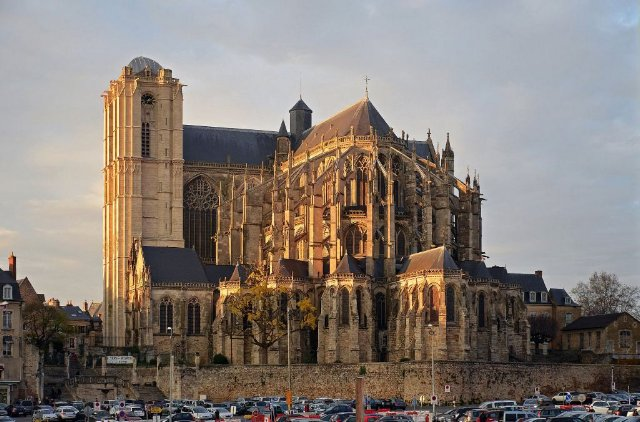{ loading=lazy }

Città francese famosa per la gara automobilistica di 24 ore.

- Type: Place
- Subjects: Geography, Culture, Community
- Country: France
- Image credit: CC_BY_SA | Selbymay | [source](https://commons.wikimedia.org/wiki/File:Le_Mans_-_Cathedrale_St_Julien_ext_autumn.jpg)

---

### Liceo in Francia
{ loading=lazy }

Scuola superiore in Francia per adolescenti dai 16 ai 18 anni. Gli studenti studiano duramente per sostenere l'esame di Baccalauréat, che permette loro di accedere all'università.

- Rationale: The Lycée system shows kids the path to higher education in France
- Type: Concept
- Subjects: Education, Culture
- Year: 1975
- Country: France
- Topics: [French School](../topics/index.md#frenchschool)
- Image credit: CC0 | Émeric, CC BY-SA 3.0 <https://creativecommons.org/licenses/by-sa/3.0>, via Wikimedia Commons | [source](https://commons.wikimedia.org/wiki/File:Atelier_lyc%C3%A9e_Chevrollier.jpg)
- Quests: [Il sistema scolastico (fr_02)](../quest/fr_02.it.md)

---

### Liuto
{ loading=lazy }

Strumento a corda suonato a corte.

- Type: Object
- Subjects: Music, Culture, History
- Country: France
- Image credit: CC_BY | Ching | [source](https://commons.wikimedia.org/wiki/File:Lute_(by_Princess_Ruto,_2013-02-11).jpg)

---

### Lo scriba seduto
{ loading=lazy }

Un'antica statua egizia raffigurante una persona che scrive.

- Type: Object
- Subjects: Art, History
- Country: France
- Image credit: CC_BY_SA | Rama | [source](https://commons.wikimedia.org/wiki/File:The_seated_scribe-E_3023-IMG_4267-gradient-contrast.jpg)
- Quests: [Parigi! (fr_01)](../quest/fr_01.it.md)

---

### Louvre
{ loading=lazy }

Un enorme museo pieno d'arte. È lì che vive la Monna Lisa.

- Type: Place
- Subjects: Art, Culture, History
- Year: 1793
- Country: France
- Topics: [Louvre](../topics/index.md#louvre)
- Image credit: CC0
- Quests: [Parigi! (fr_01)](../quest/fr_01.it.md)

---

### Mappa della Senna
{ loading=lazy }

Un'immagine che mostra la Senna e il suo percorso attraverso il territorio.

- Type: Object
- Subjects: Geography, Environment
- Country: France
- Image credit: CC0
- Quests: [Parigi Senna (fr_10)](../quest/fr_10.it.md)

---

### Mappa della Senna a Parigi
{ loading=lazy }

Un'immagine che mostra come la Senna scorre attraverso la città di Parigi.

- Type: Object
- Subjects: Science
- Country: France
- Image credit: CC0
- Quests: [Parigi Senna (fr_10)](../quest/fr_10.it.md)

---

### Maschera di Carnevale
{ loading=lazy }

Una maschera per feste e balli.

- Type: Object
- Subjects: Culture, History, Recreation
- Country: France
- Image credit: CC_BY_SA | David Jackson | [source](https://commons.wikimedia.org/wiki/File:BLW_Yoruba_Epa_Mask.jpg)

---

### Mi
{ loading=lazy }

Una nota musicale.

- Type: Concept
- Subjects: Music, Education
- Country: France
- Topics: [Musical Notes](../topics/index.md#musical_notes)
- Image credit: CC_BY | Dwight Burdette | [source](https://commons.wikimedia.org/wiki/File:Lenawee_County_Courthouse_Adrian_Michigan.JPG)

---

### Notre-Dame de Paris
{ loading=lazy }

Una splendida cattedrale di Parigi. Le sue vetrate colorate raccontano storie.

- Type: Place
- Subjects: Geography, Environment
- Year: 1885
- Country: France
- Topics: [Notre Dame](../topics/index.md#notredame)
- Image credit: CC0
- Quests: [Parigi! (fr_01)](../quest/fr_01.it.md)

---

### Parapetto
{ loading=lazy }

Il basso muro al limite delle mura.

- Type: Concept
- Subjects: History, Technology
- Country: France
- Image credit: CC_BY_SA | Johann Jaritz | [source](https://commons.wikimedia.org/wiki/File:Feldkirchen_Kirchgasse_6_Wohn-und_Geschäftshaus_Parapet-Fenster_06062019_7122.jpg)

---

### Pianoforte
{ loading=lazy }

Strumento a tastiera utilizzato per suonare melodie e accordi.

- Type: Object
- Subjects: Music, Education
- Country: France
- Topics: [Musical Notes](../topics/index.md#musical_notes)
- Image credit: CC0 | Unknown authorUnknown author | [source](https://commons.wikimedia.org/wiki/File:Hupfeld_piano_played_(2018-10-04_@pxhere_1546039).jpg)

---

### Piramide del Louvre
{ loading=lazy }

La piramide di vetro che costituisce l'ingresso moderno del Louvre.

- Type: Place
- Subjects: Art, Culture, Technology
- Country: France
- Image credit: CC_BY_SA | Benh LIEU SONG (Flickr) | [source](https://commons.wikimedia.org/wiki/File:Louvre_Courtyard,_Looking_West.jpg)
- Quests: [Parigi! (fr_01)](../quest/fr_01.it.md)

---

### Pirati francesi
{ loading=lazy }

Coraggiosi marinai che solcavano i mari per il re di Francia. Venivano chiamati corsari e proteggevano le navi francesi dai nemici.

- Rationale: Pirates capture kids' imagination while teaching about maritime history and French naval power
- Type: Concept
- Subjects: History, Culture, Transportation
- Year: 1600
- Country: France
- Image credit: CC0 | [source](https://commons.wikimedia.org/wiki/File:Forbin_et_Jean_Bart_capture_en_1689.jpg)
- Quests: [Cibo e mercato (fr_09)](../quest/fr_09.it.md)

---

### Ponte Alessandro III
{ loading=lazy }

Uno splendido ponte di Parigi con decorazioni fantasiose e statue dorate.

- Type: Place
- Subjects: Geography, Environment
- Country: France
- Image credit: CC0
- Quests: [Parigi Senna (fr_10)](../quest/fr_10.it.md)

---

### Ponte levatoio
{ loading=lazy }

Un ponte che si solleva per proteggere l'ingresso di un castello.

- Type: Object
- Subjects: Technology, History, Safety
- Country: France
- Image credit: CC_BY_SA | Chuck Homler, Focus On Wildlife | [source](https://commons.wikimedia.org/wiki/File:Bufflehead-Tacony-MT.jpg)

---

### Rif
{ loading=lazy }

Una nota musicale.

- Type: Concept
- Subjects: Music, Education
- Country: France
- Topics: [Musical Notes](../topics/index.md#musical_notes)
- Image credit: CC_BY_SA | Youlaus | [source](https://commons.wikimedia.org/wiki/File:Nota_Ré_4_(Piano).png)

---

### Rivoluzione francese
{ loading=lazy }

Periodo degli anni 1790 in cui la Francia cambiò il suo governo.

- Type: Concept
- Subjects: History, Civics, Time, Culture
- Country: France
- Topics: [marseillaise music](../topics/index.md#marseillaise_music)
- Image credit: CC_BY_SA | [source](https://commons.wikimedia.org/wiki/File:11-french_revolution_1789.jpg)

---

### Rosone
{ loading=lazy }

Una grande vetrata rotonda che racconta storie attraverso la luce.

- Type: Concept
- Subjects: Art, Culture, History
- Country: France
- Image credit: CC_BY_SA | Diliff | [source](https://commons.wikimedia.org/wiki/File:Amiens_Cathedral_Organ_and_Rose_Window,_Picardy,_France_-_Diliff.jpg)
- Quests: [Parigi! (fr_01)](../quest/fr_01.it.md)

---

### Sala da ballo
{ loading=lazy }

Una grande sala per ballare e ascoltare musica.

- Type: Place
- Subjects: Culture, History
- Country: France
- Words: 
- Image credit: CC_BY_SA | P e z i | [source](https://commons.wikimedia.org/wiki/File:Parkhotel_Schoenbrunn_Ballsaal_DSC_5115w.jpg)

---

### Saracinesca
{ loading=lazy }

Un pesante cancello che si abbassa bloccando l'ingresso.

- Type: Object
- Subjects: Technology, History, Safety
- Country: France
- Image credit: CC_BY | Kevin King from Pensacola, FL, US of A | [source](https://commons.wikimedia.org/wiki/File:Cahir_Castle_Portcullis_by_Kevin_King.jpg)

---

### Scappatoie
{ loading=lazy }

Finestre strette per scoccare le frecce in sicurezza.

- Type: Concept
- Subjects: History, Technology
- Country: France
- Image credit: CC_BY_SA | A.-K. D. | [source](https://commons.wikimedia.org/wiki/File:Cross_shaped_loophole.jpg)

---

### Scarpe da ballo
{ loading=lazy }

Scarpe fatte per ballare in una sala da ballo.

- Type: Object
- Subjects: Culture, Recreation
- Country: France
- Image credit: CC_BY | Aoife Cawley | [source](https://commons.wikimedia.org/wiki/File:Wiki_loves_folklore_dance_shoe.png)

---

### Scooter
{ loading=lazy }

Un piccolo scooter a due ruote (trottinette).

- Type: Object
- Subjects: Transportation, Recreation, Safety
- Country: France
- Image credit: CC_BY_SA | Spurzem - Lothar Spurzem | [source](https://commons.wikimedia.org/wiki/File:Zündapp_Bella_R_154_(2008-05-21)_Seitenansicht_ret.jpg)

---

### Scrittura corsiva
{ loading=lazy }

Un modo speciale di scrivere in cui tutte le lettere di una parola sono collegate. In Francia, i bambini imparano a scrivere in questo modo a scuola.

- Rationale: Cursive writing is an important part of French education and cultural identity
- Type: Concept
- Subjects: Education, Culture, Art
- Year: 1800
- Country: France
- Topics: [French School](../topics/index.md#frenchschool)
- Image credit: CC0 | [source](https://commons.wikimedia.org/wiki/File:BlackBoard_(Blender_classroom_demo).png)
- Quests: [Il sistema scolastico (fr_02)](../quest/fr_02.it.md)

---

### Scuola primaria in Francia
{ loading=lazy }

Scuola per bambini dai 6 ai 10 anni. Si impara a leggere, scrivere e contare.

- Type: Concept
- Subjects: Education, Culture
- Year: 1975
- Country: France
- Topics: [French School](../topics/index.md#frenchschool)
- Image credit: Licensed
- Quests: [Il sistema scolastico (fr_02)](../quest/fr_02.it.md)

---

### Semaforo
{ loading=lazy }

Lampioni che ti dicono quando FERMARTI o ANDARE.

- Type: Object
- Subjects: Safety, Education, Transportation
- Country: France
- Topics: [Stree safety](../topics/index.md#street-safety)
- Image credit: CC0

---

### Senna
{ loading=lazy }

Un fiume lungo 777 chilometri nel nord della Francia

- Type: Place
- Subjects: Geography
- Country: France
- Image credit: CC0
- Quests: [Parigi Senna (fr_10)](../quest/fr_10.it.md)

---

### Sol
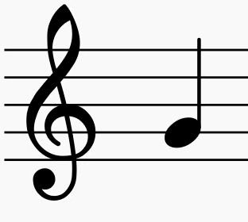{ loading=lazy }

Una nota musicale.

- Type: Concept
- Subjects: Music, Education
- Country: France
- Topics: [Musical Notes](../topics/index.md#musical_notes)
- Image credit: CC_BY_SA | kallerna | [source](https://commons.wikimedia.org/wiki/File:Sol_de_Mañana_2018.jpg)

---

### Sottomarino (Il Nautilus)
{ loading=lazy }

Un sottomarino tratto dal racconto di Jules Verne. Poteva esplorare le profondità marine.

- Type: Object
- Subjects: Literature, Science
- Country: France
- Topics: [Jules Verne](../topics/index.md#jules_verne)
- Image credit: CC0
- Quests: [Jules Verne e i trasporti (fr_03)](../quest/fr_03.it.md)

---

### Spada
{ loading=lazy }

Una lunga lama usata dai cavalieri.

- Type: Object
- Subjects: History, Culture
- Country: France
- Image credit: CC_BY_SA | Rama | [source](https://commons.wikimedia.org/wiki/File:Sword-AO_21069-P5280877-gradient.jpg)

---

### Spartito musicale
{ loading=lazy }

Le note scritte e le parole di una canzone.

- Type: Object
- Subjects: Education, Music
- Country: France
- Topics: [Musical Notes](../topics/index.md#musical_notes)
- Image credit: CC0 | Claude Joseph Rouget de Lisle | [source](https://commons.wikimedia.org/wiki/File:La_Marseillaise_chant_national_français_de_Rouget_de_L'Isle_Transcription_de_Langevin-2.jpg)

---

### Stazione ferroviaria di Le Mans
{ loading=lazy }

La stazione dove prendi il treno per tornare a casa.

- Type: Place
- Subjects: Geography, Transportation, Community
- Country: France
- Image credit: CC_BY_SA | Radomianin | [source](https://commons.wikimedia.org/wiki/File:Man_at_Dundas_subway_station,_Toronto,_2008-05-06.jpg)

---

### Sì
{ loading=lazy }

Una nota musicale.

- Type: Concept
- Subjects: Music, Education
- Country: France
- Topics: [Musical Notes](../topics/index.md#musical_notes)
- Image credit: CC_BY_SA | Bureau international des poids et mesures, International Bureau of Weights and Measures (BIPM) | [source](https://commons.wikimedia.org/wiki/File:SI_Logo_with_defining_constants.png)

---

### Torre Eiffel
{ loading=lazy }

Un'alta torre, simbolo di Parigi. È fatta di ferro e alta 300 metri. È possibile salire e ammirare l'intera città.

- Type: Place
- Subjects: Geography, History, Culture
- Year: 1889
- Country: France
- Topics: [Eiffel Tower](../topics/index.md#eiffel-tower)
- Image credit: CC0
- Quests: [Parigi! (fr_01)](../quest/fr_01.it.md)

---

### Valle della Loira
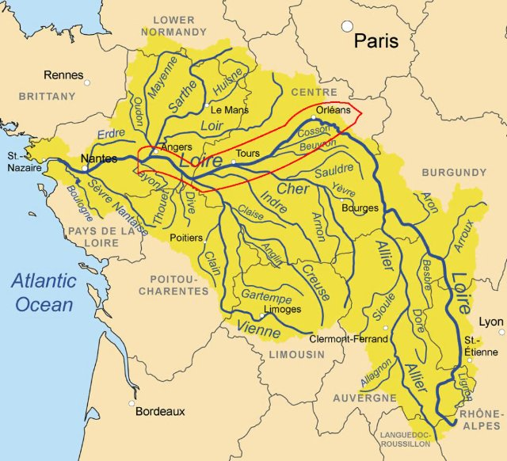{ loading=lazy }

Una famosa regione francese con molti castelli.

- Type: Place
- Subjects: Geography, History, Culture
- Country: France
- Image credit: CC_BY_SA | Suavemarimagno | [source](https://commons.wikimedia.org/wiki/File:Val-de-loire-montsoreau-lever-de-soleil.jpg)

---

### Vittoria alata di Samotracia
{ loading=lazy }

Una famosa scultura antica raffigurante una dea con le ali.

- Type: Object
- Subjects: Art, History
- Country: France
- Image credit: CC_BY_SA | Rijin | [source](https://commons.wikimedia.org/wiki/File:Winged_Victory_of_Samothrace_(1).jpg)
- Quests: [Parigi! (fr_01)](../quest/fr_01.it.md)

---

### Xilofono
{ loading=lazy }

Uno strumento con delle barre che si percuotono per produrre note.

- Type: Object
- Subjects: Music, Education
- Country: France
- Image credit: CC_BY | Mayor McGinn | [source](https://commons.wikimedia.org/wiki/File:Mayor_westlake_play_03_(8532405090).jpg)

---

### École Maternelle
{ loading=lazy }

Scuola per bambini dai 3 ai 5 anni. Si impara giocando ed esplorando.

- Type: Concept
- Subjects: Education, Culture
- Year: 1975
- Country: France
- Topics: [French School](../topics/index.md#frenchschool)
- Image credit: CC0 | Polymagou, CC BY-SA 4.0 <https://creativecommons.org/licenses/by-sa/4.0>, via Wikimedia Commons | [source](https://commons.wikimedia.org/wiki/File:%C3%89cole_maternelle_Paul-Langevin,_Les_Clayes-sous-Bois,_Yvelines_9-3.jpg)
- Quests: [Il sistema scolastico (fr_02)](../quest/fr_02.it.md)

## Poland

### Ambra
{ loading=lazy }

Resina fossile lucida di albero chiamata "oro baltico".

- Type: Object
- Subjects: History, Culture, Science
- Country: Poland
- Topics: [Neptune's fountain](../topics/index.md#neptune_fountain)
- Image credit: CC_BY_SA | Diego Delso | [source](https://commons.wikimedia.org/wiki/File:Fuerte_Amber,_Amber,_India,_2009-12-04,_DD_0019.jpg)
- Quests: [La collana d'ambra di Danzica (pl_05)](../quest/pl_05.it.md)

---

### Astronomia
{ loading=lazy }

La scienza che studia il Sole, la Luna, le stelle e i pianeti.

- Type: Concept
- Subjects: Science, Space
- Country: Poland
- Topics: [Solar System](../topics/index.md#solar_system)
- Image credit: CC_BY | ESO/Yuri Beletsky (ybialets at eso.org) | [source](https://commons.wikimedia.org/wiki/File:Laser_Towards_Milky_Ways_Centre.jpg)
- Quests: [Copernico e il sistema solare (pl_07)](../quest/pl_07.it.md)

---

### Bandiera della Polonia
{ loading=lazy }

La bandiera della Polonia è a strisce orizzontali bianche e rosse. La Polonia è famosa per scienziati come Copernico e per i deliziosi pierogi!

- Rationale: The Polish flag is essential for Polish language learning and cultural identity
- Type: Concept
- Subjects: Geography, Culture
- Year: 1919
- Country: Poland
- Topics: [Poland country](../topics/index.md#poland)
- Image credit: CC0
- Quests: [I vicini della Polonia (pl_00)](../quest/pl_00.it.md)

---

### Bandiera di Breslavia
{ loading=lazy }

La bandiera della città che deve essere ritrovata e restituita.

- Type: Object
- Subjects: Culture, Community, History
- Country: Poland
- Image credit: CC0 | [source](https://commons.wikimedia.org/wiki/File:POL_Wroc%C5%82aw_flag.svg)
- Quests: [Lo zoo (pl_04)](../quest/pl_04.it.md)

---

### Barca
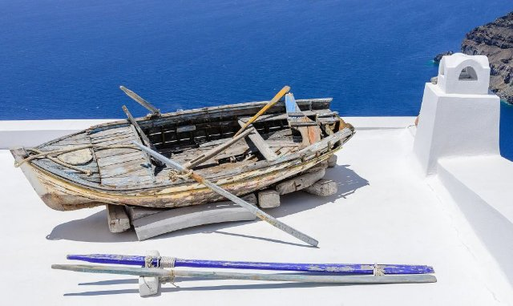{ loading=lazy }

Un veicolo che si muove sull'acqua.

- Type: Object
- Subjects: Transportation
- Country: Poland
- Image credit: CC_BY_SA | Norbert Nagel | [source](https://commons.wikimedia.org/wiki/File:Rowing_boat_on_a_house_roof_-_Fira_-_Santorini_-_Greece_-_02.jpg)
- Quests: [Fiume Odra (pl_03)](../quest/pl_03.it.md)

---

### Breslavia
{ loading=lazy }

Una città in Polonia con fiumi, ponti e storia.

- Type: Place
- Subjects: Geography, History, Culture
- Country: Poland
- Topics: [Wroclaw Dwarves](../topics/index.md#wroclaw_dwarves), [Wroclaw](../topics/index.md#wroclaw)
- Image credit: CC_BY_SA | Pudelek (Marcin Szala) | [source](https://commons.wikimedia.org/wiki/File:Wrocław_Główny_(Breslau_Hauptbahnhof)_by_night.JPG)
- Quests: [Lo zoo (pl_04)](../quest/pl_04.it.md)

---

### Breslavia: Cattedrale
{ loading=lazy }

Una chiesa grande e importante, dove la gente prega. È possibile salire sulla torre per ammirare il panorama.

- Type: Place
- Subjects: History, Culture
- Country: Poland
- Image credit: CC0 | [source](https://it.m.wikipedia.org/wiki/File:Wroclaw-Archicathedral-116.JPG)
- Quests: [Il grande salvataggio dei nani di Breslavia (pl_02)](../quest/pl_02.it.md)

---

### Breslavia: Sky Tower
{ loading=lazy }

Uno degli edifici più alti della Polonia. Ospita negozi e un punto panoramico.

- Type: Place
- Subjects: Geography, Community, Culture
- Country: Poland
- Image credit: CC0 | [source](https://it.wikipedia.org/wiki/File:Wrocław,_2006_-_2012_-_budowa_Sky_Tower_-_fotopolska.eu_(311325).jpg)
- Quests: [Il grande salvataggio dei nani di Breslavia (pl_02)](../quest/pl_02.it.md)

---

### Camera d'Ambra
{ loading=lazy }

Una famosa stanza fatta di ambra con una storia misteriosa.

- Type: Concept
- Subjects: History, Culture
- Country: Poland
- Topics: [Neptune's fountain](../topics/index.md#neptune_fountain)
- Image credit: CC0 | Branson DeCou | [source](https://commons.wikimedia.org/wiki/File:Catherine_Palace_interior_-_Amber_Room_(1).jpg)
- Quests: [La collana d'ambra di Danzica (pl_05)](../quest/pl_05.it.md)

---

### Cartello
{ loading=lazy }

Una lavagna con informazioni semplici per aiutarti a imparare.

- Type: Object
- Subjects: Education, Community
- Country: Poland
- Image credit: CC_BY_SA | Frank Schulenburg | [source](https://commons.wikimedia.org/wiki/File:Railroad_Park_Resort_in_Dunsmuir,_June_2021.jpg)
- Quests: [Lo zoo (pl_04)](../quest/pl_04.it.md)

---

### Casa di Niccolò Copernico
{ loading=lazy }

Ora è un museo dove è possibile scoprire di più sulla sua vita e sui suoi successi scientifici.

- Type: Place
- Subjects: Culture, Science
- Country: Poland
- Image credit: CC0 | Pko, CC BY-SA 4.0 <https://creativecommons.org/licenses/by-sa/4.0>, via Wikimedia Commons | [source](https://commons.wikimedia.org/w/index.php?curid=76433849)
- Quests: [Copernico e il sistema solare (pl_07)](../quest/pl_07.it.md)

---

### Casa galleggiante
{ loading=lazy }

Una barca fatta per vivere.

- Type: Object
- Subjects: Transportation, Community
- Country: Poland
- Topics: [Odra river](../topics/index.md#odra_river)
- Image credit: CC_BY_SA | Kritzolina | [source](https://commons.wikimedia.org/wiki/File:Houseboat_in_Copenhagen_Harbor_02.jpg)
- Quests: [Fiume Odra (pl_03)](../quest/pl_03.it.md)

---

### Chiatta
{ loading=lazy }

Una lunga imbarcazione piatta che trasporta merci sui fiumi.

- Type: Object
- Subjects: Transportation, Geography
- Country: Poland
- Image credit: CC_BY_SA | Dietmar Rabich
- Quests: [Fiume Odra (pl_03)](../quest/pl_03.it.md)

---

### Collana
{ loading=lazy }

Una collana di perline o conchiglie da indossare intorno al collo.

- Type: Object
- Subjects: Art, Culture
- Country: Poland
- Topics: [Neptune's fountain](../topics/index.md#neptune_fountain)
- Image credit: CC_BY_SA | W.carter | [source](https://commons.wikimedia.org/wiki/File:Necklace_made_of_rough_diamonds.jpg)
- Quests: [La collana d'ambra di Danzica (pl_05)](../quest/pl_05.it.md)

---

### Conchiglia
{ loading=lazy }

Un guscio duro di un animale marino, ottimo per i lavoretti.

- Type: Object
- Subjects: Animal, Environment, Art
- Country: Poland
- Topics: [Neptune's fountain](../topics/index.md#neptune_fountain)
- Image credit: CC0 | George Chernilevsky | [source](https://commons.wikimedia.org/wiki/File:Flexopecten_ponticus_2008_G1.jpg)
- Quests: [La collana d'ambra di Danzica (pl_05)](../quest/pl_05.it.md)

---

### Costa del Mar Baltico
{ loading=lazy }

La costa sabbiosa lungo il Mar Baltico.

- Type: Place
- Subjects: Geography, Environment
- Country: Poland
- Topics: [gdansk](../topics/index.md#gdansk)
- Image credit: CC_BY_SA | Radomianin | [source](https://commons.wikimedia.org/wiki/File:Baltic_Sea_view_from_Schmiedeberg_hill_in_Rerik,_2025-06-23.jpg)
- Quests: [La collana d'ambra di Danzica (pl_05)](../quest/pl_05.it.md)

---

### Cucciolo
{ loading=lazy }

Un cucciolo di leone.

- Type: Concept
- Subjects: Animal, Science
- Country: Poland
- Image credit: CC_BY_SA | Charles J. Sharp | [source](https://commons.wikimedia.org/wiki/File:Eurasian_brown_bear_(Ursus_arctos_arctos)_cub_14_months.jpg)
- Quests: [Lo zoo (pl_04)](../quest/pl_04.it.md)

---

### Danzica
{ loading=lazy }

Città portuale in Polonia sul Mar Baltico.

- Type: Place
- Subjects: Geography, History, Culture
- Country: Poland
- Topics: [gdansk](../topics/index.md#gdansk), [Neptune's fountain](../topics/index.md#neptune_fountain)
- Image credit: CC_BY_SA | Diego Delso | [source](https://commons.wikimedia.org/wiki/File:Calle_Dlugie_Pobrzeze,_Gdansk,_Polonia,_2013-05-20,_DD_05.jpg)
- Quests: [La collana d'ambra di Danzica (pl_05)](../quest/pl_05.it.md)

---

### Direttore dello zoo
{ loading=lazy }

La persona che gestisce lo zoo e aiuta i visitatori.

- Type: Person
- Subjects: Community, Education
- Country: Poland
- Topics: [wroclaw zoo](../topics/index.md#wroclaw_zoo)
- Image credit: CC0 | USFWS Pacific | [source](https://commons.wikimedia.org/wiki/File:USFWS_director_visits_Oregon_Zoo_(51946414879).jpg)
- Quests: [Lo zoo (pl_04)](../quest/pl_04.it.md)

---

### Ecosistema
{ loading=lazy }

Gli esseri viventi e la loro casa nella natura, che lavorano insieme.

- Type: Concept
- Subjects: Environment, Science
- Country: Poland
- Image credit: CC_BY_SA | XCXNXH | [source](https://commons.wikimedia.org/wiki/File:JULY_2024_COBERMS_RESEARCH_WORK_AT_KONGO_VILLAGE.jpg)
- Quests: [La collana d'ambra di Danzica (pl_05)](../quest/pl_05.it.md)

---

### Esperto di nani
{ loading=lazy }

Una guida amichevole che sa tutto sui nani.

- Type: Person
- Subjects: Education, Culture
- Country: Poland
- Topics: [Wroclaw Dwarves](../topics/index.md#wroclaw_dwarves)
- Image credit: CC_BY | Tomasz Gąsior | [source](https://commons.wikimedia.org/wiki/File:Kaczmaruś_dwarf_02.jpg)
- Quests: [Il grande salvataggio dei nani di Breslavia (pl_02)](../quest/pl_02.it.md)

---

### Faro di Danzica
{ loading=lazy }

Un faro storico che aiuta le navi a trovare il porto.

- Type: Place
- Subjects: History, Geography, Transportation
- Country: Poland
- Topics: [gdansk](../topics/index.md#gdansk)
- Image credit: CC_BY_SA | Yanek | [source](https://commons.wikimedia.org/wiki/File:Gdańsk,_Kapitanat_Portu_-_Port_Północny_-_fotopolska.eu_(304857).jpg)
- Quests: [La collana d'ambra di Danzica (pl_05)](../quest/pl_05.it.md)

---

### Fiume Motława
{ loading=lazy }

Il fiume che attraversa Danzica fino al mare.

- Type: Place
- Subjects: Geography
- Country: Poland
- Topics: [gdansk](../topics/index.md#gdansk)
- Image credit: CC_BY_SA | John Samuel | [source](https://commons.wikimedia.org/wiki/File:Boat_on_Motława_river_in_Gdańsk.jpg)
- Quests: [La collana d'ambra di Danzica (pl_05)](../quest/pl_05.it.md)

---

### fiume Odra
{ loading=lazy }

Un grande fiume nella Polonia occidentale. Aiuta le navi a viaggiare e commerciare.

- Type: Place
- Subjects: Geography, Environment
- Country: Poland
- Topics: [Odra river](../topics/index.md#odra_river), [Wroclaw](../topics/index.md#wroclaw)
- Image credit: CC0
- Quests: [Fiume Odra (pl_03)](../quest/pl_03.it.md)

---

### fiume Vistola
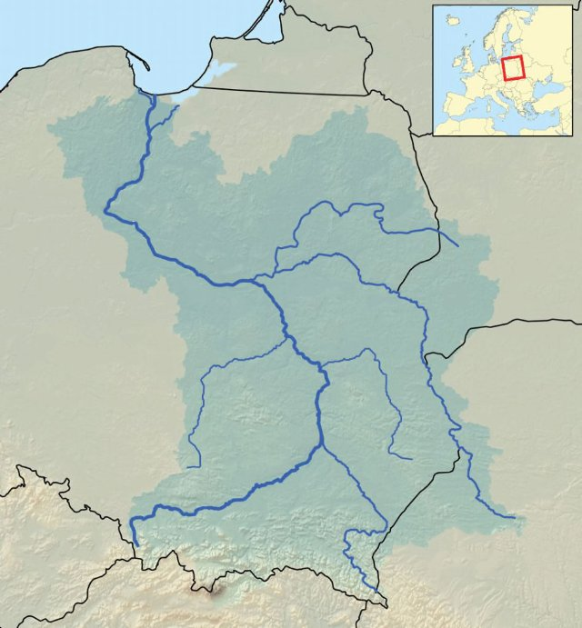{ loading=lazy }

Il fiume più lungo della Polonia; sfocia nel Mar Baltico.

- Type: Place
- Subjects: Geography, Environment
- Country: Poland
- Image credit: CC_BY_SA | Jakub Hałun | [source](https://commons.wikimedia.org/wiki/File:20200529_Widok_ze_Skały_Okrążek_na_Opactwo_w_Tyńcu_1735_2128.jpg)
- Quests: [Il grande salvataggio dei nani di Breslavia (pl_02)](../quest/pl_02.it.md)

---

### fiume Vistola (Wisła)
{ loading=lazy }

Il fiume più lungo della Polonia si chiama Wisła o Vistola. Scorre attraverso Cracovia e Varsavia.

- Type: Place
- Subjects: Geography, Environment
- Country: Poland
- Topics: [Odra river](../topics/index.md#odra_river), [Wroclaw](../topics/index.md#wroclaw)
- Image credit: CC0
- Quests: [Fiume Odra (pl_03)](../quest/pl_03.it.md)

---

### Foca
{ loading=lazy }

Un animale marino selvatico che riposa sulle spiagge.

- Type: Object
- Subjects: Animal, Environment, Safety
- Country: Poland
- Image credit: CC_BY_SA | Charles J. Sharp | [source](https://commons.wikimedia.org/wiki/File:Common_seal_(Phoca_vitulina)_2.jpg)
- Quests: [La collana d'ambra di Danzica (pl_05)](../quest/pl_05.it.md)

---

### Fontana di Nettuno
{ loading=lazy }

Una famosa fontana di Danzica con la statua del dio del mare.

- Type: Place
- Subjects: History, Culture, Community
- Country: Poland
- Topics: [Neptune's fountain](../topics/index.md#neptune_fountain)
- Image credit: CC_BY_SA | Diego Delso | [source](https://commons.wikimedia.org/wiki/File:Monumento_Neptuno,_Gdansk,_Polonia,_2013-05-20,_DD_03.jpg)
- Quests: [La collana d'ambra di Danzica (pl_05)](../quest/pl_05.it.md)

---

### Fontana multimediale di Breslavia
{ loading=lazy }

Acqua che danza con musica e luci colorate.

- Type: Place
- Subjects: Culture, Technology, Recreation
- Country: Poland
- Image credit: CC_BY_SA | Piotr Walczak & Konradr | [source](https://commons.wikimedia.org/wiki/File:Wrocławska_fontanna_Piotr_Walczak2.jpg)
- Quests: [Il grande salvataggio dei nani di Breslavia (pl_02)](../quest/pl_02.it.md)

---

### Fryderyk Chopin
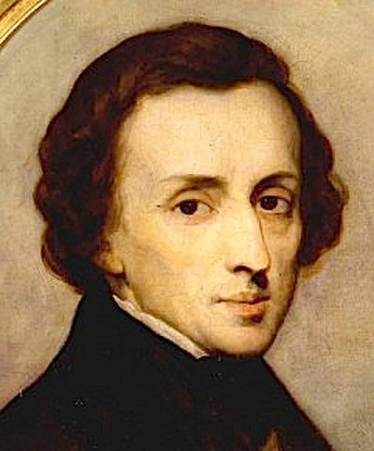{ loading=lazy }

Un famoso compositore polacco per pianoforte. Ha scritto musica meravigliosa che sembra danzare o raccontare storie. La sua musica trasmette felicità o tristezza.

- Rationale: Chopin introduces kids to classical music and shows how music can express emotions
- Type: Person
- Subjects: Music, History, Culture
- Year: 1810
- Country: Poland
- Topics: [Warsaw](../topics/index.md#warsaw)
- Image credit: CC0
- Quests: [Scopri Varsavia (pl_01)](../quest/pl_01.it.md)

---

### Gabbiano
{ loading=lazy }

Un uccello marino che vive vicino alla costa.

- Type: Object
- Subjects: Animal, Environment
- Country: Poland
- Image credit: CC_BY_SA | Diliff | [source](https://commons.wikimedia.org/wiki/File:Black-headed_Gull_-_St_James's_Park,_London_-_Nov_2006.jpg)
- Quests: [La collana d'ambra di Danzica (pl_05)](../quest/pl_05.it.md)

---

### Giove
{ loading=lazy }

Il pianeta più grande, famoso per la Grande Macchia Rossa.

- Type: Object
- Subjects: Space, Science
- Country: Poland
- Topics: [Solar System](../topics/index.md#solar_system)
- Image credit: CC0 | NASA/JPL/Space Science Institute | [source](https://commons.wikimedia.org/wiki/File:Portrait_of_Jupiter_from_Cassini.jpg)
- Quests: [Copernico e il sistema solare (pl_07)](../quest/pl_07.it.md)

---

### guardiano dello zoo
{ loading=lazy }

Una persona che si prende cura degli animali allo zoo.

- Type: Person
- Subjects: Community, Animal, Education
- Country: Poland
- Topics: [wroclaw zoo](../topics/index.md#wroclaw_zoo)
- Image credit: CC_BY_SA | 좀비 브렌다 | [source](https://commons.wikimedia.org/wiki/File:Hadada_Ibis_perched_on_Dallas_Zoo_keeper.jpg)
- Quests: [Lo zoo (pl_04)](../quest/pl_04.it.md)

---

### Guerre e Sawa
{ loading=lazy }

Due figure leggendarie che diedero il nome a Varsavia: Wars era un coraggioso guerriero e Sawa era una bellissima sirena che viveva nel fiume Vistola.

- Type: Concept
- Subjects: Community, Culture
- Year: 1300
- Country: Poland
- Topics: [Warsaw](../topics/index.md#warsaw)
- Image credit: CC0 | [source](https://en.m.wikipedia.org/wiki/File:Rzeźba_Warsa_i_Sawy_01.jpg)
- Quests: [Scopri Varsavia (pl_01)](../quest/pl_01.it.md)

---

### Iglica
{ loading=lazy }

Un'alta scultura in metallo accanto alla Centennial Hall.

- Type: Place
- Subjects: History, Culture
- Country: Poland
- Image credit: CC_BY_SA | Jonashtand | [source](https://commons.wikimedia.org/wiki/File:202206_Iglica,_Wrocław.jpg)
- Quests: [Lo zoo (pl_04)](../quest/pl_04.it.md)

---

### Kayak
{ loading=lazy }

Una piccola barca su cui si pagaia.

- Type: Object
- Subjects: Recreation, Sport
- Country: Poland
- Image credit: CC_BY_SA | 0x010C
- Quests: [Fiume Odra (pl_03)](../quest/pl_03.it.md)

---

### Lente
{ loading=lazy }

Un pezzo di vetro o plastica trasparente che piega la luce.

- Type: Object
- Subjects: Science, Technology
- Country: Poland
- Topics: [Telescope](../topics/index.md#telescope)
- Image credit: CC_BY_SA | Christian David | [source](https://commons.wikimedia.org/wiki/File:Village_de_Lens.jpg)
- Quests: [Copernico e il sistema solare (pl_07)](../quest/pl_07.it.md)

---

### Leonardo da Vinci Primary School
{ loading=lazy }

It’s a friendly place where children learn, create, and explore guided by curiosity, art, and science.

- Type: None
- Subjects: Education
- Country: Poland
- Image credit: CC0
- Quests: [Il grande salvataggio dei nani di Breslavia (pl_02)](../quest/pl_02.it.md)

---

### Maestro delle Chiavi Nano
{ loading=lazy }

Una statua nana sorveglia l'ascensore con una grande chiave.

- Type: Object
- Subjects: Culture
- Country: Poland
- Topics: [Wroclaw Dwarves](../topics/index.md#wroclaw_dwarves)
- Image credit: CC_BY_SA | Pnapora | [source](https://commons.wikimedia.org/wiki/File:100matolog_(Tooth-dwarf)_Wroclaw_dwarf_02.JPG)
- Quests: [Il grande salvataggio dei nani di Breslavia (pl_02)](../quest/pl_02.it.md)

---

### Map of Wroklaw
{ loading=lazy }

A simple map of Wrocław showing the Odra River with its islands and many bridges

- Type: None
- Subjects: Geography
- Country: Poland
- Image credit: CC0
- Quests: [Il grande salvataggio dei nani di Breslavia (pl_02)](../quest/pl_02.it.md), [Fiume Odra (pl_03)](../quest/pl_03.it.md)

---

### Maria Curie
{ loading=lazy }

Una brillante scienziata polacca che scoprì la radioattività. Fu la prima donna a vincere il Premio Nobel, e lo vinse due volte!

- Rationale: Maria Curie inspires kids (especially girls) to pursue science and shows Polish contributions to science
- Type: Person
- Subjects: Science, History
- Year: 1867
- Country: Poland
- Image credit: CC0
- Quests: [Scopri Varsavia (pl_01)](../quest/pl_01.it.md)

---

### Marte
{ loading=lazy }

Il pianeta rosso con polvere e grandi vulcani.

- Type: Object
- Subjects: Space, Science
- Country: Poland
- Topics: [Solar System](../topics/index.md#solar_system)
- Image credit: CC_BY_SA | ESA & MPS for OSIRIS Team MPS/UPD/LAM/IAA/RSSD/INTA/UPM/DASP/IDA, CC BY-SA 3.0 IGO | [source](https://commons.wikimedia.org/wiki/File:OSIRIS_Mars_true_color.jpg)
- Quests: [Copernico e il sistema solare (pl_07)](../quest/pl_07.it.md)

---

### Mercurio
{ loading=lazy }

Il pianeta più vicino al Sole; piccolo e molto veloce.

- Type: Object
- Subjects: Space, Science
- Country: Poland
- Topics: [Solar System](../topics/index.md#solar_system)
- Image credit: CC0 | NASA/Johns Hopkins University Applied Physics Laboratory/Carnegie Institution of Washington. Edited version of Image:Mercury in color - Prockter07.jpg by Papa Lima Whiskey. | [source](https://commons.wikimedia.org/wiki/File:Mercury_in_color_-_Prockter07_centered.jpg)
- Quests: [Copernico e il sistema solare (pl_07)](../quest/pl_07.it.md)

---

### Modello eliocentrico
{ loading=lazy }

L'idea che il Sole sia al centro e che i pianeti gli girino attorno.

- Type: Concept
- Subjects: Science, Space, History
- Country: Poland
- Topics: [Solar System](../topics/index.md#solar_system)
- Image credit: CC0 | Andreas Cellarius | [source](https://commons.wikimedia.org/wiki/File:1661_Cellarius's_chart_illustrating_Copernicus'_heliocentric_model_of_the_universe.jpg)
- Quests: [Copernico e il sistema solare (pl_07)](../quest/pl_07.it.md)

---

### Monumento a Chopin
{ loading=lazy }

Una grande statua nel Parco Łazienki di Varsavia, dedicata a Frédéric Chopin. È anche sede di popolari concerti di pianoforte all'aperto in estate. (L'albero speciale sotto cui è seduto è un tipico salice polacco)

- Type: Object
- Subjects: Music, Culture
- Country: Poland
- Topics: [Warsaw](../topics/index.md#warsaw)
- Image credit: CC0 | Ethan Doyle White, CC BY-SA 4.0 <https://creativecommons.org/licenses/by-sa/4.0>, via Wikimedia Commons | [source](https://commons.wikimedia.org/wiki/File:The_Chopin_Monument_in_Warsaw.jpg)
- Quests: [Scopri Varsavia (pl_01)](../quest/pl_01.it.md)

---

### Municipio
{ loading=lazy }

Il luogo in cui i leader della città lavorano e si incontrano.

- Type: Concept
- Subjects: Civics, Community, History
- Country: Poland
- Image credit: CC_BY_SA | Krzysztof Golik | [source](https://commons.wikimedia.org/wiki/File:Town_hall_of_Aosta_(3).jpg)
- Quests: [Il grande salvataggio dei nani di Breslavia (pl_02)](../quest/pl_02.it.md)

---

### Municipio di Toruń
{ loading=lazy }

Un grande edificio gotico a Toruń, vicino alla piazza del mercato.

- Type: Place
- Subjects: History, Geography, Culture
- Country: Poland
- Image credit: CC_BY_SA | Krzysztof Golik | [source](https://commons.wikimedia.org/wiki/File:Old_town_hall_in_Torun_(6).jpg)
- Quests: [Pan di zenzero e mercato alimentare (pl_06)](../quest/pl_06.it.md)

---

### Municipio principale
{ loading=lazy }

Un alto municipio con torre e museo.

- Type: Place
- Subjects: History, Culture
- Country: Poland
- Image credit: CC_BY_SA | Diego Delso | [source](https://commons.wikimedia.org/wiki/File:Ayuntamiento_Principal,_Gdansk,_Polonia,_2013-05-20,_DD_01.jpg)
- Quests: [La collana d'ambra di Danzica (pl_05)](../quest/pl_05.it.md)

---

### Nani di Breslavia
{ loading=lazy }

Piccole statue sparse per la città che amano fare scherzi.

- Type: Concept
- Subjects: Culture, Community, History
- Country: Poland
- Topics: [Wroclaw Dwarves](../topics/index.md#wroclaw_dwarves)
- Image credit: CC_BY_SA | Matti Blume | [source](https://commons.wikimedia.org/wiki/File:Dwarf,_Wroclaw_(P1180336).jpg)
- Quests: [Il grande salvataggio dei nani di Breslavia (pl_02)](../quest/pl_02.it.md)

---

### Nano amante degli animali
{ loading=lazy }

Una statua di un nano che ama lo zoo e gli animali.

- Type: Object
- Subjects: Culture, Animal, Education
- Country: Poland
- Topics: [Wroclaw Dwarves](../topics/index.md#wroclaw_dwarves)
- Image credit: CC_BY | Klearchos Kapoutsis from Santorini, Greece | [source](https://commons.wikimedia.org/wiki/File:Gołębnik,_the_Flying_Dwarf..._(5629227878).jpg)
- Quests: [Il grande salvataggio dei nani di Breslavia (pl_02)](../quest/pl_02.it.md)

---

### Nano polacco (gnomi di Breslavia)
{ loading=lazy }

Piccole statue di nani si nascondono in giro per Breslavia. Trovarle è un divertente gioco cittadino.

- Type: Concept
- Subjects: Community, Culture
- Year: 1700
- Country: Poland
- Topics: [Wroclaw Dwarves](../topics/index.md#wroclaw_dwarves)
- Image credit: CC0
- Quests: [Scopri Varsavia (pl_01)](../quest/pl_01.it.md), [Il grande salvataggio dei nani di Breslavia (pl_02)](../quest/pl_02.it.md)

---

### Nave
{ loading=lazy }

Una grande imbarcazione che trasporta persone o merci.

- Type: Object
- Subjects: Transportation
- Country: Poland
- Topics: [Fisherman](../topics/index.md#fisherman)
- Image credit: CC_BY | Christian Ferrer | [source](https://commons.wikimedia.org/wiki/File:Rhapsody_(ship,_1996),_Sète_cf01.jpg)
- Quests: [La collana d'ambra di Danzica (pl_05)](../quest/pl_05.it.md)

---

### Navigazione
{ loading=lazy }

Orientarsi in mare utilizzando luci, mappe e strumenti.

- Type: Concept
- Subjects: Technology, Geography
- Country: Poland
- Topics: [Fisherman](../topics/index.md#fisherman)
- Image credit: CC0 | [source](https://commons.wikimedia.org/wiki/File:Table_of_Geography_and_Hydrography,_Cyclopaedia,_Volume_1.jpg)
- Quests: [La collana d'ambra di Danzica (pl_05)](../quest/pl_05.it.md)

---

### Nettuno
{ loading=lazy }

Il dio del mare delle vecchie storie.

- Type: Concept
- Subjects: Culture, History
- Country: Poland
- Topics: [Solar System](../topics/index.md#solar_system)
- Image credit: CC0 | NASA | [source](https://commons.wikimedia.org/wiki/File:Neptune_Full.jpg)
- Quests: [Copernico e il sistema solare (pl_07)](../quest/pl_07.it.md)

---

### Niccolò Copernico
{ loading=lazy }

Un brillante scienziato polacco ha scoperto che è la Terra a girare intorno al Sole, non il contrario! Questo ha cambiato il nostro modo di concepire lo spazio.

- Rationale: Copernicus teaches kids about scientific discovery and Polish contributions to astronomy
- Type: Person
- Subjects: Science, History, Space
- Year: 1473
- Country: Poland
- Topics: [Telescope](../topics/index.md#telescope)
- Image credit: CC0
- Quests: [Copernico e il sistema solare (pl_07)](../quest/pl_07.it.md)

---

### Oculare
{ loading=lazy }

La piccola lente attraverso cui si guarda in un telescopio.

- Type: Object
- Subjects: Science, Technology
- Country: Poland
- Topics: [Telescope](../topics/index.md#telescope)
- Image credit: CC_BY | SvonHalenbach | [source](https://commons.wikimedia.org/wiki/File:Newtonianscope-eyepiece-detail.JPG)
- Quests: [Copernico e il sistema solare (pl_07)](../quest/pl_07.it.md)

---

### Odra river map
{ loading=lazy }

A simple map that shows the Odra River in Poland and the way it flows to the Baltic Sea

- Type: None
- Subjects: Geography
- Country: Poland
- Image credit: CC0
- Quests: [Fiume Odra (pl_03)](../quest/pl_03.it.md)

---

### Olga Tokarczuk
{ loading=lazy }

Un famoso scrittore polacco che vive a Breslavia.

- Type: Person
- Subjects: Literature, Culture
- Country: Poland
- Image credit: CC_BY_SA | Harald Krichel | [source](https://commons.wikimedia.org/wiki/File:Olga_Tokarczuk-9739.jpg)
- Quests: [Il grande salvataggio dei nani di Breslavia (pl_02)](../quest/pl_02.it.md)

---

### Onde
{ loading=lazy }

Acqua in movimento sul mare.

- Type: Concept
- Subjects: Environment, Science
- Country: Poland
- Topics: [Fisherman](../topics/index.md#fisherman)
- Image credit: CC_BY_SA | Roger McLassus | [source](https://commons.wikimedia.org/wiki/File:2006-01-14_Surface_waves.jpg)
- Quests: [La collana d'ambra di Danzica (pl_05)](../quest/pl_05.it.md)

---

### Pan di zenzero di Torun
{ loading=lazy }

una delizia tradizionale polacca a base di spezie e miele, spesso decorata con bellissimi disegni.

- Type: Object
- Subjects: Food
- Country: Poland
- Topics: [Gingerbread](../topics/index.md#gingerbread), [Pierogi Recipe](../topics/index.md#pierogi)
- Image credit: CC0 | Marcin Floryan, CC BY 2.5 <https://creativecommons.org/licenses/by/2.5>, via Wikimedia Commons | [source](https://commons.wikimedia.org/w/index.php?curid=1300867)
- Quests: [Pan di zenzero e mercato alimentare (pl_06)](../quest/pl_06.it.md)

---

### Panorama Racławicka
{ loading=lazy }

Un dipinto gigante tutto intorno a te che racconta una battaglia storica.

- Type: Place
- Subjects: History, Art, Culture
- Country: Poland
- Image credit: CC_BY_SA | Barbara Maliszewska
- Quests: [Il grande salvataggio dei nani di Breslavia (pl_02)](../quest/pl_02.it.md)

---

### Pappagallo
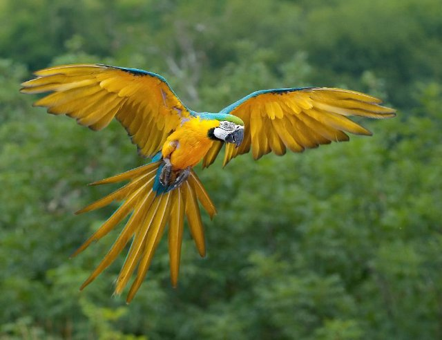{ loading=lazy }

Un uccello brillante che sa imitare i suoni.

- Type: Object
- Subjects: Animal, Science
- Country: Poland
- Image credit: CC_BY | Luc Viatour | [source](https://commons.wikimedia.org/wiki/File:Ara_ararauna_Luc_Viatour.jpg)
- Quests: [Lo zoo (pl_04)](../quest/pl_04.it.md)

---

### Passerella
{ loading=lazy }

Un ponte su cui le persone possono camminare. Niente auto.

- Type: Object
- Subjects: Transportation, Community
- Country: Poland
- Topics: [Odra river](../topics/index.md#odra_river)
- Image credit: CC_BY_SA | Basile Morin | [source](https://commons.wikimedia.org/wiki/File:Front_view_of_a_wooden_footbridge_over_a_lagoon,_trees_and_mountains_in_Vang_Vieng,_Laos.jpg)
- Quests: [Fiume Odra (pl_03)](../quest/pl_03.it.md)

---

### Pavone
{ loading=lazy }

Un uccello colorato con una grande coda di piume.

- Type: Object
- Subjects: Animal, Science, Art
- Country: Poland
- Image credit: CC_BY_SA | Jebulon | [source](https://commons.wikimedia.org/wiki/File:Paonroue.JPG)
- Quests: [Lo zoo (pl_04)](../quest/pl_04.it.md)

---

### Pescatore
{ loading=lazy }

Persona che pesca in mare.

- Type: Person
- Subjects: Community, Geography
- Country: Poland
- Topics: [Fisherman](../topics/index.md#fisherman)
- Image credit: CC_BY_SA | Benh LIEU SONG (Flickr) | [source](https://commons.wikimedia.org/wiki/File:Leg_Rowing_Fisherman_Inle_Lake_Myanmar.jpg)
- Quests: [La collana d'ambra di Danzica (pl_05)](../quest/pl_05.it.md)

---

### Piazza del mercato di Breslavia
{ loading=lazy }

La piazza principale della Città Vecchia, piena di vita.

- Type: Place
- Subjects: Geography, Culture, Community, History
- Country: Poland
- Image credit: CC_BY_SA | Jacek Halicki | [source](https://commons.wikimedia.org/wiki/File:2016_Wrocław,_Rynek_49.jpg)
- Quests: [Il grande salvataggio dei nani di Breslavia (pl_02)](../quest/pl_02.it.md)

---

### Pierogi polacchi
{ loading=lazy }

Ravioli ripieni di patate, formaggio o frutta. Sono un famoso piatto polacco.

- Type: Object
- Subjects: Food, Culture
- Year: 1600
- Country: Poland
- Topics: [Pierogi Recipe](../topics/index.md#pierogi)
- Image credit: CC0
- Quests: [Pan di zenzero e mercato alimentare (pl_06)](../quest/pl_06.it.md)

---

### Pierogi Recipe
Make a soft dough, fill with mashed potatoes and farmer’s cheese, seal, boil until they float—then pan-fry in butter with onions.

- Type: Object
- Subjects: Food
- Country: Poland
- Topics: [Pierogi Recipe](../topics/index.md#pierogi)

---

### Planetario
{ loading=lazy }

Un luogo dove è possibile osservare il cielo e le stelle restando al chiuso.

- Type: Place
- Subjects: Education, Science, Space
- Country: Poland
- Topics: [Solar System](../topics/index.md#solar_system), [Telescope](../topics/index.md#telescope)
- Image credit: CC0 | Atelier Hermann Walter

Bernhard Müller († 1930)
Karl Walter (* 7. Dezember 1874; † 11. October 1940) | [source](https://commons.wikimedia.org/wiki/File:Planetarium_Pfaffendorfer_Strasse_Leipzig_um_1927.jpg)
- Quests: [Copernico e il sistema solare (pl_07)](../quest/pl_07.it.md)

---

### Ponte
{ loading=lazy }

Una struttura che consente alle persone o ai veicoli di attraversare l'acqua.

- Type: Concept
- Subjects: Technology, Transportation
- Country: Poland
- Image credit: CC_BY_SA | W.carter | [source](https://commons.wikimedia.org/wiki/File:Bridge_and_deck_of_Gullbritt.jpg)
- Quests: [Fiume Odra (pl_03)](../quest/pl_03.it.md)

---

### Ponte ferroviario
{ loading=lazy }

Un ponte con binari per treni.

- Type: Object
- Subjects: Transportation, Technology
- Country: Poland
- Topics: [Odra river](../topics/index.md#odra_river)
- Image credit: CC_BY_SA | Kabelleger / David Gubler | [source](https://commons.wikimedia.org/wiki/File:FCCA_GE_C30-7_Infiernillo_Viaduct.jpg)
- Quests: [Fiume Odra (pl_03)](../quest/pl_03.it.md)

---

### Ponte Rędziński
{ loading=lazy }

Il ponte strallato più lungo della Polonia.

- Type: Place
- Subjects: Geography, Transportation, Technology
- Country: Poland
- Topics: [Odra river](../topics/index.md#odra_river)
- Image credit: CC_BY_SA | Olgierd (Creative Commons licensed only) | [source](https://commons.wikimedia.org/wiki/File:Most_Rędziński_we_Wroclawiu.jpg)
- Quests: [Fiume Odra (pl_03)](../quest/pl_03.it.md)

---

### Ponte stradale
{ loading=lazy }

Un ponte per auto e autobus.

- Type: Object
- Subjects: Transportation
- Country: Poland
- Topics: [Odra river](../topics/index.md#odra_river)
- Image credit: CC_BY_SA | Photographer: Dey.sandip Additional Credit: User Atention for water spot removal. | [source](https://commons.wikimedia.org/wiki/File:Anjarle_Bridge_and_Cows-fix.jpg)
- Quests: [Fiume Odra (pl_03)](../quest/pl_03.it.md)

---

### Ponte Tumski
{ loading=lazy }

Un famoso ponte con lucchetti dell'amore e lanterne a gas.

- Type: Place
- Subjects: Culture, Geography, Community
- Country: Poland
- Topics: [Odra river](../topics/index.md#odra_river)
- Image credit: CC_BY_SA | Aw58 | [source](https://commons.wikimedia.org/wiki/File:Wrocław,_most_Tumski_widziany_z_bulwaru_Piotra_Włostowica_(MW).jpg)
- Quests: [Fiume Odra (pl_03)](../quest/pl_03.it.md)

---

### Ponti di Breslavia
{ loading=lazy }

A Breslavia ci sono molti ponti che attraversano il fiume Odra.

- Type: Concept
- Subjects: Geography, Transportation, Community
- Country: Poland
- Topics: [Odra river](../topics/index.md#odra_river), [Wroclaw](../topics/index.md#wroclaw)
- Image credit: CC_BY_SA | Jar.ciurus | [source](https://commons.wikimedia.org/wiki/File:Wroclaw_Most_Mlynski_w_porannej_mgle_przed_switem.jpg)
- Quests: [Fiume Odra (pl_03)](../quest/pl_03.it.md)

---

### Porta
{ loading=lazy }

Un luogo dove le navi caricano e scaricano.

- Type: Place
- Subjects: Transportation, Community, Geography
- Country: Poland
- Topics: [Fisherman](../topics/index.md#fisherman)
- Image credit: CC_BY | Maxime Raynal from France | [source](https://commons.wikimedia.org/wiki/File:Port_and_lighthouse_overnight_storm_with_lightning_in_Port-la-Nouvelle.jpg)
- Quests: [La collana d'ambra di Danzica (pl_05)](../quest/pl_05.it.md)

---

### Re Sigismondo III
{ loading=lazy }

Re di Polonia, che costruì molti splendidi edifici a Varsavia. La sua statua si erge su un'alta colonna nel centro della città.

- Rationale: Historical kings help kids understand how cities were built and developed over time
- Type: Person
- Subjects: History, Culture
- Year: 1566
- Country: Poland
- Image credit: CC0 | Pieter Soutman, Public domain, via Wikimedia Commons | [source](https://commons.wikimedia.org/wiki/File:Soutman_Sigismund_III_Vasa_in_coronation_robes.jpg)
- Quests: [Scopri Varsavia (pl_01)](../quest/pl_01.it.md)

---

### Recinto per animali
{ loading=lazy }

Uno spazio sicuro pensato per far vivere gli animali allo zoo.

- Type: Place
- Subjects: Animal, Safety
- Country: Poland
- Topics: [wroclaw zoo](../topics/index.md#wroclaw_zoo)
- Image credit: CC0 | Pearson Scott Foresman | [source](https://commons.wikimedia.org/wiki/File:Corral_(PSF).png)
- Quests: [Lo zoo (pl_04)](../quest/pl_04.it.md)

---

### Rete da pesca
{ loading=lazy }

Una rete usata per catturare i pesci.

- Type: Object
- Subjects: Technology, Community
- Country: Poland
- Topics: [Fisherman](../topics/index.md#fisherman)
- Image credit: CC0 | Jebulon | [source](https://commons.wikimedia.org/wiki/File:Fishing_net_Karystos_Euboea_Greece.jpg)
- Quests: [La collana d'ambra di Danzica (pl_05)](../quest/pl_05.it.md)

---

### Sala del Centenario
{ loading=lazy }

La Centennial Hall è un enorme edificio che sembra una grande tenda con un tetto. È molto alto. Al suo interno si possono vedere diversi spettacoli, ascoltare concerti o guardare partite sportive.

- Type: Place
- Subjects: Culture, Recreation
- Country: Poland
- Image credit: CC0 | Taxiarchos228, FAL, via Wikimedia Commons | [source](https://commons.wikimedia.org/wiki/File:Wroc%C5%82aw_-_Jahrhunderthalle1.jpg)
- Quests: [Il grande salvataggio dei nani di Breslavia (pl_02)](../quest/pl_02.it.md)

---

### Saturno
{ loading=lazy }

Un pianeta gigante con anelli luminosi e numerose lune.

- Type: Object
- Subjects: Space, Science
- Country: Poland
- Topics: [Solar System](../topics/index.md#solar_system)
- Image credit: CC0 | NASA/JPL-Caltech/SSI/Cornell | [source](https://commons.wikimedia.org/wiki/File:Top_view_of_the_rings_of_Saturn_by_Cassini_-_October_10,_2013.jpg)
- Quests: [Copernico e il sistema solare (pl_07)](../quest/pl_07.it.md)

---

### Sirena di Varsavia
{ loading=lazy }

Il simbolo della città è una coraggiosa sirena con spada e scudo. La sua statua è visibile lungo il fiume.

- Type: Object
- Subjects: Culture, History
- Country: Poland
- Topics: [Warsaw](../topics/index.md#warsaw)
- Image credit: CC0 | Grzegorz Polak, CC BY-SA 2.0 <https://creativecommons.org/licenses/by-sa/2.0>, via Wikimedia Commons | [source](https://commons.wikimedia.org/wiki/File:Syrenka_Warszawska.jpg)
- Quests: [Scopri Varsavia (pl_01)](../quest/pl_01.it.md)

---

### Sistema solare
{ loading=lazy }

Il Sole e gli otto pianeti che gli ruotano attorno.

- Type: Concept
- Subjects: Space, Science
- Country: Poland
- Topics: [Solar System](../topics/index.md#solar_system)
- Image credit: CC0 | Originally uploaded from NASA by Bricktop; edited by Deuar, KFP, TotoBaggins, City303, JCPagc2015 | [source](https://commons.wikimedia.org/wiki/File:Moons_of_solar_system_v7.jpg)
- Quests: [Copernico e il sistema solare (pl_07)](../quest/pl_07.it.md)

---

### Sky Tower Plaza
{ loading=lazy }

Una piazza moderna dove le persone si incontrano vicino alla torre.

- Type: Place
- Subjects: Geography, Community, Recreation
- Country: Poland
- Image credit: CC_BY_SA | JamesYoung8167 | [source](https://commons.wikimedia.org/wiki/File:Xiamen_Shimao_Straits_Tower_2016-02-09.jpg)
- Quests: [Il grande salvataggio dei nani di Breslavia (pl_02)](../quest/pl_02.it.md)

---

### Statua del nano di Breslavia
{ loading=lazy }

Una piccola statua cittadina; i nani sono il simbolo di Breslavia.

- Type: Object
- Subjects: Culture, Community, History
- Country: Poland
- Topics: [Wroclaw Dwarves](../topics/index.md#wroclaw_dwarves)
- Image credit: CC_BY_SA | Pnapora | [source](https://commons.wikimedia.org/wiki/File:Trener_(Coach)_Wroclaw_dwarf_01.jpg)
- Quests: [Il grande salvataggio dei nani di Breslavia (pl_02)](../quest/pl_02.it.md)

---

### Taglierina
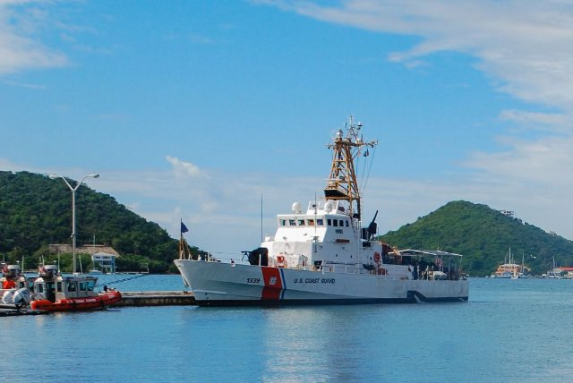{ loading=lazy }

Una piccola barca da pesca usata in mare.

- Type: Object
- Subjects: Transportation, Technology
- Country: Poland
- Image credit: CC_BY_SA | Gordon Leggett | [source](https://commons.wikimedia.org/wiki/File:2009-12-06_USCGC_Key_Biscayne_WPB1339.jpg)
- Quests: [La collana d'ambra di Danzica (pl_05)](../quest/pl_05.it.md)

---

### Telescopio
{ loading=lazy }

Uno strumento che ci aiuta a vedere cose lontane nel cielo.

- Type: Object
- Subjects: Science, Technology, Space
- Country: Poland
- Topics: [Telescope](../topics/index.md#telescope)
- Image credit: CC_BY_SA | Palonitor | [source](https://commons.wikimedia.org/wiki/File:Kométa_C-2020_F3_(NEOWISE).jpg)
- Quests: [Copernico e il sistema solare (pl_07)](../quest/pl_07.it.md)

---

### Terra
{ loading=lazy }

Il nostro pianeta natale con terra, aria e acqua.

- Type: Object
- Subjects: Space, Science, Geography, Environment
- Country: Poland
- Topics: [Solar System](../topics/index.md#solar_system)
- Image credit: CC0 | NASA/Apollo 17 crew; taken by either Harrison Schmitt or Ron Evans | [source](https://commons.wikimedia.org/wiki/File:The_Earth_seen_from_Apollo_17.jpg)
- Quests: [Copernico e il sistema solare (pl_07)](../quest/pl_07.it.md)

---

### Toruń
{ loading=lazy }

Città della Polonia in cui nacque Niccolò Copernico.

- Type: Place
- Subjects: Geography, History, Culture
- Country: Poland
- Image credit: CC_BY_SA | Jakub Hałun | [source](https://commons.wikimedia.org/wiki/File:Widok_zza_Wisły_na_Toruń,_20210908_1711_2822.jpg)
- Quests: [Copernico e il sistema solare (pl_07)](../quest/pl_07.it.md)

---

### Urano
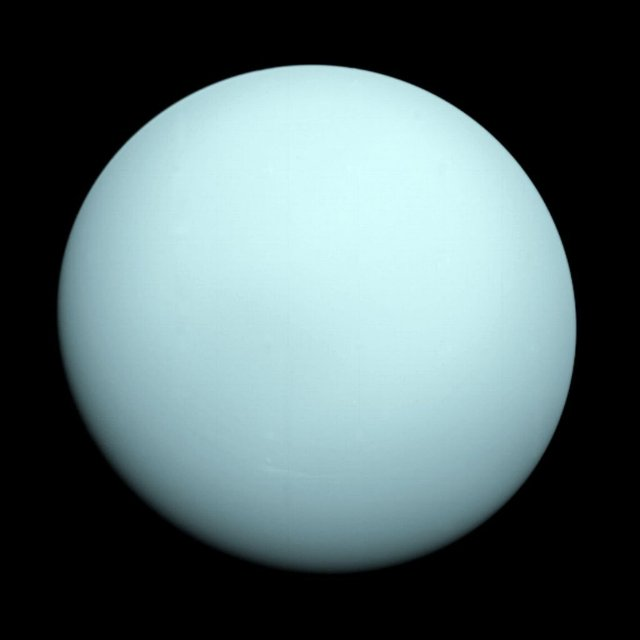{ loading=lazy }

Un pianeta blu-verde che ruota su un lato.

- Type: Object
- Subjects: Space, Science
- Country: Poland
- Topics: [Solar System](../topics/index.md#solar_system)
- Image credit: CC0 | NASA/JPL-Caltech | [source](https://commons.wikimedia.org/wiki/File:Uranus2.jpg)
- Quests: [Copernico e il sistema solare (pl_07)](../quest/pl_07.it.md)

---

### Valuta Zloty
{ loading=lazy }

La valuta polacca si chiama złoty. Monete e banconote riportano simboli polacchi.

- Type: Concept
- Subjects: Money, Geography
- Country: Poland
- Topics: [Pierogi Recipe](../topics/index.md#pierogi)
- Image credit: CC0 | [source](https://commons.wikimedia.org/wiki/File:Bitllets_de_banc_polonesos_2024.jpg)
- Quests: [Pan di zenzero e mercato alimentare (pl_06)](../quest/pl_06.it.md)

---

### Vecchio Municipio (Breslavia)
{ loading=lazy }

Uno splendido edificio gotico nella piazza principale. Ha un famoso orologio.

- Type: Place
- Subjects: Geography, Environment
- Country: Poland
- Image credit: CC0 | [source](https://upload.wikimedia.org/wikipedia/commons/7/70/Wroclaw-Rathaus.jpg)
- Quests: [Il grande salvataggio dei nani di Breslavia (pl_02)](../quest/pl_02.it.md)

---

### Venere
{ loading=lazy }

Un pianeta molto caldo ricoperto da spesse nubi.

- Type: Object
- Subjects: Space, Science
- Country: Poland
- Topics: [Solar System](../topics/index.md#solar_system)
- Image credit: CC_BY | ESO/Y. Beletsky | [source](https://commons.wikimedia.org/wiki/File:Mercury,_Venus_and_the_Moon_Align.jpg)
- Quests: [Copernico e il sistema solare (pl_07)](../quest/pl_07.it.md)

---

### Vescovo nano
{ loading=lazy }

Una statua nana che pone una domanda in chiesa.

- Type: Object
- Subjects: Culture, History
- Country: Poland
- Topics: [Wroclaw Dwarves](../topics/index.md#wroclaw_dwarves)
- Image credit: CC_BY_SA | Teal Reverie | [source](https://commons.wikimedia.org/wiki/File:Dwarf_spider_cephalothorax.jpg)
- Quests: [Il grande salvataggio dei nani di Breslavia (pl_02)](../quest/pl_02.it.md)

---

### Zoo di Breslavia
{ loading=lazy }

Un grande zoo a Breslavia con molti animali da scoprire.

- Type: Place
- Subjects: Geography, Education, Animal
- Country: Poland
- Topics: [wroclaw zoo](../topics/index.md#wroclaw_zoo)
- Image credit: CC_BY | Palickap | [source](https://commons.wikimedia.org/wiki/File:Zoo_Wrocław,_plan.jpg)
- Quests: [Lo zoo (pl_04)](../quest/pl_04.it.md)

---

### Żuraw Crane
{ loading=lazy }

Una vecchia gru portuale e una porta della città sul fiume.

- Type: Place
- Subjects: History, Technology, Geography
- Country: Poland
- Image credit: CC_BY_SA | Jacek Halicki | [source](https://commons.wikimedia.org/wiki/File:2024_Żuraw_wieżowy,_ul._Letnia_w_Kłodzku_(2).jpg)
- Quests: [La collana d'ambra di Danzica (pl_05)](../quest/pl_05.it.md)

