# Cards(en)

Language: english - [french](./index.fr.md) - [polish](./index.pl.md) - [italian](./index.it.md)

!!! note "Educators: help improving these cards!"
    **Comments and feedback**: [discuss in the Forum](https://antura.discourse.group)  
    **Improve translations**: [comment here](https://docs.google.com/spreadsheets/d/1M3uOeqkbE4uyDs5us5vO-nAFT8Aq0LGBxjjT_CSScWw/edit?gid=415931977#gid=415931977)  

Total found:** 364**

## International

### Alps
{ loading=lazy }

A tall mountain range in Europe.

- Type: Place
- Subjects: Geography, Environment
- Country: International
- Topics: [mont blanc](../topics/index.md#mont_blanc)
- Image credit: CC_BY_SA | Drat70 | [source](https://commons.wikimedia.org/wiki/File:Alps_regions.svg)
- Quests: [Mont Blanc & Mountains (fr_08)](../quest/fr_08.md)

---

### Backpack
{ loading=lazy }

A bag you carry on your back.

- Type: Object
- Subjects: Recreation, Transportation, Education
- Country: International
- Topics: [mountain tools](../topics/index.md#mountain_tools)
- Image credit: CC_BY_SA | FOTO:Fortepan — ID 20607: Adományozó/Donor: Wein Sarolta. archive copy at the Wayback Machine | [source](https://commons.wikimedia.org/wiki/File:Colorful,_backpack_Fortepan_20607.jpg)
- Quests: [Mont Blanc & Mountains (fr_08)](../quest/fr_08.md)

---

### Baker
{ loading=lazy }

A person who makes bread, cakes, and pastries.

- Type: Person
- Subjects: History, Culture
- Country: International
- Topics: [Baguette](../topics/index.md#baguette), [market traders](../topics/index.md#marketers)
- Image credit: CC0 | [source](https://commons.wikimedia.org/wiki/File:Baker_Oslo.jpg)
- Quests: [The Colors of the Marseille Market (fr_09)](../quest/fr_09.md)

---

### Ball
{ loading=lazy }

A round object used in many games.

- Type: Object
- Subjects: Sport, Recreation
- Country: International
- Image credit: CC_BY_SA | Marco Gualazzini | [source](https://commons.wikimedia.org/wiki/File:Playing_in_the_Nuba_mountains.jpg)
- Quests: [Discover Warszawa (pl_01)](../quest/pl_01.md)

---

### Baltic Sea
{ loading=lazy }

A big sea in northern Europe where Poland, Germany, and other countries meet. It has beautiful beaches and is famous for amber treasures!

- Rationale: The Baltic Sea teaches kids about marine geography and Poland's coastal access
- Type: Place
- Subjects: Geography, Environment
- Country: International
- Topics: [gdansk](../topics/index.md#gdansk)
- Image credit: CC0
- Quests: [The Amber Necklace of Gdańsk (pl_05)](../quest/pl_05.md)

---

### Beekeeper
{ loading=lazy }

A person who cares for bees and collects honey.

- Type: Person
- Subjects: Community, Animal, Food
- Country: International
- Image credit: CC_BY | Michael Gäbler | [source](https://commons.wikimedia.org/wiki/File:Beekeeper_keeping_bees.jpg)
- Quests: [Gingerbread & food market (pl_06)](../quest/pl_06.md)

---

### Belarus
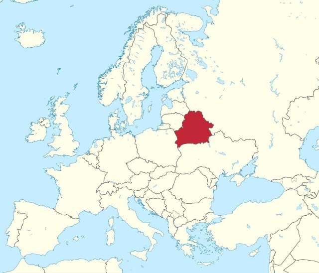{ loading=lazy }

A country in Europe. Capital is Minsk.

- Type: Place
- Subjects: Geography, Culture
- Country: International
- Topics: [Poland Countries](../topics/index.md#poland_countries_around)
- Image credit: CC0 | [source](https://commons.wikimedia.org/wiki/File:Satellite_image_of_Belarus_in_December_2002.jpg)

---

### Belgium
{ loading=lazy }

A country in Europe. Capital is Brussels.

- Type: Place
- Subjects: Geography, Culture
- Country: International
- Image credit: CC_BY | Loc7798_R01.jpg: Marc Ryckaert (MJJR)
derivative work: Kabelleger (talk) | [source](https://commons.wikimedia.org/wiki/File:Loc7798_R01_alt.jpg)

---

### Bern
{ loading=lazy }

The capital city of Switzerland.

- Type: Place
- Subjects: Geography, Culture
- Country: International
- Image credit: CC_BY_SA | Daniel Kraft | [source](https://commons.wikimedia.org/wiki/File:Bern_Panorama_von_Rosengarten_20211007.jpg)

---

### Bike
{ loading=lazy }

A two‑wheeled vehicle you pedal.

- Type: Object
- Subjects: Transportation, Sport, Health
- Country: International
- Image credit: CC_BY_SA | Basile Morin | [source](https://commons.wikimedia.org/wiki/File:Parked_bicycle_with_graffitied_building_facade_and_doors_in_Amsterdam.jpg)
- Quests: [Discover Warszawa (pl_01)](../quest/pl_01.md)

---

### Boat for goods
{ loading=lazy }

A big boat that carries boxes, food, and other things from place to place.

- Type: Place
- Subjects: Geography, Environment
- Country: International
- Image credit: CC0

---

### Boat for People
{ loading=lazy }

A boat that carries people from one place to another across the water.

- Type: Place
- Subjects: Geography, Environment
- Country: International
- Image credit: CC0

---

### Boat House
{ loading=lazy }

A house that floats on water like a boat. People can live in boat houses!

- Type: Place
- Subjects: Geography, Environment
- Country: International
- Image credit: CC0

---

### Bobsled
{ loading=lazy }

A fast sled used to slide down ice.

- Type: Object
- Subjects: Sport, Recreation
- Country: International
- Image credit: CC_BY_SA | Steffen Prößdorf | [source](https://commons.wikimedia.org/wiki/File:2020-02-22_IBSF_World_Championships_Bobsleigh_and_Skeleton_Altenberg_1DX_5978_by_Stepro.jpg)
- Quests: [Mont Blanc & Mountains (fr_08)](../quest/fr_08.md)

---

### Bratislava
{ loading=lazy }

The capital city of Slovakia.

- Type: Place
- Subjects: Geography, Culture
- Country: International
- Image credit: CC_BY_SA | Jakub Hałun | [source](https://commons.wikimedia.org/wiki/File:View_of_Bratislava_from_Nový_most,_20210727_1012_0262.jpg)

---

### BREAD
{ loading=lazy }

A yummy food made from flour and water. You can make sandwiches with bread!

- Type: Object
- Subjects: Food, Culture
- Country: International
- Topics: [Bouillabaisse](../topics/index.md#bouillabaisse)
- Image credit: CC0 | [source](https://commons.wikimedia.org/wiki/File:French_bread_DSC09293.jpg)
- Quests: [The Colors of the Marseille Market (fr_09)](../quest/fr_09.md)

---

### Bridge for cars
{ loading=lazy }

A road that goes over water so cars can drive across rivers and lakes.

- Type: Place
- Subjects: Geography, Environment
- Country: International
- Topics: [Seine Bridges](../topics/index.md#seine_bridges)
- Image credit: CC0
- Quests: [Paris Seine (fr_10)](../quest/fr_10.md)

---

### Bridge for trains
{ loading=lazy }

A special bridge built strong enough for heavy trains to cross over water.

- Type: Place
- Subjects: Geography, Environment
- Country: International
- Topics: [Seine Bridges](../topics/index.md#seine_bridges)
- Image credit: CC0
- Quests: [Paris Seine (fr_10)](../quest/fr_10.md)

---

### Brussels
{ loading=lazy }

The capital city of Belgium.

- Type: Place
- Subjects: Geography, Culture
- Country: International
- Image credit: CC_BY_SA | Horst J. Meuter | [source](https://commons.wikimedia.org/wiki/File:Atomium,_Brüssel_2.jpg)

---

### Bus
{ loading=lazy }

A big vehicle that carries many people.

- Type: Object
- Subjects: Transportation, Community
- Country: International
- Image credit: CC_BY_SA | Xosema | [source](https://commons.wikimedia.org/wiki/File:Setra_S6_-_Empresa_Mosquera_-_02.jpg)
- Quests: [Discover Warszawa (pl_01)](../quest/pl_01.md)

---

### Butcher
{ loading=lazy }

A person who sells meat.

- Type: Person
- Subjects: Community, Food
- Country: International
- Image credit: CC_BY_SA | Sabina Bajracharya | [source](https://commons.wikimedia.org/wiki/File:A_Butcher_cutting_buffalo_meat.jpg)
- Quests: [Gingerbread & food market (pl_06)](../quest/pl_06.md)

---

### Butter
{ loading=lazy }

A yellow fat made from milk, used for cooking and baking.

- Type: Object
- Subjects: Food, Animal
- Country: International
- Topics: [Gingerbread](../topics/index.md#gingerbread)
- Image credit: CC0 | Antoine Vollon | [source](https://commons.wikimedia.org/wiki/File:Antoine_Vollon_-_Mound_of_Butter_-_National_Gallery_of_Art.jpg)
- Quests: [Gingerbread & food market (pl_06)](../quest/pl_06.md)

---

### Canteen menu
{ loading=lazy }

A list that shows what food you can eat at school lunch. It helps you choose what to eat!

- Type: Object
- Subjects: Community, Culture
- Country: International
- Topics: [French School](../topics/index.md#frenchschool)
- Image credit: CC0 | CC0 - Valeria | [source](https://pixabay.com/photos/menu-restaurant-diner-cafe-8165227/)
- Quests: [The School system (fr_02)](../quest/fr_02.md)

---

### Car
{ loading=lazy }

A small vehicle for roads.

- Type: Object
- Subjects: Transportation
- Country: International
- Image credit: CC_BY_SA | Rhododendrites | [source](https://commons.wikimedia.org/wiki/File:Abandoned_car_in_Marine_Park_(10852p).jpg)
- Quests: [Discover Warszawa (pl_01)](../quest/pl_01.md)

---

### Castle Bridge
{ loading=lazy }

A bridge near a castle. Castles are big, strong buildings where kings and queens lived long ago.

- Type: Place
- Subjects: Culture, Community
- Country: International
- Image credit: CC0

---

### Cheesemonger
{ loading=lazy }

A person who sells many types of cheese.

- Type: Person
- Subjects: History, Culture
- Country: International
- Topics: [market traders](../topics/index.md#marketers)
- Image credit: CC0 | [source](https://commons.wikimedia.org/wiki/File:Paris_-_Cheese_seller,_Rue_Moufetard_-_3397.jpg)
- Quests: [The Colors of the Marseille Market (fr_09)](../quest/fr_09.md)

---

### Chimpanzee
{ loading=lazy }

No translation found for 'animal_chimpanzee.desc' in Cards

- Type: None
- Country: International
- Image credit: CC0 | [source](https://commons.wikimedia.org/wiki/File:Common_chimpanzee_(Pan_troglodytes_schweinfurthii)_feeding.jpg)
- Quests: [The Zoo (pl_04)](../quest/pl_04.md)

---

### Cinnamon
{ loading=lazy }

A sweet spice made from tree bark.

- Type: Object
- Subjects: Food, Plant
- Country: International
- Topics: [Gingerbread](../topics/index.md#gingerbread)
- Image credit: CC_BY_SA | Simon A. Eugster | [source](https://commons.wikimedia.org/wiki/File:Cinnamomum_verum_spices.jpg)
- Quests: [Gingerbread & food market (pl_06)](../quest/pl_06.md)

---

### Circle
{ loading=lazy }

A round shape with no corners. Circles look like wheels, balls, and coins!

- Type: Concept
- Subjects: Math
- Country: International
- Topics: [Elementary Math](../topics/index.md#elementary-maths)
- Image credit: CC0 | [source](https://commons.wikimedia.org/wiki/File:Squaring_the_circle_a_history_of_the_problem_%281913%29_-_illustration_-_page_29_fig_9.png)
- Quests: [The School system (fr_02)](../quest/fr_02.md)

---

### Classroom
{ loading=lazy }

A room in school where students sit and learn new things from their teacher.

- Type: Place
- Subjects: Education, Community
- Country: International
- Image credit: CC0
- Quests: [The School system (fr_02)](../quest/fr_02.md), [Jules Verne and transportation (fr_03)](../quest/fr_03.md)

---

### Climbing
{ loading=lazy }

Going up rocks or ice with special gear.

- Type: Concept
- Subjects: Sport, Safety, Recreation
- Country: International
- Topics: [mountain activities](../topics/index.md#mountain_activities)
- Image credit: CC_BY_SA | Original version: Valentin Chapuis
Derivative version: Subsidiary account (image rotated 90 degrees CCW) | [source](https://commons.wikimedia.org/wiki/File:Flo_dans_Juvsøyla_à_Rjukan,_Norvège-rotated.jpg)
- Quests: [Mont Blanc & Mountains (fr_08)](../quest/fr_08.md)

---

### Cloves
{ loading=lazy }

A strong spice used to add flavor to food.

- Type: Object
- Subjects: Food, Plant
- Country: International
- Image credit: CC_BY_SA | Friedrich Haag | [source](https://commons.wikimedia.org/wiki/File:Gewuerze_004_2024_08_10.jpg)
- Quests: [Gingerbread & food market (pl_06)](../quest/pl_06.md)

---

### Coat
{ loading=lazy }

A warm jacket for cold weather.

- Type: Object
- Subjects: Health, Safety, Weather
- Country: International
- Image credit: CC_BY_SA | Calistemon | [source](https://commons.wikimedia.org/wiki/File:White_American_Staffordshire_Terrier_in_Vegemite_coat,_August_2022.jpg)
- Quests: [Mont Blanc & Mountains (fr_08)](../quest/fr_08.md)

---

### Coins
{ loading=lazy }

Small round money made of metal.

- Type: Object
- Subjects: Money
- Country: International
- Image credit: CC_BY_SA | Livioandronico2013 | [source](https://commons.wikimedia.org/wiki/File:Coins_of_the_Italian_Republic_(500_Lire)_silver_(Caravels).png)
- Quests: [Gingerbread & food market (pl_06)](../quest/pl_06.md)

---

### Compass
{ loading=lazy }

A tool that helps you draw perfect circles. It has two legs like scissors.

- Type: Object
- Subjects: Math
- Country: International
- Topics: [Elementary Math](../topics/index.md#elementary-maths)
- Image credit: CC0 | [source](https://commons.wikimedia.org/wiki/File:2023070201_Voigt_Schulzirkel_gespreizt_2023.jpg)
- Quests: [The School system (fr_02)](../quest/fr_02.md)

---

### Constitution of 3 May
{ loading=lazy }

A historic Polish constitution celebrated on May 3.

- Type: Concept
- Subjects: Civics, History, Time
- Country: International
- Image credit: CC0 | Constitutional Convention | [source](https://commons.wikimedia.org/wiki/File:Constitution_of_the_United_States,_page_1.jpg)
- Quests: [Discover Warszawa (pl_01)](../quest/pl_01.md)

---

### Cook
{ loading=lazy }

A person who prepares food.

- Type: Person
- Subjects: Community, Food
- Country: International
- Image credit: CC_BY_SA | Basile Morin | [source](https://commons.wikimedia.org/wiki/File:Kappabashi-dori_streetcorner_(Kitchen_town_-_southern_end)_a_sunny_morning_in_Tokyo_Japan.jpg)
- Quests: [Gingerbread & food market (pl_06)](../quest/pl_06.md)

---

### Crab
{ loading=lazy }

A sea animal with big claws and a hard shell. Crabs walk sideways on the beach!

- Type: Object
- Subjects: Food, Culture
- Country: International
- Topics: [Bouillabaisse](../topics/index.md#bouillabaisse)
- Image credit: CC0 | [source](https://commons.wikimedia.org/wiki/File:Fresh_Crab.jpg)
- Quests: [The Colors of the Marseille Market (fr_09)](../quest/fr_09.md)

---

### Crampons
{ loading=lazy }

Spiky metal grips you attach to boots for ice.

- Type: Object
- Subjects: Safety, Technology, Sport
- Country: International
- Topics: [mountain tools](../topics/index.md#mountain_tools)
- Image credit: CC_BY_SA | Clayoquot | [source](https://commons.wikimedia.org/wiki/File:Strap-on_crampon.JPG)
- Quests: [Mont Blanc & Mountains (fr_08)](../quest/fr_08.md)

---

### Czech Republic
{ loading=lazy }

A country in Europe. Capital is Prague.

- Type: Place
- Subjects: Geography, Culture
- Country: International
- Topics: [Poland Countries](../topics/index.md#poland_countries_around)
- Image credit: CC_BY_SA | Tadeáš Bednarz | [source](https://commons.wikimedia.org/wiki/File:Daniel_Souček_U21_Czech_Republic_vs_Greece_10-10-2019.jpg)

---

### Dairy Vendor
{ loading=lazy }

A person who sells milk, butter, and cheese.

- Type: Person
- Subjects: Community, Food
- Country: International
- Image credit: CC_BY_SA | Something Original (talk) | [source](https://commons.wikimedia.org/wiki/File:Pennsylvania_State_University_Food_Science_Building_and_Berkey_Creamery_May_15,_2010.jpg)
- Quests: [Gingerbread & food market (pl_06)](../quest/pl_06.md)

---

### DANGER Sign
{ loading=lazy }

A sign that warns about danger ahead. Be extra careful.

- Type: Object
- Subjects: Safety
- Country: International
- Topics: [Stree safety](../topics/index.md#street-safety)
- Image credit: CC0 | Government of Singapore - Land Transport Authority, Public domain, via Wikimedia Commons | [source](https://commons.wikimedia.org/wiki/File:Singapore_road_sign_-_Warning_-_Other_danger.svg)

---

### Egg Vendor
{ loading=lazy }

A person who sells eggs.

- Type: Person
- Subjects: Community, Food
- Country: International
- Image credit: CC_BY_SA | Elgabarty2002 | [source](https://commons.wikimedia.org/wiki/File:Egg_Seller_in_Nigeria.jpg)
- Quests: [Gingerbread & food market (pl_06)](../quest/pl_06.md)

---

### Eggs
{ loading=lazy }

Food from chickens used for baking and cooking.

- Type: Object
- Subjects: Food, Animal
- Country: International
- Topics: [Gingerbread](../topics/index.md#gingerbread)
- Image credit: CC_BY_SA | George Chernilevsky | [source](https://commons.wikimedia.org/wiki/File:Eggs_in_basket_2020_G1.jpg)
- Quests: [Gingerbread & food market (pl_06)](../quest/pl_06.md)

---

### Eiffel Tower map
{ loading=lazy }

A map that shows where the famous tall tower in Paris is located.

- Type: Object
- Subjects: Community, Culture
- Country: International
- Topics: [Eiffel Tower](../topics/index.md#eiffel-tower)
- Image credit: CC0
- Quests: [Paris! (fr_01)](../quest/fr_01.md)

---

### Eiffel Tower ticket
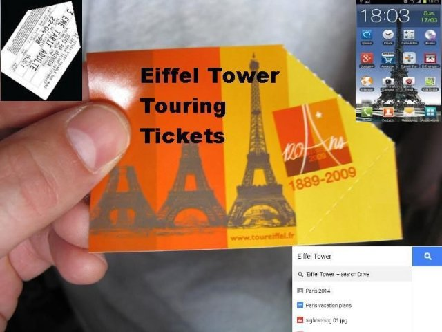{ loading=lazy }

A special paper that lets you visit the famous tall tower in Paris, France.

- Type: Object
- Subjects: Science
- Country: International
- Topics: [Eiffel Tower](../topics/index.md#eiffel-tower)
- Image credit: CC0
- Quests: [Paris! (fr_01)](../quest/fr_01.md)

---

### Eleementary Maths
Numbers and shapes for everyday life: counting, adding and subtracting, simple fractions, measuring, telling time, and using money.

- Type: None
- Country: International
- Topics: [Elementary Math](../topics/index.md#elementary-maths)

---

### Elephant
{ loading=lazy }

A big animal with a trunk. Elephants are the biggest animals that walk on land. They have big ears and love to spray water!

- Rationale: Elephants are amazing animals that kids love learning about at the zoo!
- Type: Object
- Subjects: Animal, Environment
- Country: International
- Topics: [Zoo Animals](../topics/index.md#zoo)
- Words: elephant, zoo
- Image credit: CC0
- Quests: [The Zoo (pl_04)](../quest/pl_04.md)

---

### Euro Currency
{ loading=lazy }

Money used in many countries in Europe. You can buy toys and ice cream with euros!

- Type: Concept
- Subjects: Money, Geography
- Country: International
- Image credit: CC0 | [source](https://commons.wikimedia.org/wiki/File:Euro_coins_and_banknotes_%28cropped%29.jpg)
- Quests: [The Colors of the Marseille Market (fr_09)](../quest/fr_09.md)

---

### Europe Map
{ loading=lazy }

A map showing all the countries in Europe. You can see where France, Poland, Germany, and other countries are located.

- Rationale: Maps help kids understand where different countries are and how they connect
- Type: Concept
- Subjects: Geography, Education
- Year: 2000
- Country: International
- Topics: [Flags of Europe](../topics/index.md#flags_euroe)
- Image credit: CC0
- Quests: [The neighbors of France (fr_00)](../quest/fr_00.md), [The neighbors of Poland (pl_00)](../quest/pl_00.md)

---

### FISH
{ loading=lazy }

An animal that lives and swims in water. Fish have fins and gills to breathe underwater.

- Type: Object
- Subjects: Food, Culture
- Country: International
- Topics: [Bouillabaisse](../topics/index.md#bouillabaisse)
- Image credit: CC0 | [source](https://commons.wikimedia.org/wiki/File:Grouper_fish_for_Sale.jpg)
- Quests: [The Colors of the Marseille Market (fr_09)](../quest/fr_09.md)

---

### Fishmonger
{ loading=lazy }

A person who sells fresh fish and seafood.

- Type: Person
- Subjects: History, Culture
- Country: International
- Topics: [market traders](../topics/index.md#marketers)
- Image credit: CC0 | [source](https://commons.wikimedia.org/wiki/File:Fishmonger_weighing_fish_at_Payang_Market,_Kuala_Terengganu.jpg)
- Quests: [The Colors of the Marseille Market (fr_09)](../quest/fr_09.md)

---

### Flag of Belarus
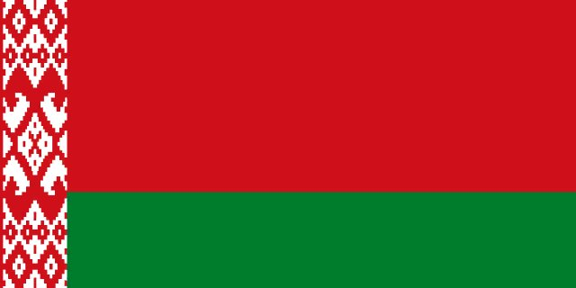{ loading=lazy }

The flag of Belarus has red and green horizontal stripes with beautiful traditional patterns on the side. Belarus is Poland's neighbor.

- Rationale: Learning neighboring countries helps kids understand regional geography
- Type: Concept
- Subjects: Geography, Culture
- Year: 1995
- Country: International
- Topics: [Poland Countries](../topics/index.md#poland_countries_around)
- Image credit: CC0
- Quests: [The neighbors of Poland (pl_00)](../quest/pl_00.md)

---

### Flag of Belgium
{ loading=lazy }

The flag of Belgium has three vertical stripes: black, yellow, and red. Belgium is famous for chocolate and waffles!

- Rationale: Belgium's unique vertical stripes help kids distinguish different flag patterns
- Type: Concept
- Subjects: Geography, Culture
- Year: 1831
- Country: International
- Topics: [Flags of Europe](../topics/index.md#flags_euroe), [Countries around France](../topics/index.md#france_countries_around)
- Image credit: CC0
- Quests: [The neighbors of France (fr_00)](../quest/fr_00.md)

---

### Flag of Czech Republic
{ loading=lazy }

The flag has white and red stripes with a blue triangle. The Czech Republic is famous for beautiful Prague castle and crystal glass.

- Rationale: Central European countries help kids understand the region around Poland
- Type: Concept
- Subjects: Geography, Culture
- Year: 1920
- Country: International
- Topics: [Flags of Europe](../topics/index.md#flags_euroe), [Poland Countries](../topics/index.md#poland_countries_around)
- Image credit: CC0
- Quests: [The neighbors of France (fr_00)](../quest/fr_00.md), [The neighbors of Poland (pl_00)](../quest/pl_00.md)

---

### Flag of Lithuania
{ loading=lazy }

The flag has yellow, green, and red horizontal stripes. Lithuania is a Baltic country with beautiful forests and beaches.

- Rationale: Baltic countries teach kids about northern European geography and Poland's neighbors
- Type: Concept
- Subjects: Geography, Culture
- Year: 1988
- Country: International
- Topics: [Poland Countries](../topics/index.md#poland_countries_around)
- Image credit: CC0
- Quests: [The neighbors of Poland (pl_00)](../quest/pl_00.md)

---

### Flag of Luxembourg
{ loading=lazy }

The flag of Luxembourg has red, white, and light blue horizontal stripes. Luxembourg is a very small country that speaks three languages!

- Rationale: Small multilingual countries teach kids about European diversity
- Type: Concept
- Subjects: Geography, Culture
- Year: 1972
- Country: International
- Topics: [Flags of Europe](../topics/index.md#flags_euroe), [Countries around France](../topics/index.md#france_countries_around)
- Image credit: CC0
- Quests: [The neighbors of France (fr_00)](../quest/fr_00.md)

---

### Flag of Russia
{ loading=lazy }

A flag with white, blue, and red stripes. It represents the country of Russia.

- Type: Concept
- Subjects: Community, Culture
- Country: International
- Topics: [Poland Countries](../topics/index.md#poland_countries_around)
- Image credit: CC0
- Quests: [The neighbors of Poland (pl_00)](../quest/pl_00.md)

---

### Flag of Slovakia
{ loading=lazy }

A flag with white, blue, and red colors. It represents the country of Slovakia.

- Type: Concept
- Subjects: Community, Culture
- Country: International
- Topics: [Flags of Europe](../topics/index.md#flags_euroe), [Poland Countries](../topics/index.md#poland_countries_around)
- Image credit: CC0
- Quests: [The neighbors of France (fr_00)](../quest/fr_00.md), [The neighbors of Poland (pl_00)](../quest/pl_00.md)

---

### Flag of Switzerland
{ loading=lazy }

The flag of Switzerland is red with a white cross in the middle. It looks like a first aid kit! Switzerland is famous for mountains and cheese.

- Rationale: The Swiss flag's unique cross design helps kids remember this mountain country
- Type: Concept
- Subjects: Geography, Culture
- Year: 1889
- Country: International
- Topics: [Flags of Europe](../topics/index.md#flags_euroe), [Countries around France](../topics/index.md#france_countries_around)
- Image credit: CC0
- Quests: [The neighbors of France (fr_00)](../quest/fr_00.md)

---

### Flag of Ukraine
{ loading=lazy }

A flag with blue and yellow colors like the sky and sun. It represents the country of Ukraine.

- Type: Concept
- Subjects: Community, Culture
- Country: International
- Topics: [Flags of Europe](../topics/index.md#flags_euroe), [Poland Countries](../topics/index.md#poland_countries_around)
- Image credit: CC0
- Quests: [The neighbors of France (fr_00)](../quest/fr_00.md), [The neighbors of Poland (pl_00)](../quest/pl_00.md)

---

### Flour
{ loading=lazy }

White powder made from wheat that is used to make bread.

- Type: Object
- Subjects: Food, Science
- Country: International
- Topics: [Baguette](../topics/index.md#baguette)
- Image credit: CC0

---

### food_apple
{ loading=lazy }

No translation found for 'food_apple.desc' in Cards

- Type: Object
- Country: International
- Image credit: CC0 | [source](https://commons.wikimedia.org/wiki/File:Red_Apple.jpg)
- Quests: [The Zoo (pl_04)](../quest/pl_04.md)

---

### food_banana
{ loading=lazy }

No translation found for 'food_banana.desc' in Cards

- Type: Object
- Country: International
- Image credit: CC0 | [source](https://commons.wikimedia.org/wiki/File:Banana_on_whitebackground.jpg)
- Quests: [The Zoo (pl_04)](../quest/pl_04.md)

---

### Football (Soccer)
{ loading=lazy }

A team game played with a ball you kick.

- Type: Object
- Subjects: Sport, Recreation, Community
- Country: International
- Image credit: CC_BY_SA | Clément Bucco-Lechat | [source](https://commons.wikimedia.org/wiki/File:Algérie_-_Arménie_-_20140531_-_Yacine_Brahimi_(Alg)_face_à_Taron_Voskanyan_(Arm).jpg)
- Quests: [Discover Warszawa (pl_01)](../quest/pl_01.md)

---

### Footbridges
{ loading=lazy }

Small bridges for people walking. They keep you safe from traffic.

- Type: Place
- Subjects: Geography, Environment
- Country: International
- Topics: [Seine Bridges](../topics/index.md#seine_bridges)
- Image credit: CC0
- Quests: [Paris Seine (fr_10)](../quest/fr_10.md)

---

### French School Poster
{ loading=lazy }

A big picture with information that hangs on classroom walls in French schools.

- Type: Object
- Subjects: Education
- Country: International
- Image credit: CC0
- Quests: [Jules Verne and transportation (fr_03)](../quest/fr_03.md)

---

### French Schools
In France, school happens in four main steps: maternelle (play-and-learn for little kids), école élémentaire (reading, writing, maths), collège (middle school), and lycée (high school). At the end of lycée, many students take a big exam called the baccalauréat (‘le bac’)

- Type: Concept
- Subjects: Education, Civics, Culture
- Country: International
- Topics: [French School](../topics/index.md#frenchschool)

---

### Ginger
{ loading=lazy }

A spicy root used in cooking and cookies.

- Type: Object
- Subjects: Food, Plant
- Country: International
- Topics: [Gingerbread](../topics/index.md#gingerbread)
- Image credit: CC0 | Franz Eugen Köhler, Köhler's Medizinal-Pflanzen | [source](https://commons.wikimedia.org/wiki/File:Koeh-146-no_text.jpg)
- Quests: [Gingerbread & food market (pl_06)](../quest/pl_06.md)

---

### Gingerbread Mold
{ loading=lazy }

A shaped tool that makes fun cookie shapes.

- Type: Object
- Subjects: Food, Art
- Country: International
- Topics: [Gingerbread](../topics/index.md#gingerbread)
- Image credit: CC_BY_SA | Piotr Kuczyński | [source](https://commons.wikimedia.org/wiki/File:Traditional_gingerbread_mold_2_(Piotr_Kuczynski).jpg)
- Quests: [Gingerbread & food market (pl_06)](../quest/pl_06.md)

---

### Giraffe
{ loading=lazy }

A very tall animal with a long neck. Giraffes are taller than trees! They eat leaves that other animals cannot reach.

- Rationale: Giraffes are fascinating animals that show kids how nature adapts to find food
- Type: Object
- Subjects: Animal, Environment
- Country: International
- Topics: [Zoo Animals](../topics/index.md#zoo)
- Image credit: CC0

---

### Glacier
{ loading=lazy }

Slow-moving ice found on high mountains.

- Type: Concept
- Subjects: Geography, Science, Environment
- Country: International
- Image credit: CC_BY | Kelvinsong | [source](https://commons.wikimedia.org/wiki/File:Glacier_diagram.svg)
- Quests: [Mont Blanc & Mountains (fr_08)](../quest/fr_08.md)

---

### Gloves
{ loading=lazy }

Warm covers for your hands.

- Type: Object
- Subjects: Health, Safety, Weather
- Country: International
- Topics: [mountain tools](../topics/index.md#mountain_tools)
- Image credit: CC_BY_SA | Kippelboy | [source](https://commons.wikimedia.org/wiki/File:Centre_de_Documentació_Museu_Tèxtil_de_Terrassa-_Reserves-_Teixits-_Guants002.JPG)
- Quests: [Mont Blanc & Mountains (fr_08)](../quest/fr_08.md)

---

### Goal
{ loading=lazy }

The net you try to score into.

- Type: Object
- Subjects: Sport, Recreation
- Country: International
- Image credit: CC_BY_SA | Dietmar Rabich | [source](https://commons.wikimedia.org/wiki/File:Dülmen,_Sportzentrum_Süd_--_2012_--_4121.jpg)
- Quests: [Discover Warszawa (pl_01)](../quest/pl_01.md)

---

### Greengrocer
{ loading=lazy }

A person who sells fresh fruit and vegetables.

- Type: Person
- Subjects: History, Culture
- Country: International
- Topics: [market traders](../topics/index.md#marketers)
- Image credit: CC0 | [source](https://commons.wikimedia.org/wiki/File:Barcelona_330DSC_0356_(49865911251).jpg)
- Quests: [The Colors of the Marseille Market (fr_09)](../quest/fr_09.md)

---

### Grocer
{ loading=lazy }

A person who sells many kinds of food and drinks.

- Type: Person
- Subjects: History, Culture
- Country: International
- Topics: [market traders](../topics/index.md#marketers)
- Image credit: CC0 | [source](https://commons.wikimedia.org/wiki/File:Mercado_del_Progreso_(7706491614).jpg)
- Quests: [The Colors of the Marseille Market (fr_09)](../quest/fr_09.md)

---

### Hat
{ loading=lazy }

A warm cap for your head.

- Type: Object
- Subjects: Health, Safety, Weather
- Country: International
- Topics: [mountain tools](../topics/index.md#mountain_tools)
- Image credit: CC0 | Michael Evans | [source](https://commons.wikimedia.org/wiki/File:Ronald_Reagan_with_cowboy_hat_12-0071M_edit.jpg)
- Quests: [Mont Blanc & Mountains (fr_08)](../quest/fr_08.md)

---

### Hiking
{ loading=lazy }

Walking on trails in nature.

- Type: Concept
- Subjects: Recreation, Sport, Environment
- Country: International
- Topics: [mountain activities](../topics/index.md#mountain_activities)
- Image credit: CC_BY_SA | Diego Delso | [source](https://commons.wikimedia.org/wiki/File:Roca_de_la_Ley,_Parque_Nacional_de_Þingvellir,_Suðurland,_Islandia,_2014-08-16,_DD_022.JPG)
- Quests: [Mont Blanc & Mountains (fr_08)](../quest/fr_08.md)

---

### Honey
{ loading=lazy }

A sweet food made by bees.

- Type: Object
- Subjects: Food, Animal
- Country: International
- Topics: [Gingerbread](../topics/index.md#gingerbread)
- Image credit: CC0 | John Severns (Severnjc) | [source](https://commons.wikimedia.org/wiki/File:European_honey_bee_extracts_nectar.jpg)
- Quests: [Gingerbread & food market (pl_06)](../quest/pl_06.md)

---

### Ice
{ loading=lazy }

Frozen water that can be very slippery.

- Type: Concept
- Subjects: Weather, Environment, Science
- Country: International
- Topics: [mont blanc](../topics/index.md#mont_blanc)
- Image credit: CC_BY_SA | Andreas Tille | [source](https://commons.wikimedia.org/wiki/File:IceBlockNearJoekullsarlon.jpg)
- Quests: [Mont Blanc & Mountains (fr_08)](../quest/fr_08.md)

---

### ice_arctic
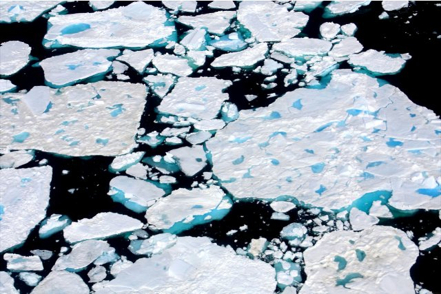{ loading=lazy }

No translation found for 'ice_arctic.desc' in Cards

- Type: Place
- Country: International
- Image credit: CC0 | [source](https://commons.wikimedia.org/wiki/File:Helicopter_View_(3978020016).jpg)
- Quests: [The Zoo (pl_04)](../quest/pl_04.md)

---

### Ile-de-France
{ loading=lazy }

A region in France where the capital city Paris is located. Many people live here!

- Type: Place
- Subjects: Geography, Environment
- Country: International
- Topics: [Notre Dame](../topics/index.md#notredame)
- Image credit: CC0
- Quests: [Paris! (fr_01)](../quest/fr_01.md)

---

### Independence Day (Poland)
{ loading=lazy }

A national holiday on 11 November.

- Type: Concept
- Subjects: Civics, History, Time
- Country: International
- Image credit: CC_BY_SA | Patryk Matyjaszczyk | [source](https://commons.wikimedia.org/wiki/File:Narodowe_Święto_Niepodległości_2012_01.JPG)
- Quests: [Discover Warszawa (pl_01)](../quest/pl_01.md)

---

### Iron
{ loading=lazy }

A hot tool used to make wrinkled clothes smooth and flat. Be careful, irons are very hot!

- Type: Object
- Subjects: Science
- Country: International
- Topics: [Eiffel Tower](../topics/index.md#eiffel-tower)
- Image credit: CC0

---

### King Sigismund’s Column
{ loading=lazy }

A tall column honoring King Sigismund in Castle Square.

- Type: Place
- Subjects: History, Culture
- Country: International
- Image credit: CC_BY_SA | Haydn Blackey from Cardiff, Wales | [source](https://commons.wikimedia.org/wiki/File:Column_of_King_Sigismund_III_Vasa_-_Warsaw_(53113393114).jpg)
- Quests: [Discover Warszawa (pl_01)](../quest/pl_01.md)

---

### King Sigismund’s Crown
{ loading=lazy }

The king’s crown that fell off and must be found.

- Type: Object
- Subjects: History, Culture
- Country: International
- Image credit: CC_BY_SA | Maciej Szczepańczyk | [source](https://commons.wikimedia.org/wiki/File:Sigismund_Augustus_King_of_Poland_and_Grand_Duke_of_Lithuania_incorporates_fiefdoms,_Duchies_of_Courland_and_Semigalia_into_the_Crown_1569.png)
- Quests: [Discover Warszawa (pl_01)](../quest/pl_01.md)

---

### Kitchen
{ loading=lazy }

A room where people cook and bake.

- Type: Place
- Subjects: Food
- Country: International
- Image credit: CC_BY_SA | Original:  Mithun Kunwar
Derivative work:  Radomianin | [source](https://commons.wikimedia.org/wiki/File:Grandmother_preparing_food_inside_traditional_kitchen_(edited).jpg)
- Quests: [Gingerbread & food market (pl_06)](../quest/pl_06.md)

---

### Kyiv
{ loading=lazy }

The capital city of Ukraine.

- Type: Place
- Subjects: Geography, Culture
- Country: International
- Image credit: CC_BY_SA | Moahim | [source](https://commons.wikimedia.org/wiki/File:2017_-_Київ_-_Світанок_над_Дніпром.jpg)

---

### Lemon
{ loading=lazy }

A yellow fruit that tastes very sour. Lemons are used to make lemonade!

- Type: Object
- Subjects: Food, Culture
- Country: International
- Topics: [Bouillabaisse](../topics/index.md#bouillabaisse)
- Image credit: CC0 | [source](https://commons.wikimedia.org/wiki/File:Lemon.jpg)
- Quests: [The Colors of the Marseille Market (fr_09)](../quest/fr_09.md)

---

### Leonardo da Vinci
{ loading=lazy }

An amazing artist and scientist from Italy. He painted the Mona Lisa and invented flying machines hundreds of years before airplanes!

- Type: Person
- Subjects: Art, Science, History
- Year: 1452
- Country: International
- Topics: [Louvre](../topics/index.md#louvre)
- Image credit: CC0

---

### Line
{ loading=lazy }

A straight mark that goes from one point to another. Lines can be long or short.

- Type: Concept
- Subjects: Math
- Country: International
- Topics: [Elementary Math](../topics/index.md#elementary-maths)
- Image credit: CC0 | [source](https://commons.wikimedia.org/wiki/File:Squaring_the_circle_a_history_of_the_problem_%281913%29_-_illustration_-_page_29_fig_9.png)
- Quests: [The School system (fr_02)](../quest/fr_02.md)

---

### Lion
{ loading=lazy }

A big cat called the king of animals. It lives in groups called prides.

- Type: Object
- Subjects: Animal, Environment
- Country: International
- Topics: [Zoo Animals](../topics/index.md#zoo)
- Image credit: CC0
- Quests: [The Zoo (pl_04)](../quest/pl_04.md)

---

### Lion Cub
{ loading=lazy }

No translation found for 'animal_lion_cub.desc' in Cards

- Type: Object
- Country: International
- Image credit: CC0 | [source](https://commons.wikimedia.org/wiki/File:Lion_cub_in_Masai_Mara_National_Park.jpg)
- Quests: [The Zoo (pl_04)](../quest/pl_04.md)

---

### Lithuania
{ loading=lazy }

A country in Europe. Capital is Vilnius.

- Type: Place
- Subjects: Geography, Culture
- Country: International
- Topics: [Poland Countries](../topics/index.md#poland_countries_around)
- Image credit: CC_BY_SA | Diliff | [source](https://commons.wikimedia.org/wiki/File:Vilnius_Modern_Skyline_At_Dusk,_Lithuania_-_Diliff.jpg)

---

### Luxembourg
{ loading=lazy }

A country in Europe. Capital is Luxembourg City.

- Type: Place
- Subjects: Geography, Culture
- Country: International
- Topics: [Countries around France](../topics/index.md#france_countries_around)
- Image credit: CC_BY_SA | Cayambe | [source](https://commons.wikimedia.org/wiki/File:Luxembourg_Pfaffenthal_Alzette_Béinchen_01.jpg)

---

### Luxembourg City
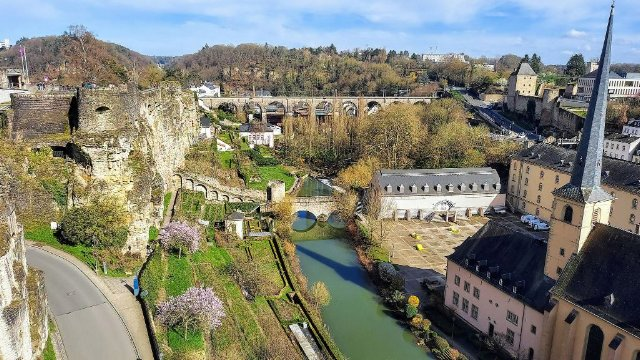{ loading=lazy }

The capital city of Luxembourg.

- Type: Place
- Subjects: Geography, Culture
- Country: International
- Image credit: CC_BY_SA | Krzysztof Golik | [source](https://commons.wikimedia.org/wiki/File:City_Hall_of_Luxembourg_City_01.jpg)

---

### Maria Skłodowska‑Curie
{ loading=lazy }

A scientist who won two Nobel Prizes.

- Type: Person
- Subjects: Science, History
- Country: International
- Image credit: CC0 | Henri Manuel | [source](https://commons.wikimedia.org/wiki/File:Marie_Curie_c._1920s.jpg)
- Quests: [Discover Warszawa (pl_01)](../quest/pl_01.md)

---

### Market traders
People who sell food and goods at market stalls—like fishmongers, cheesemongers, and fruit sellers. They weigh, wrap, and call out today’s prices.

- Type: Person
- Subjects: Money, Community
- Country: International
- Topics: [market traders](../topics/index.md#marketers)

---

### Marmot
{ loading=lazy }

A furry mountain animal that whistles.

- Type: Object
- Subjects: Animal, Environment, Science
- Country: International
- Image credit: CC_BY_SA | Photography captured by Giles Laurent | [source](https://commons.wikimedia.org/wiki/File:071_Wild_marmot_at_Grand_Muveran_Nature_Reserve_Photo_by_Giles_Laurent.jpg)
- Quests: [Mont Blanc & Mountains (fr_08)](../quest/fr_08.md)

---

### Mazurek Dąbrowskiego
{ loading=lazy }

Poland’s national anthem.

- Type: Concept
- Subjects: Music, History, Culture
- Country: International
- Image credit: CC0 | Józef Wybicki (1747–1822) | [source](https://commons.wikimedia.org/wiki/File:Mazurek_Dąbrowskiego_manuscript.jpg)
- Quests: [Discover Warszawa (pl_01)](../quest/pl_01.md)

---

### Medieval Market
{ loading=lazy }

An old-style market where people buy and sell goods.

- Type: Place
- Subjects: History, Culture, Community
- Country: International
- Image credit: CC_BY_SA | Axel Cotón Gutiérrez | [source](https://commons.wikimedia.org/wiki/File:Feria_Medieval_de_Hämeenlinna_2007_(Horse_Fighting).jpg)
- Quests: [Gingerbread & food market (pl_06)](../quest/pl_06.md)

---

### Mermaid’s Sword
{ loading=lazy }

The mermaid’s sword that must be returned.

- Type: Object
- Subjects: Culture, History
- Country: International
- Image credit: CC_BY_SA | Guillaume Speurt from Vilnius, Lithuania | [source](https://commons.wikimedia.org/wiki/File:Mermaid_statue_with_sword_(8121475992).jpg)
- Quests: [Discover Warszawa (pl_01)](../quest/pl_01.md)

---

### Milk
{ loading=lazy }

A white drink that comes from cows. Milk helps your bones and teeth grow strong!

- Type: Object
- Subjects: Food, Culture
- Country: International
- Topics: [Bouillabaisse](../topics/index.md#bouillabaisse)
- Image credit: CC0 | [source](https://commons.wikimedia.org/wiki/File:Milchflasche_%2812337400564%29.jpg)
- Quests: [The Colors of the Marseille Market (fr_09)](../quest/fr_09.md)

---

### Minsk
{ loading=lazy }

The capital city of Belarus.

- Type: Place
- Subjects: Geography, Culture
- Country: International
- Image credit: CC0 | Dzmitry Rylko | [source](https://commons.wikimedia.org/wiki/File:Minsk,_Belarus,_Serebryanka.jpg)

---

### Monkey
{ loading=lazy }

A smart animal that can climb and play. Some monkeys live in big families.

- Type: Object
- Subjects: Animal, Environment
- Country: International
- Topics: [Zoo Animals](../topics/index.md#zoo)
- Image credit: CC0
- Quests: [The Zoo (pl_04)](../quest/pl_04.md)

---

### Mont Blanc
{ loading=lazy }

The highest mountain in Western Europe. Covered in snow all year.

- Type: Place
- Subjects: Geography, Environment
- Country: International
- Topics: [mont blanc](../topics/index.md#mont_blanc)
- Image credit: CC0

---

### Moscow
{ loading=lazy }

The capital city of Russia.

- Type: Place
- Subjects: Geography, Culture
- Country: International
- Image credit: CC_BY_SA | Dmitry A. Mottl (cropped by King of Hearts) | [source](https://commons.wikimedia.org/wiki/File:Moscow_State_University_crop.jpg)

---

### Mountain
{ loading=lazy }

The pillars of earth

- Type: Concept
- Subjects: Environment, Education
- Country: International
- Topics: [mont blanc](../topics/index.md#mont_blanc), [mountain activities](../topics/index.md#mountain_activities), [mountain tools](../topics/index.md#mountain_tools)
- Image credit: CC_BY | Vyacheslav Argenberg | [source](https://commons.wikimedia.org/wiki/File:Himalayas,_Ama_Dablam,_Nepal.jpg)
- Quests: [Mont Blanc & Mountains (fr_08)](../quest/fr_08.md)

---

### Mountain Guide
{ loading=lazy }

A person who helps people climb safely.

- Type: Person
- Subjects: Community, Safety, Education
- Country: International
- Topics: [mont blanc](../topics/index.md#mont_blanc), [mountain activities](../topics/index.md#mountain_activities)
- Image credit: CC_BY | Vyacheslav Argenberg | [source](https://commons.wikimedia.org/wiki/File:Zagedan_Lakes,_Mountaineer,_Mountain_guide,_Caucasus_Mountains,_Karachay-Cherkessia.jpg)
- Quests: [Mont Blanc & Mountains (fr_08)](../quest/fr_08.md)

---

### National Stadium (Warsaw)
{ loading=lazy }

A modern stadium for football games and concerts.

- Type: Place
- Subjects: Sport, Culture, Community
- Country: International
- Image credit: CC_BY_SA | Arne Müseler | [source](https://commons.wikimedia.org/wiki/File:National_Stadium_Warsaw_aerial_view_2.jpg)
- Quests: [Discover Warszawa (pl_01)](../quest/pl_01.md)

---

### Nicolaus Copernicus Monument (Warsaw)
{ loading=lazy }

A monument to the astronomer Nicolaus Copernicus.

- Type: Place
- Subjects: Science, History, Culture
- Country: International
- Image credit: CC_BY_SA | Rhododendrites | [source](https://commons.wikimedia.org/wiki/File:Staszic_Palace_(22226p).jpg)
- Quests: [Discover Warszawa (pl_01)](../quest/pl_01.md)

---

### Olive oil
{ loading=lazy }

A special oil made from olives. People use it for cooking tasty food.

- Type: Object
- Subjects: Food, Culture
- Country: International
- Topics: [Bouillabaisse](../topics/index.md#bouillabaisse)
- Image credit: CC0 | [source](https://commons.wikimedia.org/wiki/File:Oliven_V1.jpg)
- Quests: [The Colors of the Marseille Market (fr_09)](../quest/fr_09.md)

---

### Orange
{ loading=lazy }

A round, orange fruit that tastes sweet and juicy. Oranges have lots of vitamin C!

- Type: Object
- Subjects: Food, Culture
- Country: International
- Topics: [Bouillabaisse](../topics/index.md#bouillabaisse)
- Image credit: CC0 | [source](https://commons.wikimedia.org/wiki/File:Orange-Fruit-Pieces.jpg)
- Quests: [The Colors of the Marseille Market (fr_09)](../quest/fr_09.md)

---

### Palace of Culture and Science
{ loading=lazy }

A tall building for museums, theaters, and learning.

- Type: Place
- Subjects: Culture, Education, History
- Country: International
- Image credit: CC_BY_SA | A.Savin
- Quests: [Discover Warszawa (pl_01)](../quest/pl_01.md)

---

### Paris
{ loading=lazy }

The capital city of France. Paris has a famous tall tower called the Eiffel Tower!

- Type: Place
- Subjects: Geography, Culture
- Country: International
- Topics: [France country](../topics/index.md#france), [Baguette](../topics/index.md#baguette), [Eiffel Tower](../topics/index.md#eiffel-tower), [Louvre](../topics/index.md#louvre), [Notre Dame](../topics/index.md#notredame)
- Image credit: CC0 | Yann Caradec from Paris, France, CC BY-SA 2.0 <https://creativecommons.org/licenses/by-sa/2.0>, via Wikimedia Commons | [source](https://commons.wikimedia.org/wiki/File:La_Tour_Eiffel_vue_de_la_Tour_Saint-Jacques,_Paris_ao%C3%BBt_2014_(2).jpg)
- Quests: [Paris! (fr_01)](../quest/fr_01.md)

---

### Penguin
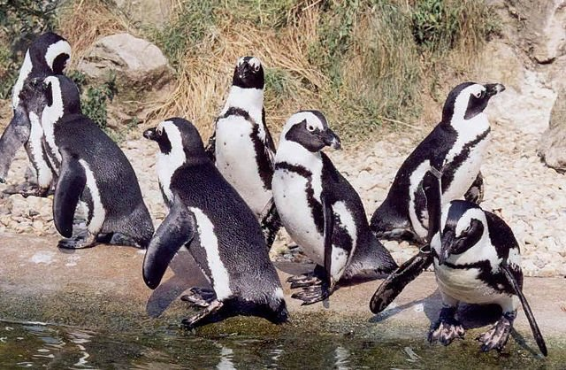{ loading=lazy }

A bird that cannot fly but swims very well. It lives in cold places.

- Type: Object
- Subjects: Animal, Environment
- Country: International
- Topics: [Zoo Animals](../topics/index.md#zoo)
- Image credit: CC0
- Quests: [The Zoo (pl_04)](../quest/pl_04.md)

---

### Pepper Salt
{ loading=lazy }

Spices that make food taste better. Salt is white and pepper is black with tiny pieces.

- Type: Object
- Subjects: Food, Culture
- Country: International
- Topics: [Bouillabaisse](../topics/index.md#bouillabaisse)
- Image credit: CC0 | [source](https://commons.wikimedia.org/wiki/File:Salt_and_Pepper_Shakers_%284572668303%29.jpg)
- Quests: [The Colors of the Marseille Market (fr_09)](../quest/fr_09.md)

---

### plant_apple
{ loading=lazy }

No translation found for 'plant_apple.desc' in Cards

- Type: Object
- Country: International
- Image credit: CC0 | [source](https://commons.wikimedia.org/wiki/File:Tree_with_red_apples_in_Barkedal_4.jpg)
- Quests: [The Zoo (pl_04)](../quest/pl_04.md)

---

### plant_banana
{ loading=lazy }

No translation found for 'plant_banana.desc' in Cards

- Type: Object
- Country: International
- Image credit: CC0 | [source](https://commons.wikimedia.org/wiki/File:Musa_JPG01.jpg)
- Quests: [The Zoo (pl_04)](../quest/pl_04.md)

---

### plant_orange
{ loading=lazy }

No translation found for 'plant_orange.desc' in Cards

- Type: Object
- Country: International
- Image credit: CC0 | [source](https://commons.wikimedia.org/wiki/File:Citrus_sinensis_JPG01.jpg)
- Quests: [The Zoo (pl_04)](../quest/pl_04.md)

---

### plant_wattle
{ loading=lazy }

No translation found for 'tree_wattle.desc' in Cards

- Type: Object
- Country: International
- Image credit: CC0 | [source](https://commons.wikimedia.org/wiki/File:Acacia_sp._(51489535138).jpg)
- Quests: [The Zoo (pl_04)](../quest/pl_04.md)

---

### Poland
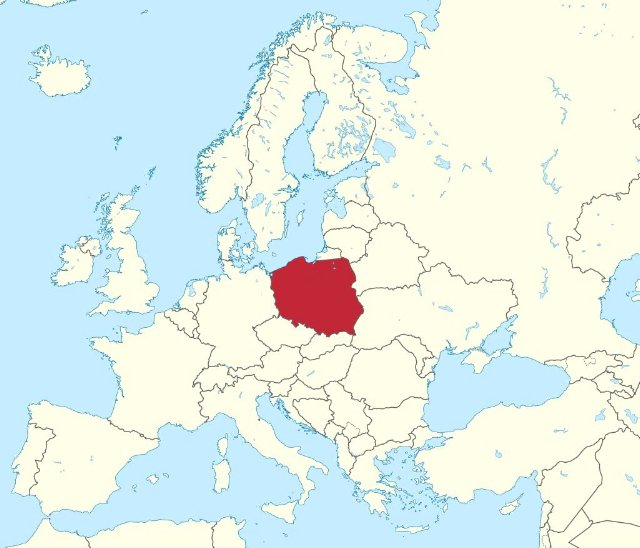{ loading=lazy }

A country in Europe. Capital is Warsaw. Poland is famous for scientists like Copernicus and delicious pierogi!

- Type: Place
- Subjects: Geography, Culture
- Country: International
- Topics: [Poland country](../topics/index.md#poland), [Poland Countries](../topics/index.md#poland_countries_around)
- Image credit: CC_BY_SA | Diego Delso | [source](https://commons.wikimedia.org/wiki/File:Basílica_de_Nuestra_Señora_de_Licheń,_Stary_Licheń,_Polonia,_2016-12-21,_DD_39-41_HDR.jpg)

---

### Polish Houses of Parliament
{ loading=lazy }

Where laws are made: the Sejm and the Senate.

- Type: Place
- Subjects: Civics, History, Geography
- Country: International
- Image credit: CC0
- Quests: [Discover Warszawa (pl_01)](../quest/pl_01.md)

---

### Prague
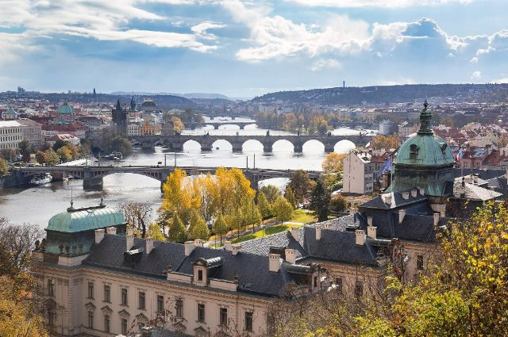{ loading=lazy }

The capital city of Czech Republic.

- Type: Place
- Subjects: Geography, Culture
- Country: International
- Image credit: CC_BY_SA | Dmitry A. Mottl | [source](https://commons.wikimedia.org/wiki/File:Vltava_river_in_Prague.jpg)

---

### President
{ loading=lazy }

The leader chosen to guide the country. People vote in elections.

- Type: Person
- Subjects: History, Culture
- Country: International
- Image credit: CC0 | Aaron Shikler | [source](https://commons.wikimedia.org/wiki/File:John_F_Kennedy_Official_Portrait.jpg)

---

### Presidential Palace
{ loading=lazy }

The official home of the President of Poland.

- Type: Place
- Subjects: Civics, History, Culture
- Country: International
- Image credit: CC_BY_SA | Rhododendrites | [source](https://commons.wikimedia.org/wiki/File:Warsaw_Presidential_Palace_(22248p).jpg)
- Quests: [Discover Warszawa (pl_01)](../quest/pl_01.md)

---

### River boat
{ loading=lazy }

A boat that travels on rivers. Rivers are like roads made of water!

- Type: Place
- Subjects: Geography, Environment
- Country: International
- Topics: [Seine Bridges](../topics/index.md#seine_bridges)
- Image credit: CC0
- Quests: [Paris Seine (fr_10)](../quest/fr_10.md)

---

### Robert Lewandowski
{ loading=lazy }

A famous Polish football player.

- Type: Person
- Subjects: Sport, Culture
- Country: International
- Image credit: CC_BY_SA | Екатерина Лаут | [source](https://commons.wikimedia.org/wiki/File:Robert_Lewandowski_2018_(cropped).jpg)
- Quests: [Discover Warszawa (pl_01)](../quest/pl_01.md)

---

### Rope
{ loading=lazy }

A strong line used for safety when climbing.

- Type: Object
- Subjects: Safety, Technology, Sport
- Country: International
- Topics: [mountain tools](../topics/index.md#mountain_tools)
- Image credit: CC_BY_SA | Nevit Dilmen | [source](https://commons.wikimedia.org/wiki/File:Coiled_rope_03235.jpg)
- Quests: [Mont Blanc & Mountains (fr_08)](../quest/fr_08.md)

---

### Royal Castle (Warsaw)
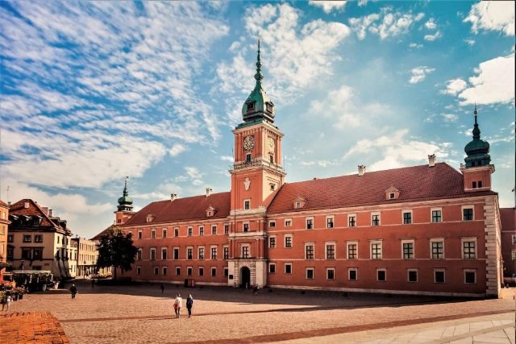{ loading=lazy }

A historic castle of Polish kings, now a museum.

- Type: Place
- Subjects: History, Culture, Geography
- Country: International
- Image credit: CC0 | Bernardo Bellotto | [source](https://commons.wikimedia.org/wiki/File:Bernardo_Bellotto_-_View_of_Warsaw_from_the_Royal_Castle_-_Google_Art_Project.jpg)
- Quests: [Discover Warszawa (pl_01)](../quest/pl_01.md)

---

### Ruler
{ loading=lazy }

A straight tool used to measure how long things are. Rulers have numbers and lines.

- Type: Object
- Subjects: Math
- Country: International
- Topics: [Elementary Math](../topics/index.md#elementary-maths)
- Image credit: CC0 | [source](https://commons.wikimedia.org/wiki/File:Righello.jpg)
- Quests: [The School system (fr_02)](../quest/fr_02.md)

---

### Russia
{ loading=lazy }

A country in Europe. Capital is Moscow.

- Type: Place
- Subjects: Geography, Culture
- Country: International
- Topics: [Poland Countries](../topics/index.md#poland_countries_around)
- Image credit: CC_BY_SA | Canes | [source](https://commons.wikimedia.org/wiki/File:Мечеть_Санкт-Петербурга._Майолика_портала.jpg)

---

### SALT
{ loading=lazy }

White crystals that make food taste better. 

- Type: Object
- Subjects: Food, Culture
- Country: International
- Topics: [Baguette](../topics/index.md#baguette)
- Image credit: CC0

---

### Scarf
{ loading=lazy }

A warm cloth you wear around your neck.

- Type: Object
- Subjects: Health, Safety, Weather
- Country: International
- Topics: [mountain tools](../topics/index.md#mountain_tools)
- Image credit: CC_BY_SA | Kritzolina | [source](https://commons.wikimedia.org/wiki/File:Colored_silk_scarf_from_India_01.jpg)
- Quests: [Mont Blanc & Mountains (fr_08)](../quest/fr_08.md)

---

### School bag
{ loading=lazy }

A bag that students use to carry their books, pencils, and homework to school.

- Type: Object
- Subjects: Science
- Country: International
- Image credit: CC0
- Quests: [The School system (fr_02)](../quest/fr_02.md)

---

### Skiing
{ loading=lazy }

Sliding on snow with skis.

- Type: Concept
- Subjects: Sport, Recreation
- Country: International
- Topics: [mountain activities](../topics/index.md#mountain_activities)
- Image credit: CC_BY | Letartean | [source](https://commons.wikimedia.org/wiki/File:Quebec_Sprint_Cross-country_Skiing_World_Cup_2012_(4)_V2.jpg)
- Quests: [Mont Blanc & Mountains (fr_08)](../quest/fr_08.md)

---

### Slovakia
{ loading=lazy }

A country in Europe. Capital is Bratislava.

- Type: Place
- Subjects: Geography, Culture
- Country: International
- Topics: [Poland Countries](../topics/index.md#poland_countries_around)
- Image credit: CC_BY_SA | Oto Zapletal | [source](https://commons.wikimedia.org/wiki/File:Suspension_pedestrian_bridge_over_the_Orava_River_in_Dolny_Kubín,_the_Slovak_republic_01.jpg)

---

### Snow
{ loading=lazy }

Frozen water that falls in cold weather.

- Type: Concept
- Subjects: Weather, Environment, Science
- Country: International
- Topics: [mont blanc](../topics/index.md#mont_blanc)
- Image credit: CC_BY_SA | Psy guy | [source](https://commons.wikimedia.org/wiki/File:Snow_Scene_at_Shipka_Pass_1.JPG)
- Quests: [Mont Blanc & Mountains (fr_08)](../quest/fr_08.md)

---

### Soccer Field
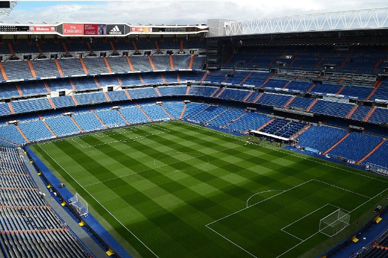{ loading=lazy }

The grass field where football is played.

- Type: Place
- Subjects: Sport, Recreation, Community
- Country: International
- Image credit: CC_BY_SA | لا روسا | [source](https://commons.wikimedia.org/wiki/File:Santiagobernabeupanoramav45.JPG)
- Quests: [Discover Warszawa (pl_01)](../quest/pl_01.md)

---

### Space Rocket
{ loading=lazy }

A rocket that goes into space.

- Type: Object
- Subjects: Science
- Country: International
- Topics: [Jules Verne](../topics/index.md#jules_verne)
- Image credit: CC0
- Quests: [Jules Verne and transportation (fr_03)](../quest/fr_03.md)

---

### Square
{ loading=lazy }

A triangle-shaped tool used to draw straight lines and right angles in math.

- Type: Object
- Subjects: Math
- Country: International
- Topics: [Elementary Math](../topics/index.md#elementary-maths)
- Image credit: CC0 | [source](https://commons.wikimedia.org/wiki/File:Squadra_45.jpg)
- Quests: [The School system (fr_02)](../quest/fr_02.md)

---

### STOP Sign
{ loading=lazy }

A red sign that means you must stop your vehicle.

- Type: Object
- Subjects: Safety, Transportation
- Country: International
- Topics: [Stree safety](../topics/index.md#street-safety)
- Image credit: CC0

---

### Street Safety
Rules that keep everyone safe on the road.

- Type: Concept
- Subjects: Transportation, Civics, Health
- Country: International
- Topics: [Stree safety](../topics/index.md#street-safety)

---

### Summit
{ loading=lazy }

The very top of a mountain.

- Type: Concept
- Subjects: Geography, Environment, Education
- Country: International
- Topics: [mont blanc](../topics/index.md#mont_blanc)
- Image credit: CC_BY | Mountaineer | [source](https://commons.wikimedia.org/wiki/File:Summitting_Island_Peak.jpg)
- Quests: [Mont Blanc & Mountains (fr_08)](../quest/fr_08.md)

---

### Sun
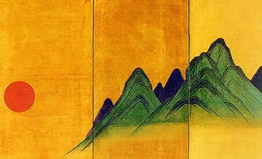{ loading=lazy }

Bright light that can reflect on the snow.

- Type: Concept
- Subjects: Science, Weather, Environment
- Country: International
- Image credit: CC0 | NASA/SDO (AIA) | [source](https://commons.wikimedia.org/wiki/File:The_Sun_by_the_Atmospheric_Imaging_Assembly_of_NASA's_Solar_Dynamics_Observatory_-_20100819.jpg)
- Quests: [Mont Blanc & Mountains (fr_08)](../quest/fr_08.md)

---

### Sunglasses
{ loading=lazy }

Glasses that protect your eyes from bright light.

- Type: Object
- Subjects: Health, Safety, Weather
- Country: International
- Topics: [mountain tools](../topics/index.md#mountain_tools)
- Image credit: CC_BY_SA | Sofiane mohammed amri | [source](https://commons.wikimedia.org/wiki/File:2_الحداد.jpg)
- Quests: [Mont Blanc & Mountains (fr_08)](../quest/fr_08.md)

---

### Switzerland
{ loading=lazy }

A country in Europe. Capital is Bern. Switzerland is famous for mountains and cheese.

- Type: Place
- Subjects: Geography, Culture
- Country: International
- Topics: [Countries around France](../topics/index.md#france_countries_around)
- Image credit: CC_BY_SA | Giles Laurent | [source](https://commons.wikimedia.org/wiki/File:016_Wild_Golden_Eagle_in_flight_at_Pfyn-Finges_(Switzerland)_Photo_by_Giles_Laurent.jpg)

---

### Tomato
{ loading=lazy }

A red, round fruit that grows on plants. Tomatoes are used to make pizza sauce!

- Type: Object
- Subjects: Food, Culture
- Country: International
- Topics: [Bouillabaisse](../topics/index.md#bouillabaisse)
- Image credit: CC0 | [source](https://commons.wikimedia.org/wiki/File:Tomato_je.jpg)
- Quests: [The Colors of the Marseille Market (fr_09)](../quest/fr_09.md)

---

### Train
{ loading=lazy }

Trains carry people and goods fast across the country.

- Type: Object
- Subjects: Transportation
- Country: International
- Image credit: CC0

---

### Tram
{ loading=lazy }

A city train that runs on tracks in the street.

- Type: Object
- Subjects: Transportation, Technology, Community
- Country: International
- Image credit: CC_BY_SA | Chme82 | [source](https://commons.wikimedia.org/wiki/File:Flexity_Tram_Zürich_4001.jpg)
- Quests: [Discover Warszawa (pl_01)](../quest/pl_01.md)

---

### Triangle
{ loading=lazy }

A shape with three straight sides and three corners. Triangles look like pizza slices!

- Type: Concept
- Subjects: Math
- Country: International
- Topics: [Elementary Math](../topics/index.md#elementary-maths)
- Image credit: CC0 | [source](https://commons.wikimedia.org/wiki/File:Lobatchevski_-_La_Th%C3%A9orie_des_parall%C3%A8les,_1980_-_Fig-1-05.png)
- Quests: [The School system (fr_02)](../quest/fr_02.md)

---

### Ukraine
{ loading=lazy }

A country in Europe. Capital is Kyiv.

- Type: Place
- Subjects: Geography, Culture
- Country: International
- Image credit: CC_BY_SA | Misha Reme | [source](https://commons.wikimedia.org/wiki/File:Найкращі_миті_життя.jpg)

---

### Vilnius
{ loading=lazy }

The capital city of Lithuania.

- Type: Place
- Subjects: Geography, Culture
- Country: International
- Image credit: CC_BY_SA | Diliff | [source](https://commons.wikimedia.org/wiki/File:Vilnius_Modern_Skyline_At_Dusk,_Lithuania_-_Diliff.jpg)

---

### Wars and Sawa Statue
{ loading=lazy }

A statue showing the city’s legend about Wars and Sawa.

- Type: Place
- Subjects: Culture, History
- Country: International
- Image credit: CC_BY_SA | Wistula
- Quests: [Discover Warszawa (pl_01)](../quest/pl_01.md)

---

### Warsaw
{ loading=lazy }

The capital city of Poland.

- Type: Place
- Subjects: Geography, Culture
- Country: International
- Topics: [Poland country](../topics/index.md#poland)
- Image credit: CC_BY_SA | A.Savin | [source](https://commons.wikimedia.org/wiki/File:Warsaw_07-13_img29_View_from_Palace_of_Culture_and_Science.jpg)

---

### Water
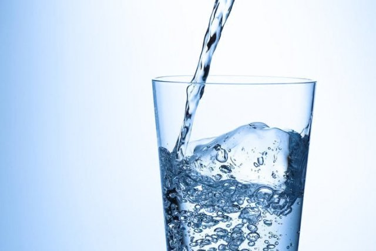{ loading=lazy }

Water is essential for all life

- Type: Object
- Subjects: Food, Culture
- Country: International
- Topics: [Baguette](../topics/index.md#baguette)
- Image credit: CC0

---

### Wind
{ loading=lazy }

Moving air that can feel strong in the mountains.

- Type: Concept
- Subjects: Weather, Environment
- Country: International
- Topics: [mont blanc](../topics/index.md#mont_blanc)
- Image credit: CC0 | Richardfabi | [source](https://commons.wikimedia.org/wiki/File:Windbuchencom.jpg)
- Quests: [Mont Blanc & Mountains (fr_08)](../quest/fr_08.md)

---

### Yeast
{ loading=lazy }

Yeast is like magic powder that makes bread soft and tasty!

- Type: Object
- Subjects: Food, Culture
- Country: International
- Topics: [Baguette](../topics/index.md#baguette)
- Image credit: CC0

---

### Young Lion Male
{ loading=lazy }

No translation found for 'animal_lion_young_male.desc' in Cards

- Type: Object
- Country: International
- Image credit: CC0 | [source](https://commons.wikimedia.org/wiki/File:Young_male_lion,_South_Luangwa_National_Park_(51871439313).jpg)
- Quests: [The Zoo (pl_04)](../quest/pl_04.md)

---

### Zoo Animals
Auto-created card for topic 'Zoo Animals'.

- Type: None
- Country: International
- Topics: [Zoo Animals](../topics/index.md#zoo)

---

### Złoty Coins
{ loading=lazy }

Polish money (złoty) shown as coins.

- Type: Object
- Subjects: Money, Geography
- Country: International
- Image credit: CC0 | Kaźmirz Stronczyński | [source](https://commons.wikimedia.org/wiki/File:Czerwony_złoty_gdański_1577r.jpg)
- Quests: [Discover Warszawa (pl_01)](../quest/pl_01.md)

## France

### 20000 Leagues Under the Sea
{ loading=lazy }

A book by Jules Verne about underwater adventures in a submarine called the Nautilus. You meet giant sea creatures!

- Type: Object
- Subjects: Literature
- Year: 1871
- Country: France
- Topics: [Jules Verne](../topics/index.md#jules_verne)
- Image credit: CC0
- Quests: [Jules Verne and transportation (fr_03)](../quest/fr_03.md)

---

### 24 Hours of Le Mans
{ loading=lazy }

A car race that lasts 24 hours. Teams drive day and night.

- Type: Concept
- Subjects: Sport, Culture, History
- Country: France
- Image credit: CC0

---

### A
{ loading=lazy }

A musical note.

- Type: Concept
- Subjects: Music, Education
- Country: France
- Topics: [Musical Notes](../topics/index.md#musical_notes)
- Image credit: CC_BY_SA | Basile Morin | [source](https://commons.wikimedia.org/wiki/File:Karst_peaks_and_green_paddy_fields_under_a_stormy_sky,_South_view_from_Mount_Nam_Xay,_Vang_Vieng,_Laos.jpg)

---

### Allons enfants
{ loading=lazy }

The first words of the anthem’s first line.

- Type: Object
- Subjects: Music, Education, Culture
- Country: France
- Topics: [marseillaise music](../topics/index.md#marseillaise_music)
- Image credit: CC0 | [source](https://commons.wikimedia.org/wiki/File:La_Marseillaise_chant_national_fran%C3%A7ais_de_Rouget_de_L%27Isle_Transcription_de_Langevin-2.jpg)
- Audio credit: PublicDomain | [source](https://commons.wikimedia.org/wiki/File:La_Marseillaise_(1914_Recording).ogg)
- Quests: [La Marseillaise (fr_11)](../quest/fr_11.md)

---

### Armor
{ loading=lazy }

Protective metal clothing for a knight.

- Type: Object
- Subjects: History, Safety
- Country: France
- Image credit: CC0 | [source](https://commons.wikimedia.org/wiki/File:Armor_MET_DP271145.jpg)

---

### Around the World in Eighty Days
{ loading=lazy }

An exciting book by Jules Verne about traveling around the whole world very quickly using trains, ships, and hot air balloons!

- Type: Object
- Subjects: Literature
- Year: 1873
- Country: France
- Topics: [Jules Verne](../topics/index.md#jules_verne)
- Image credit: CC0
- Quests: [Jules Verne and transportation (fr_03)](../quest/fr_03.md)

---

### Arrows
{ loading=lazy }

Sharp sticks shot from a bow.

- Type: Object
- Subjects: History, Technology
- Country: France
- Image credit: CC_BY | Julian Herzog (Website) | [source](https://commons.wikimedia.org/wiki/File:Red_Arrows_Formation_Duxford_Flying_Finale_2024_02.jpg)

---

### B
{ loading=lazy }

A musical note.

- Type: Concept
- Subjects: Music, Education
- Country: France
- Topics: [Musical Notes](../topics/index.md#musical_notes)
- Image credit: CC_BY_SA | Bureau international des poids et mesures, International Bureau of Weights and Measures (BIPM) | [source](https://commons.wikimedia.org/wiki/File:SI_Logo_with_defining_constants.png)

---

### Ballroom
{ loading=lazy }

A big room for dancing and music.

- Type: Place
- Subjects: Culture, History
- Country: France
- Words: 
- Image credit: CC_BY_SA | P e z i | [source](https://commons.wikimedia.org/wiki/File:Parkhotel_Schoenbrunn_Ballsaal_DSC_5115w.jpg)

---

### Bicycle
{ loading=lazy }

A vehicle with two wheels you pedal.

- Type: Object
- Subjects: Transportation, Health, Recreation
- Country: France
- Image credit: CC_BY_SA | Basile Morin | [source](https://commons.wikimedia.org/wiki/File:Parked_bicycle_with_graffitied_building_facade_and_doors_in_Amsterdam.jpg)

---

### Boatman
{ loading=lazy }

A person who rows the boat on the Loire.

- Type: Person
- Subjects: Community, Transportation
- Country: France
- Image credit: CC_BY | Vyacheslav Argenberg | [source](https://commons.wikimedia.org/wiki/File:Perhentian_Islands,_Boatman,_Malaysia.jpg)

---

### Bouillabaisse
{ loading=lazy }

A special fish soup from Marseille in southern France. It's made with many different types of fish and has a delicious smell!

- Type: Object
- Subjects: Food, Culture
- Year: 1700
- Country: France
- Topics: [Bouillabaisse](../topics/index.md#bouillabaisse)
- Image credit: CC0 | [source](https://www.pexels.com/photo/delicious-red-soup-on-table-17568746/)
- Quests: [The Colors of the Marseille Market (fr_09)](../quest/fr_09.md)

---

### Bow
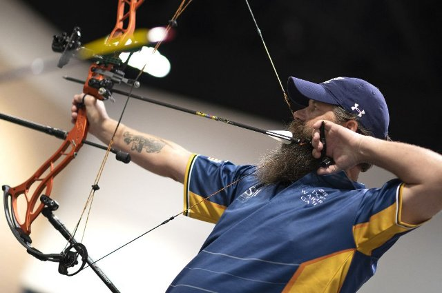{ loading=lazy }

A weapon that shoots arrows.

- Type: Object
- Subjects: History, Technology
- Country: France
- Image credit: CC0 | Harold Dean Carsey (1886-1947) | [source](https://commons.wikimedia.org/wiki/File:Clara_Bow,_grayscale.jpg)

---

### C
{ loading=lazy }

A musical note.

- Type: Concept
- Subjects: Music, Education
- Country: France
- Topics: [Musical Notes](../topics/index.md#musical_notes)
- Image credit: CC_BY_SA | BrownHairedGirl | [source](https://commons.wikimedia.org/wiki/File:Dominican_Republic_Ireland_Locator.png)

---

### Castle Chinon
{ loading=lazy }

Château de Chinon is a strong stone fortress on a hill above the river in the Loire Valley. Long ago, kings stayed here and Joan of Arc came to meet the future king of France.

- Type: Place
- Subjects: History
- Country: France
- Image credit: CC0
- Quests: [A tale of two castles (fr_05)](../quest/fr_05.md)

---

### Castle Facade (Windows)
{ loading=lazy }

A front wall with many large windows for light and views.

- Type: Concept
- Subjects: Culture, Technology
- Country: France
- Image credit: CC_BY_SA | Scotch Mist | [source](https://commons.wikimedia.org/wiki/File:Brzeg_Castle_03.jpg)

---

### Catapult
{ loading=lazy }

A machine that throws stones far.

- Type: Object
- Subjects: Technology, History
- Country: France
- Image credit: CC_BY_SA | Jacek Halicki | [source](https://commons.wikimedia.org/wiki/File:2023_Proca_neurobalistyczna.jpg)

---

### Cathedral
{ loading=lazy }

A very large and important church in a city.

- Type: Place
- Subjects: Culture, History, Education
- Country: France
- Image credit: CC_BY_SA | Richard Bartz, Munich aka Makro Freak | [source](https://commons.wikimedia.org/wiki/File:Svyato_Mihailovsky_Cathedral_Izhevsk_Russia_Richard_Bartz.jpg)
- Quests: [Paris! (fr_01)](../quest/fr_01.md)

---

### Charter of Secularism
{ loading=lazy }

A set of rules for respecting everyone's beliefs. It helps people live together in peace.

- Type: Concept
- Subjects: Community, Culture
- Year: 2013
- Country: France
- Topics: [French School](../topics/index.md#frenchschool)
- Image credit: CC0 | [source](https://camille-claudel.ecollege.haute-garonne.fr/le-college/charte-de-la-laicite/)
- Quests: [The School system (fr_02)](../quest/fr_02.md), [Jules Verne and transportation (fr_03)](../quest/fr_03.md)

---

### Church
{ loading=lazy }

A special building where people meet to pray and sing.

- Type: Place
- Subjects: Culture, Civics, Education
- Country: France
- Image credit: CC_BY_SA | King of Hearts | [source](https://commons.wikimedia.org/wiki/File:Stanford_Memorial_Church_May_2011_HDR_1.jpg)
- Quests: [Paris! (fr_01)](../quest/fr_01.md)

---

### Château de Chambord
{ loading=lazy }

A grand palace with many windows and gardens.

- Type: Place
- Subjects: History, Culture, Geography
- Country: France
- Image credit: CC_BY_SA | Benh LIEU SONG | [source](https://commons.wikimedia.org/wiki/File:Chambord_Castle_Northwest_facade.jpg)

---

### Château de Chinon
{ loading=lazy }

A strong stone fortress used for defense.

- Type: Place
- Subjects: History, Geography, Culture
- Country: France
- Image credit: CC_BY_SA | Benjamin Smith | [source](https://commons.wikimedia.org/wiki/File:Chinon_-_Château_vu_depuis_la_plage.jpg)

---

### Code of Hammurabi
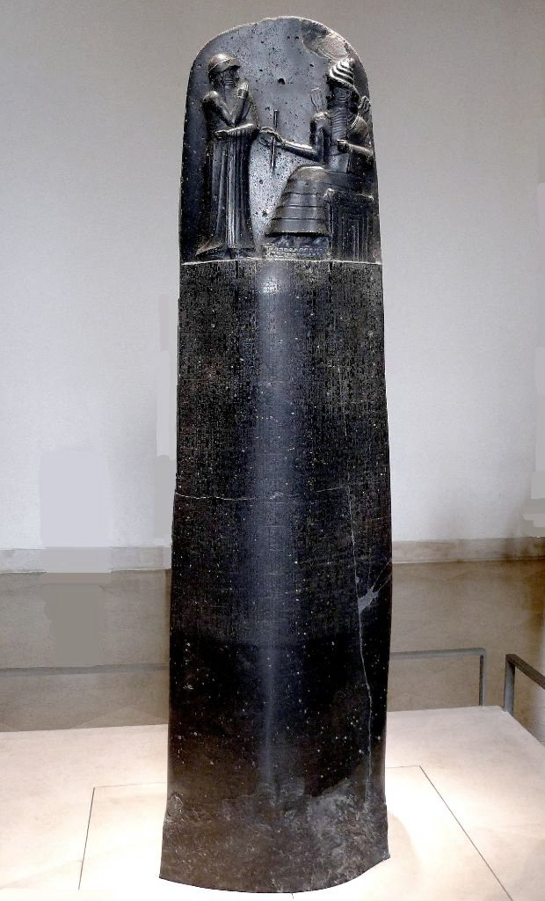{ loading=lazy }

A stone with very old laws carved into it.

- Type: Object
- Subjects: History, Civics
- Country: France
- Image credit: CC_BY | Mbzt | [source](https://commons.wikimedia.org/wiki/File:P1050763_Louvre_code_Hammurabi_face_rwk.JPG)
- Quests: [Paris! (fr_01)](../quest/fr_01.md)

---

### Collège in France
{ loading=lazy }

Middle school in France for kids aged 11 to 15. Students learn many subjects and prepare for high school.

- Rationale: Understanding the French school system helps kids compare education across countries
- Type: Concept
- Subjects: Education, Culture
- Year: 1975
- Country: France
- Topics: [French School](../topics/index.md#frenchschool)
- Image credit: CC0 | Marie Gaultier, CC BY-SA 4.0 <https://creativecommons.org/licenses/by-sa/4.0>, via Wikimedia Commons | [source](https://commons.wikimedia.org/wiki/File:Ecole_Sup%C3%A9rieure_d%27Agricultures.jpg)
- Quests: [The School system (fr_02)](../quest/fr_02.md), [Jules Verne and transportation (fr_03)](../quest/fr_03.md)

---

### Coronation of Napoleon (David)
{ loading=lazy }

A huge painting showing a French emperor’s ceremony.

- Type: Object
- Subjects: Art, History
- Country: France
- Image credit: CC0 | Jacques-Louis David / Georges Rouget | [source](https://commons.wikimedia.org/wiki/File:Jacques-Louis_David_-_The_Coronation_of_Napoleon_(1805-1807).jpg)
- Quests: [Paris! (fr_01)](../quest/fr_01.md)

---

### Cursive Writing
{ loading=lazy }

A special way of writing where all the letters in a word are connected. In France, children learn to write this way in school.

- Rationale: Cursive writing is an important part of French education and cultural identity
- Type: Concept
- Subjects: Education, Culture, Art
- Year: 1800
- Country: France
- Topics: [French School](../topics/index.md#frenchschool)
- Image credit: CC0 | [source](https://commons.wikimedia.org/wiki/File:BlackBoard_(Blender_classroom_demo).png)
- Quests: [The School system (fr_02)](../quest/fr_02.md)

---

### D
{ loading=lazy }

A musical note.

- Type: Concept
- Subjects: Music, Education
- Country: France
- Topics: [Musical Notes](../topics/index.md#musical_notes)
- Image credit: CC_BY_SA | Youlaus | [source](https://commons.wikimedia.org/wiki/File:Nota_Ré_4_(Piano).png)

---

### Dancing Shoes
{ loading=lazy }

Shoes made for dancing in a ballroom.

- Type: Object
- Subjects: Culture, Recreation
- Country: France
- Image credit: CC_BY | Aoife Cawley | [source](https://commons.wikimedia.org/wiki/File:Wiki_loves_folklore_dance_shoe.png)

---

### De la patrie
{ loading=lazy }

Words from the anthem’s first line.

- Type: Object
- Subjects: Music, Education, Culture
- Country: France
- Topics: [marseillaise music](../topics/index.md#marseillaise_music)
- Image credit: CC0 | [source](https://commons.wikimedia.org/wiki/File:La_Marseillaise_chant_national_fran%C3%A7ais_de_Rouget_de_L%27Isle_Transcription_de_Langevin-2.jpg)
- Audio credit: PublicDomain | [source](https://commons.wikimedia.org/wiki/File:La_Marseillaise_(1914_Recording).ogg)
- Quests: [La Marseillaise (fr_11)](../quest/fr_11.md)

---

### Drawbridge
{ loading=lazy }

A bridge that lifts to protect a castle entrance.

- Type: Object
- Subjects: Technology, History, Safety
- Country: France
- Image credit: CC_BY_SA | Chuck Homler, Focus On Wildlife | [source](https://commons.wikimedia.org/wiki/File:Bufflehead-Tacony-MT.jpg)

---

### E
{ loading=lazy }

A musical note.

- Type: Concept
- Subjects: Music, Education
- Country: France
- Topics: [Musical Notes](../topics/index.md#musical_notes)
- Image credit: CC_BY | Dwight Burdette | [source](https://commons.wikimedia.org/wiki/File:Lenawee_County_Courthouse_Adrian_Michigan.JPG)

---

### Eiffel Tower
{ loading=lazy }

A tall tower and a symbol of Paris. It's made of iron and is 300 meters talll. You can go up and see the whole city.

- Type: Place
- Subjects: Geography, History, Culture
- Year: 1889
- Country: France
- Topics: [Eiffel Tower](../topics/index.md#eiffel-tower)
- Image credit: CC0
- Quests: [Paris! (fr_01)](../quest/fr_01.md)

---

### Eiffel Tower Elevators
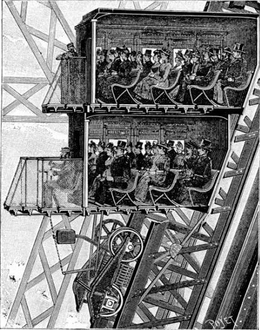{ loading=lazy }

Lifts that take visitors up the iron tower.

- Type: Object
- Subjects: Technology, Transportation
- Country: France
- Image credit: CC0 | Louis-Emile Durandelle | [source](https://commons.wikimedia.org/wiki/File:Louis-Emile_Durandelle,_The_Eiffel_Tower_-_State_of_the_Construction,_1888.jpg)
- Quests: [Paris! (fr_01)](../quest/fr_01.md)

---

### Est arrivé
{ loading=lazy }

Words from the anthem’s first line.

- Type: Object
- Subjects: Music, Education, Culture
- Country: France
- Topics: [marseillaise music](../topics/index.md#marseillaise_music)
- Image credit: CC0 | [source](https://commons.wikimedia.org/wiki/File:La_Marseillaise_chant_national_fran%C3%A7ais_de_Rouget_de_L%27Isle_Transcription_de_Langevin-2.jpg)
- Audio credit: PublicDomain | [source](https://commons.wikimedia.org/wiki/File:La_Marseillaise_(1914_Recording).ogg)
- Quests: [La Marseillaise (fr_11)](../quest/fr_11.md)

---

### F
{ loading=lazy }

A musical note.

- Type: Concept
- Subjects: Music, Education
- Country: France
- Topics: [Musical Notes](../topics/index.md#musical_notes)
- Image credit: CC_BY | Aleksey Gnilenkov | [source](https://commons.wikimedia.org/wiki/File:Nong_Fa_Lake.jpg)

---

### Feathered Hat
{ loading=lazy }

A fine hat with a feather for style.

- Type: Object
- Subjects: Culture, History
- Country: France
- Image credit: CC0 | Gustav Klimt | [source](https://commons.wikimedia.org/wiki/File:Gustav_Klimt_019.jpg)

---

### Five Weeks in a Balloon
{ loading=lazy }

A book by Jules Verne about flying across Africa in a hot air balloon. It's full of adventure and discovery!

- Type: Object
- Subjects: Literature
- Year: 1863
- Country: France
- Image credit: CC0
- Quests: [Jules Verne and transportation (fr_03)](../quest/fr_03.md)

---

### Flag of France
{ loading=lazy }

The flag of France has three vertical stripes: blue, white, and red. These colors represent liberty, equality, and fraternity!

- Rationale: The French flag is essential for teaching French national identity and values
- Type: Concept
- Subjects: Geography, Culture
- Year: 1794
- Country: France
- Topics: [Flags of Europe](../topics/index.md#flags_euroe), [France country](../topics/index.md#france)
- Image credit: CC0
- Quests: [The neighbors of France (fr_00)](../quest/fr_00.md)

---

### Flag of Monaco
{ loading=lazy }

The flag of Monaco has red and white horizontal stripes. Monaco is tiny but famous for fancy cars and royal palaces by the sea!

- Rationale: Monaco shows kids how small places can be special and important
- Type: Concept
- Subjects: Geography, Culture
- Year: 1881
- Country: France
- Topics: [Flags of Europe](../topics/index.md#flags_euroe)
- Image credit: CC0
- Quests: [The neighbors of France (fr_00)](../quest/fr_00.md)

---

### Flying Buttress
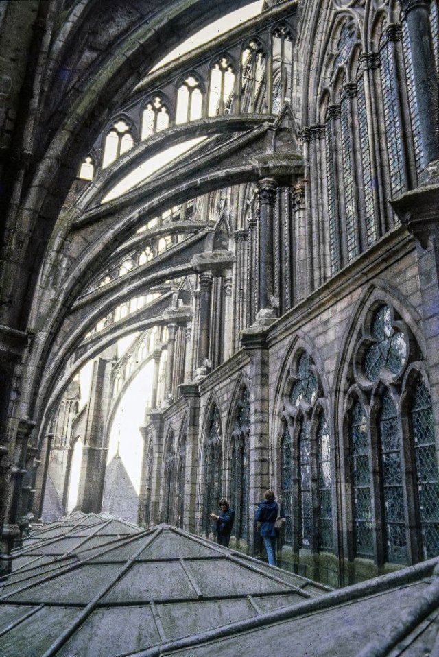{ loading=lazy }

Stone arms outside that help hold up tall walls.

- Type: Concept
- Subjects: Technology, History, Art
- Country: France
- Image credit: CC_BY_SA | Acroterion | [source](https://commons.wikimedia.org/wiki/File:Amiens_Cathedral_gallery_roof_and_buttresses_1980-1.jpg)
- Quests: [Paris! (fr_01)](../quest/fr_01.md)

---

### Formal Gardens
{ loading=lazy }

Decorative gardens for walking and parties.

- Type: Place
- Subjects: Culture, Environment
- Country: France
- Image credit: CC_BY_SA | Urban at French Wikipedia | [source](https://commons.wikimedia.org/wiki/File:Orangerie.jpg)

---

### France
{ loading=lazy }

A country in Europe. Capital is Paris.

- Type: Place
- Subjects: Geography, Culture
- Country: France
- Topics: [Countries around France](../topics/index.md#france_countries_around), [France country](../topics/index.md#france)
- Image credit: CC_BY_SA | Another one of my pictures:

This photograph was taken by Medium69 (William Crochot) and released under the license stated below. You are free to use it for any purpose as long as you credit the author (William Crochot), the Source (Wikimedia Commons) and the license (CC-BY-SA 4.0) in close relation to the image.

Please do not upload an updated image here without consultation with the Author. The author would like to make corrections only at his own source RAW. This ensures that the changes are preserved.Please if you think that any changes should be required, please inform the author.Otherwise you can upload a new image with a new name. Please use one of the templates derivative or extract. | [source](https://commons.wikimedia.org/wiki/File:Homme_statue_-_214.jpg)

---

### French Baguette
{ loading=lazy }

A long, crispy bread that is the most famous food in France. French people buy fresh baguettes every day from the bakery!

- Rationale: Baguettes are iconic French culture that kids can easily understand and remember
- Type: Object
- Subjects: Food, Culture
- Year: 1700
- Country: France
- Topics: [Baguette](../topics/index.md#baguette)
- Image credit: CC0
- Quests: [Paris! (fr_01)](../quest/fr_01.md)

---

### French Pirates
{ loading=lazy }

Brave sailors who sailed the seas for the King of France. They were called corsairs and protected French ships from enemies.

- Rationale: Pirates capture kids' imagination while teaching about maritime history and French naval power
- Type: Concept
- Subjects: History, Culture, Transportation
- Year: 1600
- Country: France
- Image credit: CC0 | [source](https://commons.wikimedia.org/wiki/File:Forbin_et_Jean_Bart_capture_en_1689.jpg)
- Quests: [The Colors of the Marseille Market (fr_09)](../quest/fr_09.md)

---

### French Revolution
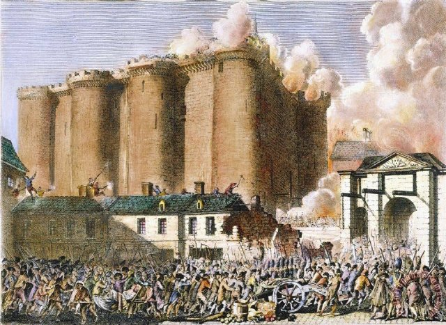{ loading=lazy }

A time in the 1790s when France changed its government.

- Type: Concept
- Subjects: History, Civics, Time, Culture
- Country: France
- Topics: [marseillaise music](../topics/index.md#marseillaise_music)
- Image credit: CC_BY_SA | [source](https://commons.wikimedia.org/wiki/File:11-french_revolution_1789.jpg)

---

### From the Earth to the Moon
{ loading=lazy }

A book by Jules Verne about going to the Moon in a big cannon! It was written before real rockets existed.

- Type: Object
- Subjects: Literature, Space, Science
- Year: 1865
- Country: France
- Topics: [Jules Verne](../topics/index.md#jules_verne)
- Image credit: CC0
- Quests: [Jules Verne and transportation (fr_03)](../quest/fr_03.md)

---

### G
{ loading=lazy }

A musical note.

- Type: Concept
- Subjects: Music, Education
- Country: France
- Topics: [Musical Notes](../topics/index.md#musical_notes)
- Image credit: CC_BY_SA | kallerna | [source](https://commons.wikimedia.org/wiki/File:Sol_de_Mañana_2018.jpg)

---

### Gargoyle
{ loading=lazy }

A funny or scary statue that also works as a rain spout.

- Type: Concept
- Subjects: Art, Technology, History
- Country: France
- Image credit: CC_BY_SA | Martinvl | [source](https://commons.wikimedia.org/wiki/File:Gargoyle_depicting_Hodgetts,_Chichester_Cathedral.jpg)
- Quests: [Paris! (fr_01)](../quest/fr_01.md)

---

### Gustave Eiffel
{ loading=lazy }

The man who built the Eiffel Tower! He was an engineer who loved building with iron and created the most famous tower in the world.

- Type: Person
- Subjects: History, Culture, Science
- Year: 1832
- Country: France
- Topics: [Eiffel Tower](../topics/index.md#eiffel-tower)
- Image credit: CC0
- Quests: [Paris! (fr_01)](../quest/fr_01.md)

---

### Helmet
{ loading=lazy }

A metal hat that protects the head.

- Type: Object
- Subjects: History, Safety
- Country: France
- Image credit: CC0 | Jebulon | [source](https://commons.wikimedia.org/wiki/File:Cavalier_Garde_Républicaine_trois-quart_dos.jpg)

---

### Helmet (Street Safety)
{ loading=lazy }

A hard hat to protect your head when riding.

- Type: Object
- Subjects: Safety, Health, Education
- Country: France
- Topics: [Stree safety](../topics/index.md#street-safety)
- Image credit: CC_BY | Paul Arps from The Netherlands | [source](https://commons.wikimedia.org/wiki/File:Safety_helmet_(Myanmar_2013)_(11772851273).jpg)

---

### Hot-Air Balloon
{ loading=lazy }

A balloon that flies using hot air. The first one flew in France.

- Type: Object
- Subjects: Transportation
- Country: France
- Topics: [Jules Verne](../topics/index.md#jules_verne)
- Image credit: CC0
- Quests: [Jules Verne and transportation (fr_03)](../quest/fr_03.md)

---

### Jean Michel Jarre
{ loading=lazy }

A French musician famous for electronic music

- Type: Person
- Subjects: Music, Culture, Technology
- Year: 2000
- Country: France
- Image credit: CC0 | [source](https://commons.wikimedia.org/wiki/File:Jean_Michel_a_Roman_Bomboš.jpg)

---

### Jules Verne
{ loading=lazy }

A French writer who imagined amazing adventures before they were possible! He wrote about submarines, rockets, and traveling around the world.

- Rationale: Jules Verne shows kids how imagination and science can work together
- Type: Person
- Subjects: Literature, Science, History
- Year: 1828
- Country: France
- Topics: [Jules Verne](../topics/index.md#jules_verne)
- Image credit: CC0
- Quests: [Jules Verne and transportation (fr_03)](../quest/fr_03.md)

---

### La Marseillaise
{ loading=lazy }

The French national song. People sing it at big events and sports games.

- Type: Concept
- Subjects: Music, Culture
- Year: 1885
- Country: France
- Topics: [marseillaise music](../topics/index.md#marseillaise_music)
- Image credit: CC0
- Audio credit: PublicDomain | [source](https://commons.wikimedia.org/wiki/File:La_Marseillaise_(1914_Recording).ogg)
- Quests: [La Marseillaise (fr_11)](../quest/fr_11.md)

---

### Le jour de la gloire
{ loading=lazy }

Words from the anthem’s first line.

- Type: Object
- Subjects: Music, Education, Culture
- Country: France
- Topics: [marseillaise music](../topics/index.md#marseillaise_music)
- Image credit: CC0 | [source](https://commons.wikimedia.org/wiki/File:La_Marseillaise_chant_national_fran%C3%A7ais_de_Rouget_de_L%27Isle_Transcription_de_Langevin-2.jpg)
- Audio credit: PublicDomain | [source](https://commons.wikimedia.org/wiki/File:La_Marseillaise_(1914_Recording).ogg)
- Quests: [La Marseillaise (fr_11)](../quest/fr_11.md)

---

### Le Mans
{ loading=lazy }

A city in France, famous for a 24-hour car race.

- Type: Place
- Subjects: Geography, Culture, Community
- Country: France
- Image credit: CC_BY_SA | Selbymay | [source](https://commons.wikimedia.org/wiki/File:Le_Mans_-_Cathedrale_St_Julien_ext_autumn.jpg)

---

### Le Mans Racetrack Entrance
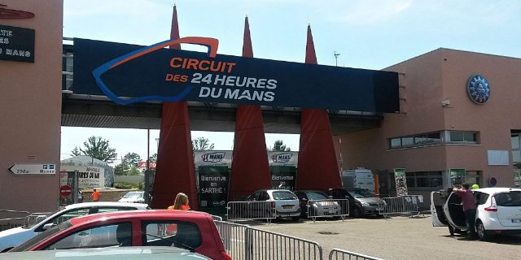{ loading=lazy }

The entrance area of the Le Mans circuit.

- Type: Place
- Subjects: Geography, Sport, Culture
- Country: France
- Image credit: CC_BY_SA | Neuwieser from Germany | [source](https://commons.wikimedia.org/wiki/File:24h_Le_Mans_2014_(16043688764).jpg)

---

### Le Mans Train Station
{ loading=lazy }

The station where you take the train home.

- Type: Place
- Subjects: Geography, Transportation, Community
- Country: France
- Image credit: CC_BY_SA | Radomianin | [source](https://commons.wikimedia.org/wiki/File:Man_at_Dundas_subway_station,_Toronto,_2008-05-06.jpg)

---

### Liberty Leading the People
{ loading=lazy }

A famous painting about freedom and courage. It shows a brave woman holding the French flag and leading people to fight for their rights.

- Rationale: This painting teaches kids about fighting for freedom and the French Revolution
- Type: Object
- Subjects: Art, History, Culture
- Year: 1830
- Country: France
- Topics: [Louvre](../topics/index.md#louvre)
- Image credit: CC0

---

### Loire River
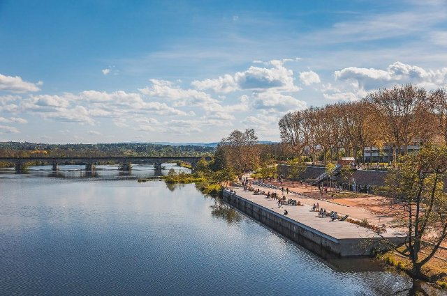{ loading=lazy }

A long river in France with many castles along its banks.

- Type: Place
- Subjects: Geography, Environment
- Country: France
- Image credit: CC_BY_SA | Ввласенко | [source](https://commons.wikimedia.org/wiki/File:Loire_river_near_Amboise_in_September._France.jpg)

---

### Loire Valley
{ loading=lazy }

A famous French region with many castles.

- Type: Place
- Subjects: Geography, History, Culture
- Country: France
- Image credit: CC_BY_SA | Suavemarimagno | [source](https://commons.wikimedia.org/wiki/File:Val-de-loire-montsoreau-lever-de-soleil.jpg)

---

### Loopholes
{ loading=lazy }

Narrow windows to shoot arrows out safely.

- Type: Concept
- Subjects: History, Technology
- Country: France
- Image credit: CC_BY_SA | A.-K. D. | [source](https://commons.wikimedia.org/wiki/File:Cross_shaped_loophole.jpg)

---

### Louvre
{ loading=lazy }

A huge museum full of art. It’s where the Mona Lisa lives.

- Type: Place
- Subjects: Art, Culture, History
- Year: 1793
- Country: France
- Topics: [Louvre](../topics/index.md#louvre)
- Image credit: CC0
- Quests: [Paris! (fr_01)](../quest/fr_01.md)

---

### Louvre Pyramid
{ loading=lazy }

The glass pyramid that is the Louvre’s modern entrance.

- Type: Place
- Subjects: Art, Culture, Technology
- Country: France
- Image credit: CC_BY_SA | Benh LIEU SONG (Flickr) | [source](https://commons.wikimedia.org/wiki/File:Louvre_Courtyard,_Looking_West.jpg)
- Quests: [Paris! (fr_01)](../quest/fr_01.md)

---

### Lute
{ loading=lazy }

A string instrument played at court.

- Type: Object
- Subjects: Music, Culture, History
- Country: France
- Image credit: CC_BY | Ching | [source](https://commons.wikimedia.org/wiki/File:Lute_(by_Princess_Ruto,_2013-02-11).jpg)

---

### Lycée in France
{ loading=lazy }

High school in France for teenagers aged 16 to 18. Students study hard for the Baccalauréat exam to go to university.

- Rationale: The Lycée system shows kids the path to higher education in France
- Type: Concept
- Subjects: Education, Culture
- Year: 1975
- Country: France
- Topics: [French School](../topics/index.md#frenchschool)
- Image credit: CC0 | Émeric, CC BY-SA 3.0 <https://creativecommons.org/licenses/by-sa/3.0>, via Wikimedia Commons | [source](https://commons.wikimedia.org/wiki/File:Atelier_lyc%C3%A9e_Chevrollier.jpg)
- Quests: [The School system (fr_02)](../quest/fr_02.md)

---

### Map of Seine in Paris
{ loading=lazy }

A picture that shows how the Seine River flows through the city of Paris.

- Type: Object
- Subjects: Science
- Country: France
- Image credit: CC0
- Quests: [Paris Seine (fr_10)](../quest/fr_10.md)

---

### Map of Seine River
{ loading=lazy }

A picture that shows the Seine River and where it flows through the land.

- Type: Object
- Subjects: Geography, Environment
- Country: France
- Image credit: CC0
- Quests: [Paris Seine (fr_10)](../quest/fr_10.md)

---

### Masquerade Mask
{ loading=lazy }

A mask for parties and balls.

- Type: Object
- Subjects: Culture, History, Recreation
- Country: France
- Image credit: CC_BY_SA | David Jackson | [source](https://commons.wikimedia.org/wiki/File:BLW_Yoruba_Epa_Mask.jpg)

---

### Musical Score
{ loading=lazy }

The written notes and words for a song.

- Type: Object
- Subjects: Education, Music
- Country: France
- Topics: [Musical Notes](../topics/index.md#musical_notes)
- Image credit: CC0 | Claude Joseph Rouget de Lisle | [source](https://commons.wikimedia.org/wiki/File:La_Marseillaise_chant_national_français_de_Rouget_de_L'Isle_Transcription_de_Langevin-2.jpg)

---

### Notre-Dame de Paris
{ loading=lazy }

A beautiful cathedral in Paris. Its colorful glass windows tell stories.

- Type: Place
- Subjects: Geography, Environment
- Year: 1885
- Country: France
- Topics: [Notre Dame](../topics/index.md#notredame)
- Image credit: CC0
- Quests: [Paris! (fr_01)](../quest/fr_01.md)

---

### Notre-Dame Fire
{ loading=lazy }

In 2019, a big fire damaged the beautiful Notre-Dame Cathedral in Paris. Many people worked together to save this important building.

- Rationale: This event teaches kids about protecting cultural heritage and community cooperation
- Type: Concept
- Subjects: History, Culture, Environment
- Year: 2019
- Country: France
- Topics: [Notre Dame](../topics/index.md#notredame)
- Image credit: CC0
- Quests: [Paris! (fr_01)](../quest/fr_01.md)

---

### Oath of the Horatii (David)
{ loading=lazy }

A painting of three brothers making a brave promise.

- Type: Object
- Subjects: Art, History
- Country: France
- Image credit: CC0 | Jacques-Louis David | [source](https://commons.wikimedia.org/wiki/File:Jacques-Louis_David,_Le_Serment_des_Horaces.jpg)
- Quests: [Paris! (fr_01)](../quest/fr_01.md)

---

### Parapet
{ loading=lazy }

The low wall at the edge of the ramparts.

- Type: Concept
- Subjects: History, Technology
- Country: France
- Image credit: CC_BY_SA | Johann Jaritz | [source](https://commons.wikimedia.org/wiki/File:Feldkirchen_Kirchgasse_6_Wohn-und_Geschäftshaus_Parapet-Fenster_06062019_7122.jpg)

---

### Piano
{ loading=lazy }

A keyboard instrument used to play melodies and chords.

- Type: Object
- Subjects: Music, Education
- Country: France
- Topics: [Musical Notes](../topics/index.md#musical_notes)
- Image credit: CC0 | Unknown authorUnknown author | [source](https://commons.wikimedia.org/wiki/File:Hupfeld_piano_played_(2018-10-04_@pxhere_1546039).jpg)

---

### Pont Alexandre III
{ loading=lazy }

A beautiful bridge in Paris with fancy decorations and golden statues on it.

- Type: Place
- Subjects: Geography, Environment
- Country: France
- Image credit: CC0
- Quests: [Paris Seine (fr_10)](../quest/fr_10.md)

---

### Portcullis
{ loading=lazy }

A heavy gate that drops to block the doorway.

- Type: Object
- Subjects: Technology, History, Safety
- Country: France
- Image credit: CC_BY | Kevin King from Pensacola, FL, US of A | [source](https://commons.wikimedia.org/wiki/File:Cahir_Castle_Portcullis_by_Kevin_King.jpg)

---

### Primary School in France
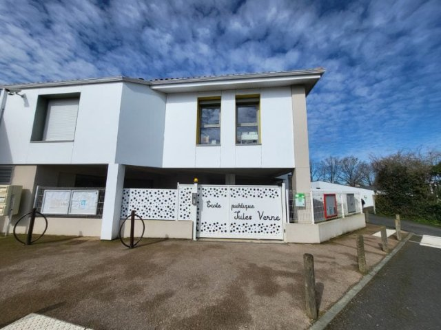{ loading=lazy }

School for kids aged 6 to 10. You learn reading, writing, and counting.

- Type: Concept
- Subjects: Education, Culture
- Year: 1975
- Country: France
- Topics: [French School](../topics/index.md#frenchschool)
- Image credit: Licensed
- Quests: [The School system (fr_02)](../quest/fr_02.md)

---

### Race Car
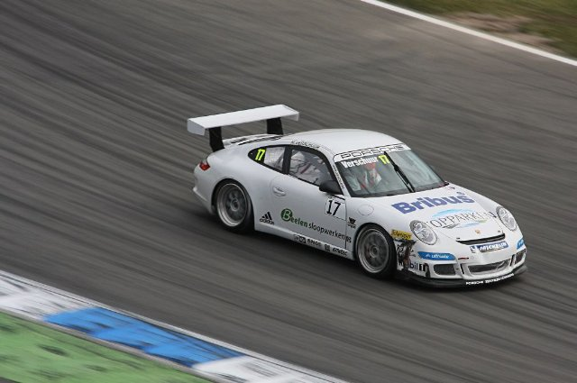{ loading=lazy }

A very fast car used on racetracks.

- Type: Object
- Subjects: Sport, Technology
- Country: France
- Image credit: CC_BY_SA | user:AngMoKio | [source](https://commons.wikimedia.org/wiki/File:Porsche_race_car_Verschuur_amk.jpg)

---

### Ramparts
{ loading=lazy }

High walls you can walk on to guard the castle.

- Type: Concept
- Subjects: History, Technology
- Country: France
- Image credit: CC_BY_SA | Txllxt TxllxT | [source](https://commons.wikimedia.org/wiki/File:Pardubice_-_Zámek_Pardubice_-_Ramparts_View_SSE_-_Renaissance_architecture.jpg)

---

### Rose Window
{ loading=lazy }

A big round stained-glass window that tells stories with light.

- Type: Concept
- Subjects: Art, Culture, History
- Country: France
- Image credit: CC_BY_SA | Diliff | [source](https://commons.wikimedia.org/wiki/File:Amiens_Cathedral_Organ_and_Rose_Window,_Picardy,_France_-_Diliff.jpg)
- Quests: [Paris! (fr_01)](../quest/fr_01.md)

---

### Royal Bedroom
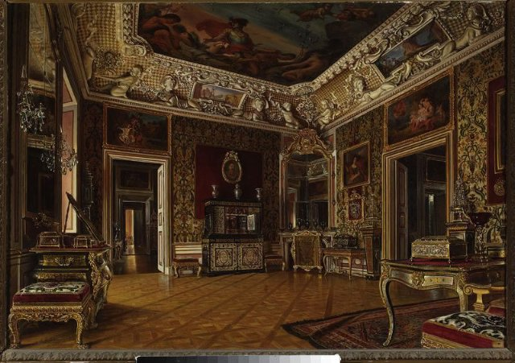{ loading=lazy }

A fancy room with a big canopied bed.

- Type: Place
- Subjects: Culture, History
- Country: France
- Image credit: CC0 | Aleksander Gryglewski | [source](https://commons.wikimedia.org/wiki/File:Aleksander_Gryglewski_-_Interior_of_the_royal_bedroom_at_the_Wilanów_Palace_-_MP_184_MNW_-_National_Museum_in_Warsaw.jpg)

---

### Scooter
{ loading=lazy }

A small two-wheeled scooter (trottinette).

- Type: Object
- Subjects: Transportation, Recreation, Safety
- Country: France
- Image credit: CC_BY_SA | Spurzem - Lothar Spurzem | [source](https://commons.wikimedia.org/wiki/File:Zündapp_Bella_R_154_(2008-05-21)_Seitenansicht_ret.jpg)

---

### Seine
{ loading=lazy }

A 777-kilometre-long river in northern France

- Type: Place
- Subjects: Geography
- Country: France
- Image credit: CC0
- Quests: [Paris Seine (fr_10)](../quest/fr_10.md)

---

### Seine River Boat
{ loading=lazy }

A special boat that sails on the Seine River in Paris. You can see the Eiffel Tower and other beautiful buildings from the water!

- Rationale: Boat tours help kids see Paris from a different perspective and understand river transportation
- Type: Concept
- Subjects: Transportation, Geography, Culture
- Year: 1900
- Country: France
- Image credit: CC0
- Quests: [Paris Seine (fr_10)](../quest/fr_10.md)

---

### Submarine (The Nautilus)
{ loading=lazy }

A submarine from Jules Verne’s story. It could explore the deep sea.

- Type: Object
- Subjects: Literature, Science
- Country: France
- Topics: [Jules Verne](../topics/index.md#jules_verne)
- Image credit: CC0
- Quests: [Jules Verne and transportation (fr_03)](../quest/fr_03.md)

---

### Sword
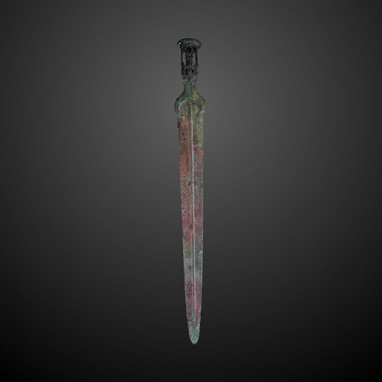{ loading=lazy }

A long blade used by knights.

- Type: Object
- Subjects: History, Culture
- Country: France
- Image credit: CC_BY_SA | Rama | [source](https://commons.wikimedia.org/wiki/File:Sword-AO_21069-P5280877-gradient.jpg)

---

### The Seated Scribe
{ loading=lazy }

An ancient Egyptian statue of a person writing.

- Type: Object
- Subjects: Art, History
- Country: France
- Image credit: CC_BY_SA | Rama | [source](https://commons.wikimedia.org/wiki/File:The_seated_scribe-E_3023-IMG_4267-gradient-contrast.jpg)
- Quests: [Paris! (fr_01)](../quest/fr_01.md)

---

### Traffic Lights
{ loading=lazy }

Street lights that tell you when to STOP or GO.

- Type: Object
- Subjects: Safety, Education, Transportation
- Country: France
- Topics: [Stree safety](../topics/index.md#street-safety)
- Image credit: CC0

---

### Winged Victory of Samothrace
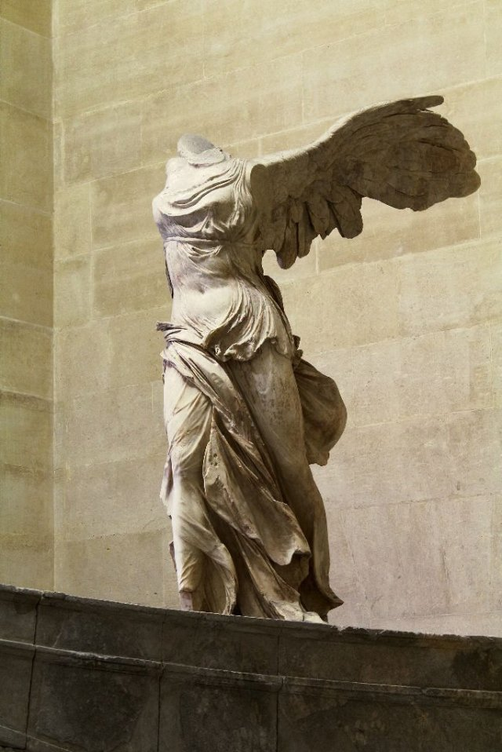{ loading=lazy }

A famous ancient sculpture of a goddess with wings.

- Type: Object
- Subjects: Art, History
- Country: France
- Image credit: CC_BY_SA | Rijin | [source](https://commons.wikimedia.org/wiki/File:Winged_Victory_of_Samothrace_(1).jpg)
- Quests: [Paris! (fr_01)](../quest/fr_01.md)

---

### World’s Fair (1889)
{ loading=lazy }

The big world expo when the Eiffel Tower was shown.

- Type: Concept
- Subjects: History, Culture
- Country: France
- Image credit: CC0 | imp. de Erhard (Paris), 1889 | [source](https://commons.wikimedia.org/wiki/File:Plan_général_exposition_universelle_de_1889.jpg)
- Quests: [Paris! (fr_01)](../quest/fr_01.md)

---

### Xylophone
{ loading=lazy }

An instrument with bars you hit to make notes.

- Type: Object
- Subjects: Music, Education
- Country: France
- Image credit: CC_BY | Mayor McGinn | [source](https://commons.wikimedia.org/wiki/File:Mayor_westlake_play_03_(8532405090).jpg)

---

### Zebra Crossing
{ loading=lazy }

White stripes where people cross the street.

- Type: Object
- Subjects: Safety, Education, Transportation
- Country: France
- Topics: [Stree safety](../topics/index.md#street-safety)
- Image credit: CC_BY_SA | Shuets Udono | [source](https://commons.wikimedia.org/wiki/File:Japanese_car_accident.jpg)

---

### École Maternelle
{ loading=lazy }

School for little kids aged 3 to 5. You learn by playing and exploring.

- Type: Concept
- Subjects: Education, Culture
- Year: 1975
- Country: France
- Topics: [French School](../topics/index.md#frenchschool)
- Image credit: CC0 | Polymagou, CC BY-SA 4.0 <https://creativecommons.org/licenses/by-sa/4.0>, via Wikimedia Commons | [source](https://commons.wikimedia.org/wiki/File:%C3%89cole_maternelle_Paul-Langevin,_Les_Clayes-sous-Bois,_Yvelines_9-3.jpg)
- Quests: [The School system (fr_02)](../quest/fr_02.md)

## Poland

### Amber
{ loading=lazy }

Shiny fossil tree resin called 'Baltic Gold'.

- Type: Object
- Subjects: History, Culture, Science
- Country: Poland
- Topics: [Neptune's fountain](../topics/index.md#neptune_fountain)
- Image credit: CC_BY_SA | Diego Delso | [source](https://commons.wikimedia.org/wiki/File:Fuerte_Amber,_Amber,_India,_2009-12-04,_DD_0019.jpg)
- Quests: [The Amber Necklace of Gdańsk (pl_05)](../quest/pl_05.md)

---

### Amber Room
{ loading=lazy }

A famous room made of amber with a mysterious history.

- Type: Concept
- Subjects: History, Culture
- Country: Poland
- Topics: [Neptune's fountain](../topics/index.md#neptune_fountain)
- Image credit: CC0 | Branson DeCou | [source](https://commons.wikimedia.org/wiki/File:Catherine_Palace_interior_-_Amber_Room_(1).jpg)
- Quests: [The Amber Necklace of Gdańsk (pl_05)](../quest/pl_05.md)

---

### Animal Enclosure
{ loading=lazy }

A safe space made for animals to live at the zoo.

- Type: Place
- Subjects: Animal, Safety
- Country: Poland
- Topics: [wroclaw zoo](../topics/index.md#wroclaw_zoo)
- Image credit: CC0 | Pearson Scott Foresman | [source](https://commons.wikimedia.org/wiki/File:Corral_(PSF).png)
- Quests: [The Zoo (pl_04)](../quest/pl_04.md)

---

### Animal Lover Dwarf
{ loading=lazy }

A dwarf statue that loves the zoo and animals.

- Type: Object
- Subjects: Culture, Animal, Education
- Country: Poland
- Topics: [Wroclaw Dwarves](../topics/index.md#wroclaw_dwarves)
- Image credit: CC_BY | Klearchos Kapoutsis from Santorini, Greece | [source](https://commons.wikimedia.org/wiki/File:Gołębnik,_the_Flying_Dwarf..._(5629227878).jpg)
- Quests: [The great Wrocław dwarf rescue (pl_02)](../quest/pl_02.md)

---

### Astronomy
{ loading=lazy }

The science of studying the Sun, Moon, stars, and planets.

- Type: Concept
- Subjects: Science, Space
- Country: Poland
- Topics: [Solar System](../topics/index.md#solar_system)
- Image credit: CC_BY | ESO/Yuri Beletsky (ybialets at eso.org) | [source](https://commons.wikimedia.org/wiki/File:Laser_Towards_Milky_Ways_Centre.jpg)
- Quests: [Copernicus and the Solar System (pl_07)](../quest/pl_07.md)

---

### Baltic Sea Coast
{ loading=lazy }

The sandy shore along the Baltic Sea.

- Type: Place
- Subjects: Geography, Environment
- Country: Poland
- Topics: [gdansk](../topics/index.md#gdansk)
- Image credit: CC_BY_SA | Radomianin | [source](https://commons.wikimedia.org/wiki/File:Baltic_Sea_view_from_Schmiedeberg_hill_in_Rerik,_2025-06-23.jpg)
- Quests: [The Amber Necklace of Gdańsk (pl_05)](../quest/pl_05.md)

---

### Barge
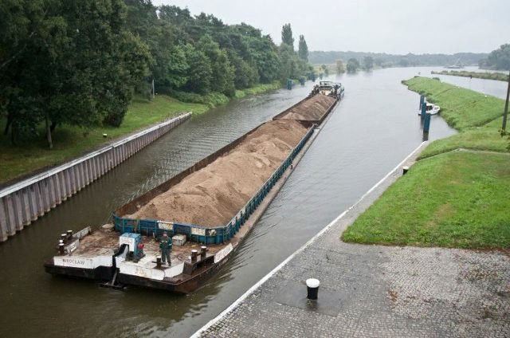{ loading=lazy }

A long, flat boat that carries goods on rivers.

- Type: Object
- Subjects: Transportation, Geography
- Country: Poland
- Image credit: CC_BY_SA | Dietmar Rabich
- Quests: [A Voyage on the Odra River (pl_03)](../quest/pl_03.md)

---

### Bishop Dwarf
{ loading=lazy }

A dwarf statue who asks a church question.

- Type: Object
- Subjects: Culture, History
- Country: Poland
- Topics: [Wroclaw Dwarves](../topics/index.md#wroclaw_dwarves)
- Image credit: CC_BY_SA | Teal Reverie | [source](https://commons.wikimedia.org/wiki/File:Dwarf_spider_cephalothorax.jpg)
- Quests: [The great Wrocław dwarf rescue (pl_02)](../quest/pl_02.md)

---

### Boat
{ loading=lazy }

A vehicle that moves on water.

- Type: Object
- Subjects: Transportation
- Country: Poland
- Image credit: CC_BY_SA | Norbert Nagel | [source](https://commons.wikimedia.org/wiki/File:Rowing_boat_on_a_house_roof_-_Fira_-_Santorini_-_Greece_-_02.jpg)
- Quests: [A Voyage on the Odra River (pl_03)](../quest/pl_03.md)

---

### Bridge
{ loading=lazy }

A structure that lets people or vehicles cross water.

- Type: Concept
- Subjects: Technology, Transportation
- Country: Poland
- Image credit: CC_BY_SA | W.carter | [source](https://commons.wikimedia.org/wiki/File:Bridge_and_deck_of_Gullbritt.jpg)
- Quests: [A Voyage on the Odra River (pl_03)](../quest/pl_03.md)

---

### Centennial Hall 
{ loading=lazy }

The Centennial Hall is a huge building that looks like a big tent with a roof. It’s very tall. Inside, you can see different shows, listen to concerts, or watch sports games.

- Type: Place
- Subjects: Culture, Recreation
- Country: Poland
- Image credit: CC0 | Taxiarchos228, FAL, via Wikimedia Commons | [source](https://commons.wikimedia.org/wiki/File:Wroc%C5%82aw_-_Jahrhunderthalle1.jpg)
- Quests: [The great Wrocław dwarf rescue (pl_02)](../quest/pl_02.md)

---

### Chopin Monument
{ loading=lazy }

A large statue in Warsaw’s Łazienki Park dedicated to Frédéric Chopin. It’s also the site of popular open-air piano concerts in summer. (the special tree he is sitting under is a typical polish.. Willow)

- Type: Object
- Subjects: Music, Culture
- Country: Poland
- Topics: [Warsaw](../topics/index.md#warsaw)
- Image credit: CC0 | Ethan Doyle White, CC BY-SA 4.0 <https://creativecommons.org/licenses/by-sa/4.0>, via Wikimedia Commons | [source](https://commons.wikimedia.org/wiki/File:The_Chopin_Monument_in_Warsaw.jpg)
- Quests: [Discover Warszawa (pl_01)](../quest/pl_01.md)

---

### Cub
{ loading=lazy }

A baby lion.

- Type: Concept
- Subjects: Animal, Science
- Country: Poland
- Image credit: CC_BY_SA | Charles J. Sharp | [source](https://commons.wikimedia.org/wiki/File:Eurasian_brown_bear_(Ursus_arctos_arctos)_cub_14_months.jpg)
- Quests: [The Zoo (pl_04)](../quest/pl_04.md)

---

### Cutter
{ loading=lazy }

A small fishing boat used at sea.

- Type: Object
- Subjects: Transportation, Technology
- Country: Poland
- Image credit: CC_BY_SA | Gordon Leggett | [source](https://commons.wikimedia.org/wiki/File:2009-12-06_USCGC_Key_Biscayne_WPB1339.jpg)
- Quests: [The Amber Necklace of Gdańsk (pl_05)](../quest/pl_05.md)

---

### Dwarf Expert
{ loading=lazy }

A friendly guide who knows all about the dwarfs.

- Type: Person
- Subjects: Education, Culture
- Country: Poland
- Topics: [Wroclaw Dwarves](../topics/index.md#wroclaw_dwarves)
- Image credit: CC_BY | Tomasz Gąsior | [source](https://commons.wikimedia.org/wiki/File:Kaczmaruś_dwarf_02.jpg)
- Quests: [The great Wrocław dwarf rescue (pl_02)](../quest/pl_02.md)

---

### Earth
{ loading=lazy }

Our home planet with land, air, and water.

- Type: Object
- Subjects: Space, Science, Geography, Environment
- Country: Poland
- Topics: [Solar System](../topics/index.md#solar_system)
- Image credit: CC0 | NASA/Apollo 17 crew; taken by either Harrison Schmitt or Ron Evans | [source](https://commons.wikimedia.org/wiki/File:The_Earth_seen_from_Apollo_17.jpg)
- Quests: [Copernicus and the Solar System (pl_07)](../quest/pl_07.md)

---

### Ecosystem
{ loading=lazy }

Living things and their home in nature, working together.

- Type: Concept
- Subjects: Environment, Science
- Country: Poland
- Image credit: CC_BY_SA | XCXNXH | [source](https://commons.wikimedia.org/wiki/File:JULY_2024_COBERMS_RESEARCH_WORK_AT_KONGO_VILLAGE.jpg)
- Quests: [The Amber Necklace of Gdańsk (pl_05)](../quest/pl_05.md)

---

### Eyepiece
{ loading=lazy }

The small lens you look through on a telescope.

- Type: Object
- Subjects: Science, Technology
- Country: Poland
- Topics: [Telescope](../topics/index.md#telescope)
- Image credit: CC_BY | SvonHalenbach | [source](https://commons.wikimedia.org/wiki/File:Newtonianscope-eyepiece-detail.JPG)
- Quests: [Copernicus and the Solar System (pl_07)](../quest/pl_07.md)

---

### Fisherman
{ loading=lazy }

A person who catches fish at sea.

- Type: Person
- Subjects: Community, Geography
- Country: Poland
- Topics: [Fisherman](../topics/index.md#fisherman)
- Image credit: CC_BY_SA | Benh LIEU SONG (Flickr) | [source](https://commons.wikimedia.org/wiki/File:Leg_Rowing_Fisherman_Inle_Lake_Myanmar.jpg)
- Quests: [The Amber Necklace of Gdańsk (pl_05)](../quest/pl_05.md)

---

### Fishing Net
{ loading=lazy }

A net used to catch fish.

- Type: Object
- Subjects: Technology, Community
- Country: Poland
- Topics: [Fisherman](../topics/index.md#fisherman)
- Image credit: CC0 | Jebulon | [source](https://commons.wikimedia.org/wiki/File:Fishing_net_Karystos_Euboea_Greece.jpg)
- Quests: [The Amber Necklace of Gdańsk (pl_05)](../quest/pl_05.md)

---

### Flag of Poland
{ loading=lazy }

The flag of Poland has white and red horizontal stripes. Poland is famous for scientists like Copernicus and delicious pierogi!

- Rationale: The Polish flag is essential for Polish language learning and cultural identity
- Type: Concept
- Subjects: Geography, Culture
- Year: 1919
- Country: Poland
- Topics: [Poland country](../topics/index.md#poland)
- Image credit: CC0
- Quests: [The neighbors of Poland (pl_00)](../quest/pl_00.md)

---

### Footbridge
{ loading=lazy }

A bridge for people to walk on. No cars.

- Type: Object
- Subjects: Transportation, Community
- Country: Poland
- Topics: [Odra river](../topics/index.md#odra_river)
- Image credit: CC_BY_SA | Basile Morin | [source](https://commons.wikimedia.org/wiki/File:Front_view_of_a_wooden_footbridge_over_a_lagoon,_trees_and_mountains_in_Vang_Vieng,_Laos.jpg)
- Quests: [A Voyage on the Odra River (pl_03)](../quest/pl_03.md)

---

### Fryderyk Chopin
{ loading=lazy }

A famous piano composer from Poland. He wrote beautiful music that sounds like dancing or telling stories. His music makes people feel happy or sad.

- Rationale: Chopin introduces kids to classical music and shows how music can express emotions
- Type: Person
- Subjects: Music, History, Culture
- Year: 1810
- Country: Poland
- Topics: [Warsaw](../topics/index.md#warsaw)
- Image credit: CC0
- Quests: [Discover Warszawa (pl_01)](../quest/pl_01.md)

---

### Gdańsk
{ loading=lazy }

A port city in Poland on the Baltic Sea.

- Type: Place
- Subjects: Geography, History, Culture
- Country: Poland
- Topics: [gdansk](../topics/index.md#gdansk), [Neptune's fountain](../topics/index.md#neptune_fountain)
- Image credit: CC_BY_SA | Diego Delso | [source](https://commons.wikimedia.org/wiki/File:Calle_Dlugie_Pobrzeze,_Gdansk,_Polonia,_2013-05-20,_DD_05.jpg)
- Quests: [The Amber Necklace of Gdańsk (pl_05)](../quest/pl_05.md)

---

### Gdańsk Lighthouse
{ loading=lazy }

A historic lighthouse that helps ships find the harbor.

- Type: Place
- Subjects: History, Geography, Transportation
- Country: Poland
- Topics: [gdansk](../topics/index.md#gdansk)
- Image credit: CC_BY_SA | Yanek | [source](https://commons.wikimedia.org/wiki/File:Gdańsk,_Kapitanat_Portu_-_Port_Północny_-_fotopolska.eu_(304857).jpg)
- Quests: [The Amber Necklace of Gdańsk (pl_05)](../quest/pl_05.md)

---

### Heliocentric Model
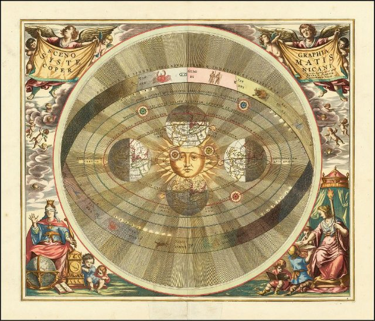{ loading=lazy }

The idea that the Sun is in the center and planets go around it.

- Type: Concept
- Subjects: Science, Space, History
- Country: Poland
- Topics: [Solar System](../topics/index.md#solar_system)
- Image credit: CC0 | Andreas Cellarius | [source](https://commons.wikimedia.org/wiki/File:1661_Cellarius's_chart_illustrating_Copernicus'_heliocentric_model_of_the_universe.jpg)
- Quests: [Copernicus and the Solar System (pl_07)](../quest/pl_07.md)

---

### Houseboat
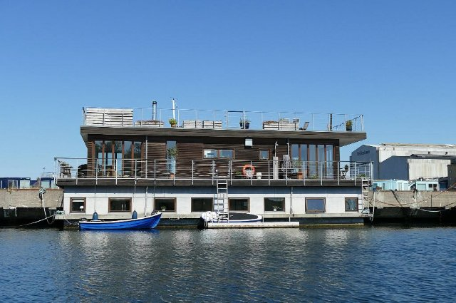{ loading=lazy }

A boat made to live on.

- Type: Object
- Subjects: Transportation, Community
- Country: Poland
- Topics: [Odra river](../topics/index.md#odra_river)
- Image credit: CC_BY_SA | Kritzolina | [source](https://commons.wikimedia.org/wiki/File:Houseboat_in_Copenhagen_Harbor_02.jpg)
- Quests: [A Voyage on the Odra River (pl_03)](../quest/pl_03.md)

---

### Iglica
{ loading=lazy }

A tall metal sculpture next to Centennial Hall.

- Type: Place
- Subjects: History, Culture
- Country: Poland
- Image credit: CC_BY_SA | Jonashtand | [source](https://commons.wikimedia.org/wiki/File:202206_Iglica,_Wrocław.jpg)
- Quests: [The Zoo (pl_04)](../quest/pl_04.md)

---

### Jupiter
{ loading=lazy }

The biggest planet, famous for the Great Red Spot.

- Type: Object
- Subjects: Space, Science
- Country: Poland
- Topics: [Solar System](../topics/index.md#solar_system)
- Image credit: CC0 | NASA/JPL/Space Science Institute | [source](https://commons.wikimedia.org/wiki/File:Portrait_of_Jupiter_from_Cassini.jpg)
- Quests: [Copernicus and the Solar System (pl_07)](../quest/pl_07.md)

---

### Kayak
{ loading=lazy }

A small boat you paddle.

- Type: Object
- Subjects: Recreation, Sport
- Country: Poland
- Image credit: CC_BY_SA | 0x010C
- Quests: [A Voyage on the Odra River (pl_03)](../quest/pl_03.md)

---

### Keymaster Dwarf
{ loading=lazy }

A dwarf statue guarding the elevator with a big key.

- Type: Object
- Subjects: Culture
- Country: Poland
- Topics: [Wroclaw Dwarves](../topics/index.md#wroclaw_dwarves)
- Image credit: CC_BY_SA | Pnapora | [source](https://commons.wikimedia.org/wiki/File:100matolog_(Tooth-dwarf)_Wroclaw_dwarf_02.JPG)
- Quests: [The great Wrocław dwarf rescue (pl_02)](../quest/pl_02.md)

---

### King Sigismund III
{ loading=lazy }

A king of Poland who built many beautiful buildings in Warsaw. His statue stands on a tall column in the city center.

- Rationale: Historical kings help kids understand how cities were built and developed over time
- Type: Person
- Subjects: History, Culture
- Year: 1566
- Country: Poland
- Image credit: CC0 | Pieter Soutman, Public domain, via Wikimedia Commons | [source](https://commons.wikimedia.org/wiki/File:Soutman_Sigismund_III_Vasa_in_coronation_robes.jpg)
- Quests: [Discover Warszawa (pl_01)](../quest/pl_01.md)

---

### Lens
{ loading=lazy }

A clear piece of glass or plastic that bends light.

- Type: Object
- Subjects: Science, Technology
- Country: Poland
- Topics: [Telescope](../topics/index.md#telescope)
- Image credit: CC_BY_SA | Christian David | [source](https://commons.wikimedia.org/wiki/File:Village_de_Lens.jpg)
- Quests: [Copernicus and the Solar System (pl_07)](../quest/pl_07.md)

---

### Leonardo da Vinci Primary School
{ loading=lazy }

It’s a friendly place where children learn, create, and explore guided by curiosity, art, and science.

- Type: None
- Subjects: Education
- Country: Poland
- Image credit: CC0
- Quests: [The great Wrocław dwarf rescue (pl_02)](../quest/pl_02.md)

---

### Main Town Hall
{ loading=lazy }

A tall town hall with a tower and museum.

- Type: Place
- Subjects: History, Culture
- Country: Poland
- Image credit: CC_BY_SA | Diego Delso | [source](https://commons.wikimedia.org/wiki/File:Ayuntamiento_Principal,_Gdansk,_Polonia,_2013-05-20,_DD_01.jpg)
- Quests: [The Amber Necklace of Gdańsk (pl_05)](../quest/pl_05.md)

---

### Map of Wroklaw
{ loading=lazy }

A simple map of Wrocław showing the Odra River with its islands and many bridges

- Type: None
- Subjects: Geography
- Country: Poland
- Image credit: CC0
- Quests: [The great Wrocław dwarf rescue (pl_02)](../quest/pl_02.md), [A Voyage on the Odra River (pl_03)](../quest/pl_03.md)

---

### Maria Curie
{ loading=lazy }

A brilliant scientist from Poland who discovered radioactivity. She was the first woman to win a Nobel Prize and won it twice!

- Rationale: Maria Curie inspires kids (especially girls) to pursue science and shows Polish contributions to science
- Type: Person
- Subjects: Science, History
- Year: 1867
- Country: Poland
- Image credit: CC0
- Quests: [Discover Warszawa (pl_01)](../quest/pl_01.md)

---

### Mars
{ loading=lazy }

The red planet with dust and big volcanoes.

- Type: Object
- Subjects: Space, Science
- Country: Poland
- Topics: [Solar System](../topics/index.md#solar_system)
- Image credit: CC_BY_SA | ESA & MPS for OSIRIS Team MPS/UPD/LAM/IAA/RSSD/INTA/UPM/DASP/IDA, CC BY-SA 3.0 IGO | [source](https://commons.wikimedia.org/wiki/File:OSIRIS_Mars_true_color.jpg)
- Quests: [Copernicus and the Solar System (pl_07)](../quest/pl_07.md)

---

### Mercury
{ loading=lazy }

The closest planet to the Sun; small and very fast.

- Type: Object
- Subjects: Space, Science
- Country: Poland
- Topics: [Solar System](../topics/index.md#solar_system)
- Image credit: CC0 | NASA/Johns Hopkins University Applied Physics Laboratory/Carnegie Institution of Washington. Edited version of Image:Mercury in color - Prockter07.jpg by Papa Lima Whiskey. | [source](https://commons.wikimedia.org/wiki/File:Mercury_in_color_-_Prockter07_centered.jpg)
- Quests: [Copernicus and the Solar System (pl_07)](../quest/pl_07.md)

---

### Mermaid of Warsaw
{ loading=lazy }

The city’s symbol is a brave mermaid with a sword and shield. You can see her statue by the river.

- Type: Object
- Subjects: Culture, History
- Country: Poland
- Topics: [Warsaw](../topics/index.md#warsaw)
- Image credit: CC0 | Grzegorz Polak, CC BY-SA 2.0 <https://creativecommons.org/licenses/by-sa/2.0>, via Wikimedia Commons | [source](https://commons.wikimedia.org/wiki/File:Syrenka_Warszawska.jpg)
- Quests: [Discover Warszawa (pl_01)](../quest/pl_01.md)

---

### Motława River
{ loading=lazy }

The river that runs through Gdańsk to the sea.

- Type: Place
- Subjects: Geography
- Country: Poland
- Topics: [gdansk](../topics/index.md#gdansk)
- Image credit: CC_BY_SA | John Samuel | [source](https://commons.wikimedia.org/wiki/File:Boat_on_Motława_river_in_Gdańsk.jpg)
- Quests: [The Amber Necklace of Gdańsk (pl_05)](../quest/pl_05.md)

---

### Navigation
{ loading=lazy }

Finding the way at sea using lights, maps, and tools.

- Type: Concept
- Subjects: Technology, Geography
- Country: Poland
- Topics: [Fisherman](../topics/index.md#fisherman)
- Image credit: CC0 | [source](https://commons.wikimedia.org/wiki/File:Table_of_Geography_and_Hydrography,_Cyclopaedia,_Volume_1.jpg)
- Quests: [The Amber Necklace of Gdańsk (pl_05)](../quest/pl_05.md)

---

### Necklace
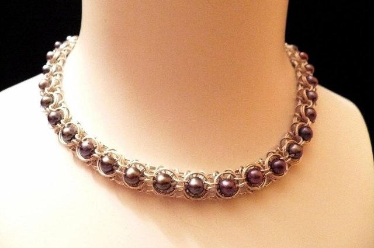{ loading=lazy }

A string of beads or shells you wear around your neck.

- Type: Object
- Subjects: Art, Culture
- Country: Poland
- Topics: [Neptune's fountain](../topics/index.md#neptune_fountain)
- Image credit: CC_BY_SA | W.carter | [source](https://commons.wikimedia.org/wiki/File:Necklace_made_of_rough_diamonds.jpg)
- Quests: [The Amber Necklace of Gdańsk (pl_05)](../quest/pl_05.md)

---

### Neptune
{ loading=lazy }

The sea god from old stories.

- Type: Concept
- Subjects: Culture, History
- Country: Poland
- Topics: [Solar System](../topics/index.md#solar_system)
- Image credit: CC0 | NASA | [source](https://commons.wikimedia.org/wiki/File:Neptune_Full.jpg)
- Quests: [Copernicus and the Solar System (pl_07)](../quest/pl_07.md)

---

### Neptune's Fountain
{ loading=lazy }

A famous fountain in Gdańsk with the sea god statue.

- Type: Place
- Subjects: History, Culture, Community
- Country: Poland
- Topics: [Neptune's fountain](../topics/index.md#neptune_fountain)
- Image credit: CC_BY_SA | Diego Delso | [source](https://commons.wikimedia.org/wiki/File:Monumento_Neptuno,_Gdansk,_Polonia,_2013-05-20,_DD_03.jpg)
- Quests: [The Amber Necklace of Gdańsk (pl_05)](../quest/pl_05.md)

---

### Nicolaus Copernicus
{ loading=lazy }

A brilliant scientist from Poland who discovered that the Earth goes around the Sun, not the other way around! This changed how we understand space.

- Rationale: Copernicus teaches kids about scientific discovery and Polish contributions to astronomy
- Type: Person
- Subjects: Science, History, Space
- Year: 1473
- Country: Poland
- Topics: [Telescope](../topics/index.md#telescope)
- Image credit: CC0
- Quests: [Copernicus and the Solar System (pl_07)](../quest/pl_07.md)

---

### Nicolaus Copernicus’ House
{ loading=lazy }

It’s now a museum where you can learn about his life and scientific achievements.

- Type: Place
- Subjects: Culture, Science
- Country: Poland
- Image credit: CC0 | Pko, CC BY-SA 4.0 <https://creativecommons.org/licenses/by-sa/4.0>, via Wikimedia Commons | [source](https://commons.wikimedia.org/w/index.php?curid=76433849)
- Quests: [Copernicus and the Solar System (pl_07)](../quest/pl_07.md)

---

### Odra River
{ loading=lazy }

A big river in western Poland. It helps ships travel and trade.

- Type: Place
- Subjects: Geography, Environment
- Country: Poland
- Topics: [Odra river](../topics/index.md#odra_river), [Wroclaw](../topics/index.md#wroclaw)
- Image credit: CC0
- Quests: [A Voyage on the Odra River (pl_03)](../quest/pl_03.md)

---

### Odra river map
{ loading=lazy }

A simple map that shows the Odra River in Poland and the way it flows to the Baltic Sea

- Type: None
- Subjects: Geography
- Country: Poland
- Image credit: CC0
- Quests: [A Voyage on the Odra River (pl_03)](../quest/pl_03.md)

---

### Old Town Hall (Wroclaw)
{ loading=lazy }

A beautiful Gothic building in the main square. It has a famous clock.

- Type: Place
- Subjects: Geography, Environment
- Country: Poland
- Image credit: CC0 | [source](https://upload.wikimedia.org/wikipedia/commons/7/70/Wroclaw-Rathaus.jpg)
- Quests: [The great Wrocław dwarf rescue (pl_02)](../quest/pl_02.md)

---

### Olga Tokarczuk
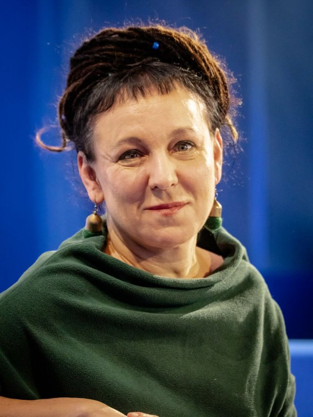{ loading=lazy }

A famous Polish writer who lives in Wrocław.

- Type: Person
- Subjects: Literature, Culture
- Country: Poland
- Image credit: CC_BY_SA | Harald Krichel | [source](https://commons.wikimedia.org/wiki/File:Olga_Tokarczuk-9739.jpg)
- Quests: [The great Wrocław dwarf rescue (pl_02)](../quest/pl_02.md)

---

### Panorama Racławicka
{ loading=lazy }

A giant painting all around you about a historic battle.

- Type: Place
- Subjects: History, Art, Culture
- Country: Poland
- Image credit: CC_BY_SA | Barbara Maliszewska
- Quests: [The great Wrocław dwarf rescue (pl_02)](../quest/pl_02.md)

---

### Parrot
{ loading=lazy }

A bright bird that can copy sounds.

- Type: Object
- Subjects: Animal, Science
- Country: Poland
- Image credit: CC_BY | Luc Viatour | [source](https://commons.wikimedia.org/wiki/File:Ara_ararauna_Luc_Viatour.jpg)
- Quests: [The Zoo (pl_04)](../quest/pl_04.md)

---

### Peacock
{ loading=lazy }

A colorful bird with a big tail of feathers.

- Type: Object
- Subjects: Animal, Science, Art
- Country: Poland
- Image credit: CC_BY_SA | Jebulon | [source](https://commons.wikimedia.org/wiki/File:Paonroue.JPG)
- Quests: [The Zoo (pl_04)](../quest/pl_04.md)

---

### Pierogi Recipe
Make a soft dough, fill with mashed potatoes and farmer’s cheese, seal, boil until they float—then pan-fry in butter with onions.

- Type: Object
- Subjects: Food
- Country: Poland
- Topics: [Pierogi Recipe](../topics/index.md#pierogi)

---

### Planetarium
{ loading=lazy }

A place where you can see the sky and stars indoors.

- Type: Place
- Subjects: Education, Science, Space
- Country: Poland
- Topics: [Solar System](../topics/index.md#solar_system), [Telescope](../topics/index.md#telescope)
- Image credit: CC0 | Atelier Hermann Walter

Bernhard Müller († 1930)
Karl Walter (* 7. Dezember 1874; † 11. October 1940) | [source](https://commons.wikimedia.org/wiki/File:Planetarium_Pfaffendorfer_Strasse_Leipzig_um_1927.jpg)
- Quests: [Copernicus and the Solar System (pl_07)](../quest/pl_07.md)

---

### Polish Dwarf (Wrocław gnomes)
{ loading=lazy }

Small dwarf statues hide around Wrocław. Finding them is a fun city game.

- Type: Concept
- Subjects: Community, Culture
- Year: 1700
- Country: Poland
- Topics: [Wroclaw Dwarves](../topics/index.md#wroclaw_dwarves)
- Image credit: CC0
- Quests: [Discover Warszawa (pl_01)](../quest/pl_01.md), [The great Wrocław dwarf rescue (pl_02)](../quest/pl_02.md)

---

### Polish Pierogi
{ loading=lazy }

Dumplings filled with things like potato, cheese, or fruit. They are a famous Polish dish.

- Type: Object
- Subjects: Food, Culture
- Year: 1600
- Country: Poland
- Topics: [Pierogi Recipe](../topics/index.md#pierogi)
- Image credit: CC0
- Quests: [Gingerbread & food market (pl_06)](../quest/pl_06.md)

---

### Port
{ loading=lazy }

A place where ships load and unload.

- Type: Place
- Subjects: Transportation, Community, Geography
- Country: Poland
- Topics: [Fisherman](../topics/index.md#fisherman)
- Image credit: CC_BY | Maxime Raynal from France | [source](https://commons.wikimedia.org/wiki/File:Port_and_lighthouse_overnight_storm_with_lightning_in_Port-la-Nouvelle.jpg)
- Quests: [The Amber Necklace of Gdańsk (pl_05)](../quest/pl_05.md)

---

### Road Bridge
{ loading=lazy }

A bridge for cars and buses.

- Type: Object
- Subjects: Transportation
- Country: Poland
- Topics: [Odra river](../topics/index.md#odra_river)
- Image credit: CC_BY_SA | Photographer: Dey.sandip Additional Credit: User Atention for water spot removal. | [source](https://commons.wikimedia.org/wiki/File:Anjarle_Bridge_and_Cows-fix.jpg)
- Quests: [A Voyage on the Odra River (pl_03)](../quest/pl_03.md)

---

### Rędziński Bridge
{ loading=lazy }

The longest cable‑stayed bridge in Poland.

- Type: Place
- Subjects: Geography, Transportation, Technology
- Country: Poland
- Topics: [Odra river](../topics/index.md#odra_river)
- Image credit: CC_BY_SA | Olgierd (Creative Commons licensed only) | [source](https://commons.wikimedia.org/wiki/File:Most_Rędziński_we_Wroclawiu.jpg)
- Quests: [A Voyage on the Odra River (pl_03)](../quest/pl_03.md)

---

### Saturn
{ loading=lazy }

A giant planet with bright rings and many moons.

- Type: Object
- Subjects: Space, Science
- Country: Poland
- Topics: [Solar System](../topics/index.md#solar_system)
- Image credit: CC0 | NASA/JPL-Caltech/SSI/Cornell | [source](https://commons.wikimedia.org/wiki/File:Top_view_of_the_rings_of_Saturn_by_Cassini_-_October_10,_2013.jpg)
- Quests: [Copernicus and the Solar System (pl_07)](../quest/pl_07.md)

---

### Seagull
{ loading=lazy }

A sea bird that lives near the coast.

- Type: Object
- Subjects: Animal, Environment
- Country: Poland
- Image credit: CC_BY_SA | Diliff | [source](https://commons.wikimedia.org/wiki/File:Black-headed_Gull_-_St_James's_Park,_London_-_Nov_2006.jpg)
- Quests: [The Amber Necklace of Gdańsk (pl_05)](../quest/pl_05.md)

---

### Seal
{ loading=lazy }

A wild sea animal that rests on beaches.

- Type: Object
- Subjects: Animal, Environment, Safety
- Country: Poland
- Image credit: CC_BY_SA | Charles J. Sharp | [source](https://commons.wikimedia.org/wiki/File:Common_seal_(Phoca_vitulina)_2.jpg)
- Quests: [The Amber Necklace of Gdańsk (pl_05)](../quest/pl_05.md)

---

### Seashell
{ loading=lazy }

A hard shell from a sea animal; good for crafts.

- Type: Object
- Subjects: Animal, Environment, Art
- Country: Poland
- Topics: [Neptune's fountain](../topics/index.md#neptune_fountain)
- Image credit: CC0 | George Chernilevsky | [source](https://commons.wikimedia.org/wiki/File:Flexopecten_ponticus_2008_G1.jpg)
- Quests: [The Amber Necklace of Gdańsk (pl_05)](../quest/pl_05.md)

---

### Ship
{ loading=lazy }

A big boat that carries people or goods.

- Type: Object
- Subjects: Transportation
- Country: Poland
- Topics: [Fisherman](../topics/index.md#fisherman)
- Image credit: CC_BY | Christian Ferrer | [source](https://commons.wikimedia.org/wiki/File:Rhapsody_(ship,_1996),_Sète_cf01.jpg)
- Quests: [The Amber Necklace of Gdańsk (pl_05)](../quest/pl_05.md)

---

### Sign
{ loading=lazy }

A board with simple facts to help you learn.

- Type: Object
- Subjects: Education, Community
- Country: Poland
- Image credit: CC_BY_SA | Frank Schulenburg | [source](https://commons.wikimedia.org/wiki/File:Railroad_Park_Resort_in_Dunsmuir,_June_2021.jpg)
- Quests: [The Zoo (pl_04)](../quest/pl_04.md)

---

### Sky Tower Plaza
{ loading=lazy }

A modern plaza where people meet near the tower.

- Type: Place
- Subjects: Geography, Community, Recreation
- Country: Poland
- Image credit: CC_BY_SA | JamesYoung8167 | [source](https://commons.wikimedia.org/wiki/File:Xiamen_Shimao_Straits_Tower_2016-02-09.jpg)
- Quests: [The great Wrocław dwarf rescue (pl_02)](../quest/pl_02.md)

---

### Solar System
{ loading=lazy }

The Sun and the eight planets that travel around it.

- Type: Concept
- Subjects: Space, Science
- Country: Poland
- Topics: [Solar System](../topics/index.md#solar_system)
- Image credit: CC0 | Originally uploaded from NASA by Bricktop; edited by Deuar, KFP, TotoBaggins, City303, JCPagc2015 | [source](https://commons.wikimedia.org/wiki/File:Moons_of_solar_system_v7.jpg)
- Quests: [Copernicus and the Solar System (pl_07)](../quest/pl_07.md)

---

### Telescope
{ loading=lazy }

A tool that helps us see far‑away things in the sky.

- Type: Object
- Subjects: Science, Technology, Space
- Country: Poland
- Topics: [Telescope](../topics/index.md#telescope)
- Image credit: CC_BY_SA | Palonitor | [source](https://commons.wikimedia.org/wiki/File:Kométa_C-2020_F3_(NEOWISE).jpg)
- Quests: [Copernicus and the Solar System (pl_07)](../quest/pl_07.md)

---

### Torun Town Hall
{ loading=lazy }

A big Gothic building in Toruń next to the market square.

- Type: Place
- Subjects: History, Geography, Culture
- Country: Poland
- Image credit: CC_BY_SA | Krzysztof Golik | [source](https://commons.wikimedia.org/wiki/File:Old_town_hall_in_Torun_(6).jpg)
- Quests: [Gingerbread & food market (pl_06)](../quest/pl_06.md)

---

### Torunian gingerbread
{ loading=lazy }

a traditional Polish treat made with spices and honey, often shaped in beautiful designs.

- Type: Object
- Subjects: Food
- Country: Poland
- Topics: [Gingerbread](../topics/index.md#gingerbread), [Pierogi Recipe](../topics/index.md#pierogi)
- Image credit: CC0 | Marcin Floryan, CC BY 2.5 <https://creativecommons.org/licenses/by/2.5>, via Wikimedia Commons | [source](https://commons.wikimedia.org/w/index.php?curid=1300867)
- Quests: [Gingerbread & food market (pl_06)](../quest/pl_06.md)

---

### Toruń
{ loading=lazy }

A city in Poland where Nicolaus Copernicus was born.

- Type: Place
- Subjects: Geography, History, Culture
- Country: Poland
- Image credit: CC_BY_SA | Jakub Hałun | [source](https://commons.wikimedia.org/wiki/File:Widok_zza_Wisły_na_Toruń,_20210908_1711_2822.jpg)
- Quests: [Copernicus and the Solar System (pl_07)](../quest/pl_07.md)

---

### Town Hall
{ loading=lazy }

The place where city leaders work and meet.

- Type: Concept
- Subjects: Civics, Community, History
- Country: Poland
- Image credit: CC_BY_SA | Krzysztof Golik | [source](https://commons.wikimedia.org/wiki/File:Town_hall_of_Aosta_(3).jpg)
- Quests: [The great Wrocław dwarf rescue (pl_02)](../quest/pl_02.md)

---

### Train Bridge
{ loading=lazy }

A bridge with tracks for trains.

- Type: Object
- Subjects: Transportation, Technology
- Country: Poland
- Topics: [Odra river](../topics/index.md#odra_river)
- Image credit: CC_BY_SA | Kabelleger / David Gubler | [source](https://commons.wikimedia.org/wiki/File:FCCA_GE_C30-7_Infiernillo_Viaduct.jpg)
- Quests: [A Voyage on the Odra River (pl_03)](../quest/pl_03.md)

---

### Tumski Bridge
{ loading=lazy }

A famous bridge with love locks and gas lanterns.

- Type: Place
- Subjects: Culture, Geography, Community
- Country: Poland
- Topics: [Odra river](../topics/index.md#odra_river)
- Image credit: CC_BY_SA | Aw58 | [source](https://commons.wikimedia.org/wiki/File:Wrocław,_most_Tumski_widziany_z_bulwaru_Piotra_Włostowica_(MW).jpg)
- Quests: [A Voyage on the Odra River (pl_03)](../quest/pl_03.md)

---

### Uranus
{ loading=lazy }

A blue‑green planet that spins on its side.

- Type: Object
- Subjects: Space, Science
- Country: Poland
- Topics: [Solar System](../topics/index.md#solar_system)
- Image credit: CC0 | NASA/JPL-Caltech | [source](https://commons.wikimedia.org/wiki/File:Uranus2.jpg)
- Quests: [Copernicus and the Solar System (pl_07)](../quest/pl_07.md)

---

### Venus
{ loading=lazy }

A very hot planet covered by thick clouds.

- Type: Object
- Subjects: Space, Science
- Country: Poland
- Topics: [Solar System](../topics/index.md#solar_system)
- Image credit: CC_BY | ESO/Y. Beletsky | [source](https://commons.wikimedia.org/wiki/File:Mercury,_Venus_and_the_Moon_Align.jpg)
- Quests: [Copernicus and the Solar System (pl_07)](../quest/pl_07.md)

---

### Vistula River
{ loading=lazy }

Poland’s longest river; it flows to the Baltic Sea.

- Type: Place
- Subjects: Geography, Environment
- Country: Poland
- Image credit: CC_BY_SA | Jakub Hałun | [source](https://commons.wikimedia.org/wiki/File:20200529_Widok_ze_Skały_Okrążek_na_Opactwo_w_Tyńcu_1735_2128.jpg)
- Quests: [The great Wrocław dwarf rescue (pl_02)](../quest/pl_02.md)

---

### Vistula River (Wisła)
{ loading=lazy }

The longest river in Poland is called Wisła or Vistula. It flows through Kraków and Warsaw.

- Type: Place
- Subjects: Geography, Environment
- Country: Poland
- Topics: [Odra river](../topics/index.md#odra_river), [Wroclaw](../topics/index.md#wroclaw)
- Image credit: CC0
- Quests: [A Voyage on the Odra River (pl_03)](../quest/pl_03.md)

---

### Wars and Sawa
{ loading=lazy }

Two legendary figures who gave Warsaw its name. Wars was a brave warrior and Sawa was a beautiful mermaid who lived in the Vistula River.

- Type: Concept
- Subjects: Community, Culture
- Year: 1300
- Country: Poland
- Topics: [Warsaw](../topics/index.md#warsaw)
- Image credit: CC0 | [source](https://en.m.wikipedia.org/wiki/File:Rzeźba_Warsa_i_Sawy_01.jpg)
- Quests: [Discover Warszawa (pl_01)](../quest/pl_01.md)

---

### Waves
{ loading=lazy }

Moving water on the sea.

- Type: Concept
- Subjects: Environment, Science
- Country: Poland
- Topics: [Fisherman](../topics/index.md#fisherman)
- Image credit: CC_BY_SA | Roger McLassus | [source](https://commons.wikimedia.org/wiki/File:2006-01-14_Surface_waves.jpg)
- Quests: [The Amber Necklace of Gdańsk (pl_05)](../quest/pl_05.md)

---

### Wroclaw: Cathedral
{ loading=lazy }

A big, important church where people pray. You can climb the tower for a view.

- Type: Place
- Subjects: History, Culture
- Country: Poland
- Image credit: CC0 | [source](https://it.m.wikipedia.org/wiki/File:Wroclaw-Archicathedral-116.JPG)
- Quests: [The great Wrocław dwarf rescue (pl_02)](../quest/pl_02.md)

---

### Wroclaw: Sky Tower
{ loading=lazy }

One of the tallest buildings in Poland. It has shops and a viewpoint.

- Type: Place
- Subjects: Geography, Community, Culture
- Country: Poland
- Image credit: CC0 | [source](https://it.wikipedia.org/wiki/File:Wrocław,_2006_-_2012_-_budowa_Sky_Tower_-_fotopolska.eu_(311325).jpg)
- Quests: [The great Wrocław dwarf rescue (pl_02)](../quest/pl_02.md)

---

### Wrocław
{ loading=lazy }

A city in Poland with rivers, bridges, and history.

- Type: Place
- Subjects: Geography, History, Culture
- Country: Poland
- Topics: [Wroclaw Dwarves](../topics/index.md#wroclaw_dwarves), [Wroclaw](../topics/index.md#wroclaw)
- Image credit: CC_BY_SA | Pudelek (Marcin Szala) | [source](https://commons.wikimedia.org/wiki/File:Wrocław_Główny_(Breslau_Hauptbahnhof)_by_night.JPG)
- Quests: [The Zoo (pl_04)](../quest/pl_04.md)

---

### Wrocław Bridges
{ loading=lazy }

Many bridges cross the Odra River in Wrocław.

- Type: Concept
- Subjects: Geography, Transportation, Community
- Country: Poland
- Topics: [Odra river](../topics/index.md#odra_river), [Wroclaw](../topics/index.md#wroclaw)
- Image credit: CC_BY_SA | Jar.ciurus | [source](https://commons.wikimedia.org/wiki/File:Wroclaw_Most_Mlynski_w_porannej_mgle_przed_switem.jpg)
- Quests: [A Voyage on the Odra River (pl_03)](../quest/pl_03.md)

---

### Wrocław Dwarf Statue
{ loading=lazy }

A small city statue; dwarfs are Wrocław’s symbol.

- Type: Object
- Subjects: Culture, Community, History
- Country: Poland
- Topics: [Wroclaw Dwarves](../topics/index.md#wroclaw_dwarves)
- Image credit: CC_BY_SA | Pnapora | [source](https://commons.wikimedia.org/wiki/File:Trener_(Coach)_Wroclaw_dwarf_01.jpg)
- Quests: [The great Wrocław dwarf rescue (pl_02)](../quest/pl_02.md)

---

### Wrocław Dwarfs
{ loading=lazy }

Tiny statues across the city that love to play tricks.

- Type: Concept
- Subjects: Culture, Community, History
- Country: Poland
- Topics: [Wroclaw Dwarves](../topics/index.md#wroclaw_dwarves)
- Image credit: CC_BY_SA | Matti Blume | [source](https://commons.wikimedia.org/wiki/File:Dwarf,_Wroclaw_(P1180336).jpg)
- Quests: [The great Wrocław dwarf rescue (pl_02)](../quest/pl_02.md)

---

### Wrocław Flag
{ loading=lazy }

The city flag that must be found and returned.

- Type: Object
- Subjects: Culture, Community, History
- Country: Poland
- Image credit: CC0 | [source](https://commons.wikimedia.org/wiki/File:POL_Wroc%C5%82aw_flag.svg)
- Quests: [The Zoo (pl_04)](../quest/pl_04.md)

---

### Wrocław Market Square
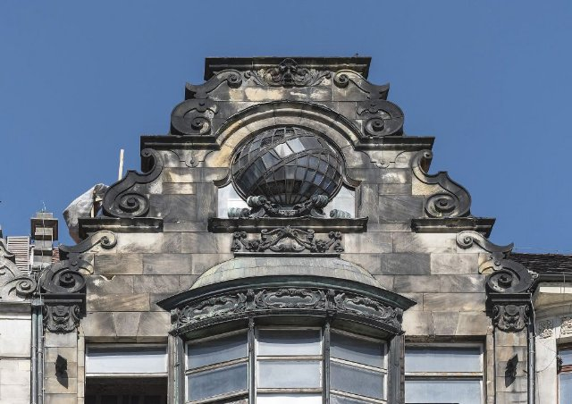{ loading=lazy }

The main square of the Old Town, full of life.

- Type: Place
- Subjects: Geography, Culture, Community, History
- Country: Poland
- Image credit: CC_BY_SA | Jacek Halicki | [source](https://commons.wikimedia.org/wiki/File:2016_Wrocław,_Rynek_49.jpg)
- Quests: [The great Wrocław dwarf rescue (pl_02)](../quest/pl_02.md)

---

### Wrocław Multimedia Fountain
{ loading=lazy }

Water that dances with music and colorful lights.

- Type: Place
- Subjects: Culture, Technology, Recreation
- Country: Poland
- Image credit: CC_BY_SA | Piotr Walczak & Konradr | [source](https://commons.wikimedia.org/wiki/File:Wrocławska_fontanna_Piotr_Walczak2.jpg)
- Quests: [The great Wrocław dwarf rescue (pl_02)](../quest/pl_02.md)

---

### Wrocław Zoo
{ loading=lazy }

A big zoo in Wrocław with many animals to learn about.

- Type: Place
- Subjects: Geography, Education, Animal
- Country: Poland
- Topics: [wroclaw zoo](../topics/index.md#wroclaw_zoo)
- Image credit: CC_BY | Palickap | [source](https://commons.wikimedia.org/wiki/File:Zoo_Wrocław,_plan.jpg)
- Quests: [The Zoo (pl_04)](../quest/pl_04.md)

---

### Zloty Currency
{ loading=lazy }

The Polish currency is called the złoty. Coins and notes have Polish symbols.

- Type: Concept
- Subjects: Money, Geography
- Country: Poland
- Topics: [Pierogi Recipe](../topics/index.md#pierogi)
- Image credit: CC0 | [source](https://commons.wikimedia.org/wiki/File:Bitllets_de_banc_polonesos_2024.jpg)
- Quests: [Gingerbread & food market (pl_06)](../quest/pl_06.md)

---

### Zoo Director
{ loading=lazy }

The person who runs the zoo and helps visitors.

- Type: Person
- Subjects: Community, Education
- Country: Poland
- Topics: [wroclaw zoo](../topics/index.md#wroclaw_zoo)
- Image credit: CC0 | USFWS Pacific | [source](https://commons.wikimedia.org/wiki/File:USFWS_director_visits_Oregon_Zoo_(51946414879).jpg)
- Quests: [The Zoo (pl_04)](../quest/pl_04.md)

---

### Zoo Keeper
{ loading=lazy }

A person who cares for animals at the zoo.

- Type: Person
- Subjects: Community, Animal, Education
- Country: Poland
- Topics: [wroclaw zoo](../topics/index.md#wroclaw_zoo)
- Image credit: CC_BY_SA | 좀비 브렌다 | [source](https://commons.wikimedia.org/wiki/File:Hadada_Ibis_perched_on_Dallas_Zoo_keeper.jpg)
- Quests: [The Zoo (pl_04)](../quest/pl_04.md)

---

### Żuraw Crane
{ loading=lazy }

An old port crane and city gate on the river.

- Type: Place
- Subjects: History, Technology, Geography
- Country: Poland
- Image credit: CC_BY_SA | Jacek Halicki | [source](https://commons.wikimedia.org/wiki/File:2024_Żuraw_wieżowy,_ul._Letnia_w_Kłodzku_(2).jpg)
- Quests: [The Amber Necklace of Gdańsk (pl_05)](../quest/pl_05.md)

## Others

### Berlin
{ loading=lazy }

The capital city of Germany.

- Type: Place
- Subjects: Geography, Culture
- Country: Germany
- Image credit: CC_BY_SA | ArildV | [source](https://commons.wikimedia.org/wiki/File:Berlin_Mitte_June_2023_01.jpg)

---

### Flag of Germany
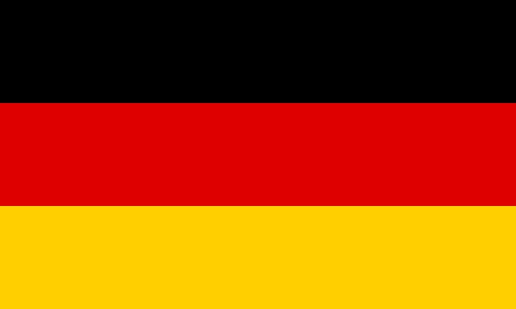{ loading=lazy }

The flag of Germany has three horizontal stripes: black, red, and yellow. Germany is famous for cars, castles, and fairy tales!

- Rationale: The German flag helps kids learn about France's important neighbor country
- Type: Concept
- Subjects: Geography, Culture
- Year: 1949
- Country: Germany
- Topics: [Flags of Europe](../topics/index.md#flags_euroe), [Countries around France](../topics/index.md#france_countries_around), [Poland Countries](../topics/index.md#poland_countries_around)
- Image credit: CC0
- Quests: [The neighbors of France (fr_00)](../quest/fr_00.md), [The neighbors of Poland (pl_00)](../quest/pl_00.md)

---

### Germany
{ loading=lazy }

A country in Europe. Capital is Berlin.

- Type: Place
- Subjects: Geography, Culture
- Country: Germany
- Topics: [Countries around France](../topics/index.md#france_countries_around), [Poland Countries](../topics/index.md#poland_countries_around)
- Image credit: CC_BY_SA | Ansgar Koreng | [source](https://commons.wikimedia.org/wiki/File:Kloster_Paulinzella,_Thüringen,_170316,_ako_(2).jpg)

---

### Venus de Milo
{ loading=lazy }

A beautiful ancient statue of a woman made from white marble. Her arms are missing but she is still considered one of the most beautiful statues ever made.

- Rationale: This statue teaches kids about ancient Greek art and how old things can still be beautiful
- Type: Concept
- Subjects: Art, History, Culture
- Year: 130
- Country: Greece
- Topics: [Louvre](../topics/index.md#louvre)
- Image credit: CC0

---

### Flag of Italy
{ loading=lazy }

The flag of Italy has three vertical stripes: green, white, and red. The colors look like basil, mozzarella, and tomatoes on pizza!

- Rationale: The Italian flag connection to pizza helps kids remember the colors easily
- Type: Concept
- Subjects: Geography, Culture
- Year: 1946
- Country: Italy
- Topics: [Flags of Europe](../topics/index.md#flags_euroe), [Countries around France](../topics/index.md#france_countries_around)
- Image credit: CC0
- Quests: [The neighbors of France (fr_00)](../quest/fr_00.md)

---

### Italy
{ loading=lazy }

A country in Europe. Capital is Rome.

- Type: Place
- Subjects: Geography, Culture
- Country: Italy
- Topics: [Countries around France](../topics/index.md#france_countries_around)
- Image credit: CC_BY_SA | Agnes Monkelbaan | [source](https://commons.wikimedia.org/wiki/File:Bergwandeltocht_van_Peio_Paese_naar_Lago_Covel_(1,839_m)_in_het_Nationaal_park_Stelvio_(Italy)_23.jpg)

---

### Mona Lisa
{ loading=lazy }

The most famous painting in the world! A woman with a mysterious smile painted by Leonardo da Vinci. She seems to follow you with her eyes.

- Rationale: Kids are fascinated by this mysterious painting and it introduces Renaissance art
- Type: Object
- Subjects: Art, History, Culture
- Year: 1503
- Country: Italy
- Topics: [Louvre](../topics/index.md#louvre)
- Words: woman
- Image credit: CC0
- Quests: [Paris! (fr_01)](../quest/fr_01.md)

---

### Rome
{ loading=lazy }

The capital city of Italy.

- Type: Place
- Subjects: Geography, Culture
- Country: Italy
- Image credit: CC_BY_SA | Dietmar Rabich | [source](https://commons.wikimedia.org/wiki/File:Rome_(Italy),_Piazza_della_Rotonda,_Hub_of_a_Coach_--_2013_--_10.jpg)

---

### Flag of Andorra
{ loading=lazy }

The flag of Andorra has blue, yellow, and red stripes with a coat of arms in the middle. Andorra is a tiny country between France and Spain.

- Rationale: Learning about small countries helps kids understand European diversity
- Type: Concept
- Subjects: Geography, Culture
- Year: 1866
- Country: Spain
- Image credit: CC0

---

### Flag of Spain
{ loading=lazy }

The flag of Spain has red and yellow horizontal stripes. The colors are like the sun and peppers! Spain invented flamenco dancing.

- Rationale: The Spanish flag helps kids learn about France's southern neighbor and its vibrant culture
- Type: Concept
- Subjects: Geography, Culture
- Year: 1981
- Country: Spain
- Topics: [Flags of Europe](../topics/index.md#flags_euroe), [Countries around France](../topics/index.md#france_countries_around)
- Image credit: CC0
- Quests: [The neighbors of France (fr_00)](../quest/fr_00.md)

---

### Madrid
{ loading=lazy }

The capital city of Spain.

- Type: Place
- Subjects: Geography, Culture
- Country: Spain
- Image credit: CC_BY | Dmitry Dzhus from London | [source](https://commons.wikimedia.org/wiki/File:Madrid_(38624991251).jpg)

---

### Spain
{ loading=lazy }

A country in Europe. Capital is Madrid. Spain invented flamenco dancing.

- Type: Place
- Subjects: Geography, Culture
- Country: Spain
- Topics: [Countries around France](../topics/index.md#france_countries_around)
- Image credit: CC_BY_SA | Diego Delso | [source](https://commons.wikimedia.org/wiki/File:Palacio_Real_de_Olite,_Navarra,_España,_2015-01-06,_DD_07-09_HDR.JPG)

