# Cards(pl)

Language: [english](./index.md) - [french](./index.fr.md) - polish - [italian](./index.it.md)

!!! note "Educators: help improving these cards!"
    **Improve translations**: [comment here](https://docs.google.com/spreadsheets/d/1M3uOeqkbE4uyDs5us5vO-nAFT8Aq0LGBxjjT_CSScWw/edit?gid=415931977#gid=415931977)  

Total found:**358**

## International

### Alpy

Wysokie pasmo górskie w Europie.

- Type: Place
- Subjects: Geography, Environment
- Country: International
- Quests: [Mont Blanc i góry (fr_08)](../quest/fr_08.pl.md)

### animal_chimpanzee

- Type: None
- Country: International
- Quests: [Zoo (pl_04)](../quest/pl_04.pl.md)

### animal_lion_cub
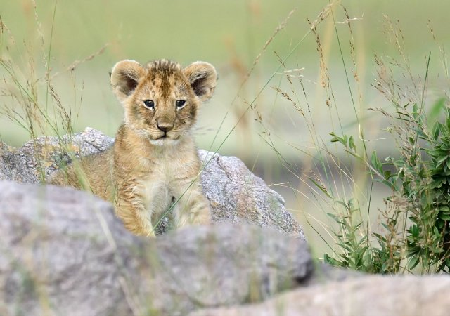

- Type: Object
- Country: International
- Quests: [Zoo (pl_04)](../quest/pl_04.pl.md)

### animal_lion_young_male

- Type: Object
- Country: International
- Quests: [Zoo (pl_04)](../quest/pl_04.pl.md)

### Autobus

Duży pojazd, którym można przewieźć wiele osób.

- Type: Object
- Subjects: Transportation, Community
- Country: International
- Quests: [Odkryj Warszawę (pl_01)](../quest/pl_01.pl.md)

### Badylarz

Osoba sprzedająca świeże owoce i warzywa.

- Type: Person
- Subjects: History, Culture
- Country: International
- Quests: [Jedzenie i targ (fr_09)](../quest/fr_09.pl.md)

### BANAN

- Type: Object
- Country: International
- Quests: [Zoo (pl_04)](../quest/pl_04.pl.md)

### Belgia

Państwo w Europie. Stolicą jest Bruksela.

- Type: Place
- Subjects: Geography, Culture
- Country: International

### Berno

Stolica Szwajcarii.

- Type: Place
- Subjects: Geography, Culture
- Country: International

### Białoruś

Państwo w Europie. Stolicą jest Mińsk.

- Type: Place
- Subjects: Geography, Culture
- Country: International

### Bilet na Wieżę Eiffla

Specjalny dokument umożliwiający odwiedzenie słynnej wysokiej wieży w Paryżu, we Francji.

- Type: Object
- Subjects: Science
- Country: International
- Quests: [Paryż! (fr_01)](../quest/fr_01.pl.md)

### Bobsleje

Szybkie sanki służące do zjeżdżania po lodzie.

- Type: Object
- Subjects: Sport, Recreation
- Country: International
- Quests: [Mont Blanc i góry (fr_08)](../quest/fr_08.pl.md)

### Boisko do piłki nożnej

Trawiaste boisko, na którym gra się w piłkę nożną.

- Type: Place
- Subjects: Sport, Recreation, Community
- Country: International
- Quests: [Odkryj Warszawę (pl_01)](../quest/pl_01.pl.md)

### Bramka

Siatka, do której próbujesz strzelić gola.

- Type: Object
- Subjects: Sport, Recreation
- Country: International
- Quests: [Odkryj Warszawę (pl_01)](../quest/pl_01.pl.md)

### Bratysława

Stolica Słowacji.

- Type: Place
- Subjects: Geography, Culture
- Country: International

### Bruksela

Stolica Belgii.

- Type: Place
- Subjects: Geography, Culture
- Country: International

### CHLEB

Pyszne danie z mąki i wody. Można zrobić kanapki z chleba!

- Type: Object
- Subjects: Food, Culture
- Country: International
- Quests: [Jedzenie i targ (fr_09)](../quest/fr_09.pl.md)

### Cynamon

Słodka przyprawa wytwarzana z kory drzewa.

- Type: Object
- Subjects: Food, Plant
- Country: International
- Quests: [Pierniki i targ spożywczy (pl_06)](../quest/pl_06.pl.md)

### Cytrynowy

Żółty owoc o bardzo kwaśnym smaku. Cytryny służą do robienia lemoniady!

- Type: Object
- Subjects: Food, Culture
- Country: International
- Quests: [Jedzenie i targ (fr_09)](../quest/fr_09.pl.md)

### Czechy

Kraj w Europie. Stolicą jest Praga.

- Type: Place
- Subjects: Geography, Culture
- Country: International

### Dom na łodzi

Dom, który unosi się na wodzie jak łódź. Ludzie mogą mieszkać w domkach-łódkach!

- Type: Place
- Subjects: Geography, Environment
- Country: International

### Drożdże

Drożdże to magiczny proszek, który sprawia, że ​​chleb jest miękki i smaczny!

- Type: Object
- Subjects: Food, Culture
- Country: International

### Dzień Niepodległości (Polska)

Święto narodowe obchodzone 11 listopada.

- Type: Concept
- Subjects: Civics, History, Time
- Country: International
- Quests: [Odkryj Warszawę (pl_01)](../quest/pl_01.pl.md)

### Flaga Belgii
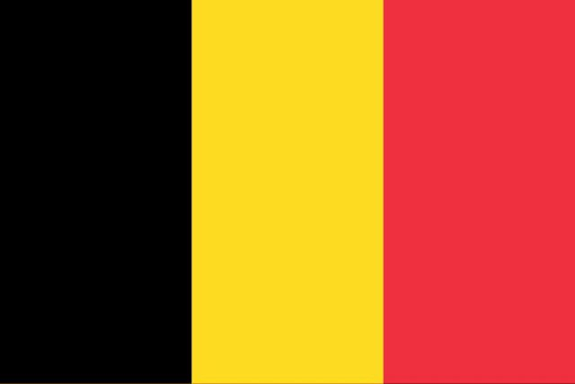

Flaga Belgii ma trzy pionowe pasy: czarny, żółty i czerwony. Belgia słynie z czekolady i gofrów!

- Rationale: Belgium's unique vertical stripes help kids distinguish different flag patterns
- Type: Concept
- Subjects: Geography, Culture
- Year: 1831
- Country: International
- Quests: [Sąsiedzi Francji (fr_00)](../quest/fr_00.pl.md)

### Flaga Białorusi

Flaga Białorusi ma poziome, czerwone i zielone pasy z pięknymi, tradycyjnymi wzorami po bokach. Białoruś jest sąsiadem Polski.

- Rationale: Learning neighboring countries helps kids understand regional geography
- Type: Concept
- Subjects: Geography, Culture
- Year: 1995
- Country: International
- Quests: [Sąsiedzi Polski (pl_00)](../quest/pl_00.pl.md)

### Flaga Litwy

Flaga ma poziome pasy w kolorze żółtym, zielonym i czerwonym. Litwa to kraj bałtycki z pięknymi lasami i plażami.

- Rationale: Baltic countries teach kids about northern European geography and Poland's neighbors
- Type: Concept
- Subjects: Geography, Culture
- Year: 1988
- Country: International
- Quests: [Sąsiedzi Polski (pl_00)](../quest/pl_00.pl.md)

### Flaga Luksemburga

Flaga Luksemburga ma poziome pasy w kolorze czerwonym, białym i jasnoniebieskim. Luksemburg to bardzo mały kraj, w którym mówi się trzema językami!

- Rationale: Small multilingual countries teach kids about European diversity
- Type: Concept
- Subjects: Geography, Culture
- Year: 1972
- Country: International
- Quests: [Sąsiedzi Francji (fr_00)](../quest/fr_00.pl.md)

### Flaga Republiki Czeskiej

Flaga ma biało-czerwone pasy z niebieskim trójkątem. Czechy słyną z pięknego Zamku Praskiego i kryształowego szkła.

- Rationale: Central European countries help kids understand the region around Poland
- Type: Concept
- Subjects: Geography, Culture
- Year: 1920
- Country: International
- Quests: [Sąsiedzi Francji (fr_00)](../quest/fr_00.pl.md)

### Flaga Rosji

Flaga z białymi, niebieskimi i czerwonymi paskami. Reprezentuje Rosję.

- Type: Concept
- Subjects: Community, Culture
- Country: International
- Quests: [Sąsiedzi Polski (pl_00)](../quest/pl_00.pl.md)

### Flaga Szwajcarii

Flaga Szwajcarii jest czerwona z białym krzyżem pośrodku. Wygląda jak apteczka pierwszej pomocy! Szwajcaria słynie z gór i sera.

- Rationale: The Swiss flag's unique cross design helps kids remember this mountain country
- Type: Concept
- Subjects: Geography, Culture
- Year: 1889
- Country: International
- Quests: [Sąsiedzi Francji (fr_00)](../quest/fr_00.pl.md)

### Flaga Słowacji
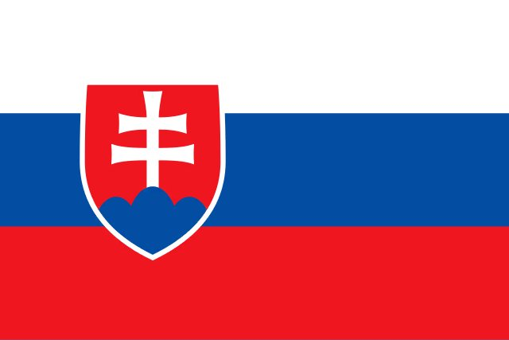

Flaga w kolorach białym, niebieskim i czerwonym. Reprezentuje Słowację.

- Type: Concept
- Subjects: Community, Culture
- Country: International
- Quests: [Sąsiedzi Francji (fr_00)](../quest/fr_00.pl.md)

### Flaga Ukrainy

Flaga w kolorach niebieskim i żółtym, przypominającym niebo i słońce. Reprezentuje Ukrainę.

- Type: Concept
- Subjects: Community, Culture
- Country: International
- Quests: [Sąsiedzi Francji (fr_00)](../quest/fr_00.pl.md)

### Forma do pierników

Narzędzie w kształcie ciasteczka, które pozwala na tworzenie ciekawych kształtów.

- Type: Object
- Subjects: Food, Art
- Country: International
- Quests: [Pierniki i targ spożywczy (pl_06)](../quest/pl_06.pl.md)

### Francuski plakat szkolny

Duży obraz z informacjami, który wisi na ścianach klas we francuskich szkołach.

- Type: Object
- Subjects: Education
- Country: International
- Quests: [Juliusz Verne i transport (fr_03)](../quest/fr_03.pl.md)

### Goździki

Mocna przyprawa używana do wzbogacania smaku potraw.

- Type: Object
- Subjects: Food, Plant
- Country: International
- Quests: [Pierniki i targ spożywczy (pl_06)](../quest/pl_06.pl.md)

### Góra

Filary ziemi

- Type: Concept
- Subjects: Environment, Education
- Country: International
- Quests: [Mont Blanc i góry (fr_08)](../quest/fr_08.pl.md)

### ice_arctic

- Type: Place
- Country: International
- Quests: [Zoo (pl_04)](../quest/pl_04.pl.md)

### Ile-de-France

Region we Francji, w którym znajduje się stolica, Paryż. Mieszka tu wielu ludzi!

- Type: Place
- Subjects: Geography, Environment
- Country: International
- Quests: [Paryż! (fr_01)](../quest/fr_01.pl.md)

### JABŁKO

- Type: Object
- Country: International
- Quests: [Zoo (pl_04)](../quest/pl_04.pl.md)

### Jajka

Pokarm z kurczaków, używany do pieczenia i gotowania.

- Type: Object
- Subjects: Food, Animal
- Country: International
- Quests: [Pierniki i targ spożywczy (pl_06)](../quest/pl_06.pl.md)

### Kapelusz

Ciepła czapka na głowę.

- Type: Object
- Subjects: Health, Safety, Weather
- Country: International
- Quests: [Mont Blanc i góry (fr_08)](../quest/fr_08.pl.md)

### Kijów

Stolica Ukrainy.

- Type: Place
- Subjects: Geography, Culture
- Country: International

### Klasa

Pomieszczenie w szkole, w którym uczniowie siedzą i uczą się nowych rzeczy od nauczyciela.

- Type: Place
- Subjects: Education, Community
- Country: International
- Quests: [System edukacji (fr_02)](../quest/fr_02.pl.md), [Juliusz Verne i transport (fr_03)](../quest/fr_03.pl.md)

### Kolumna Króla Zygmunta

Wysoka kolumna ku czci króla Zygmunta na Placu Zamkowym.

- Type: Place
- Subjects: History, Culture
- Country: International
- Quests: [Odkryj Warszawę (pl_01)](../quest/pl_01.pl.md)

### Kompas

Narzędzie, które pomaga rysować idealne okręgi. Ma dwie nogi jak nożyczki.

- Type: Object
- Subjects: Math
- Country: International
- Quests: [System edukacji (fr_02)](../quest/fr_02.pl.md)

### Konstytucja 3 Maja

Historyczna polska konstytucja obchodzona 3 Maja.

- Type: Concept
- Subjects: Civics, History, Time
- Country: International
- Quests: [Odkryj Warszawę (pl_01)](../quest/pl_01.pl.md)

### Korona króla Zygmunta

Korona króla, która spadła i musi zostać odnaleziona.

- Type: Object
- Subjects: History, Culture
- Country: International
- Quests: [Odkryj Warszawę (pl_01)](../quest/pl_01.pl.md)

### Koło

Okrągły kształt bez rogów. Koła wyglądają jak koła, piłki i monety!

- Type: Concept
- Subjects: Math
- Country: International
- Quests: [System edukacji (fr_02)](../quest/fr_02.pl.md)

### Krab
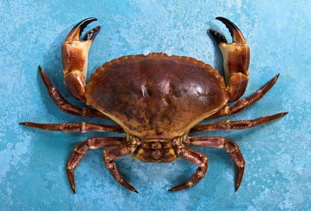

Zwierzę morskie z dużymi szczypcami i twardą skorupą. Kraby chodzą bokiem po plaży!

- Type: Object
- Subjects: Food, Culture
- Country: International
- Quests: [Jedzenie i targ (fr_09)](../quest/fr_09.pl.md)

### Kucharz

Osoba przygotowująca jedzenie.

- Type: Person
- Subjects: Community, Food
- Country: International
- Quests: [Pierniki i targ spożywczy (pl_06)](../quest/pl_06.pl.md)

### Kuchnia

Pomieszczenie, w którym ludzie gotują i pieką.

- Type: Place
- Subjects: Food
- Country: International
- Quests: [Pierniki i targ spożywczy (pl_06)](../quest/pl_06.pl.md)

### Kupiec handlujący serem

Osoba sprzedająca wiele rodzajów sera.

- Type: Person
- Subjects: History, Culture
- Country: International
- Quests: [Jedzenie i targ (fr_09)](../quest/fr_09.pl.md)

### Kwadrat

Narzędzie w kształcie trójkąta, służące do rysowania linii prostych i kątów prostych w matematyce.

- Type: Object
- Subjects: Math
- Country: International
- Quests: [System edukacji (fr_02)](../quest/fr_02.pl.md)

### Kładki dla pieszych

Małe mostki dla pieszych. Chronią przed ruchem ulicznym.

- Type: Place
- Subjects: Geography, Environment
- Country: International
- Quests: [Paryż Sekwana (fr_10)](../quest/fr_10.pl.md)

### Leonardo da Vinci

Niesamowity artysta i naukowiec z Włoch. Namalował Monę Lisę i wynalazł maszyny latające setki lat przed samolotami!

- Type: Person
- Subjects: Art, Science, History
- Year: 1452
- Country: International

### Lew

Duży kot zwany królem zwierząt. Żyje w grupach zwanych stadami.

- Type: Object
- Subjects: Animal, Environment
- Country: International

### Lina

Mocna lina używana do zapewnienia bezpieczeństwa podczas wspinaczki.

- Type: Object
- Subjects: Safety, Technology, Sport
- Country: International
- Quests: [Mont Blanc i góry (fr_08)](../quest/fr_08.pl.md)

### Linia

Linia prosta, która prowadzi z jednego punktu do drugiego. Linie mogą być długie lub krótkie.

- Type: Concept
- Subjects: Math
- Country: International
- Quests: [System edukacji (fr_02)](../quest/fr_02.pl.md)

### Linijka

Proste narzędzie do pomiaru długości przedmiotów. Linijki mają cyfry i linie.

- Type: Object
- Subjects: Math
- Country: International
- Quests: [System edukacji (fr_02)](../quest/fr_02.pl.md)

### Litwa

Państwo w Europie. Stolicą jest Wilno.

- Type: Place
- Subjects: Geography, Culture
- Country: International

### Lodowiec

Wolno poruszający się lód występujący w wysokich górach.

- Type: Concept
- Subjects: Geography, Science, Environment
- Country: International
- Quests: [Mont Blanc i góry (fr_08)](../quest/fr_08.pl.md)

### Luksemburg

Państwo w Europie. Stolicą jest miasto Luksemburg.

- Type: Place
- Subjects: Geography, Culture
- Country: International

### Lód

Zamarznięta woda, która może być bardzo śliska.

- Type: Concept
- Subjects: Weather, Environment, Science
- Country: International
- Quests: [Mont Blanc i góry (fr_08)](../quest/fr_08.pl.md)

### Mapa Europy

Mapa przedstawiająca wszystkie kraje Europy. Możesz zobaczyć, gdzie znajdują się Francja, Polska, Niemcy i inne kraje.

- Rationale: Maps help kids understand where different countries are and how they connect
- Type: Concept
- Subjects: Geography, Education
- Year: 2000
- Country: International
- Quests: [Sąsiedzi Francji (fr_00)](../quest/fr_00.pl.md), [Sąsiedzi Polski (pl_00)](../quest/pl_00.pl.md)

### Mapa Wieży Eiffla

Mapa pokazująca lokalizację słynnej wysokiej wieży w Paryżu.

- Type: Object
- Subjects: Community, Culture
- Country: International
- Quests: [Paryż! (fr_01)](../quest/fr_01.pl.md)

### Maria Skłodowska‑Curie

Naukowiec, który zdobył dwie Nagrody Nobla.

- Type: Person
- Subjects: Science, History
- Country: International
- Quests: [Odkryj Warszawę (pl_01)](../quest/pl_01.pl.md)

### Masło

Żółty tłuszcz wytwarzany z mleka, używany do gotowania i pieczenia.

- Type: Object
- Subjects: Food, Animal
- Country: International
- Quests: [Pierniki i targ spożywczy (pl_06)](../quest/pl_06.pl.md)

### Mazurek Dąbrowskiego

Hymn narodowy Polski.

- Type: Concept
- Subjects: Music, History, Culture
- Country: International
- Quests: [Odkryj Warszawę (pl_01)](../quest/pl_01.pl.md)

### Małpa

Inteligentne zwierzę, które potrafi się wspinać i bawić. Niektóre małpy żyją w dużych rodzinach.

- Type: Object
- Subjects: Animal, Environment
- Country: International

### Menu stołówki

Lista pokazująca, co możesz zjeść w szkolnym lunchu. Pomoże Ci wybrać, co zjeść!

- Type: Object
- Subjects: Community, Culture
- Country: International
- Quests: [System edukacji (fr_02)](../quest/fr_02.pl.md)

### Miasto Luksemburg

Stolica Luksemburga.

- Type: Place
- Subjects: Geography, Culture
- Country: International

### Miecz Syreny

Miecz syreny, który musi zostać zwrócony.

- Type: Object
- Subjects: Culture, History
- Country: International
- Quests: [Odkryj Warszawę (pl_01)](../quest/pl_01.pl.md)

### Miód

Słodki przysmak wytwarzany przez pszczoły.

- Type: Object
- Subjects: Food, Animal
- Country: International
- Quests: [Pierniki i targ spożywczy (pl_06)](../quest/pl_06.pl.md)

### Mińsk

Stolica Białorusi.

- Type: Place
- Subjects: Geography, Culture
- Country: International

### Mleko

Biały napój pochodzący od krów. Mleko wzmacnia kości i zęby!

- Type: Object
- Subjects: Food, Culture
- Country: International
- Quests: [Jedzenie i targ (fr_09)](../quest/fr_09.pl.md)

### Monety

Małe okrągłe pieniądze wykonane z metalu.

- Type: Object
- Subjects: Money
- Country: International
- Quests: [Pierniki i targ spożywczy (pl_06)](../quest/pl_06.pl.md)

### Monety złote

Polskie pieniądze (złoty) przedstawiane jako monety.

- Type: Object
- Subjects: Money, Geography
- Country: International
- Quests: [Odkryj Warszawę (pl_01)](../quest/pl_01.pl.md)

### Mont Blanc

Najwyższa góra w Europie Zachodniej. Pokryta śniegiem przez cały rok.

- Type: Place
- Subjects: Geography, Environment
- Country: International

### Morze Bałtyckie

Wielkie morze w północnej Europie, gdzie spotykają się Polska, Niemcy i inne kraje. Ma piękne plaże i słynie z bursztynowych skarbów!

- Rationale: The Baltic Sea teaches kids about marine geography and Poland's coastal access
- Type: Place
- Subjects: Geography, Environment
- Country: International
- Quests: [Gdański naszyjnik bursztynowy (pl_05)](../quest/pl_05.pl.md)

### Moskwa
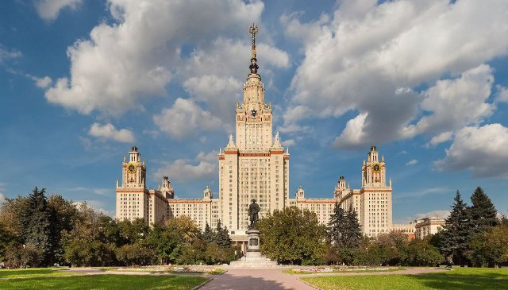

Stolica Rosji.

- Type: Place
- Subjects: Geography, Culture
- Country: International

### Most dla pociągów

Specjalny most o konstrukcji wystarczająco wytrzymałej, aby umożliwić przejazd ciężkich pociągów nad wodą.

- Type: Place
- Subjects: Geography, Environment
- Country: International
- Quests: [Paryż Sekwana (fr_10)](../quest/fr_10.pl.md)

### Most dla samochodów

Droga biegnąca nad wodą, dzięki której samochody mogą pokonywać rzeki i jeziora.

- Type: Place
- Subjects: Geography, Environment
- Country: International
- Quests: [Paryż Sekwana (fr_10)](../quest/fr_10.pl.md)

### Most Zamkowy

Most w pobliżu zamku. Zamki to duże, potężne budowle, w których dawno temu mieszkali królowie i królowe.

- Type: Place
- Subjects: Culture, Community
- Country: International

### Mąka

Biały proszek z pszenicy, używany do wypieku chleba.

- Type: Object
- Subjects: Food, Science
- Country: International

### Narciarstwo

Zjeżdżanie na nartach po śniegu.

- Type: Concept
- Subjects: Sport, Recreation
- Country: International
- Quests: [Mont Blanc i góry (fr_08)](../quest/fr_08.pl.md)

### Okulary przeciwsłoneczne

Okulary chroniące oczy przed jasnym światłem.

- Type: Object
- Subjects: Health, Safety, Weather
- Country: International
- Quests: [Mont Blanc i góry (fr_08)](../quest/fr_08.pl.md)

### Oliwa z oliwek

Specjalny olej z oliwek. Ludzie używają go do gotowania smacznych potraw.

- Type: Object
- Subjects: Food, Culture
- Country: International
- Quests: [Jedzenie i targ (fr_09)](../quest/fr_09.pl.md)

### Ożywić

Pikantny korzeń używany w kuchni i ciasteczkach.

- Type: Object
- Subjects: Food, Plant
- Country: International
- Quests: [Pierniki i targ spożywczy (pl_06)](../quest/pl_06.pl.md)

### Paryż
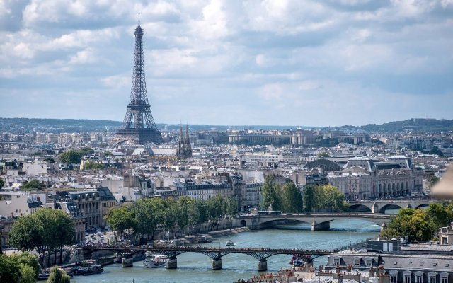

Stolica Francji. Paryż ma słynną wysoką wieżę zwaną Wieżą Eiffla!

- Type: Place
- Subjects: Geography, Culture
- Country: International
- Quests: [Paryż! (fr_01)](../quest/fr_01.pl.md)

### Pałac Kultury i Nauki

Wysoki budynek przeznaczony na muzea, teatry i placówki edukacyjne.

- Type: Place
- Subjects: Culture, Education, History
- Country: International
- Quests: [Odkryj Warszawę (pl_01)](../quest/pl_01.pl.md)

### Pałac Prezydencki

Oficjalna siedziba Prezydenta Polski.

- Type: Place
- Subjects: Civics, History, Culture
- Country: International
- Quests: [Odkryj Warszawę (pl_01)](../quest/pl_01.pl.md)

### Piekarz

Osoba zajmująca się wypiekiem chleba, ciast i wypieków.

- Type: Person
- Subjects: History, Culture
- Country: International
- Quests: [Jedzenie i targ (fr_09)](../quest/fr_09.pl.md)

### Pieprz Sól

Przyprawy, które poprawiają smak potraw. Sól jest biała, a pieprz czarny i ma drobne kawałki.

- Type: Object
- Subjects: Food, Culture
- Country: International
- Quests: [Jedzenie i targ (fr_09)](../quest/fr_09.pl.md)

### Pingwin

Ptak, który nie lata, ale świetnie pływa. Żyje w zimnych miejscach.

- Type: Object
- Subjects: Animal, Environment
- Country: International

### Piłka

Okrągły obiekt używany w wielu grach.

- Type: Object
- Subjects: Sport, Recreation
- Country: International
- Quests: [Odkryj Warszawę (pl_01)](../quest/pl_01.pl.md)

### Piłka nożna

Gra zespołowa, w którą gra się piłką, którą się kopie.

- Type: Object
- Subjects: Sport, Recreation, Community
- Country: International
- Quests: [Odkryj Warszawę (pl_01)](../quest/pl_01.pl.md)

### plant_apple

- Type: Object
- Country: International
- Quests: [Zoo (pl_04)](../quest/pl_04.pl.md)

### plant_banana

- Type: Object
- Country: International
- Quests: [Zoo (pl_04)](../quest/pl_04.pl.md)

### plant_orange

- Type: Object
- Country: International
- Quests: [Zoo (pl_04)](../quest/pl_04.pl.md)

### plant_wattle

- Type: Object
- Country: International
- Quests: [Zoo (pl_04)](../quest/pl_04.pl.md)

### Plecak
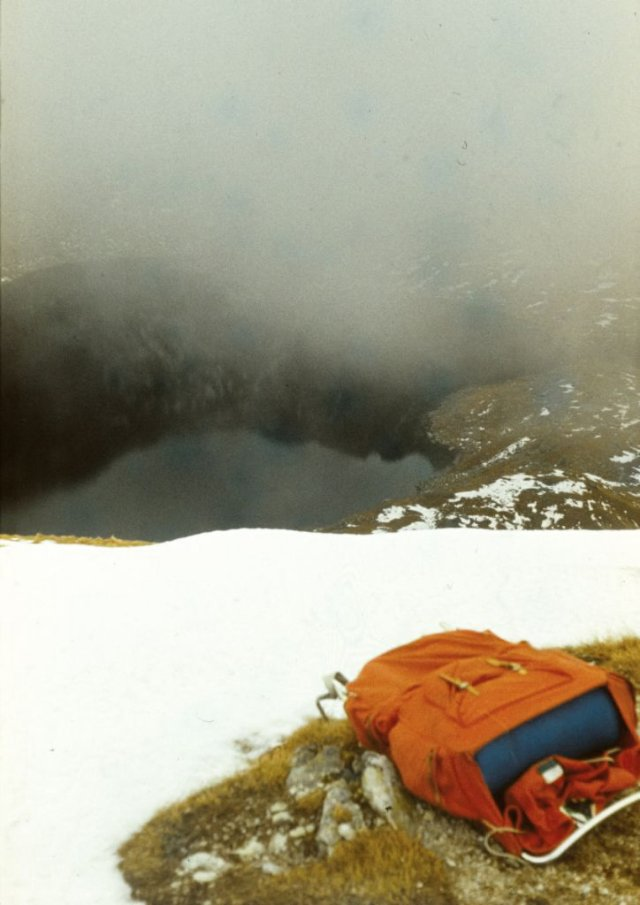

Torba, którą nosisz na plecach.

- Type: Object
- Subjects: Recreation, Transportation, Education
- Country: International
- Quests: [Mont Blanc i góry (fr_08)](../quest/fr_08.pl.md)

### Pociąg

Pociągi szybko przewożą ludzi i towary przez cały kraj.

- Type: Object
- Subjects: Transportation
- Country: International

### Polska

Kraj w Europie. Stolicą jest Warszawa. Polska słynie z naukowców takich jak Kopernik i pysznych pierogów!

- Type: Place
- Subjects: Geography, Culture
- Country: International

### Polskie Izby Parlamentu

Gdzie tworzone jest prawo: Sejm i Senat.

- Type: Place
- Subjects: Civics, History, Geography
- Country: International
- Quests: [Odkryj Warszawę (pl_01)](../quest/pl_01.pl.md)

### Pomarańczowy

Okrągły, pomarańczowy owoc o słodkim i soczystym smaku. Pomarańcze mają mnóstwo witaminy C!

- Type: Object
- Subjects: Food, Culture
- Country: International
- Quests: [Jedzenie i targ (fr_09)](../quest/fr_09.pl.md)

### Pomidor
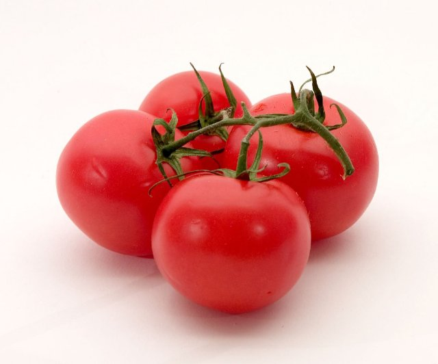

Czerwony, okrągły owoc rosnący na roślinach. Pomidory służą do robienia sosu do pizzy!

- Type: Object
- Subjects: Food, Culture
- Country: International
- Quests: [Jedzenie i targ (fr_09)](../quest/fr_09.pl.md)

### Pomnik Mikołaja Kopernika (Warszawa)

Pomnik astronoma Mikołaja Kopernika.

- Type: Place
- Subjects: Science, History, Culture
- Country: International
- Quests: [Odkryj Warszawę (pl_01)](../quest/pl_01.pl.md)

### Praga

Stolica Republiki Czeskiej.

- Type: Place
- Subjects: Geography, Culture
- Country: International

### Prezydent

Przywódca wybrany do przewodzenia krajowi. Ludzie głosują w wyborach.

- Type: Person
- Subjects: History, Culture
- Country: International

### Przewodnik górski

Osoba, która pomaga ludziom bezpiecznie się wspinać.

- Type: Person
- Subjects: Community, Safety, Education
- Country: International
- Quests: [Mont Blanc i góry (fr_08)](../quest/fr_08.pl.md)

### Pszczelarz

Osoba opiekująca się pszczołami i zbierająca miód.

- Type: Person
- Subjects: Community, Animal, Food
- Country: International
- Quests: [Pierniki i targ spożywczy (pl_06)](../quest/pl_06.pl.md)

### Płaszcz

Ciepła kurtka na zimne dni.

- Type: Object
- Subjects: Health, Safety, Weather
- Country: International
- Quests: [Mont Blanc i góry (fr_08)](../quest/fr_08.pl.md)

### Raki

Kolczaste metalowe uchwyty przymocowane do butów, aby móc jeździć po lodzie.

- Type: Object
- Subjects: Safety, Technology, Sport
- Country: International
- Quests: [Mont Blanc i góry (fr_08)](../quest/fr_08.pl.md)

### Rakieta kosmiczna

Rakieta, która leci w kosmos.

- Type: Object
- Subjects: Science
- Country: International
- Quests: [Juliusz Verne i transport (fr_03)](../quest/fr_03.pl.md)

### Robert Lewandowski

Znany polski piłkarz.

- Type: Person
- Subjects: Sport, Culture
- Country: International
- Quests: [Odkryj Warszawę (pl_01)](../quest/pl_01.pl.md)

### Rosja

Państwo w Europie. Stolicą jest Moskwa.

- Type: Place
- Subjects: Geography, Culture
- Country: International

### Rower

Dwukołowy pojazd, który napędza się pedałami.

- Type: Object
- Subjects: Transportation, Sport, Health
- Country: International
- Quests: [Odkryj Warszawę (pl_01)](../quest/pl_01.pl.md)

### RYBA

Zwierzę żyjące i pływające w wodzie. Ryby mają płetwy i skrzela, które umożliwiają im oddychanie pod wodą.

- Type: Object
- Subjects: Food, Culture
- Country: International
- Quests: [Jedzenie i targ (fr_09)](../quest/fr_09.pl.md)

### Rynek średniowieczny

Stary rynek, na którym ludzie kupują i sprzedają towary.

- Type: Place
- Subjects: History, Culture, Community
- Country: International
- Quests: [Pierniki i targ spożywczy (pl_06)](../quest/pl_06.pl.md)

### Rzeźnik

Osoba sprzedająca mięso.

- Type: Person
- Subjects: Community, Food
- Country: International
- Quests: [Pierniki i targ spożywczy (pl_06)](../quest/pl_06.pl.md)

### Rękawice

Ciepłe okrycia na dłonie.

- Type: Object
- Subjects: Health, Safety, Weather
- Country: International
- Quests: [Mont Blanc i góry (fr_08)](../quest/fr_08.pl.md)

### Samochód

Mały pojazd do jazdy po drogach.

- Type: Object
- Subjects: Transportation
- Country: International
- Quests: [Odkryj Warszawę (pl_01)](../quest/pl_01.pl.md)

### Sprzedawca jajek

Osoba sprzedająca jajka.

- Type: Person
- Subjects: Community, Food
- Country: International
- Quests: [Pierniki i targ spożywczy (pl_06)](../quest/pl_06.pl.md)

### Sprzedawca produktów mlecznych

Osoba sprzedająca mleko, masło i ser.

- Type: Person
- Subjects: Community, Food
- Country: International
- Quests: [Pierniki i targ spożywczy (pl_06)](../quest/pl_06.pl.md)

### Sprzedawca ryb

Osoba sprzedająca świeże ryby i owoce morza.

- Type: Person
- Subjects: History, Culture
- Country: International
- Quests: [Jedzenie i targ (fr_09)](../quest/fr_09.pl.md)

### Stadion Narodowy (Warszawa)

Nowoczesny stadion przeznaczony do meczów piłkarskich i koncertów.

- Type: Place
- Subjects: Sport, Culture, Community
- Country: International
- Quests: [Odkryj Warszawę (pl_01)](../quest/pl_01.pl.md)

### Statua Warsa i Sawy

Rzeźba przedstawiająca legendę miasta o Warsie i Sawie.

- Type: Place
- Subjects: Culture, History
- Country: International
- Quests: [Odkryj Warszawę (pl_01)](../quest/pl_01.pl.md)

### Szalik

Ciepły materiał noszony wokół szyi.

- Type: Object
- Subjects: Health, Safety, Weather
- Country: International
- Quests: [Mont Blanc i góry (fr_08)](../quest/fr_08.pl.md)

### Szczyt

Sam szczyt góry.

- Type: Concept
- Subjects: Geography, Environment, Education
- Country: International
- Quests: [Mont Blanc i góry (fr_08)](../quest/fr_08.pl.md)

### Szwajcaria

Kraj w Europie. Stolicą jest Berno. Szwajcaria słynie z gór i sera.

- Type: Place
- Subjects: Geography, Culture
- Country: International

### SÓL

Białe kryształy, które poprawiają smak potraw.

- Type: Object
- Subjects: Food, Culture
- Country: International

### Słoneczny

Jasne światło, które może odbijać się od śniegu.

- Type: Concept
- Subjects: Science, Weather, Environment
- Country: International
- Quests: [Mont Blanc i góry (fr_08)](../quest/fr_08.pl.md)

### Słowacja

Kraj w Europie. Stolicą jest Bratysława.

- Type: Place
- Subjects: Geography, Culture
- Country: International

### Słoń

Duże zwierzę z trąbą. Słonie to największe zwierzęta chodzące po lądzie. Mają duże uszy i uwielbiają pryskać wodą!

- Rationale: Elephants are amazing animals that kids love learning about at the zoo!
- Type: Object
- Subjects: Animal, Environment
- Country: International
- Words: [elephant](../words/elephant.md), [zoo](../words/zoo.md)

### Torba szkolna

Torba, w której uczniowie noszą do szkoły książki, ołówki i prace domowe.

- Type: Object
- Subjects: Science
- Country: International
- Quests: [System edukacji (fr_02)](../quest/fr_02.pl.md)

### Tramwajowy

Pociąg miejski poruszający się po torach ulicznych.

- Type: Object
- Subjects: Transportation, Technology, Community
- Country: International
- Quests: [Odkryj Warszawę (pl_01)](../quest/pl_01.pl.md)

### Trójkąt

Kształt z trzema prostymi bokami i trzema narożnikami. Trójkąty wyglądają jak kawałki pizzy!

- Type: Concept
- Subjects: Math
- Country: International
- Quests: [System edukacji (fr_02)](../quest/fr_02.pl.md)

### Turystyka piesza

Wędrówki po szlakach na łonie natury.

- Type: Concept
- Subjects: Recreation, Sport, Environment
- Country: International
- Quests: [Mont Blanc i góry (fr_08)](../quest/fr_08.pl.md)

### Ukraina

Państwo w Europie. Stolicą jest Kijów.

- Type: Place
- Subjects: Geography, Culture
- Country: International

### Waluta euro

Waluta używana w wielu krajach Europy. Za euro można kupić zabawki i lody!

- Type: Concept
- Subjects: Money, Geography
- Country: International
- Quests: [Jedzenie i targ (fr_09)](../quest/fr_09.pl.md)

### Warszawa

Stolica Polski.

- Type: Place
- Subjects: Geography, Culture
- Country: International

### Wiatr

Ruch powietrza, który w górach może być odczuwalnie silniejszy.

- Type: Concept
- Subjects: Weather, Environment
- Country: International
- Quests: [Mont Blanc i góry (fr_08)](../quest/fr_08.pl.md)

### Wilno

Stolica Litwy.

- Type: Place
- Subjects: Geography, Culture
- Country: International

### Woda

Woda jest niezbędna do życia

- Type: Object
- Subjects: Food, Culture
- Country: International

### Wspinaczka

Wchodzenie na skały lub lód przy użyciu specjalnego sprzętu.

- Type: Concept
- Subjects: Sport, Safety, Recreation
- Country: International
- Quests: [Mont Blanc i góry (fr_08)](../quest/fr_08.pl.md)

### Właściciel sklepu spożywczego

Osoba sprzedająca różnego rodzaju żywność i napoje.

- Type: Person
- Subjects: History, Culture
- Country: International
- Quests: [Jedzenie i targ (fr_09)](../quest/fr_09.pl.md)

### Zamek Królewski (Warszawa)

Historyczny zamek królów polskich, obecnie muzeum.

- Type: Place
- Subjects: History, Culture, Geography
- Country: International
- Quests: [Odkryj Warszawę (pl_01)](../quest/pl_01.pl.md)

### Znak NIEBEZPIECZEŃSTWO

Znak ostrzegający przed zbliżającym się niebezpieczeństwem. Zachowaj szczególną ostrożność.

- Type: Object
- Subjects: Safety
- Country: International

### Znak STOP

Czerwony znak oznaczający, że musisz zatrzymać pojazd.

- Type: Object
- Subjects: Safety, Transportation
- Country: International

### Łódź dla ludzi

Łódź przewożąca ludzi z jednego miejsca do drugiego przez wodę.

- Type: Place
- Subjects: Geography, Environment
- Country: International

### Łódź rzeczna

Łódź, która płynie po rzekach. Rzeki są jak drogi zbudowane z wody!

- Type: Place
- Subjects: Geography, Environment
- Country: International
- Quests: [Paryż Sekwana (fr_10)](../quest/fr_10.pl.md)

### Łódź towarowa

Duża łódź, która przewozi pudełka, żywność i inne rzeczy z miejsca na miejsce.

- Type: Place
- Subjects: Geography, Environment
- Country: International

### Śnieg

Zamarznięta woda spadająca w zimne dni.

- Type: Concept
- Subjects: Weather, Environment, Science
- Country: International
- Quests: [Mont Blanc i góry (fr_08)](../quest/fr_08.pl.md)

### Świstak

Futrzane zwierzę górskie, które gwiżdże.

- Type: Object
- Subjects: Animal, Environment, Science
- Country: International
- Quests: [Mont Blanc i góry (fr_08)](../quest/fr_08.pl.md)

### Żelazo

Gorące narzędzie służące do wygładzania i prostowania pogniecionych ubrań. Uwaga, żelazka są bardzo gorące!

- Type: Object
- Subjects: Science
- Country: International

### Żyrafa

Bardzo wysokie zwierzę z długą szyją. Żyrafy są wyższe niż drzewa! Zjadają liście, do których inne zwierzęta nie mogą dosięgnąć.

- Rationale: Giraffes are fascinating animals that show kids how nature adapts to find food
- Type: Object
- Subjects: Animal, Environment
- Country: International

## France

### 20 000 mil podmorskiej żeglugi

Książka Juliusza Verne'a o podwodnych przygodach w łodzi podwodnej Nautilus. Spotykasz gigantyczne morskie stworzenia!

- Type: Object
- Subjects: Literature
- Year: 1871
- Country: France
- Quests: [Juliusz Verne i transport (fr_03)](../quest/fr_03.pl.md)

### 24-godzinny wyścig Le Mans

Wyścig samochodowy trwający 24 godziny. Zespoły ścigają się dniem i nocą.

- Type: Concept
- Subjects: Sport, Culture, History
- Country: France

### Allons enfants

Pierwsze słowa pierwszego wersu hymnu.

- Type: Object
- Subjects: Music, Education, Culture
- Country: France

### Bagietka francuska

Długi, chrupiący chleb, najsłynniejsze danie we Francji. Francuzi codziennie kupują świeże bagietki z piekarni!

- Rationale: Baguettes are iconic French culture that kids can easily understand and remember
- Type: Object
- Subjects: Food, Culture
- Year: 1700
- Country: France
- Quests: [Paryż! (fr_01)](../quest/fr_01.pl.md), [Rozwój (dev)](../quest/dev.pl.md)

### Balon na ogrzane powietrze

Balon latający na gorące powietrze. Pierwszy taki balon poleciał we Francji.

- Type: Object
- Subjects: Transportation
- Country: France
- Quests: [Juliusz Verne i transport (fr_03)](../quest/fr_03.pl.md)

### Bouillabaisse

Wyjątkowa zupa rybna z Marsylii w południowej Francji. Przyrządzana z wielu różnych gatunków ryb, ma pyszny zapach!

- Type: Object
- Subjects: Food, Culture
- Year: 1700
- Country: France
- Quests: [Jedzenie i targ (fr_09)](../quest/fr_09.pl.md)

### Brona

Ciężka brama, która opada i blokuje wejście.

- Type: Object
- Subjects: Technology, History, Safety
- Country: France

### Buty do tańca

Buty przeznaczone do tańca na sali balowej.

- Type: Object
- Subjects: Culture, Recreation
- Country: France

### Collège we Francji

Szkoła średnia we Francji dla dzieci w wieku od 11 do 15 lat. Uczniowie uczą się wielu przedmiotów i przygotowują się do szkoły średniej.

- Rationale: Understanding the French school system helps kids compare education across countries
- Type: Concept
- Subjects: Education, Culture
- Year: 1975
- Country: France
- Quests: [System edukacji (fr_02)](../quest/fr_02.pl.md), [Juliusz Verne i transport (fr_03)](../quest/fr_03.pl.md)

### De la patrie

Słowa z pierwszego wersu hymnu.

- Type: Object
- Subjects: Music, Education, Culture
- Country: France

### Do

Nuta muzyczna.

- Type: Concept
- Subjects: Music, Education
- Country: France

### Dolina Loary

Słynny francuski region z wieloma zamkami.

- Type: Place
- Subjects: Geography, History, Culture
- Country: France

### Dookoła świata w osiemdziesiąt dni

Ekscytująca książka Juliusza Verne'a o bardzo szybkiej podróży dookoła całego świata pociągami, statkami i balonami na ogrzane powietrze!

- Type: Object
- Subjects: Literature
- Year: 1873
- Country: France
- Quests: [Juliusz Verne i transport (fr_03)](../quest/fr_03.pl.md)

### Dworzec kolejowy Le Mans

Stacja, z której wsiadasz do pociągu, którym wracasz do domu.

- Type: Place
- Subjects: Geography, Transportation, Community
- Country: France

### Dzień chwały

Słowa z pierwszego wersu hymnu.

- Type: Object
- Subjects: Music, Education, Culture
- Country: France

### Est Arrivé

Słowa z pierwszego wersu hymnu.

- Type: Object
- Subjects: Music, Education, Culture
- Country: France

### Fa

Nuta muzyczna.

- Type: Concept
- Subjects: Music, Education
- Country: France

### Fasada zamku (okna)

Ściana frontowa z wieloma dużymi oknami zapewniającymi światło i widoki.

- Type: Concept
- Subjects: Culture, Technology
- Country: France

### Flaga Francji

Flaga Francji ma trzy pionowe pasy: niebieski, biały i czerwony. Te kolory symbolizują wolność, równość i braterstwo!

- Rationale: The French flag is essential for teaching French national identity and values
- Type: Concept
- Subjects: Geography, Culture
- Year: 1794
- Country: France
- Quests: [Sąsiedzi Francji (fr_00)](../quest/fr_00.pl.md)

### Flaga Monako

Flaga Monako ma poziome, czerwone i białe pasy. Monako jest malutkie, ale słynie z luksusowych samochodów i królewskich pałaców nad morzem!

- Rationale: Monaco shows kids how small places can be special and important
- Type: Concept
- Subjects: Geography, Culture
- Year: 1881
- Country: France
- Quests: [Sąsiedzi Francji (fr_00)](../quest/fr_00.pl.md)

### Fortepian

Instrument klawiszowy służący do grania melodii i akordów.

- Type: Object
- Subjects: Music, Education
- Country: France

### Francja

Kraj w Europie. Stolicą jest Paryż.

- Type: Place
- Subjects: Geography, Culture
- Country: France

### Francuscy piraci

Odważni żeglarze, którzy żeglowali po morzach dla króla Francji. Nazywano ich korsarzami i chronili francuskie statki przed wrogami.

- Rationale: Pirates capture kids' imagination while teaching about maritime history and French naval power
- Type: Concept
- Subjects: History, Culture, Transportation
- Year: 1600
- Country: France
- Quests: [Jedzenie i targ (fr_09)](../quest/fr_09.pl.md)

### Gargulec

Zabawna lub straszna figurka, która pełni również funkcję rynny deszczowej.

- Type: Concept
- Subjects: Art, Technology, History
- Country: France
- Quests: [Paryż! (fr_01)](../quest/fr_01.pl.md)

### Gustave Eiffel

Człowiek, który zbudował Wieżę Eiffla! Był inżynierem, który uwielbiał budować z żelaza i stworzył najsłynniejszą wieżę na świecie.

- Type: Person
- Subjects: History, Culture, Science
- Year: 1832
- Country: France
- Quests: [Paryż! (fr_01)](../quest/fr_01.pl.md)

### Jean Michel Jarre

Francuski muzyk znany z muzyki elektronicznej. Tworzy wielkie pokazy świetlne.

- Type: Person
- Subjects: Music, Culture, Technology
- Year: 2000
- Country: France

### Juliusz Verne

Francuski pisarz, który wyobrażał sobie niesamowite przygody, zanim stały się możliwe! Pisał o okrętach podwodnych, rakietach i podróżach po świecie.

- Rationale: Jules Verne shows kids how imagination and science can work together
- Type: Person
- Subjects: Literature, Science, History
- Year: 1828
- Country: France
- Quests: [Juliusz Verne i transport (fr_03)](../quest/fr_03.pl.md)

### Kapelusz z piórami

Elegancki kapelusz z piórkiem dodającym stylu.

- Type: Object
- Subjects: Culture, History
- Country: France

### Karta świeckości

Zbiór zasad szanujących przekonania każdego. Pomaga ludziom żyć razem w pokoju.

- Type: Concept
- Subjects: Community, Culture
- Year: 2013
- Country: France
- Quests: [System edukacji (fr_02)](../quest/fr_02.pl.md), [Juliusz Verne i transport (fr_03)](../quest/fr_03.pl.md)

### Kask

Metalowy kapelusz chroniący głowę.

- Type: Object
- Subjects: History, Safety
- Country: France

### Kask (bezpieczeństwo uliczne)

Twardy kask chroniący głowę podczas jazdy.

- Type: Object
- Subjects: Safety, Health, Education
- Country: France

### Katapultować

Maszyna, która rzuca kamieniami na dużą odległość.

- Type: Object
- Subjects: Technology, History
- Country: France

### Katedra

Bardzo duży i ważny kościół w mieście.

- Type: Place
- Subjects: Culture, History, Education
- Country: France
- Quests: [Paryż! (fr_01)](../quest/fr_01.pl.md)

### Katedra Notre-Dame w Paryżu

Piękna katedra w Paryżu. Jej kolorowe witraże opowiadają historie.

- Type: Place
- Subjects: Geography, Environment
- Year: 1885
- Country: France
- Quests: [Paryż! (fr_01)](../quest/fr_01.pl.md)

### Kodeks Hammurabiego

Kamień z wyrytymi bardzo starymi prawami.

- Type: Object
- Subjects: History, Civics
- Country: France
- Quests: [Paryż! (fr_01)](../quest/fr_01.pl.md)

### Koronacja Napoleona (Dawid)

Ogromny obraz przedstawiający ceremonię cesarza Francji.

- Type: Object
- Subjects: Art, History
- Country: France
- Quests: [Paryż! (fr_01)](../quest/fr_01.pl.md)

### Kościół

Specjalny budynek, w którym ludzie spotykają się, aby modlić się i śpiewać.

- Type: Place
- Subjects: Culture, Civics, Education
- Country: France
- Quests: [Paryż! (fr_01)](../quest/fr_01.pl.md)

### Królewska sypialnia

Elegancki pokój z dużym łóżkiem z baldachimem.

- Type: Place
- Subjects: Culture, History
- Country: France

### Ksylofon

Instrument z prętami, w które uderza się, aby uzyskać nuty.

- Type: Object
- Subjects: Music, Education
- Country: France

### La

Nuta muzyczna.

- Type: Concept
- Subjects: Music, Education
- Country: France

### Latająca przypora

Kamienne ramiona na zewnątrz, które pomagają podtrzymywać wysokie mury.

- Type: Concept
- Subjects: Technology, History, Art
- Country: France
- Quests: [Paryż! (fr_01)](../quest/fr_01.pl.md)

### Le Mans

Miasto we Francji słynące z 24-godzinnego wyścigu samochodowego.

- Type: Place
- Subjects: Geography, Culture, Community
- Country: France

### Liceum we Francji

Szkoła średnia we Francji dla nastolatków w wieku od 16 do 18 lat. Uczniowie intensywnie przygotowują się do egzaminu maturalnego, aby móc iść na uniwersytet.

- Rationale: The Lycée system shows kids the path to higher education in France
- Type: Concept
- Subjects: Education, Culture
- Year: 1975
- Country: France
- Quests: [System edukacji (fr_02)](../quest/fr_02.pl.md)

### Luki

Wąskie okna umożliwiające bezpieczne strzelanie.

- Type: Concept
- Subjects: History, Technology
- Country: France

### Lutnia

Instrument strunowy, na którym gra się na dworze.

- Type: Object
- Subjects: Music, Culture, History
- Country: France

### Mapa Sekwany

Zdjęcie przedstawiające rzekę Sekwanę i jej przepływ przez ląd.

- Type: Object
- Subjects: Geography, Environment
- Country: France
- Quests: [Paryż Sekwana (fr_10)](../quest/fr_10.pl.md)

### Mapa Sekwany w Paryżu

Zdjęcie przedstawiające przepływ rzeki Sekwany przez Paryż.

- Type: Object
- Subjects: Science
- Country: France
- Quests: [Paryż Sekwana (fr_10)](../quest/fr_10.pl.md)

### Marsylianka

Francuska pieśń narodowa. Śpiewa się ją podczas wielkich wydarzeń i meczów sportowych.

- Type: Concept
- Subjects: Music, Culture
- Year: 1885
- Country: France

### Maska maskaradowa

Maska na imprezy i bale.

- Type: Object
- Subjects: Culture, History, Recreation
- Country: France

### Mi

Nuta muzyczna.

- Type: Concept
- Subjects: Music, Education
- Country: France

### Miecz

Długie ostrze używane przez rycerzy.

- Type: Object
- Subjects: History, Culture
- Country: France

### Most Aleksandra III

Piękny most w Paryżu z misternymi dekoracjami i złotymi posągami.

- Type: Place
- Subjects: Geography, Environment
- Country: France
- Quests: [Paryż Sekwana (fr_10)](../quest/fr_10.pl.md)

### Most zwodzony

Most podnoszony w celu ochrony wejścia do zamku.

- Type: Object
- Subjects: Technology, History, Safety
- Country: France

### Muzyka

Zapis nutowy i słowa piosenki.

- Type: Object
- Subjects: Education, Music
- Country: France

### Nike z Samotraki

Słynna starożytna rzeźba przedstawiająca boginię ze skrzydłami.

- Type: Object
- Subjects: Art, History
- Country: France
- Quests: [Paryż! (fr_01)](../quest/fr_01.pl.md)

### Odnośnie
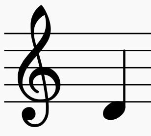

Nuta muzyczna.

- Type: Concept
- Subjects: Music, Education
- Country: France

### Ogrody formalne

Ogrody ozdobne do spacerów i przyjęć.

- Type: Place
- Subjects: Culture, Environment
- Country: France

### Okno rozetowe

Duży, okrągły witraż opowiadający historie światłem.

- Type: Concept
- Subjects: Art, Culture, History
- Country: France
- Quests: [Paryż! (fr_01)](../quest/fr_01.pl.md)

### Parapet

Niski mur na skraju wałów obronnych.

- Type: Concept
- Subjects: History, Technology
- Country: France

### Piramida Luwru

Szklana piramida, która stanowi współczesne wejście do Luwru.

- Type: Place
- Subjects: Art, Culture, Technology
- Country: France
- Quests: [Paryż! (fr_01)](../quest/fr_01.pl.md)

### Pismo odręczne

Specjalny sposób pisania, w którym wszystkie litery w słowie są połączone. We Francji dzieci uczą się tego sposobu pisania w szkole.

- Rationale: Cursive writing is an important part of French education and cultural identity
- Type: Concept
- Subjects: Education, Culture, Art
- Year: 1800
- Country: France
- Quests: [System edukacji (fr_02)](../quest/fr_02.pl.md)

### Pięć tygodni w balonie

Książka Juliusza Verne'a o locie nad Afryką balonem na ogrzane powietrze. Pełna przygód i odkryć!

- Type: Object
- Subjects: Literature
- Year: 1863
- Country: France
- Quests: [Juliusz Verne i transport (fr_03)](../quest/fr_03.pl.md)

### Pożar Notre-Dame

W 2019 roku wielki pożar zniszczył piękną katedrę Notre-Dame w Paryżu. Wiele osób współpracowało, aby uratować ten ważny budynek.

- Rationale: This event teaches kids about protecting cultural heritage and community cooperation
- Type: Concept
- Subjects: History, Culture, Environment
- Year: 2019
- Country: France
- Quests: [Paryż! (fr_01)](../quest/fr_01.pl.md)

### Przewoźnik

Osoba wiosłująca łodzią po Loarze.

- Type: Person
- Subjects: Community, Transportation
- Country: France

### Przysięga Horacjuszy (Dawida)

Obraz przedstawiający trzech braci składających odważną obietnicę.

- Type: Object
- Subjects: Art, History
- Country: France
- Quests: [Paryż! (fr_01)](../quest/fr_01.pl.md)

### Rewolucja francuska

Okres lat dziewięćdziesiątych XVIII wieku, kiedy we Francji nastąpiła zmiana rządu.

- Type: Concept
- Subjects: History, Civics, Time, Culture
- Country: France

### Rower

Pojazd z dwoma kołami, do których pedałuje się.

- Type: Object
- Subjects: Transportation, Health, Recreation
- Country: France

### Rzeka Loara

Długa rzeka we Francji, wzdłuż której brzegów znajduje się wiele zamków.

- Type: Place
- Subjects: Geography, Environment
- Country: France

### Sala balowa

Duża sala do tańca i muzyki.

- Type: Place
- Subjects: Culture, History
- Country: France

### Samochód wyścigowy

Bardzo szybki samochód używany na torach wyścigowych.

- Type: Object
- Subjects: Sport, Technology
- Country: France

### Sekwana

Rzeka o długości 777 kilometrów w północnej Francji

- Type: Place
- Subjects: Geography
- Country: France
- Quests: [Paryż Sekwana (fr_10)](../quest/fr_10.pl.md)

### Si

Nuta muzyczna.

- Type: Concept
- Subjects: Music, Education
- Country: France

### Siedzący skryba
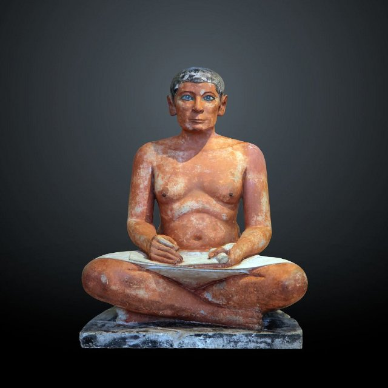

Starożytna egipska statua przedstawiająca osobę piszącą.

- Type: Object
- Subjects: Art, History
- Country: France
- Quests: [Paryż! (fr_01)](../quest/fr_01.pl.md)

### Skuter

Mały dwukołowy skuter (trottinette).

- Type: Object
- Subjects: Transportation, Recreation, Safety
- Country: France

### Sol

Nuta muzyczna.

- Type: Concept
- Subjects: Music, Education
- Country: France

### Statek po Sekwanie

Wyjątkowa łódź, która pływa po Sekwanie w Paryżu. Z wody widać Wieżę Eiffla i inne piękne budynki!

- Rationale: Boat tours help kids see Paris from a different perspective and understand river transportation
- Type: Concept
- Subjects: Transportation, Geography, Culture
- Year: 1900
- Country: France
- Quests: [Paryż Sekwana (fr_10)](../quest/fr_10.pl.md)

### Strzałki

Ostre patyki wystrzeliwane z łuku.

- Type: Object
- Subjects: History, Technology
- Country: France

### Sygnalizacja świetlna

Latarnie uliczne informujące, kiedy należy się ZATRZYMAĆ lub JECHAĆ.

- Type: Object
- Subjects: Safety, Education, Transportation
- Country: France

### Szkoła Maternelle

Szkoła dla małych dzieci w wieku od 3 do 5 lat. Uczysz się poprzez zabawę i odkrywanie.

- Type: Concept
- Subjects: Education, Culture
- Year: 1975
- Country: France
- Quests: [System edukacji (fr_02)](../quest/fr_02.pl.md)

### Szkoła podstawowa we Francji

Szkoła dla dzieci w wieku od 6 do 10 lat. Uczysz się czytania, pisania i liczenia.

- Type: Concept
- Subjects: Education, Culture
- Year: 1975
- Country: France
- Quests: [System edukacji (fr_02)](../quest/fr_02.pl.md)

### Ukłon

Broń strzelająca strzałami.

- Type: Object
- Subjects: History, Technology
- Country: France

### Wały

Wysokie mury, po których można chodzić i strzec zamku.

- Type: Concept
- Subjects: History, Technology
- Country: France

### Wejście na tor wyścigowy Le Mans

Wejście na tor wyścigowy Le Mans.

- Type: Place
- Subjects: Geography, Sport, Culture
- Country: France

### Wieża Eiffla

Wysoka wieża i symbol Paryża. Jest wykonana z żelaza i ma 300 metrów wysokości. Można na nią wejść i zobaczyć całe miasto.

- Type: Place
- Subjects: Geography, History, Culture
- Year: 1889
- Country: France
- Quests: [Paryż! (fr_01)](../quest/fr_01.pl.md)

### Windy Wieży Eiffla

Windy, którymi zwiedzający mogą wjechać na żelazną wieżę.

- Type: Object
- Subjects: Technology, Transportation
- Country: France
- Quests: [Paryż! (fr_01)](../quest/fr_01.pl.md)

### Wolność wiodąca lud
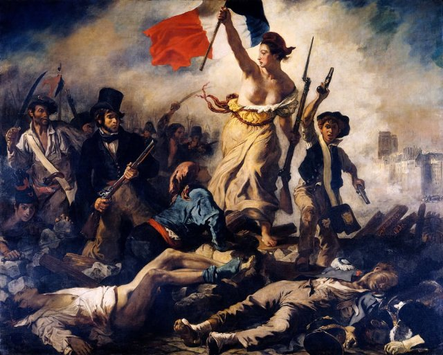

Słynny obraz o wolności i odwadze. Przedstawia odważną kobietę trzymającą flagę Francji i prowadzącą ludzi do walki o swoje prawa.

- Rationale: This painting teaches kids about fighting for freedom and the French Revolution
- Type: Object
- Subjects: Art, History, Culture
- Year: 1830
- Country: France

### Wystawa światowa (1889)

Wielka światowa wystawa, na której pokazano Wieżę Eiffla.

- Type: Concept
- Subjects: History, Culture
- Country: France
- Quests: [Paryż! (fr_01)](../quest/fr_01.pl.md)

### Z Ziemi na Księżyc

Książka Juliusza Verne'a o podróży na Księżyc w wielkiej armacie! Została napisana, zanim jeszcze istniały prawdziwe rakiety.

- Type: Object
- Subjects: Literature, Space, Science
- Year: 1865
- Country: France
- Quests: [Juliusz Verne i transport (fr_03)](../quest/fr_03.pl.md)

### Zamek Chambord

Wspaniały pałac z wieloma oknami i ogrodami.

- Type: Place
- Subjects: History, Culture, Geography
- Country: France

### Zamek Chinon

Zamek Chinon to potężna kamienna twierdza na wzgórzu nad rzeką w Dolinie Loary. Dawno temu przebywali tu królowie, a Joanna d'Arc przybyła tu, aby spotkać się z przyszłym królem Francji.

- Type: Place
- Subjects: History
- Country: France
- Quests: [Opowieść o dwóch zamkach (fr_05)](../quest/fr_05.pl.md)

### Zamek Chinon

Mocna kamienna twierdza, wykorzystywana do obrony.

- Type: Place
- Subjects: History, Geography, Culture
- Country: France

### Zbroja

Metalowy ubiór ochronny dla rycerza.

- Type: Object
- Subjects: History, Safety
- Country: France

### Zebra

Białe pasy tam, gdzie ludzie przechodzą przez ulicę.

- Type: Object
- Subjects: Safety, Education, Transportation
- Country: France

### Łódź podwodna (Nautilus)

Łódź podwodna z powieści Juliusza Verne'a. Mogła eksplorować głębiny morskie.

- Type: Object
- Subjects: Literature, Science
- Country: France
- Quests: [Juliusz Verne i transport (fr_03)](../quest/fr_03.pl.md)

### Żaluzja

Ogromne muzeum pełne sztuki. To tu mieszka Mona Lisa.

- Type: Place
- Subjects: Art, Culture, History
- Year: 1793
- Country: France
- Quests: [Paryż! (fr_01)](../quest/fr_01.pl.md)

## Poland

### Astronomia

Nauka zajmująca się badaniem Słońca, Księżyca, gwiazd i planet.

- Type: Concept
- Subjects: Science, Space
- Country: Poland
- Quests: [Kopernik i układ słoneczny (pl_07)](../quest/pl_07.pl.md)

### Barka

Długa, płaska łódź przeznaczona do transportu towarów po rzekach.

- Type: Object
- Subjects: Transportation, Geography
- Country: Poland
- Quests: [Rzeka Odra (pl_03)](../quest/pl_03.pl.md)

### Biskup Krasnolud

Posąg karła zadającego pytanie kościelne.

- Type: Object
- Subjects: Culture, History
- Country: Poland
- Quests: [Wielka akcja ratunkowa krasnala wrocławskiego (pl_02)](../quest/pl_02.pl.md)

### Bursztyn

Błyszcząca skamieniała żywica drzewna zwana „Bałtyckim Złotem”.

- Type: Object
- Subjects: History, Culture, Science
- Country: Poland
- Quests: [Gdański naszyjnik bursztynowy (pl_05)](../quest/pl_05.pl.md)

### Dom Mikołaja Kopernika

Obecnie mieści się tam muzeum, w którym można poznać historię jego życia i osiągnięć naukowych.

- Type: Place
- Subjects: Culture, Science
- Country: Poland
- Quests: [Kopernik i układ słoneczny (pl_07)](../quest/pl_07.pl.md)

### Dom na wodzie

Łódź stworzona do życia na niej.

- Type: Object
- Subjects: Transportation, Community
- Country: Poland
- Quests: [Rzeka Odra (pl_03)](../quest/pl_03.pl.md)

### Dyrektor zoo

Osoba zarządzająca zoo i pomagająca zwiedzającym.

- Type: Person
- Subjects: Community, Education
- Country: Poland
- Quests: [Zoo (pl_04)](../quest/pl_04.pl.md)

### Ekosystem

Żywe organizmy i ich środowisko naturalne, współpracujące ze sobą.

- Type: Concept
- Subjects: Environment, Science
- Country: Poland
- Quests: [Gdański naszyjnik bursztynowy (pl_05)](../quest/pl_05.pl.md)

### Ekspert Krasnoludów
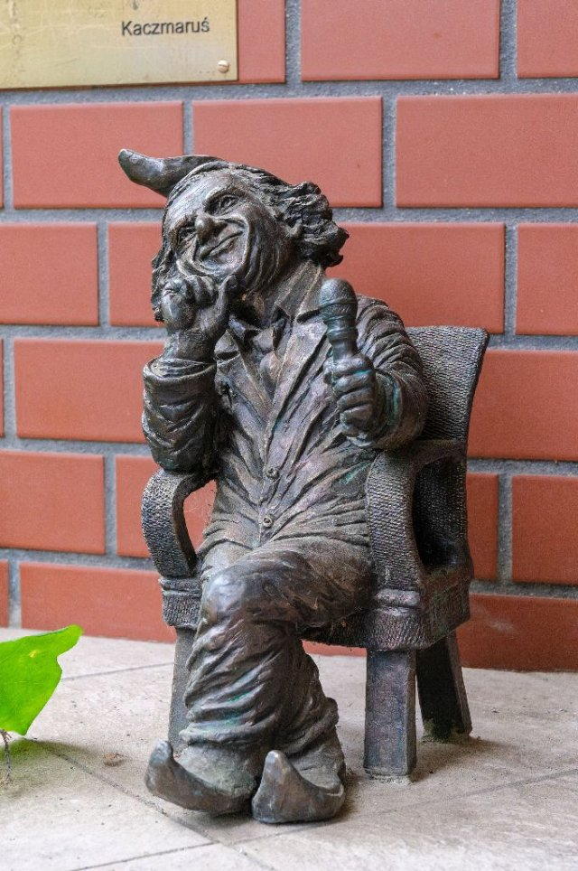

Przyjazny przewodnik, który wie wszystko o krasnoludkach.

- Type: Person
- Subjects: Education, Culture
- Country: Poland
- Quests: [Wielka akcja ratunkowa krasnala wrocławskiego (pl_02)](../quest/pl_02.pl.md)

### Fale

Ruch wody na morzu.

- Type: Concept
- Subjects: Environment, Science
- Country: Poland
- Quests: [Gdański naszyjnik bursztynowy (pl_05)](../quest/pl_05.pl.md)

### Flaga Polski

Flaga Polski ma poziome, biało-czerwone pasy. Polska słynie z naukowców takich jak Kopernik i pysznych pierogów!

- Rationale: The Polish flag is essential for Polish language learning and cultural identity
- Type: Concept
- Subjects: Geography, Culture
- Year: 1919
- Country: Poland
- Quests: [Sąsiedzi Polski (pl_00)](../quest/pl_00.pl.md)

### Flaga Wrocławia

Flaga miasta, którą należy znaleźć i zwrócić.

- Type: Object
- Subjects: Culture, Community, History
- Country: Poland
- Quests: [Zoo (pl_04)](../quest/pl_04.pl.md)

### Foka

Dzikie zwierzę morskie, odpoczywające na plażach.

- Type: Object
- Subjects: Animal, Environment, Safety
- Country: Poland
- Quests: [Gdański naszyjnik bursztynowy (pl_05)](../quest/pl_05.pl.md)

### Fontanna Neptuna

Słynna fontanna w Gdańsku z figurą boga morza.

- Type: Place
- Subjects: History, Culture, Community
- Country: Poland
- Quests: [Gdański naszyjnik bursztynowy (pl_05)](../quest/pl_05.pl.md)

### Fryderyk Chopin

Znany polski kompozytor fortepianowy. Tworzył piękną muzykę, która brzmi jak taniec lub opowiadanie historii. Jego muzyka sprawia, że ​​ludzie czują się szczęśliwi lub smutni.

- Rationale: Chopin introduces kids to classical music and shows how music can express emotions
- Type: Person
- Subjects: Music, History, Culture
- Year: 1810
- Country: Poland
- Quests: [Odkryj Warszawę (pl_01)](../quest/pl_01.pl.md)

### Gdańsk
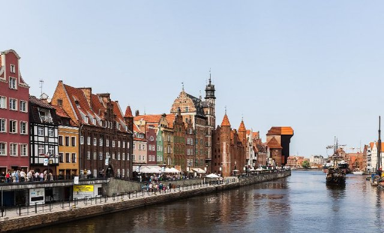

Miasto portowe w Polsce nad Morzem Bałtyckim.

- Type: Place
- Subjects: Geography, History, Culture
- Country: Poland
- Quests: [Gdański naszyjnik bursztynowy (pl_05)](../quest/pl_05.pl.md)

### Główny Ratusz

Wysoki ratusz z wieżą i muzeum.

- Type: Place
- Subjects: History, Culture
- Country: Poland
- Quests: [Gdański naszyjnik bursztynowy (pl_05)](../quest/pl_05.pl.md)

### Hala Stulecia

Hala Stulecia to ogromny budynek przypominający wielki namiot z dachem. Jest bardzo wysoki. Wewnątrz można oglądać różne pokazy, słuchać koncertów i oglądać mecze sportowe.

- Type: Place
- Subjects: Culture, Recreation
- Country: Poland
- Quests: [Wielka akcja ratunkowa krasnala wrocławskiego (pl_02)](../quest/pl_02.pl.md)

### Iglica

Wysoka metalowa rzeźba obok Centennial Hall.

- Type: Place
- Subjects: History, Culture
- Country: Poland
- Quests: [Zoo (pl_04)](../quest/pl_04.pl.md)

### Jupiter

Największa planeta, słynąca z Wielkiej Czerwonej Plamy.

- Type: Object
- Subjects: Space, Science
- Country: Poland
- Quests: [Kopernik i układ słoneczny (pl_07)](../quest/pl_07.pl.md)

### Kajak

Mała łódka, którą wiosłujesz.

- Type: Object
- Subjects: Recreation, Sport
- Country: Poland
- Quests: [Rzeka Odra (pl_03)](../quest/pl_03.pl.md)

### Krasnale wrocławskie

Malutkie figurki w całym mieście, które uwielbiają płatać figle.

- Type: Concept
- Subjects: Culture, Community, History
- Country: Poland
- Quests: [Wielka akcja ratunkowa krasnala wrocławskiego (pl_02)](../quest/pl_02.pl.md)

### Krasnolud Klucznik

Posąg krasnoluda pilnującego windy z dużym kluczem.

- Type: Object
- Subjects: Culture
- Country: Poland
- Quests: [Wielka akcja ratunkowa krasnala wrocławskiego (pl_02)](../quest/pl_02.pl.md)

### Król Zygmunt III

Król Polski, który wzniósł wiele pięknych budowli w Warszawie. Jego pomnik stoi na wysokiej kolumnie w centrum miasta.

- Rationale: Historical kings help kids understand how cities were built and developed over time
- Type: Person
- Subjects: History, Culture
- Year: 1566
- Country: Poland
- Quests: [Odkryj Warszawę (pl_01)](../quest/pl_01.pl.md)

### Kładka

Most, po którym ludzie mogą chodzić. Bez samochodów.

- Type: Object
- Subjects: Transportation, Community
- Country: Poland
- Quests: [Rzeka Odra (pl_03)](../quest/pl_03.pl.md)

### Latarnia Morska Gdańsk

Zabytkowa latarnia morska, która pomaga statkom znaleźć port.

- Type: Place
- Subjects: History, Geography, Transportation
- Country: Poland
- Quests: [Gdański naszyjnik bursztynowy (pl_05)](../quest/pl_05.pl.md)

### Leonardo da Vinci Primary School
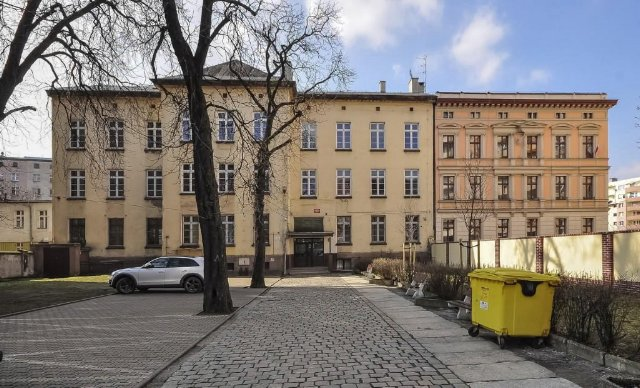

It’s a friendly place where children learn, create, and explore guided by curiosity, art, and science.

- Type: None
- Subjects: Education
- Country: Poland
- Quests: [Wielka akcja ratunkowa krasnala wrocławskiego (pl_02)](../quest/pl_02.pl.md)

### Map of Wroklaw

A simple map of Wrocław showing the Odra River with its islands and many bridges

- Type: None
- Subjects: Geography
- Country: Poland
- Quests: [Wielka akcja ratunkowa krasnala wrocławskiego (pl_02)](../quest/pl_02.pl.md), [Rzeka Odra (pl_03)](../quest/pl_03.pl.md)

### Maria Curie

Genialna polska naukowiec, która odkryła radioaktywność. Była pierwszą kobietą, która otrzymała Nagrodę Nobla i to dwukrotnie!

- Rationale: Maria Curie inspires kids (especially girls) to pursue science and shows Polish contributions to science
- Type: Person
- Subjects: Science, History
- Year: 1867
- Country: Poland
- Quests: [Odkryj Warszawę (pl_01)](../quest/pl_01.pl.md)

### Mars

Czerwona planeta z pyłem i dużymi wulkanami.

- Type: Object
- Subjects: Space, Science
- Country: Poland
- Quests: [Kopernik i układ słoneczny (pl_07)](../quest/pl_07.pl.md)

### Mewa

Ptak morski żyjący w pobliżu wybrzeża.

- Type: Object
- Subjects: Animal, Environment
- Country: Poland
- Quests: [Gdański naszyjnik bursztynowy (pl_05)](../quest/pl_05.pl.md)

### Mikołaj Kopernik

Genialny naukowiec z Polski, który odkrył, że to Ziemia krąży wokół Słońca, a nie odwrotnie! To zmieniło nasze rozumienie kosmosu.

- Rationale: Copernicus teaches kids about scientific discovery and Polish contributions to astronomy
- Type: Person
- Subjects: Science, History, Space
- Year: 1473
- Country: Poland
- Quests: [Kopernik i układ słoneczny (pl_07)](../quest/pl_07.pl.md)

### Miłośnik zwierząt Krasnolud

Figurka krasnala, który uwielbia zoo i zwierzęta.

- Type: Object
- Subjects: Culture, Animal, Education
- Country: Poland
- Quests: [Wielka akcja ratunkowa krasnala wrocławskiego (pl_02)](../quest/pl_02.pl.md)

### Model heliocentryczny

Pogląd, że Słońce znajduje się w centrum, a planety krążą wokół niego.

- Type: Concept
- Subjects: Science, Space, History
- Country: Poland
- Quests: [Kopernik i układ słoneczny (pl_07)](../quest/pl_07.pl.md)

### Most

Konstrukcja umożliwiająca ludziom lub pojazdom przekraczanie wody.

- Type: Concept
- Subjects: Technology, Transportation
- Country: Poland
- Quests: [Rzeka Odra (pl_03)](../quest/pl_03.pl.md)

### Most drogowy
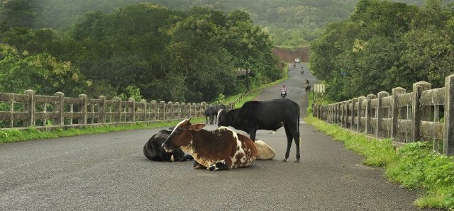

Most dla samochodów i autobusów.

- Type: Object
- Subjects: Transportation
- Country: Poland
- Quests: [Rzeka Odra (pl_03)](../quest/pl_03.pl.md)

### Most kolejowy

Most z torami kolejowymi.

- Type: Object
- Subjects: Transportation, Technology
- Country: Poland
- Quests: [Rzeka Odra (pl_03)](../quest/pl_03.pl.md)

### Most Rędziński

Najdłuższy most wantowy w Polsce.

- Type: Place
- Subjects: Geography, Transportation, Technology
- Country: Poland
- Quests: [Rzeka Odra (pl_03)](../quest/pl_03.pl.md)

### Most Tumski

Słynny most z kłódkami symbolizującymi miłość i latarniami gazowymi.

- Type: Place
- Subjects: Culture, Geography, Community
- Country: Poland
- Quests: [Rzeka Odra (pl_03)](../quest/pl_03.pl.md)

### Mosty Wrocławskie

We Wrocławiu nad Odrą przebiega wiele mostów.

- Type: Concept
- Subjects: Geography, Transportation, Community
- Country: Poland
- Quests: [Rzeka Odra (pl_03)](../quest/pl_03.pl.md)

### Muszla

Twardy muszla zwierzęcia morskiego, przydatna do rękodzieła.

- Type: Object
- Subjects: Animal, Environment, Art
- Country: Poland
- Quests: [Gdański naszyjnik bursztynowy (pl_05)](../quest/pl_05.pl.md)

### Młode

Mały lew.

- Type: Concept
- Subjects: Animal, Science
- Country: Poland
- Quests: [Zoo (pl_04)](../quest/pl_04.pl.md)

### Naszyjnik

Sznur koralików lub muszelek noszony na szyi.

- Type: Object
- Subjects: Art, Culture
- Country: Poland
- Quests: [Gdański naszyjnik bursztynowy (pl_05)](../quest/pl_05.pl.md)

### Nawigacja
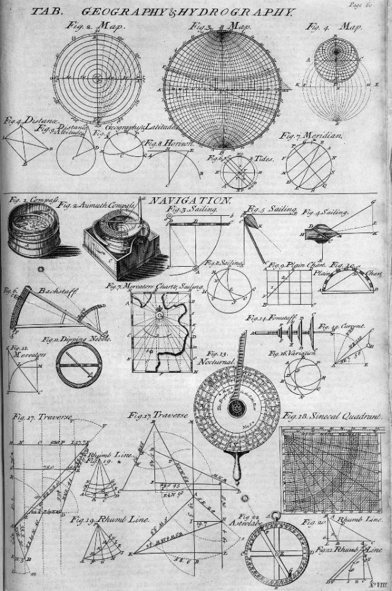

Znalezienie drogi na morzu za pomocą świateł, map i narzędzi.

- Type: Concept
- Subjects: Technology, Geography
- Country: Poland
- Quests: [Gdański naszyjnik bursztynowy (pl_05)](../quest/pl_05.pl.md)

### Neptun

Bóg morza ze starych opowieści.

- Type: Concept
- Subjects: Culture, History
- Country: Poland
- Quests: [Kopernik i układ słoneczny (pl_07)](../quest/pl_07.pl.md)

### Nóż

Mała łódź rybacka używana na morzu.

- Type: Object
- Subjects: Transportation, Technology
- Country: Poland
- Quests: [Gdański naszyjnik bursztynowy (pl_05)](../quest/pl_05.pl.md)

### Obiektyw

Przezroczysta szyba lub plastik, która załamuje światło.

- Type: Object
- Subjects: Science, Technology
- Country: Poland
- Quests: [Kopernik i układ słoneczny (pl_07)](../quest/pl_07.pl.md)

### Odra river map

A simple map that shows the Odra River in Poland and the way it flows to the Baltic Sea

- Type: None
- Subjects: Geography
- Country: Poland
- Quests: [Rzeka Odra (pl_03)](../quest/pl_03.pl.md)

### Ogród Zoologiczny we Wrocławiu

Duży ogród zoologiczny we Wrocławiu, w którym można poznać wiele zwierząt.

- Type: Place
- Subjects: Geography, Education, Animal
- Country: Poland
- Quests: [Zoo (pl_04)](../quest/pl_04.pl.md)

### Okular

Mała soczewka, przez którą patrzysz w teleskopie.

- Type: Object
- Subjects: Science, Technology
- Country: Poland
- Quests: [Kopernik i układ słoneczny (pl_07)](../quest/pl_07.pl.md)

### Olga Tokarczuk

Znany polski pisarz mieszkający we Wrocławiu.

- Type: Person
- Subjects: Literature, Culture
- Country: Poland
- Quests: [Wielka akcja ratunkowa krasnala wrocławskiego (pl_02)](../quest/pl_02.pl.md)

### Opiekun zoo

Osoba opiekująca się zwierzętami w zoo.

- Type: Person
- Subjects: Community, Animal, Education
- Country: Poland
- Quests: [Zoo (pl_04)](../quest/pl_04.pl.md)

### Panorama Racławicka

Otacza Cię gigantyczny obraz przedstawiający historyczną bitwę.

- Type: Place
- Subjects: History, Art, Culture
- Country: Poland
- Quests: [Wielka akcja ratunkowa krasnala wrocławskiego (pl_02)](../quest/pl_02.pl.md)

### Papuga

Jasny ptak, który potrafi naśladować dźwięki.

- Type: Object
- Subjects: Animal, Science
- Country: Poland
- Quests: [Zoo (pl_04)](../quest/pl_04.pl.md)

### Paw

Kolorowy ptak z dużym ogonem z piór.

- Type: Object
- Subjects: Animal, Science, Art
- Country: Poland
- Quests: [Zoo (pl_04)](../quest/pl_04.pl.md)

### Pierniki toruńskie

tradycyjny polski przysmak przygotowywany z przypraw i miodu, często kształtowany w piękne wzory.

- Type: Object
- Subjects: Food
- Country: Poland
- Quests: [Pierniki i targ spożywczy (pl_06)](../quest/pl_06.pl.md)

### Planetarium

Miejsce, w którym można zobaczyć niebo i gwiazdy w pomieszczeniu.

- Type: Place
- Subjects: Education, Science, Space
- Country: Poland
- Quests: [Kopernik i układ słoneczny (pl_07)](../quest/pl_07.pl.md)

### Podpisać

Tablica z prostymi faktami, które pomogą Ci się uczyć.

- Type: Object
- Subjects: Education, Community
- Country: Poland
- Quests: [Zoo (pl_04)](../quest/pl_04.pl.md)

### Pokój Bursztynowy

Słynny pokój z bursztynu o tajemniczej historii.

- Type: Concept
- Subjects: History, Culture
- Country: Poland
- Quests: [Gdański naszyjnik bursztynowy (pl_05)](../quest/pl_05.pl.md)

### Polskie krasnale (wrocławskie krasnale)

Małe figurki krasnali kryją się we Wrocławiu. Ich odnalezienie to fajna gra miejska.

- Type: Concept
- Subjects: Community, Culture
- Year: 1700
- Country: Poland
- Quests: [Odkryj Warszawę (pl_01)](../quest/pl_01.pl.md), [Wielka akcja ratunkowa krasnala wrocławskiego (pl_02)](../quest/pl_02.pl.md)

### Polskie pierogi

Pierogi z nadzieniem ziemniaczanym, serowym lub owocowym. To słynne polskie danie.

- Type: Object
- Subjects: Food, Culture
- Year: 1600
- Country: Poland
- Quests: [Pierniki i targ spożywczy (pl_06)](../quest/pl_06.pl.md)

### Pomnik Chopina

Duży pomnik w warszawskich Łazienkach Królewskich poświęcony Fryderykowi Chopinowi. Latem odbywają się tam również popularne plenerowe koncerty fortepianowe. (Specjalne drzewo, pod którym siedzi, to typowa polska… wierzba)

- Type: Object
- Subjects: Music, Culture
- Country: Poland
- Quests: [Odkryj Warszawę (pl_01)](../quest/pl_01.pl.md)

### Port

Miejsce, w którym statki załadowują się i rozładowują.

- Type: Place
- Subjects: Transportation, Community, Geography
- Country: Poland
- Quests: [Gdański naszyjnik bursztynowy (pl_05)](../quest/pl_05.pl.md)

### Ratusz

Miejsce, w którym pracują i spotykają się przywódcy miasta.

- Type: Concept
- Subjects: Civics, Community, History
- Country: Poland
- Quests: [Wielka akcja ratunkowa krasnala wrocławskiego (pl_02)](../quest/pl_02.pl.md)

### Ratusz w Toruniu

Duża gotycka budowla w Toruniu, położona tuż przy rynku.

- Type: Place
- Subjects: History, Geography, Culture
- Country: Poland
- Quests: [Pierniki i targ spożywczy (pl_06)](../quest/pl_06.pl.md)

### Rtęć

Najbliższa Słońcu planeta, mała i bardzo szybka.

- Type: Object
- Subjects: Space, Science
- Country: Poland
- Quests: [Kopernik i układ słoneczny (pl_07)](../quest/pl_07.pl.md)

### Rybak

Osoba łowiąca ryby w morzu.

- Type: Person
- Subjects: Community, Geography
- Country: Poland
- Quests: [Gdański naszyjnik bursztynowy (pl_05)](../quest/pl_05.pl.md)

### Rynek wrocławski

Główny plac Starego Miasta, pełen życia.

- Type: Place
- Subjects: Geography, Culture, Community, History
- Country: Poland
- Quests: [Wielka akcja ratunkowa krasnala wrocławskiego (pl_02)](../quest/pl_02.pl.md)

### Rzeka Motława

Rzeka przepływająca przez Gdańsk do morza.

- Type: Place
- Subjects: Geography
- Country: Poland
- Quests: [Gdański naszyjnik bursztynowy (pl_05)](../quest/pl_05.pl.md)

### Rzeka Odra

Duża rzeka w zachodniej Polsce. Umożliwia statkom podróżowanie i handel.

- Type: Place
- Subjects: Geography, Environment
- Country: Poland
- Quests: [Rzeka Odra (pl_03)](../quest/pl_03.pl.md)

### Rzeźba Krasnala wrocławskiego

Niewielka figurka miejska; krasnale są symbolem Wrocławia.

- Type: Object
- Subjects: Culture, Community, History
- Country: Poland
- Quests: [Wielka akcja ratunkowa krasnala wrocławskiego (pl_02)](../quest/pl_02.pl.md)

### Saturn

Olbrzymia planeta z jasnymi pierścieniami i wieloma księżycami.

- Type: Object
- Subjects: Space, Science
- Country: Poland
- Quests: [Kopernik i układ słoneczny (pl_07)](../quest/pl_07.pl.md)

### Sieć rybacka

Sieć służąca do połowu ryb.

- Type: Object
- Subjects: Technology, Community
- Country: Poland
- Quests: [Gdański naszyjnik bursztynowy (pl_05)](../quest/pl_05.pl.md)

### Sky Tower Plaza

Nowoczesny plac, na którym ludzie spotykają się w pobliżu wieży.

- Type: Place
- Subjects: Geography, Community, Recreation
- Country: Poland
- Quests: [Wielka akcja ratunkowa krasnala wrocławskiego (pl_02)](../quest/pl_02.pl.md)

### Stary Ratusz (Wrocław)

Piękny gotycki budynek na głównym placu. Znajduje się w nim słynny zegar.

- Type: Place
- Subjects: Geography, Environment
- Country: Poland
- Quests: [Wielka akcja ratunkowa krasnala wrocławskiego (pl_02)](../quest/pl_02.pl.md)

### Statek

Duża łódź przewożąca ludzi lub towary.

- Type: Object
- Subjects: Transportation
- Country: Poland
- Quests: [Gdański naszyjnik bursztynowy (pl_05)](../quest/pl_05.pl.md)

### Syrena Warszawska

Symbolem miasta jest odważna syrena z mieczem i tarczą. Jej posąg można zobaczyć nad rzeką.

- Type: Object
- Subjects: Culture, History
- Country: Poland
- Quests: [Odkryj Warszawę (pl_01)](../quest/pl_01.pl.md)

### Teleskop

Narzędzie pozwalające nam zobaczyć odległe obiekty na niebie.

- Type: Object
- Subjects: Science, Technology, Space
- Country: Poland
- Quests: [Kopernik i układ słoneczny (pl_07)](../quest/pl_07.pl.md)

### Toruń

Miasto w Polsce, w którym urodził się Mikołaj Kopernik.

- Type: Place
- Subjects: Geography, History, Culture
- Country: Poland
- Quests: [Kopernik i układ słoneczny (pl_07)](../quest/pl_07.pl.md)

### Układ Słoneczny

Słońce i osiem planet krążących wokół niego.

- Type: Concept
- Subjects: Space, Science
- Country: Poland
- Quests: [Kopernik i układ słoneczny (pl_07)](../quest/pl_07.pl.md)

### Uran

Niebiesko-zielona planeta obracająca się na boku.

- Type: Object
- Subjects: Space, Science
- Country: Poland
- Quests: [Kopernik i układ słoneczny (pl_07)](../quest/pl_07.pl.md)

### Waluta Złoty
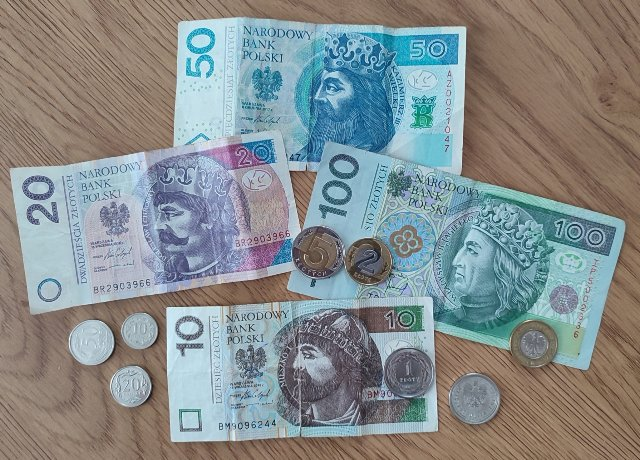

Walutą polską jest złoty. Monety i banknoty mają symbole polskie.

- Type: Concept
- Subjects: Money, Geography
- Country: Poland
- Quests: [Pierniki i targ spożywczy (pl_06)](../quest/pl_06.pl.md)

### Wars i Sawa

Dwie legendarne postacie, które nadały Warszawie nazwę. Wars był dzielnym wojownikiem, a Sawa piękną syreną, która mieszkała w Wiśle.

- Type: Concept
- Subjects: Community, Culture
- Year: 1300
- Country: Poland
- Quests: [Odkryj Warszawę (pl_01)](../quest/pl_01.pl.md)

### Wenus

Bardzo gorąca planeta pokryta grubymi chmurami.

- Type: Object
- Subjects: Space, Science
- Country: Poland
- Quests: [Kopernik i układ słoneczny (pl_07)](../quest/pl_07.pl.md)

### Wisła

Najdłuższa rzeka Polski. Uchodzi do Morza Bałtyckiego.

- Type: Place
- Subjects: Geography, Environment
- Country: Poland
- Quests: [Wielka akcja ratunkowa krasnala wrocławskiego (pl_02)](../quest/pl_02.pl.md)

### Wisła (Wisła)

Najdłuższa rzeka w Polsce nazywa się Wisła. Przepływa przez Kraków i Warszawę.

- Type: Place
- Subjects: Geography, Environment
- Country: Poland
- Quests: [Rzeka Odra (pl_03)](../quest/pl_03.pl.md)

### Wrocław
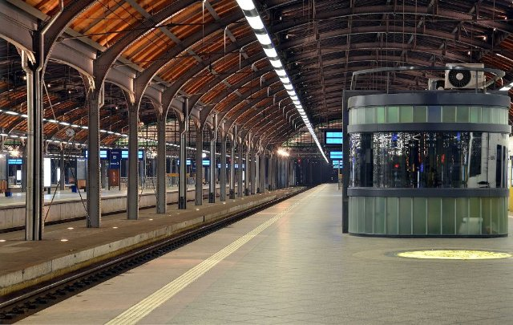

Miasto w Polsce z rzekami, mostami i historią.

- Type: Place
- Subjects: Geography, History, Culture
- Country: Poland
- Quests: [Zoo (pl_04)](../quest/pl_04.pl.md)

### Wrocław: Katedra

Duży, ważny kościół, w którym ludzie się modlą. Można wspiąć się na wieżę, żeby zobaczyć widok.

- Type: Place
- Subjects: History, Culture
- Country: Poland
- Quests: [Wielka akcja ratunkowa krasnala wrocławskiego (pl_02)](../quest/pl_02.pl.md)

### Wrocław: Sky Tower

Jeden z najwyższych budynków w Polsce. Znajdują się w nim sklepy i punkt widokowy.

- Type: Place
- Subjects: Geography, Community, Culture
- Country: Poland
- Quests: [Wielka akcja ratunkowa krasnala wrocławskiego (pl_02)](../quest/pl_02.pl.md)

### Wrocławska Fontanna Multimedialna

Woda tańcząca w rytm muzyki i kolorowych świateł.

- Type: Place
- Subjects: Culture, Technology, Recreation
- Country: Poland
- Quests: [Wielka akcja ratunkowa krasnala wrocławskiego (pl_02)](../quest/pl_02.pl.md)

### Wybieg dla zwierząt

Bezpieczna przestrzeń w zoo, w której mogą żyć zwierzęta.

- Type: Place
- Subjects: Animal, Safety
- Country: Poland
- Quests: [Zoo (pl_04)](../quest/pl_04.pl.md)

### Wybrzeże Morza Bałtyckiego

Piaskowy brzeg Morza Bałtyckiego.

- Type: Place
- Subjects: Geography, Environment
- Country: Poland
- Quests: [Gdański naszyjnik bursztynowy (pl_05)](../quest/pl_05.pl.md)

### Ziemia

Nasza planeta rodzinna z lądem, powietrzem i wodą.

- Type: Object
- Subjects: Space, Science, Geography, Environment
- Country: Poland
- Quests: [Kopernik i układ słoneczny (pl_07)](../quest/pl_07.pl.md)

### Łódź

Pojazd poruszający się po wodzie.

- Type: Object
- Subjects: Transportation
- Country: Poland
- Quests: [Rzeka Odra (pl_03)](../quest/pl_03.pl.md)

### Żuraw Żuraw

Stary dźwig portowy i brama miejska nad rzeką.

- Type: Place
- Subjects: History, Technology, Geography
- Country: Poland
- Quests: [Gdański naszyjnik bursztynowy (pl_05)](../quest/pl_05.pl.md)

