# Cards(pl)

Language: [english](./index.md) - [french](./index.fr.md) - polish - [italian](./index.it.md)

!!! note "Educators: help improving these cards!"
    **Comments and feedback**: [discuss in the Forum](https://vgwb.discourse.group)  
    **Improve translations**: [comment here](https://docs.google.com/spreadsheets/d/1M3uOeqkbE4uyDs5us5vO-nAFT8Aq0LGBxjjT_CSScWw/edit?gid=415931977#gid=415931977)  

Total found:** 364**

## International

### Alpy
{ loading=lazy }

Wysokie pasmo górskie w Europie.

- Type: Place
- Subjects: Geography, Environment
- Country: International
- Topics: [mont blanc](../topics/index.md#mont_blanc)
- Image credit: CC_BY_SA | Drat70 | [source](https://commons.wikimedia.org/wiki/File:Alps_regions.svg)
- Quests: [Mont Blanc i góry (fr_08)](../quest/fr_08.pl.md)

---

### Autobus
{ loading=lazy }

Duży pojazd, którym można przewieźć wiele osób.

- Type: Object
- Subjects: Transportation, Community
- Country: International
- Image credit: CC_BY_SA | Xosema | [source](https://commons.wikimedia.org/wiki/File:Setra_S6_-_Empresa_Mosquera_-_02.jpg)
- Quests: [Odkryj Warszawę (pl_01)](../quest/pl_01.pl.md)

---

### Badylarz
{ loading=lazy }

Osoba sprzedająca świeże owoce i warzywa.

- Type: Person
- Subjects: History, Culture
- Country: International
- Topics: [market traders](../topics/index.md#marketers)
- Image credit: CC0 | [source](https://commons.wikimedia.org/wiki/File:Barcelona_330DSC_0356_(49865911251).jpg)
- Quests: [Jedzenie i targ (fr_09)](../quest/fr_09.pl.md)

---

### Belgia
{ loading=lazy }

Państwo w Europie. Stolicą jest Bruksela.

- Type: Place
- Subjects: Geography, Culture
- Country: International
- Image credit: CC_BY | Loc7798_R01.jpg: Marc Ryckaert (MJJR)
derivative work: Kabelleger (talk) | [source](https://commons.wikimedia.org/wiki/File:Loc7798_R01_alt.jpg)

---

### Berno
{ loading=lazy }

Stolica Szwajcarii.

- Type: Place
- Subjects: Geography, Culture
- Country: International
- Image credit: CC_BY_SA | Daniel Kraft | [source](https://commons.wikimedia.org/wiki/File:Bern_Panorama_von_Rosengarten_20211007.jpg)

---

### Bezpieczeństwo na ulicy
Zasady zapewniające bezpieczeństwo wszystkim uczestnikom ruchu drogowego.

- Type: Concept
- Subjects: Transportation, Civics, Health
- Country: International
- Topics: [Stree safety](../topics/index.md#street-safety)

---

### Białoruś
{ loading=lazy }

Państwo w Europie. Stolicą jest Mińsk.

- Type: Place
- Subjects: Geography, Culture
- Country: International
- Topics: [Poland Countries](../topics/index.md#poland_countries_around)
- Image credit: CC0 | [source](https://commons.wikimedia.org/wiki/File:Satellite_image_of_Belarus_in_December_2002.jpg)

---

### Bilet na Wieżę Eiffla
{ loading=lazy }

Specjalny dokument umożliwiający odwiedzenie słynnej wysokiej wieży w Paryżu, we Francji.

- Type: Object
- Subjects: Science
- Country: International
- Topics: [Eiffel Tower](../topics/index.md#eiffel-tower)
- Image credit: CC0
- Quests: [Paryż! (fr_01)](../quest/fr_01.pl.md)

---

### Bobsleje
{ loading=lazy }

Szybkie sanki służące do zjeżdżania po lodzie.

- Type: Object
- Subjects: Sport, Recreation
- Country: International
- Image credit: CC_BY_SA | Steffen Prößdorf | [source](https://commons.wikimedia.org/wiki/File:2020-02-22_IBSF_World_Championships_Bobsleigh_and_Skeleton_Altenberg_1DX_5978_by_Stepro.jpg)
- Quests: [Mont Blanc i góry (fr_08)](../quest/fr_08.pl.md)

---

### Boisko do piłki nożnej
{ loading=lazy }

Trawiaste boisko, na którym gra się w piłkę nożną.

- Type: Place
- Subjects: Sport, Recreation, Community
- Country: International
- Image credit: CC_BY_SA | لا روسا | [source](https://commons.wikimedia.org/wiki/File:Santiagobernabeupanoramav45.JPG)
- Quests: [Odkryj Warszawę (pl_01)](../quest/pl_01.pl.md)

---

### Bramka
{ loading=lazy }

Siatka, do której próbujesz strzelić gola.

- Type: Object
- Subjects: Sport, Recreation
- Country: International
- Image credit: CC_BY_SA | Dietmar Rabich | [source](https://commons.wikimedia.org/wiki/File:Dülmen,_Sportzentrum_Süd_--_2012_--_4121.jpg)
- Quests: [Odkryj Warszawę (pl_01)](../quest/pl_01.pl.md)

---

### Bratysława
{ loading=lazy }

Stolica Słowacji.

- Type: Place
- Subjects: Geography, Culture
- Country: International
- Image credit: CC_BY_SA | Jakub Hałun | [source](https://commons.wikimedia.org/wiki/File:View_of_Bratislava_from_Nový_most,_20210727_1012_0262.jpg)

---

### Bruksela
{ loading=lazy }

Stolica Belgii.

- Type: Place
- Subjects: Geography, Culture
- Country: International
- Image credit: CC_BY_SA | Horst J. Meuter | [source](https://commons.wikimedia.org/wiki/File:Atomium,_Brüssel_2.jpg)

---

### Chimpanzee
{ loading=lazy }

No translation found for 'animal_chimpanzee.desc' in Cards

- Type: None
- Country: International
- Image credit: CC0 | [source](https://commons.wikimedia.org/wiki/File:Common_chimpanzee_(Pan_troglodytes_schweinfurthii)_feeding.jpg)
- Quests: [Zoo (pl_04)](../quest/pl_04.pl.md)

---

### CHLEB
{ loading=lazy }

Pyszne danie z mąki i wody. Można zrobić kanapki z chleba!

- Type: Object
- Subjects: Food, Culture
- Country: International
- Topics: [Bouillabaisse](../topics/index.md#bouillabaisse)
- Image credit: CC0 | [source](https://commons.wikimedia.org/wiki/File:French_bread_DSC09293.jpg)
- Quests: [Jedzenie i targ (fr_09)](../quest/fr_09.pl.md)

---

### Cynamon
{ loading=lazy }

Słodka przyprawa wytwarzana z kory drzewa.

- Type: Object
- Subjects: Food, Plant
- Country: International
- Topics: [Gingerbread](../topics/index.md#gingerbread)
- Image credit: CC_BY_SA | Simon A. Eugster | [source](https://commons.wikimedia.org/wiki/File:Cinnamomum_verum_spices.jpg)
- Quests: [Pierniki i targ spożywczy (pl_06)](../quest/pl_06.pl.md)

---

### Cytrynowy
{ loading=lazy }

Żółty owoc o bardzo kwaśnym smaku. Cytryny służą do robienia lemoniady!

- Type: Object
- Subjects: Food, Culture
- Country: International
- Topics: [Bouillabaisse](../topics/index.md#bouillabaisse)
- Image credit: CC0 | [source](https://commons.wikimedia.org/wiki/File:Lemon.jpg)
- Quests: [Jedzenie i targ (fr_09)](../quest/fr_09.pl.md)

---

### Czechy
{ loading=lazy }

Kraj w Europie. Stolicą jest Praga.

- Type: Place
- Subjects: Geography, Culture
- Country: International
- Topics: [Poland Countries](../topics/index.md#poland_countries_around)
- Image credit: CC_BY_SA | Tadeáš Bednarz | [source](https://commons.wikimedia.org/wiki/File:Daniel_Souček_U21_Czech_Republic_vs_Greece_10-10-2019.jpg)

---

### Dom na łodzi
{ loading=lazy }

Dom, który unosi się na wodzie jak łódź. Ludzie mogą mieszkać w domkach-łódkach!

- Type: Place
- Subjects: Geography, Environment
- Country: International
- Image credit: CC0

---

### Drożdże
{ loading=lazy }

Drożdże to magiczny proszek, który sprawia, że ​​chleb jest miękki i smaczny!

- Type: Object
- Subjects: Food, Culture
- Country: International
- Topics: [Baguette](../topics/index.md#baguette)
- Image credit: CC0

---

### Dzień Niepodległości (Polska)
{ loading=lazy }

Święto narodowe obchodzone 11 listopada.

- Type: Concept
- Subjects: Civics, History, Time
- Country: International
- Image credit: CC_BY_SA | Patryk Matyjaszczyk | [source](https://commons.wikimedia.org/wiki/File:Narodowe_Święto_Niepodległości_2012_01.JPG)
- Quests: [Odkryj Warszawę (pl_01)](../quest/pl_01.pl.md)

---

### Eleementary Maths
Numbers and shapes for everyday life: counting, adding and subtracting, simple fractions, measuring, telling time, and using money.

- Type: None
- Country: International
- Topics: [Elementary Math](../topics/index.md#elementary-maths)

---

### Flag of Czech Republic
{ loading=lazy }

The flag has white and red stripes with a blue triangle. The Czech Republic is famous for beautiful Prague castle and crystal glass.

- Rationale: Central European countries help kids understand the region around Poland
- Type: Concept
- Subjects: Geography, Culture
- Year: 1920
- Country: International
- Topics: [Flags of Europe](../topics/index.md#flags_euroe), [Poland Countries](../topics/index.md#poland_countries_around)
- Image credit: CC0
- Quests: [Sąsiedzi Francji (fr_00)](../quest/fr_00.pl.md), [Sąsiedzi Polski (pl_00)](../quest/pl_00.pl.md)

---

### Flaga Belgii
{ loading=lazy }

Flaga Belgii ma trzy pionowe pasy: czarny, żółty i czerwony. Belgia słynie z czekolady i gofrów!

- Rationale: Belgium's unique vertical stripes help kids distinguish different flag patterns
- Type: Concept
- Subjects: Geography, Culture
- Year: 1831
- Country: International
- Topics: [Flags of Europe](../topics/index.md#flags_euroe), [Countries around France](../topics/index.md#france_countries_around)
- Image credit: CC0
- Quests: [Sąsiedzi Francji (fr_00)](../quest/fr_00.pl.md)

---

### Flaga Białorusi
{ loading=lazy }

Flaga Białorusi ma poziome, czerwone i zielone pasy z pięknymi, tradycyjnymi wzorami po bokach. Białoruś jest sąsiadem Polski.

- Rationale: Learning neighboring countries helps kids understand regional geography
- Type: Concept
- Subjects: Geography, Culture
- Year: 1995
- Country: International
- Topics: [Poland Countries](../topics/index.md#poland_countries_around)
- Image credit: CC0
- Quests: [Sąsiedzi Polski (pl_00)](../quest/pl_00.pl.md)

---

### Flaga Litwy
{ loading=lazy }

Flaga ma poziome pasy w kolorze żółtym, zielonym i czerwonym. Litwa to kraj bałtycki z pięknymi lasami i plażami.

- Rationale: Baltic countries teach kids about northern European geography and Poland's neighbors
- Type: Concept
- Subjects: Geography, Culture
- Year: 1988
- Country: International
- Topics: [Poland Countries](../topics/index.md#poland_countries_around)
- Image credit: CC0
- Quests: [Sąsiedzi Polski (pl_00)](../quest/pl_00.pl.md)

---

### Flaga Luksemburga
{ loading=lazy }

Flaga Luksemburga ma poziome pasy w kolorze czerwonym, białym i jasnoniebieskim. Luksemburg to bardzo mały kraj, w którym mówi się trzema językami!

- Rationale: Small multilingual countries teach kids about European diversity
- Type: Concept
- Subjects: Geography, Culture
- Year: 1972
- Country: International
- Topics: [Flags of Europe](../topics/index.md#flags_euroe), [Countries around France](../topics/index.md#france_countries_around)
- Image credit: CC0
- Quests: [Sąsiedzi Francji (fr_00)](../quest/fr_00.pl.md)

---

### Flaga Rosji
{ loading=lazy }

Flaga z białymi, niebieskimi i czerwonymi paskami. Reprezentuje Rosję.

- Type: Concept
- Subjects: Community, Culture
- Country: International
- Topics: [Poland Countries](../topics/index.md#poland_countries_around)
- Image credit: CC0
- Quests: [Sąsiedzi Polski (pl_00)](../quest/pl_00.pl.md)

---

### Flaga Szwajcarii
{ loading=lazy }

Flaga Szwajcarii jest czerwona z białym krzyżem pośrodku. Wygląda jak apteczka pierwszej pomocy! Szwajcaria słynie z gór i sera.

- Rationale: The Swiss flag's unique cross design helps kids remember this mountain country
- Type: Concept
- Subjects: Geography, Culture
- Year: 1889
- Country: International
- Topics: [Flags of Europe](../topics/index.md#flags_euroe), [Countries around France](../topics/index.md#france_countries_around)
- Image credit: CC0
- Quests: [Sąsiedzi Francji (fr_00)](../quest/fr_00.pl.md)

---

### Flaga Słowacji
{ loading=lazy }

Flaga w kolorach białym, niebieskim i czerwonym. Reprezentuje Słowację.

- Type: Concept
- Subjects: Community, Culture
- Country: International
- Topics: [Flags of Europe](../topics/index.md#flags_euroe), [Poland Countries](../topics/index.md#poland_countries_around)
- Image credit: CC0
- Quests: [Sąsiedzi Francji (fr_00)](../quest/fr_00.pl.md), [Sąsiedzi Polski (pl_00)](../quest/pl_00.pl.md)

---

### Flaga Ukrainy
{ loading=lazy }

Flaga w kolorach niebieskim i żółtym, przypominającym niebo i słońce. Reprezentuje Ukrainę.

- Type: Concept
- Subjects: Community, Culture
- Country: International
- Topics: [Flags of Europe](../topics/index.md#flags_euroe), [Poland Countries](../topics/index.md#poland_countries_around)
- Image credit: CC0
- Quests: [Sąsiedzi Francji (fr_00)](../quest/fr_00.pl.md), [Sąsiedzi Polski (pl_00)](../quest/pl_00.pl.md)

---

### food_apple
{ loading=lazy }

No translation found for 'food_apple.desc' in Cards

- Type: Object
- Country: International
- Image credit: CC0 | [source](https://commons.wikimedia.org/wiki/File:Red_Apple.jpg)
- Quests: [Zoo (pl_04)](../quest/pl_04.pl.md)

---

### food_banana
{ loading=lazy }

No translation found for 'food_banana.desc' in Cards

- Type: Object
- Country: International
- Image credit: CC0 | [source](https://commons.wikimedia.org/wiki/File:Banana_on_whitebackground.jpg)
- Quests: [Zoo (pl_04)](../quest/pl_04.pl.md)

---

### Forma do pierników
{ loading=lazy }

Narzędzie w kształcie ciasteczka, które pozwala na tworzenie ciekawych kształtów.

- Type: Object
- Subjects: Food, Art
- Country: International
- Topics: [Gingerbread](../topics/index.md#gingerbread)
- Image credit: CC_BY_SA | Piotr Kuczyński | [source](https://commons.wikimedia.org/wiki/File:Traditional_gingerbread_mold_2_(Piotr_Kuczynski).jpg)
- Quests: [Pierniki i targ spożywczy (pl_06)](../quest/pl_06.pl.md)

---

### Francuski plakat szkolny
{ loading=lazy }

Duży obraz z informacjami, który wisi na ścianach klas we francuskich szkołach.

- Type: Object
- Subjects: Education
- Country: International
- Image credit: CC0
- Quests: [Juliusz Verne i transport (fr_03)](../quest/fr_03.pl.md)

---

### French Schools
In France, school happens in four main steps: maternelle (play-and-learn for little kids), école élémentaire (reading, writing, maths), collège (middle school), and lycée (high school). At the end of lycée, many students take a big exam called the baccalauréat (‘le bac’)

- Type: Concept
- Subjects: Education, Civics, Culture
- Country: International
- Topics: [French School](../topics/index.md#frenchschool)

---

### Goździki
{ loading=lazy }

Mocna przyprawa używana do wzbogacania smaku potraw.

- Type: Object
- Subjects: Food, Plant
- Country: International
- Image credit: CC_BY_SA | Friedrich Haag | [source](https://commons.wikimedia.org/wiki/File:Gewuerze_004_2024_08_10.jpg)
- Quests: [Pierniki i targ spożywczy (pl_06)](../quest/pl_06.pl.md)

---

### Góra
{ loading=lazy }

Filary ziemi

- Type: Concept
- Subjects: Environment, Education
- Country: International
- Topics: [mont blanc](../topics/index.md#mont_blanc), [mountain activities](../topics/index.md#mountain_activities), [mountain tools](../topics/index.md#mountain_tools)
- Image credit: CC_BY | Vyacheslav Argenberg | [source](https://commons.wikimedia.org/wiki/File:Himalayas,_Ama_Dablam,_Nepal.jpg)
- Quests: [Mont Blanc i góry (fr_08)](../quest/fr_08.pl.md)

---

### ice_arctic
{ loading=lazy }

No translation found for 'ice_arctic.desc' in Cards

- Type: Place
- Country: International
- Image credit: CC0 | [source](https://commons.wikimedia.org/wiki/File:Helicopter_View_(3978020016).jpg)
- Quests: [Zoo (pl_04)](../quest/pl_04.pl.md)

---

### Ile-de-France
{ loading=lazy }

Region we Francji, w którym znajduje się stolica, Paryż. Mieszka tu wielu ludzi!

- Type: Place
- Subjects: Geography, Environment
- Country: International
- Topics: [Notre Dame](../topics/index.md#notredame)
- Image credit: CC0
- Quests: [Paryż! (fr_01)](../quest/fr_01.pl.md)

---

### Jajka
{ loading=lazy }

Pokarm z kurczaków, używany do pieczenia i gotowania.

- Type: Object
- Subjects: Food, Animal
- Country: International
- Topics: [Gingerbread](../topics/index.md#gingerbread)
- Image credit: CC_BY_SA | George Chernilevsky | [source](https://commons.wikimedia.org/wiki/File:Eggs_in_basket_2020_G1.jpg)
- Quests: [Pierniki i targ spożywczy (pl_06)](../quest/pl_06.pl.md)

---

### Kapelusz
{ loading=lazy }

Ciepła czapka na głowę.

- Type: Object
- Subjects: Health, Safety, Weather
- Country: International
- Topics: [mountain tools](../topics/index.md#mountain_tools)
- Image credit: CC0 | Michael Evans | [source](https://commons.wikimedia.org/wiki/File:Ronald_Reagan_with_cowboy_hat_12-0071M_edit.jpg)
- Quests: [Mont Blanc i góry (fr_08)](../quest/fr_08.pl.md)

---

### Kijów
{ loading=lazy }

Stolica Ukrainy.

- Type: Place
- Subjects: Geography, Culture
- Country: International
- Image credit: CC_BY_SA | Moahim | [source](https://commons.wikimedia.org/wiki/File:2017_-_Київ_-_Світанок_над_Дніпром.jpg)

---

### Klasa
{ loading=lazy }

Pomieszczenie w szkole, w którym uczniowie siedzą i uczą się nowych rzeczy od nauczyciela.

- Type: Place
- Subjects: Education, Community
- Country: International
- Image credit: CC0
- Quests: [System edukacji (fr_02)](../quest/fr_02.pl.md), [Juliusz Verne i transport (fr_03)](../quest/fr_03.pl.md)

---

### Kolumna Króla Zygmunta
{ loading=lazy }

Wysoka kolumna ku czci króla Zygmunta na Placu Zamkowym.

- Type: Place
- Subjects: History, Culture
- Country: International
- Image credit: CC_BY_SA | Haydn Blackey from Cardiff, Wales | [source](https://commons.wikimedia.org/wiki/File:Column_of_King_Sigismund_III_Vasa_-_Warsaw_(53113393114).jpg)
- Quests: [Odkryj Warszawę (pl_01)](../quest/pl_01.pl.md)

---

### Kompas
{ loading=lazy }

Narzędzie, które pomaga rysować idealne okręgi. Ma dwie nogi jak nożyczki.

- Type: Object
- Subjects: Math
- Country: International
- Topics: [Elementary Math](../topics/index.md#elementary-maths)
- Image credit: CC0 | [source](https://commons.wikimedia.org/wiki/File:2023070201_Voigt_Schulzirkel_gespreizt_2023.jpg)
- Quests: [System edukacji (fr_02)](../quest/fr_02.pl.md)

---

### Konstytucja 3 Maja
{ loading=lazy }

Historyczna polska konstytucja obchodzona 3 Maja.

- Type: Concept
- Subjects: Civics, History, Time
- Country: International
- Image credit: CC0 | Constitutional Convention | [source](https://commons.wikimedia.org/wiki/File:Constitution_of_the_United_States,_page_1.jpg)
- Quests: [Odkryj Warszawę (pl_01)](../quest/pl_01.pl.md)

---

### Korona króla Zygmunta
{ loading=lazy }

Korona króla, która spadła i musi zostać odnaleziona.

- Type: Object
- Subjects: History, Culture
- Country: International
- Image credit: CC_BY_SA | Maciej Szczepańczyk | [source](https://commons.wikimedia.org/wiki/File:Sigismund_Augustus_King_of_Poland_and_Grand_Duke_of_Lithuania_incorporates_fiefdoms,_Duchies_of_Courland_and_Semigalia_into_the_Crown_1569.png)
- Quests: [Odkryj Warszawę (pl_01)](../quest/pl_01.pl.md)

---

### Koło
{ loading=lazy }

Okrągły kształt bez rogów. Koła wyglądają jak koła, piłki i monety!

- Type: Concept
- Subjects: Math
- Country: International
- Topics: [Elementary Math](../topics/index.md#elementary-maths)
- Image credit: CC0 | [source](https://commons.wikimedia.org/wiki/File:Squaring_the_circle_a_history_of_the_problem_%281913%29_-_illustration_-_page_29_fig_9.png)
- Quests: [System edukacji (fr_02)](../quest/fr_02.pl.md)

---

### Krab
{ loading=lazy }

Zwierzę morskie z dużymi szczypcami i twardą skorupą. Kraby chodzą bokiem po plaży!

- Type: Object
- Subjects: Food, Culture
- Country: International
- Topics: [Bouillabaisse](../topics/index.md#bouillabaisse)
- Image credit: CC0 | [source](https://commons.wikimedia.org/wiki/File:Fresh_Crab.jpg)
- Quests: [Jedzenie i targ (fr_09)](../quest/fr_09.pl.md)

---

### Kucharz
{ loading=lazy }

Osoba przygotowująca jedzenie.

- Type: Person
- Subjects: Community, Food
- Country: International
- Image credit: CC_BY_SA | Basile Morin | [source](https://commons.wikimedia.org/wiki/File:Kappabashi-dori_streetcorner_(Kitchen_town_-_southern_end)_a_sunny_morning_in_Tokyo_Japan.jpg)
- Quests: [Pierniki i targ spożywczy (pl_06)](../quest/pl_06.pl.md)

---

### Kuchnia
{ loading=lazy }

Pomieszczenie, w którym ludzie gotują i pieką.

- Type: Place
- Subjects: Food
- Country: International
- Image credit: CC_BY_SA | Original:  Mithun Kunwar
Derivative work:  Radomianin | [source](https://commons.wikimedia.org/wiki/File:Grandmother_preparing_food_inside_traditional_kitchen_(edited).jpg)
- Quests: [Pierniki i targ spożywczy (pl_06)](../quest/pl_06.pl.md)

---

### Kupiec handlujący serem
{ loading=lazy }

Osoba sprzedająca wiele rodzajów sera.

- Type: Person
- Subjects: History, Culture
- Country: International
- Topics: [market traders](../topics/index.md#marketers)
- Image credit: CC0 | [source](https://commons.wikimedia.org/wiki/File:Paris_-_Cheese_seller,_Rue_Moufetard_-_3397.jpg)
- Quests: [Jedzenie i targ (fr_09)](../quest/fr_09.pl.md)

---

### Kwadrat
{ loading=lazy }

Narzędzie w kształcie trójkąta, służące do rysowania linii prostych i kątów prostych w matematyce.

- Type: Object
- Subjects: Math
- Country: International
- Topics: [Elementary Math](../topics/index.md#elementary-maths)
- Image credit: CC0 | [source](https://commons.wikimedia.org/wiki/File:Squadra_45.jpg)
- Quests: [System edukacji (fr_02)](../quest/fr_02.pl.md)

---

### Kładki dla pieszych
{ loading=lazy }

Małe mostki dla pieszych. Chronią przed ruchem ulicznym.

- Type: Place
- Subjects: Geography, Environment
- Country: International
- Topics: [Seine Bridges](../topics/index.md#seine_bridges)
- Image credit: CC0
- Quests: [Paryż Sekwana (fr_10)](../quest/fr_10.pl.md)

---

### Leonardo da Vinci
{ loading=lazy }

Niesamowity artysta i naukowiec z Włoch. Namalował Monę Lisę i wynalazł maszyny latające setki lat przed samolotami!

- Type: Person
- Subjects: Art, Science, History
- Year: 1452
- Country: International
- Topics: [Louvre](../topics/index.md#louvre)
- Image credit: CC0

---

### Lew
{ loading=lazy }

Duży kot zwany królem zwierząt. Żyje w grupach zwanych stadami.

- Type: Object
- Subjects: Animal, Environment
- Country: International
- Topics: [Zoo Animals](../topics/index.md#zoo)
- Image credit: CC0
- Quests: [Zoo (pl_04)](../quest/pl_04.pl.md)

---

### Lina
{ loading=lazy }

Mocna lina używana do zapewnienia bezpieczeństwa podczas wspinaczki.

- Type: Object
- Subjects: Safety, Technology, Sport
- Country: International
- Topics: [mountain tools](../topics/index.md#mountain_tools)
- Image credit: CC_BY_SA | Nevit Dilmen | [source](https://commons.wikimedia.org/wiki/File:Coiled_rope_03235.jpg)
- Quests: [Mont Blanc i góry (fr_08)](../quest/fr_08.pl.md)

---

### Linia
{ loading=lazy }

Linia prosta, która prowadzi z jednego punktu do drugiego. Linie mogą być długie lub krótkie.

- Type: Concept
- Subjects: Math
- Country: International
- Topics: [Elementary Math](../topics/index.md#elementary-maths)
- Image credit: CC0 | [source](https://commons.wikimedia.org/wiki/File:Squaring_the_circle_a_history_of_the_problem_%281913%29_-_illustration_-_page_29_fig_9.png)
- Quests: [System edukacji (fr_02)](../quest/fr_02.pl.md)

---

### Linijka
{ loading=lazy }

Proste narzędzie do pomiaru długości przedmiotów. Linijki mają cyfry i linie.

- Type: Object
- Subjects: Math
- Country: International
- Topics: [Elementary Math](../topics/index.md#elementary-maths)
- Image credit: CC0 | [source](https://commons.wikimedia.org/wiki/File:Righello.jpg)
- Quests: [System edukacji (fr_02)](../quest/fr_02.pl.md)

---

### Lion Cub
{ loading=lazy }

No translation found for 'animal_lion_cub.desc' in Cards

- Type: Object
- Country: International
- Image credit: CC0 | [source](https://commons.wikimedia.org/wiki/File:Lion_cub_in_Masai_Mara_National_Park.jpg)
- Quests: [Zoo (pl_04)](../quest/pl_04.pl.md)

---

### Litwa
{ loading=lazy }

Państwo w Europie. Stolicą jest Wilno.

- Type: Place
- Subjects: Geography, Culture
- Country: International
- Topics: [Poland Countries](../topics/index.md#poland_countries_around)
- Image credit: CC_BY_SA | Diliff | [source](https://commons.wikimedia.org/wiki/File:Vilnius_Modern_Skyline_At_Dusk,_Lithuania_-_Diliff.jpg)

---

### Lodowiec
{ loading=lazy }

Wolno poruszający się lód występujący w wysokich górach.

- Type: Concept
- Subjects: Geography, Science, Environment
- Country: International
- Image credit: CC_BY | Kelvinsong | [source](https://commons.wikimedia.org/wiki/File:Glacier_diagram.svg)
- Quests: [Mont Blanc i góry (fr_08)](../quest/fr_08.pl.md)

---

### Luksemburg
{ loading=lazy }

Państwo w Europie. Stolicą jest miasto Luksemburg.

- Type: Place
- Subjects: Geography, Culture
- Country: International
- Topics: [Countries around France](../topics/index.md#france_countries_around)
- Image credit: CC_BY_SA | Cayambe | [source](https://commons.wikimedia.org/wiki/File:Luxembourg_Pfaffenthal_Alzette_Béinchen_01.jpg)

---

### Lód
{ loading=lazy }

Zamarznięta woda, która może być bardzo śliska.

- Type: Concept
- Subjects: Weather, Environment, Science
- Country: International
- Topics: [mont blanc](../topics/index.md#mont_blanc)
- Image credit: CC_BY_SA | Andreas Tille | [source](https://commons.wikimedia.org/wiki/File:IceBlockNearJoekullsarlon.jpg)
- Quests: [Mont Blanc i góry (fr_08)](../quest/fr_08.pl.md)

---

### Mapa Europy
{ loading=lazy }

Mapa przedstawiająca wszystkie kraje Europy. Możesz zobaczyć, gdzie znajdują się Francja, Polska, Niemcy i inne kraje.

- Rationale: Maps help kids understand where different countries are and how they connect
- Type: Concept
- Subjects: Geography, Education
- Year: 2000
- Country: International
- Topics: [Flags of Europe](../topics/index.md#flags_euroe)
- Image credit: CC0
- Quests: [Sąsiedzi Francji (fr_00)](../quest/fr_00.pl.md), [Sąsiedzi Polski (pl_00)](../quest/pl_00.pl.md)

---

### Mapa Wieży Eiffla
{ loading=lazy }

Mapa pokazująca lokalizację słynnej wysokiej wieży w Paryżu.

- Type: Object
- Subjects: Community, Culture
- Country: International
- Topics: [Eiffel Tower](../topics/index.md#eiffel-tower)
- Image credit: CC0
- Quests: [Paryż! (fr_01)](../quest/fr_01.pl.md)

---

### Maria Skłodowska‑Curie
{ loading=lazy }

Naukowiec, który zdobył dwie Nagrody Nobla.

- Type: Person
- Subjects: Science, History
- Country: International
- Image credit: CC0 | Henri Manuel | [source](https://commons.wikimedia.org/wiki/File:Marie_Curie_c._1920s.jpg)
- Quests: [Odkryj Warszawę (pl_01)](../quest/pl_01.pl.md)

---

### Market traders
People who sell food and goods at market stalls—like fishmongers, cheesemongers, and fruit sellers. They weigh, wrap, and call out today’s prices.

- Type: Person
- Subjects: Money, Community
- Country: International
- Topics: [market traders](../topics/index.md#marketers)

---

### Masło
{ loading=lazy }

Żółty tłuszcz wytwarzany z mleka, używany do gotowania i pieczenia.

- Type: Object
- Subjects: Food, Animal
- Country: International
- Topics: [Gingerbread](../topics/index.md#gingerbread)
- Image credit: CC0 | Antoine Vollon | [source](https://commons.wikimedia.org/wiki/File:Antoine_Vollon_-_Mound_of_Butter_-_National_Gallery_of_Art.jpg)
- Quests: [Pierniki i targ spożywczy (pl_06)](../quest/pl_06.pl.md)

---

### Mazurek Dąbrowskiego
{ loading=lazy }

Hymn narodowy Polski.

- Type: Concept
- Subjects: Music, History, Culture
- Country: International
- Image credit: CC0 | Józef Wybicki (1747–1822) | [source](https://commons.wikimedia.org/wiki/File:Mazurek_Dąbrowskiego_manuscript.jpg)
- Quests: [Odkryj Warszawę (pl_01)](../quest/pl_01.pl.md)

---

### Małpa
{ loading=lazy }

Inteligentne zwierzę, które potrafi się wspinać i bawić. Niektóre małpy żyją w dużych rodzinach.

- Type: Object
- Subjects: Animal, Environment
- Country: International
- Topics: [Zoo Animals](../topics/index.md#zoo)
- Image credit: CC0
- Quests: [Zoo (pl_04)](../quest/pl_04.pl.md)

---

### Menu stołówki
{ loading=lazy }

Lista pokazująca, co możesz zjeść w szkolnym lunchu. Pomoże Ci wybrać, co zjeść!

- Type: Object
- Subjects: Community, Culture
- Country: International
- Topics: [French School](../topics/index.md#frenchschool)
- Image credit: CC0 | CC0 - Valeria | [source](https://pixabay.com/photos/menu-restaurant-diner-cafe-8165227/)
- Quests: [System edukacji (fr_02)](../quest/fr_02.pl.md)

---

### Miasto Luksemburg
{ loading=lazy }

Stolica Luksemburga.

- Type: Place
- Subjects: Geography, Culture
- Country: International
- Image credit: CC_BY_SA | Krzysztof Golik | [source](https://commons.wikimedia.org/wiki/File:City_Hall_of_Luxembourg_City_01.jpg)

---

### Miecz Syreny
{ loading=lazy }

Miecz syreny, który musi zostać zwrócony.

- Type: Object
- Subjects: Culture, History
- Country: International
- Image credit: CC_BY_SA | Guillaume Speurt from Vilnius, Lithuania | [source](https://commons.wikimedia.org/wiki/File:Mermaid_statue_with_sword_(8121475992).jpg)
- Quests: [Odkryj Warszawę (pl_01)](../quest/pl_01.pl.md)

---

### Miód
{ loading=lazy }

Słodki przysmak wytwarzany przez pszczoły.

- Type: Object
- Subjects: Food, Animal
- Country: International
- Topics: [Gingerbread](../topics/index.md#gingerbread)
- Image credit: CC0 | John Severns (Severnjc) | [source](https://commons.wikimedia.org/wiki/File:European_honey_bee_extracts_nectar.jpg)
- Quests: [Pierniki i targ spożywczy (pl_06)](../quest/pl_06.pl.md)

---

### Mińsk
{ loading=lazy }

Stolica Białorusi.

- Type: Place
- Subjects: Geography, Culture
- Country: International
- Image credit: CC0 | Dzmitry Rylko | [source](https://commons.wikimedia.org/wiki/File:Minsk,_Belarus,_Serebryanka.jpg)

---

### Mleko
{ loading=lazy }

Biały napój pochodzący od krów. Mleko wzmacnia kości i zęby!

- Type: Object
- Subjects: Food, Culture
- Country: International
- Topics: [Bouillabaisse](../topics/index.md#bouillabaisse)
- Image credit: CC0 | [source](https://commons.wikimedia.org/wiki/File:Milchflasche_%2812337400564%29.jpg)
- Quests: [Jedzenie i targ (fr_09)](../quest/fr_09.pl.md)

---

### Monety
{ loading=lazy }

Małe okrągłe pieniądze wykonane z metalu.

- Type: Object
- Subjects: Money
- Country: International
- Image credit: CC_BY_SA | Livioandronico2013 | [source](https://commons.wikimedia.org/wiki/File:Coins_of_the_Italian_Republic_(500_Lire)_silver_(Caravels).png)
- Quests: [Pierniki i targ spożywczy (pl_06)](../quest/pl_06.pl.md)

---

### Monety złote
{ loading=lazy }

Polskie pieniądze (złoty) przedstawiane jako monety.

- Type: Object
- Subjects: Money, Geography
- Country: International
- Image credit: CC0 | Kaźmirz Stronczyński | [source](https://commons.wikimedia.org/wiki/File:Czerwony_złoty_gdański_1577r.jpg)
- Quests: [Odkryj Warszawę (pl_01)](../quest/pl_01.pl.md)

---

### Mont Blanc
{ loading=lazy }

Najwyższa góra w Europie Zachodniej. Pokryta śniegiem przez cały rok.

- Type: Place
- Subjects: Geography, Environment
- Country: International
- Topics: [mont blanc](../topics/index.md#mont_blanc)
- Image credit: CC0

---

### Morze Bałtyckie
{ loading=lazy }

Wielkie morze w północnej Europie, gdzie spotykają się Polska, Niemcy i inne kraje. Ma piękne plaże i słynie z bursztynowych skarbów!

- Rationale: The Baltic Sea teaches kids about marine geography and Poland's coastal access
- Type: Place
- Subjects: Geography, Environment
- Country: International
- Topics: [gdansk](../topics/index.md#gdansk)
- Image credit: CC0
- Quests: [Gdański naszyjnik bursztynowy (pl_05)](../quest/pl_05.pl.md)

---

### Moskwa
{ loading=lazy }

Stolica Rosji.

- Type: Place
- Subjects: Geography, Culture
- Country: International
- Image credit: CC_BY_SA | Dmitry A. Mottl (cropped by King of Hearts) | [source](https://commons.wikimedia.org/wiki/File:Moscow_State_University_crop.jpg)

---

### Most dla pociągów
{ loading=lazy }

Specjalny most o konstrukcji wystarczająco wytrzymałej, aby umożliwić przejazd ciężkich pociągów nad wodą.

- Type: Place
- Subjects: Geography, Environment
- Country: International
- Topics: [Seine Bridges](../topics/index.md#seine_bridges)
- Image credit: CC0
- Quests: [Paryż Sekwana (fr_10)](../quest/fr_10.pl.md)

---

### Most dla samochodów
{ loading=lazy }

Droga biegnąca nad wodą, dzięki której samochody mogą pokonywać rzeki i jeziora.

- Type: Place
- Subjects: Geography, Environment
- Country: International
- Topics: [Seine Bridges](../topics/index.md#seine_bridges)
- Image credit: CC0
- Quests: [Paryż Sekwana (fr_10)](../quest/fr_10.pl.md)

---

### Most Zamkowy
{ loading=lazy }

Most w pobliżu zamku. Zamki to duże, potężne budowle, w których dawno temu mieszkali królowie i królowe.

- Type: Place
- Subjects: Culture, Community
- Country: International
- Image credit: CC0

---

### Mąka
{ loading=lazy }

Biały proszek z pszenicy, używany do wypieku chleba.

- Type: Object
- Subjects: Food, Science
- Country: International
- Topics: [Baguette](../topics/index.md#baguette)
- Image credit: CC0

---

### Narciarstwo
{ loading=lazy }

Zjeżdżanie na nartach po śniegu.

- Type: Concept
- Subjects: Sport, Recreation
- Country: International
- Topics: [mountain activities](../topics/index.md#mountain_activities)
- Image credit: CC_BY | Letartean | [source](https://commons.wikimedia.org/wiki/File:Quebec_Sprint_Cross-country_Skiing_World_Cup_2012_(4)_V2.jpg)
- Quests: [Mont Blanc i góry (fr_08)](../quest/fr_08.pl.md)

---

### Okulary przeciwsłoneczne
{ loading=lazy }

Okulary chroniące oczy przed jasnym światłem.

- Type: Object
- Subjects: Health, Safety, Weather
- Country: International
- Topics: [mountain tools](../topics/index.md#mountain_tools)
- Image credit: CC_BY_SA | Sofiane mohammed amri | [source](https://commons.wikimedia.org/wiki/File:2_الحداد.jpg)
- Quests: [Mont Blanc i góry (fr_08)](../quest/fr_08.pl.md)

---

### Oliwa z oliwek
{ loading=lazy }

Specjalny olej z oliwek. Ludzie używają go do gotowania smacznych potraw.

- Type: Object
- Subjects: Food, Culture
- Country: International
- Topics: [Bouillabaisse](../topics/index.md#bouillabaisse)
- Image credit: CC0 | [source](https://commons.wikimedia.org/wiki/File:Oliven_V1.jpg)
- Quests: [Jedzenie i targ (fr_09)](../quest/fr_09.pl.md)

---

### Ożywić
{ loading=lazy }

Pikantny korzeń używany w kuchni i ciasteczkach.

- Type: Object
- Subjects: Food, Plant
- Country: International
- Topics: [Gingerbread](../topics/index.md#gingerbread)
- Image credit: CC0 | Franz Eugen Köhler, Köhler's Medizinal-Pflanzen | [source](https://commons.wikimedia.org/wiki/File:Koeh-146-no_text.jpg)
- Quests: [Pierniki i targ spożywczy (pl_06)](../quest/pl_06.pl.md)

---

### Paryż
{ loading=lazy }

Stolica Francji. Paryż ma słynną wysoką wieżę zwaną Wieżą Eiffla!

- Type: Place
- Subjects: Geography, Culture
- Country: International
- Topics: [France country](../topics/index.md#france), [Baguette](../topics/index.md#baguette), [Eiffel Tower](../topics/index.md#eiffel-tower), [Louvre](../topics/index.md#louvre), [Notre Dame](../topics/index.md#notredame)
- Image credit: CC0 | Yann Caradec from Paris, France, CC BY-SA 2.0 <https://creativecommons.org/licenses/by-sa/2.0>, via Wikimedia Commons | [source](https://commons.wikimedia.org/wiki/File:La_Tour_Eiffel_vue_de_la_Tour_Saint-Jacques,_Paris_ao%C3%BBt_2014_(2).jpg)
- Quests: [Paryż! (fr_01)](../quest/fr_01.pl.md)

---

### Pałac Kultury i Nauki
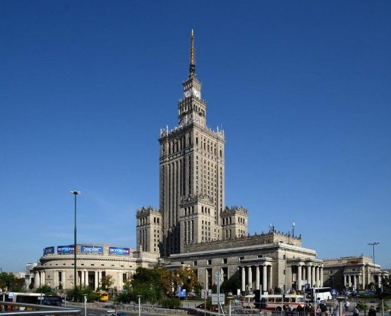{ loading=lazy }

Wysoki budynek przeznaczony na muzea, teatry i placówki edukacyjne.

- Type: Place
- Subjects: Culture, Education, History
- Country: International
- Image credit: CC_BY_SA | A.Savin
- Quests: [Odkryj Warszawę (pl_01)](../quest/pl_01.pl.md)

---

### Pałac Prezydencki
{ loading=lazy }

Oficjalna siedziba Prezydenta Polski.

- Type: Place
- Subjects: Civics, History, Culture
- Country: International
- Image credit: CC_BY_SA | Rhododendrites | [source](https://commons.wikimedia.org/wiki/File:Warsaw_Presidential_Palace_(22248p).jpg)
- Quests: [Odkryj Warszawę (pl_01)](../quest/pl_01.pl.md)

---

### Piekarz
{ loading=lazy }

Osoba zajmująca się wypiekiem chleba, ciast i wypieków.

- Type: Person
- Subjects: History, Culture
- Country: International
- Topics: [Baguette](../topics/index.md#baguette), [market traders](../topics/index.md#marketers)
- Image credit: CC0 | [source](https://commons.wikimedia.org/wiki/File:Baker_Oslo.jpg)
- Quests: [Jedzenie i targ (fr_09)](../quest/fr_09.pl.md)

---

### Pieprz Sól
{ loading=lazy }

Przyprawy, które poprawiają smak potraw. Sól jest biała, a pieprz czarny i ma drobne kawałki.

- Type: Object
- Subjects: Food, Culture
- Country: International
- Topics: [Bouillabaisse](../topics/index.md#bouillabaisse)
- Image credit: CC0 | [source](https://commons.wikimedia.org/wiki/File:Salt_and_Pepper_Shakers_%284572668303%29.jpg)
- Quests: [Jedzenie i targ (fr_09)](../quest/fr_09.pl.md)

---

### Pingwin
{ loading=lazy }

Ptak, który nie lata, ale świetnie pływa. Żyje w zimnych miejscach.

- Type: Object
- Subjects: Animal, Environment
- Country: International
- Topics: [Zoo Animals](../topics/index.md#zoo)
- Image credit: CC0
- Quests: [Zoo (pl_04)](../quest/pl_04.pl.md)

---

### Piłka
{ loading=lazy }

Okrągły obiekt używany w wielu grach.

- Type: Object
- Subjects: Sport, Recreation
- Country: International
- Image credit: CC_BY_SA | Marco Gualazzini | [source](https://commons.wikimedia.org/wiki/File:Playing_in_the_Nuba_mountains.jpg)
- Quests: [Odkryj Warszawę (pl_01)](../quest/pl_01.pl.md)

---

### Piłka nożna
{ loading=lazy }

Gra zespołowa, w którą gra się piłką, którą się kopie.

- Type: Object
- Subjects: Sport, Recreation, Community
- Country: International
- Image credit: CC_BY_SA | Clément Bucco-Lechat | [source](https://commons.wikimedia.org/wiki/File:Algérie_-_Arménie_-_20140531_-_Yacine_Brahimi_(Alg)_face_à_Taron_Voskanyan_(Arm).jpg)
- Quests: [Odkryj Warszawę (pl_01)](../quest/pl_01.pl.md)

---

### plant_apple
{ loading=lazy }

No translation found for 'plant_apple.desc' in Cards

- Type: Object
- Country: International
- Image credit: CC0 | [source](https://commons.wikimedia.org/wiki/File:Tree_with_red_apples_in_Barkedal_4.jpg)
- Quests: [Zoo (pl_04)](../quest/pl_04.pl.md)

---

### plant_banana
{ loading=lazy }

No translation found for 'plant_banana.desc' in Cards

- Type: Object
- Country: International
- Image credit: CC0 | [source](https://commons.wikimedia.org/wiki/File:Musa_JPG01.jpg)
- Quests: [Zoo (pl_04)](../quest/pl_04.pl.md)

---

### plant_orange
{ loading=lazy }

No translation found for 'plant_orange.desc' in Cards

- Type: Object
- Country: International
- Image credit: CC0 | [source](https://commons.wikimedia.org/wiki/File:Citrus_sinensis_JPG01.jpg)
- Quests: [Zoo (pl_04)](../quest/pl_04.pl.md)

---

### plant_wattle
{ loading=lazy }

No translation found for 'tree_wattle.desc' in Cards

- Type: Object
- Country: International
- Image credit: CC0 | [source](https://commons.wikimedia.org/wiki/File:Acacia_sp._(51489535138).jpg)
- Quests: [Zoo (pl_04)](../quest/pl_04.pl.md)

---

### Plecak
{ loading=lazy }

Torba, którą nosisz na plecach.

- Type: Object
- Subjects: Recreation, Transportation, Education
- Country: International
- Topics: [mountain tools](../topics/index.md#mountain_tools)
- Image credit: CC_BY_SA | FOTO:Fortepan — ID 20607: Adományozó/Donor: Wein Sarolta. archive copy at the Wayback Machine | [source](https://commons.wikimedia.org/wiki/File:Colorful,_backpack_Fortepan_20607.jpg)
- Quests: [Mont Blanc i góry (fr_08)](../quest/fr_08.pl.md)

---

### Pociąg
{ loading=lazy }

Pociągi szybko przewożą ludzi i towary przez cały kraj.

- Type: Object
- Subjects: Transportation
- Country: International
- Image credit: CC0

---

### Polska
{ loading=lazy }

Kraj w Europie. Stolicą jest Warszawa. Polska słynie z naukowców takich jak Kopernik i pysznych pierogów!

- Type: Place
- Subjects: Geography, Culture
- Country: International
- Topics: [Poland country](../topics/index.md#poland), [Poland Countries](../topics/index.md#poland_countries_around)
- Image credit: CC_BY_SA | Diego Delso | [source](https://commons.wikimedia.org/wiki/File:Basílica_de_Nuestra_Señora_de_Licheń,_Stary_Licheń,_Polonia,_2016-12-21,_DD_39-41_HDR.jpg)

---

### Polskie Izby Parlamentu
{ loading=lazy }

Gdzie tworzone jest prawo: Sejm i Senat.

- Type: Place
- Subjects: Civics, History, Geography
- Country: International
- Image credit: CC0
- Quests: [Odkryj Warszawę (pl_01)](../quest/pl_01.pl.md)

---

### Pomarańczowy
{ loading=lazy }

Okrągły, pomarańczowy owoc o słodkim i soczystym smaku. Pomarańcze mają mnóstwo witaminy C!

- Type: Object
- Subjects: Food, Culture
- Country: International
- Topics: [Bouillabaisse](../topics/index.md#bouillabaisse)
- Image credit: CC0 | [source](https://commons.wikimedia.org/wiki/File:Orange-Fruit-Pieces.jpg)
- Quests: [Jedzenie i targ (fr_09)](../quest/fr_09.pl.md)

---

### Pomidor
{ loading=lazy }

Czerwony, okrągły owoc rosnący na roślinach. Pomidory służą do robienia sosu do pizzy!

- Type: Object
- Subjects: Food, Culture
- Country: International
- Topics: [Bouillabaisse](../topics/index.md#bouillabaisse)
- Image credit: CC0 | [source](https://commons.wikimedia.org/wiki/File:Tomato_je.jpg)
- Quests: [Jedzenie i targ (fr_09)](../quest/fr_09.pl.md)

---

### Pomnik Mikołaja Kopernika (Warszawa)
{ loading=lazy }

Pomnik astronoma Mikołaja Kopernika.

- Type: Place
- Subjects: Science, History, Culture
- Country: International
- Image credit: CC_BY_SA | Rhododendrites | [source](https://commons.wikimedia.org/wiki/File:Staszic_Palace_(22226p).jpg)
- Quests: [Odkryj Warszawę (pl_01)](../quest/pl_01.pl.md)

---

### Praga
{ loading=lazy }

Stolica Republiki Czeskiej.

- Type: Place
- Subjects: Geography, Culture
- Country: International
- Image credit: CC_BY_SA | Dmitry A. Mottl | [source](https://commons.wikimedia.org/wiki/File:Vltava_river_in_Prague.jpg)

---

### Prezydent
{ loading=lazy }

Przywódca wybrany do przewodzenia krajowi. Ludzie głosują w wyborach.

- Type: Person
- Subjects: History, Culture
- Country: International
- Image credit: CC0 | Aaron Shikler | [source](https://commons.wikimedia.org/wiki/File:John_F_Kennedy_Official_Portrait.jpg)

---

### Przewodnik górski
{ loading=lazy }

Osoba, która pomaga ludziom bezpiecznie się wspinać.

- Type: Person
- Subjects: Community, Safety, Education
- Country: International
- Topics: [mont blanc](../topics/index.md#mont_blanc), [mountain activities](../topics/index.md#mountain_activities)
- Image credit: CC_BY | Vyacheslav Argenberg | [source](https://commons.wikimedia.org/wiki/File:Zagedan_Lakes,_Mountaineer,_Mountain_guide,_Caucasus_Mountains,_Karachay-Cherkessia.jpg)
- Quests: [Mont Blanc i góry (fr_08)](../quest/fr_08.pl.md)

---

### Pszczelarz
{ loading=lazy }

Osoba opiekująca się pszczołami i zbierająca miód.

- Type: Person
- Subjects: Community, Animal, Food
- Country: International
- Image credit: CC_BY | Michael Gäbler | [source](https://commons.wikimedia.org/wiki/File:Beekeeper_keeping_bees.jpg)
- Quests: [Pierniki i targ spożywczy (pl_06)](../quest/pl_06.pl.md)

---

### Płaszcz
{ loading=lazy }

Ciepła kurtka na zimne dni.

- Type: Object
- Subjects: Health, Safety, Weather
- Country: International
- Image credit: CC_BY_SA | Calistemon | [source](https://commons.wikimedia.org/wiki/File:White_American_Staffordshire_Terrier_in_Vegemite_coat,_August_2022.jpg)
- Quests: [Mont Blanc i góry (fr_08)](../quest/fr_08.pl.md)

---

### Raki
{ loading=lazy }

Kolczaste metalowe uchwyty przymocowane do butów, aby móc jeździć po lodzie.

- Type: Object
- Subjects: Safety, Technology, Sport
- Country: International
- Topics: [mountain tools](../topics/index.md#mountain_tools)
- Image credit: CC_BY_SA | Clayoquot | [source](https://commons.wikimedia.org/wiki/File:Strap-on_crampon.JPG)
- Quests: [Mont Blanc i góry (fr_08)](../quest/fr_08.pl.md)

---

### Rakieta kosmiczna
{ loading=lazy }

Rakieta, która leci w kosmos.

- Type: Object
- Subjects: Science
- Country: International
- Topics: [Jules Verne](../topics/index.md#jules_verne)
- Image credit: CC0
- Quests: [Juliusz Verne i transport (fr_03)](../quest/fr_03.pl.md)

---

### Robert Lewandowski
{ loading=lazy }

Znany polski piłkarz.

- Type: Person
- Subjects: Sport, Culture
- Country: International
- Image credit: CC_BY_SA | Екатерина Лаут | [source](https://commons.wikimedia.org/wiki/File:Robert_Lewandowski_2018_(cropped).jpg)
- Quests: [Odkryj Warszawę (pl_01)](../quest/pl_01.pl.md)

---

### Rosja
{ loading=lazy }

Państwo w Europie. Stolicą jest Moskwa.

- Type: Place
- Subjects: Geography, Culture
- Country: International
- Topics: [Poland Countries](../topics/index.md#poland_countries_around)
- Image credit: CC_BY_SA | Canes | [source](https://commons.wikimedia.org/wiki/File:Мечеть_Санкт-Петербурга._Майолика_портала.jpg)

---

### Rower
{ loading=lazy }

Dwukołowy pojazd, który napędza się pedałami.

- Type: Object
- Subjects: Transportation, Sport, Health
- Country: International
- Image credit: CC_BY_SA | Basile Morin | [source](https://commons.wikimedia.org/wiki/File:Parked_bicycle_with_graffitied_building_facade_and_doors_in_Amsterdam.jpg)
- Quests: [Odkryj Warszawę (pl_01)](../quest/pl_01.pl.md)

---

### RYBA
{ loading=lazy }

Zwierzę żyjące i pływające w wodzie. Ryby mają płetwy i skrzela, które umożliwiają im oddychanie pod wodą.

- Type: Object
- Subjects: Food, Culture
- Country: International
- Topics: [Bouillabaisse](../topics/index.md#bouillabaisse)
- Image credit: CC0 | [source](https://commons.wikimedia.org/wiki/File:Grouper_fish_for_Sale.jpg)
- Quests: [Jedzenie i targ (fr_09)](../quest/fr_09.pl.md)

---

### Rynek średniowieczny
{ loading=lazy }

Stary rynek, na którym ludzie kupują i sprzedają towary.

- Type: Place
- Subjects: History, Culture, Community
- Country: International
- Image credit: CC_BY_SA | Axel Cotón Gutiérrez | [source](https://commons.wikimedia.org/wiki/File:Feria_Medieval_de_Hämeenlinna_2007_(Horse_Fighting).jpg)
- Quests: [Pierniki i targ spożywczy (pl_06)](../quest/pl_06.pl.md)

---

### Rzeźnik
{ loading=lazy }

Osoba sprzedająca mięso.

- Type: Person
- Subjects: Community, Food
- Country: International
- Image credit: CC_BY_SA | Sabina Bajracharya | [source](https://commons.wikimedia.org/wiki/File:A_Butcher_cutting_buffalo_meat.jpg)
- Quests: [Pierniki i targ spożywczy (pl_06)](../quest/pl_06.pl.md)

---

### Rękawice
{ loading=lazy }

Ciepłe okrycia na dłonie.

- Type: Object
- Subjects: Health, Safety, Weather
- Country: International
- Topics: [mountain tools](../topics/index.md#mountain_tools)
- Image credit: CC_BY_SA | Kippelboy | [source](https://commons.wikimedia.org/wiki/File:Centre_de_Documentació_Museu_Tèxtil_de_Terrassa-_Reserves-_Teixits-_Guants002.JPG)
- Quests: [Mont Blanc i góry (fr_08)](../quest/fr_08.pl.md)

---

### Samochód
{ loading=lazy }

Mały pojazd do jazdy po drogach.

- Type: Object
- Subjects: Transportation
- Country: International
- Image credit: CC_BY_SA | Rhododendrites | [source](https://commons.wikimedia.org/wiki/File:Abandoned_car_in_Marine_Park_(10852p).jpg)
- Quests: [Odkryj Warszawę (pl_01)](../quest/pl_01.pl.md)

---

### Sprzedawca jajek
{ loading=lazy }

Osoba sprzedająca jajka.

- Type: Person
- Subjects: Community, Food
- Country: International
- Image credit: CC_BY_SA | Elgabarty2002 | [source](https://commons.wikimedia.org/wiki/File:Egg_Seller_in_Nigeria.jpg)
- Quests: [Pierniki i targ spożywczy (pl_06)](../quest/pl_06.pl.md)

---

### Sprzedawca produktów mlecznych
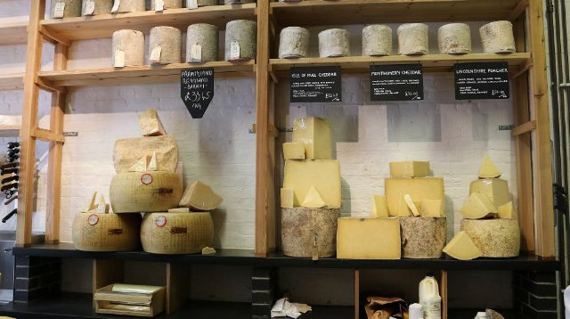{ loading=lazy }

Osoba sprzedająca mleko, masło i ser.

- Type: Person
- Subjects: Community, Food
- Country: International
- Image credit: CC_BY_SA | Something Original (talk) | [source](https://commons.wikimedia.org/wiki/File:Pennsylvania_State_University_Food_Science_Building_and_Berkey_Creamery_May_15,_2010.jpg)
- Quests: [Pierniki i targ spożywczy (pl_06)](../quest/pl_06.pl.md)

---

### Sprzedawca ryb
{ loading=lazy }

Osoba sprzedająca świeże ryby i owoce morza.

- Type: Person
- Subjects: History, Culture
- Country: International
- Topics: [market traders](../topics/index.md#marketers)
- Image credit: CC0 | [source](https://commons.wikimedia.org/wiki/File:Fishmonger_weighing_fish_at_Payang_Market,_Kuala_Terengganu.jpg)
- Quests: [Jedzenie i targ (fr_09)](../quest/fr_09.pl.md)

---

### Stadion Narodowy (Warszawa)
{ loading=lazy }

Nowoczesny stadion przeznaczony do meczów piłkarskich i koncertów.

- Type: Place
- Subjects: Sport, Culture, Community
- Country: International
- Image credit: CC_BY_SA | Arne Müseler | [source](https://commons.wikimedia.org/wiki/File:National_Stadium_Warsaw_aerial_view_2.jpg)
- Quests: [Odkryj Warszawę (pl_01)](../quest/pl_01.pl.md)

---

### Statua Warsa i Sawy
{ loading=lazy }

Rzeźba przedstawiająca legendę miasta o Warsie i Sawie.

- Type: Place
- Subjects: Culture, History
- Country: International
- Image credit: CC_BY_SA | Wistula
- Quests: [Odkryj Warszawę (pl_01)](../quest/pl_01.pl.md)

---

### Szalik
{ loading=lazy }

Ciepły materiał noszony wokół szyi.

- Type: Object
- Subjects: Health, Safety, Weather
- Country: International
- Topics: [mountain tools](../topics/index.md#mountain_tools)
- Image credit: CC_BY_SA | Kritzolina | [source](https://commons.wikimedia.org/wiki/File:Colored_silk_scarf_from_India_01.jpg)
- Quests: [Mont Blanc i góry (fr_08)](../quest/fr_08.pl.md)

---

### Szczyt
{ loading=lazy }

Sam szczyt góry.

- Type: Concept
- Subjects: Geography, Environment, Education
- Country: International
- Topics: [mont blanc](../topics/index.md#mont_blanc)
- Image credit: CC_BY | Mountaineer | [source](https://commons.wikimedia.org/wiki/File:Summitting_Island_Peak.jpg)
- Quests: [Mont Blanc i góry (fr_08)](../quest/fr_08.pl.md)

---

### Szwajcaria
{ loading=lazy }

Kraj w Europie. Stolicą jest Berno. Szwajcaria słynie z gór i sera.

- Type: Place
- Subjects: Geography, Culture
- Country: International
- Topics: [Countries around France](../topics/index.md#france_countries_around)
- Image credit: CC_BY_SA | Giles Laurent | [source](https://commons.wikimedia.org/wiki/File:016_Wild_Golden_Eagle_in_flight_at_Pfyn-Finges_(Switzerland)_Photo_by_Giles_Laurent.jpg)

---

### SÓL
{ loading=lazy }

Białe kryształy, które poprawiają smak potraw.

- Type: Object
- Subjects: Food, Culture
- Country: International
- Topics: [Baguette](../topics/index.md#baguette)
- Image credit: CC0

---

### Słoneczny
{ loading=lazy }

Jasne światło, które może odbijać się od śniegu.

- Type: Concept
- Subjects: Science, Weather, Environment
- Country: International
- Image credit: CC0 | NASA/SDO (AIA) | [source](https://commons.wikimedia.org/wiki/File:The_Sun_by_the_Atmospheric_Imaging_Assembly_of_NASA's_Solar_Dynamics_Observatory_-_20100819.jpg)
- Quests: [Mont Blanc i góry (fr_08)](../quest/fr_08.pl.md)

---

### Słowacja
{ loading=lazy }

Kraj w Europie. Stolicą jest Bratysława.

- Type: Place
- Subjects: Geography, Culture
- Country: International
- Topics: [Poland Countries](../topics/index.md#poland_countries_around)
- Image credit: CC_BY_SA | Oto Zapletal | [source](https://commons.wikimedia.org/wiki/File:Suspension_pedestrian_bridge_over_the_Orava_River_in_Dolny_Kubín,_the_Slovak_republic_01.jpg)

---

### Słoń
{ loading=lazy }

Duże zwierzę z trąbą. Słonie to największe zwierzęta chodzące po lądzie. Mają duże uszy i uwielbiają pryskać wodą!

- Rationale: Elephants are amazing animals that kids love learning about at the zoo!
- Type: Object
- Subjects: Animal, Environment
- Country: International
- Topics: [Zoo Animals](../topics/index.md#zoo)
- Words: [elephant](../words/elephant.md), [zoo](../words/zoo.md)
- Image credit: CC0
- Quests: [Zoo (pl_04)](../quest/pl_04.pl.md)

---

### Torba szkolna
{ loading=lazy }

Torba, w której uczniowie noszą do szkoły książki, ołówki i prace domowe.

- Type: Object
- Subjects: Science
- Country: International
- Image credit: CC0
- Quests: [System edukacji (fr_02)](../quest/fr_02.pl.md)

---

### Tramwajowy
{ loading=lazy }

Pociąg miejski poruszający się po torach ulicznych.

- Type: Object
- Subjects: Transportation, Technology, Community
- Country: International
- Image credit: CC_BY_SA | Chme82 | [source](https://commons.wikimedia.org/wiki/File:Flexity_Tram_Zürich_4001.jpg)
- Quests: [Odkryj Warszawę (pl_01)](../quest/pl_01.pl.md)

---

### Trójkąt
{ loading=lazy }

Kształt z trzema prostymi bokami i trzema narożnikami. Trójkąty wyglądają jak kawałki pizzy!

- Type: Concept
- Subjects: Math
- Country: International
- Topics: [Elementary Math](../topics/index.md#elementary-maths)
- Image credit: CC0 | [source](https://commons.wikimedia.org/wiki/File:Lobatchevski_-_La_Th%C3%A9orie_des_parall%C3%A8les,_1980_-_Fig-1-05.png)
- Quests: [System edukacji (fr_02)](../quest/fr_02.pl.md)

---

### Turystyka piesza
{ loading=lazy }

Wędrówki po szlakach na łonie natury.

- Type: Concept
- Subjects: Recreation, Sport, Environment
- Country: International
- Topics: [mountain activities](../topics/index.md#mountain_activities)
- Image credit: CC_BY_SA | Diego Delso | [source](https://commons.wikimedia.org/wiki/File:Roca_de_la_Ley,_Parque_Nacional_de_Þingvellir,_Suðurland,_Islandia,_2014-08-16,_DD_022.JPG)
- Quests: [Mont Blanc i góry (fr_08)](../quest/fr_08.pl.md)

---

### Ukraina
{ loading=lazy }

Państwo w Europie. Stolicą jest Kijów.

- Type: Place
- Subjects: Geography, Culture
- Country: International
- Image credit: CC_BY_SA | Misha Reme | [source](https://commons.wikimedia.org/wiki/File:Найкращі_миті_життя.jpg)

---

### Waluta euro
{ loading=lazy }

Waluta używana w wielu krajach Europy. Za euro można kupić zabawki i lody!

- Type: Concept
- Subjects: Money, Geography
- Country: International
- Image credit: CC0 | [source](https://commons.wikimedia.org/wiki/File:Euro_coins_and_banknotes_%28cropped%29.jpg)
- Quests: [Jedzenie i targ (fr_09)](../quest/fr_09.pl.md)

---

### Warszawa
{ loading=lazy }

Stolica Polski.

- Type: Place
- Subjects: Geography, Culture
- Country: International
- Topics: [Poland country](../topics/index.md#poland)
- Image credit: CC_BY_SA | A.Savin | [source](https://commons.wikimedia.org/wiki/File:Warsaw_07-13_img29_View_from_Palace_of_Culture_and_Science.jpg)

---

### Wiatr
{ loading=lazy }

Ruch powietrza, który w górach może być odczuwalnie silniejszy.

- Type: Concept
- Subjects: Weather, Environment
- Country: International
- Topics: [mont blanc](../topics/index.md#mont_blanc)
- Image credit: CC0 | Richardfabi | [source](https://commons.wikimedia.org/wiki/File:Windbuchencom.jpg)
- Quests: [Mont Blanc i góry (fr_08)](../quest/fr_08.pl.md)

---

### Wilno
{ loading=lazy }

Stolica Litwy.

- Type: Place
- Subjects: Geography, Culture
- Country: International
- Image credit: CC_BY_SA | Diliff | [source](https://commons.wikimedia.org/wiki/File:Vilnius_Modern_Skyline_At_Dusk,_Lithuania_-_Diliff.jpg)

---

### Woda
{ loading=lazy }

Woda jest niezbędna do życia

- Type: Object
- Subjects: Food, Culture
- Country: International
- Topics: [Baguette](../topics/index.md#baguette)
- Image credit: CC0

---

### Wspinaczka
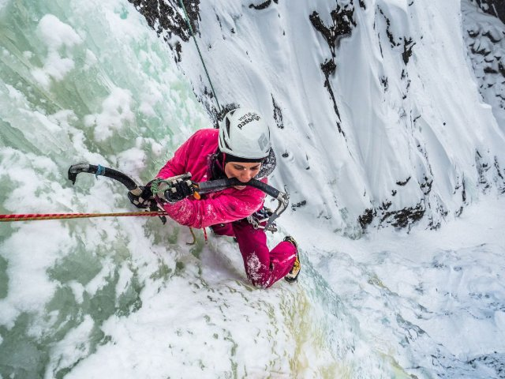{ loading=lazy }

Wchodzenie na skały lub lód przy użyciu specjalnego sprzętu.

- Type: Concept
- Subjects: Sport, Safety, Recreation
- Country: International
- Topics: [mountain activities](../topics/index.md#mountain_activities)
- Image credit: CC_BY_SA | Original version: Valentin Chapuis
Derivative version: Subsidiary account (image rotated 90 degrees CCW) | [source](https://commons.wikimedia.org/wiki/File:Flo_dans_Juvsøyla_à_Rjukan,_Norvège-rotated.jpg)
- Quests: [Mont Blanc i góry (fr_08)](../quest/fr_08.pl.md)

---

### Właściciel sklepu spożywczego
{ loading=lazy }

Osoba sprzedająca różnego rodzaju żywność i napoje.

- Type: Person
- Subjects: History, Culture
- Country: International
- Topics: [market traders](../topics/index.md#marketers)
- Image credit: CC0 | [source](https://commons.wikimedia.org/wiki/File:Mercado_del_Progreso_(7706491614).jpg)
- Quests: [Jedzenie i targ (fr_09)](../quest/fr_09.pl.md)

---

### Young Lion Male
{ loading=lazy }

No translation found for 'animal_lion_young_male.desc' in Cards

- Type: Object
- Country: International
- Image credit: CC0 | [source](https://commons.wikimedia.org/wiki/File:Young_male_lion,_South_Luangwa_National_Park_(51871439313).jpg)
- Quests: [Zoo (pl_04)](../quest/pl_04.pl.md)

---

### Zamek Królewski (Warszawa)
{ loading=lazy }

Historyczny zamek królów polskich, obecnie muzeum.

- Type: Place
- Subjects: History, Culture, Geography
- Country: International
- Image credit: CC0 | Bernardo Bellotto | [source](https://commons.wikimedia.org/wiki/File:Bernardo_Bellotto_-_View_of_Warsaw_from_the_Royal_Castle_-_Google_Art_Project.jpg)
- Quests: [Odkryj Warszawę (pl_01)](../quest/pl_01.pl.md)

---

### Znak NIEBEZPIECZEŃSTWO
{ loading=lazy }

Znak ostrzegający przed zbliżającym się niebezpieczeństwem. Zachowaj szczególną ostrożność.

- Type: Object
- Subjects: Safety
- Country: International
- Topics: [Stree safety](../topics/index.md#street-safety)
- Image credit: CC0 | Government of Singapore - Land Transport Authority, Public domain, via Wikimedia Commons | [source](https://commons.wikimedia.org/wiki/File:Singapore_road_sign_-_Warning_-_Other_danger.svg)

---

### Znak STOP
{ loading=lazy }

Czerwony znak oznaczający, że musisz zatrzymać pojazd.

- Type: Object
- Subjects: Safety, Transportation
- Country: International
- Topics: [Stree safety](../topics/index.md#street-safety)
- Image credit: CC0

---

### Zoo Animals
Auto-created card for topic 'Zoo Animals'.

- Type: None
- Country: International
- Topics: [Zoo Animals](../topics/index.md#zoo)

---

### Łódź dla ludzi
{ loading=lazy }

Łódź przewożąca ludzi z jednego miejsca do drugiego przez wodę.

- Type: Place
- Subjects: Geography, Environment
- Country: International
- Image credit: CC0

---

### Łódź rzeczna
{ loading=lazy }

Łódź, która płynie po rzekach. Rzeki są jak drogi zbudowane z wody!

- Type: Place
- Subjects: Geography, Environment
- Country: International
- Topics: [Seine Bridges](../topics/index.md#seine_bridges)
- Image credit: CC0
- Quests: [Paryż Sekwana (fr_10)](../quest/fr_10.pl.md)

---

### Łódź towarowa
{ loading=lazy }

Duża łódź, która przewozi pudełka, żywność i inne rzeczy z miejsca na miejsce.

- Type: Place
- Subjects: Geography, Environment
- Country: International
- Image credit: CC0

---

### Śnieg
{ loading=lazy }

Zamarznięta woda spadająca w zimne dni.

- Type: Concept
- Subjects: Weather, Environment, Science
- Country: International
- Topics: [mont blanc](../topics/index.md#mont_blanc)
- Image credit: CC_BY_SA | Psy guy | [source](https://commons.wikimedia.org/wiki/File:Snow_Scene_at_Shipka_Pass_1.JPG)
- Quests: [Mont Blanc i góry (fr_08)](../quest/fr_08.pl.md)

---

### Świstak
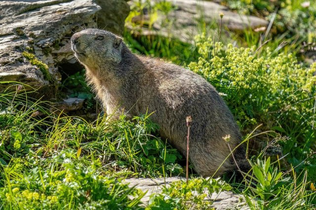{ loading=lazy }

Futrzane zwierzę górskie, które gwiżdże.

- Type: Object
- Subjects: Animal, Environment, Science
- Country: International
- Image credit: CC_BY_SA | Photography captured by Giles Laurent | [source](https://commons.wikimedia.org/wiki/File:071_Wild_marmot_at_Grand_Muveran_Nature_Reserve_Photo_by_Giles_Laurent.jpg)
- Quests: [Mont Blanc i góry (fr_08)](../quest/fr_08.pl.md)

---

### Żelazo
{ loading=lazy }

Gorące narzędzie służące do wygładzania i prostowania pogniecionych ubrań. Uwaga, żelazka są bardzo gorące!

- Type: Object
- Subjects: Science
- Country: International
- Topics: [Eiffel Tower](../topics/index.md#eiffel-tower)
- Image credit: CC0

---

### Żyrafa
{ loading=lazy }

Bardzo wysokie zwierzę z długą szyją. Żyrafy są wyższe niż drzewa! Zjadają liście, do których inne zwierzęta nie mogą dosięgnąć.

- Rationale: Giraffes are fascinating animals that show kids how nature adapts to find food
- Type: Object
- Subjects: Animal, Environment
- Country: International
- Topics: [Zoo Animals](../topics/index.md#zoo)
- Image credit: CC0

## France

### 20000 Leagues Under the Sea
{ loading=lazy }

A book by Jules Verne about underwater adventures in a submarine called the Nautilus. You meet giant sea creatures!

- Type: Object
- Subjects: Literature
- Year: 1871
- Country: France
- Topics: [Jules Verne](../topics/index.md#jules_verne)
- Image credit: CC0
- Quests: [Juliusz Verne i transport (fr_03)](../quest/fr_03.pl.md)

---

### 24-godzinny wyścig Le Mans
{ loading=lazy }

Wyścig samochodowy trwający 24 godziny. Zespoły ścigają się dniem i nocą.

- Type: Concept
- Subjects: Sport, Culture, History
- Country: France
- Image credit: CC0

---

### Allons enfants
{ loading=lazy }

Pierwsze słowa pierwszego wersu hymnu.

- Type: Object
- Subjects: Music, Education, Culture
- Country: France
- Topics: [marseillaise music](../topics/index.md#marseillaise_music)
- Image credit: CC0 | [source](https://commons.wikimedia.org/wiki/File:La_Marseillaise_chant_national_fran%C3%A7ais_de_Rouget_de_L%27Isle_Transcription_de_Langevin-2.jpg)
- Audio credit: PublicDomain | [source](https://commons.wikimedia.org/wiki/File:La_Marseillaise_(1914_Recording).ogg)
- Quests: [Marsylianka (fr_11)](../quest/fr_11.pl.md)

---

### Around the World in Eighty Days
{ loading=lazy }

An exciting book by Jules Verne about traveling around the whole world very quickly using trains, ships, and hot air balloons!

- Type: Object
- Subjects: Literature
- Year: 1873
- Country: France
- Topics: [Jules Verne](../topics/index.md#jules_verne)
- Image credit: CC0
- Quests: [Juliusz Verne i transport (fr_03)](../quest/fr_03.pl.md)

---

### Bagietka francuska
{ loading=lazy }

Długi, chrupiący chleb, najsłynniejsze danie we Francji. Francuzi codziennie kupują świeże bagietki z piekarni!

- Rationale: Baguettes are iconic French culture that kids can easily understand and remember
- Type: Object
- Subjects: Food, Culture
- Year: 1700
- Country: France
- Topics: [Baguette](../topics/index.md#baguette)
- Image credit: CC0
- Quests: [Paryż! (fr_01)](../quest/fr_01.pl.md), [Rozwój (dev)](../quest/dev.pl.md)

---

### Bouillabaisse
{ loading=lazy }

Wyjątkowa zupa rybna z Marsylii w południowej Francji. Przyrządzana z wielu różnych gatunków ryb, ma pyszny zapach!

- Type: Object
- Subjects: Food, Culture
- Year: 1700
- Country: France
- Topics: [Bouillabaisse](../topics/index.md#bouillabaisse)
- Image credit: CC0 | [source](https://www.pexels.com/photo/delicious-red-soup-on-table-17568746/)
- Quests: [Jedzenie i targ (fr_09)](../quest/fr_09.pl.md)

---

### Brona
{ loading=lazy }

Ciężka brama, która opada i blokuje wejście.

- Type: Object
- Subjects: Technology, History, Safety
- Country: France
- Image credit: CC_BY | Kevin King from Pensacola, FL, US of A | [source](https://commons.wikimedia.org/wiki/File:Cahir_Castle_Portcullis_by_Kevin_King.jpg)

---

### Buty do tańca
{ loading=lazy }

Buty przeznaczone do tańca na sali balowej.

- Type: Object
- Subjects: Culture, Recreation
- Country: France
- Image credit: CC_BY | Aoife Cawley | [source](https://commons.wikimedia.org/wiki/File:Wiki_loves_folklore_dance_shoe.png)

---

### Collège we Francji
{ loading=lazy }

Szkoła średnia we Francji dla dzieci w wieku od 11 do 15 lat. Uczniowie uczą się wielu przedmiotów i przygotowują się do szkoły średniej.

- Rationale: Understanding the French school system helps kids compare education across countries
- Type: Concept
- Subjects: Education, Culture
- Year: 1975
- Country: France
- Topics: [French School](../topics/index.md#frenchschool)
- Image credit: CC0 | Marie Gaultier, CC BY-SA 4.0 <https://creativecommons.org/licenses/by-sa/4.0>, via Wikimedia Commons | [source](https://commons.wikimedia.org/wiki/File:Ecole_Sup%C3%A9rieure_d%27Agricultures.jpg)
- Quests: [System edukacji (fr_02)](../quest/fr_02.pl.md), [Juliusz Verne i transport (fr_03)](../quest/fr_03.pl.md)

---

### De la patrie
{ loading=lazy }

Słowa z pierwszego wersu hymnu.

- Type: Object
- Subjects: Music, Education, Culture
- Country: France
- Topics: [marseillaise music](../topics/index.md#marseillaise_music)
- Image credit: CC0 | [source](https://commons.wikimedia.org/wiki/File:La_Marseillaise_chant_national_fran%C3%A7ais_de_Rouget_de_L%27Isle_Transcription_de_Langevin-2.jpg)
- Audio credit: PublicDomain | [source](https://commons.wikimedia.org/wiki/File:La_Marseillaise_(1914_Recording).ogg)
- Quests: [Marsylianka (fr_11)](../quest/fr_11.pl.md)

---

### Do
{ loading=lazy }

Nuta muzyczna.

- Type: Concept
- Subjects: Music, Education
- Country: France
- Topics: [Musical Notes](../topics/index.md#musical_notes)
- Image credit: CC_BY_SA | BrownHairedGirl | [source](https://commons.wikimedia.org/wiki/File:Dominican_Republic_Ireland_Locator.png)

---

### Dolina Loary
{ loading=lazy }

Słynny francuski region z wieloma zamkami.

- Type: Place
- Subjects: Geography, History, Culture
- Country: France
- Image credit: CC_BY_SA | Suavemarimagno | [source](https://commons.wikimedia.org/wiki/File:Val-de-loire-montsoreau-lever-de-soleil.jpg)

---

### Dworzec kolejowy Le Mans
{ loading=lazy }

Stacja, z której wsiadasz do pociągu, którym wracasz do domu.

- Type: Place
- Subjects: Geography, Transportation, Community
- Country: France
- Image credit: CC_BY_SA | Radomianin | [source](https://commons.wikimedia.org/wiki/File:Man_at_Dundas_subway_station,_Toronto,_2008-05-06.jpg)

---

### Dzień chwały
{ loading=lazy }

Słowa z pierwszego wersu hymnu.

- Type: Object
- Subjects: Music, Education, Culture
- Country: France
- Topics: [marseillaise music](../topics/index.md#marseillaise_music)
- Image credit: CC0 | [source](https://commons.wikimedia.org/wiki/File:La_Marseillaise_chant_national_fran%C3%A7ais_de_Rouget_de_L%27Isle_Transcription_de_Langevin-2.jpg)
- Audio credit: PublicDomain | [source](https://commons.wikimedia.org/wiki/File:La_Marseillaise_(1914_Recording).ogg)
- Quests: [Marsylianka (fr_11)](../quest/fr_11.pl.md)

---

### Est Arrivé
{ loading=lazy }

Słowa z pierwszego wersu hymnu.

- Type: Object
- Subjects: Music, Education, Culture
- Country: France
- Topics: [marseillaise music](../topics/index.md#marseillaise_music)
- Image credit: CC0 | [source](https://commons.wikimedia.org/wiki/File:La_Marseillaise_chant_national_fran%C3%A7ais_de_Rouget_de_L%27Isle_Transcription_de_Langevin-2.jpg)
- Audio credit: PublicDomain | [source](https://commons.wikimedia.org/wiki/File:La_Marseillaise_(1914_Recording).ogg)
- Quests: [Marsylianka (fr_11)](../quest/fr_11.pl.md)

---

### Fa
{ loading=lazy }

Nuta muzyczna.

- Type: Concept
- Subjects: Music, Education
- Country: France
- Topics: [Musical Notes](../topics/index.md#musical_notes)
- Image credit: CC_BY | Aleksey Gnilenkov | [source](https://commons.wikimedia.org/wiki/File:Nong_Fa_Lake.jpg)

---

### Fasada zamku (okna)
{ loading=lazy }

Ściana frontowa z wieloma dużymi oknami zapewniającymi światło i widoki.

- Type: Concept
- Subjects: Culture, Technology
- Country: France
- Image credit: CC_BY_SA | Scotch Mist | [source](https://commons.wikimedia.org/wiki/File:Brzeg_Castle_03.jpg)

---

### Five Weeks in a Balloon
{ loading=lazy }

A book by Jules Verne about flying across Africa in a hot air balloon. It's full of adventure and discovery!

- Type: Object
- Subjects: Literature
- Year: 1863
- Country: France
- Image credit: CC0
- Quests: [Juliusz Verne i transport (fr_03)](../quest/fr_03.pl.md)

---

### Flaga Francji
{ loading=lazy }

Flaga Francji ma trzy pionowe pasy: niebieski, biały i czerwony. Te kolory symbolizują wolność, równość i braterstwo!

- Rationale: The French flag is essential for teaching French national identity and values
- Type: Concept
- Subjects: Geography, Culture
- Year: 1794
- Country: France
- Topics: [Flags of Europe](../topics/index.md#flags_euroe), [France country](../topics/index.md#france)
- Image credit: CC0
- Quests: [Sąsiedzi Francji (fr_00)](../quest/fr_00.pl.md)

---

### Flaga Monako
{ loading=lazy }

Flaga Monako ma poziome, czerwone i białe pasy. Monako jest malutkie, ale słynie z luksusowych samochodów i królewskich pałaców nad morzem!

- Rationale: Monaco shows kids how small places can be special and important
- Type: Concept
- Subjects: Geography, Culture
- Year: 1881
- Country: France
- Topics: [Flags of Europe](../topics/index.md#flags_euroe)
- Image credit: CC0
- Quests: [Sąsiedzi Francji (fr_00)](../quest/fr_00.pl.md)

---

### Fortepian
{ loading=lazy }

Instrument klawiszowy służący do grania melodii i akordów.

- Type: Object
- Subjects: Music, Education
- Country: France
- Topics: [Musical Notes](../topics/index.md#musical_notes)
- Image credit: CC0 | Unknown authorUnknown author | [source](https://commons.wikimedia.org/wiki/File:Hupfeld_piano_played_(2018-10-04_@pxhere_1546039).jpg)

---

### Francja
{ loading=lazy }

Kraj w Europie. Stolicą jest Paryż.

- Type: Place
- Subjects: Geography, Culture
- Country: France
- Topics: [Countries around France](../topics/index.md#france_countries_around), [France country](../topics/index.md#france)
- Image credit: CC_BY_SA | Another one of my pictures:

This photograph was taken by Medium69 (William Crochot) and released under the license stated below. You are free to use it for any purpose as long as you credit the author (William Crochot), the Source (Wikimedia Commons) and the license (CC-BY-SA 4.0) in close relation to the image.

Please do not upload an updated image here without consultation with the Author. The author would like to make corrections only at his own source RAW. This ensures that the changes are preserved.Please if you think that any changes should be required, please inform the author.Otherwise you can upload a new image with a new name. Please use one of the templates derivative or extract. | [source](https://commons.wikimedia.org/wiki/File:Homme_statue_-_214.jpg)

---

### Francuscy piraci
{ loading=lazy }

Odważni żeglarze, którzy żeglowali po morzach dla króla Francji. Nazywano ich korsarzami i chronili francuskie statki przed wrogami.

- Rationale: Pirates capture kids' imagination while teaching about maritime history and French naval power
- Type: Concept
- Subjects: History, Culture, Transportation
- Year: 1600
- Country: France
- Image credit: CC0 | [source](https://commons.wikimedia.org/wiki/File:Forbin_et_Jean_Bart_capture_en_1689.jpg)
- Quests: [Jedzenie i targ (fr_09)](../quest/fr_09.pl.md)

---

### From the Earth to the Moon
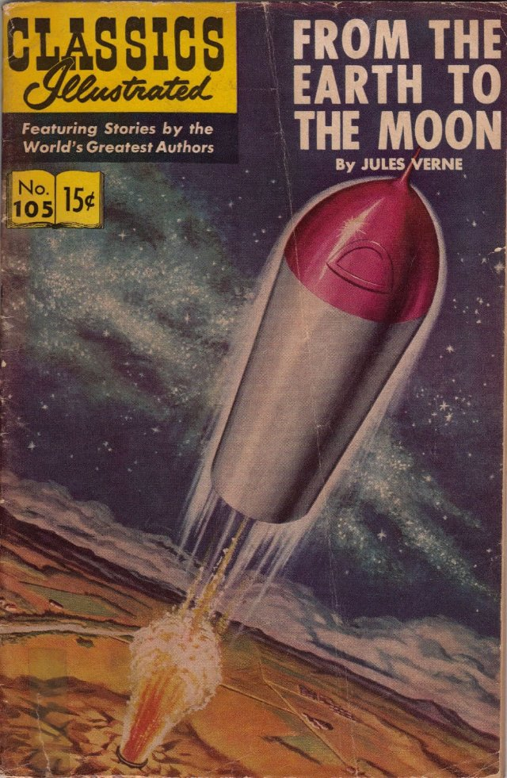{ loading=lazy }

A book by Jules Verne about going to the Moon in a big cannon! It was written before real rockets existed.

- Type: Object
- Subjects: Literature, Space, Science
- Year: 1865
- Country: France
- Topics: [Jules Verne](../topics/index.md#jules_verne)
- Image credit: CC0
- Quests: [Juliusz Verne i transport (fr_03)](../quest/fr_03.pl.md)

---

### Gargulec
{ loading=lazy }

Zabawna lub straszna figurka, która pełni również funkcję rynny deszczowej.

- Type: Concept
- Subjects: Art, Technology, History
- Country: France
- Image credit: CC_BY_SA | Martinvl | [source](https://commons.wikimedia.org/wiki/File:Gargoyle_depicting_Hodgetts,_Chichester_Cathedral.jpg)
- Quests: [Paryż! (fr_01)](../quest/fr_01.pl.md)

---

### Gustave Eiffel
{ loading=lazy }

Człowiek, który zbudował Wieżę Eiffla! Był inżynierem, który uwielbiał budować z żelaza i stworzył najsłynniejszą wieżę na świecie.

- Type: Person
- Subjects: History, Culture, Science
- Year: 1832
- Country: France
- Topics: [Eiffel Tower](../topics/index.md#eiffel-tower)
- Image credit: CC0
- Quests: [Paryż! (fr_01)](../quest/fr_01.pl.md)

---

### Hot-Air Balloon
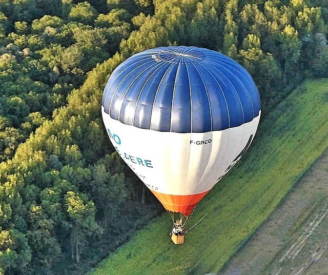{ loading=lazy }

A balloon that flies using hot air. The first one flew in France.

- Type: Object
- Subjects: Transportation
- Country: France
- Topics: [Jules Verne](../topics/index.md#jules_verne)
- Image credit: CC0
- Quests: [Juliusz Verne i transport (fr_03)](../quest/fr_03.pl.md)

---

### Jean Michel Jarre
{ loading=lazy }

A French musician famous for electronic music

- Type: Person
- Subjects: Music, Culture, Technology
- Year: 2000
- Country: France
- Image credit: CC0 | [source](https://commons.wikimedia.org/wiki/File:Jean_Michel_a_Roman_Bomboš.jpg)

---

### Jules Verne
{ loading=lazy }

A French writer who imagined amazing adventures before they were possible! He wrote about submarines, rockets, and traveling around the world.

- Rationale: Jules Verne shows kids how imagination and science can work together
- Type: Person
- Subjects: Literature, Science, History
- Year: 1828
- Country: France
- Topics: [Jules Verne](../topics/index.md#jules_verne)
- Image credit: CC0
- Quests: [Juliusz Verne i transport (fr_03)](../quest/fr_03.pl.md)

---

### Kapelusz z piórami
{ loading=lazy }

Elegancki kapelusz z piórkiem dodającym stylu.

- Type: Object
- Subjects: Culture, History
- Country: France
- Image credit: CC0 | Gustav Klimt | [source](https://commons.wikimedia.org/wiki/File:Gustav_Klimt_019.jpg)

---

### Karta świeckości
{ loading=lazy }

Zbiór zasad szanujących przekonania każdego. Pomaga ludziom żyć razem w pokoju.

- Type: Concept
- Subjects: Community, Culture
- Year: 2013
- Country: France
- Topics: [French School](../topics/index.md#frenchschool)
- Image credit: CC0 | [source](https://camille-claudel.ecollege.haute-garonne.fr/le-college/charte-de-la-laicite/)
- Quests: [System edukacji (fr_02)](../quest/fr_02.pl.md), [Juliusz Verne i transport (fr_03)](../quest/fr_03.pl.md)

---

### Kask
{ loading=lazy }

Metalowy kapelusz chroniący głowę.

- Type: Object
- Subjects: History, Safety
- Country: France
- Image credit: CC0 | Jebulon | [source](https://commons.wikimedia.org/wiki/File:Cavalier_Garde_Républicaine_trois-quart_dos.jpg)

---

### Kask (bezpieczeństwo uliczne)
{ loading=lazy }

Twardy kask chroniący głowę podczas jazdy.

- Type: Object
- Subjects: Safety, Health, Education
- Country: France
- Topics: [Stree safety](../topics/index.md#street-safety)
- Image credit: CC_BY | Paul Arps from The Netherlands | [source](https://commons.wikimedia.org/wiki/File:Safety_helmet_(Myanmar_2013)_(11772851273).jpg)

---

### Katapultować
{ loading=lazy }

Maszyna, która rzuca kamieniami na dużą odległość.

- Type: Object
- Subjects: Technology, History
- Country: France
- Image credit: CC_BY_SA | Jacek Halicki | [source](https://commons.wikimedia.org/wiki/File:2023_Proca_neurobalistyczna.jpg)

---

### Katedra
{ loading=lazy }

Bardzo duży i ważny kościół w mieście.

- Type: Place
- Subjects: Culture, History, Education
- Country: France
- Image credit: CC_BY_SA | Richard Bartz, Munich aka Makro Freak | [source](https://commons.wikimedia.org/wiki/File:Svyato_Mihailovsky_Cathedral_Izhevsk_Russia_Richard_Bartz.jpg)
- Quests: [Paryż! (fr_01)](../quest/fr_01.pl.md)

---

### Katedra Notre-Dame w Paryżu
{ loading=lazy }

Piękna katedra w Paryżu. Jej kolorowe witraże opowiadają historie.

- Type: Place
- Subjects: Geography, Environment
- Year: 1885
- Country: France
- Topics: [Notre Dame](../topics/index.md#notredame)
- Image credit: CC0
- Quests: [Paryż! (fr_01)](../quest/fr_01.pl.md)

---

### Kodeks Hammurabiego
{ loading=lazy }

Kamień z wyrytymi bardzo starymi prawami.

- Type: Object
- Subjects: History, Civics
- Country: France
- Image credit: CC_BY | Mbzt | [source](https://commons.wikimedia.org/wiki/File:P1050763_Louvre_code_Hammurabi_face_rwk.JPG)
- Quests: [Paryż! (fr_01)](../quest/fr_01.pl.md)

---

### Koronacja Napoleona (Dawid)
{ loading=lazy }

Ogromny obraz przedstawiający ceremonię cesarza Francji.

- Type: Object
- Subjects: Art, History
- Country: France
- Image credit: CC0 | Jacques-Louis David / Georges Rouget | [source](https://commons.wikimedia.org/wiki/File:Jacques-Louis_David_-_The_Coronation_of_Napoleon_(1805-1807).jpg)
- Quests: [Paryż! (fr_01)](../quest/fr_01.pl.md)

---

### Kościół
{ loading=lazy }

Specjalny budynek, w którym ludzie spotykają się, aby modlić się i śpiewać.

- Type: Place
- Subjects: Culture, Civics, Education
- Country: France
- Image credit: CC_BY_SA | King of Hearts | [source](https://commons.wikimedia.org/wiki/File:Stanford_Memorial_Church_May_2011_HDR_1.jpg)
- Quests: [Paryż! (fr_01)](../quest/fr_01.pl.md)

---

### Królewska sypialnia
{ loading=lazy }

Elegancki pokój z dużym łóżkiem z baldachimem.

- Type: Place
- Subjects: Culture, History
- Country: France
- Image credit: CC0 | Aleksander Gryglewski | [source](https://commons.wikimedia.org/wiki/File:Aleksander_Gryglewski_-_Interior_of_the_royal_bedroom_at_the_Wilanów_Palace_-_MP_184_MNW_-_National_Museum_in_Warsaw.jpg)

---

### Ksylofon
{ loading=lazy }

Instrument z prętami, w które uderza się, aby uzyskać nuty.

- Type: Object
- Subjects: Music, Education
- Country: France
- Image credit: CC_BY | Mayor McGinn | [source](https://commons.wikimedia.org/wiki/File:Mayor_westlake_play_03_(8532405090).jpg)

---

### La
{ loading=lazy }

Nuta muzyczna.

- Type: Concept
- Subjects: Music, Education
- Country: France
- Topics: [Musical Notes](../topics/index.md#musical_notes)
- Image credit: CC_BY_SA | Basile Morin | [source](https://commons.wikimedia.org/wiki/File:Karst_peaks_and_green_paddy_fields_under_a_stormy_sky,_South_view_from_Mount_Nam_Xay,_Vang_Vieng,_Laos.jpg)

---

### Latająca przypora
{ loading=lazy }

Kamienne ramiona na zewnątrz, które pomagają podtrzymywać wysokie mury.

- Type: Concept
- Subjects: Technology, History, Art
- Country: France
- Image credit: CC_BY_SA | Acroterion | [source](https://commons.wikimedia.org/wiki/File:Amiens_Cathedral_gallery_roof_and_buttresses_1980-1.jpg)
- Quests: [Paryż! (fr_01)](../quest/fr_01.pl.md)

---

### Le Mans
{ loading=lazy }

Miasto we Francji słynące z 24-godzinnego wyścigu samochodowego.

- Type: Place
- Subjects: Geography, Culture, Community
- Country: France
- Image credit: CC_BY_SA | Selbymay | [source](https://commons.wikimedia.org/wiki/File:Le_Mans_-_Cathedrale_St_Julien_ext_autumn.jpg)

---

### Liceum we Francji
{ loading=lazy }

Szkoła średnia we Francji dla nastolatków w wieku od 16 do 18 lat. Uczniowie intensywnie przygotowują się do egzaminu maturalnego, aby móc iść na uniwersytet.

- Rationale: The Lycée system shows kids the path to higher education in France
- Type: Concept
- Subjects: Education, Culture
- Year: 1975
- Country: France
- Topics: [French School](../topics/index.md#frenchschool)
- Image credit: CC0 | Émeric, CC BY-SA 3.0 <https://creativecommons.org/licenses/by-sa/3.0>, via Wikimedia Commons | [source](https://commons.wikimedia.org/wiki/File:Atelier_lyc%C3%A9e_Chevrollier.jpg)
- Quests: [System edukacji (fr_02)](../quest/fr_02.pl.md)

---

### Luki
{ loading=lazy }

Wąskie okna umożliwiające bezpieczne strzelanie.

- Type: Concept
- Subjects: History, Technology
- Country: France
- Image credit: CC_BY_SA | A.-K. D. | [source](https://commons.wikimedia.org/wiki/File:Cross_shaped_loophole.jpg)

---

### Lutnia
{ loading=lazy }

Instrument strunowy, na którym gra się na dworze.

- Type: Object
- Subjects: Music, Culture, History
- Country: France
- Image credit: CC_BY | Ching | [source](https://commons.wikimedia.org/wiki/File:Lute_(by_Princess_Ruto,_2013-02-11).jpg)

---

### Mapa Sekwany
{ loading=lazy }

Zdjęcie przedstawiające rzekę Sekwanę i jej przepływ przez ląd.

- Type: Object
- Subjects: Geography, Environment
- Country: France
- Image credit: CC0
- Quests: [Paryż Sekwana (fr_10)](../quest/fr_10.pl.md)

---

### Mapa Sekwany w Paryżu
{ loading=lazy }

Zdjęcie przedstawiające przepływ rzeki Sekwany przez Paryż.

- Type: Object
- Subjects: Science
- Country: France
- Image credit: CC0
- Quests: [Paryż Sekwana (fr_10)](../quest/fr_10.pl.md)

---

### Marsylianka
{ loading=lazy }

Francuska pieśń narodowa. Śpiewa się ją podczas wielkich wydarzeń i meczów sportowych.

- Type: Concept
- Subjects: Music, Culture
- Year: 1885
- Country: France
- Topics: [marseillaise music](../topics/index.md#marseillaise_music)
- Image credit: CC0
- Audio credit: PublicDomain | [source](https://commons.wikimedia.org/wiki/File:La_Marseillaise_(1914_Recording).ogg)
- Quests: [Marsylianka (fr_11)](../quest/fr_11.pl.md)

---

### Maska maskaradowa
{ loading=lazy }

Maska na imprezy i bale.

- Type: Object
- Subjects: Culture, History, Recreation
- Country: France
- Image credit: CC_BY_SA | David Jackson | [source](https://commons.wikimedia.org/wiki/File:BLW_Yoruba_Epa_Mask.jpg)

---

### Mi
{ loading=lazy }

Nuta muzyczna.

- Type: Concept
- Subjects: Music, Education
- Country: France
- Topics: [Musical Notes](../topics/index.md#musical_notes)
- Image credit: CC_BY | Dwight Burdette | [source](https://commons.wikimedia.org/wiki/File:Lenawee_County_Courthouse_Adrian_Michigan.JPG)

---

### Miecz
{ loading=lazy }

Długie ostrze używane przez rycerzy.

- Type: Object
- Subjects: History, Culture
- Country: France
- Image credit: CC_BY_SA | Rama | [source](https://commons.wikimedia.org/wiki/File:Sword-AO_21069-P5280877-gradient.jpg)

---

### Most Aleksandra III
{ loading=lazy }

Piękny most w Paryżu z misternymi dekoracjami i złotymi posągami.

- Type: Place
- Subjects: Geography, Environment
- Country: France
- Image credit: CC0
- Quests: [Paryż Sekwana (fr_10)](../quest/fr_10.pl.md)

---

### Most zwodzony
{ loading=lazy }

Most podnoszony w celu ochrony wejścia do zamku.

- Type: Object
- Subjects: Technology, History, Safety
- Country: France
- Image credit: CC_BY_SA | Chuck Homler, Focus On Wildlife | [source](https://commons.wikimedia.org/wiki/File:Bufflehead-Tacony-MT.jpg)

---

### Muzyka
{ loading=lazy }

Zapis nutowy i słowa piosenki.

- Type: Object
- Subjects: Education, Music
- Country: France
- Topics: [Musical Notes](../topics/index.md#musical_notes)
- Image credit: CC0 | Claude Joseph Rouget de Lisle | [source](https://commons.wikimedia.org/wiki/File:La_Marseillaise_chant_national_français_de_Rouget_de_L'Isle_Transcription_de_Langevin-2.jpg)

---

### Nike z Samotraki
{ loading=lazy }

Słynna starożytna rzeźba przedstawiająca boginię ze skrzydłami.

- Type: Object
- Subjects: Art, History
- Country: France
- Image credit: CC_BY_SA | Rijin | [source](https://commons.wikimedia.org/wiki/File:Winged_Victory_of_Samothrace_(1).jpg)
- Quests: [Paryż! (fr_01)](../quest/fr_01.pl.md)

---

### Odnośnie
{ loading=lazy }

Nuta muzyczna.

- Type: Concept
- Subjects: Music, Education
- Country: France
- Topics: [Musical Notes](../topics/index.md#musical_notes)
- Image credit: CC_BY_SA | Youlaus | [source](https://commons.wikimedia.org/wiki/File:Nota_Ré_4_(Piano).png)

---

### Ogrody formalne
{ loading=lazy }

Ogrody ozdobne do spacerów i przyjęć.

- Type: Place
- Subjects: Culture, Environment
- Country: France
- Image credit: CC_BY_SA | Urban at French Wikipedia | [source](https://commons.wikimedia.org/wiki/File:Orangerie.jpg)

---

### Okno rozetowe
{ loading=lazy }

Duży, okrągły witraż opowiadający historie światłem.

- Type: Concept
- Subjects: Art, Culture, History
- Country: France
- Image credit: CC_BY_SA | Diliff | [source](https://commons.wikimedia.org/wiki/File:Amiens_Cathedral_Organ_and_Rose_Window,_Picardy,_France_-_Diliff.jpg)
- Quests: [Paryż! (fr_01)](../quest/fr_01.pl.md)

---

### Parapet
{ loading=lazy }

Niski mur na skraju wałów obronnych.

- Type: Concept
- Subjects: History, Technology
- Country: France
- Image credit: CC_BY_SA | Johann Jaritz | [source](https://commons.wikimedia.org/wiki/File:Feldkirchen_Kirchgasse_6_Wohn-und_Geschäftshaus_Parapet-Fenster_06062019_7122.jpg)

---

### Piramida Luwru
{ loading=lazy }

Szklana piramida, która stanowi współczesne wejście do Luwru.

- Type: Place
- Subjects: Art, Culture, Technology
- Country: France
- Image credit: CC_BY_SA | Benh LIEU SONG (Flickr) | [source](https://commons.wikimedia.org/wiki/File:Louvre_Courtyard,_Looking_West.jpg)
- Quests: [Paryż! (fr_01)](../quest/fr_01.pl.md)

---

### Pismo odręczne
{ loading=lazy }

Specjalny sposób pisania, w którym wszystkie litery w słowie są połączone. We Francji dzieci uczą się tego sposobu pisania w szkole.

- Rationale: Cursive writing is an important part of French education and cultural identity
- Type: Concept
- Subjects: Education, Culture, Art
- Year: 1800
- Country: France
- Topics: [French School](../topics/index.md#frenchschool)
- Image credit: CC0 | [source](https://commons.wikimedia.org/wiki/File:BlackBoard_(Blender_classroom_demo).png)
- Quests: [System edukacji (fr_02)](../quest/fr_02.pl.md)

---

### Pożar Notre-Dame
{ loading=lazy }

W 2019 roku wielki pożar zniszczył piękną katedrę Notre-Dame w Paryżu. Wiele osób współpracowało, aby uratować ten ważny budynek.

- Rationale: This event teaches kids about protecting cultural heritage and community cooperation
- Type: Concept
- Subjects: History, Culture, Environment
- Year: 2019
- Country: France
- Topics: [Notre Dame](../topics/index.md#notredame)
- Image credit: CC0
- Quests: [Paryż! (fr_01)](../quest/fr_01.pl.md)

---

### Przewoźnik
{ loading=lazy }

Osoba wiosłująca łodzią po Loarze.

- Type: Person
- Subjects: Community, Transportation
- Country: France
- Image credit: CC_BY | Vyacheslav Argenberg | [source](https://commons.wikimedia.org/wiki/File:Perhentian_Islands,_Boatman,_Malaysia.jpg)

---

### Przysięga Horacjuszy (Dawida)
{ loading=lazy }

Obraz przedstawiający trzech braci składających odważną obietnicę.

- Type: Object
- Subjects: Art, History
- Country: France
- Image credit: CC0 | Jacques-Louis David | [source](https://commons.wikimedia.org/wiki/File:Jacques-Louis_David,_Le_Serment_des_Horaces.jpg)
- Quests: [Paryż! (fr_01)](../quest/fr_01.pl.md)

---

### Rewolucja francuska
{ loading=lazy }

Okres lat dziewięćdziesiątych XVIII wieku, kiedy we Francji nastąpiła zmiana rządu.

- Type: Concept
- Subjects: History, Civics, Time, Culture
- Country: France
- Topics: [marseillaise music](../topics/index.md#marseillaise_music)
- Image credit: CC_BY_SA | [source](https://commons.wikimedia.org/wiki/File:11-french_revolution_1789.jpg)

---

### Rower
{ loading=lazy }

Pojazd z dwoma kołami, do których pedałuje się.

- Type: Object
- Subjects: Transportation, Health, Recreation
- Country: France
- Image credit: CC_BY_SA | Basile Morin | [source](https://commons.wikimedia.org/wiki/File:Parked_bicycle_with_graffitied_building_facade_and_doors_in_Amsterdam.jpg)

---

### Rzeka Loara
{ loading=lazy }

Długa rzeka we Francji, wzdłuż której brzegów znajduje się wiele zamków.

- Type: Place
- Subjects: Geography, Environment
- Country: France
- Image credit: CC_BY_SA | Ввласенко | [source](https://commons.wikimedia.org/wiki/File:Loire_river_near_Amboise_in_September._France.jpg)

---

### Sala balowa
{ loading=lazy }

Duża sala do tańca i muzyki.

- Type: Place
- Subjects: Culture, History
- Country: France
- Words: 
- Image credit: CC_BY_SA | P e z i | [source](https://commons.wikimedia.org/wiki/File:Parkhotel_Schoenbrunn_Ballsaal_DSC_5115w.jpg)

---

### Samochód wyścigowy
{ loading=lazy }

Bardzo szybki samochód używany na torach wyścigowych.

- Type: Object
- Subjects: Sport, Technology
- Country: France
- Image credit: CC_BY_SA | user:AngMoKio | [source](https://commons.wikimedia.org/wiki/File:Porsche_race_car_Verschuur_amk.jpg)

---

### Sekwana
{ loading=lazy }

Rzeka o długości 777 kilometrów w północnej Francji

- Type: Place
- Subjects: Geography
- Country: France
- Image credit: CC0
- Quests: [Paryż Sekwana (fr_10)](../quest/fr_10.pl.md)

---

### Si
{ loading=lazy }

Nuta muzyczna.

- Type: Concept
- Subjects: Music, Education
- Country: France
- Topics: [Musical Notes](../topics/index.md#musical_notes)
- Image credit: CC_BY_SA | Bureau international des poids et mesures, International Bureau of Weights and Measures (BIPM) | [source](https://commons.wikimedia.org/wiki/File:SI_Logo_with_defining_constants.png)

---

### Siedzący skryba
{ loading=lazy }

Starożytna egipska statua przedstawiająca osobę piszącą.

- Type: Object
- Subjects: Art, History
- Country: France
- Image credit: CC_BY_SA | Rama | [source](https://commons.wikimedia.org/wiki/File:The_seated_scribe-E_3023-IMG_4267-gradient-contrast.jpg)
- Quests: [Paryż! (fr_01)](../quest/fr_01.pl.md)

---

### Skuter
{ loading=lazy }

Mały dwukołowy skuter (trottinette).

- Type: Object
- Subjects: Transportation, Recreation, Safety
- Country: France
- Image credit: CC_BY_SA | Spurzem - Lothar Spurzem | [source](https://commons.wikimedia.org/wiki/File:Zündapp_Bella_R_154_(2008-05-21)_Seitenansicht_ret.jpg)

---

### Sol
{ loading=lazy }

Nuta muzyczna.

- Type: Concept
- Subjects: Music, Education
- Country: France
- Topics: [Musical Notes](../topics/index.md#musical_notes)
- Image credit: CC_BY_SA | kallerna | [source](https://commons.wikimedia.org/wiki/File:Sol_de_Mañana_2018.jpg)

---

### Statek po Sekwanie
{ loading=lazy }

Wyjątkowa łódź, która pływa po Sekwanie w Paryżu. Z wody widać Wieżę Eiffla i inne piękne budynki!

- Rationale: Boat tours help kids see Paris from a different perspective and understand river transportation
- Type: Concept
- Subjects: Transportation, Geography, Culture
- Year: 1900
- Country: France
- Image credit: CC0
- Quests: [Paryż Sekwana (fr_10)](../quest/fr_10.pl.md)

---

### Strzałki
{ loading=lazy }

Ostre patyki wystrzeliwane z łuku.

- Type: Object
- Subjects: History, Technology
- Country: France
- Image credit: CC_BY | Julian Herzog (Website) | [source](https://commons.wikimedia.org/wiki/File:Red_Arrows_Formation_Duxford_Flying_Finale_2024_02.jpg)

---

### Sygnalizacja świetlna
{ loading=lazy }

Latarnie uliczne informujące, kiedy należy się ZATRZYMAĆ lub JECHAĆ.

- Type: Object
- Subjects: Safety, Education, Transportation
- Country: France
- Topics: [Stree safety](../topics/index.md#street-safety)
- Image credit: CC0

---

### Szkoła Maternelle
{ loading=lazy }

Szkoła dla małych dzieci w wieku od 3 do 5 lat. Uczysz się poprzez zabawę i odkrywanie.

- Type: Concept
- Subjects: Education, Culture
- Year: 1975
- Country: France
- Topics: [French School](../topics/index.md#frenchschool)
- Image credit: CC0 | Polymagou, CC BY-SA 4.0 <https://creativecommons.org/licenses/by-sa/4.0>, via Wikimedia Commons | [source](https://commons.wikimedia.org/wiki/File:%C3%89cole_maternelle_Paul-Langevin,_Les_Clayes-sous-Bois,_Yvelines_9-3.jpg)
- Quests: [System edukacji (fr_02)](../quest/fr_02.pl.md)

---

### Szkoła podstawowa we Francji
{ loading=lazy }

Szkoła dla dzieci w wieku od 6 do 10 lat. Uczysz się czytania, pisania i liczenia.

- Type: Concept
- Subjects: Education, Culture
- Year: 1975
- Country: France
- Topics: [French School](../topics/index.md#frenchschool)
- Image credit: Licensed
- Quests: [System edukacji (fr_02)](../quest/fr_02.pl.md)

---

### Ukłon
{ loading=lazy }

Broń strzelająca strzałami.

- Type: Object
- Subjects: History, Technology
- Country: France
- Image credit: CC0 | Harold Dean Carsey (1886-1947) | [source](https://commons.wikimedia.org/wiki/File:Clara_Bow,_grayscale.jpg)

---

### Wały
{ loading=lazy }

Wysokie mury, po których można chodzić i strzec zamku.

- Type: Concept
- Subjects: History, Technology
- Country: France
- Image credit: CC_BY_SA | Txllxt TxllxT | [source](https://commons.wikimedia.org/wiki/File:Pardubice_-_Zámek_Pardubice_-_Ramparts_View_SSE_-_Renaissance_architecture.jpg)

---

### Wejście na tor wyścigowy Le Mans
{ loading=lazy }

Wejście na tor wyścigowy Le Mans.

- Type: Place
- Subjects: Geography, Sport, Culture
- Country: France
- Image credit: CC_BY_SA | Neuwieser from Germany | [source](https://commons.wikimedia.org/wiki/File:24h_Le_Mans_2014_(16043688764).jpg)

---

### Wieża Eiffla
{ loading=lazy }

Wysoka wieża i symbol Paryża. Jest wykonana z żelaza i ma 300 metrów wysokości. Można na nią wejść i zobaczyć całe miasto.

- Type: Place
- Subjects: Geography, History, Culture
- Year: 1889
- Country: France
- Topics: [Eiffel Tower](../topics/index.md#eiffel-tower)
- Image credit: CC0
- Quests: [Paryż! (fr_01)](../quest/fr_01.pl.md)

---

### Windy Wieży Eiffla
{ loading=lazy }

Windy, którymi zwiedzający mogą wjechać na żelazną wieżę.

- Type: Object
- Subjects: Technology, Transportation
- Country: France
- Image credit: CC0 | Louis-Emile Durandelle | [source](https://commons.wikimedia.org/wiki/File:Louis-Emile_Durandelle,_The_Eiffel_Tower_-_State_of_the_Construction,_1888.jpg)
- Quests: [Paryż! (fr_01)](../quest/fr_01.pl.md)

---

### Wolność wiodąca lud
{ loading=lazy }

Słynny obraz o wolności i odwadze. Przedstawia odważną kobietę trzymającą flagę Francji i prowadzącą ludzi do walki o swoje prawa.

- Rationale: This painting teaches kids about fighting for freedom and the French Revolution
- Type: Object
- Subjects: Art, History, Culture
- Year: 1830
- Country: France
- Topics: [Louvre](../topics/index.md#louvre)
- Image credit: CC0

---

### Wystawa światowa (1889)
{ loading=lazy }

Wielka światowa wystawa, na której pokazano Wieżę Eiffla.

- Type: Concept
- Subjects: History, Culture
- Country: France
- Image credit: CC0 | imp. de Erhard (Paris), 1889 | [source](https://commons.wikimedia.org/wiki/File:Plan_général_exposition_universelle_de_1889.jpg)
- Quests: [Paryż! (fr_01)](../quest/fr_01.pl.md)

---

### Zamek Chambord
{ loading=lazy }

Wspaniały pałac z wieloma oknami i ogrodami.

- Type: Place
- Subjects: History, Culture, Geography
- Country: France
- Image credit: CC_BY_SA | Benh LIEU SONG | [source](https://commons.wikimedia.org/wiki/File:Chambord_Castle_Northwest_facade.jpg)

---

### Zamek Chinon
{ loading=lazy }

Zamek Chinon to potężna kamienna twierdza na wzgórzu nad rzeką w Dolinie Loary. Dawno temu przebywali tu królowie, a Joanna d'Arc przybyła tu, aby spotkać się z przyszłym królem Francji.

- Type: Place
- Subjects: History
- Country: France
- Image credit: CC0
- Quests: [Opowieść o dwóch zamkach (fr_05)](../quest/fr_05.pl.md)

---

### Zamek Chinon
{ loading=lazy }

Mocna kamienna twierdza, wykorzystywana do obrony.

- Type: Place
- Subjects: History, Geography, Culture
- Country: France
- Image credit: CC_BY_SA | Benjamin Smith | [source](https://commons.wikimedia.org/wiki/File:Chinon_-_Château_vu_depuis_la_plage.jpg)

---

### Zbroja
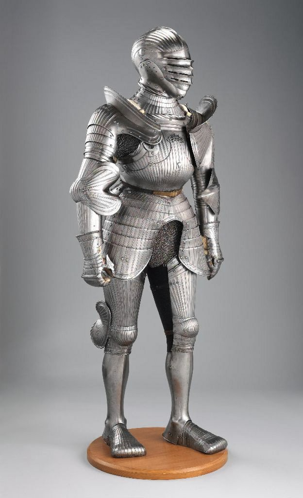{ loading=lazy }

Metalowy ubiór ochronny dla rycerza.

- Type: Object
- Subjects: History, Safety
- Country: France
- Image credit: CC0 | [source](https://commons.wikimedia.org/wiki/File:Armor_MET_DP271145.jpg)

---

### Zebra
{ loading=lazy }

Białe pasy tam, gdzie ludzie przechodzą przez ulicę.

- Type: Object
- Subjects: Safety, Education, Transportation
- Country: France
- Topics: [Stree safety](../topics/index.md#street-safety)
- Image credit: CC_BY_SA | Shuets Udono | [source](https://commons.wikimedia.org/wiki/File:Japanese_car_accident.jpg)

---

### Łódź podwodna (Nautilus)
{ loading=lazy }

Łódź podwodna z powieści Juliusza Verne'a. Mogła eksplorować głębiny morskie.

- Type: Object
- Subjects: Literature, Science
- Country: France
- Topics: [Jules Verne](../topics/index.md#jules_verne)
- Image credit: CC0
- Quests: [Juliusz Verne i transport (fr_03)](../quest/fr_03.pl.md)

---

### Żaluzja
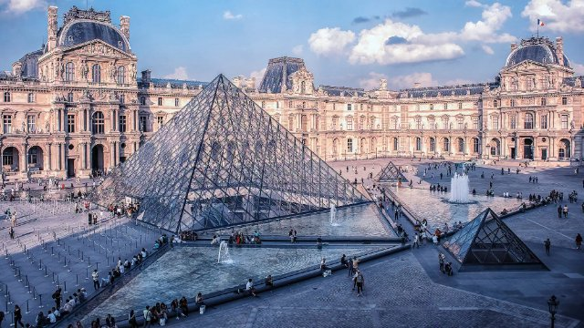{ loading=lazy }

Ogromne muzeum pełne sztuki. To tu mieszka Mona Lisa.

- Type: Place
- Subjects: Art, Culture, History
- Year: 1793
- Country: France
- Topics: [Louvre](../topics/index.md#louvre)
- Image credit: CC0
- Quests: [Paryż! (fr_01)](../quest/fr_01.pl.md)

## Poland

### Astronomia
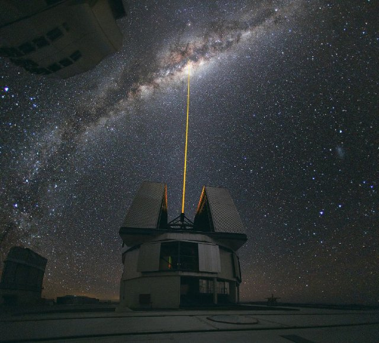{ loading=lazy }

Nauka zajmująca się badaniem Słońca, Księżyca, gwiazd i planet.

- Type: Concept
- Subjects: Science, Space
- Country: Poland
- Topics: [Solar System](../topics/index.md#solar_system)
- Image credit: CC_BY | ESO/Yuri Beletsky (ybialets at eso.org) | [source](https://commons.wikimedia.org/wiki/File:Laser_Towards_Milky_Ways_Centre.jpg)
- Quests: [Kopernik i układ słoneczny (pl_07)](../quest/pl_07.pl.md)

---

### Barka
{ loading=lazy }

Długa, płaska łódź przeznaczona do transportu towarów po rzekach.

- Type: Object
- Subjects: Transportation, Geography
- Country: Poland
- Image credit: CC_BY_SA | Dietmar Rabich
- Quests: [Rzeka Odra (pl_03)](../quest/pl_03.pl.md)

---

### Biskup Krasnolud
{ loading=lazy }

Posąg karła zadającego pytanie kościelne.

- Type: Object
- Subjects: Culture, History
- Country: Poland
- Topics: [Wroclaw Dwarves](../topics/index.md#wroclaw_dwarves)
- Image credit: CC_BY_SA | Teal Reverie | [source](https://commons.wikimedia.org/wiki/File:Dwarf_spider_cephalothorax.jpg)
- Quests: [Wielka akcja ratunkowa krasnala wrocławskiego (pl_02)](../quest/pl_02.pl.md)

---

### Bursztyn
{ loading=lazy }

Błyszcząca skamieniała żywica drzewna zwana „Bałtyckim Złotem”.

- Type: Object
- Subjects: History, Culture, Science
- Country: Poland
- Topics: [Neptune's fountain](../topics/index.md#neptune_fountain)
- Image credit: CC_BY_SA | Diego Delso | [source](https://commons.wikimedia.org/wiki/File:Fuerte_Amber,_Amber,_India,_2009-12-04,_DD_0019.jpg)
- Quests: [Gdański naszyjnik bursztynowy (pl_05)](../quest/pl_05.pl.md)

---

### Dom Mikołaja Kopernika
{ loading=lazy }

Obecnie mieści się tam muzeum, w którym można poznać historię jego życia i osiągnięć naukowych.

- Type: Place
- Subjects: Culture, Science
- Country: Poland
- Image credit: CC0 | Pko, CC BY-SA 4.0 <https://creativecommons.org/licenses/by-sa/4.0>, via Wikimedia Commons | [source](https://commons.wikimedia.org/w/index.php?curid=76433849)
- Quests: [Kopernik i układ słoneczny (pl_07)](../quest/pl_07.pl.md)

---

### Dom na wodzie
{ loading=lazy }

Łódź stworzona do życia na niej.

- Type: Object
- Subjects: Transportation, Community
- Country: Poland
- Topics: [Odra river](../topics/index.md#odra_river)
- Image credit: CC_BY_SA | Kritzolina | [source](https://commons.wikimedia.org/wiki/File:Houseboat_in_Copenhagen_Harbor_02.jpg)
- Quests: [Rzeka Odra (pl_03)](../quest/pl_03.pl.md)

---

### Dyrektor zoo
{ loading=lazy }

Osoba zarządzająca zoo i pomagająca zwiedzającym.

- Type: Person
- Subjects: Community, Education
- Country: Poland
- Topics: [wroclaw zoo](../topics/index.md#wroclaw_zoo)
- Image credit: CC0 | USFWS Pacific | [source](https://commons.wikimedia.org/wiki/File:USFWS_director_visits_Oregon_Zoo_(51946414879).jpg)
- Quests: [Zoo (pl_04)](../quest/pl_04.pl.md)

---

### Ekosystem
{ loading=lazy }

Żywe organizmy i ich środowisko naturalne, współpracujące ze sobą.

- Type: Concept
- Subjects: Environment, Science
- Country: Poland
- Image credit: CC_BY_SA | XCXNXH | [source](https://commons.wikimedia.org/wiki/File:JULY_2024_COBERMS_RESEARCH_WORK_AT_KONGO_VILLAGE.jpg)
- Quests: [Gdański naszyjnik bursztynowy (pl_05)](../quest/pl_05.pl.md)

---

### Ekspert Krasnoludów
{ loading=lazy }

Przyjazny przewodnik, który wie wszystko o krasnoludkach.

- Type: Person
- Subjects: Education, Culture
- Country: Poland
- Topics: [Wroclaw Dwarves](../topics/index.md#wroclaw_dwarves)
- Image credit: CC_BY | Tomasz Gąsior | [source](https://commons.wikimedia.org/wiki/File:Kaczmaruś_dwarf_02.jpg)
- Quests: [Wielka akcja ratunkowa krasnala wrocławskiego (pl_02)](../quest/pl_02.pl.md)

---

### Fale
{ loading=lazy }

Ruch wody na morzu.

- Type: Concept
- Subjects: Environment, Science
- Country: Poland
- Topics: [Fisherman](../topics/index.md#fisherman)
- Image credit: CC_BY_SA | Roger McLassus | [source](https://commons.wikimedia.org/wiki/File:2006-01-14_Surface_waves.jpg)
- Quests: [Gdański naszyjnik bursztynowy (pl_05)](../quest/pl_05.pl.md)

---

### Flaga Polski
{ loading=lazy }

Flaga Polski ma poziome, biało-czerwone pasy. Polska słynie z naukowców takich jak Kopernik i pysznych pierogów!

- Rationale: The Polish flag is essential for Polish language learning and cultural identity
- Type: Concept
- Subjects: Geography, Culture
- Year: 1919
- Country: Poland
- Topics: [Poland country](../topics/index.md#poland)
- Image credit: CC0
- Quests: [Sąsiedzi Polski (pl_00)](../quest/pl_00.pl.md)

---

### Flaga Wrocławia
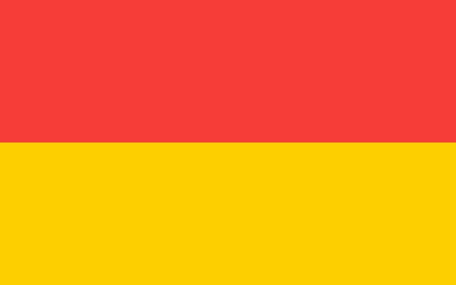{ loading=lazy }

Flaga miasta, którą należy znaleźć i zwrócić.

- Type: Object
- Subjects: Culture, Community, History
- Country: Poland
- Image credit: CC0 | [source](https://commons.wikimedia.org/wiki/File:POL_Wroc%C5%82aw_flag.svg)
- Quests: [Zoo (pl_04)](../quest/pl_04.pl.md)

---

### Foka
{ loading=lazy }

Dzikie zwierzę morskie, odpoczywające na plażach.

- Type: Object
- Subjects: Animal, Environment, Safety
- Country: Poland
- Image credit: CC_BY_SA | Charles J. Sharp | [source](https://commons.wikimedia.org/wiki/File:Common_seal_(Phoca_vitulina)_2.jpg)
- Quests: [Gdański naszyjnik bursztynowy (pl_05)](../quest/pl_05.pl.md)

---

### Fontanna Neptuna
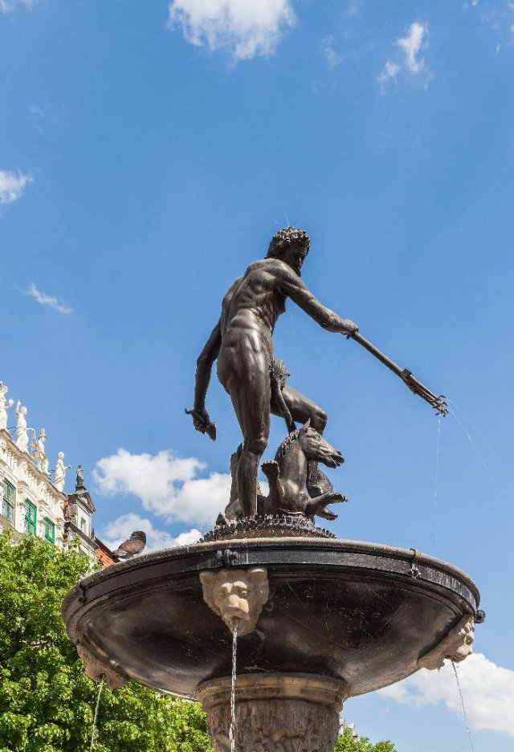{ loading=lazy }

Słynna fontanna w Gdańsku z figurą boga morza.

- Type: Place
- Subjects: History, Culture, Community
- Country: Poland
- Topics: [Neptune's fountain](../topics/index.md#neptune_fountain)
- Image credit: CC_BY_SA | Diego Delso | [source](https://commons.wikimedia.org/wiki/File:Monumento_Neptuno,_Gdansk,_Polonia,_2013-05-20,_DD_03.jpg)
- Quests: [Gdański naszyjnik bursztynowy (pl_05)](../quest/pl_05.pl.md)

---

### Fryderyk Chopin
{ loading=lazy }

Znany polski kompozytor fortepianowy. Tworzył piękną muzykę, która brzmi jak taniec lub opowiadanie historii. Jego muzyka sprawia, że ​​ludzie czują się szczęśliwi lub smutni.

- Rationale: Chopin introduces kids to classical music and shows how music can express emotions
- Type: Person
- Subjects: Music, History, Culture
- Year: 1810
- Country: Poland
- Topics: [Warsaw](../topics/index.md#warsaw)
- Image credit: CC0
- Quests: [Odkryj Warszawę (pl_01)](../quest/pl_01.pl.md)

---

### Gdańsk
{ loading=lazy }

Miasto portowe w Polsce nad Morzem Bałtyckim.

- Type: Place
- Subjects: Geography, History, Culture
- Country: Poland
- Topics: [gdansk](../topics/index.md#gdansk), [Neptune's fountain](../topics/index.md#neptune_fountain)
- Image credit: CC_BY_SA | Diego Delso | [source](https://commons.wikimedia.org/wiki/File:Calle_Dlugie_Pobrzeze,_Gdansk,_Polonia,_2013-05-20,_DD_05.jpg)
- Quests: [Gdański naszyjnik bursztynowy (pl_05)](../quest/pl_05.pl.md)

---

### Główny Ratusz
{ loading=lazy }

Wysoki ratusz z wieżą i muzeum.

- Type: Place
- Subjects: History, Culture
- Country: Poland
- Image credit: CC_BY_SA | Diego Delso | [source](https://commons.wikimedia.org/wiki/File:Ayuntamiento_Principal,_Gdansk,_Polonia,_2013-05-20,_DD_01.jpg)
- Quests: [Gdański naszyjnik bursztynowy (pl_05)](../quest/pl_05.pl.md)

---

### Hala Stulecia
{ loading=lazy }

Hala Stulecia to ogromny budynek przypominający wielki namiot z dachem. Jest bardzo wysoki. Wewnątrz można oglądać różne pokazy, słuchać koncertów i oglądać mecze sportowe.

- Type: Place
- Subjects: Culture, Recreation
- Country: Poland
- Image credit: CC0 | Taxiarchos228, FAL, via Wikimedia Commons | [source](https://commons.wikimedia.org/wiki/File:Wroc%C5%82aw_-_Jahrhunderthalle1.jpg)
- Quests: [Wielka akcja ratunkowa krasnala wrocławskiego (pl_02)](../quest/pl_02.pl.md)

---

### Iglica
{ loading=lazy }

Wysoka metalowa rzeźba obok Centennial Hall.

- Type: Place
- Subjects: History, Culture
- Country: Poland
- Image credit: CC_BY_SA | Jonashtand | [source](https://commons.wikimedia.org/wiki/File:202206_Iglica,_Wrocław.jpg)
- Quests: [Zoo (pl_04)](../quest/pl_04.pl.md)

---

### Jupiter
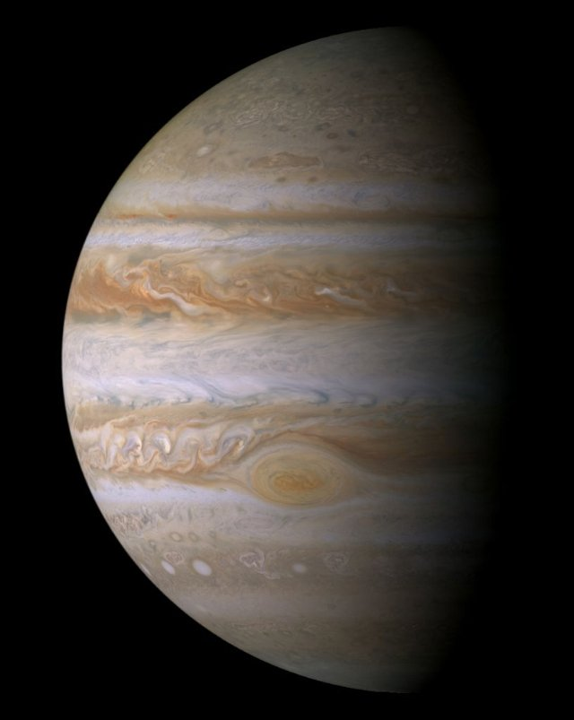{ loading=lazy }

Największa planeta, słynąca z Wielkiej Czerwonej Plamy.

- Type: Object
- Subjects: Space, Science
- Country: Poland
- Topics: [Solar System](../topics/index.md#solar_system)
- Image credit: CC0 | NASA/JPL/Space Science Institute | [source](https://commons.wikimedia.org/wiki/File:Portrait_of_Jupiter_from_Cassini.jpg)
- Quests: [Kopernik i układ słoneczny (pl_07)](../quest/pl_07.pl.md)

---

### Kajak
{ loading=lazy }

Mała łódka, którą wiosłujesz.

- Type: Object
- Subjects: Recreation, Sport
- Country: Poland
- Image credit: CC_BY_SA | 0x010C
- Quests: [Rzeka Odra (pl_03)](../quest/pl_03.pl.md)

---

### Krasnale wrocławskie
{ loading=lazy }

Malutkie figurki w całym mieście, które uwielbiają płatać figle.

- Type: Concept
- Subjects: Culture, Community, History
- Country: Poland
- Topics: [Wroclaw Dwarves](../topics/index.md#wroclaw_dwarves)
- Image credit: CC_BY_SA | Matti Blume | [source](https://commons.wikimedia.org/wiki/File:Dwarf,_Wroclaw_(P1180336).jpg)
- Quests: [Wielka akcja ratunkowa krasnala wrocławskiego (pl_02)](../quest/pl_02.pl.md)

---

### Krasnolud Klucznik
{ loading=lazy }

Posąg krasnoluda pilnującego windy z dużym kluczem.

- Type: Object
- Subjects: Culture
- Country: Poland
- Topics: [Wroclaw Dwarves](../topics/index.md#wroclaw_dwarves)
- Image credit: CC_BY_SA | Pnapora | [source](https://commons.wikimedia.org/wiki/File:100matolog_(Tooth-dwarf)_Wroclaw_dwarf_02.JPG)
- Quests: [Wielka akcja ratunkowa krasnala wrocławskiego (pl_02)](../quest/pl_02.pl.md)

---

### Król Zygmunt III
{ loading=lazy }

Król Polski, który wzniósł wiele pięknych budowli w Warszawie. Jego pomnik stoi na wysokiej kolumnie w centrum miasta.

- Rationale: Historical kings help kids understand how cities were built and developed over time
- Type: Person
- Subjects: History, Culture
- Year: 1566
- Country: Poland
- Image credit: CC0 | Pieter Soutman, Public domain, via Wikimedia Commons | [source](https://commons.wikimedia.org/wiki/File:Soutman_Sigismund_III_Vasa_in_coronation_robes.jpg)
- Quests: [Odkryj Warszawę (pl_01)](../quest/pl_01.pl.md)

---

### Kładka
{ loading=lazy }

Most, po którym ludzie mogą chodzić. Bez samochodów.

- Type: Object
- Subjects: Transportation, Community
- Country: Poland
- Topics: [Odra river](../topics/index.md#odra_river)
- Image credit: CC_BY_SA | Basile Morin | [source](https://commons.wikimedia.org/wiki/File:Front_view_of_a_wooden_footbridge_over_a_lagoon,_trees_and_mountains_in_Vang_Vieng,_Laos.jpg)
- Quests: [Rzeka Odra (pl_03)](../quest/pl_03.pl.md)

---

### Latarnia Morska Gdańsk
{ loading=lazy }

Zabytkowa latarnia morska, która pomaga statkom znaleźć port.

- Type: Place
- Subjects: History, Geography, Transportation
- Country: Poland
- Topics: [gdansk](../topics/index.md#gdansk)
- Image credit: CC_BY_SA | Yanek | [source](https://commons.wikimedia.org/wiki/File:Gdańsk,_Kapitanat_Portu_-_Port_Północny_-_fotopolska.eu_(304857).jpg)
- Quests: [Gdański naszyjnik bursztynowy (pl_05)](../quest/pl_05.pl.md)

---

### Leonardo da Vinci Primary School
{ loading=lazy }

It’s a friendly place where children learn, create, and explore guided by curiosity, art, and science.

- Type: None
- Subjects: Education
- Country: Poland
- Image credit: CC0
- Quests: [Wielka akcja ratunkowa krasnala wrocławskiego (pl_02)](../quest/pl_02.pl.md)

---

### Map of Wroklaw
{ loading=lazy }

A simple map of Wrocław showing the Odra River with its islands and many bridges

- Type: None
- Subjects: Geography
- Country: Poland
- Image credit: CC0
- Quests: [Wielka akcja ratunkowa krasnala wrocławskiego (pl_02)](../quest/pl_02.pl.md), [Rzeka Odra (pl_03)](../quest/pl_03.pl.md)

---

### Maria Curie
{ loading=lazy }

Genialna polska naukowiec, która odkryła radioaktywność. Była pierwszą kobietą, która otrzymała Nagrodę Nobla i to dwukrotnie!

- Rationale: Maria Curie inspires kids (especially girls) to pursue science and shows Polish contributions to science
- Type: Person
- Subjects: Science, History
- Year: 1867
- Country: Poland
- Image credit: CC0
- Quests: [Odkryj Warszawę (pl_01)](../quest/pl_01.pl.md)

---

### Mars
{ loading=lazy }

Czerwona planeta z pyłem i dużymi wulkanami.

- Type: Object
- Subjects: Space, Science
- Country: Poland
- Topics: [Solar System](../topics/index.md#solar_system)
- Image credit: CC_BY_SA | ESA & MPS for OSIRIS Team MPS/UPD/LAM/IAA/RSSD/INTA/UPM/DASP/IDA, CC BY-SA 3.0 IGO | [source](https://commons.wikimedia.org/wiki/File:OSIRIS_Mars_true_color.jpg)
- Quests: [Kopernik i układ słoneczny (pl_07)](../quest/pl_07.pl.md)

---

### Mewa
{ loading=lazy }

Ptak morski żyjący w pobliżu wybrzeża.

- Type: Object
- Subjects: Animal, Environment
- Country: Poland
- Image credit: CC_BY_SA | Diliff | [source](https://commons.wikimedia.org/wiki/File:Black-headed_Gull_-_St_James's_Park,_London_-_Nov_2006.jpg)
- Quests: [Gdański naszyjnik bursztynowy (pl_05)](../quest/pl_05.pl.md)

---

### Mikołaj Kopernik
{ loading=lazy }

Genialny naukowiec z Polski, który odkrył, że to Ziemia krąży wokół Słońca, a nie odwrotnie! To zmieniło nasze rozumienie kosmosu.

- Rationale: Copernicus teaches kids about scientific discovery and Polish contributions to astronomy
- Type: Person
- Subjects: Science, History, Space
- Year: 1473
- Country: Poland
- Topics: [Telescope](../topics/index.md#telescope)
- Image credit: CC0
- Quests: [Kopernik i układ słoneczny (pl_07)](../quest/pl_07.pl.md)

---

### Miłośnik zwierząt Krasnolud
{ loading=lazy }

Figurka krasnala, który uwielbia zoo i zwierzęta.

- Type: Object
- Subjects: Culture, Animal, Education
- Country: Poland
- Topics: [Wroclaw Dwarves](../topics/index.md#wroclaw_dwarves)
- Image credit: CC_BY | Klearchos Kapoutsis from Santorini, Greece | [source](https://commons.wikimedia.org/wiki/File:Gołębnik,_the_Flying_Dwarf..._(5629227878).jpg)
- Quests: [Wielka akcja ratunkowa krasnala wrocławskiego (pl_02)](../quest/pl_02.pl.md)

---

### Model heliocentryczny
{ loading=lazy }

Pogląd, że Słońce znajduje się w centrum, a planety krążą wokół niego.

- Type: Concept
- Subjects: Science, Space, History
- Country: Poland
- Topics: [Solar System](../topics/index.md#solar_system)
- Image credit: CC0 | Andreas Cellarius | [source](https://commons.wikimedia.org/wiki/File:1661_Cellarius's_chart_illustrating_Copernicus'_heliocentric_model_of_the_universe.jpg)
- Quests: [Kopernik i układ słoneczny (pl_07)](../quest/pl_07.pl.md)

---

### Most
{ loading=lazy }

Konstrukcja umożliwiająca ludziom lub pojazdom przekraczanie wody.

- Type: Concept
- Subjects: Technology, Transportation
- Country: Poland
- Image credit: CC_BY_SA | W.carter | [source](https://commons.wikimedia.org/wiki/File:Bridge_and_deck_of_Gullbritt.jpg)
- Quests: [Rzeka Odra (pl_03)](../quest/pl_03.pl.md)

---

### Most drogowy
{ loading=lazy }

Most dla samochodów i autobusów.

- Type: Object
- Subjects: Transportation
- Country: Poland
- Topics: [Odra river](../topics/index.md#odra_river)
- Image credit: CC_BY_SA | Photographer: Dey.sandip Additional Credit: User Atention for water spot removal. | [source](https://commons.wikimedia.org/wiki/File:Anjarle_Bridge_and_Cows-fix.jpg)
- Quests: [Rzeka Odra (pl_03)](../quest/pl_03.pl.md)

---

### Most kolejowy
{ loading=lazy }

Most z torami kolejowymi.

- Type: Object
- Subjects: Transportation, Technology
- Country: Poland
- Topics: [Odra river](../topics/index.md#odra_river)
- Image credit: CC_BY_SA | Kabelleger / David Gubler | [source](https://commons.wikimedia.org/wiki/File:FCCA_GE_C30-7_Infiernillo_Viaduct.jpg)
- Quests: [Rzeka Odra (pl_03)](../quest/pl_03.pl.md)

---

### Most Rędziński
{ loading=lazy }

Najdłuższy most wantowy w Polsce.

- Type: Place
- Subjects: Geography, Transportation, Technology
- Country: Poland
- Topics: [Odra river](../topics/index.md#odra_river)
- Image credit: CC_BY_SA | Olgierd (Creative Commons licensed only) | [source](https://commons.wikimedia.org/wiki/File:Most_Rędziński_we_Wroclawiu.jpg)
- Quests: [Rzeka Odra (pl_03)](../quest/pl_03.pl.md)

---

### Most Tumski
{ loading=lazy }

Słynny most z kłódkami symbolizującymi miłość i latarniami gazowymi.

- Type: Place
- Subjects: Culture, Geography, Community
- Country: Poland
- Topics: [Odra river](../topics/index.md#odra_river)
- Image credit: CC_BY_SA | Aw58 | [source](https://commons.wikimedia.org/wiki/File:Wrocław,_most_Tumski_widziany_z_bulwaru_Piotra_Włostowica_(MW).jpg)
- Quests: [Rzeka Odra (pl_03)](../quest/pl_03.pl.md)

---

### Mosty Wrocławskie
{ loading=lazy }

We Wrocławiu nad Odrą przebiega wiele mostów.

- Type: Concept
- Subjects: Geography, Transportation, Community
- Country: Poland
- Topics: [Odra river](../topics/index.md#odra_river), [Wroclaw](../topics/index.md#wroclaw)
- Image credit: CC_BY_SA | Jar.ciurus | [source](https://commons.wikimedia.org/wiki/File:Wroclaw_Most_Mlynski_w_porannej_mgle_przed_switem.jpg)
- Quests: [Rzeka Odra (pl_03)](../quest/pl_03.pl.md)

---

### Muszla
{ loading=lazy }

Twardy muszla zwierzęcia morskiego, przydatna do rękodzieła.

- Type: Object
- Subjects: Animal, Environment, Art
- Country: Poland
- Topics: [Neptune's fountain](../topics/index.md#neptune_fountain)
- Image credit: CC0 | George Chernilevsky | [source](https://commons.wikimedia.org/wiki/File:Flexopecten_ponticus_2008_G1.jpg)
- Quests: [Gdański naszyjnik bursztynowy (pl_05)](../quest/pl_05.pl.md)

---

### Młode
{ loading=lazy }

Mały lew.

- Type: Concept
- Subjects: Animal, Science
- Country: Poland
- Image credit: CC_BY_SA | Charles J. Sharp | [source](https://commons.wikimedia.org/wiki/File:Eurasian_brown_bear_(Ursus_arctos_arctos)_cub_14_months.jpg)
- Quests: [Zoo (pl_04)](../quest/pl_04.pl.md)

---

### Naszyjnik
{ loading=lazy }

Sznur koralików lub muszelek noszony na szyi.

- Type: Object
- Subjects: Art, Culture
- Country: Poland
- Topics: [Neptune's fountain](../topics/index.md#neptune_fountain)
- Image credit: CC_BY_SA | W.carter | [source](https://commons.wikimedia.org/wiki/File:Necklace_made_of_rough_diamonds.jpg)
- Quests: [Gdański naszyjnik bursztynowy (pl_05)](../quest/pl_05.pl.md)

---

### Nawigacja
{ loading=lazy }

Znalezienie drogi na morzu za pomocą świateł, map i narzędzi.

- Type: Concept
- Subjects: Technology, Geography
- Country: Poland
- Topics: [Fisherman](../topics/index.md#fisherman)
- Image credit: CC0 | [source](https://commons.wikimedia.org/wiki/File:Table_of_Geography_and_Hydrography,_Cyclopaedia,_Volume_1.jpg)
- Quests: [Gdański naszyjnik bursztynowy (pl_05)](../quest/pl_05.pl.md)

---

### Neptun
{ loading=lazy }

Bóg morza ze starych opowieści.

- Type: Concept
- Subjects: Culture, History
- Country: Poland
- Topics: [Solar System](../topics/index.md#solar_system)
- Image credit: CC0 | NASA | [source](https://commons.wikimedia.org/wiki/File:Neptune_Full.jpg)
- Quests: [Kopernik i układ słoneczny (pl_07)](../quest/pl_07.pl.md)

---

### Nóż
{ loading=lazy }

Mała łódź rybacka używana na morzu.

- Type: Object
- Subjects: Transportation, Technology
- Country: Poland
- Image credit: CC_BY_SA | Gordon Leggett | [source](https://commons.wikimedia.org/wiki/File:2009-12-06_USCGC_Key_Biscayne_WPB1339.jpg)
- Quests: [Gdański naszyjnik bursztynowy (pl_05)](../quest/pl_05.pl.md)

---

### Obiektyw
{ loading=lazy }

Przezroczysta szyba lub plastik, która załamuje światło.

- Type: Object
- Subjects: Science, Technology
- Country: Poland
- Topics: [Telescope](../topics/index.md#telescope)
- Image credit: CC_BY_SA | Christian David | [source](https://commons.wikimedia.org/wiki/File:Village_de_Lens.jpg)
- Quests: [Kopernik i układ słoneczny (pl_07)](../quest/pl_07.pl.md)

---

### Odra river map
{ loading=lazy }

A simple map that shows the Odra River in Poland and the way it flows to the Baltic Sea

- Type: None
- Subjects: Geography
- Country: Poland
- Image credit: CC0
- Quests: [Rzeka Odra (pl_03)](../quest/pl_03.pl.md)

---

### Ogród Zoologiczny we Wrocławiu
{ loading=lazy }

Duży ogród zoologiczny we Wrocławiu, w którym można poznać wiele zwierząt.

- Type: Place
- Subjects: Geography, Education, Animal
- Country: Poland
- Topics: [wroclaw zoo](../topics/index.md#wroclaw_zoo)
- Image credit: CC_BY | Palickap | [source](https://commons.wikimedia.org/wiki/File:Zoo_Wrocław,_plan.jpg)
- Quests: [Zoo (pl_04)](../quest/pl_04.pl.md)

---

### Okular
{ loading=lazy }

Mała soczewka, przez którą patrzysz w teleskopie.

- Type: Object
- Subjects: Science, Technology
- Country: Poland
- Topics: [Telescope](../topics/index.md#telescope)
- Image credit: CC_BY | SvonHalenbach | [source](https://commons.wikimedia.org/wiki/File:Newtonianscope-eyepiece-detail.JPG)
- Quests: [Kopernik i układ słoneczny (pl_07)](../quest/pl_07.pl.md)

---

### Olga Tokarczuk
{ loading=lazy }

Znany polski pisarz mieszkający we Wrocławiu.

- Type: Person
- Subjects: Literature, Culture
- Country: Poland
- Image credit: CC_BY_SA | Harald Krichel | [source](https://commons.wikimedia.org/wiki/File:Olga_Tokarczuk-9739.jpg)
- Quests: [Wielka akcja ratunkowa krasnala wrocławskiego (pl_02)](../quest/pl_02.pl.md)

---

### Opiekun zoo
{ loading=lazy }

Osoba opiekująca się zwierzętami w zoo.

- Type: Person
- Subjects: Community, Animal, Education
- Country: Poland
- Topics: [wroclaw zoo](../topics/index.md#wroclaw_zoo)
- Image credit: CC_BY_SA | 좀비 브렌다 | [source](https://commons.wikimedia.org/wiki/File:Hadada_Ibis_perched_on_Dallas_Zoo_keeper.jpg)
- Quests: [Zoo (pl_04)](../quest/pl_04.pl.md)

---

### Panorama Racławicka
{ loading=lazy }

Otacza Cię gigantyczny obraz przedstawiający historyczną bitwę.

- Type: Place
- Subjects: History, Art, Culture
- Country: Poland
- Image credit: CC_BY_SA | Barbara Maliszewska
- Quests: [Wielka akcja ratunkowa krasnala wrocławskiego (pl_02)](../quest/pl_02.pl.md)

---

### Papuga
{ loading=lazy }

Jasny ptak, który potrafi naśladować dźwięki.

- Type: Object
- Subjects: Animal, Science
- Country: Poland
- Image credit: CC_BY | Luc Viatour | [source](https://commons.wikimedia.org/wiki/File:Ara_ararauna_Luc_Viatour.jpg)
- Quests: [Zoo (pl_04)](../quest/pl_04.pl.md)

---

### Paw
{ loading=lazy }

Kolorowy ptak z dużym ogonem z piór.

- Type: Object
- Subjects: Animal, Science, Art
- Country: Poland
- Image credit: CC_BY_SA | Jebulon | [source](https://commons.wikimedia.org/wiki/File:Paonroue.JPG)
- Quests: [Zoo (pl_04)](../quest/pl_04.pl.md)

---

### Pierniki toruńskie
{ loading=lazy }

tradycyjny polski przysmak przygotowywany z przypraw i miodu, często kształtowany w piękne wzory.

- Type: Object
- Subjects: Food
- Country: Poland
- Topics: [Gingerbread](../topics/index.md#gingerbread), [Pierogi Recipe](../topics/index.md#pierogi)
- Image credit: CC0 | Marcin Floryan, CC BY 2.5 <https://creativecommons.org/licenses/by/2.5>, via Wikimedia Commons | [source](https://commons.wikimedia.org/w/index.php?curid=1300867)
- Quests: [Pierniki i targ spożywczy (pl_06)](../quest/pl_06.pl.md)

---

### Pierogi Recipe
Make a soft dough, fill with mashed potatoes and farmer’s cheese, seal, boil until they float—then pan-fry in butter with onions.

- Type: Object
- Subjects: Food
- Country: Poland
- Topics: [Pierogi Recipe](../topics/index.md#pierogi)

---

### Planetarium
{ loading=lazy }

Miejsce, w którym można zobaczyć niebo i gwiazdy w pomieszczeniu.

- Type: Place
- Subjects: Education, Science, Space
- Country: Poland
- Topics: [Solar System](../topics/index.md#solar_system), [Telescope](../topics/index.md#telescope)
- Image credit: CC0 | Atelier Hermann Walter

Bernhard Müller († 1930)
Karl Walter (* 7. Dezember 1874; † 11. October 1940) | [source](https://commons.wikimedia.org/wiki/File:Planetarium_Pfaffendorfer_Strasse_Leipzig_um_1927.jpg)
- Quests: [Kopernik i układ słoneczny (pl_07)](../quest/pl_07.pl.md)

---

### Podpisać
{ loading=lazy }

Tablica z prostymi faktami, które pomogą Ci się uczyć.

- Type: Object
- Subjects: Education, Community
- Country: Poland
- Image credit: CC_BY_SA | Frank Schulenburg | [source](https://commons.wikimedia.org/wiki/File:Railroad_Park_Resort_in_Dunsmuir,_June_2021.jpg)
- Quests: [Zoo (pl_04)](../quest/pl_04.pl.md)

---

### Pokój Bursztynowy
{ loading=lazy }

Słynny pokój z bursztynu o tajemniczej historii.

- Type: Concept
- Subjects: History, Culture
- Country: Poland
- Topics: [Neptune's fountain](../topics/index.md#neptune_fountain)
- Image credit: CC0 | Branson DeCou | [source](https://commons.wikimedia.org/wiki/File:Catherine_Palace_interior_-_Amber_Room_(1).jpg)
- Quests: [Gdański naszyjnik bursztynowy (pl_05)](../quest/pl_05.pl.md)

---

### Polskie krasnale (wrocławskie krasnale)
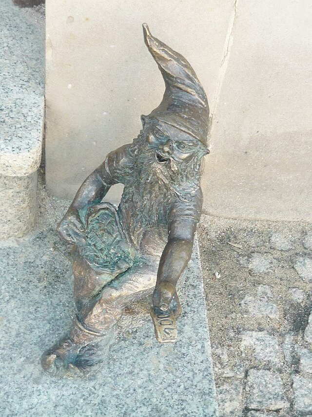{ loading=lazy }

Małe figurki krasnali kryją się we Wrocławiu. Ich odnalezienie to fajna gra miejska.

- Type: Concept
- Subjects: Community, Culture
- Year: 1700
- Country: Poland
- Topics: [Wroclaw Dwarves](../topics/index.md#wroclaw_dwarves)
- Image credit: CC0
- Quests: [Odkryj Warszawę (pl_01)](../quest/pl_01.pl.md), [Wielka akcja ratunkowa krasnala wrocławskiego (pl_02)](../quest/pl_02.pl.md)

---

### Polskie pierogi
{ loading=lazy }

Pierogi z nadzieniem ziemniaczanym, serowym lub owocowym. To słynne polskie danie.

- Type: Object
- Subjects: Food, Culture
- Year: 1600
- Country: Poland
- Topics: [Pierogi Recipe](../topics/index.md#pierogi)
- Image credit: CC0
- Quests: [Pierniki i targ spożywczy (pl_06)](../quest/pl_06.pl.md)

---

### Pomnik Chopina
{ loading=lazy }

Duży pomnik w warszawskich Łazienkach Królewskich poświęcony Fryderykowi Chopinowi. Latem odbywają się tam również popularne plenerowe koncerty fortepianowe. (Specjalne drzewo, pod którym siedzi, to typowa polska… wierzba)

- Type: Object
- Subjects: Music, Culture
- Country: Poland
- Topics: [Warsaw](../topics/index.md#warsaw)
- Image credit: CC0 | Ethan Doyle White, CC BY-SA 4.0 <https://creativecommons.org/licenses/by-sa/4.0>, via Wikimedia Commons | [source](https://commons.wikimedia.org/wiki/File:The_Chopin_Monument_in_Warsaw.jpg)
- Quests: [Odkryj Warszawę (pl_01)](../quest/pl_01.pl.md)

---

### Port
{ loading=lazy }

Miejsce, w którym statki załadowują się i rozładowują.

- Type: Place
- Subjects: Transportation, Community, Geography
- Country: Poland
- Topics: [Fisherman](../topics/index.md#fisherman)
- Image credit: CC_BY | Maxime Raynal from France | [source](https://commons.wikimedia.org/wiki/File:Port_and_lighthouse_overnight_storm_with_lightning_in_Port-la-Nouvelle.jpg)
- Quests: [Gdański naszyjnik bursztynowy (pl_05)](../quest/pl_05.pl.md)

---

### Ratusz
{ loading=lazy }

Miejsce, w którym pracują i spotykają się przywódcy miasta.

- Type: Concept
- Subjects: Civics, Community, History
- Country: Poland
- Image credit: CC_BY_SA | Krzysztof Golik | [source](https://commons.wikimedia.org/wiki/File:Town_hall_of_Aosta_(3).jpg)
- Quests: [Wielka akcja ratunkowa krasnala wrocławskiego (pl_02)](../quest/pl_02.pl.md)

---

### Ratusz w Toruniu
{ loading=lazy }

Duża gotycka budowla w Toruniu, położona tuż przy rynku.

- Type: Place
- Subjects: History, Geography, Culture
- Country: Poland
- Image credit: CC_BY_SA | Krzysztof Golik | [source](https://commons.wikimedia.org/wiki/File:Old_town_hall_in_Torun_(6).jpg)
- Quests: [Pierniki i targ spożywczy (pl_06)](../quest/pl_06.pl.md)

---

### Rtęć
{ loading=lazy }

Najbliższa Słońcu planeta, mała i bardzo szybka.

- Type: Object
- Subjects: Space, Science
- Country: Poland
- Topics: [Solar System](../topics/index.md#solar_system)
- Image credit: CC0 | NASA/Johns Hopkins University Applied Physics Laboratory/Carnegie Institution of Washington. Edited version of Image:Mercury in color - Prockter07.jpg by Papa Lima Whiskey. | [source](https://commons.wikimedia.org/wiki/File:Mercury_in_color_-_Prockter07_centered.jpg)
- Quests: [Kopernik i układ słoneczny (pl_07)](../quest/pl_07.pl.md)

---

### Rybak
{ loading=lazy }

Osoba łowiąca ryby w morzu.

- Type: Person
- Subjects: Community, Geography
- Country: Poland
- Topics: [Fisherman](../topics/index.md#fisherman)
- Image credit: CC_BY_SA | Benh LIEU SONG (Flickr) | [source](https://commons.wikimedia.org/wiki/File:Leg_Rowing_Fisherman_Inle_Lake_Myanmar.jpg)
- Quests: [Gdański naszyjnik bursztynowy (pl_05)](../quest/pl_05.pl.md)

---

### Rynek wrocławski
{ loading=lazy }

Główny plac Starego Miasta, pełen życia.

- Type: Place
- Subjects: Geography, Culture, Community, History
- Country: Poland
- Image credit: CC_BY_SA | Jacek Halicki | [source](https://commons.wikimedia.org/wiki/File:2016_Wrocław,_Rynek_49.jpg)
- Quests: [Wielka akcja ratunkowa krasnala wrocławskiego (pl_02)](../quest/pl_02.pl.md)

---

### Rzeka Motława
{ loading=lazy }

Rzeka przepływająca przez Gdańsk do morza.

- Type: Place
- Subjects: Geography
- Country: Poland
- Topics: [gdansk](../topics/index.md#gdansk)
- Image credit: CC_BY_SA | John Samuel | [source](https://commons.wikimedia.org/wiki/File:Boat_on_Motława_river_in_Gdańsk.jpg)
- Quests: [Gdański naszyjnik bursztynowy (pl_05)](../quest/pl_05.pl.md)

---

### Rzeka Odra
{ loading=lazy }

Duża rzeka w zachodniej Polsce. Umożliwia statkom podróżowanie i handel.

- Type: Place
- Subjects: Geography, Environment
- Country: Poland
- Topics: [Odra river](../topics/index.md#odra_river), [Wroclaw](../topics/index.md#wroclaw)
- Image credit: CC0
- Quests: [Rzeka Odra (pl_03)](../quest/pl_03.pl.md)

---

### Rzeźba Krasnala wrocławskiego
{ loading=lazy }

Niewielka figurka miejska; krasnale są symbolem Wrocławia.

- Type: Object
- Subjects: Culture, Community, History
- Country: Poland
- Topics: [Wroclaw Dwarves](../topics/index.md#wroclaw_dwarves)
- Image credit: CC_BY_SA | Pnapora | [source](https://commons.wikimedia.org/wiki/File:Trener_(Coach)_Wroclaw_dwarf_01.jpg)
- Quests: [Wielka akcja ratunkowa krasnala wrocławskiego (pl_02)](../quest/pl_02.pl.md)

---

### Saturn
{ loading=lazy }

Olbrzymia planeta z jasnymi pierścieniami i wieloma księżycami.

- Type: Object
- Subjects: Space, Science
- Country: Poland
- Topics: [Solar System](../topics/index.md#solar_system)
- Image credit: CC0 | NASA/JPL-Caltech/SSI/Cornell | [source](https://commons.wikimedia.org/wiki/File:Top_view_of_the_rings_of_Saturn_by_Cassini_-_October_10,_2013.jpg)
- Quests: [Kopernik i układ słoneczny (pl_07)](../quest/pl_07.pl.md)

---

### Sieć rybacka
{ loading=lazy }

Sieć służąca do połowu ryb.

- Type: Object
- Subjects: Technology, Community
- Country: Poland
- Topics: [Fisherman](../topics/index.md#fisherman)
- Image credit: CC0 | Jebulon | [source](https://commons.wikimedia.org/wiki/File:Fishing_net_Karystos_Euboea_Greece.jpg)
- Quests: [Gdański naszyjnik bursztynowy (pl_05)](../quest/pl_05.pl.md)

---

### Sky Tower Plaza
{ loading=lazy }

Nowoczesny plac, na którym ludzie spotykają się w pobliżu wieży.

- Type: Place
- Subjects: Geography, Community, Recreation
- Country: Poland
- Image credit: CC_BY_SA | JamesYoung8167 | [source](https://commons.wikimedia.org/wiki/File:Xiamen_Shimao_Straits_Tower_2016-02-09.jpg)
- Quests: [Wielka akcja ratunkowa krasnala wrocławskiego (pl_02)](../quest/pl_02.pl.md)

---

### Stary Ratusz (Wrocław)
{ loading=lazy }

Piękny gotycki budynek na głównym placu. Znajduje się w nim słynny zegar.

- Type: Place
- Subjects: Geography, Environment
- Country: Poland
- Image credit: CC0 | [source](https://upload.wikimedia.org/wikipedia/commons/7/70/Wroclaw-Rathaus.jpg)
- Quests: [Wielka akcja ratunkowa krasnala wrocławskiego (pl_02)](../quest/pl_02.pl.md)

---

### Statek
{ loading=lazy }

Duża łódź przewożąca ludzi lub towary.

- Type: Object
- Subjects: Transportation
- Country: Poland
- Topics: [Fisherman](../topics/index.md#fisherman)
- Image credit: CC_BY | Christian Ferrer | [source](https://commons.wikimedia.org/wiki/File:Rhapsody_(ship,_1996),_Sète_cf01.jpg)
- Quests: [Gdański naszyjnik bursztynowy (pl_05)](../quest/pl_05.pl.md)

---

### Syrena Warszawska
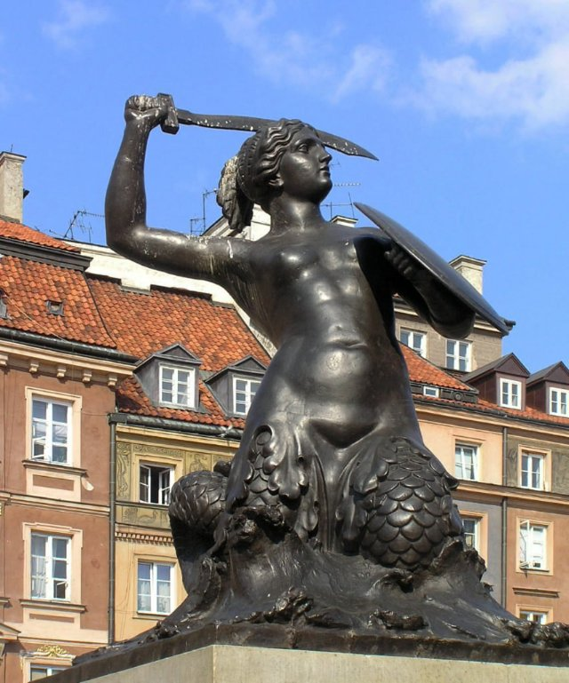{ loading=lazy }

Symbolem miasta jest odważna syrena z mieczem i tarczą. Jej posąg można zobaczyć nad rzeką.

- Type: Object
- Subjects: Culture, History
- Country: Poland
- Topics: [Warsaw](../topics/index.md#warsaw)
- Image credit: CC0 | Grzegorz Polak, CC BY-SA 2.0 <https://creativecommons.org/licenses/by-sa/2.0>, via Wikimedia Commons | [source](https://commons.wikimedia.org/wiki/File:Syrenka_Warszawska.jpg)
- Quests: [Odkryj Warszawę (pl_01)](../quest/pl_01.pl.md)

---

### Teleskop
{ loading=lazy }

Narzędzie pozwalające nam zobaczyć odległe obiekty na niebie.

- Type: Object
- Subjects: Science, Technology, Space
- Country: Poland
- Topics: [Telescope](../topics/index.md#telescope)
- Image credit: CC_BY_SA | Palonitor | [source](https://commons.wikimedia.org/wiki/File:Kométa_C-2020_F3_(NEOWISE).jpg)
- Quests: [Kopernik i układ słoneczny (pl_07)](../quest/pl_07.pl.md)

---

### Toruń
{ loading=lazy }

Miasto w Polsce, w którym urodził się Mikołaj Kopernik.

- Type: Place
- Subjects: Geography, History, Culture
- Country: Poland
- Image credit: CC_BY_SA | Jakub Hałun | [source](https://commons.wikimedia.org/wiki/File:Widok_zza_Wisły_na_Toruń,_20210908_1711_2822.jpg)
- Quests: [Kopernik i układ słoneczny (pl_07)](../quest/pl_07.pl.md)

---

### Układ Słoneczny
{ loading=lazy }

Słońce i osiem planet krążących wokół niego.

- Type: Concept
- Subjects: Space, Science
- Country: Poland
- Topics: [Solar System](../topics/index.md#solar_system)
- Image credit: CC0 | Originally uploaded from NASA by Bricktop; edited by Deuar, KFP, TotoBaggins, City303, JCPagc2015 | [source](https://commons.wikimedia.org/wiki/File:Moons_of_solar_system_v7.jpg)
- Quests: [Kopernik i układ słoneczny (pl_07)](../quest/pl_07.pl.md)

---

### Uran
{ loading=lazy }

Niebiesko-zielona planeta obracająca się na boku.

- Type: Object
- Subjects: Space, Science
- Country: Poland
- Topics: [Solar System](../topics/index.md#solar_system)
- Image credit: CC0 | NASA/JPL-Caltech | [source](https://commons.wikimedia.org/wiki/File:Uranus2.jpg)
- Quests: [Kopernik i układ słoneczny (pl_07)](../quest/pl_07.pl.md)

---

### Waluta Złoty
{ loading=lazy }

Walutą polską jest złoty. Monety i banknoty mają symbole polskie.

- Type: Concept
- Subjects: Money, Geography
- Country: Poland
- Topics: [Pierogi Recipe](../topics/index.md#pierogi)
- Image credit: CC0 | [source](https://commons.wikimedia.org/wiki/File:Bitllets_de_banc_polonesos_2024.jpg)
- Quests: [Pierniki i targ spożywczy (pl_06)](../quest/pl_06.pl.md)

---

### Wars i Sawa
{ loading=lazy }

Dwie legendarne postacie, które nadały Warszawie nazwę. Wars był dzielnym wojownikiem, a Sawa piękną syreną, która mieszkała w Wiśle.

- Type: Concept
- Subjects: Community, Culture
- Year: 1300
- Country: Poland
- Topics: [Warsaw](../topics/index.md#warsaw)
- Image credit: CC0 | [source](https://en.m.wikipedia.org/wiki/File:Rzeźba_Warsa_i_Sawy_01.jpg)
- Quests: [Odkryj Warszawę (pl_01)](../quest/pl_01.pl.md)

---

### Wenus
{ loading=lazy }

Bardzo gorąca planeta pokryta grubymi chmurami.

- Type: Object
- Subjects: Space, Science
- Country: Poland
- Topics: [Solar System](../topics/index.md#solar_system)
- Image credit: CC_BY | ESO/Y. Beletsky | [source](https://commons.wikimedia.org/wiki/File:Mercury,_Venus_and_the_Moon_Align.jpg)
- Quests: [Kopernik i układ słoneczny (pl_07)](../quest/pl_07.pl.md)

---

### Wisła
{ loading=lazy }

Najdłuższa rzeka Polski. Uchodzi do Morza Bałtyckiego.

- Type: Place
- Subjects: Geography, Environment
- Country: Poland
- Image credit: CC_BY_SA | Jakub Hałun | [source](https://commons.wikimedia.org/wiki/File:20200529_Widok_ze_Skały_Okrążek_na_Opactwo_w_Tyńcu_1735_2128.jpg)
- Quests: [Wielka akcja ratunkowa krasnala wrocławskiego (pl_02)](../quest/pl_02.pl.md)

---

### Wisła (Wisła)
{ loading=lazy }

Najdłuższa rzeka w Polsce nazywa się Wisła. Przepływa przez Kraków i Warszawę.

- Type: Place
- Subjects: Geography, Environment
- Country: Poland
- Topics: [Odra river](../topics/index.md#odra_river), [Wroclaw](../topics/index.md#wroclaw)
- Image credit: CC0
- Quests: [Rzeka Odra (pl_03)](../quest/pl_03.pl.md)

---

### Wrocław
{ loading=lazy }

Miasto w Polsce z rzekami, mostami i historią.

- Type: Place
- Subjects: Geography, History, Culture
- Country: Poland
- Topics: [Wroclaw Dwarves](../topics/index.md#wroclaw_dwarves), [Wroclaw](../topics/index.md#wroclaw)
- Image credit: CC_BY_SA | Pudelek (Marcin Szala) | [source](https://commons.wikimedia.org/wiki/File:Wrocław_Główny_(Breslau_Hauptbahnhof)_by_night.JPG)
- Quests: [Zoo (pl_04)](../quest/pl_04.pl.md)

---

### Wrocław: Katedra
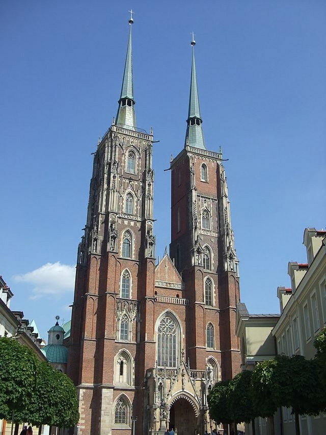{ loading=lazy }

Duży, ważny kościół, w którym ludzie się modlą. Można wspiąć się na wieżę, żeby zobaczyć widok.

- Type: Place
- Subjects: History, Culture
- Country: Poland
- Image credit: CC0 | [source](https://it.m.wikipedia.org/wiki/File:Wroclaw-Archicathedral-116.JPG)
- Quests: [Wielka akcja ratunkowa krasnala wrocławskiego (pl_02)](../quest/pl_02.pl.md)

---

### Wrocław: Sky Tower
{ loading=lazy }

Jeden z najwyższych budynków w Polsce. Znajdują się w nim sklepy i punkt widokowy.

- Type: Place
- Subjects: Geography, Community, Culture
- Country: Poland
- Image credit: CC0 | [source](https://it.wikipedia.org/wiki/File:Wrocław,_2006_-_2012_-_budowa_Sky_Tower_-_fotopolska.eu_(311325).jpg)
- Quests: [Wielka akcja ratunkowa krasnala wrocławskiego (pl_02)](../quest/pl_02.pl.md)

---

### Wrocławska Fontanna Multimedialna
{ loading=lazy }

Woda tańcząca w rytm muzyki i kolorowych świateł.

- Type: Place
- Subjects: Culture, Technology, Recreation
- Country: Poland
- Image credit: CC_BY_SA | Piotr Walczak & Konradr | [source](https://commons.wikimedia.org/wiki/File:Wrocławska_fontanna_Piotr_Walczak2.jpg)
- Quests: [Wielka akcja ratunkowa krasnala wrocławskiego (pl_02)](../quest/pl_02.pl.md)

---

### Wybieg dla zwierząt
{ loading=lazy }

Bezpieczna przestrzeń w zoo, w której mogą żyć zwierzęta.

- Type: Place
- Subjects: Animal, Safety
- Country: Poland
- Topics: [wroclaw zoo](../topics/index.md#wroclaw_zoo)
- Image credit: CC0 | Pearson Scott Foresman | [source](https://commons.wikimedia.org/wiki/File:Corral_(PSF).png)
- Quests: [Zoo (pl_04)](../quest/pl_04.pl.md)

---

### Wybrzeże Morza Bałtyckiego
{ loading=lazy }

Piaskowy brzeg Morza Bałtyckiego.

- Type: Place
- Subjects: Geography, Environment
- Country: Poland
- Topics: [gdansk](../topics/index.md#gdansk)
- Image credit: CC_BY_SA | Radomianin | [source](https://commons.wikimedia.org/wiki/File:Baltic_Sea_view_from_Schmiedeberg_hill_in_Rerik,_2025-06-23.jpg)
- Quests: [Gdański naszyjnik bursztynowy (pl_05)](../quest/pl_05.pl.md)

---

### Ziemia
{ loading=lazy }

Nasza planeta rodzinna z lądem, powietrzem i wodą.

- Type: Object
- Subjects: Space, Science, Geography, Environment
- Country: Poland
- Topics: [Solar System](../topics/index.md#solar_system)
- Image credit: CC0 | NASA/Apollo 17 crew; taken by either Harrison Schmitt or Ron Evans | [source](https://commons.wikimedia.org/wiki/File:The_Earth_seen_from_Apollo_17.jpg)
- Quests: [Kopernik i układ słoneczny (pl_07)](../quest/pl_07.pl.md)

---

### Łódź
{ loading=lazy }

Pojazd poruszający się po wodzie.

- Type: Object
- Subjects: Transportation
- Country: Poland
- Image credit: CC_BY_SA | Norbert Nagel | [source](https://commons.wikimedia.org/wiki/File:Rowing_boat_on_a_house_roof_-_Fira_-_Santorini_-_Greece_-_02.jpg)
- Quests: [Rzeka Odra (pl_03)](../quest/pl_03.pl.md)

---

### Żuraw Żuraw
{ loading=lazy }

Stary dźwig portowy i brama miejska nad rzeką.

- Type: Place
- Subjects: History, Technology, Geography
- Country: Poland
- Image credit: CC_BY_SA | Jacek Halicki | [source](https://commons.wikimedia.org/wiki/File:2024_Żuraw_wieżowy,_ul._Letnia_w_Kłodzku_(2).jpg)
- Quests: [Gdański naszyjnik bursztynowy (pl_05)](../quest/pl_05.pl.md)

