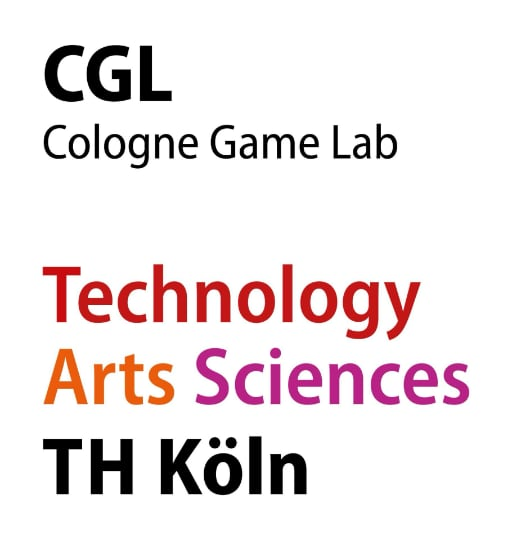
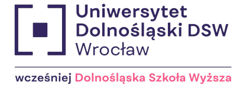
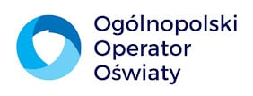
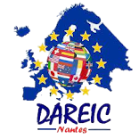

# Erasmus+ DE

## Über das projekt

**Projekttitel:** Interactive Learning Game for Refugee and Migrant Children's Inclusion and Integration  
**Projektakronym:** ANTURA  
**Program:** Erasmus+  
**Aktionsart:** KA220-SCH - Partnerschaften für die Zusammenarbeit in der Schulbildung  
**Dauer:** 1 December 2023 - 30 November 2026  
**Budget:** 400.000 €  
**Leitorganisation:**

- Technische Hochschule Köln, Deutschland
  
**Partnerorganisationen:**

- Videojuegos Sin Fronteras, Spain
- Dolnośląska Szkoła Wyższa, Poland
- Ogólnopolski Operator Oświaty, Poland
- Académie de Nantes Rectorat, France

### Projektziele

Das ANTURA-Projekt hat mehrere Hauptziele, die darauf abzielen, Flüchtlings- und Migrantenkinder zu unterstützen:

1. **Sprach- und Integrationsunterstützung**: Das Hauptziel ist es, den Kindern zu helfen, die Sprache ihres Gastlandes zu erlernen und gleichzeitig die kulturellen Nuancen zu verstehen und sich daran anzupassen.
2. **Bildungsunterstützung für Schulen und Lehrkräfte**: Durch das Angebot eines digitalen Bildungswerkzeugs und einer pädagogischen Methodik unterstützt das Projekt Lehrkräfte dabei, das Spiel effektiv in den Unterricht zu integrieren.
3. **Anpassungsfähigkeit des Spiels**: Das Spiel ist so konzipiert, dass es an verschiedene Länder und Kontexte anpassbar ist und so ein vielseitiges Werkzeug für unterschiedliche Bildungsumgebungen darstellt.
4. **Einblicke in digitale Werkzeuge:** Das Projekt zielt auch darauf ab, wertvolle Erkenntnisse darüber zu gewinnen, wie digitale Bildungswerkzeuge in Krisenzeiten, wie der ukrainischen Flüchtlingskrise, genutzt werden können.

### Projektaktivitäten

Das ANTURA-Projekt wird mehrere wichtige Aktivitäten durchführen, um seine Ziele zu erreichen:

- **Entwicklung des Mobile Games**: Es wird ein mobiles Spiel entwickelt, das auf unterhaltsame und ansprechende Weise Sprache und kulturellen Kontext vermittelt. Das Spiel wird frei verfügbar und Open Source sein, um eine breite Zugänglichkeit zu gewährleisten.
- **Pilotversuche**: Das Spiel wird sowohl in kleinen als auch in groß angelegten Tests in Frankreich und Polen erprobt. Diese Pilotprojekte helfen dabei, das Spiel vor der breiteren Veröffentlichung zu verfeinern.
- **Lehrerfortbildung und Toolkit-Entwicklung**: Ein umfassendes Toolkit wird entwickelt, um Lehrkräfte bei der Integration des Spiels in ihren Lehrplan zu unterstützen. Dies umfasst Schulungsmaterialien und Richtlinien.
- **Förderung und Skalierung**: Das Projekt wird das Spiel weitreichend bewerben und es für die Verbreitung in verschiedenen Ländern und Bildungskontexten vorbereiten.

### Zu erreichende Indikatoren im Projekt

- Schulung von mindestens 610 Lehrern in Polen (400) und Frankreich (210), die mit Migranten-/Flüchtlingskindern arbeiten, damit sie das ANTURA-Spiel in ihrer täglichen Arbeit nutzen können.
- Schulung von mindestens 40 Schulmediatoren in Frankreich, die mit Migranten-/Flüchtlingskindern arbeiten.
- Schulung von mindestens 150 Lehrern in Europa, die mit Migranten-/Flüchtlingskindern arbeiten, um das ANTURA-Spiel in ihrer täglichen Arbeit zu nutzen.
- Information von mindestens 500 Lehrern, Direktoren und anderem Schulpersonal über das ANTURA-Projekt und seine Ergebnisse durch verschiedene persönliche und Online-Promotionsaktivitäten.
- Mindestens 50 europäische Lehrer (und Mediatoren), die mit Grundschülern aus Migranten-/Flüchtlingsfamilien arbeiten, treten den ANTURA-Praktikergemeinschaften bei, die auf sozialen Medien und eTwinning gegründet werden. Es könnten mehrere Gruppen in verschiedenen Sprachen (Französisch, Polnisch, Englisch) gebildet werden, um die Kommunikation zwischen den Lehrern zu erleichtern.
- Mindestens 5 neue Multiplikatororganisationen (Schulen und andere Bildungseinrichtungen), die sich verpflichten, das Spiel an neue soziokulturelle Umgebungen anzupassen.
- Mindestens 5 neue Multiplikatororganisationen (öffentliche Bildungsbehörden), die sich verpflichten, ANTURA in ihre Ausbildungsprogramme für Lehrer zu integrieren.

### Erwartete Ergebnisse

Bis zum Ende des Projekts werden mehrere greifbare Ergebnisse erwartet:

- **Interaktives Mobile Game**: Ein mehrsprachiges, Open-Source-Spiel, das Sprachlernen und kulturelle Integration fördert.
- **Lehrertoolkit**: Ein Hilfsmittel für Lehrkräfte, um das Spiel effektiv in ihrer Unterrichtspraxis einzusetzen.
- **Wirkungsbewertungsbericht**: Eine Bewertung der Wirksamkeit des Spiels bei der Verbesserung der Sprachkenntnisse und des psychosozialen Wohlbefindens der Kinder.
- **Replikationshandbuch**: Ein Leitfaden zur Anpassung des Spiels an verschiedene Kontexte, der seine langfristige Nützlichkeit und Anpassungsfähigkeit sicherstellt.

### Langfristige Vorteile

Das ANTURA-Projekt ist darauf ausgelegt, einen nachhaltigen Einfluss auf das Leben von Flüchtlings- und Migrantenkindern zu haben, indem es ihre Integration in neue Gesellschaften verbessert. Die Open-Source-Natur des Spiels, kombiniert mit einem detaillierten Replikationshandbuch, sorgt dafür, dass dieses Werkzeug an verschiedene Bildungskontexte angepasst und in Krisenzeiten als wertvolle Ressource genutzt werden kann. Die gemeinsame Anstrengung der vielfältigen Partnerorganisationen wird sicherstellen, dass das Projekt erfolgreich entwickelt und umgesetzt wird, was letztlich zur Inklusion und Integration schutzbedürftiger Kinder in ganz Europa beiträgt.

Dieses Projekt zeigt, wie digitale Innovation genutzt werden kann, um einige der drängendsten Bildungsherausforderungen unserer Zeit zu bewältigen und denen Hoffnung und Unterstützung zu bieten, die sie am dringendsten benötigen.

---

## Consortium Overview

Das Projektkonsortium besteht aus vielfältigen Partnern aus ganz Europa, darunter Bildungseinrichtungen, Technologieanbieter, NGOs und Integrationsspezialisten. Jeder Partner bringt Fachwissen in den Bereichen Bildung, Technologie oder Sozialwissenschaften ein, um den Erfolg des Projekts zu gewährleisten. Hier ist ein genauerer Blick auf die wichtigsten Partner, die an dieser innovativen Bildungsinitiative beteiligt sind:

### Technische Hochschule Köln (TH Köln) - Germany

{width="150"}

Website: [www.th-koeln.de](http://www.th-koeln.de) 

Die TH Köln, Deutschlands größte Hochschule für Angewandte Wissenschaften, ist eine führende Institution mit etwa 26.000 Studierenden und 430 Professoren. Die Universität bietet über 90 Studiengänge in verschiedenen Disziplinen an, darunter Ingenieurwissenschaften, Sozialwissenschaften und Geisteswissenschaften. Ein bedeutender Beitrag zum Projekt kommt vom Cologne Game Lab (CGL), einer spezialisierten Einheit innerhalb der Fakultät für Kulturwissenschaften der TH Köln. Das CGL konzentriert sich auf Game Design und Entwicklung und betreibt interdisziplinäre Forschung in Bereichen wie Game Design, Game Art, Sound Design und Game Studies. Die Expertise der TH Köln in den Bereichen digitale Arbeit und nachhaltige Ressourcen bildet eine solide Grundlage für das ANTURA-Projekt.

Die TH Köln ist der Koordinator und Initiator des Projekts und verfügt über umfangreiche Erfahrung und akademische Kompetenz im Bereich Game Design und Evaluierung. Seit der Gründung im Jahr 2017 hat sie das Antura-Spiel gemeinsam mit VGWB mitgestaltet und weiterentwickelt, um es an bedeutende globale Ereignisse wie die syrische Flüchtlingskrise und den russischen Einmarsch in die Ukraine anzupassen.

### Videojuegos Sin Fronteras (VGWB) - Spain

Website: [vgwb.org](http://vgwb.org)

Videojuegos Sin Fronteras, auch bekannt als Video Games Without Borders, ist eine gemeinnützige Organisation, die 2015 gegründet wurde. Sie agiert als internationale Gemeinschaft mit über 300 Freiwilligen aus 30 Ländern, die sich der Entwicklung von Videospielen mit sozialem Einfluss widmet. VGWB arbeitet mit verschiedenen öffentlichen und privaten Einrichtungen zusammen, um Spiele zu entwickeln, die globale Herausforderungen thematisieren.

VGWB ist seit 2015 auf die Entwicklung von Videospielen mit sozialem Einfluss und digitaler Verbreitung spezialisiert. Sie managen alle Aspekte der Spielentwicklung, von der anfänglichen Konzeption bis zur Veröffentlichung auf digitalen Plattformen, wie sie es erfolgreich mit Antura getan haben. Ihr Team umfasst Spieleentwickler, Psychologen, Pädagogen und Übersetzer, um einen umfassenden und wirkungsvollen Ansatz sicherzustellen.

Besonders bemerkenswert ist, dass VGWB an der Entwicklung von "Antura and the Letters" beteiligt war, einem Bildungs-Spiel für Flüchtlingskinder, das wesentlich zur Unterstützung der Ziele des ANTURA-Projekts beigetragen hat.

### Dolnośląska Szkoła Wyższa (University of Lower Silesia) - Poland

Website: [www.dsw.edu.pl](http://www.dsw.edu.pl)  

Die Dolnośląska Szkoła Wyższa mit Sitz in Wrocław, Polen, ist eine Hochschule, die sich auf Sozialwissenschaften wie Pädagogik, Psychologie und Soziologie spezialisiert hat. Die Universität beherbergt das Centre of Games and Animation, eine Forschungseinheit, die sich auf digitales Game Design und Animation konzentriert. Dieses Zentrum spielt eine entscheidende Rolle im ANTURA-Projekt, insbesondere bei der Bewertung der pädagogischen Wirkung digitaler Spiele durch Feldforschung, um sicherzustellen, dass die Ergebnisse des Projekts wissenschaftlich validiert und wirksam sind.

### Ogólnopolski Operator Oświaty (NEO) - Poland

Website: [operator.edu.pl](http://operator.edu.pl)  

Ogólnopolski Operator Oświaty (Nationwide Education Operator), eine der größten Bildungsstiftungen Polens, wurde 2001 gegründet. NEO betreibt über 69 Bildungseinrichtungen, darunter Schulen und Kindergärten, und bietet mehr als 7.000 Kindern Betreuung und Bildung. Mit einem besonderen Fokus auf die Integration ukrainischer Flüchtlingskinder in das polnische Bildungssystem bringt NEO umfassende Erfahrung in Bildungsinnovationen und der Nutzung von IKT im Bildungsbereich mit. Ihre Rolle im ANTURA-Projekt ist entscheidend, um die praktische Anwendung und Skalierbarkeit des Spiels in realen Bildungssituationen sicherzustellen.  
Seit 2022 organisieren sie Vorbereitungsklassen für ukrainische Flüchtlingskinder, um ihnen den Einstieg in das polnische Bildungssystem zu erleichtern. NEO leitet auch die Grundschule Leonardo in Wrocław, die derzeit mehr als 100 ukrainische Flüchtlingskinder beherbergt.

### Académie de Nantes Rectorat - France

Website: [www.ac-nantes.fr](http://www.ac-nantes.fr)  

Das Académie de Nantes Rectorat ist für die Bildung von über 800.000 Grund- und Sekundarschülern in der Region Pays de la Loire verantwortlich und verwaltet ein großes Netzwerk von mehr als 68.000 Mitarbeitern. Durch seine Abteilung für europäische und internationale Beziehungen (DAREIC) fördert das Rectorat die Bildungszusammenarbeit in ganz Europa. Die Abteilung CASNAV innerhalb des Rectorats ist auf die Bildung neu angekommener allophoner Kinder spezialisiert und sorgt für deren erfolgreiche Integration in das französische Bildungssystem. Ihre Expertise im Umgang mit und der Integration vielfältiger Schülergruppen macht sie zu einem wichtigen Partner im ANTURA-Konsortium.

## Assoziierte Partner im ANTURA-Projekt

- **Die Französische Interministerielle Delegation für Unterkunft und Zugang zu Wohnraum (DIHAL):** DIHAL koordiniert die öffentlichen Politiken für Unterkunft und Wohnraum für obdachlose oder schlecht untergebrachte Personen. AN arbeitet eng mit DIHAL zusammen, das die Finanzierung von zwei Schulmediatoren übernommen hat, die die Bildung von Roma-Kindern vor Ort unterstützen.
- **Universität Angers:** Eine Forscherin der Universität Angers, spezialisiert auf die Didaktik des Französischen als Fremdsprache, Analyse von Klassenzimmerinteraktionen und Mehrsprachigkeit, wird USL bei der Bewertung der Wirksamkeit des Spiels in Frankreich unterstützen.
- **Die Polnische Stiftung Education for Future** betreibt ein Psychologisches und Pädagogisches Beratungszentrum, in dem ukrainische Flüchtlingskinder psychologische Beratung erhalten können.

Diese starke und vielfältige Partnerschaft stellt sicher, dass das ANTURA-Projekt gut gerüstet ist, um durch innovative digitale Lösungen einen bedeutenden Beitrag zur Integration und Bildung von Migranten- und Flüchtlingskindern zu leisten.

Jede dieser Organisationen bringt entscheidende Fähigkeiten und Kenntnisse in das ANTURA-Projekt ein und stellt sicher, dass es seine Mission, Flüchtlings- und Migrantenkindern mit innovativen Bildungstools zu helfen, erfolgreich erfüllen kann. Gemeinsam bilden sie ein starkes Konsortium, das sich der Schaffung eines nachhaltigen Einflusses auf die Bildung in ganz Europa verpflichtet hat.

---

Von der Europäischen Union finanziert. Die geäußerten Ansichten und Meinungen entsprechen jedoch ausschließlich denen des Autors bzw. der Autoren und spiegeln nicht zwingend die der Europäischen Union oder der Europäischen Exekutivagentur für Bildung und Kultur (EACEA) wider. Weder die Europäische Union noch die EACEA können dafür verantwortlich gemacht werden.
