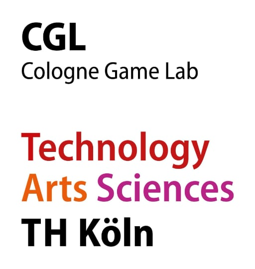
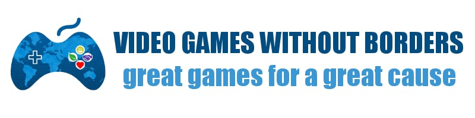
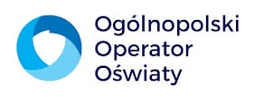
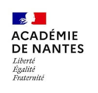
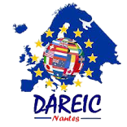
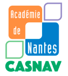

# Erasmus+

> [!note]
> more informations about Antura and Erasmus+ are here: [https://anturainschools.blogspot.com](https://anturainschools.blogspot.com)

## Project Overview

**Project Title:** Interactive Learning Game for Refugee and Migrant Children's Inclusion and Integration  
**Project Acronym:** ANTURA  
**Program:** Erasmus+  
**Action Type:** KA220-SCH - Cooperation Partnerships in School Education  
**Duration:** 1 December 2023 - 30 November 2026  
**Budget:** 400.000 €  
**Lead Organization:**

- Technische Hochschule Köln, Germany  

**Partner Organizations:**

- Videojuegos Sin Fronteras, Spain
- Dolnośląska Szkoła Wyższa, Poland
- Ogólnopolski Operator Oświaty, Poland
- Académie de Nantes Rectorat, France

### Project Objectives

The ANTURA project has set out several key objectives aimed at supporting refugee and migrant children:

1. **Language and Integration Support:** The primary goal is to help children learn the language of their host country while understanding and adapting to its cultural nuances.
2. **Educational Support for Schools and Teachers:** By offering a digital educational tool and a pedagogical methodology, the project supports educators in integrating the game into classroom activities effectively.
3. **Game Replicability:** The game is designed to be adaptable, allowing it to be used in various countries and contexts, making it a versatile tool for different educational settings.
4. **Insights into Digital Tools:** The project also seeks to provide valuable insights into how digital educational tools can be used during crises, such as the Ukrainian refugee crisis.

### Project Activities

The ANTURA project will undertake several key activities to achieve its objectives:

- **Development of the Mobile Game:** A mobile game will be created to teach language and cultural context in a fun and engaging way. The game will be freely available and open-source, ensuring wide accessibility.
- **Pilot Testing:** The game will be piloted in both small and large-scale trials in France and Poland. These pilots will help refine the game before its broader release.
- **Teacher Training and Toolkit Development:** A comprehensive toolkit will be developed to assist teachers in integrating the game into their curriculum. This will include training materials and guidelines.
- **Promotion and Scaling:** The project will promote the game widely, preparing it for distribution across different countries and educational contexts.

### Expected Results

By the end of the project, several tangible outcomes are expected:

- **Interactive Mobile Game:** A multilingual, open-source game that fosters language learning and cultural integration.
- **Teacher Toolkit:** A resource for educators to effectively use the game in their teaching practices.
- **Impact Evaluation Report:** An assessment of the game’s effectiveness in improving language skills and psychosocial well-being among the children.
- **Replicability Manual:** A guide to help adapt the game to various contexts, ensuring its long-term usefulness and adaptability.

### Long-Term Benefits

The ANTURA project is poised to make a lasting impact on the lives of refugee and migrant children by improving their integration into new societies. The open-source nature of the game, combined with a detailed replicability manual, ensures that this tool can be adapted and used across different educational settings, providing a valuable resource during crises. The collaborative efforts of the diverse partner organizations involved will ensure that the project is developed and implemented successfully, ultimately contributing to the inclusion and integration of vulnerable children across Europe.

This project exemplifies how digital innovation can be harnessed to address some of the most pressing educational challenges of our time, offering hope and support to those who need it most.

---

## Consortium Overview

The ANTURA project is supported by a diverse and experienced consortium of organizations from across Europe, each bringing unique expertise to the table. Here's a closer look at the key partners involved in this innovative educational initiative:

### Technische Hochschule Köln (TH Köln) - Germany

{width="150"}

Website: [www.th-koeln.de](http://www.th-koeln.de) 

TH Köln, Germany's largest university of applied sciences, is a leading institution with approximately 26,000 students and 430 professors. The university offers over 90 degree programs across various disciplines, including engineering, social sciences, and humanities. A significant contributor to the project is the Cologne Game Lab (CGL), a specialized unit within TH Köln's Faculty of Cultural Sciences. The CGL focuses on game design and development, conducting interdisciplinary research in areas such as Game Design, Game Art, Sound Design, and Game Studies. TH Köln’s expertise in digital work and sustainable resources provides a strong foundation for the ANTURA project.

### Videojuegos Sin Fronteras (VGWB) - Spain

Website: [vgwb.org](http://vgwb.org)

Videojuegos Sin Fronteras, also known as Video Games Without Borders, is a nonprofit organization founded in 2015. It operates as an international community of over 300 volunteers from 30 countries, dedicated to developing video games for social impact. VGWB collaborates with various public and private entities to create games that address global issues. Notably, VGWB was involved in developing "Antura and the Letters," an educational game for refugee children, which has been instrumental in supporting the ANTURA project’s goals.

### Dolnośląska Szkoła Wyższa (University of Lower Silesia) - Poland

Website: [www.dsw.edu.pl](http://www.dsw.edu.pl)  

Located in Wrocław, Poland, Dolnośląska Szkoła Wyższa is a higher education institution specializing in social sciences, including education, psychology, and sociology. The university houses the Centre of Games and Animation, a research unit focused on digital game design and animation. This center plays a crucial role in the ANTURA project, particularly in evaluating the educational impact of digital games through field research, ensuring that the project’s outcomes are scientifically validated and effective.

### Ogólnopolski Operator Oświaty (NEO) - Poland

Website: [operator.edu.pl](http://operator.edu.pl)  

Ogólnopolski Operator Oświaty, one of Poland’s largest educational foundations, was established in 2001. NEO operates over 63 educational centers, including schools and kindergartens, providing care and education to more than 7,000 children. With a focus on integrating Ukrainian refugee children into the Polish education system, NEO brings extensive experience in educational innovation and the use of ICT in education. Their role in the ANTURA project is pivotal in ensuring the practical application and scalability of the game in real-world educational settings.

### Académie de Nantes Rectorat - France

Website: [www.ac-nantes.fr](http://www.ac-nantes.fr)  

The Académie de Nantes Rectorat oversees the education of over 800,000 primary and secondary students in the Pays de la Loire region, managing a vast network of more than 68,000 staff members. Through its Department for European and International Relations (DAREIC), the Rectorat fosters educational cooperation across Europe. The CASNAV department within the Rectorat is specialized in the education of newly arrived allophone children, ensuring their successful integration into the French education system. Their expertise in managing and integrating diverse student populations makes them a key player in the ANTURA consortium.

## Associated Partners in ANTURA project

- **The French Interministerial Delegation for Accommodation and Access to Housing (DIHAL)**: DIHAL coordinates public policies for housing and accommodations for homeless or poorly housed individuals. AN collaborates closely with DIHAL, which has funded two school mediators who support the education of Roma children on the field.
- **University of Angers:** A researcher from the University of Angers, specializing in French as a foreign language didactics, classroom interaction analysis, and multilingualism, will support USL in evaluating the game's effectiveness in France.
- **The Polish Foundation Education for Future** runs a Psychological and Pedagogical Counselling Center where Ukrainian refugee children can get psychological counselling.

This strong and diverse partnership ensures that the ANTURA project is well-equipped to make a meaningful impact on the integration and education of migrant and refugee children through innovative digital solutions.

Each of these organizations brings critical skills and knowledge to the ANTURA project, ensuring that it is well-equipped to achieve its mission of supporting refugee and migrant children through innovative educational tools. Together, they are creating a powerful consortium committed to making a lasting impact on education across Europe.

---

Funded by the European Union. However, the views and opinions expressed are solely those of the author(s) and do not necessarily reflect those of the European Union or the European Education and Culture Executive Agency (EACEA). Neither the European Union nor the EACEA can be held responsible for them
