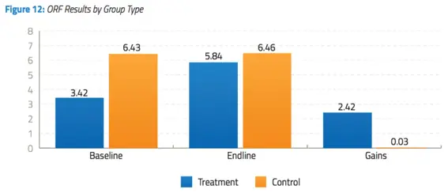
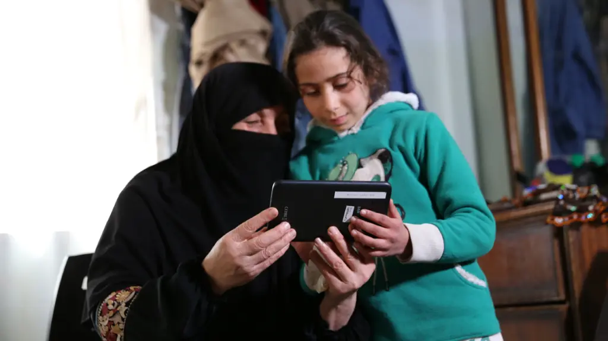
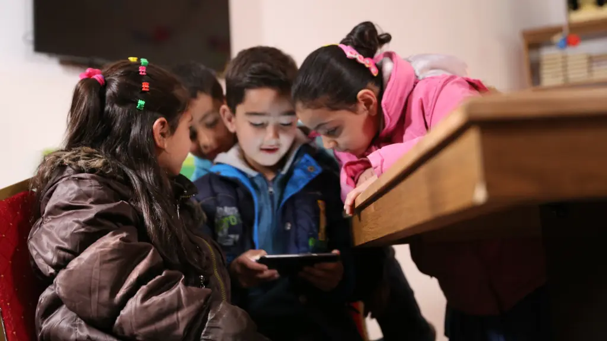

# Impact evaluation

## An impact evaluation in Jordan organised by All Children Reading

An independent analysis was conducted on the Beta-Version of the game by Integrated International in collaboration with the Create Lab at New York University. Their 👉🏼 [detailed report](https://allchildrenreading.org/wp-content/uploads/2019/07/Antura-Report-Final-Web.pdf) showed definite evidence of improved learning among children and also mentioned how the game could be improved. Based on these findings, the latest version of Antura and the Letters focuses on an easy introduction to patterns and letter sounds and reiterates the learning process throughout the entire alphabet.

## Methodology

Sample:

- Syrian nationality
- Little or no schooling
- 600 children, ages 5 to 10
- Gender balance
- Living in Azraq camp in Jordan
- 7 weeks daily play

Main tools:

- Strength and Difficulties Questionnaire
- Early Grade Reading Assessment (EGRA)

## Results

Literacy improvements between Baseline and Endline in a group treated with Antura and the Letters vs a control group:

Psychosocial wellbeing findings based on questionnaires and interviews:

## Experts noted

“_Overall, the game effectively introduces children to the basics of Arabic literacy and has resulted in **positive learning outcomes across all age groups and genders** with a relatively low dosage of 27 hours. Absolute **gains tended to concentrate in foundational Early Grade Reading Assessment (EGRA) subtasks** (letter, syllable, and oral reading fluency \[ORF\]), gaining an additional two to three letters/syllables/words on average. **Zero scores also decreased** across all subtasks._” \[Page 3, Key Findings:Literacy , Lines 1-5\]

_“At a psychosocial level, the game appears to have **supported the development of positive social outcomes,** as demonstrated by both an assessment employing the results of the Strengths and Difficulties Questionnaire (SDQ) and parental feedback. The sense of accomplishment and learning seems to have contributed to **children feeling happy.** The game enabled them to also feel a **sense of ownership and attachment** either through child profiles or through the customization of Antura. **Peer interaction increased** during game play, which had a positive **impact on emotional states and social behaviors,** while gaming engendered **high levels of motivation to attend summer camp**. This had implications for **motivations to learn**.“_ \[Page 4, Key Findings: Engagement and Psychosocial Outcomes, Lines 20-27\]

## Parents thought

“_The game affected my son’s abilities to study; he doesn’t get bored while studying.” Another parent added that her daughter, who was previously not interested in learning, “became more attentive to class and wanted to learn._” \[Page 72, Lines 15-17\]

“_“I am illiterate. When my children told me about the game, I downloaded it and started learning it”. She indicated she can now identify_ _letters, letter sounds, and read words, which has enabled her to read signs and has raised her self-esteem._” \[Page 27, Box Quote. Page 30, Educational Status of Parents, Lines 5-7\]

## Children felt

“_Children reported feeling happy when they would win or progress through_ _different stages of the game. One child reported: “When the game tells me ‘good job,’ that makes me happy.”_” \[Page 69, Lines 3-4\]

“_One child reported, “When I play the game, I feel like I am sitting at home, playing on the phone.”_” \[Page 69, Lines 24-25\]

“_One other positive outcome reported by children was their sense of ownership of the game. Children stated they had created profiles that represented themselves. They also reported enjoying the ability to customize Antura the dog, with one child noting, “I put a hat on mine, and I changed his colors.””_ \[Page 70, Lines 17-19\]

Download the full evaluation report [here](https://allchildrenreading.org/wp-content/uploads/2019/07/Antura-Report-Final-Web.pdf).
