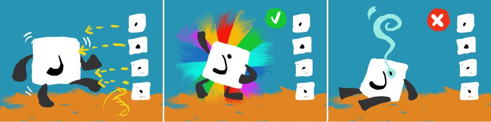

# MiniGame: Dancing Dots

## Testing procedure

Total tests: 1
- Variations: 1
- Difficulty Levels: ininfluent

#### Shared Difficulty
- Level 1: Dots only with hint
- Level 2: Diacritic only with hint
- Level 3: Dots only with no hint
- Level 4: Diacritic only with no hint
- Level 5: Dot and Diacritic with hint
- Level 6: Doat and Diacritic with no hint

### Shortcuts
_none_

## Variations

### 1. Dancing Dots
Player must add the correct dots.

#### Scoring
- 3 stars if...
- 2 stars if...
- 1 star if...
---
## Developer notes

## Issues

## Warnings to be fixed

## Optimization

## Open Questions
two new custom Fonts Atlas are used: `EA4S_Arabic Dotless DancingDots SDF` and `EA4S_Arabic DotsOnly DancingDots SDF`. are they really needed? can't they be integrated into the main arabic atlas?
how to correctly generate them?

---

## Game Design Docs

### Objectives

**Pedagogical**: Teach accent and dot positions related to letter and sounds.
**Play**: Make the LL dance faster and faster until she reaches "king of the dance floor" status.

### Mechanics

**Attempt-based:** the player has no time-limit.

- First levels: we show where the dot should go, the player has to position the dot there and keep it for a while as the LL dances. In this phase it's almost a rhythm game.
- Advanced levels: we don't show where the dot should go, but the player can just drag and drop a dot/diacritic sign without having to hold it (still a rhythm game, but with a different approach).
- When the dot is placed wrongly, it's marked as wrong in the UI.

### Antura

Sometimes Antura's face appears (from left side of screen), sniffs the LL, then barks and exits. After the bark, the LL is scared (moves at double speed) for N seconds.

### Feedback

- When the dot is held, a blob of light around the LL grows in expectation of the result
- When the dot position is assigned:

  - If it was wrong, it becomes a splat of color, and the LL slows up dancing as if she's getting tired. The splat(s) will stay even after a successful dot is positioned, so we should think of a way to have them overlay nicely without confusing the letter's clarity.
  - If it was right, it emits a (cool) ray of light. The LL makes a pirouette and reappears with a new letter on which to place the dot/diacritic. The LL has now more energy and dances faster/better/nicer.

### Difficulty variations

#### Gameplay
The dancing moves will become more complex and faster.

#### Pedagogical
**Visual aid**: means that the dot/diacritic will appear in the right position at startup and then disappear with a PUFF.

- Dots alone with visual aid
- Diacritics alone with visual aid
- Dots and diacritics with visual aid
- Dots alone without visual aid
- Diacritics alone without visual aid
- Dots and diacritics without visual aid

### Endgame

The game will end under one of these conditions:

- Too many wrong signs places
- The required amount of signs were correctly placed

### Success

The LL is lifted a little in the air, the VICTORYRAYS appear behind her, and she strikes a "king of the dance floor" pose (would be nice if we could have 4/5 poses to use randomly for each successful endgame).

### Failure

Condition: 3(?) dots placed wrongly.

The LL sits on the ground, leaning back on her arms, tired (but not sad). The dot/diacritic will appear (with a ray of light or some other effect evidencing it) to show where it should've gone.
