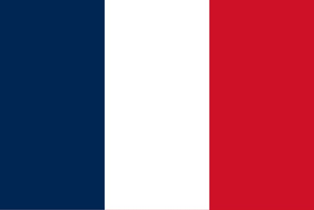

# The neighbors of France (fr_00)
> [!note] Educators & Designers: help improving this quest!
> **Comments and feedback**: [discuss in the Forum](https://antura.discourse.group/t/fr-00-the-neighbors-of-france/22)  
> **Improve script translations**: [comment the Google Sheet](https://docs.google.com/spreadsheets/d/1FPFOy8CHor5ArSg57xMuPAG7WM27-ecDOiU-OmtHgjw/edit?gid=1044148815#gid=1044148815)  
> **Improve Cards translations**: [comment the Google Sheet](https://docs.google.com/spreadsheets/d/1M3uOeqkbE4uyDs5us5vO-nAFT8Aq0LGBxjjT_CSScWw/edit?gid=415931977#gid=415931977)  
> **Improve the script**: [propose an edit here](https://github.com/vgwb/Antura/blob/main/Assets/_discover/_quests/FR_00%20Geo%20France/FR_00%20Geo%20France%20-%20Yarn%20Script.yarn)  

- Version: 1.00
- Status: Production
- Location: France - France

- Difficulty: Easy
- Duration (min): 15
- Description: Let's know the neighbours of France

## Design Notes

**Core Subject:** Geography, Flags, and European Countries.

**Player Objectives:**

1. **Flag Hunt:** The player meets a French child who explains that Antura has mixed up all the flags of the neighboring countries.
2. **Country Tour:** The player must help friends from **France, Germany, Italy, Belgium, Spain, Luxembourg, and Switzerland** find their missing flags.
3. **Visual Recognition:** The player must identify flags based on descriptions (e.g., "Red with a white cross" for Switzerland, "Green, white, and red" for Italy).
4. **Chain Reaction:** Finding one flag unlocks the next country's request (e.g., helping Germany leads to Italy).
5. **Completion:** Once all 7 flags are returned, the player completes the map of this part of Europe.

**Educational Content:**

- **Geography:** Introduces the concept of **Europe** and the relative locations of France and its neighbors.
- **Flags:** Teaches the colors and patterns of 7 European flags.
- **Capitals:** Mentions capital cities like **Paris, Berlin, Rome, Brussels, Madrid, Luxembourg City, and Bern**.
- **Cultural Facts:** Includes small facts (e.g., Italy looks like a boot, Germany has castles, Spain has flamenco).

## Topics
### France country {#france-country}
[Open topic page](../../topics/index.md#france-country)  

- Importance: Critical  
- Country: France  
- Target age: Ages6to10

#### Core Card - France
A country in Europe. Capital is Paris.

{ width="200" }
- Type: Place
- Subjects: Geography, Culture

#### Connection (CulturalContext): national symbol - Flag of France
The flag of France has three vertical stripes: blue, white, and red. These colors represent liberty, equality, and fraternity!

{ width="200" }
- Rationale: The French flag is essential for teaching French national identity and values
- Type: Concept
- Subjects: Geography, Culture
- Year: 1794

#### Connection (RelatedTo): country capital - Paris
The capital city of France. Paris has a famous tall tower called the Eiffel Tower!

{ width="200" }
- Type: Place
- Subjects: Geography, Culture

### Countries around France {#france_countries_around}
[Open topic page](../../topics/index.md#france_countries_around)  

- Importance: Medium  
- Country: France  
- Target age: Ages6to10

#### Core Card - France
A country in Europe. Capital is Paris.

{ width="200" }
- Type: Place
- Subjects: Geography, Culture

#### Connection (RelatedTo): neighboring country - Spain
A country in Europe. Capital is Madrid. Spain invented flamenco dancing.

{ width="200" }
- Type: Place
- Subjects: Geography, Culture

#### Connection (CulturalContext): national symbol - Flag of Spain
The flag of Spain has red and yellow horizontal stripes. The colors are like the sun and peppers! Spain invented flamenco dancing.

{ width="200" }
- Rationale: The Spanish flag helps kids learn about France's southern neighbor and its vibrant culture
- Type: Concept
- Subjects: Geography, Culture
- Year: 1981

#### Connection (RelatedTo): neighboring country - Luxembourg
A country in Europe. Capital is Luxembourg City.

{ width="200" }
- Type: Place
- Subjects: Geography, Culture

#### Connection (RelatedTo): neighboring country - Italy
A country in Europe. Capital is Rome.

{ width="200" }
- Type: Place
- Subjects: Geography, Culture

#### Connection (CulturalContext): national symbol - Flag of Italy
The flag of Italy has three vertical stripes: green, white, and red. The colors look like basil, mozzarella, and tomatoes on pizza!

{ width="200" }
- Rationale: The Italian flag connection to pizza helps kids remember the colors easily
- Type: Concept
- Subjects: Geography, Culture
- Year: 1946

#### Connection (CulturalContext): national symbol - Flag of Luxembourg
The flag of Luxembourg has red, white, and light blue horizontal stripes. Luxembourg is a very small country that speaks three languages!

{ width="200" }
- Rationale: Small multilingual countries teach kids about European diversity
- Type: Concept
- Subjects: Geography, Culture
- Year: 1972

#### Connection (RelatedTo): neighboring country - Luxembourg City
The capital city of Luxembourg.

{ width="200" }
- Type: Place
- Subjects: Geography, Culture

#### Connection (RelatedTo): neighboring country - Belgium
A country in Europe. Capital is Brussels.

{ width="200" }
- Type: Place
- Subjects: Geography, Culture

#### Connection (CulturalContext): national symbol - Flag of Belgium
The flag of Belgium has three vertical stripes: black, yellow, and red. Belgium is famous for chocolate and waffles!

{ width="200" }
- Rationale: Belgium's unique vertical stripes help kids distinguish different flag patterns
- Type: Concept
- Subjects: Geography, Culture
- Year: 1831

#### Connection (RelatedTo): neighboring country - Switzerland
A country in Europe. Capital is Bern. Switzerland is famous for mountains and cheese.

{ width="200" }
- Type: Place
- Subjects: Geography, Culture

#### Connection (CulturalContext): national symbol - Flag of Switzerland
The flag of Switzerland is red with a white cross in the middle. It looks like a first aid kit! Switzerland is famous for mountains and cheese.

{ width="200" }
- Rationale: The Swiss flag's unique cross design helps kids remember this mountain country
- Type: Concept
- Subjects: Geography, Culture
- Year: 1889

#### Connection (RelatedTo): neighboring country - Bern
The capital city of Switzerland.

{ width="200" }
- Type: Place
- Subjects: Geography, Culture

#### Connection (RelatedTo): neighboring country - Germany
A country in Europe. Capital is Berlin.

{ width="200" }
- Type: Place
- Subjects: Geography, Culture

#### Connection (CulturalContext): national symbol - Flag of Germany
The flag of Germany has three horizontal stripes: black, red, and yellow. Germany is famous for cars, castles, and fairy tales!

{ width="200" }
- Rationale: The German flag helps kids learn about France's important neighbor country
- Type: Concept
- Subjects: Geography, Culture
- Year: 1949

#### Connection (RelatedTo): neighboring country - Berlin
The capital city of Germany.

{ width="200" }
- Type: Place
- Subjects: Geography, Culture

#### Connection (RelatedTo): neighboring country - Rome
The capital city of Italy.

{ width="200" }
- Type: Place
- Subjects: Geography, Culture

#### Connection (RelatedTo): neighboring country - Brussels
The capital city of Belgium.

{ width="200" }
- Type: Place
- Subjects: Geography, Culture

#### Connection (RelatedTo): neighboring country - Madrid
The capital city of Spain.

{ width="200" }
- Type: Place
- Subjects: Geography, Culture

#### Connection (RelatedTo): neighboring country - Flag of Andorra
The flag of Andorra has blue, yellow, and red stripes with a coat of arms in the middle. Andorra is a tiny country between France and Spain.

{ width="200" }
- Rationale: Learning about small countries helps kids understand European diversity
- Type: Concept
- Subjects: Geography, Culture
- Year: 1866

#### Connection (RelatedTo): neighboring country - Flag of Monaco
The flag of Monaco has red and white horizontal stripes. Monaco is tiny but famous for fancy cars and royal palaces by the sea!

{ width="200" }
- Rationale: Monaco shows kids how small places can be special and important
- Type: Concept
- Subjects: Geography, Culture
- Year: 1881

## Additional Cards
#### Europe Map
A map showing all the countries in Europe. You can see where France, Poland, Germany, and other countries are located.

{ width="200" }
- Rationale: Maps help kids understand where different countries are and how they connect
- Type: Concept
- Subjects: Geography, Education
- Year: 2000

## Quest Script

[See the full script here](./fr_00-script.md)

## Words
## Activities
- (none)

## Tasks
- [Collect] FIND_FRENCH_FLAG
- [Collect] FIND_GERMAN_FLAG
- [Collect] FIND_SPANISH_FLAG
- [Collect] FIND_ITALIAN_FLAG
- [Collect] FIND_BELGIUM_FLAG
- [Collect] FIND_LUX_FLAG
- [Collect] FIND_SWISS_FLAG
- [Interact] talk_npc_german
- [Interact] talk_npc_spain
- [Interact] talk_npc_italy
- [Interact] talk_npc_belgium
- [Interact] talk_npc_luxembourg
- [Interact] talk_npc_swiss
- [Interact] talk_npc_french_final
## Credits
- Anne (France) (content)
- Lucie Paillat (France) (content)
- [Stefano Cecere](https://stefanocecere.com) (Italy) (content, design, development)
- Vieri Toti (Italy) (content, design)
