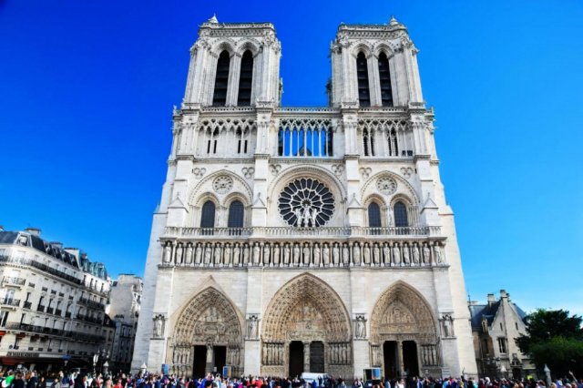
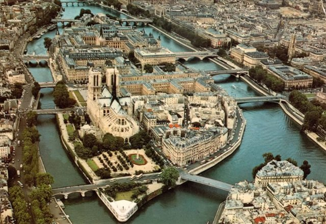

# Paris! (fr_01)
> [!note] Educators & Designers: help improving this quest!
> **Comments and feedback**: [discuss in the Forum](https://antura.discourse.group/t/fr-01-paris/23/1)  
> **Improve script translations**: [comment the Google Sheet](https://docs.google.com/spreadsheets/d/1FPFOy8CHor5ArSg57xMuPAG7WM27-ecDOiU-OmtHgjw/edit?gid=755037318#gid=755037318)  
> **Improve Cards translations**: [comment the Google Sheet](https://docs.google.com/spreadsheets/d/1M3uOeqkbE4uyDs5us5vO-nAFT8Aq0LGBxjjT_CSScWw/edit?gid=415931977#gid=415931977)  
> **Improve the script**: [propose an edit here](https://github.com/vgwb/Antura/blob/main/Assets/_discover/_quests/FR_01%20Paris/FR_01%20Paris%20-%20Yarn%20Script.yarn)  

- Version: 1.00
- Status: Production
- Location: France - Paris

- Difficulty: Normal
- Duration (min): 20
- Kind:
  - Parkour
  - Seek
  - Orientation
- Description: travel around paris searching for Antura!

## Design Notes
## Game Design Notes

Explore Paris tour through iconic landmarks.

Location:
Paris, France

1. Learn about Eiffel Tower construction
2. Bakery and French baguette making with ingredient collection
3. visit Notre-Dame architecture

### Flow

Guide welcomes

**Part 1: La Tour Eiffel and Gustave Eiffel**
Mission: Climb the Eiffel Tower with the elevator.

Collect 5 coins to buy ticket

**Part 2: Notre Dame de Paris**
Mission: find the 3 pieces of the map

**Part 3: La Baguette**
Mission: Learn the art of making the perfect baguette and discover its cultural significance in French society.

## Topics
### Eiffel Tower {#eiffel-tower}
[Open topic page](../../topics/index.md#eiffel-tower)  

What we need to know about the iconic Paris landmark

- Importance: Critical  
- Country: France  
- Target age: Ages3to5  
- Subjects: History

#### Core Card - Eiffel Tower
A tall tower and a symbol of Paris. It's made of iron and is 300 meters talll. You can go up and see the whole city.

{ width="200" }
- Type: Place
- Subjects: Geography, History, Culture
- Year: 1889

#### Connection (LocatedIn) - Paris
The capital city of France. Paris has a famous tall tower called the Eiffel Tower!

{ width="200" }
- Type: Place
- Subjects: Geography, Culture

#### Connection (CreatedBy): Gustave Eiffel designed and built the tower - Gustave Eiffel
The man who built the Eiffel Tower! He was an engineer who loved building with iron and created the most famous tower in the world.

{ width="200" }
- Type: Person
- Subjects: History, Culture, Science
- Year: 1832

#### Connection (MadeOf) - Iron
A hot tool used to make wrinkled clothes smooth and flat. Be careful, irons are very hot!

{ width="200" }
- Type: Object
- Subjects: Science

#### Connection (RelatedTo) - Eiffel Tower map
A map that shows where the famous tall tower in Paris is located.

{ width="200" }
- Type: Object
- Subjects: Community, Culture

#### Connection (RelatedTo) - Eiffel Tower ticket
A special paper that lets you visit the famous tall tower in Paris, France.

{ width="200" }
- Type: Object
- Subjects: Science

### Notre Dame {#notredame}
[Open topic page](../../topics/index.md#notredame)  

- Importance: High  
- Country: France  
- Target age: Ages6to10  
- Subjects: Culture

#### Core Card - Notre-Dame de Paris
A beautiful cathedral in Paris. Its colorful glass windows tell stories.

{ width="200" }
- Type: Place
- Subjects: Geography, Environment
- Year: 1885

#### Connection (LocatedIn) - Paris
The capital city of France. Paris has a famous tall tower called the Eiffel Tower!

{ width="200" }
- Type: Place
- Subjects: Geography, Culture

#### Connection (TimeContext): notable event - Notre-Dame Fire
In 2019, a big fire damaged the beautiful Notre-Dame Cathedral in Paris. Many people worked together to save this important building.

{ width="200" }
- Rationale: This event teaches kids about protecting cultural heritage and community cooperation
- Type: Concept
- Subjects: History, Culture, Environment
- Year: 2019

#### Connection (LocatedIn) - Ile-de-France
A region in France where the capital city Paris is located. Many people live here!

{ width="200" }
- Type: Place
- Subjects: Geography, Environment

### Baguette {#baguette}
[Open topic page](../../topics/index.md#baguette)  

the french bread famous all around the world!

- Importance: Medium  
- Country: France  
- Target age: Ages3to5  
- Subjects: Food

#### Core Card - French Baguette
A long, crispy bread that is the most famous food in France. French people buy fresh baguettes every day from the bakery!

{ width="200" }
- Rationale: Baguettes are iconic French culture that kids can easily understand and remember
- Type: Object
- Subjects: Food, Culture
- Year: 1700

#### Connection (LocatedIn) - Paris
The capital city of France. Paris has a famous tall tower called the Eiffel Tower!

{ width="200" }
- Type: Place
- Subjects: Geography, Culture

#### Connection (CreatedBy) - Baker
A person who makes bread, cakes, and pastries.

{ width="200" }
- Type: Person
- Subjects: History, Culture

#### Connection (MadeOf) - Salt
White crystals that make food taste better. 

{ width="200" }
- Type: Object
- Subjects: Food, Culture

#### Connection (MadeOf) - Yeast
Yeast is like magic powder that makes bread soft and tasty!

{ width="200" }
- Type: Object
- Subjects: Food, Culture

#### Connection (MadeOf) - Flour
White powder made from wheat that is used to make bread.

{ width="200" }
- Type: Object
- Subjects: Food, Science

#### Connection (MadeOf) - Water
Water is essential for all life

{ width="200" }
- Type: Object
- Subjects: Food, Culture

## Additional Cards
#### Louvre
A huge museum full of art. It’s where the Mona Lisa lives.

{ width="200" }
- Type: Place
- Subjects: Art, Culture, History
- Year: 1793

#### Cathedral
A very large and important church in a city.

{ width="200" }
- Type: Place
- Subjects: Culture, History, Education

#### Church
A special building where people meet to pray and sing.

{ width="200" }
- Type: Place
- Subjects: Culture, Civics, Education

#### Eiffel Tower Elevators
Lifts that take visitors up the iron tower.

{ width="200" }
- Type: Object
- Subjects: Technology, Transportation

#### Flying Buttress
Stone arms outside that help hold up tall walls.

{ width="200" }
- Type: Concept
- Subjects: Technology, History, Art

#### Gargoyle
A funny or scary statue that also works as a rain spout.

{ width="200" }
- Type: Concept
- Subjects: Art, Technology, History

#### Rose Window
A big round stained-glass window that tells stories with light.

{ width="200" }
- Type: Concept
- Subjects: Art, Culture, History

#### World’s Fair (1889)
The big world expo when the Eiffel Tower was shown.

{ width="200" }
- Type: Concept
- Subjects: History, Culture

#### Arc De Triomphe
A grand arch in Paris, built to honor heroes. You can see it shining at the end of a long avenue!

{ width="200" }
- Type: Place

#### Louvre
A huge museum full of art. It’s where the Mona Lisa lives.

{ width="200" }
- Type: Place
- Subjects: Art, Culture, History
- Year: 1793

## Quest Script

[See the full script here](./fr_01-script.md)

## Words
## Activities
- [JigsawPuzzle](../../activities/index.md#JigsawPuzzle)
- [Memory](../../activities/index.md#Memory)
- [MoneyCount](../../activities/index.md#MoneyCount)
- [Memory](../../activities/index.md#Memory)
- [CleanCanvas](../../activities/index.md#CleanCanvas)
- [JigsawPuzzle](../../activities/index.md#JigsawPuzzle)
- [Match](../../activities/index.md#Match)

## Tasks
- [Interact] go_eiffell
- [Collect] collect_coins
- [Interact] go_notredame
- [Interact] go_arc
- [Interact] go_louvre
- [Interact] go_baker
## Credits
- Anne (France) (content)
- Fabio Cecere (Italy) (design)
- Lucie Paillat (France) (content)
- [Stefano Cecere](https://stefanocecere.com) (Italy) (design, development)
