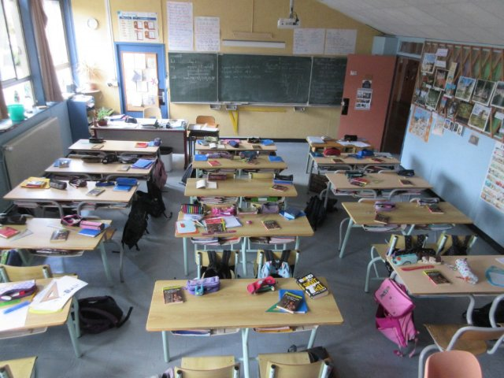

# The School system (fr_02)
> [!note] Educators & Designers: help improving this quest!
> **Comments and feedback**: [discuss in the Forum](https://antura.discourse.group/t/fr-02-the-school-system/24/1)  
> **Improve script translations**: [comment the Google Sheet](https://docs.google.com/spreadsheets/d/1FPFOy8CHor5ArSg57xMuPAG7WM27-ecDOiU-OmtHgjw/edit?gid=1873232287#gid=1873232287)  
> **Improve Cards translations**: [comment the Google Sheet](https://docs.google.com/spreadsheets/d/1M3uOeqkbE4uyDs5us5vO-nAFT8Aq0LGBxjjT_CSScWw/edit?gid=415931977#gid=415931977)  
> **Improve the script**: [propose an edit here](https://github.com/vgwb/Antura/blob/main/Assets/_discover/_quests/FR_02%20Angers%20School/FR_02%20Angers%20School%20-%20Yarn%20Script.yarn)  

- Version: 1.00
- Status: NeedsReview
- Location: France - Angers

- Difficulty: Normal
- Duration (min): 20
## Design Notes
## Game Design Notes

The cat goes to different places until he finds his school. Then he visits the school and finds his class.

### Content
School system : the cats goes a lycée (16-18 ans), to a collège (11-15 ans), to a école maternelle (3-5 ans) and finally goes to an école primaire (6-10 ans), that corresponds to his age, called Jules Verne

A typical day at school

- Morning childcare = garderie du matin
- arrival at the school gate = le portail
- work in class with different subjects/matières : maths, reading & writing
- morning playtime (récréation) on the playground (la cour) 
- lunch at the canteen (la cantine) or at home (à la maison)
- school work with different subjects/matières : PE = EPS (éducation physique et - sportive),  hist/geog = histoire/géographie,  science = sciences, arts= art
- evening childcare = garderie du soir / homework support = aide aux devoirs

School levels with level names and age (CP–6 ans / CE1-7 ans / CE2-8 ans /CM1-9 ans / CM2–10 ans).

### Knowledge content
The French School System: Kids learn the names, age groups, and order of the main schools:

- École Maternelle (3-5 years old)
- École Primaire (6-10 years old) - 5 years total.
- Collège (11-15 years old)
- Lycée (16-18 years old)

**The Baccalauréat**: Kids learn that the Lycée prepares you for a final diploma called le Baccalauréat, which is needed for university.

**Classroom Life**: Kids learn that French students learn to write in cursive, have playtime (la récréation) in the morning and afternoon, and study things like geometry.

**Cultural Values**: Introduction to the principles of French public schools via the national motto and the Charter of Secularism.

## Topics
### French School {#frenchschool}
[Open topic page](../../topics/index.md#frenchschool)  

- Importance: High  
- Country: France  
- Target age: Ages6to10  
- Subjects: Education

#### Core Card - French Schools
In France, school happens in four main steps: maternelle (play-and-learn for little kids), école élémentaire (reading, writing, maths), collège (middle school), and lycée (high school). At the end of lycée, many students take a big exam called the baccalauréat (‘le bac’)

- Type: Concept
- Subjects: Education, Civics, Culture

#### Connection (PartOf) - École Maternelle
School for little kids aged 3 to 5. You learn by playing and exploring.

{ width="200" }
- Type: Concept
- Subjects: Education, Culture
- Year: 1975

#### Connection (PartOf) - Primary School in France
School for kids aged 6 to 10. You learn reading, writing, and counting.

{ width="200" }
- Type: Concept
- Subjects: Education, Culture
- Year: 1975

#### Connection (PartOf) - Lycée in France
High school in France for teenagers aged 16 to 18. Students study hard for the Baccalauréat exam to go to university.

{ width="200" }
- Rationale: The Lycée system shows kids the path to higher education in France
- Type: Concept
- Subjects: Education, Culture
- Year: 1975

#### Connection (PartOf) - Collège in France
Middle school in France for kids aged 11 to 15. Students learn many subjects and prepare for high school.

{ width="200" }
- Rationale: Understanding the French school system helps kids compare education across countries
- Type: Concept
- Subjects: Education, Culture
- Year: 1975

#### Connection (Purpose) - Cursive Writing
A special way of writing where all the letters in a word are connected. In France, children learn to write this way in school.

{ width="200" }
- Rationale: Cursive writing is an important part of French education and cultural identity
- Type: Concept
- Subjects: Education, Culture, Art
- Year: 1800

#### Connection (Purpose) - Canteen menu
A list that shows what food you can eat at school lunch. It helps you choose what to eat!

{ width="200" }
- Type: Object
- Subjects: Community, Culture

#### Connection (CulturalContext) - Charter of Secularism
A set of rules for respecting everyone's beliefs. It helps people live together in peace.

{ width="200" }
- Type: Concept
- Subjects: Community, Culture
- Year: 2013

### Elementary Math {#elementary-maths}
[Open topic page](../../topics/index.md#elementary-maths)  

Numbers and shapes for everyday life: counting, adding and subtracting, simple fractions, measuring, telling time, and using money.

- Importance: Medium  
- Country: International  
- Target age: Ages6to10  
- Subjects: Math

#### Core Card - Eleementary Maths
Numbers and shapes for everyday life: counting, adding and subtracting, simple fractions, measuring, telling time, and using money.

- Type: None

#### Connection (PartOf): curriculum element - Line
A straight mark that goes from one point to another. Lines can be long or short.

{ width="200" }
- Type: Concept
- Subjects: Math

#### Connection (PartOf): curriculum element - Triangle
A shape with three straight sides and three corners. Triangles look like pizza slices!

{ width="200" }
- Type: Concept
- Subjects: Math

#### Connection (Purpose): tool used for math - Compass
A tool that helps you draw perfect circles. It has two legs like scissors.

{ width="200" }
- Type: Object
- Subjects: Math

#### Connection (Purpose): tool used for math - Ruler
A straight tool used to measure how long things are. Rulers have numbers and lines.

{ width="200" }
- Type: Object
- Subjects: Math

#### Connection (Purpose): tool used for math - Square
A triangle-shaped tool used to draw straight lines and right angles in math.

{ width="200" }
- Type: Object
- Subjects: Math

#### Connection (PartOf): Previous core card - Circle
A round shape with no corners. Circles look like wheels, balls, and coins!

{ width="200" }
- Type: Concept
- Subjects: Math

## Additional Cards
#### School bag
A bag that students use to carry their books, pencils, and homework to school.

{ width="200" }
- Type: Object
- Subjects: Science

#### Classroom
A room in school where students sit and learn new things from their teacher.

{ width="200" }
- Type: Place
- Subjects: Education, Community

## Quest Script

[See the full script here](./fr_02-script.md)

## Words
- water
## Activities
- [Match](../../activities/index.md#Match)
- [Order](../../activities/index.md#Order)

## Tasks
- [Interact] TASK_SCHOOL
- [Collect] TASK_BACKPACK
- [Interact] TASK_CLASSROOM
## Credits
- Anne (France) (content)
- Lucie Paillat (France) (content, design)
- [Stefano Cecere](https://stefanocecere.com) (Italy) (development)
