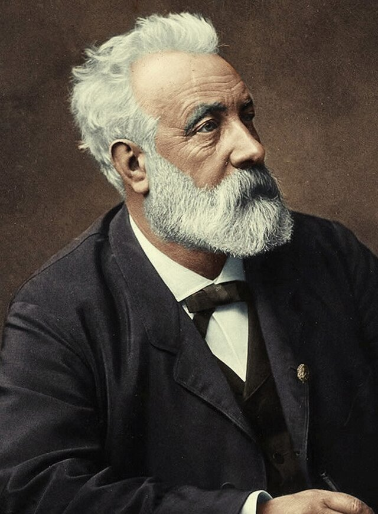

# Jules Verne and transportation (fr_03)
> [!note] Educators & Designers: help improving this quest!
> **Comments and feedback**: [discuss in the Forum](https://antura.discourse.group/t/fr-03-jules-verne-and-transportation/25/1)  
> **Improve script translations**: [comment the Google Sheet](https://docs.google.com/spreadsheets/d/1FPFOy8CHor5ArSg57xMuPAG7WM27-ecDOiU-OmtHgjw/edit?gid=336647638#gid=336647638)  
> **Improve Cards translations**: [comment the Google Sheet](https://docs.google.com/spreadsheets/d/1M3uOeqkbE4uyDs5us5vO-nAFT8Aq0LGBxjjT_CSScWw/edit?gid=415931977#gid=415931977)  
> **Improve the script**: [propose an edit here](https://github.com/vgwb/Antura/blob/main/Assets/_discover/_quests/FR_03%20Nantes%20Verne/FR_03%20Nantes%20Verne%20-%20Yarn%20Script.yarn)  

- Version: 1.00
- Status: Production
- Location: France - Nantes

- Difficulty: Normal
- Duration (min): 15
## Design Notes

**Core Subject:** Literature, Vocabulary (Vehicles/Travel), and Civic Responsibility.

### Player Objectives

**Civic Duty:** The player arrives to find the museum in disarray. They must first help the staff by cleaning the sidewalk and tidying up the museum hall to make it ready for visitors.

**Literary Exploration:** The Museum Guide tasks the player with finding four missing exhibits corresponding to Verne's famous novels: a Submarine, a Hot Air Balloon, a Rocket, and a Steam Train.

**Restoration & Learning:** Upon finding each object, the player repairs it (via a jigsaw puzzle) and learns facts about the vehicle and the book it comes from (e.g., linking the Nautilus to 20,000 Leagues Under the Sea).

**Final Assessment:** The quest concludes with a matching activity where the player must correctly pair each book with its specific vehicle.

### Educational Content

**Cultural Figure:** Introduces Jules Verne as a famous writer born in Nantes who imagined future technologies.

**Vocabulary:** Focuses on travel and vehicle words (Submarine, Rocket, Balloon, Train, Steam, Earth, Moon).

**Reading Comprehension:** Players read simple descriptions of the books to understand the function of each vehicle

## Topics
### Jules Verne {#jules_verne}
[Open topic page](../../topics/index.md#jules_verne)  

- Importance: Medium  
- Country: France  
- Target age: Ages6to10

#### Core Card - Jules Verne
A French writer who imagined amazing adventures before they were possible! He wrote about submarines, rockets, and traveling around the world.

{ width="200" }
- Rationale: Jules Verne shows kids how imagination and science can work together
- Type: Person
- Subjects: Literature, Science, History
- Year: 1828

#### Connection (RelatedTo) - Around the World in Eighty Days
An exciting book by Jules Verne about traveling around the whole world very quickly using trains, ships, and hot air balloons!

{ width="200" }
- Type: Object
- Subjects: Literature
- Year: 1873

#### Connection (RelatedTo) - From the Earth to the Moon
A book by Jules Verne about going to the Moon in a big cannon! It was written before real rockets existed.

{ width="200" }
- Type: Object
- Subjects: Literature, Space, Science
- Year: 1865

#### Connection (RelatedTo) - 20000 Leagues Under the Sea
A book by Jules Verne about underwater adventures in a submarine called the Nautilus. You meet giant sea creatures!

{ width="200" }
- Type: Object
- Subjects: Literature
- Year: 1871

#### Connection (RelatedTo) - Five Weeks in a Balloon
A book by Jules Verne about flying across Africa in a hot air balloon. It's full of adventure and discovery!

{ width="200" }
- Type: Object
- Subjects: Literature
- Year: 1863

#### Connection (RelatedTo) - Space Rocket
A rocket that goes into space.

{ width="200" }
- Type: Object
- Subjects: Science

#### Connection (RelatedTo) - Submarine (The Nautilus)
A submarine from Jules Verne’s story. It could explore the deep sea.

{ width="200" }
- Type: Object
- Subjects: Literature, Science

#### Connection (RelatedTo) - Train
Trains carry people and goods fast across the country.

{ width="200" }
- Type: Object
- Subjects: Transportation

#### Connection (RelatedTo) - Submarine (The Nautilus)
A submarine from Jules Verne’s story. It could explore the deep sea.

{ width="200" }
- Type: Object
- Subjects: Literature, Science

## Quest Script

[See the full script here](./fr_03-script.md)

## Words
## Activities
- [JigsawPuzzle](../../activities/index.md#JigsawPuzzle)
- [JigsawPuzzle](../../activities/index.md#JigsawPuzzle)
- [JigsawPuzzle](../../activities/index.md#JigsawPuzzle)
- [JigsawPuzzle](../../activities/index.md#JigsawPuzzle)
- [JigsawPuzzle](../../activities/index.md#JigsawPuzzle)
- [Match](../../activities/index.md#Match)

## Tasks
- [Collect] clean_sidewalk
- [Collect] clean_museum
- [Interact] find_submarine
- [Interact] find_balloon
- [Interact] find_rocket
- [Interact] find_train
- [Interact] back_to_museum_guide
## Credits
- Anne (France) (content)
- Lucie Paillat (France) (content, design)
- [Stefano Cecere](https://stefanocecere.com) (Italy) (development)
