# Mont Blanc & Mountains (fr_08)
> [!note] Educators & Designers: help improving this quest!
> **Comments and feedback**: [discuss in the Forum](https://antura.discourse.group/t/fr-08-mont-blanc-mountains/27/1)  
> **Improve script translations**: [comment the Google Sheet](https://docs.google.com/spreadsheets/d/1FPFOy8CHor5ArSg57xMuPAG7WM27-ecDOiU-OmtHgjw/edit?gid=736863861#gid=736863861)  
> **Improve Cards translations**: [comment the Google Sheet](https://docs.google.com/spreadsheets/d/1M3uOeqkbE4uyDs5us5vO-nAFT8Aq0LGBxjjT_CSScWw/edit?gid=415931977#gid=415931977)  
> **Improve the script**: [propose an edit here](https://github.com/vgwb/Antura/blob/main/Assets/_discover/_quests/FR_08%20Mont%20Blanc/FR_08%20Mont%20Blanc%20-%20Yarn%20Script.yarn)  

- Version: 1.00
- Status: NeedsReview
- Location: France - Rhônes Alpes

- Difficulty: Normal
- Duration (min): 15
- Description: Let's discover Mont Blanc and the essential mountain tools needed to reach the summit in this climbing adventure!

## Design Notes
## Game Design Notes FR_08

**Mission Statement** The player explores **Mont Blanc** to recover essential climbing gear and environmental facts. By talking to experts at five distinct altitude bases, the player learns about the **Alps**, mountain safety, and geography to reach the summit.

### Characters

- **Mountain Guide**: Stationed at Base Camp to provide the backpack and mission briefing.
- **Alpinists & Experts**: NPCs at each base who guard chests and provide educational facts.
- **Mountain Wildlife**: Marmots and other local features providing atmospheric context.

### Knowledge Content

- **Geography**: Mont Blanc is the highest mountain in the **Alps** (4807m). Neighbors visible from the peak include **France, Italy, and Switzerland**.
- **Vocabulary**: Mountain, peak, snow, ice, sun, and wind.
- **Gear & Safety**: Recognizing essential tools like a coat, scarf, hat, gloves, sunglasses, crampons, and rope.

### Gameplay Flow

#### Step 1: Base Camp (The Start)

- **Location**: The valley floor in Chamonix.
- **Action**: Meet the **Mountain Guide** to receive the **Backpack**.
- **Knowledge**: Learn that Mont Blanc is the highest peak in the **Alps**.

#### Step 2: Base 1 - The Valley's End (The Approach)

- **Location**: After a walk through the lower valley, reaching the actual foot of the mountain.
- **NPC Interaction**: A hiker explains the importance of layers.
- **Collectible**: Unlock a chest to find the **Coat** and **Scarf** after a simple weather quiz.

#### Step 3: Base 2 - Lower Mid (The Snow Line)

- **Location**: The transition area where grass turns to permanent **snow**.
- **NPC Interaction**: A ski instructor discusses winter gear.
- **Collectible**: Solve a jigsaw puzzle of the mountain to unlock **Gloves** and a **Hat**.

#### Step 4: Base 3 - High-Mid (The Glacier)

- **Location**: High-altitude **ice** and **glaciers**.
- **NPC Interaction**: A glaciologist explains why the **sun** is dangerous on the ice.
- **Collectible**: Answer a question about eye safety to unlock the **Sunglasses** and **Crampons**.

#### Step 5: Base 4 - The Top (The Summit)

- **Location**: The 4807 m **summit**.
- **Action**: Final geography check of neighboring countries.
- **Quiz**: Identify **France**, **Italy**, and **Switzerland** from the peak.
- **Final Puzzle**: Place the three national flags on their respective poles.

### Final Assessment

1. What is the name of the mountain range where Mont Blanc is located?
	- **Answer:** The Alps
	- The Pyrenees
	- The Apennines
2. How high is Mont Blanc?
	- **Answer:** 4807 meters
	- 3705 meters
	- 4016 meters
3. Which countries can you see from the top of Mont Blanc?
	- **Answer:** Italy, France and Switzerland
	- Italy, Austria, France
	- Germany, France, Switzerland

## Topics
### mont blanc {#mont_blanc}
[Open topic page](../../topics/index.md#mont_blanc)  

- Importance: Medium  
- Country: France  
- Target age: Ages6to10

#### Core Card - Mont Blanc
The highest mountain in Western Europe. Covered in snow all year.

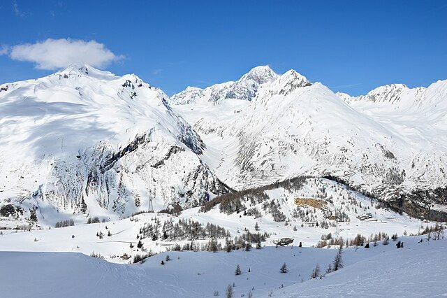{ width="200" }
- Type: Place
- Subjects: Geography, Environment

#### Connection (RelatedTo) - Mountain Guide
A person who helps people climb safely.

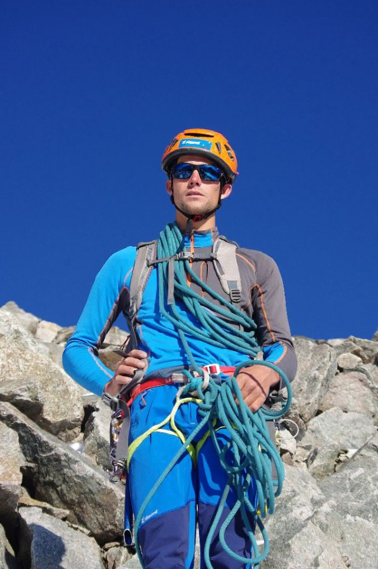{ width="200" }
- Type: Person
- Subjects: Community, Safety, Education

#### Connection (RelatedTo) - Wind
Moving air that can feel strong in the mountains.

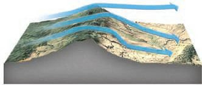{ width="200" }
- Type: Concept
- Subjects: Weather, Environment

#### Connection (RelatedTo) - Summit
The very top of a mountain.

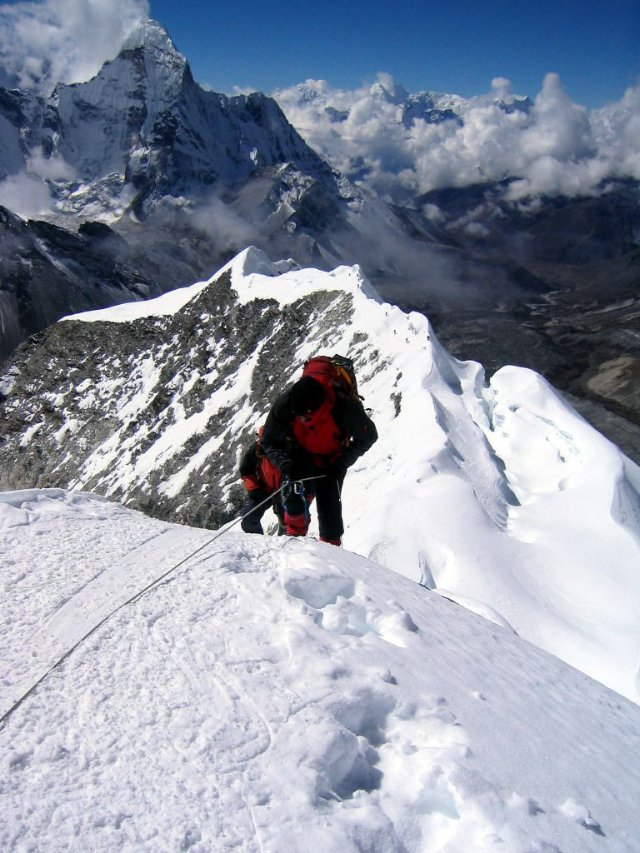{ width="200" }
- Type: Concept
- Subjects: Geography, Environment, Education

#### Connection (RelatedTo) - Alps
A tall mountain range in Europe.

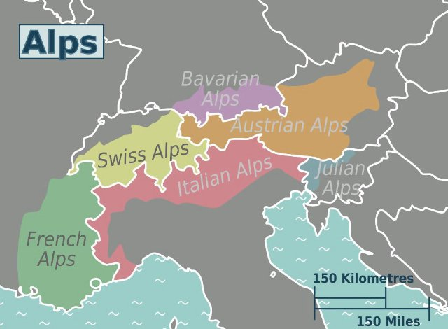{ width="200" }
- Type: Place
- Subjects: Geography, Environment

#### Connection (RelatedTo) - Mountain
The pillars of earth

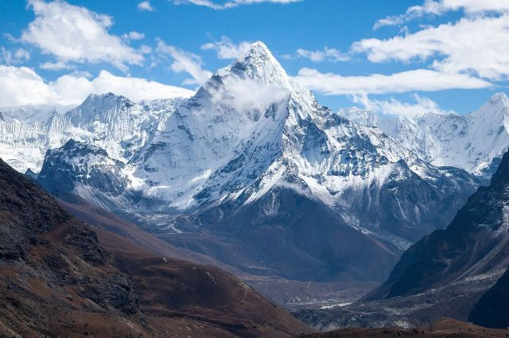{ width="200" }
- Type: Concept
- Subjects: Environment, Education

#### Connection (RelatedTo) - Snow
Frozen water that falls in cold weather.

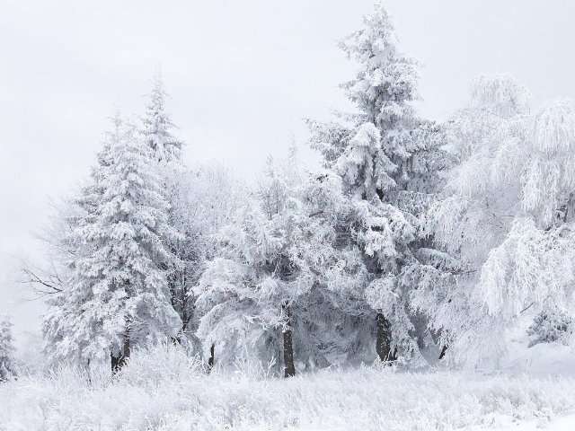{ width="200" }
- Type: Concept
- Subjects: Weather, Environment, Science

#### Connection (RelatedTo) - Ice
Frozen water that can be very slippery.

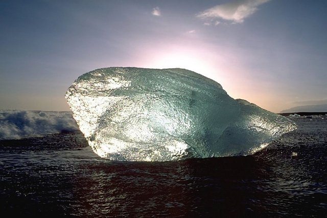{ width="200" }
- Type: Concept
- Subjects: Weather, Environment, Science

### mountain tools {#mountain_tools}
[Open topic page](../../topics/index.md#mountain_tools)  

what we need to stay ssafe in the mountain

- Importance: Medium  
- Country: International  
- Target age: Ages6to10

#### Core Card - Mountain
The pillars of earth

{ width="200" }
- Type: Concept
- Subjects: Environment, Education

#### Connection (RelatedTo) - Gloves
Warm covers for your hands.

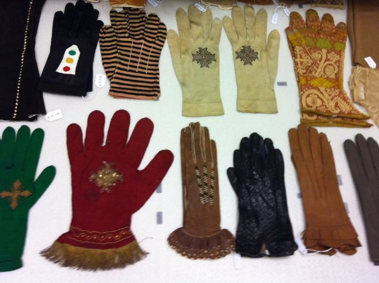{ width="200" }
- Type: Object
- Subjects: Health, Safety, Weather

#### Connection (RelatedTo) - Hat
A warm cap for your head.

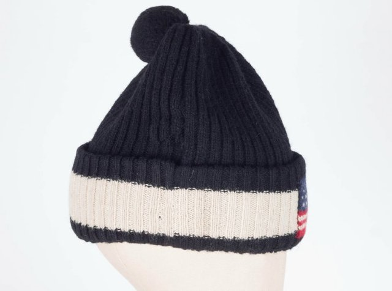{ width="200" }
- Type: Object
- Subjects: Health, Safety, Weather

#### Connection (RelatedTo) - Backpack
A bag you carry on your back.

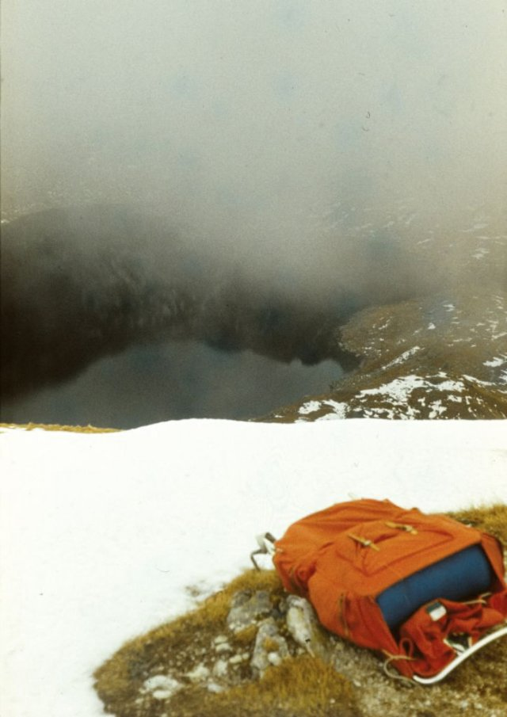{ width="200" }
- Type: Object
- Subjects: Recreation, Transportation, Education

#### Connection (RelatedTo) - Rope
A strong line used for safety when climbing.

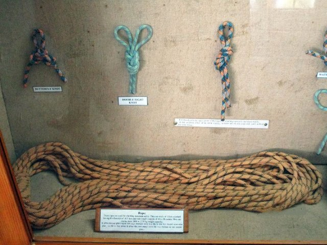{ width="200" }
- Type: Object
- Subjects: Safety, Technology, Sport

#### Connection (RelatedTo) - Crampons
Spiky metal grips you attach to boots for ice.

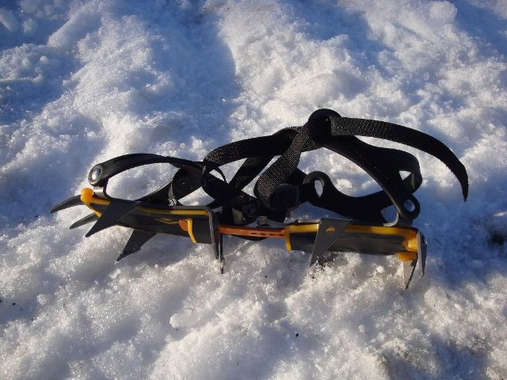{ width="200" }
- Type: Object
- Subjects: Safety, Technology, Sport

#### Connection (RelatedTo) - Scarf
A warm cloth you wear around your neck.

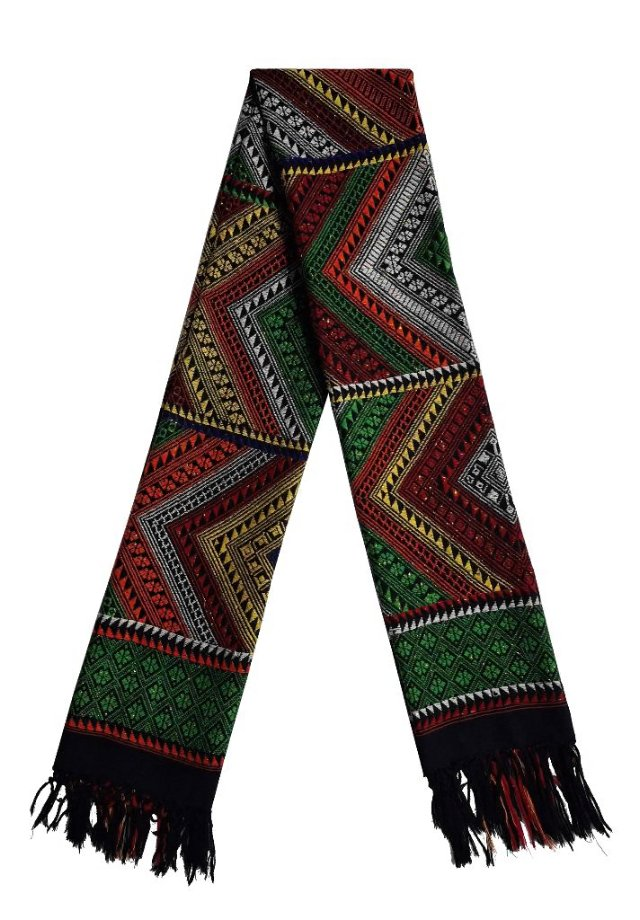{ width="200" }
- Type: Object
- Subjects: Health, Safety, Weather

#### Connection (RelatedTo) - Sunglasses
Glasses that protect your eyes from bright light.

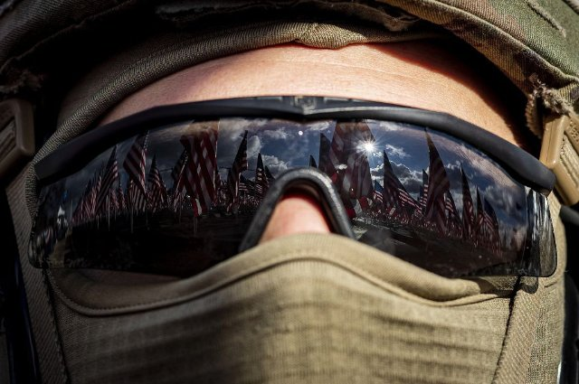{ width="200" }
- Type: Object
- Subjects: Health, Safety, Weather

### mountain activities {#mountain_activities}
[Open topic page](../../topics/index.md#mountain_activities)  

- Importance: Medium  
- Country: International  
- Target age: Ages6to10

#### Core Card - Mountain
The pillars of earth

{ width="200" }
- Type: Concept
- Subjects: Environment, Education

#### Connection (RelatedTo) - Mountain Guide
A person who helps people climb safely.

{ width="200" }
- Type: Person
- Subjects: Community, Safety, Education

#### Connection (RelatedTo) - Hiking
Walking on trails in nature.

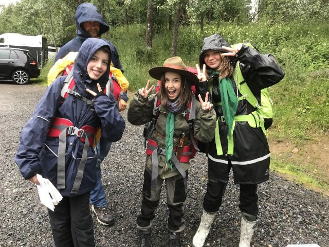{ width="200" }
- Type: Concept
- Subjects: Recreation, Sport, Environment

#### Connection (RelatedTo) - Climbing
Going up rocks or ice with special gear.

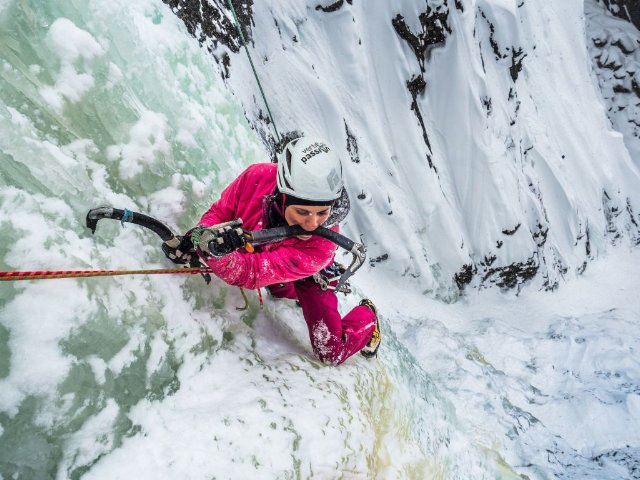{ width="200" }
- Type: Concept
- Subjects: Sport, Safety, Recreation

#### Connection (RelatedTo) - Skiing
Sliding on snow with skis.

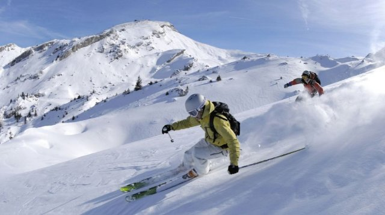{ width="200" }
- Type: Concept
- Subjects: Sport, Recreation

## Additional Cards
#### Bobsled
A fast sled used to slide down ice.

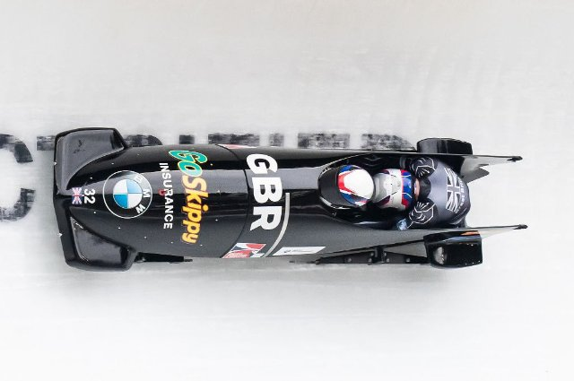{ width="200" }
- Type: Object
- Subjects: Sport, Recreation

#### Coat
A warm jacket for cold weather.

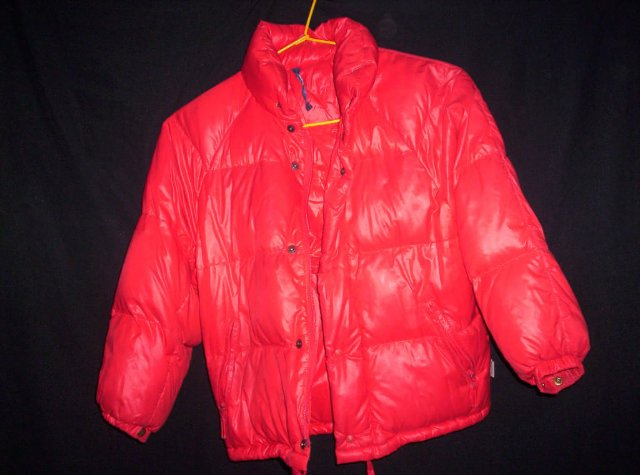{ width="200" }
- Type: Object
- Subjects: Health, Safety, Weather

#### Glacier
Slow-moving ice found on high mountains.

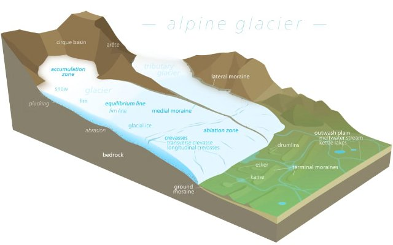{ width="200" }
- Type: Concept
- Subjects: Geography, Science, Environment

#### Marmot
A furry mountain animal that whistles.

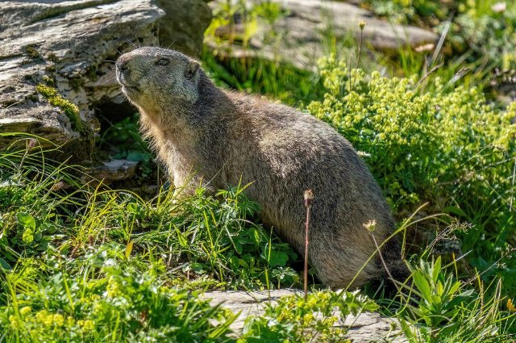{ width="200" }
- Type: Object
- Subjects: Animal, Environment, Science

#### Sun
Bright light that can reflect on the snow.

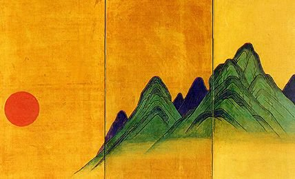{ width="200" }
- Type: Concept
- Subjects: Science, Weather, Environment

## Quest Script

[See the full script here](./fr_08-script.md)

## Words
## Activities
- [JigsawPuzzle](../../activities/index.md#JigsawPuzzle)

## Tasks
- [Interact] reach_top
## Credits
- Anne (France) (content)
- Lucie Paillat (France) (content, design)
- [Stefano Cecere](https://stefanocecere.com) (Italy) (development)
- Valeria Passarella (Italy) (design)
