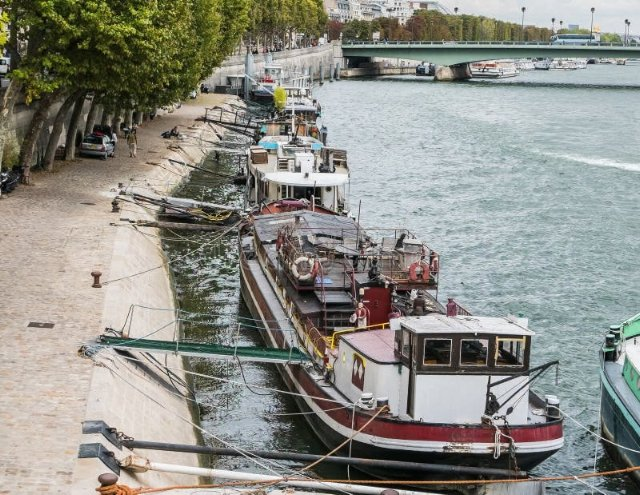

# Paris Seine (fr_10)
> [!note] Educators & Designers: help improving this quest!
> **Comments and feedback**: [discuss in the Forum](https://antura.discourse.group/t/fr-10-paris-seine/29/1)  
> **Improve script translations**: [comment the Google Sheet](https://docs.google.com/spreadsheets/d/1FPFOy8CHor5ArSg57xMuPAG7WM27-ecDOiU-OmtHgjw/edit?gid=754141150#gid=754141150)  
> **Improve Cards translations**: [comment the Google Sheet](https://docs.google.com/spreadsheets/d/1M3uOeqkbE4uyDs5us5vO-nAFT8Aq0LGBxjjT_CSScWw/edit?gid=415931977#gid=415931977)  
> **Improve the script**: [propose an edit here](https://github.com/vgwb/Antura/blob/main/Assets/_discover/_quests/FR_10%20Paris%20Seine/FR_10%20Paris%20Seine%20-%20Yarn%20Script.yarn)  

- Version: 1.00
- Status: Production
- Location: France - Paris

- Difficulty: Normal
- Duration (min): 10
- Kind:
  - Orientation
  - Journey
- Description: Let’s discover the main river of France

## Design Notes
## Teachers Resources

### Video

<iframe width="560" height="315" src="https://www.youtube.com/embed/RGOFuzdol9Q?si=rGWg53DhcCsMiMdi" title="YouTube video player" frameborder="0" allow="accelerometer; autoplay; clipboard-write; encrypted-media; gyroscope; picture-in-picture; web-share" referrerpolicy="strict-origin-when-cross-origin" allowfullscreen></iframe>

👉🏼 [Seine River Cruise in Paris, France](https://www.youtube.com/watch?v=RGOFuzdol9Q)

### Map

👉🏼 [Seine Map](https://en.wikipedia.org/wiki/Seine#/map/0)

### Activities

## Topics
### Seine {#seine}
[Open topic page](../../topics/index.md#seine)  

- Importance: Medium  
- Country: France  
- Target age: Ages6to10  
- Subjects: Geography, Transportation, Civics

#### Core Card - Seine
A 777-kilometre-long river in northern France

{ width="200" }
- Type: Place
- Subjects: Geography

#### Connection (LocatedIn) - Paris
The capital city of France. Paris has a famous tall tower called the Eiffel Tower!

{ width="200" }
- Type: Place
- Subjects: Geography, Culture

#### Connection (RelatedTo) - Map of Seine River
A picture that shows the Seine River and where it flows through the land.

{ width="200" }
- Type: Object
- Subjects: Geography, Environment

#### Connection (LocatedIn) - Map of Seine in Paris
A picture that shows how the Seine River flows through the city of Paris.

{ width="200" }
- Type: Object
- Subjects: Science

#### Connection (RelatedTo) - Bridge for cars
A road that goes over water so cars can drive across rivers and lakes.

{ width="200" }
- Type: Place
- Subjects: Geography, Environment

#### Connection (RelatedTo) - Footbridges
Small bridges for people walking. They keep you safe from traffic.

{ width="200" }
- Type: Place
- Subjects: Geography, Environment

#### Connection (RelatedTo): Auto from quest fr_10 - Bridge for trains
A special bridge built strong enough for heavy trains to cross over water.

{ width="200" }
- Type: Place
- Subjects: Geography, Environment

#### Connection (RelatedTo) - Pont Alexandre III
A beautiful bridge in Paris with fancy decorations and golden statues on it.

{ width="200" }
- Type: Place
- Subjects: Geography, Environment

#### Connection (RelatedTo) - River boat
A boat that travels on rivers. Rivers are like roads made of water!

{ width="200" }
- Type: Place
- Subjects: Geography, Environment

#### Connection (RelatedTo) - Boat for goods
A big boat that carries boxes, food, and other things from place to place.

{ width="200" }
- Type: Place
- Subjects: Geography, Environment

#### Connection (RelatedTo) - Boat House
A house that floats on water like a boat. People can live in boat houses!

{ width="200" }
- Type: Place
- Subjects: Geography, Environment

#### Connection (RelatedTo) - Boat for People
A boat that carries people from one place to another across the water.

{ width="200" }
- Type: Place
- Subjects: Geography, Environment

#### Connection (RelatedTo) - Seine River Boat
A special boat that sails on the Seine River in Paris. You can see the Eiffel Tower and other beautiful buildings from the water!

{ width="200" }
- Rationale: Boat tours help kids see Paris from a different perspective and understand river transportation
- Type: Concept
- Subjects: Transportation, Geography, Culture
- Year: 1900

#### Connection (LocatedIn) - Ile-de-France
A region in France where the capital city Paris is located. Many people live here!

{ width="200" }
- Type: Place
- Subjects: Geography, Environment

## Quest Script

[See the full script here](./fr_10-script.md)

## Words
## Activities
- [CleanCanvas](../../activities/index.md#CleanCanvas)
- [CleanCanvas](../../activities/index.md#CleanCanvas)
- [JigsawPuzzle](../../activities/index.md#JigsawPuzzle)
- [JigsawPuzzle](../../activities/index.md#JigsawPuzzle)
- [Match](../../activities/index.md#Match)
- [Memory](../../activities/index.md#Memory)
- [Memory](../../activities/index.md#Memory)

## Tasks
- [Collect] collect_cards
- [Collect] find_photos
- [Interact] go_back
## Credits
- Anne (France) (content)
- Lucie Paillat (France) (content, design)
- [Stefano Cecere](https://stefanocecere.com) (Italy) (development)
