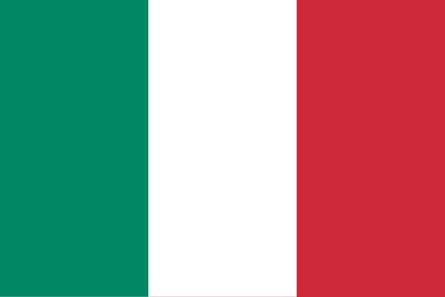
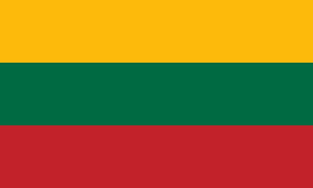

# The neighbors of Poland (pl_00)
> [!note] Educators & Designers: help improving this quest!
> **Comments and feedback**: [discuss in the Forum](https://antura.discourse.group/t/pl-00-the-neighbors-of-poland/31/1)  
> **Improve script translations**: [comment the Google Sheet](https://docs.google.com/spreadsheets/d/1FPFOy8CHor5ArSg57xMuPAG7WM27-ecDOiU-OmtHgjw/edit?gid=1929643794#gid=1929643794)  
> **Improve Cards translations**: [comment the Google Sheet](https://docs.google.com/spreadsheets/d/1M3uOeqkbE4uyDs5us5vO-nAFT8Aq0LGBxjjT_CSScWw/edit?gid=415931977#gid=415931977)  
> **Improve the script**: [propose an edit here](https://github.com/vgwb/Antura/blob/main/Assets/_discover/_quests/PL_00%20Geo%20Poland/PL_00%20Geo%20Poland%20-%20Yarn%20Script.yarn)  

- Version: 1.00
- Status: Production
- Location: Poland - Poland

- Difficulty: Easy
- Duration (min): 15
- Description: Discover the neighbours of Poland

## Design Notes

**Core Subject:** Geography, Flags, and Neighboring Countries.

**Player Objectives:**

1. **Flag Hunt:** The player meets a Polish child who explains that Antura has mixed up all the flags of the neighboring countries.
2. **Country Tour:** The player must help friends from **Poland, Germany, Belarus, Czech Republic, Lithuania, Ukraine, Slovakia, and Russia** find their missing flags.
3. **Visual Recognition:** The player must identify flags based on descriptions (e.g., "White, red and blue with a coat of arms" for Slovakia, "Red and green with a red pattern" for Belarus).
4. **Chain Reaction:** Finding one flag unlocks the next country's request (e.g., helping Poland leads to Germany).
5. **Completion:** Once all 8 flags are returned, the player completes the map of this part of Central Europe.

**Educational Content:**

- **Geography:** Introduces the concept of **Central Europe** and the relative locations of Poland and its neighbors.
- **Flags:** Teaches the colors and patterns of 8 European flags.
- **Capitals:** Mentions capital cities like **Warsaw, Berlin, Minsk, Prague, Vilnius, Kyiv, Bratislava, and Moscow**.
- **Cultural Facts:** Includes small facts (e.g., Czech Republic has many castles, Lithuania has many forests, Ukraine is the "Bread Basket").

### Knowledge Content

**European Geography:** learn the 8 countries that border mainland Poland and their capitals

- Belarus
- Czech Republic
- Germany
- Lithuania
- Russia
- Slovakia
- Ukraine

**Vexillology (the study of flags)**: recognize the flags of these 8 nations and learn to identify them based on color and pattern descriptions.

**Cultural Snippets:** learn a simple greeting in each country.

## Topics
### Poland country {#poland-country}
[Open topic page](../../topics/index.md#poland-country)  

- Importance: Critical  
- Country: Poland  
- Target age: Ages6to10

#### Core Card - Poland
A country in Europe. Capital is Warsaw. Poland is famous for scientists like Copernicus and delicious pierogi!

{ width="200" }
- Type: Place
- Subjects: Geography, Culture

#### Connection (CulturalContext): national symbol - Flag of Poland
The flag of Poland has white and red horizontal stripes. Poland is famous for scientists like Copernicus and delicious pierogi!

{ width="200" }
- Rationale: The Polish flag is essential for Polish language learning and cultural identity
- Type: Concept
- Subjects: Geography, Culture
- Year: 1919

#### Connection (RelatedTo) - Warsaw
The capital city of Poland.

{ width="200" }
- Type: Place
- Subjects: Geography, Culture

### Flags of Europe {#flags_euroe}
[Open topic page](../../topics/index.md#flags_euroe)  

- Importance: Medium  
- Country: International  
- Target age: Ages6to10

#### Core Card - Europe Map
A map showing all the countries in Europe. You can see where France, Poland, Germany, and other countries are located.

{ width="200" }
- Rationale: Maps help kids understand where different countries are and how they connect
- Type: Concept
- Subjects: Geography, Education
- Year: 2000

#### Connection (CulturalContext): national symbol - Flag of Germany
The flag of Germany has three horizontal stripes: black, red, and yellow. Germany is famous for cars, castles, and fairy tales!

{ width="200" }
- Rationale: The German flag helps kids learn about France's important neighbor country
- Type: Concept
- Subjects: Geography, Culture
- Year: 1949

#### Connection (CulturalContext): national symbol - Flag of Italy
The flag of Italy has three vertical stripes: green, white, and red. The colors look like basil, mozzarella, and tomatoes on pizza!

{ width="200" }
- Rationale: The Italian flag connection to pizza helps kids remember the colors easily
- Type: Concept
- Subjects: Geography, Culture
- Year: 1946

#### Connection (CulturalContext): national symbol - Flag of Luxembourg
The flag of Luxembourg has red, white, and light blue horizontal stripes. Luxembourg is a very small country that speaks three languages!

{ width="200" }
- Rationale: Small multilingual countries teach kids about European diversity
- Type: Concept
- Subjects: Geography, Culture
- Year: 1972

#### Connection (CulturalContext): national symbol - Flag of Monaco
The flag of Monaco has red and white horizontal stripes. Monaco is tiny but famous for fancy cars and royal palaces by the sea!

{ width="200" }
- Rationale: Monaco shows kids how small places can be special and important
- Type: Concept
- Subjects: Geography, Culture
- Year: 1881

#### Connection (CulturalContext): national symbol - Flag of Belgium
The flag of Belgium has three vertical stripes: black, yellow, and red. Belgium is famous for chocolate and waffles!

{ width="200" }
- Rationale: Belgium's unique vertical stripes help kids distinguish different flag patterns
- Type: Concept
- Subjects: Geography, Culture
- Year: 1831

#### Connection (CulturalContext): Auto from quest fr_00 - Flag of Spain
The flag of Spain has red and yellow horizontal stripes. The colors are like the sun and peppers! Spain invented flamenco dancing.

{ width="200" }
- Rationale: The Spanish flag helps kids learn about France's southern neighbor and its vibrant culture
- Type: Concept
- Subjects: Geography, Culture
- Year: 1981

#### Connection (CulturalContext): national symbol - Flag of Switzerland
The flag of Switzerland is red with a white cross in the middle. It looks like a first aid kit! Switzerland is famous for mountains and cheese.

{ width="200" }
- Rationale: The Swiss flag's unique cross design helps kids remember this mountain country
- Type: Concept
- Subjects: Geography, Culture
- Year: 1889

#### Connection (CulturalContext): national symbol - Flag of France
The flag of France has three vertical stripes: blue, white, and red. These colors represent liberty, equality, and fraternity!

{ width="200" }
- Rationale: The French flag is essential for teaching French national identity and values
- Type: Concept
- Subjects: Geography, Culture
- Year: 1794

#### Connection (CulturalContext): Auto from quest fr_00 - Flag of Czech Republic
The flag has white and red stripes with a blue triangle. The Czech Republic is famous for beautiful Prague castle and crystal glass.

{ width="200" }
- Rationale: Central European countries help kids understand the region around Poland
- Type: Concept
- Subjects: Geography, Culture
- Year: 1920

#### Connection (CulturalContext): national symbol - Flag of Slovakia
A flag with white, blue, and red colors. It represents the country of Slovakia.

{ width="200" }
- Type: Concept
- Subjects: Community, Culture

#### Connection (CulturalContext): national symbol - Flag of Ukraine
A flag with blue and yellow colors like the sky and sun. It represents the country of Ukraine.

{ width="200" }
- Type: Concept
- Subjects: Community, Culture

## Additional Cards
#### Flag of Belarus
The flag of Belarus has red and green horizontal stripes with beautiful traditional patterns on the side. Belarus is Poland's neighbor.

{ width="200" }
- Rationale: Learning neighboring countries helps kids understand regional geography
- Type: Concept
- Subjects: Geography, Culture
- Year: 1995

#### Flag of Lithuania
The flag has yellow, green, and red horizontal stripes. Lithuania is a Baltic country with beautiful forests and beaches.

{ width="200" }
- Rationale: Baltic countries teach kids about northern European geography and Poland's neighbors
- Type: Concept
- Subjects: Geography, Culture
- Year: 1988

#### Flag of Russia
A flag with white, blue, and red stripes. It represents the country of Russia.

{ width="200" }
- Type: Concept
- Subjects: Community, Culture

## Quest Script

[See the full script here](./pl_00-script.md)

## Words
## Activities
- (none)

## Tasks
- [Collect] find_flag_poland
- [Collect] find_flag_germany
- [Collect] find_flag_belarus
- [Collect] find_flag_lithuania
- [Collect] find_flag_ukraine
- [Collect] find_flag_czech
- [Collect] find_flag_slovakia
- [Collect] find_flag_russia
- [Interact] talk_npc_germany
- [Interact] talk_npc_belarus
- [Interact] talk_npc_lithuania
- [Interact] talk_npc_ukraine
- [Interact] talk_npc_czech
- [Interact] talk_npc_slovakia
- [Interact] talk_npc_russia
- [Interact] talk_npc_poland_final
## Credits
- [Stefano Cecere](https://stefanocecere.com) (Italy) (development)
- Vieri Toti (Italy) (design, development)
