# Discover Warszawa (pl_01)
> [!note] Educators & Designers: help improving this quest!
> **Comments and feedback**: [discuss in the Forum](https://antura.discourse.group/t/pl-01-discover-warszawa/32/1)  
> **Improve script translations**: [comment the Google Sheet](https://docs.google.com/spreadsheets/d/1FPFOy8CHor5ArSg57xMuPAG7WM27-ecDOiU-OmtHgjw/edit?gid=1983275331#gid=1983275331)  
> **Improve Cards translations**: [comment the Google Sheet](https://docs.google.com/spreadsheets/d/1M3uOeqkbE4uyDs5us5vO-nAFT8Aq0LGBxjjT_CSScWw/edit?gid=415931977#gid=415931977)  
> **Improve the script**: [propose an edit here](https://github.com/vgwb/Antura/blob/main/Assets/_discover/_quests/PL_01%20Warsaw/PL_01%20Warsaw%20-%20Yarn%20Script.yarn)  

- Version: 1.00
- Status: Production
- Location: Poland - Warsaw

- Difficulty: Normal
- Duration (min): 20
- Description: Explore the polish capital to fix the chaos left by Antura

## Game Design Notes

**Mission Objective**
Explore Warsaw, collect **7 landmark cards**, and reassemble the **Mermaid's sword**.
Antura broke the sword into **7 pieces** and locked each one inside a chest across the city. Each NPC has a local problem caused by Antura — helping them earns a **key** to open that place's chest, which contains a **sword piece** and a **landmark card**.

**Characters**

- **Local NPCs:** The Mermaid, Fryderyk Chopin, Wars and Sawa, King Sigismund, a Parliamentarian, Maria Skłodowska-Curie, and Robert Lewandowski.

### Learning Goals

- **City Identity:** Warsaw is the **capital of Poland**.
- **Landmarks:** Recognize the **Mermaid of Warsaw**, **Chopin Monument**, **Wars and Sawa statue**, **King Sigismund's Column**, **Polish Houses of Parliament**, **Palace of Culture and Science**, and **National Stadium**.
- **Symbols and History:**
	- The Mermaid is a symbol of Warsaw.
	- The **Wisła** is the longest river in Poland.
	- King Sigismund moved the capital to Warsaw.
	- Poland's flag is **white and red**.
	- The **Constitution of 3 May** and **Independence Day** are important Polish celebrations.
- **People:**
	- **Fryderyk Chopin** is a famous Polish composer.
	- **Maria Skłodowska-Curie** is a famous Polish scientist.
- **Vocabulary:**
	- **Transport:** tram, bus
	- **Sport:** football, ball, goal, soccer field
	- **Currency:** złoty

### Gameplay Structure

- **One NPC per place:** Each place has one character who explains the landmark and the local problem.
- **One short mission:** A simple collect task or small local challenge.
- **Key:** Completing the mission earns a key.
- **Chest reward:** The key opens the chest at that place, revealing a **sword piece** and the **landmark card**.
- **One story thread:** Antura broke the Mermaid's sword into 7 pieces and hid each one in a locked chest across Warsaw. Mermaid -> Wars and Sawa -> Sigismund -> Parliament -> Chopin -> Palace of Culture -> Stadium -> reassemble the sword at the Mermaid.
- **Linear progression:** Each completed place unlocks the next place.
- **Movement:** We can walk or take trams.

### Progression

- **Place 1:** Mermaid of Warsaw
- **Place 2:** Wars and Sawa by the Wisła
- **Place 3:** King Sigismund's Column
- **Place 4:** Houses of Parliament
- **Place 5:** Chopin Monument
- **Place 6:** Palace of Culture and Science
- **Place 7:** National Stadium
- **End:** Return the sword to the Mermaid for final quiz and outro

### Places

#### Place 1: Mermaid of Warsaw

- **NPC:** Mermaid of Warsaw
- **Story:** Antura broke the sword and scattered the 7 pieces across Warsaw. The first piece is locked in the chest here.
- **Fact:** The Mermaid is one of the best-known symbols of Warsaw.
- **Mission:** Talk to all red & yellow people to learn how they move around Warsaw: tram, bus, train, car, and bike.
- **Key reward:** Completing the mission earns the keys to open the chest
- **Reward Chest:** Sword piece
- **Unlocks:** Wars and Sawa by the Wisła

#### Place 2: Wars and Sawa

- **NPC:** Wars and Sawa
- **Story:** Wars and Sawa got separated during the chaos caused by Antura
- **Fact:** The Wisła is the longest river in Poland, and Wars and Sawa are linked to a legend about Warsaw.
- **Mission:** Find Sawa by the river and bring her back to Wars.
- **Key reward:** Completing the mission earns the key to this chest.
- **Reward Chest:** Sword piece 2 + Wars and Sawa card
- **Unlocks:** King Sigismund's Column
- **Clue:** After reuniting, they point the player toward King Sigismund's Column.

#### Place 3: King Sigismund's Column

- **NPC:** King Sigismund
- **Story:** Antura knocked the king's crown off while running through the square, and the third sword piece is locked in the chest here.
- **Fact:** King Sigismund moved the capital from Kraków to Warsaw. The Royal Castle is nearby, and Poland is now governed by Parliament.
- **Mission:** Find the missing crown pieces.
- **Key reward:** Completing the mission earns the key to this chest.
- **Reward Chest:** Sword piece 3 + King Sigismund's Column card
- **Unlocks:** Houses of Parliament
- **Clue:** Sigismund points the player toward the Sejm, where another sword piece is hidden.

#### Place 4: Houses of Parliament

- **NPC:** Parliamentarian or President
- **Story:** Antura scattered the colors of the Polish flag during his escape, and the fourth sword piece is locked in the chest here.
- **Fact:** The Houses of Parliament are where laws are discussed in Poland. The Polish flag is white and red.
- **Mission:** Restore the flag colors in the correct order.
- **Knowledge Add-on:** Short mention of the Constitution of 3 May and the Presidential Palace.
- **Key reward:** Completing the mission earns the key to this chest.
- **Reward Chest:** Sword piece 4 + Polish Houses of Parliament card
- **Unlocks:** Chopin Monument

#### Place 5: Chopin Monument

- **NPC:** Fryderyk Chopin
- **Story:** Antura scattered the music notes from Chopin's melody, and the fifth sword piece is locked in the chest here.
- **Fact:** Chopin was a famous Polish composer, and his monument is one of Warsaw's cultural landmarks.
- **Mission:** Recover the missing notes and recreate the melody.
- **Key reward:** Completing the mission earns the key to this chest.
- **Reward Chest:** Sword piece 5 + Chopin card
- **Unlocks:** Palace of Culture and Science

#### Place 6: Palace of Culture and Science

- **NPC:** Maria Skłodowska-Curie
- **Story:** Antura stole Maria's wallet during his escape, and the sixth sword piece is locked in the chest here.
- **Fact:** The Palace of Culture is one of Warsaw's biggest landmarks. Maria Skłodowska-Curie was a famous Polish scientist. The Polish currency is the złoty.
- **Mission:** Follow a trail of złoty coins to find Maria's lost wallet.
- **Key reward:** Completing the mission earns the key to this chest.
- **Reward Chest:** Sword piece 6 + Palace of Culture and Science card
- **Unlocks:** National Stadium

#### Place 7: National Stadium

- **NPC:** Robert Lewandowski
- **Story:** Antura disrupted the match at the stadium, and the seventh and final sword piece is locked in the chest here.
- **Fact:** The National Stadium is a famous sports venue in Warsaw. It is linked to football, public events, and national celebrations.
- **Mission:** Score 5 goals to cheer everyone up after Antura's visit.
- **Vocabulary:** football, ball, goal, soccer field
- **Knowledge Add-on:** Short mention of the national anthem and Independence Day on 11 November.
- **Key reward:** Completing the mission earns the key to this chest.
- **Reward Chest:** Sword piece 7 + National Stadium card
- **Unlocks:** Return to the Mermaid

#### End: Return to the Mermaid

- **NPC:** Mermaid of Warsaw
- **Story:** With all 7 sword pieces collected, the player returns to the Mermaid, who reassembles the sword.
- **Fact:** She is a symbol of Warsaw and protects the city.
- **Reward:** The Mermaid thanks the player and starts the final quiz.

### Final Assessment

1. **Which colors are on the Polish flag?**
	- **White and red**
	- Blue and red
	- Green and white

2. **Who was Chopin?**
	- **A composer**
	- A football player
	- A king

3. **What is the Wisła?**
	- **A river**
	- A palace
	- A stadium

## Quest Script
[See the full script here](./pl_01-script.md)

## Topics
### Warsaw {#warsaw}
[Open topic page](../../topics/index.md#warsaw)  

- Importance: Medium  
- Country: Poland  
- Target age: Ages6to10

#### Core Card - Chopin Monument
A large statue in Warsaw’s Łazienki Park dedicated to Frédéric Chopin. It’s also the site of popular open-air piano concerts in summer. (the special tree he is sitting under is a typical polish.. Willow)

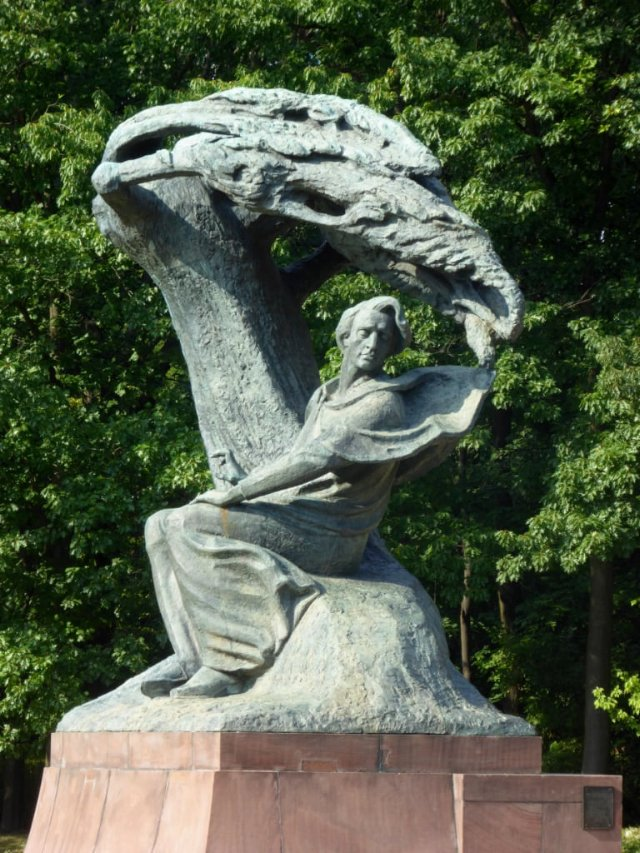{ width="200" }
- Type: Object
- Subjects: Music, Culture

#### Connection (RelatedTo) - Mermaid of Warsaw
The city’s symbol is a brave mermaid with a sword and shield. You can see her statue by the river.

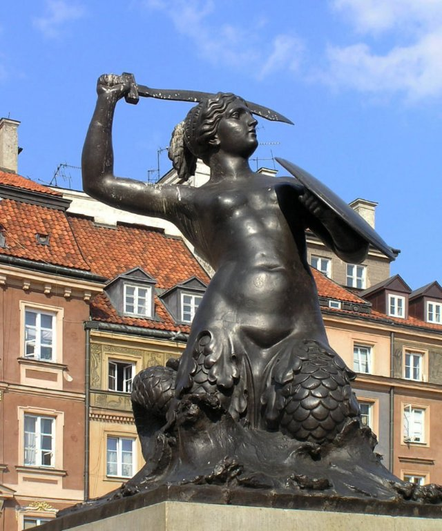{ width="200" }
- Type: Object
- Subjects: Culture, History

#### Connection (RelatedTo) - Wars and Sawa
Two legendary figures who gave Warsaw its name. Wars was a brave warrior and Sawa was a beautiful mermaid who lived in the Vistula River.

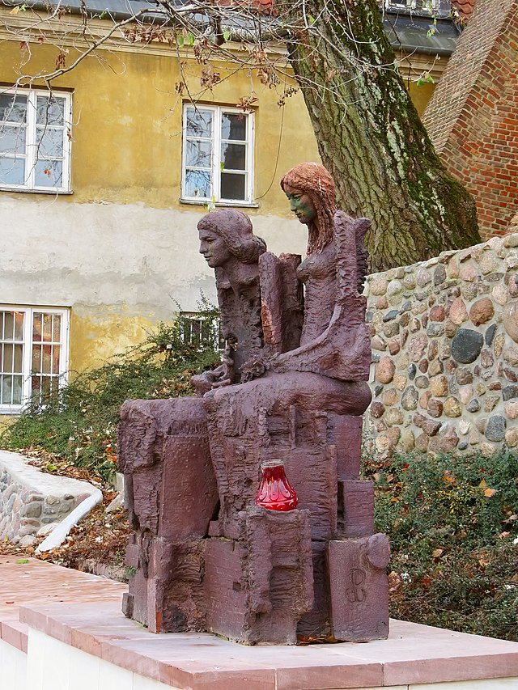{ width="200" }
- Type: Concept
- Subjects: Community, Culture
- Year: 1300

#### Connection (RelatedTo) - Fryderyk Chopin
A famous piano composer from Poland. He wrote beautiful music that sounds like dancing or telling stories. His music makes people feel happy or sad.

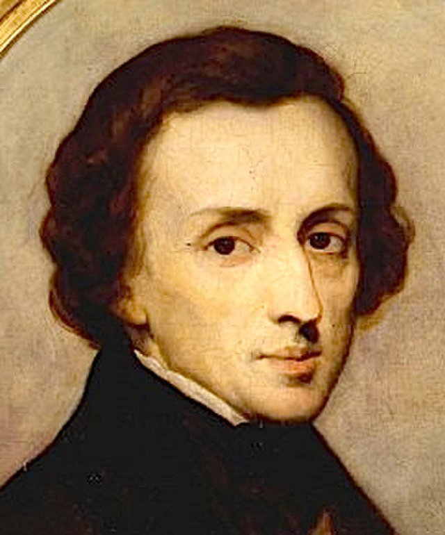{ width="200" }
- Rationale: Chopin introduces kids to classical music and shows how music can express emotions
- Type: Person
- Subjects: Music, History, Culture
- Year: 1810

## Additional Cards
#### Ball
A round object used in many games.

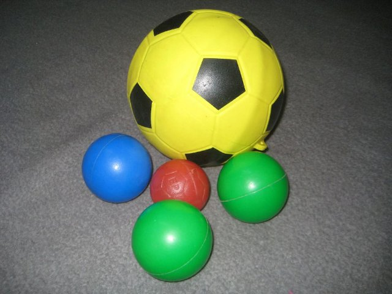{ width="200" }
- Type: Object
- Subjects: Sport, Recreation

#### Bike
A two‑wheeled vehicle you pedal.

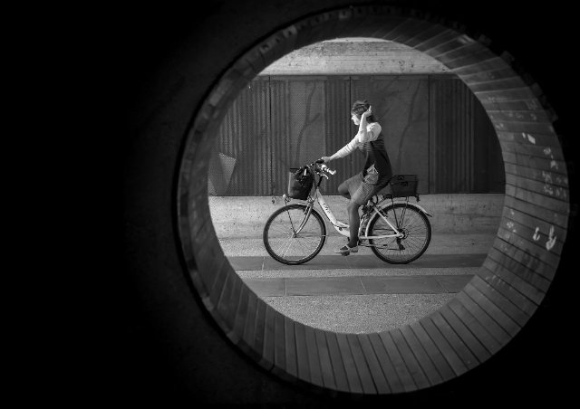{ width="200" }
- Type: Object
- Subjects: Transportation, Sport, Health

#### Bus
A big vehicle that carries many people.

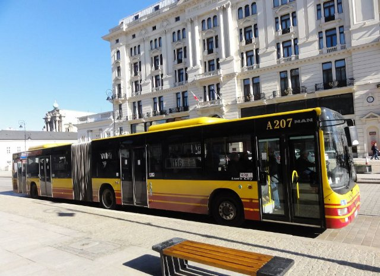{ width="200" }
- Type: Object
- Subjects: Transportation, Community

#### Car
A small vehicle for roads.

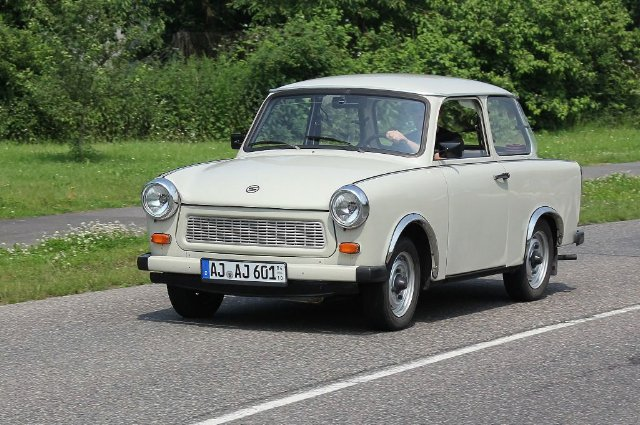{ width="200" }
- Type: Object
- Subjects: Transportation

#### Constitution of 3 May
A historic Polish constitution celebrated on May 3.

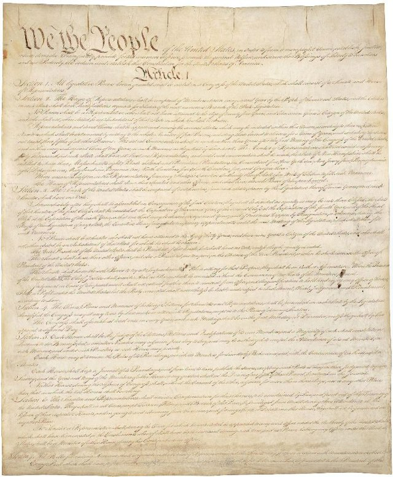{ width="200" }
- Type: Concept
- Subjects: Civics, History, Time

#### Football (Soccer)
A team game played with a ball you kick.

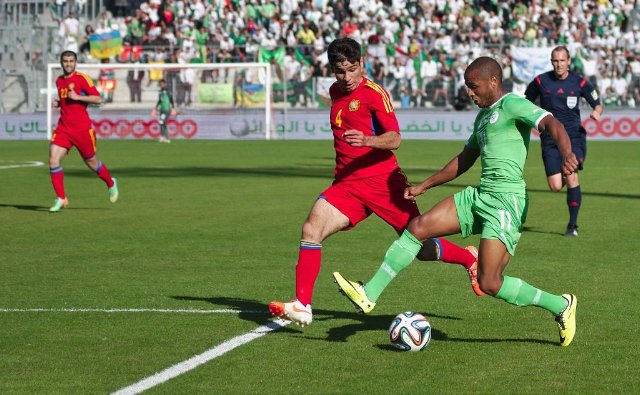{ width="200" }
- Type: Object
- Subjects: Sport, Recreation, Community

#### Goal
The net you try to score into.

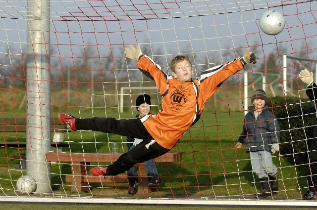{ width="200" }
- Type: Object
- Subjects: Sport, Recreation

#### Independence Day (Poland)
A national holiday on 11 November.

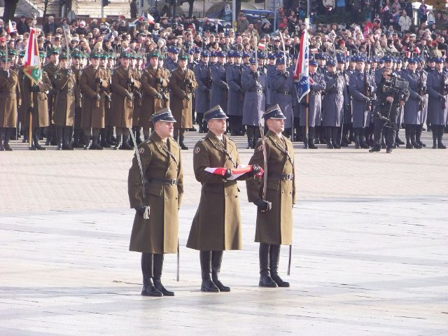{ width="200" }
- Type: Concept
- Subjects: Civics, History, Time

#### King Sigismund’s Column
A tall column honoring King Sigismund in Castle Square.

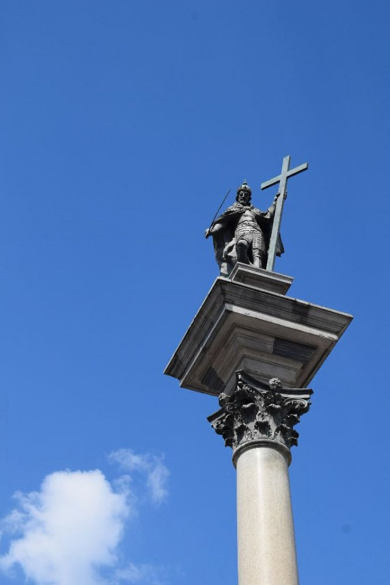{ width="200" }
- Type: Place
- Subjects: History, Culture

#### King Sigismund’s Crown
The king’s crown that fell off and must be found.

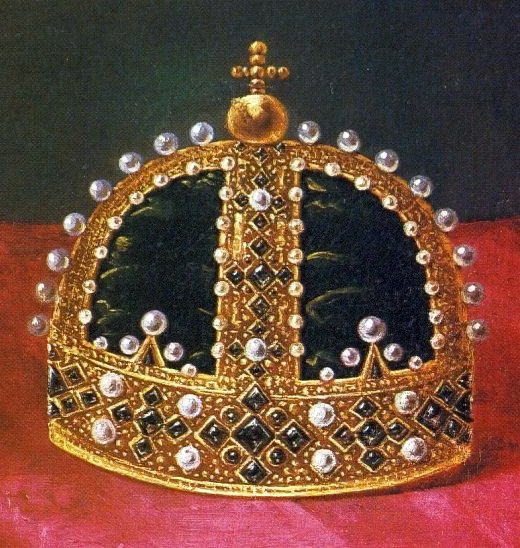{ width="200" }
- Type: Object
- Subjects: History, Culture

#### Maria Skłodowska-Curie
A brilliant scientist from Poland who discovered radioactivity. She was the first woman to win a Nobel Prize and won it twice!

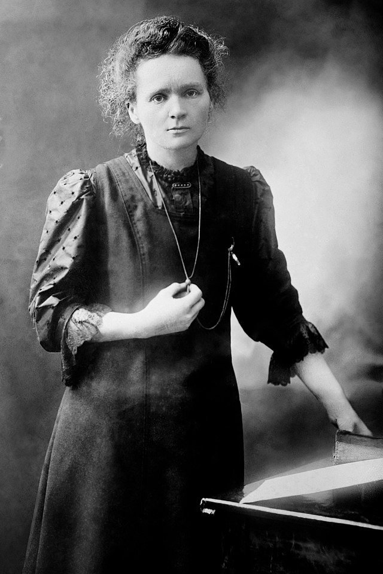{ width="200" }
- Rationale: Maria Curie inspires kids (especially girls) to pursue science and shows Polish contributions to science
- Type: Person
- Subjects: Science, History
- Year: 1867

#### Maria Skłodowska‑Curie
A scientist who won two Nobel Prizes.

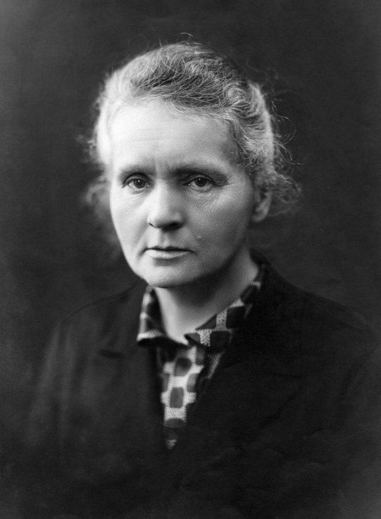{ width="200" }
- Type: Person
- Subjects: Science, History

#### Mazurek Dąbrowskiego
Poland’s national anthem.

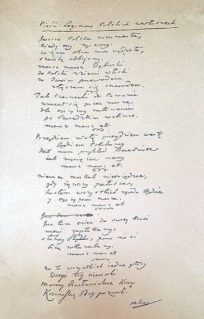{ width="200" }
- Type: Concept
- Subjects: Music, History, Culture

#### Mermaid’s Sword
The mermaid’s sword that must be returned.

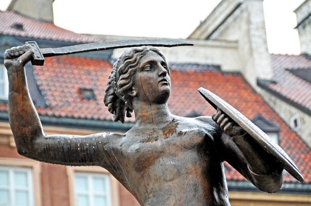{ width="200" }
- Type: Object
- Subjects: Culture, History

#### National Stadium (Warsaw)
A modern stadium for football games and concerts.

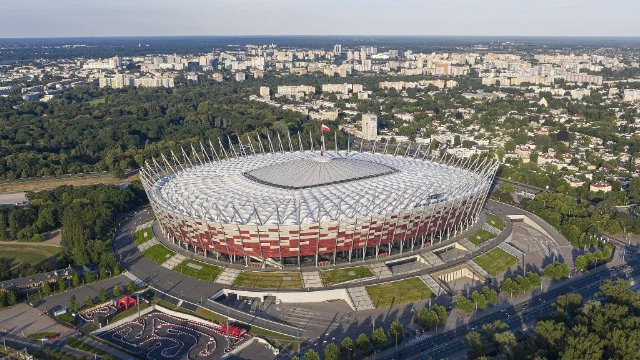{ width="200" }
- Type: Place
- Subjects: Sport, Culture, Community

#### Nicolaus Copernicus Monument (Warsaw)
A monument to the astronomer Nicolaus Copernicus.

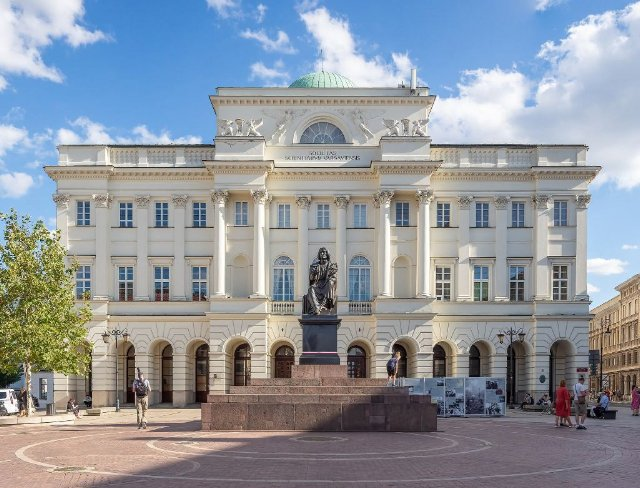{ width="200" }
- Type: Place
- Subjects: Science, History, Culture

#### Palace of Culture and Science
A tall building for museums, theaters, and learning.

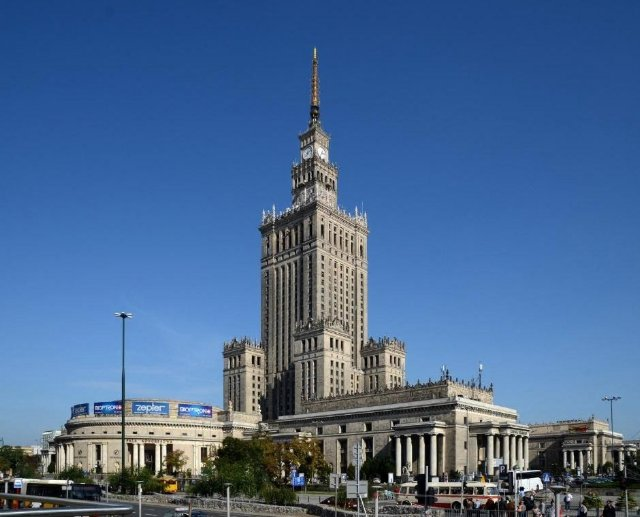{ width="200" }
- Type: Place
- Subjects: Culture, Education, History

#### King Sigismund III
A king of Poland who built many beautiful buildings in Warsaw. His statue stands on a tall column in the city center.

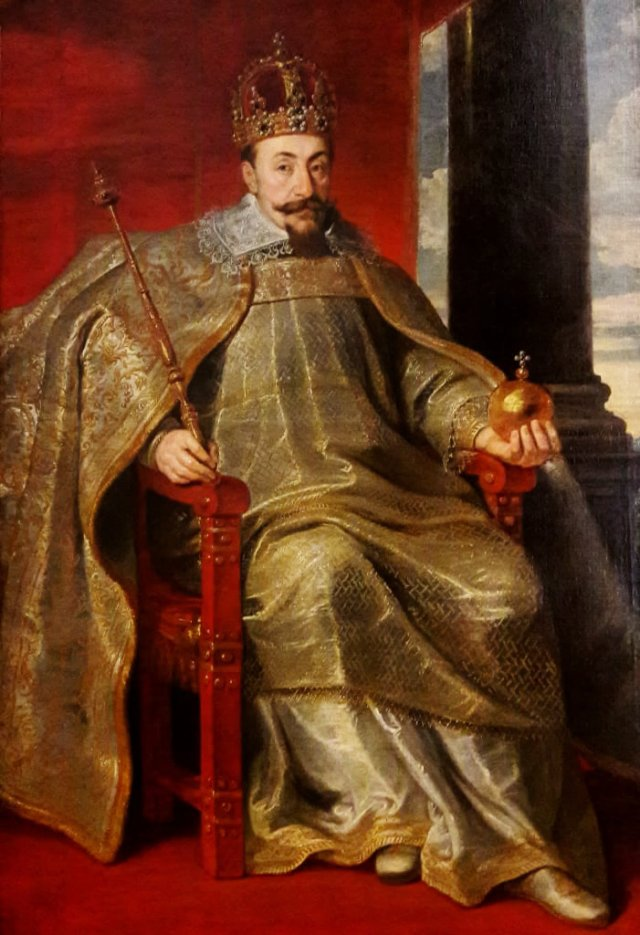{ width="200" }
- Rationale: Historical kings help kids understand how cities were built and developed over time
- Type: Person
- Subjects: History, Culture
- Year: 1566

#### Polish Dwarf (Wrocław gnomes)
Small dwarf statues hide around Wrocław. Finding them is a fun city game.

{ width="200" }
- Type: Concept
- Subjects: Community, Culture
- Year: 1700

#### Polish Houses of Parliament
Where laws are made: the Sejm and the Senate.

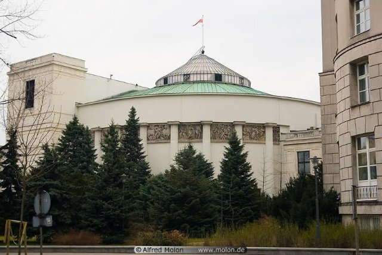{ width="200" }
- Type: Place
- Subjects: Civics, History, Geography

#### Presidential Palace
The official home of the President of Poland.

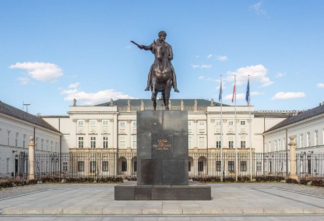{ width="200" }
- Type: Place
- Subjects: Civics, History, Culture

#### Robert Lewandowski
A famous Polish football player.

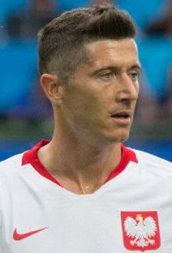{ width="200" }
- Type: Person
- Subjects: Sport, Culture

#### Royal Castle (Warsaw)
A historic castle of Polish kings, now a museum.

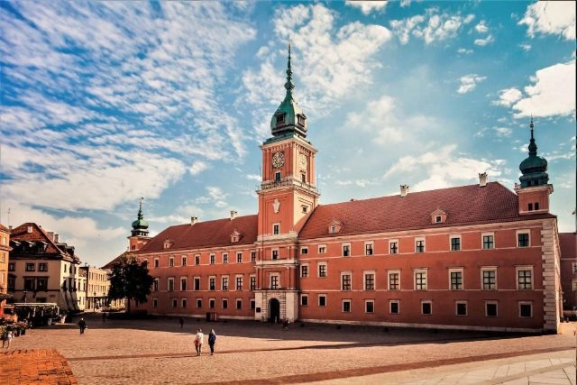{ width="200" }
- Type: Place
- Subjects: History, Culture, Geography

#### Soccer Field
The grass field where football is played.

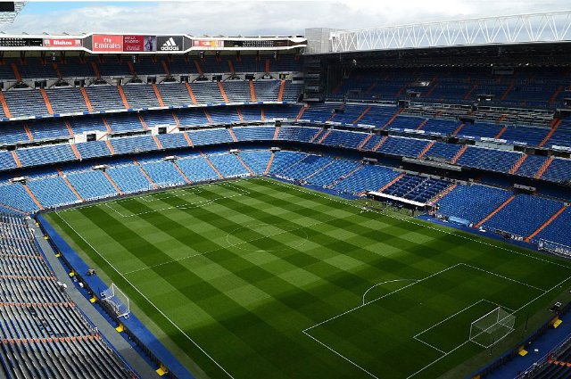{ width="200" }
- Type: Place
- Subjects: Sport, Recreation, Community

#### Tram
A city train that runs on tracks in the street.

{ width="200" }
- Type: Object
- Subjects: Transportation, Technology, Community

#### Wars and Sawa Statue
A statue showing the city’s legend about Wars and Sawa.

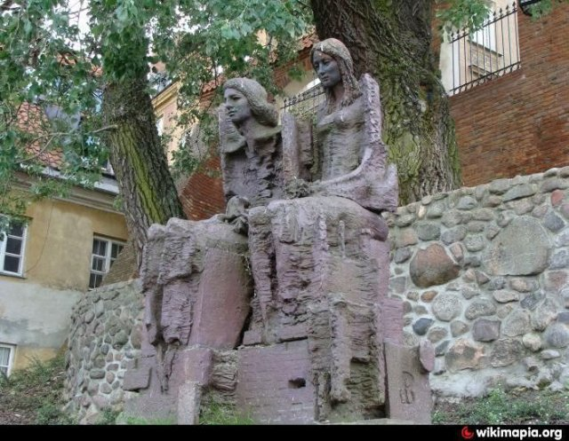{ width="200" }
- Type: Place
- Subjects: Culture, History

#### Złoty Coins
Polish money (złoty) shown as coins.

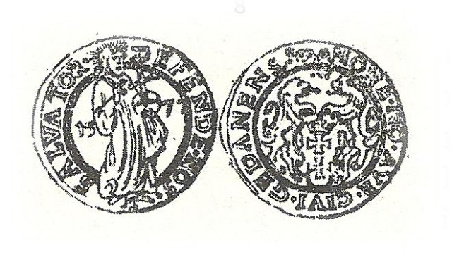{ width="200" }
- Type: Object
- Subjects: Money, Geography

## Words
## Activities
- [Memory](../../activities/index.md#Memory)
- [CleanCanvas](../../activities/index.md#CleanCanvas)
- [JigsawPuzzle](../../activities/index.md#JigsawPuzzle)
- [JigsawPuzzle](../../activities/index.md#JigsawPuzzle)
- [Memory](../../activities/index.md#Memory)
- [MoneyCount](../../activities/index.md#MoneyCount)
- [JigsawPuzzle](../../activities/index.md#JigsawPuzzle)

## Tasks
- [Collect] task_1
- [Collect] task_2
- [Collect] task_3
- [Collect] task_4
- [Collect] task_5
- [Collect] task_6
- [Collect] task_7
## Credits
- [Jan Stasienko](mailto:jan.stasienko@dsw.edu.pl) (Poland) (content)
- Lorenzo Castrovilli (Italy) (design)
- [Stefano Cecere](https://stefanocecere.com) (Italy) (development)
- Valeria Passarella (Italy) (design)
- Vieri Toti (Italy) (design)
