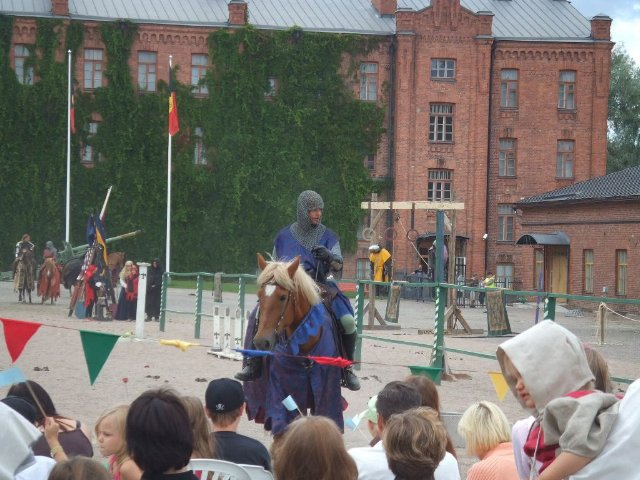

# Gingerbread & food market (pl_06)
> [!note] Educators & Designers: help improving this quest!
> **Comments and feedback**: [discuss in the Forum](https://antura.discourse.group/t/pl-06-gingerbread-food-market/37/1)  
> **Improve script translations**: [comment the Google Sheet](https://docs.google.com/spreadsheets/d/1FPFOy8CHor5ArSg57xMuPAG7WM27-ecDOiU-OmtHgjw/edit?gid=1211829352#gid=1211829352)  
> **Improve Cards translations**: [comment the Google Sheet](https://docs.google.com/spreadsheets/d/1M3uOeqkbE4uyDs5us5vO-nAFT8Aq0LGBxjjT_CSScWw/edit?gid=415931977#gid=415931977)  
> **Improve the script**: [propose an edit here](https://github.com/vgwb/Antura/blob/main/Assets/_discover/_quests/PL_06%20Torun%20Market/PL_06%20Torun%20Market%20-%20Yarn%20Script.yarn)  

- Version: 1.00
- Status: Production
- Location: Poland - Torun

- Difficulty: Normal
- Duration (min): 10
- Description: Discover 5 typical polish ingredients and prepare Pierogi!

## Design Notes

**Core Subject:** Food, Commerce, and Social Etiquette.

**Player Objectives:**

1. **Culinary Mission:** The player meets a Cook who wants to prepare traditional **Toruń Gingerbread** but lacks the ingredients.
2. **Market Exploration:** The player must visit five different vendors to find specific items like
   - Grocer - flour, sugar
   - Bee keeper - honey
   - Cheese Monger - butter
   - Egg Vendor - egg
   - Spice vendore - spices (cinnamon, ginger)
3. **Social Interaction:** To succeed, the player must use polite greetings ("Dzień dobry", "Dziękuję") and select the correct items from each vendor's list.
4. **Financial Literacy:** The player pays for items using a mini-game that simulates counting money (Złoty).
5. **Final Preparation:** After collecting all 8 ingredients, the player returns to the Cook to bake the gingerbread, and is allowed to enter the Old Town Hall
6. **Cleaning the Hall** for the Pierogi Festival

**Educational Content:**

- **Cultural Dish:** Introduces _Toruń Gingerbread_ and _Pierogi_ as famous Polish specialties.
- **Vocabulary:** Focuses on food items (_Cloves, Cinnamon, Ginger, Honey, Milk, Butter, Eggs, Flour_) and professions (_Grocer, Beekeeper, Dairy Vendor_).
- **Social Skills:** Reinforces the importance of politeness (greeting before asking) and basic commerce (exchanging money for goods).

## Topics
### Gingerbread {#gingerbread}
[Open topic page](../../topics/index.md#gingerbread)  

- Importance: Medium  
- Country: Poland  
- Target age: Ages6to10  
- Subjects: Food

#### Core Card - Torunian gingerbread
a traditional Polish treat made with spices and honey, often shaped in beautiful designs.

{ width="200" }
- Type: Object
- Subjects: Food

#### Connection (RelatedTo) - Gingerbread Mold
A shaped tool that makes fun cookie shapes.

{ width="200" }
- Type: Object
- Subjects: Food, Art

#### Connection (RelatedTo) - Cinnamon
A sweet spice made from tree bark.

{ width="200" }
- Type: Object
- Subjects: Food, Plant

#### Connection (RelatedTo) - Butter
A yellow fat made from milk, used for cooking and baking.

{ width="200" }
- Type: Object
- Subjects: Food, Animal

#### Connection (RelatedTo) - Eggs
Food from chickens used for baking and cooking.

{ width="200" }
- Type: Object
- Subjects: Food, Animal

#### Connection (RelatedTo) - Ginger
A spicy root used in cooking and cookies.

{ width="200" }
- Type: Object
- Subjects: Food, Plant

#### Connection (RelatedTo) - Honey
A sweet food made by bees.

{ width="200" }
- Type: Object
- Subjects: Food, Animal

### Pierogi Recipe {#pierogi}
[Open topic page](../../topics/index.md#pierogi)  

- Importance: Medium  
- Country: Poland  
- Target age: Ages6to10

#### Connection (RelatedTo) - Polish Pierogi
Dumplings filled with things like potato, cheese, or fruit. They are a famous Polish dish.

{ width="200" }
- Type: Object
- Subjects: Food, Culture
- Year: 1600

#### Connection (RelatedTo) - Zloty Currency
The Polish currency is called the złoty. Coins and notes have Polish symbols.

{ width="200" }
- Type: Concept
- Subjects: Money, Geography

#### Connection (RelatedTo): Previous core card - Torunian gingerbread
a traditional Polish treat made with spices and honey, often shaped in beautiful designs.

{ width="200" }
- Type: Object
- Subjects: Food

## Additional Cards
#### Beekeeper
A person who cares for bees and collects honey.

{ width="200" }
- Type: Person
- Subjects: Community, Animal, Food

#### Butcher
A person who sells meat.

{ width="200" }
- Type: Person
- Subjects: Community, Food

#### Cloves
A strong spice used to add flavor to food.

{ width="200" }
- Type: Object
- Subjects: Food, Plant

#### Coins
Small round money made of metal.

{ width="200" }
- Type: Object
- Subjects: Money

#### Cook
A person who prepares food.

{ width="200" }
- Type: Person
- Subjects: Community, Food

#### Dairy Vendor
A person who sells milk, butter, and cheese.

{ width="200" }
- Type: Person
- Subjects: Community, Food

#### Egg Vendor
A person who sells eggs.

{ width="200" }
- Type: Person
- Subjects: Community, Food

#### Kitchen
A room where people cook and bake.

{ width="200" }
- Type: Place
- Subjects: Food

#### Medieval Market
An old-style market where people buy and sell goods.

{ width="200" }
- Type: Place
- Subjects: History, Culture, Community

#### Torun Town Hall
A big Gothic building in Toruń next to the market square.

{ width="200" }
- Type: Place
- Subjects: History, Geography, Culture

## Quest Script

[See the full script here](./pl_06-script.md)

## Words
## Activities
- [MoneyCount](../../activities/index.md#MoneyCount)
- [MoneyCount](../../activities/index.md#MoneyCount)
- [MoneyCount](../../activities/index.md#MoneyCount)
- [MoneyCount](../../activities/index.md#MoneyCount)
- [MoneyCount](../../activities/index.md#MoneyCount)
- [Match](../../activities/index.md#Match)
- [JigsawPuzzle](../../activities/index.md#JigsawPuzzle)
- [MoneyCount](../../activities/index.md#MoneyCount)

## Tasks
- [Collect] COLLECT_INGREDIENTS
- [Interact] go_back_cook
- [Collect] clean_castle
- [Interact] climb_the_tower
## Credits
- [Jan Stasienko](mailto:jan.stasienko@dsw.edu.pl) (Poland) (content)
- [Stefano Cecere](https://stefanocecere.com) (Italy) (development)
