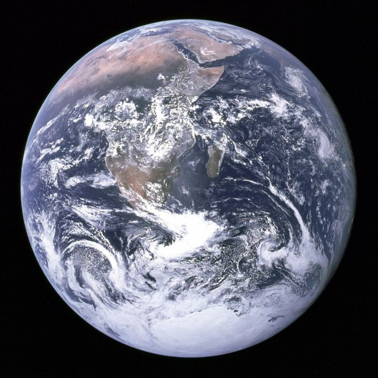

# Copernicus and the Solar System (pl_07)
> [!note] Educators & Designers: help improving this quest!
> **Comments and feedback**: [discuss in the Forum](https://antura.discourse.group/t/pl-07-copernicus-and-the-solar-system/38/1)  
> **Improve script translations**: [comment the Google Sheet](https://docs.google.com/spreadsheets/d/1FPFOy8CHor5ArSg57xMuPAG7WM27-ecDOiU-OmtHgjw/edit?gid=783699917#gid=783699917)  
> **Improve Cards translations**: [comment the Google Sheet](https://docs.google.com/spreadsheets/d/1M3uOeqkbE4uyDs5us5vO-nAFT8Aq0LGBxjjT_CSScWw/edit?gid=415931977#gid=415931977)  
> **Improve the script**: [propose an edit here](https://github.com/vgwb/Antura/blob/main/Assets/_discover/_quests/PL_07%20Solar%20System/PL_07%20Solar%20System%20-%20Yarn%20Script.yarn)  

- Version: 1.00
- Status: Development
- Location: Poland - Torun

- Difficulty: Normal
- Duration (min): 10
- Description: Discover who Nicolaus Copernicus was and the 8 planets of the solar system

## Design Notes
## Game Design Notes
**Mission**  
discover who Nicolaus Copernicus was and how he revolutionised science.
And did you know he was from poland?

### Knowledge
Nicolaus Copernicus and the life of a scientist in the renaissance  

- How does the telescope work?
- The 8 planets of the solar system and their names and order

### Flow
You arrive in Toruń, meeting the guide who welcomes you. He says that apparently Antura got stuck in Nicolaus Copernicus’ house and we need to help him. To do that, you first talk with Nicolaus Kopernik outside of his house – he introduces himself and says that he will help you if you help him first. He says that there is a map of a solar system that needs fixing.  
He asks you to put the planets in the correct order (ACTIVITY ORDER).  
When you do, he explains how people used to think that Earth was in the center of it and how he created the model of the Solar System that has the Sun in the center. You go with him inside of the house looking for Antura. You follow his trail and pass a telescope.  
Copernicus explains what that is and mentions what a planetarium is as well. Eventually you find Antura and take him out of there. Copernicus says he’s glad everything is okay and tells you about himself, who he is, what he’s known for.

## Topics
### Solar System {#solar_system}
[Open topic page](../../topics/index.md#solar_system)  

- Importance: High  
- Country: International  
- Target age: Ages6to10  
- Subjects: Science

#### Core Card - Solar System
The Sun and the eight planets that travel around it.

{ width="200" }
- Type: Concept
- Subjects: Space, Science

#### Connection (RelatedTo) - Mercury
The closest planet to the Sun; small and very fast.

{ width="200" }
- Type: Object
- Subjects: Space, Science

#### Connection (RelatedTo) - Mars
The red planet with dust and big volcanoes.

{ width="200" }
- Type: Object
- Subjects: Space, Science

#### Connection (RelatedTo) - Jupiter
The biggest planet, famous for the Great Red Spot.

{ width="200" }
- Type: Object
- Subjects: Space, Science

#### Connection (RelatedTo) - Neptune
The sea god from old stories.

{ width="200" }
- Type: Concept
- Subjects: Culture, History

#### Connection (RelatedTo) - Venus
A very hot planet covered by thick clouds.

{ width="200" }
- Type: Object
- Subjects: Space, Science

#### Connection (RelatedTo) - Heliocentric Model
The idea that the Sun is in the center and planets go around it.

{ width="200" }
- Type: Concept
- Subjects: Science, Space, History

#### Connection (RelatedTo) - Astronomy
The science of studying the Sun, Moon, stars, and planets.

{ width="200" }
- Type: Concept
- Subjects: Science, Space

#### Connection (RelatedTo) - Saturn
A giant planet with bright rings and many moons.

{ width="200" }
- Type: Object
- Subjects: Space, Science

#### Connection (RelatedTo) - Planetarium
A place where you can see the sky and stars indoors.

{ width="200" }
- Type: Place
- Subjects: Education, Science, Space

#### Connection (RelatedTo) - Earth
Our home planet with land, air, and water.

{ width="200" }
- Type: Object
- Subjects: Space, Science, Geography, Environment

#### Connection (RelatedTo) - Uranus
A blue‑green planet that spins on its side.

{ width="200" }
- Type: Object
- Subjects: Space, Science

### Telescope {#telescope}
[Open topic page](../../topics/index.md#telescope)  

- Importance: Medium  
- Country: International  
- Target age: Ages6to10  
- Subjects: Science

#### Core Card - Telescope
A tool that helps us see far‑away things in the sky.

{ width="200" }
- Type: Object
- Subjects: Science, Technology, Space

#### Connection (RelatedTo) - Nicolaus Copernicus
A brilliant scientist from Poland who discovered that the Earth goes around the Sun, not the other way around! This changed how we understand space.

{ width="200" }
- Rationale: Copernicus teaches kids about scientific discovery and Polish contributions to astronomy
- Type: Person
- Subjects: Science, History, Space
- Year: 1473

#### Connection (RelatedTo) - Eyepiece
The small lens you look through on a telescope.

{ width="200" }
- Type: Object
- Subjects: Science, Technology

#### Connection (RelatedTo) - Lens
A clear piece of glass or plastic that bends light.

{ width="200" }
- Type: Object
- Subjects: Science, Technology

#### Connection (RelatedTo) - Planetarium
A place where you can see the sky and stars indoors.

{ width="200" }
- Type: Place
- Subjects: Education, Science, Space

## Additional Cards
#### Nicolaus Copernicus’ House
It’s now a museum where you can learn about his life and scientific achievements.

{ width="200" }
- Type: Place
- Subjects: Culture, Science

#### Toruń
A city in Poland where Nicolaus Copernicus was born.

{ width="200" }
- Type: Place
- Subjects: Geography, History, Culture

## Quest Script

[See the full script here](./pl_07-script.md)

## Words
## Activities
- (none)

## Tasks
- (none)
## Credits
- [Jan Stasienko](mailto:jan.stasienko@dsw.edu.pl) (Poland) (content)
- [Stefano Cecere](https://stefanocecere.com) (Italy) (development)
