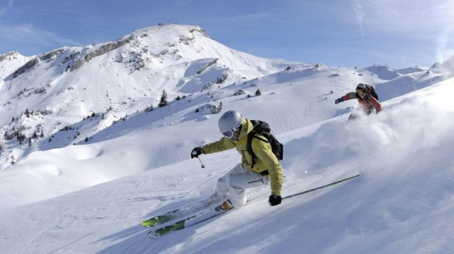
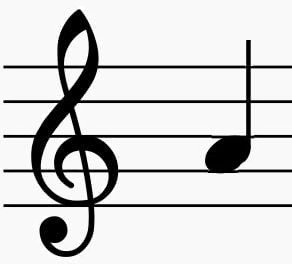
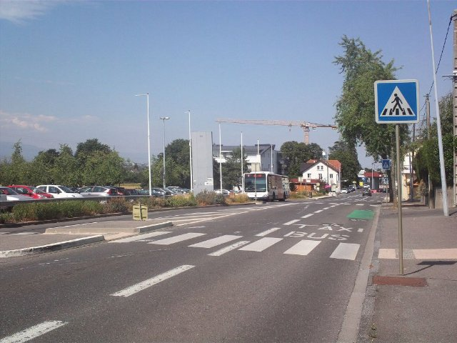

# Topics

Total found: **34**

!!! note "NOTE: connections type can be:"
    **Created By** (agent (person/org) who made/discovered/commissioned)  
    **Located In**       (where it is/was)  
    **Is A**             (type/category relation (Baguette is a Bread))  
    **Part Of**         (whole/part relation (Crust is part of Baguette))  
    **Made Of**          (physical composition)  
    **Time Context**     (period/event/date)  
    **Cultural Context** (origin/tradition/symbolism)  
    **Causal**           (clear cause→effect)  
    **Purpose**          (used for…)  
    **Compare**          (compare/Kind similar/contrast/analogy)  
    **Related To**     (whatever else, last choice...)  

## International

### Elementary Math
- Description: Numbers and shapes for everyday life: counting, adding and subtracting, simple fractions, measuring, telling time, and using money.  
- Importance: Medium  
- Subjects: Math  
- Target Age: Ages6to10
- Core card:
    - **[Eleementary Maths](./../cards/index.md#elementary_maths)**
    Numbers and shapes for everyday life: counting, adding and subtracting, simple fractions, measuring, telling time, and using money.

- Connected cards:
    - **[Line](./../cards/index.md#fr_figure_line)** (PartOf)
    A straight mark that goes from one point to another. Lines can be long or short.

    { width="200" }

    - **[Triangle](./../cards/index.md#fr_figure_triangle)** (PartOf)
    A shape with three straight sides and three corners. Triangles look like pizza slices!

    { width="200" }

    - **[Compass](./../cards/index.md#math_compass)** (Purpose)
    A tool that helps you draw perfect circles. It has two legs like scissors.

    { width="200" }

    - **[Ruler](./../cards/index.md#math_ruler)** (Purpose)
    A straight tool used to measure how long things are. Rulers have numbers and lines.

    { width="200" }

    - **[Square](./../cards/index.md#math_setsquare)** (Purpose)
    A triangle-shaped tool used to draw straight lines and right angles in math.

    { width="200" }

    - **[Circle](./../cards/index.md#fr_figure_circle)** (PartOf)
    A round shape with no corners. Circles look like wheels, balls, and coins!

    { width="200" }

- Quests: [The School system (fr_02)](./../quest/fr_02.md)

Credits:
  - Valeria Passarella (Italy)
  - [Stefano Cecere](https://stefanocecere.com) (Italy)

---

### Fisherman
- Importance: Medium  
- Target Age: Ages6to10
- Core card:
    - **[Fisherman](./../cards/index.md#fisherman)**
    A person who catches fish at sea.

    { width="200" }

- Connected cards:
    - **[Port](./../cards/index.md#port)** (LocatedIn)
    A place where ships load and unload.

    { width="200" }

    - **[Waves](./../cards/index.md#waves)** (RelatedTo)
    Moving water on the sea.

    { width="200" }

    - **[Navigation](./../cards/index.md#navigation)** (RelatedTo)
    Finding the way at sea using lights, maps, and tools.

    { width="200" }

    - **[Fishing Net](./../cards/index.md#fishing_net)** (Purpose)
    A net used to catch fish.

    { width="200" }

    - **[Ship](./../cards/index.md#ship)** (RelatedTo)
    A big boat that carries people or goods.

    { width="200" }

---

### Flags of Europe
- Importance: Medium  
- Target Age: Ages6to10
- Core card:
    - **[Europe Map](./../cards/index.md#concept_europe_map)**
    A map showing all the countries in Europe. You can see where France, Poland, Germany, and other countries are located.

    { width="200" }

- Connected cards:
    - **[Flag of Germany](./../cards/index.md#flag_germany)** (CulturalContext)
    The flag of Germany has three horizontal stripes: black, red, and yellow. Germany is famous for cars, castles, and fairy tales!

    { width="200" }

    - **[Flag of Italy](./../cards/index.md#flag_italy)** (CulturalContext)
    The flag of Italy has three vertical stripes: green, white, and red. The colors look like basil, mozzarella, and tomatoes on pizza!

    { width="200" }

    - **[Flag of Luxembourg](./../cards/index.md#flag_luxembourg)** (CulturalContext)
    The flag of Luxembourg has red, white, and light blue horizontal stripes. Luxembourg is a very small country that speaks three languages!

    { width="200" }

    - **[Flag of Monaco](./../cards/index.md#flag_monaco)** (CulturalContext)
    The flag of Monaco has red and white horizontal stripes. Monaco is tiny but famous for fancy cars and royal palaces by the sea!

    { width="200" }

    - **[Flag of Belgium](./../cards/index.md#flag_belgium)** (CulturalContext)
    The flag of Belgium has three vertical stripes: black, yellow, and red. Belgium is famous for chocolate and waffles!

    { width="200" }

    - **[Flag of Spain](./../cards/index.md#flag_spain)** (CulturalContext)
    The flag of Spain has red and yellow horizontal stripes. The colors are like the sun and peppers! Spain invented flamenco dancing.

    { width="200" }

    - **[Flag of Switzerland](./../cards/index.md#flag_switzerland)** (CulturalContext)
    The flag of Switzerland is red with a white cross in the middle. It looks like a first aid kit! Switzerland is famous for mountains and cheese.

    { width="200" }

    - **[Flag of France](./../cards/index.md#flag_france)** (CulturalContext)
    The flag of France has three vertical stripes: blue, white, and red. These colors represent liberty, equality, and fraternity!

    { width="200" }

    - **[Flag of Czech Republic](./../cards/index.md#flag_czech_republic)** (CulturalContext)
    The flag has white and red stripes with a blue triangle. The Czech Republic is famous for beautiful Prague castle and crystal glass.

    { width="200" }

    - **[Flag of Slovakia](./../cards/index.md#flag_slovakia)** (CulturalContext)
    A flag with white, blue, and red colors. It represents the country of Slovakia.

    { width="200" }

    - **[Flag of Ukraine](./../cards/index.md#flag_ukraine)** (CulturalContext)
    A flag with blue and yellow colors like the sky and sun. It represents the country of Ukraine.

    { width="200" }

- Quests: [The neighbors of France (fr_00)](./../quest/fr_00.md), [The neighbors of Poland (pl_00)](./../quest/pl_00.md)

---

### mountain activities
- Importance: Medium  
- Target Age: Ages6to10
- Core card:
    - **[Mountain](./../cards/index.md#mountain)**
    The pillars of earth

    { width="200" }

- Connected cards:
    - **[Mountain Guide](./../cards/index.md#mountain_guide)** (RelatedTo)
    A person who helps people climb safely.

    { width="200" }

    - **[Hiking](./../cards/index.md#hiking)** (RelatedTo)
    Walking on trails in nature.

    { width="200" }

    - **[Climbing](./../cards/index.md#climbing)** (RelatedTo)
    Going up rocks or ice with special gear.

    { width="200" }

    - **[Skiing](./../cards/index.md#skiing)** (RelatedTo)
    Sliding on snow with skis.

    { width="200" }

- Quests: [Mont Blanc & Mountains (fr_08)](./../quest/fr_08.md)

---

### mountain tools
- Description: what we need to stay ssafe in the mountain  
- Importance: Medium  
- Target Age: Ages6to10
- Core card:
    - **[Mountain](./../cards/index.md#mountain)**
    The pillars of earth

    { width="200" }

- Connected cards:
    - **[Gloves](./../cards/index.md#gloves)** (RelatedTo)
    Warm covers for your hands.

    { width="200" }

    - **[Hat](./../cards/index.md#hat)** (RelatedTo)
    A warm cap for your head.

    { width="200" }

    - **[Backpack](./../cards/index.md#backpack)** (RelatedTo)
    A bag you carry on your back.

    { width="200" }

    - **[Rope](./../cards/index.md#rope)** (RelatedTo)
    A strong line used for safety when climbing.

    { width="200" }

    - **[Crampons](./../cards/index.md#crampons)** (RelatedTo)
    Spiky metal grips you attach to boots for ice.

    { width="200" }

    - **[Scarf](./../cards/index.md#scarf)** (RelatedTo)
    A warm cloth you wear around your neck.

    { width="200" }

    - **[Sunglasses](./../cards/index.md#sunglasses)** (RelatedTo)
    Glasses that protect your eyes from bright light.

    { width="200" }

- Quests: [Mont Blanc & Mountains (fr_08)](./../quest/fr_08.md)

---

### Musical Notes
- Importance: Medium  
- Target Age: Ages6to10
- Core card:
    - **[Musical Score](./../cards/index.md#musical_score)**
    The written notes and words for a song.

    { width="200" }

- Connected cards:
    - **[Piano](./../cards/index.md#piano)** (RelatedTo)
    A keyboard instrument used to play melodies and chords.

    { width="200" }

    - **[A](./../cards/index.md#note_la)** (RelatedTo)
    A musical note.

    { width="200" }

    - **[F](./../cards/index.md#note_fa)** (RelatedTo)
    A musical note.

    { width="200" }

    - **[B](./../cards/index.md#note_si)** (RelatedTo)
    A musical note.

    { width="200" }

    - **[G](./../cards/index.md#note_sol)** (RelatedTo)
    A musical note.

    { width="200" }

    - **[C](./../cards/index.md#note_do)** (RelatedTo)
    A musical note.

    { width="200" }

    - **[E](./../cards/index.md#note_mi)** (RelatedTo)
    A musical note.

    { width="200" }

    - **[D](./../cards/index.md#note_re)** (RelatedTo)
    A musical note.

    { width="200" }

- Quests: [La Marseillaise (fr_11)](./../quest/fr_11.md)

---

### Solar System
- Importance: High  
- Subjects: Science  
- Target Age: Ages6to10
- Core card:
    - **[Solar System](./../cards/index.md#solar_system)**
    The Sun and the eight planets that travel around it.

    { width="200" }

- Connected cards:
    - **[Mercury](./../cards/index.md#mercury)** (RelatedTo)
    The closest planet to the Sun; small and very fast.

    { width="200" }

    - **[Mars](./../cards/index.md#mars)** (RelatedTo)
    The red planet with dust and big volcanoes.

    { width="200" }

    - **[Jupiter](./../cards/index.md#jupiter)** (RelatedTo)
    The biggest planet, famous for the Great Red Spot.

    { width="200" }

    - **[Neptune](./../cards/index.md#neptune)** (RelatedTo)
    The sea god from old stories.

    { width="200" }

    - **[Venus](./../cards/index.md#venus)** (RelatedTo)
    A very hot planet covered by thick clouds.

    { width="200" }

    - **[Heliocentric Model](./../cards/index.md#heliocentric_model)** (RelatedTo)
    The idea that the Sun is in the center and planets go around it.

    { width="200" }

    - **[Astronomy](./../cards/index.md#astronomy)** (RelatedTo)
    The science of studying the Sun, Moon, stars, and planets.

    { width="200" }

    - **[Saturn](./../cards/index.md#saturn)** (RelatedTo)
    A giant planet with bright rings and many moons.

    { width="200" }

    - **[Planetarium](./../cards/index.md#planetarium)** (RelatedTo)
    A place where you can see the sky and stars indoors.

    { width="200" }

    - **[Earth](./../cards/index.md#earth)** (RelatedTo)
    Our home planet with land, air, and water.

    { width="200" }

    - **[Uranus](./../cards/index.md#uranus)** (RelatedTo)
    A blue‑green planet that spins on its side.

    { width="200" }

- Quests: [Copernicus and the Solar System (pl_07)](./../quest/pl_07.md)

---

### Stree safety
- Importance: Medium  
- Target Age: Ages6to10
- Core card:
    - **[Street Safety](./../cards/index.md#street_safety)**
    Rules that keep everyone safe on the road.

- Connected cards:
    - **[Helmet (Street Safety)](./../cards/index.md#helmet_street_safety)** (RelatedTo)
    A hard hat to protect your head when riding.

    { width="200" }

    - **[STOP Sign](./../cards/index.md#stop_sign)** (RelatedTo)
    A red sign that means you must stop your vehicle.

    { width="200" }

    - **[Zebra Crossing](./../cards/index.md#zebra_crossing)** (RelatedTo)
    White stripes where people cross the street.

    { width="200" }

    - **[Traffic Lights](./../cards/index.md#traffic_lights)** (RelatedTo)
    Street lights that tell you when to STOP or GO.

    { width="200" }

    - **[DANGER Sign](./../cards/index.md#danger_sign)** (RelatedTo)
    A sign that warns about danger ahead. Be extra careful.

    { width="200" }

- Quests: [Move around in a city in safety (fr_04)](./../quest/fr_04.md)

---

### Telescope
- Importance: Medium  
- Subjects: Science  
- Target Age: Ages6to10
- Core card:
    - **[Telescope](./../cards/index.md#telescope)**
    A tool that helps us see far‑away things in the sky.

    { width="200" }

- Connected cards:
    - **[Nicolaus Copernicus](./../cards/index.md#nicolaus_copernicus)** (RelatedTo)
    A brilliant scientist from Poland who discovered that the Earth goes around the Sun, not the other way around! This changed how we understand space.

    { width="200" }

    - **[Eyepiece](./../cards/index.md#eyepiece)** (RelatedTo)
    The small lens you look through on a telescope.

    { width="200" }

    - **[Lens](./../cards/index.md#lens)** (RelatedTo)
    A clear piece of glass or plastic that bends light.

    { width="200" }

    - **[Planetarium](./../cards/index.md#planetarium)** (RelatedTo)
    A place where you can see the sky and stars indoors.

    { width="200" }

- Quests: [Copernicus and the Solar System (pl_07)](./../quest/pl_07.md)

---

### Zoo Animals
- Importance: Medium  
- Subjects: Animal  
- Target Age: Ages6to10
- Core card:
    - **[Zoo Animals](./../cards/index.md#zoo_animals)**
    Auto-created card for topic 'Zoo Animals'.

- Connected cards:
    - **[Giraffe](./../cards/index.md#animal_giraffe)** (RelatedTo)
    A very tall animal with a long neck. Giraffes are taller than trees! They eat leaves that other animals cannot reach.

    { width="200" }

    - **[Lion](./../cards/index.md#animal_lion)** (RelatedTo)
    A big cat called the king of animals. It lives in groups called prides.

    { width="200" }

    - **[Monkey](./../cards/index.md#animal_monkey)** (RelatedTo)
    A smart animal that can climb and play. Some monkeys live in big families.

    { width="200" }

    - **[Penguin](./../cards/index.md#animal_penguin)** (RelatedTo)
    A bird that cannot fly but swims very well. It lives in cold places.

    { width="200" }

    - **[Elephant](./../cards/index.md#animal_elephant)** (RelatedTo)
    A big animal with a trunk. Elephants are the biggest animals that walk on land. They have big ears and love to spray water!

    { width="200" }

- Quests: [The Zoo (pl_04)](./../quest/pl_04.md)

## France

### Baguette
- Description: the french bread famous all around the world!  
- Importance: Medium  
- Subjects: Food  
- Target Age: Ages3to5
- Core card:
    - **[French Baguette](./../cards/index.md#food_baguette)**
    A long, crispy bread that is the most famous food in France. French people buy fresh baguettes every day from the bakery!

    { width="200" }

- Connected cards:
    - **[Paris](./../cards/index.md#capital_paris)** (LocatedIn)
    The capital city of France. Paris has a famous tall tower called the Eiffel Tower!

    { width="200" }

    - **[Baker](./../cards/index.md#person_baker)** (CreatedBy)
    A person who makes bread, cakes, and pastries.

    { width="200" }

    - **[SALT](./../cards/index.md#food_salt)** (MadeOf)
    White crystals that make food taste better. 

    { width="200" }

    - **[Yeast](./../cards/index.md#food_yeast)** (MadeOf)
    Yeast is like magic powder that makes bread soft and tasty!

    { width="200" }

    - **[Flour](./../cards/index.md#food_flour)** (MadeOf)
    White powder made from wheat that is used to make bread.

    { width="200" }

    - **[Water](./../cards/index.md#food_water)** (MadeOf)
    Water is essential for all life

    { width="200" }

- Quests: [Paris! (fr_01)](./../quest/fr_01.md)

---

### Bouillabaisse
- Importance: Low  
- Target Age: Ages6to10
- Core card:
    - **[Bouillabaisse](./../cards/index.md#bouillabaisse)**
    A special fish soup from Marseille in southern France. It's made with many different types of fish and has a delicious smell!

    { width="200" }

- Connected cards:
    - **[BREAD](./../cards/index.md#food_bread)** (MadeOf)
    A yummy food made from flour and water. You can make sandwiches with bread!

    { width="200" }

    - **[FISH](./../cards/index.md#food_fish)** (MadeOf)
    An animal that lives and swims in water. Fish have fins and gills to breathe underwater.

    { width="200" }

    - **[Crab](./../cards/index.md#food_crab)** (MadeOf)
    A sea animal with big claws and a hard shell. Crabs walk sideways on the beach!

    { width="200" }

    - **[Milk](./../cards/index.md#food_milk)** (MadeOf)
    A white drink that comes from cows. Milk helps your bones and teeth grow strong!

    { width="200" }

    - **[Orange](./../cards/index.md#food_orange)** (MadeOf)
    A round, orange fruit that tastes sweet and juicy. Oranges have lots of vitamin C!

    { width="200" }

    - **[Tomato](./../cards/index.md#food_tomato)** (MadeOf)
    A red, round fruit that grows on plants. Tomatoes are used to make pizza sauce!

    { width="200" }

    - **[Lemon](./../cards/index.md#food_lemon)** (MadeOf)
    A yellow fruit that tastes very sour. Lemons are used to make lemonade!

    { width="200" }

    - **[Olive oil](./../cards/index.md#food_olive_oil)** (MadeOf)
    A special oil made from olives. People use it for cooking tasty food.

    { width="200" }

    - **[Pepper Salt](./../cards/index.md#food_pepper_salt)** (MadeOf)
    Spices that make food taste better. Salt is white and pepper is black with tiny pieces.

    { width="200" }

- Quests: [The Colors of the Marseille Market (fr_09)](./../quest/fr_09.md)

Credits:
  - Valeria Passarella (Italy)

---

### Countries around France
- Importance: Medium  
- Target Age: Ages6to10
- Core card:
    - **[France](./../cards/index.md#country_france)**
    A country in Europe. Capital is Paris.

    { width="200" }

- Connected cards:
    - **[Switzerland](./../cards/index.md#country_switzerland)** (RelatedTo)
    A country in Europe. Capital is Bern. Switzerland is famous for mountains and cheese.

    { width="200" }

    - **[Luxembourg](./../cards/index.md#country_luxembourg)** (RelatedTo)
    A country in Europe. Capital is Luxembourg City.

    { width="200" }

    - **[Italy](./../cards/index.md#country_italy)** (RelatedTo)
    A country in Europe. Capital is Rome.

    { width="200" }

    - **[Flag of Spain](./../cards/index.md#flag_spain)** (CulturalContext)
    The flag of Spain has red and yellow horizontal stripes. The colors are like the sun and peppers! Spain invented flamenco dancing.

    { width="200" }

    - **[Flag of Germany](./../cards/index.md#flag_germany)** (CulturalContext)
    The flag of Germany has three horizontal stripes: black, red, and yellow. Germany is famous for cars, castles, and fairy tales!

    { width="200" }

    - **[Flag of Italy](./../cards/index.md#flag_italy)** (CulturalContext)
    The flag of Italy has three vertical stripes: green, white, and red. The colors look like basil, mozzarella, and tomatoes on pizza!

    { width="200" }

    - **[Flag of Luxembourg](./../cards/index.md#flag_luxembourg)** (CulturalContext)
    The flag of Luxembourg has red, white, and light blue horizontal stripes. Luxembourg is a very small country that speaks three languages!

    { width="200" }

    - **[Flag of Belgium](./../cards/index.md#flag_belgium)** (CulturalContext)
    The flag of Belgium has three vertical stripes: black, yellow, and red. Belgium is famous for chocolate and waffles!

    { width="200" }

    - **[Flag of Switzerland](./../cards/index.md#flag_switzerland)** (CulturalContext)
    The flag of Switzerland is red with a white cross in the middle. It looks like a first aid kit! Switzerland is famous for mountains and cheese.

    { width="200" }

    - **[Germany](./../cards/index.md#country_germany)** (RelatedTo)
    A country in Europe. Capital is Berlin.

    { width="200" }

    - **[Spain](./../cards/index.md#country_spain)** (RelatedTo)
    A country in Europe. Capital is Madrid. Spain invented flamenco dancing.

    { width="200" }

---

### Eiffel Tower
- Description: What we need to know about the iconic Paris landmark  
- Importance: Critical  
- Subjects: History  
- Target Age: Ages3to5
- Core card:
    - **[Eiffel Tower](./../cards/index.md#eiffel_tower)**
    A tall tower and a symbol of Paris. It's made of iron and is 300 meters talll. You can go up and see the whole city.

    { width="200" }

- Connected cards:
    - **[Paris](./../cards/index.md#capital_paris)** (LocatedIn)
    The capital city of France. Paris has a famous tall tower called the Eiffel Tower!

    { width="200" }

    - **[Gustave Eiffel](./../cards/index.md#gustave_eiffel)** (CreatedBy)
    The man who built the Eiffel Tower! He was an engineer who loved building with iron and created the most famous tower in the world.

    { width="200" }

    - **[Iron](./../cards/index.md#iron_material)** (MadeOf)
    A hot tool used to make wrinkled clothes smooth and flat. Be careful, irons are very hot!

    { width="200" }

    - **[Eiffel Tower map](./../cards/index.md#eiffel_tower_map)** (RelatedTo)
    A map that shows where the famous tall tower in Paris is located.

    { width="200" }

    - **[Eiffel Tower ticket](./../cards/index.md#eiffel_tower_ticket)** (RelatedTo)
    A special paper that lets you visit the famous tall tower in Paris, France.

    { width="200" }

- Quests: [Paris! (fr_01)](./../quest/fr_01.md)

---

### France country
- Importance: Critical  
- Target Age: Ages6to10
- Core card:
    - **[France](./../cards/index.md#country_france)**
    A country in Europe. Capital is Paris.

    { width="200" }

- Connected cards:
    - **[Flag of France](./../cards/index.md#flag_france)** (CulturalContext)
    The flag of France has three vertical stripes: blue, white, and red. These colors represent liberty, equality, and fraternity!

    { width="200" }

    - **[Paris](./../cards/index.md#capital_paris)** (RelatedTo)
    The capital city of France. Paris has a famous tall tower called the Eiffel Tower!

    { width="200" }

- Quests: [The neighbors of France (fr_00)](./../quest/fr_00.md)

---

### French School
- Importance: High  
- Subjects: Education  
- Target Age: Ages6to10
- Core card:
    - **[French Schools](./../cards/index.md#french_schools)**
    In France, school happens in four main steps: maternelle (play-and-learn for little kids), école élémentaire (reading, writing, maths), collège (middle school), and lycée (high school). At the end of lycée, many students take a big exam called the baccalauréat (‘le bac’)

- Connected cards:
    - **[École Maternelle](./../cards/index.md#education_ecole_maternelle_fr)** (PartOf)
    School for little kids aged 3 to 5. You learn by playing and exploring.

    { width="200" }

    - **[Primary School in France](./../cards/index.md#education_ecole_primaire_fr)** (PartOf)
    School for kids aged 6 to 10. You learn reading, writing, and counting.

    { width="200" }

    - **[Lycée in France](./../cards/index.md#education_lycee_fr)** (PartOf)
    High school in France for teenagers aged 16 to 18. Students study hard for the Baccalauréat exam to go to university.

    { width="200" }

    - **[Collège in France](./../cards/index.md#education_college_fr)** (PartOf)
    Middle school in France for kids aged 11 to 15. Students learn many subjects and prepare for high school.

    { width="200" }

    - **[Cursive Writing](./../cards/index.md#concept_cursive_writing)** (Purpose)
    A special way of writing where all the letters in a word are connected. In France, children learn to write this way in school.

    { width="200" }

    - **[Canteen menu](./../cards/index.md#object_canteen_menu)** (Purpose)
    A list that shows what food you can eat at school lunch. It helps you choose what to eat!

    { width="200" }

    - **[Charter of Secularism](./../cards/index.md#concept_charter_of_secularism)** (CulturalContext)
    A set of rules for respecting everyone's beliefs. It helps people live together in peace.

    { width="200" }

- Quests: [The School system (fr_02)](./../quest/fr_02.md)

---

### Jules Verne
- Importance: Medium  
- Target Age: Ages6to10
- Core card:
    - **[Jules Verne](./../cards/index.md#jules_verne)**
    A French writer who imagined amazing adventures before they were possible! He wrote about submarines, rockets, and traveling around the world.

    { width="200" }

- Connected cards:
    - **[Around the World in Eighty Days](./../cards/index.md#book_around_the_world_80_days)** (RelatedTo)
    An exciting book by Jules Verne about traveling around the whole world very quickly using trains, ships, and hot air balloons!

    { width="200" }

    - **[From the Earth to the Moon](./../cards/index.md#book_from_earth_to_moon)** (RelatedTo)
    A book by Jules Verne about going to the Moon in a big cannon! It was written before real rockets existed.

    { width="200" }

    - **[20000 Leagues Under the Sea](./../cards/index.md#book_20000_leagues_under_the_sea)** (RelatedTo)
    A book by Jules Verne about underwater adventures in a submarine called the Nautilus. You meet giant sea creatures!

    { width="200" }

    - **[Hot-Air Balloon](./../cards/index.md#hot_air_balloon)** (RelatedTo)
    A balloon that flies using hot air. The first one flew in France.

    { width="200" }

    - **[Space Rocket](./../cards/index.md#space_rocket)** (RelatedTo)
    A rocket that goes into space.

    { width="200" }

    - **[Submarine (The Nautilus)](./../cards/index.md#submarine_nautilus)** (RelatedTo)
    A submarine from Jules Verne’s story. It could explore the deep sea.

    { width="200" }

- Quests: [Jules Verne and transportation (fr_03)](./../quest/fr_03.md)

Credits:
  - Lucie Paillat (France)

---

### Louvre
- Importance: Critical  
- Subjects: Art  
- Target Age: Ages6to10
- Core card:
    - **[Louvre](./../cards/index.md#louvre)**
    A huge museum full of art. It’s where the Mona Lisa lives.

    { width="200" }

- Connected cards:
    - **[Paris](./../cards/index.md#capital_paris)** (LocatedIn)
    The capital city of France. Paris has a famous tall tower called the Eiffel Tower!

    { width="200" }

    - **[Mona Lisa](./../cards/index.md#art_monalisa)** (PartOf)
    The most famous painting in the world! A woman with a mysterious smile painted by Leonardo da Vinci. She seems to follow you with her eyes.

    { width="200" }

    - **[Leonardo da Vinci](./../cards/index.md#person_leonardodavinci)** (RelatedTo)
    An amazing artist and scientist from Italy. He painted the Mona Lisa and invented flying machines hundreds of years before airplanes!

    { width="200" }

    - **[Liberty Leading the People](./../cards/index.md#art_liberty_leading_the_people)** (PartOf)
    A famous painting about freedom and courage. It shows a brave woman holding the French flag and leading people to fight for their rights.

    { width="200" }

    - **[Venus de Milo](./../cards/index.md#art_venus_milo)** (PartOf)
    A beautiful ancient statue of a woman made from white marble. Her arms are missing but she is still considered one of the most beautiful statues ever made.

    { width="200" }

- Quests: [Paris! (fr_01)](./../quest/fr_01.md)

---

### market traders
- Description: People who sell food and goods at market stalls—like fishmongers, cheesemongers, and fruit sellers. They weigh, wrap, and call out today’s prices.  
- Importance: Medium  
- Target Age: Ages6to10
- Core card:
    - **[Market traders](./../cards/index.md#market_traders)**
    People who sell food and goods at market stalls—like fishmongers, cheesemongers, and fruit sellers. They weigh, wrap, and call out today’s prices.

- Connected cards:
    - **[Cheesemonger](./../cards/index.md#person_cheesemonger)** (RelatedTo)
    A person who sells many types of cheese.

    { width="200" }

    - **[Baker](./../cards/index.md#person_baker)** (RelatedTo)
    A person who makes bread, cakes, and pastries.

    { width="200" }

    - **[Greengrocer](./../cards/index.md#person_greengrocer)** (RelatedTo)
    A person who sells fresh fruit and vegetables.

    { width="200" }

    - **[Grocer](./../cards/index.md#person_grocer)** (RelatedTo)
    A person who sells many kinds of food and drinks.

    { width="200" }

    - **[Fishmonger](./../cards/index.md#person_fishmonger)** (RelatedTo)
    A person who sells fresh fish and seafood.

    { width="200" }

- Quests: [The Colors of the Marseille Market (fr_09)](./../quest/fr_09.md)

---

### marseillaise music
- Importance: High  
- Target Age: Ages6to10
- Core card:
    - **[La Marseillaise](./../cards/index.md#marseillaise_music)**
    The French national song. People sing it at big events and sports games.

    { width="200" }

- Connected cards:
    - **[French Revolution](./../cards/index.md#french_revolution)** (RelatedTo)
    A time in the 1790s when France changed its government.

    { width="200" }

    - **[Le jour de la gloire](./../cards/index.md#marseillaise_3)** (RelatedTo)
    Words from the anthem’s first line.

    { width="200" }

    - **[Allons enfants](./../cards/index.md#marseillaise_1)** (RelatedTo)
    The first words of the anthem’s first line.

    { width="200" }

    - **[De la patrie](./../cards/index.md#marseillaise_2)** (RelatedTo)
    Words from the anthem’s first line.

    { width="200" }

    - **[Est arrivé](./../cards/index.md#marseillaise_4)** (RelatedTo)
    Words from the anthem’s first line.

    { width="200" }

- Quests: [La Marseillaise (fr_11)](./../quest/fr_11.md)

---

### mont blanc
- Importance: Medium  
- Target Age: Ages6to10
- Core card:
    - **[Mont Blanc](./../cards/index.md#place_mont_blanc)**
    The highest mountain in Western Europe. Covered in snow all year.

    { width="200" }

- Connected cards:
    - **[Mountain Guide](./../cards/index.md#mountain_guide)** (RelatedTo)
    A person who helps people climb safely.

    { width="200" }

    - **[Wind](./../cards/index.md#wind)** (RelatedTo)
    Moving air that can feel strong in the mountains.

    { width="200" }

    - **[Summit](./../cards/index.md#summit)** (RelatedTo)
    The very top of a mountain.

    { width="200" }

    - **[Alps](./../cards/index.md#alps)** (RelatedTo)
    A tall mountain range in Europe.

    { width="200" }

    - **[Mountain](./../cards/index.md#mountain)** (RelatedTo)
    The pillars of earth

    { width="200" }

    - **[Snow](./../cards/index.md#snow)** (RelatedTo)
    Frozen water that falls in cold weather.

    { width="200" }

    - **[Ice](./../cards/index.md#ice)** (RelatedTo)
    Frozen water that can be very slippery.

    { width="200" }

- Quests: [Mont Blanc & Mountains (fr_08)](./../quest/fr_08.md)

---

### Notre Dame
- Importance: High  
- Subjects: Culture  
- Target Age: Ages6to10
- Core card:
    - **[Notre-Dame de Paris](./../cards/index.md#notre_dame_de_paris)**
    A beautiful cathedral in Paris. Its colorful glass windows tell stories.

    { width="200" }

- Connected cards:
    - **[Paris](./../cards/index.md#capital_paris)** (LocatedIn)
    The capital city of France. Paris has a famous tall tower called the Eiffel Tower!

    { width="200" }

    - **[Notre-Dame Fire](./../cards/index.md#notre_dame_de_paris_fire)** (TimeContext)
    In 2019, a big fire damaged the beautiful Notre-Dame Cathedral in Paris. Many people worked together to save this important building.

    { width="200" }

    - **[Ile-de-France](./../cards/index.md#ile_de_france)** (LocatedIn)
    A region in France where the capital city Paris is located. Many people live here!

    { width="200" }

- Quests: [Paris! (fr_01)](./../quest/fr_01.md)

---

### Seine Bridges
- Importance: Medium  
- Target Age: Ages6to10
- Core card:
    - **[Bridge for cars](./../cards/index.md#place_bridge_cars)**
    A road that goes over water so cars can drive across rivers and lakes.

    { width="200" }

- Connected cards:
    - **[Footbridges](./../cards/index.md#place_bridge_people)** (RelatedTo)
    Small bridges for people walking. They keep you safe from traffic.

    { width="200" }

    - **[Bridge for trains](./../cards/index.md#place_bridge_trains)** (RelatedTo)
    A special bridge built strong enough for heavy trains to cross over water.

    { width="200" }

    - **[River boat](./../cards/index.md#boat_river)** (RelatedTo)
    A boat that travels on rivers. Rivers are like roads made of water!

    { width="200" }

- Quests: [Paris Seine (fr_10)](./../quest/fr_10.md)

## Poland

### gdansk
- Importance: Medium  
- Target Age: Ages6to10
- Core card:
    - **[Gdańsk](./../cards/index.md#gdansk)**
    A port city in Poland on the Baltic Sea.

    { width="200" }

- Connected cards:
    - **[Gdańsk Lighthouse](./../cards/index.md#gdansk_lighthouse)** (RelatedTo)
    A historic lighthouse that helps ships find the harbor.

    { width="200" }

    - **[Motława River](./../cards/index.md#motawa_river)** (RelatedTo)
    The river that runs through Gdańsk to the sea.

    { width="200" }

    - **[Baltic Sea Coast](./../cards/index.md#baltic_sea_coast)** (RelatedTo)
    The sandy shore along the Baltic Sea.

    { width="200" }

    - **[Baltic Sea](./../cards/index.md#baltic_sea)** (RelatedTo)
    A big sea in northern Europe where Poland, Germany, and other countries meet. It has beautiful beaches and is famous for amber treasures!

    { width="200" }

---

### Gingerbread
- Importance: Medium  
- Subjects: Food  
- Target Age: Ages6to10
- Core card:
    - **[Torunian gingerbread](./../cards/index.md#gingerbread)**
    a traditional Polish treat made with spices and honey, often shaped in beautiful designs.

    { width="200" }

- Connected cards:
    - **[Gingerbread Mold](./../cards/index.md#gingerbread_mold)** (RelatedTo)
    A shaped tool that makes fun cookie shapes.

    { width="200" }

    - **[Cinnamon](./../cards/index.md#cinnamon)** (RelatedTo)
    A sweet spice made from tree bark.

    { width="200" }

    - **[Butter](./../cards/index.md#butter)** (RelatedTo)
    A yellow fat made from milk, used for cooking and baking.

    { width="200" }

    - **[Eggs](./../cards/index.md#eggs)** (RelatedTo)
    Food from chickens used for baking and cooking.

    { width="200" }

    - **[Ginger](./../cards/index.md#ginger)** (RelatedTo)
    A spicy root used in cooking and cookies.

    { width="200" }

    - **[Honey](./../cards/index.md#honey)** (RelatedTo)
    A sweet food made by bees.

    { width="200" }

---

### Neptune's fountain
- Importance: Medium  
- Target Age: Ages6to10
- Core card:
    - **[Neptune's Fountain](./../cards/index.md#neptune_s_fountain)**
    A famous fountain in Gdańsk with the sea god statue.

    { width="200" }

- Connected cards:
    - **[Amber](./../cards/index.md#amber)** (RelatedTo)
    Shiny fossil tree resin called 'Baltic Gold'.

    { width="200" }

    - **[Amber Room](./../cards/index.md#amber_room)** (RelatedTo)
    A famous room made of amber with a mysterious history.

    { width="200" }

    - **[Seashell](./../cards/index.md#seashell)** (RelatedTo)
    A hard shell from a sea animal; good for crafts.

    { width="200" }

    - **[Necklace](./../cards/index.md#necklace)** (RelatedTo)
    A string of beads or shells you wear around your neck.

    { width="200" }

    - **[Gdańsk](./../cards/index.md#gdansk)** (RelatedTo)
    A port city in Poland on the Baltic Sea.

    { width="200" }

---

### Odra river
- Importance: Medium  
- Target Age: Ages6to10
- Core card:
    - **[Odra River](./../cards/index.md#place_odra_river)**
    A big river in western Poland. It helps ships travel and trade.

    { width="200" }

- Connected cards:
    - **[Footbridge](./../cards/index.md#footbridge)** (RelatedTo)
    A bridge for people to walk on. No cars.

    { width="200" }

    - **[Tumski Bridge](./../cards/index.md#tumski_bridge)** (RelatedTo)
    A famous bridge with love locks and gas lanterns.

    { width="200" }

    - **[Rędziński Bridge](./../cards/index.md#redzinski_bridge)** (RelatedTo)
    The longest cable‑stayed bridge in Poland.

    { width="200" }

    - **[Road Bridge](./../cards/index.md#road_bridge)** (RelatedTo)
    A bridge for cars and buses.

    { width="200" }

    - **[Houseboat](./../cards/index.md#houseboat)** (RelatedTo)
    A boat made to live on.

    { width="200" }

    - **[Train Bridge](./../cards/index.md#train_bridge)** (RelatedTo)
    A bridge with tracks for trains.

    { width="200" }

    - **[Wrocław Bridges](./../cards/index.md#wroclaw_bridges)** (RelatedTo)
    Many bridges cross the Odra River in Wrocław.

    { width="200" }

    - **[Vistula River (Wisła)](./../cards/index.md#place_vistula_river)** (RelatedTo)
    The longest river in Poland is called Wisła or Vistula. It flows through Kraków and Warsaw.

    { width="200" }

---

### Pierogi Recipe
- Importance: Medium  
- Target Age: Ages6to10
- Core card:
    - **[Pierogi Recipe](./../cards/index.md#pierogi_recipe)**
    Make a soft dough, fill with mashed potatoes and farmer’s cheese, seal, boil until they float—then pan-fry in butter with onions.

- Connected cards:
    - **[Polish Pierogi](./../cards/index.md#pierogi)** (RelatedTo)
    Dumplings filled with things like potato, cheese, or fruit. They are a famous Polish dish.

    { width="200" }

    - **[Zloty Currency](./../cards/index.md#currency_zloty)** (RelatedTo)
    The Polish currency is called the złoty. Coins and notes have Polish symbols.

    { width="200" }

    - **[Torunian gingerbread](./../cards/index.md#gingerbread)** (RelatedTo)
    a traditional Polish treat made with spices and honey, often shaped in beautiful designs.

    { width="200" }

- Quests: [Gingerbread & food market (pl_06)](./../quest/pl_06.md)

---

### Poland Countries
- Importance: Medium  
- Target Age: Ages6to10
- Core card:
    - **[Poland](./../cards/index.md#country_poland)**
    A country in Europe. Capital is Warsaw. Poland is famous for scientists like Copernicus and delicious pierogi!

    { width="200" }

- Connected cards:
    - **[Slovakia](./../cards/index.md#country_slovakia)** (RelatedTo)
    A country in Europe. Capital is Bratislava.

    { width="200" }

    - **[Czech Republic](./../cards/index.md#country_czech_republic)** (RelatedTo)
    A country in Europe. Capital is Prague.

    { width="200" }

    - **[Lithuania](./../cards/index.md#country_lithuania)** (RelatedTo)
    A country in Europe. Capital is Vilnius.

    { width="200" }

    - **[Belarus](./../cards/index.md#country_belarus)** (RelatedTo)
    A country in Europe. Capital is Minsk.

    { width="200" }

    - **[Flag of Belarus](./../cards/index.md#flag_belarus)** (CulturalContext)
    The flag of Belarus has red and green horizontal stripes with beautiful traditional patterns on the side. Belarus is Poland's neighbor.

    { width="200" }

    - **[Flag of Russia](./../cards/index.md#flag_russia)** (CulturalContext)
    A flag with white, blue, and red stripes. It represents the country of Russia.

    { width="200" }

    - **[Flag of Slovakia](./../cards/index.md#flag_slovakia)** (CulturalContext)
    A flag with white, blue, and red colors. It represents the country of Slovakia.

    { width="200" }

    - **[Flag of Czech Republic](./../cards/index.md#flag_czech_republic)** (CulturalContext)
    The flag has white and red stripes with a blue triangle. The Czech Republic is famous for beautiful Prague castle and crystal glass.

    { width="200" }

    - **[Flag of Lithuania](./../cards/index.md#flag_lithuania)** (CulturalContext)
    The flag has yellow, green, and red horizontal stripes. Lithuania is a Baltic country with beautiful forests and beaches.

    { width="200" }

    - **[Flag of Ukraine](./../cards/index.md#flag_ukraine)** (CulturalContext)
    A flag with blue and yellow colors like the sky and sun. It represents the country of Ukraine.

    { width="200" }

    - **[Flag of Germany](./../cards/index.md#flag_germany)** (CulturalContext)
    The flag of Germany has three horizontal stripes: black, red, and yellow. Germany is famous for cars, castles, and fairy tales!

    { width="200" }

    - **[Germany](./../cards/index.md#country_germany)** (RelatedTo)
    A country in Europe. Capital is Berlin.

    { width="200" }

    - **[Russia](./../cards/index.md#country_russia)** (RelatedTo)
    A country in Europe. Capital is Moscow.

    { width="200" }

---

### Poland country
- Importance: Critical  
- Target Age: Ages6to10
- Core card:
    - **[Poland](./../cards/index.md#country_poland)**
    A country in Europe. Capital is Warsaw. Poland is famous for scientists like Copernicus and delicious pierogi!

    { width="200" }

- Connected cards:
    - **[Flag of Poland](./../cards/index.md#flag_poland)** (CulturalContext)
    The flag of Poland has white and red horizontal stripes. Poland is famous for scientists like Copernicus and delicious pierogi!

    { width="200" }

    - **[Warsaw](./../cards/index.md#capital_warsaw)** (RelatedTo)
    The capital city of Poland.

    { width="200" }

- Quests: [The neighbors of Poland (pl_00)](./../quest/pl_00.md)

---

### Warsaw
- Importance: Medium  
- Target Age: Ages6to10
- Core card:
    - **[Chopin Monument](./../cards/index.md#chopin_monument)**
    A large statue in Warsaw’s Łazienki Park dedicated to Frédéric Chopin. It’s also the site of popular open-air piano concerts in summer. (the special tree he is sitting under is a typical polish.. Willow)

    { width="200" }

- Connected cards:
    - **[Mermaid of Warsaw](./../cards/index.md#mermaid_of_warsaw)** (RelatedTo)
    The city’s symbol is a brave mermaid with a sword and shield. You can see her statue by the river.

    { width="200" }

    - **[Wars and Sawa](./../cards/index.md#wars_and_sawa)** (RelatedTo)
    Two legendary figures who gave Warsaw its name. Wars was a brave warrior and Sawa was a beautiful mermaid who lived in the Vistula River.

    { width="200" }

    - **[Fryderyk Chopin](./../cards/index.md#fryderyk_chopin)** (RelatedTo)
    A famous piano composer from Poland. He wrote beautiful music that sounds like dancing or telling stories. His music makes people feel happy or sad.

    { width="200" }

- Quests: [Discover Warszawa (pl_01)](./../quest/pl_01.md)

---

### Wroclaw
- Importance: Medium  
- Target Age: Ages6to10
- Core card:
    - **[Wrocław](./../cards/index.md#wroclaw)**
    A city in Poland with rivers, bridges, and history.

    { width="200" }

- Connected cards:
    - **[Wrocław Bridges](./../cards/index.md#wroclaw_bridges)** (RelatedTo)
    Many bridges cross the Odra River in Wrocław.

    { width="200" }

    - **[Odra River](./../cards/index.md#place_odra_river)** (RelatedTo)
    A big river in western Poland. It helps ships travel and trade.

    { width="200" }

    - **[Vistula River (Wisła)](./../cards/index.md#place_vistula_river)** (RelatedTo)
    The longest river in Poland is called Wisła or Vistula. It flows through Kraków and Warsaw.

    { width="200" }

---

### Wroclaw Dwarves
- Importance: Medium  
- Target Age: Ages6to10
- Core card:
    - **[Wrocław Dwarfs](./../cards/index.md#wroclaw_dwarfs)**
    Tiny statues across the city that love to play tricks.

    { width="200" }

- Connected cards:
    - **[Animal Lover Dwarf](./../cards/index.md#animal_lover_dwarf)** (RelatedTo)
    A dwarf statue that loves the zoo and animals.

    { width="200" }

    - **[Bishop Dwarf](./../cards/index.md#bishop_dwarf)** (RelatedTo)
    A dwarf statue who asks a church question.

    { width="200" }

    - **[Dwarf Expert](./../cards/index.md#dwarf_expert)** (RelatedTo)
    A friendly guide who knows all about the dwarfs.

    { width="200" }

    - **[Keymaster Dwarf](./../cards/index.md#keymaster_dwarf)** (RelatedTo)
    A dwarf statue guarding the elevator with a big key.

    { width="200" }

    - **[Polish Dwarf (Wrocław gnomes)](./../cards/index.md#polish_dwarf)** (RelatedTo)
    Small dwarf statues hide around Wrocław. Finding them is a fun city game.

    { width="200" }

    - **[Wrocław Dwarf Statue](./../cards/index.md#wroclaw_dwarf_statue)** (RelatedTo)
    A small city statue; dwarfs are Wrocław’s symbol.

    { width="200" }

    - **[Wrocław](./../cards/index.md#wroclaw)** (LocatedIn)
    A city in Poland with rivers, bridges, and history.

    { width="200" }

- Quests: [The great Wrocław dwarf rescue (pl_02)](./../quest/pl_02.md)

---

### wroclaw zoo
- Importance: Medium  
- Target Age: Ages6to10
- Core card:
    - **[Wrocław Zoo](./../cards/index.md#wroclaw_zoo)**
    A big zoo in Wrocław with many animals to learn about.

    { width="200" }

- Connected cards:
    - **[Zoo Keeper](./../cards/index.md#zoo_keeper)** (RelatedTo)
    A person who cares for animals at the zoo.

    { width="200" }

    - **[Animal Enclosure](./../cards/index.md#animal_enclosure)** (RelatedTo)
    A safe space made for animals to live at the zoo.

    { width="200" }

    - **[Zoo Director](./../cards/index.md#zoo_director)** (RelatedTo)
    The person who runs the zoo and helps visitors.

    { width="200" }

- Quests: [The Zoo (pl_04)](./../quest/pl_04.md)

