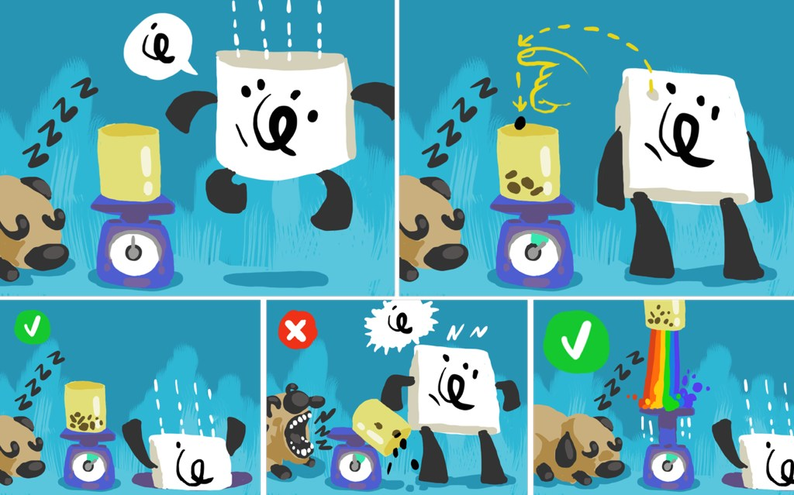

# MiniGame: Sick Letters

## Testing procedure
Total tests: 1
- Variations
    1. SickLetters
- Difficulty Levels: ininfluent

### Shared Difficulty
- Timer decreases
- Number of wrong letters increases
- Vase width increases
- Letters dance at higher difficulties

### Shortcuts
_none_

## Variations
### 1. Scanner
Player must find the correct letter.

#### Difficulty
Ignored

#### Scoring
- 3 stars if...
- 2 stars if...
- 1 star if...
---
### 2. Scanner_phrase
Player must find the correct word.

#### Difficulty
Time to answer decreases with difficulty.

#### Scoring
- 3 stars if...
- 2 stars if...
- 1 star if...
---
## Developer notes

## Issues

## Warnings to be fixed

## Optimization

## Open Questions
a new custom Fonts Atla is used: `EA4S_Arabic DotsOnly SickLetters SDF`. are it really needed? can't it be integrated into the main arabic atlas?
how to correctly generate it?
what's the difference with `EA4S_Arabic DotsOnly DancingDots SDF`?

---

## Game Design Docs

### Objectives

**Pedagogical**: Teach accent and dot positions related to letter and sounds. This game is pedagogically complementary to Dancing Dots.
**Play**: Fill the scale with dots/diacritics (DDs) to reach the heaviest weight.

### Mechanics

**Time-based, with multiple LLs/challenges.**

On the right side of the screen, an LL with a letter falls/jumps-in from the top, saying her letter. The LL has a shitload of DDs positioned around the letter. The player will have to remove all the wrong DDs and throw them in a glass vase (which is over a scale). The aim is to make the vase as heavy as possible.

Antura will be sleeping on the side of the vase, and will bark in case of error.

- When the LL is successfully cleared of all wrong DDs, it will make a HOORAY animation, and a trapdoor will open under her. She will fall into it and a new LL will appear. A new round begins (timer stays the same).
- If a correct DD is removed (meaning the wrong one to remove), the LL will move angrily and shout her letter again. Antura will wake up and bark, tipping the vase, which will fall and lose all the DDs (then disappear with a POOF). The correct DD will move back into place, and the round will continue. The top weight reached is still preserved, but a new vase will fall down from the top and the player will have to restart filling it from scratch.
- If the player drops a DD outside the vase, there will be no penalty, except that the DD will disappear with a small POOF, and no weight will be added to the vase.

**IMPORTANT**: the max weight reached (per game) is always preserved in memory (shown as a colored circle on the scale), so that the final star score will reflect that max weight, and not the one at the endgame. This way, if the player loses all his DDs right before the timer elapses, the game won't be unfair and he will still get a decent score.

### Antura

Antura is sleeping on the side of the vase. In case of error, he will wake up and bark, tipping the vase. Then he will go back to sleep.

### Difficulty variations
#### Gameplay

- Instead of standing idle, the LLs will use dance animations (simple ones) from Dancing Dots, so the player will have to pay attention to what he touches.
- The vase is smaller, so it's harder to drop DDs in it.

#### Pedagogical

- First mistake (dragging the wrong DD) is evidenced by a warning effect, instead of having the DDs container fall immediately.
- No preventive warning.
- More DDs (with or without visual aid).

### Endgame

The game will end when the game timer elapses.

#### Success

If an LL is present, the hatch will open and she will fall inside.
The camera focuses on the vase. The scale pushes it upwards with a strong bounce. The vase disappears followed by a rainbow trail.

#### Failure

**Condition**: minimum weight not met when game timer elapses.
If an LL is present, the hatch will open and she will fall inside.
The camera focuses on the vase, which tips on the side and falls, while Antura howls.
