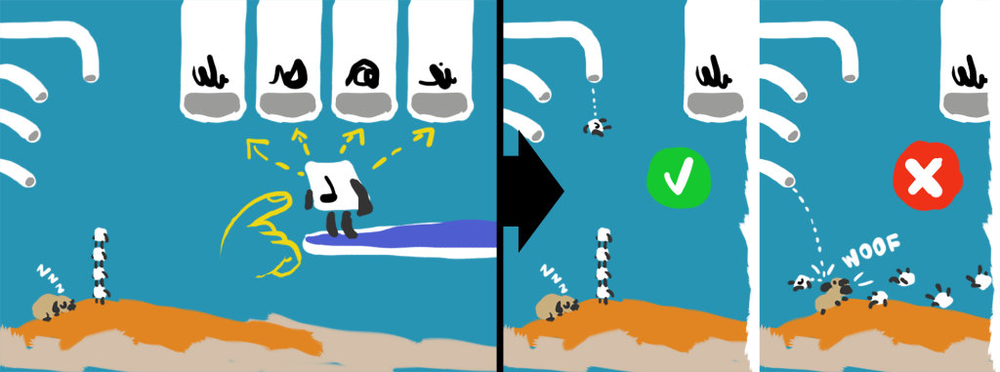

## Testing procedure
Total tests: 3
- Variations
    1. Tobogan_letters
	2. Tobogan_words
- Difficulty Levels: ???

### Shared Difficulty
- ????? (TODO, not clear)

### Shortcuts
_none_

## Variations
### 1. Tobogan_letters
Player must find the correct letter.

#### Scoring
- 3 stars if...
- 2 stars if...
- 1 star if...
---
### 2. Tobogan_words
Player must find the correct word.

#### Scoring
- 3 stars if...
- 2 stars if...
- 1 star if...
---
## Developer notes

## Issues

## Warnings to be fixed

## Optimization

## Open Questions
- Explain difficulty use

---

## Game Design Docs

**Pedagogical Objectives**: Identify a letter in a word, differentiate letter among others.
**Play Objectives**: Build the highest LL tower possible by dropping the LL in the correct pipe.

### Mechanics + Visuals

**Camera**: full-frontal (nudity included).

A series of pipe entrances with various words (one each) and an LL on a trampoline with a letter. Player must drag the LL to a pipe. The pipe will then throw it on a small island/dune/whatever (check visual theme for this). On the island, Antura sleeps on one side.

On the trampoline, the letters advance like Lemmings. If you don't catch & drag the first letter to a pipe it will fall down and a time malus will happen.

- **Time-based**. The player must drop the LL in the right pipe as fast as possible. More correct pipes in a row equal to higher LL tower.
- **Right pipe** (LL's letter was part of the pipe's word): The LL falls vertically on the island, on top of any previous LL, raising the LL tower level.
- **Wrong pipe**: The LL is thrown from a side-pipe-exit and hits Antura (see Antura paragraph). All LLs are lost in the sea, and the LL tower must be restarted (but the current highest level reached is kept for the score).

**NOTE**: The pipes will have to exit and re-enter the screen, so the player can't just associate a pipe to its exit.

### Antura

When hit by an LL, Antura wakes up and runs around the island, throwing down all the current LLs. Then he goes back to sleep. Must be a very quick animation (Antura's I mean, the LLs falling can even take a little while).
Feedback

When Antura scares the LL tower, the piled LLs start oscillating until they fall, bounce around and then disappear with a POOF.

### Difficulty variations
#### Gameplay
#### Pedagogical

### Endgame

The game will end when the game timer elapses.

#### Success

The pipes disappear and we focus only on the LL tower. Based on the level/stars reached, a different type of bird might land on the top LL: canary, parrot, eagle _(to discuss)_.

#### Failure

**Condition**: minimum height not met when game timer elapses.

If there's some piled LLs they fall into the sea. Antura sits and howls to the sky.

### Variations

Only two pipes with SUN and MOON. Player must associate LL correctly.
