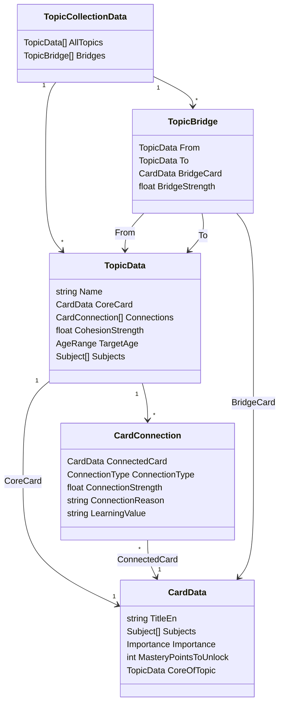

# Knowledge Graph (Discover)

## What it is

The Discover module represents world knowledge as a graph of typed, weighted relationships:

- **Cards** (`CardData`) — the *knowledge atoms*: a single fact/place/person/object/event with title, description, media, age range, `Subjects` tags, and an optional Wikipedia reference.
- **Topics** (`TopicData`) — the *knowledge molecules*: one core `CardData` plus a set of `CardConnection`s to other cards, each typed, weighted, and annotated with why the connection matters pedagogically.
- **Bridges** (`TopicBridge`) — edges between two Topics via a connecting card, held in `TopicCollectionData`.



`ConnectionType` (`CardConnection.cs`) is the relationship vocabulary: `CreatedBy`, `LocatedIn`, `IsA`, `PartOf`, `MadeOf`, `TimeContext`, `CulturalContext`, `Causal`, `Purpose`, `Compare`, `RelatedTo`. Each type also carries a `Directionality` (directed vs. symmetric), already computed by `CardConnection.GetDirectionality()`.

### Example: a Topic as a Mermaid graph, with thumbnails

Any Topic can be rendered directly as a Mermaid `flowchart`, using `ConnectionType` as the edge label and `Directionality` to pick `-->` (directed) vs `---` (symmetric) — connection *strength* is left off the diagram, it clutters the picture without adding much at a glance (it's still in the underlying data for anyone who needs it). Mermaid v11 — this site pins `mermaid: ^11.4.1` in `package.json` — supports a native **image node shape**: `id@{ img: "url", label: "text", w: 80, h: 80, constraint: "on" }`. All three examples below are **real** topics, not placeholders — connection types and thumbnails come straight from the matching `.asset` files.

#### Topic: Eiffel Tower (`eiffel-tower`)

```mermaid
flowchart TD
    Core@{ img: "../../../assets/img/content/cards/eiffel_tower.jpg", label: "Eiffel Tower (core)", w: 90, h: 90, constraint: "on" }
    Gustave@{ img: "../../../assets/img/content/cards/gustave_eiffel.jpg", label: "Gustave Eiffel", w: 70, h: 70, constraint: "on" }
    Paris@{ img: "../../../assets/img/content/cards/capital_paris.jpg", label: "Paris", w: 70, h: 70, constraint: "on" }
    Iron@{ img: "../../../assets/img/content/cards/iron_material.jpg", label: "Iron", w: 70, h: 70, constraint: "on" }
    Map@{ img: "../../../assets/img/content/cards/eiffel_tower_map.jpg", label: "Tower map", w: 70, h: 70, constraint: "on" }
    Ticket@{ img: "../../../assets/img/content/cards/eiffel_tower_ticket.jpg", label: "Ticket", w: 70, h: 70, constraint: "on" }

    Core -->|"CreatedBy"| Gustave
    Core -->|"LocatedIn"| Paris
    Core -->|"MadeOf"| Iron
    Core ---|"RelatedTo"| Map
    Core ---|"RelatedTo"| Ticket
```

#### Topic: Baguette (`baguette`)

```mermaid
flowchart TD
    BCore@{ img: "../../../assets/img/content/cards/food_baguette.jpg", label: "Baguette (core)", w: 90, h: 90, constraint: "on" }
    Baker@{ img: "../../../assets/img/content/cards/person_baker.jpg", label: "Baker", w: 70, h: 70, constraint: "on" }
    BParis@{ img: "../../../assets/img/content/cards/capital_paris.jpg", label: "Paris", w: 70, h: 70, constraint: "on" }
    Flour@{ img: "../../../assets/img/content/cards/food_flour.jpg", label: "Flour", w: 70, h: 70, constraint: "on" }
    Salt@{ img: "../../../assets/img/content/cards/food_salt.jpg", label: "Salt", w: 70, h: 70, constraint: "on" }
    Water@{ img: "../../../assets/img/content/cards/food_water.jpg", label: "Water", w: 70, h: 70, constraint: "on" }
    Yeast@{ img: "../../../assets/img/content/cards/food_yeast.jpg", label: "Yeast", w: 70, h: 70, constraint: "on" }

    BCore -->|"CreatedBy"| Baker
    BCore -->|"LocatedIn"| BParis
    BCore -->|"MadeOf"| Flour
    BCore -->|"MadeOf"| Salt
    BCore -->|"MadeOf"| Water
    BCore -->|"MadeOf"| Yeast
```

#### A bigger topic, with Cards linked to Subjects: Solar System (`solar_system`)

Eiffel Tower and Baguette are small, curated topics (5-6 connections). `solar_system` (PL_07 quest) is one of the bigger real topics — 11 connections, one per planet plus a few concept cards — and it's a good candidate to also show the **Subjects idea from the "Direction under discussion" section**: each Card already carries a `Subjects` tag list (decoded from `CardData.Subjects` — Space, Science, History, Culture, Geography, Environment, Education show up here), which is effectively a SKOS-like taxonomy layer sitting *underneath* the associative Card↔Card graph. Rendered together, it's easy to see most planet cards cluster under Space+Science, while a few (Neptune, Earth, Planetarium, the Heliocentric Model) branch into History, Culture, Geography, Environment or Education — exactly the kind of thing a `Subjects`-driven view is for. Subject nodes get a distinct hexagon shape and dotted edges (no thumbnail — a Subject isn't a card) so the taxonomy layer reads as clearly separate from the content graph:

```mermaid
flowchart TD
    Core@{ img: "../../../assets/img/content/cards/solar_system.jpg", label: "Solar System (core)", w: 90, h: 90, constraint: "on" }
    Mercury@{ img: "../../../assets/img/content/cards/mercury.jpg", label: "Mercury", w: 60, h: 60, constraint: "on" }
    Venus@{ img: "../../../assets/img/content/cards/venus.jpg", label: "Venus", w: 60, h: 60, constraint: "on" }
    Earth@{ img: "../../../assets/img/content/cards/earth.jpg", label: "Earth", w: 60, h: 60, constraint: "on" }
    Mars@{ img: "../../../assets/img/content/cards/mars.jpg", label: "Mars", w: 60, h: 60, constraint: "on" }
    Jupiter@{ img: "../../../assets/img/content/cards/jupiter.jpg", label: "Jupiter", w: 60, h: 60, constraint: "on" }
    Saturn@{ img: "../../../assets/img/content/cards/saturn.jpg", label: "Saturn", w: 60, h: 60, constraint: "on" }
    Uranus@{ img: "../../../assets/img/content/cards/uranus.jpg", label: "Uranus", w: 60, h: 60, constraint: "on" }
    Neptune@{ img: "../../../assets/img/content/cards/neptune.jpg", label: "Neptune", w: 60, h: 60, constraint: "on" }
    Helio@{ img: "../../../assets/img/content/cards/heliocentric_model.jpg", label: "Heliocentric Model", w: 60, h: 60, constraint: "on" }
    Astro@{ img: "../../../assets/img/content/cards/astronomy.jpg", label: "Astronomy", w: 60, h: 60, constraint: "on" }
    Planetarium@{ img: "../../../assets/img/content/cards/planetarium.jpg", label: "Planetarium", w: 60, h: 60, constraint: "on" }

    Core ---|"RelatedTo"| Mercury
    Core ---|"RelatedTo"| Venus
    Core ---|"RelatedTo"| Earth
    Core ---|"RelatedTo"| Mars
    Core ---|"RelatedTo"| Jupiter
    Core ---|"RelatedTo"| Saturn
    Core ---|"RelatedTo"| Uranus
    Core ---|"RelatedTo"| Neptune
    Core ---|"RelatedTo"| Helio
    Core ---|"RelatedTo"| Astro
    Core ---|"RelatedTo"| Planetarium

    Space{{"Subject: Space"}}
    Science{{"Subject: Science"}}
    History{{"Subject: History"}}
    Culture{{"Subject: Culture"}}
    Geography{{"Subject: Geography"}}
    Environment{{"Subject: Environment"}}
    Education{{"Subject: Education"}}

    Core -.-> Space
    Core -.-> Science
    Mercury -.-> Space
    Mercury -.-> Science
    Venus -.-> Space
    Venus -.-> Science
    Earth -.-> Space
    Earth -.-> Science
    Earth -.-> Geography
    Earth -.-> Environment
    Mars -.-> Space
    Mars -.-> Science
    Jupiter -.-> Space
    Jupiter -.-> Science
    Saturn -.-> Space
    Saturn -.-> Science
    Uranus -.-> Space
    Uranus -.-> Science
    Neptune -.-> Culture
    Neptune -.-> History
    Helio -.-> Space
    Helio -.-> Science
    Helio -.-> History
    Astro -.-> Space
    Astro -.-> Science
    Planetarium -.-> Space
    Planetarium -.-> Science
    Planetarium -.-> Education

    classDef subject fill:#fff3cd,stroke:#c9a227,color:#5c4a00,stroke-width:1px;
    class Space,Science,History,Culture,Geography,Environment,Education subject;
```

Note this is *every* connection and *every* Subject tag pulled straight from `solar_system.asset` and each planet card's `Subjects` field — nothing trimmed for the example. That's also an honest data-quality observation worth carrying into "Open questions": every one of these 11 connections is typed `RelatedTo` (the catch-all), unlike Eiffel Tower/Baguette which use specific types — bigger topics in the current dataset tend to be less precisely typed, probably because they were authored earlier or faster. Tightening those types would make templated quiz generation (see "Direction under discussion") meaningfully better for this kind of topic.

> **Path caveat — read before relying on this.** These relative paths (`../../../assets/img/content/cards/...`) resolve fine in local `vitepress dev` preview, since that folder exists on disk at the matching depth. They are **not guaranteed to survive a production build**: unlike a normal Markdown `` image, a URL string sitting inside a Mermaid code fence is plain text to Vite — it never gets rewritten into the hashed `dist/assets/*.jpg` the same image already becomes when the Cards index page renders it. The robust fix is to keep a stable, unhashed copy of thumbnails under `docs/public/` (e.g. `docs/public/img/cards/…`) and point Mermaid diagrams at *that* path — `public/` is served byte-for-byte in both dev and the built site. Worth a quick local preview to confirm before leaning on this for every topic page; if it's useful broadly, `CardExportUtils.cs` could drop a `public/`-served copy automatically alongside the existing one.

This is the concrete answer to "how do we put thumbnails in the graph": Mermaid's image-shape nodes, pointed at a stable (`public/`) image path. A small exporter walking `TopicData.Connections` (and, for the Subjects layer, each `CardData.Subjects`) could emit one of these blocks per topic automatically, letting `TopicExportUtils.cs` embed a live thumbnail graph on every topic's page in `docs/<lang>/content/topics/` — since this site (VitePress) already renders Mermaid (see `docs/en/dev/mermaid-example.md`).

## What already exists

| Piece | Status |
|---|---|
| In-editor graph visualization | **Done.** `TopicGraphWindow` (`Antura/Topic/Topic Graph` menu) — pan/zoom cluster view of topics, cards, connections and bridges, with filters by importance/connection type. |
| Markdown publishing | **Done.** `TopicExportUtils` / `CardExportUtils` → `docs/<lang>/content/topics/` and `.../cards/`, listing connections in prose. |
| CSV round-trip for authoring | **Done.** `CardDataExchangeUtility` exports/imports `CardData` fields (not yet connections) via CSV for bulk editing. |
| Mermaid diagrams per topic | **Not yet built.** Straightforward extension of `TopicExportUtils`. |
| Portable JSON graph export | **Not yet built.** No nodes/edges JSON exists today; everything lives only as ScriptableObjects + generated Markdown. |
| Standards alignment | **Not yet started.** No mapping to any external education vocabulary/ontology. |
| Quiz/assessment generation from the graph | **Not yet started.** `MasteryPointsToUnlock` exists as a per-card gate, but nothing yet turns a `CardConnection` into a testable question. |

## Direction under discussion

The core idea: a `CardConnection` (subject–relation–object, with a stated `LearningValue`) is already a *testable proposition* in the concept-mapping sense (Novak & Cañas) — comprehension checks can be generated from the graph itself rather than authored separately.

**1. Portable JSON export.** A nodes/edges JSON (Cytoscape.js-style — the convention most free web graph tools already read/write) as the interchange format, exported from `TopicCollectionData` alongside the existing Markdown/CSV exports. An optional `@context` block can map `ConnectionType` values to real vocabulary terms where one exists (e.g. `PartOf` → `dcterms:isPartOf`, `LocatedIn`/`CreatedBy` → Wikidata-style properties, which pairs naturally with the `WikipediaUrl` field already on `CardData`).

**2. Standards to track, not necessarily adopt wholesale:**
   - **1EdTech CASE** (JSON-LD competency/standards graphs) — structurally close (document → item → typed association) but its 14 association types don't cover `Causal`/`MadeOf`/`Compare`/`CulturalContext` without losing meaning.
   - **W3C SKOS** — good fit for the `Subjects` taxonomy (broader/narrower/related), weak fit for the weighted associative Card graph.
   - **IMS/1EdTech QTI 3.0** — the standard for the assessment items themselves (XML, not JSON); a plausible *export* target once quiz generation exists, for interoperability with school LMSs.
   - **xAPI** — JSON-native statements for recording quiz attempts/evidence of understanding, closing the loop back into mastery tracking.
   - Existing free tools if a CASE-like shape is adopted: **OpenSALT** (tree/hierarchy browser+editor) and **CASS** (more graph-like competency system) — potentially avoids building a bespoke web viewer at all.

**3. Quiz generation templates**, one per `ConnectionType` (e.g. `MadeOf` → "What is X made of?", `IsA` → "What kind of thing is X?", `Causal` → "What causes X?"), with distractors drawn from graph structure (sibling cards under the same relation/subject). `ConnectionReason` and `LearningValue` become the answer explanation for free.

**4. Formalizing progression.** Marking a subset of `ConnectionType`s (e.g. `PartOf`, `IsA`, `MadeOf`) as prerequisite-bearing would turn the graph into a partial order over knowledge states (Knowledge Space Theory) — a more rigorous backbone for `MasteryPointsToUnlock` than a flat point count, and a stronger claim for external reviewers about adaptive, validated learning.

## Open questions for next session

- [ ] Finalize the JSON node/edge schema (field names, `@context` scope).
- [ ] Decide which `ConnectionType`s are prerequisite-bearing vs. purely associative.
- [ ] Prototype the Mermaid-per-topic exporter (cheapest win, reuses existing publish pipeline).
- [ ] Decide the quiz-item schema and where generated items are stored/reviewed.
- [ ] Evaluate OpenSALT/CASS as an off-the-shelf topic browser before building a custom one.
