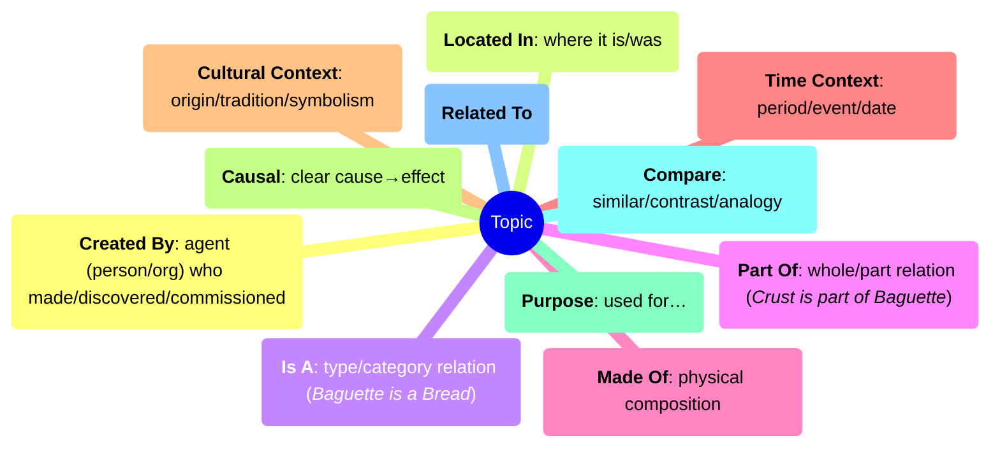

# Discover Cultures details

## Content

### Words

We start from all the words of the [Learning Language Module](./learnlanguage_module.md).

Words are presented by Living Letters (LL) that speak the words when interacted with and are evidenced in the dialogs. This reinforces language learning in a fun, contextual way.  

> [!note] Words database
> The current list of [all words in the game](../content/words/index.md)

### Cards
At the heart of each quest are Cards, which represent an "atom of knowledge" like facts, people, places, objects, traditions, foods, fauna, and flora.

Each card:

- has a **title** and a simple **description**
- has at least one **images** and can have **sounds**
- is located in space (in a city, for example) and time (allowing country timelines)
- remain **hidden until discovered** and unlocked in quests
- is always accessible from the player's Book.

Each card is of one **Type**, like:

- **Place** (WHERE) - Cities, rivers, mountains, landmarks
- **Event** (WHEN) - Historical events, holidays, festivals
- **Person** (WHO) - Historical figures, teachers, friends
- **Object** (WHAT) - Items to interact with or collect
- **Concept** (THINK) - Abstract ideas (friendship, safety, peace)
- **Activity** (DO) - Games, cooking, sports

and is linked to One or more **Subject**:

Core subjects:

- **Art** - making and creating
- **Culture** - how people live
- **Geography** - where things are
- **History**
- **Literature** - stories and books
- **Math** - numbers and logic
- **Science** - how things work
- **Technology** - applied science

Additional subjects:

- **Animal**
- **Food**
- **Music**
- **Plant**
- **Recreation** - leisure & hobbies: dance, crafts, hiking, games
- **Space**
- **Sport**
- **Transportation** - cars, planes, boats
- **Weather**

Social and practical life:

- **Civics** - basic government and citizenship
- **Community** - when people organize and help each other locally
- **Education** - schools
- **Environment**  - caring for nature
- **Family**
- **Friendship**  - important social concept
- **Health** - medicine, hospitals
- **Money** - basic financial literacy
- **Safety**
- **Time** - understanding clocks/calendars

> [!note] Cards database
> The current list of [all cards in the game](../content/cards/index.md)

### Topics
Topics are defined by educators by connecting a set of cards, defining the relationships and forming a **visible knowledge graph**.

These graphs are the core of the didactical activities. They are easy to explore and understand: kids can review how cultural elements relate, and quests and activities can run on them.

These are the kind of connections currently available in the game:

> [!note] Topics database
> The current list of [all topics in the game](../content/topics/index.md)

## Quests

Quests are short (5–15 minutes) adventures focusing on cultural or educational themes, usually 1–2 **topics**.

Each quest combines:

- exploration of authentic places
- meeting characters
- solving puzzles and mini-games
- collecting cultural elements (**Cards**)

- Two play levels:
    - The first run exposes essential content only.
    - Replay enables extra tasks, hidden items, and special card fragments to unlock a final gem.

### Story and Gameplay
Each quest is a different story and can have different challenges, like:

- **Hidden Objects**: find items with hints from NPCs/signs
- **Collection**: gather all items (math reinforcement)
- **Physical puzzles**: mazes, spatial tasks
- **Story-driven**: linear narrative quests with narrator
- **Cultural quizzes**: NPCs asking about discovered items
- **Mini-games**: crafts, sports, or cultural practices

### Characters

**Living Letters (LL)**
Are the main companions known in the Learning Language modules. They tie words to NPCs.
They can represent:

- a letter (small LL)
- a word with its drawing (normal LL)
- a card (image or sounds)

**Blocky Characters**
Humanoid / Minecraft‑like characters.

**Ambient NPCs**
Pigeons, cats, dogs, cars, trains, birds (AI‑driven).  

### Tasks
"What do I have to do?" is simplified with Tasks.
When talking to characters the player is given objectives to accomplish, like

- collect items (collect all ingredients for a recipe)
- reach a position (climb Mont Blanc or the Eiffel Tower)
- trigger an action (lower the castle's bridge)

### Progress system

- Quests end with 1–3 stars depending on errors.  
- Bonus/malus events affect progress.  

### Special Cards

Replaying quests may reveal fragments of special cards, leading to the final gem of the quest.

Once mastered, repeating gives cookies but not gems.

### Activities

Activities can be embedded in quests or played separately from the Book and deal with topics.

> [!note]
> One of the new features of our framework is that these activities can be asked to reinforce a topic, and automatically fetch cards to be played.

- **Order**: put elements in sequence
- **Piano**: repeat melodies/colors
- **Canvas**: clean to reveal images
- **Money**: count coins and notes
- **Jigsaw Puzzle**: cultural images
- **Memory**: card matching
- **Quiz**: text, image, or mixed answers
- **Final Assessments**: formal checks after quests

Explore all activities: [Activities overview](../content/activities/index.md).

### Languages
All dialogues are bilingual: the child’s native language + the host country’s language (e.g., Polish, French).
This makes it easier for children to follow the story while learning new words and phrases.

By default the game speaks the learning language first, then the native language, but a teacher can choose the inverse if it's better for the child.

### Difficulty levels

All gameplay and content is classified in three difficulty levels:

- Easy
- Normal
- Expert

Teachers can adjust difficulty in the Teacher Panel to adapt timing, hints, and challenge density to the learner’s level. Some quests also unlock extra optional tasks on replay for advanced learners.

### Locations
Each quest is located in a specific location (usually a city or a part of a city) selectable in the worl map.
They are build with two methodologies:

1. **Abstract art**  
Designers build generic environment using common 3D models. Good for common topics that are not aboslutely linked to a geographic position.

2. **Realistic maps**  
The city are build starting from a realisti map (from [OpenStreetMap](https://www.openstreetmap.org)), with defined GPS coordinates and orientation.
This scenarios are best for real "urban" quests where orientation matters.

## Gameplay

### Earth Menu

Entry point to explore world, countries, and quests.  
Access to the Book (review knowledge) and the Store (customization).  

**Dependencies**  
Quests can require prior quests as knowledge prerequisites.  

### Map and target points

- Map button shows your position and the main objective.  
- A **target** marker points to the next goal; hints appear when objectives change.  
- Optional tasks and hidden items may appear as extra icons.  

### Interactions and inventory

- Interactions: Talk, Inspect, Collect, Use.  
- Inventory: up to 5 slots; items auto‑use when needed and disappear after use.  

### Modes (Classroom vs Home)

- In Classroom Mode the focus on one country/topic and quests freely selectable within it.  
- Home Mode: all countries selectable and quests are typically unlock sequentially for exploration.  

### Accessibility

- Subtitles and icon prompts support early readers and multilingual play.  
- Classroom mode reduces noise
- All sentences are spoken in all languages
- We use and color and shape and sound marks

### Devices and controls

Works with keyboard/mouse and touch. See [How to Play](./discover_how_to_play.md) for controls, map, interactions, and the activities gallery.  

## Motivation and rewards

- Knowledge cards = collected evidence of learning.  
- Gems = unlock advanced quests and some props.  
- Cookies = customize the character and space.  
- Stars = motivate to complete and replay.  
- Achievements = long‑term goals and fun challenges.

### Currencies

- Cookies (fish) = found in quests; they regenerate over time.  
- Knowledge Gems (neurons) = mastery rewards for completing tasks and unlocking cards; represent the **real learning progress**.
- XP Points = experience accumulated by playing; used for progression.

### Store / Cat customization

- Use cookies to buy skins and props for the cat.  
- Some props unlock only after achieving certain gems or cards.

### Achievements
Global and local achievements encourage replay and engagement.  
Examples:

- Collect all cards
- Buy cosmetics for the cat
- Finish all quests
- Mastery goals (finish with 3 stars everywhere)
- Fun goals (jump 1000 times, sprint 60s, talk to everyone)

### Bonus/malus system
Reinforces **good citizenship and cultural awareness** by rewarding some actions.

- Bonus examples: talking to NPCs, respecting traffic lights, collecting rubbish.  
- Malus examples: crossing on red, damaging property, stepping on flowers.  

These actions are logged in the Book as part of reflection on behavior.  

## Teacher and parent tools

### Teacher panel

- create a class and add players
- for each player, adjust difficulty, choose language mode, and monitor quests and achievements  

### The Book
Reviews all collected knowledge.  
Shows all discovered and undiscovered cards, gems, and achievements.
Acts as a review tool for classroom or home learning.

### Website
Shows topics, cards, and activities covered in a session.  

### Classroom integration

After a quest, teachers can:  

- Rebuild the knowledge graph with students.  
- Extend it with new ideas or student contributions.  
- Retell the quest in class.  
- Compare with real‑life resources (maps, books, visits).  

Example debrief (10 minutes):  

- Ask: “Which card did you unlock? What does it connect to?”  
- On the board, draw “Baguette → Bread → French food” and invite students to add related ideas.  
- Quick pair‑share: each student explains one new word and where it appeared.  

### Analytics

> [!note]
> We care about privacy and anonymity. We collect gameplay data without linking it to personally identifiable information.  
> Linking students to profiles (if needed) is managed by the teacher according to school policies.

- Logs gameplay events (play time, quest attempts, bonus/malus, card collection).  
- Data can be exported in a simple format for manual evaluation (JSON) or automatic (xAPI).  
- In class, teachers see simplified summaries (progress, cards, achievements).  

## Quest design

- Defined with the open‑source AdventurED framework.  
- Designed via the DiscoverED web tool:  
  - visual editor for quest flows (story + tasks + quizzes)  
  - built‑in translation in multiple languages  
  - collaborative content creation with teachers  

Docs: Quest Design — https://docs.antura.org/manual/quests/

### Licensing and credits

- Assets are custom‑made or Creative Commons (CC0/CC‑BY).  
- Credits are tracked for external resources (images, sounds, models).  
