# Setup

> [!note]
> The game is identical on all platforms so the following instructions are valid for any device you use to play.

## First Steps

When launching the game the first thing you are asked is your native language. 
Currently a dozen native languages are supported.

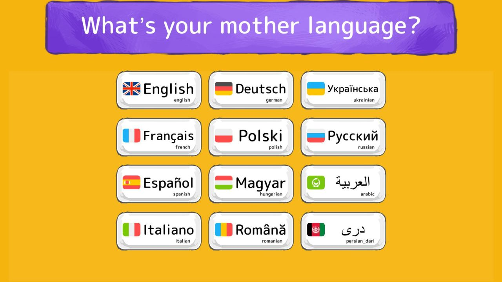

Then you follow the instructions to create your first profile.

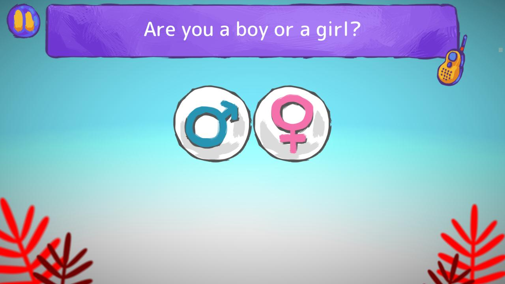

You are asked about your native language only the first time you start the game, but you can always change it by pressing the language button on the top-right corner.

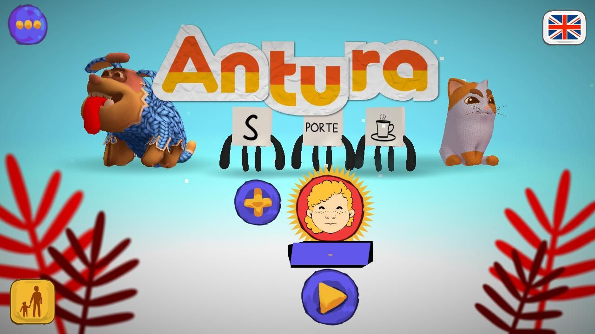

> [!note]
> Antura can be used by educators in the classroom or by families for the autonomous learning at home (or wherever they are). But, since we are currently testing several new features in France and Poland within the mark of the ANTURA Erasmus+ project, the following section focuses on educators using the game in their classrooms.

## Teachers Area

If your students are divided in groups/classes, the first thing you should do is to select the class.
Press the button in the bottom-left corner, then follow the instructions to access the Teachers Area.

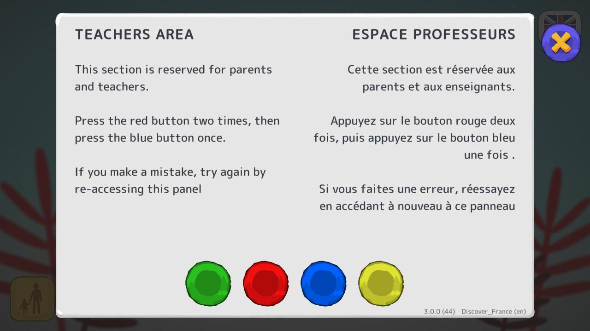

## Class Selection

Once in the Teachers Area, you can "Change Class": the different classes are defined by a letter (A, B, C...) or a number (1, 2, 3...). 

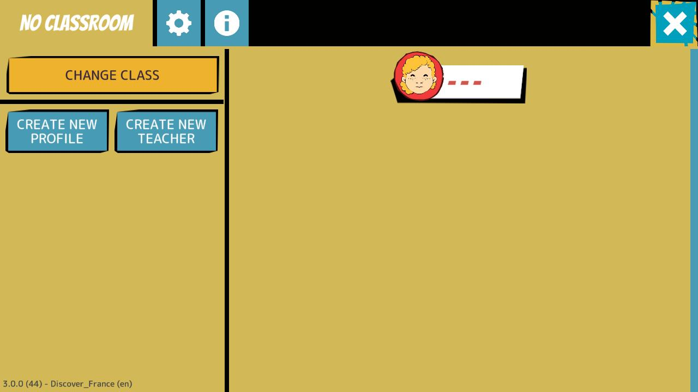

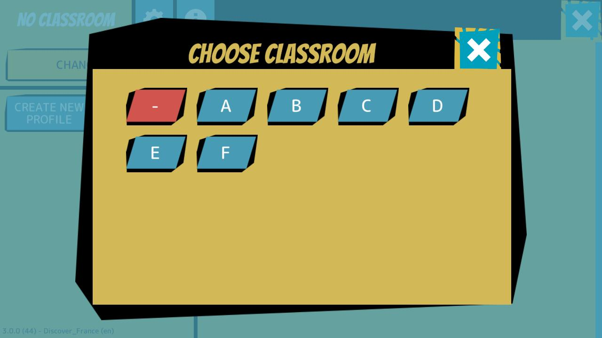

> [!note]
> By default the game starts in class "-" that means "no classroom", but for the proper usage in the classroom better you always have a selected class.
Please, assign a unique letter or number to each one of your groups/classes and note it down, because you will need to select it every time you use Antura with a specific group/class.

## Creating Students Profiles

Once selected the first class, you’ll notice that the class is empty, 

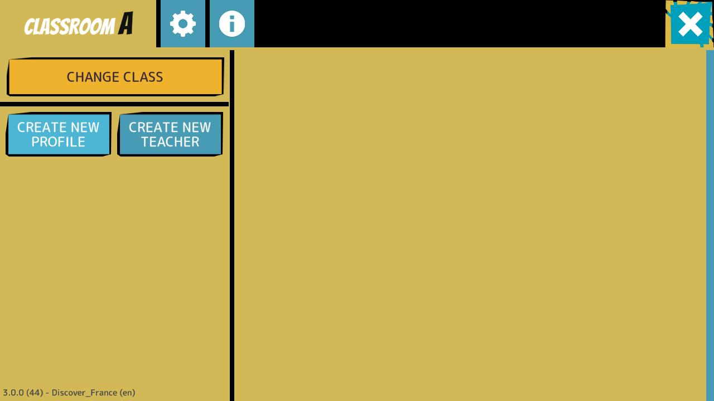

Press “Create New Profile” to add a student to this class, then follow the instructions on screen.
This is the student profile, so it would be great if he/she could help you create it. 

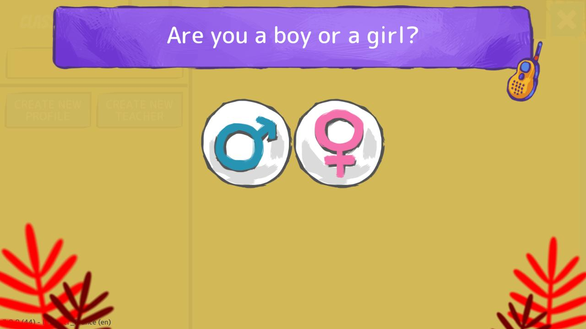

## Editing Students Profiles Names

Once the profile is complete, it will appear in the class, but without a name. 

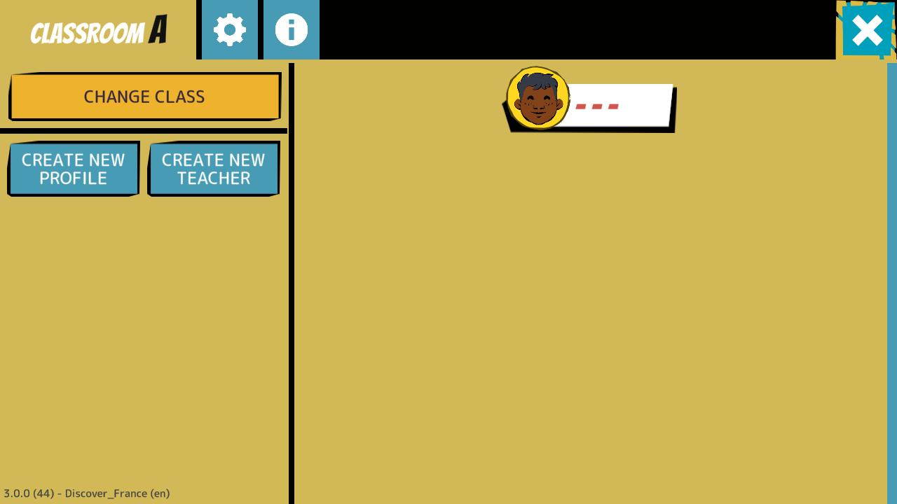

You can now select the profile (pressing its icon or its name)...

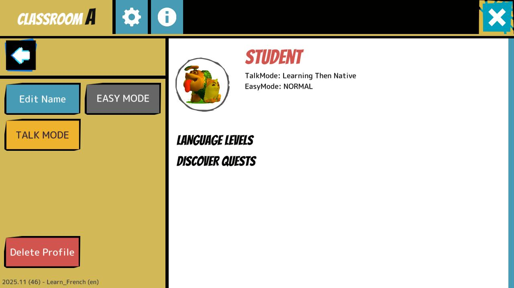

… and then define its name by pressing “Edit Name”.

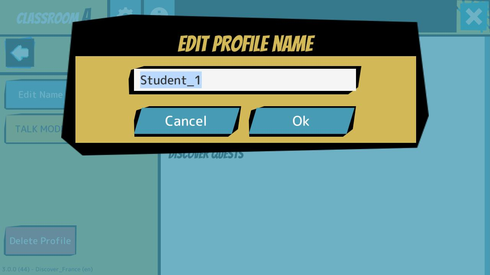

## Editing Students Profiles Settings

You can also enable “EASY MODE” (to reduce the difficulty of the game for this specific student) and select the “TALK MODE” (meaning which languages should the game use for this specific student).

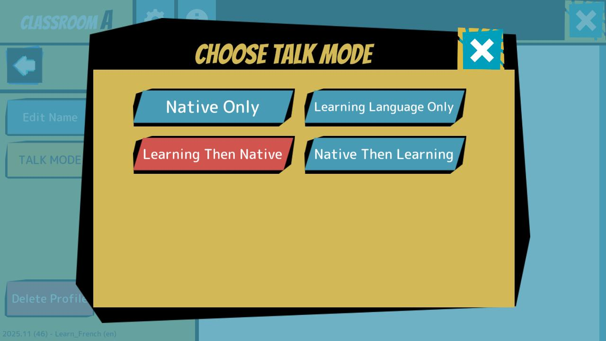

The available options are:  

- **Don’t Talk**: no voiceover is played and the student has to read everything in the learning language (i.e. French or Polish)
- **Learning Language Only**: the game uses only the learning language (i.e. French or Polish)
- **Native then Learning**: the game uses first the native language and then repeats in the learning language
- **Learning then Native**: the game uses first the learning language and then repeats in the native language
- **Native Only**: the game uses only the native language

> [!IMPORTANT NOTE]
> All profiles are only saved locally in the device in which they have been created, so each student must always use the same device in order to use his/her own profile. Most likely, on each device you will need to create one single profile __per class__ because the device will always be used by the same student when you are in that class!

## Getting Ready to Play

Once you have finished creating and editing the profile for your class, you can go back to the main menu by pressing the back arrow on the left and the X button on the top-right corner of the screen.

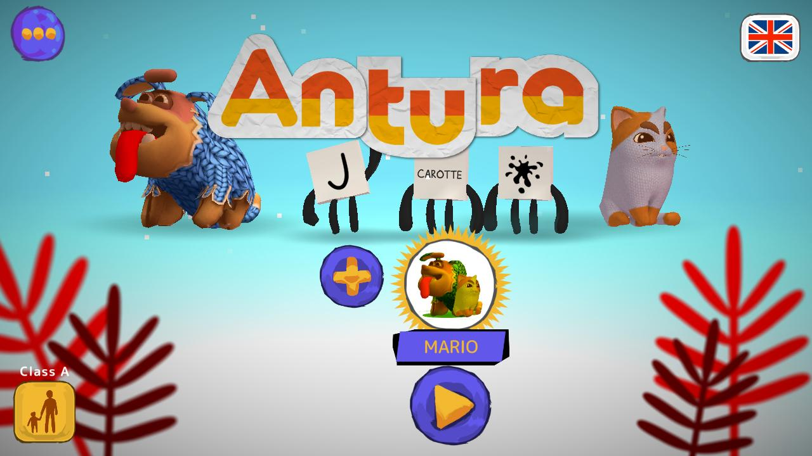

> [!Reminder]
> Before letting a student play, you should set his/her native language by pressing the button in the top-right corner.

## Selecting What to Learn

Press the Play button below the active profile to select what you want to learn.
The game offers a list of books and you can scroll among them sliding the screen right or left.
Each book represents a different curriculum, a collection of content to learn about a specific subject. The game currently supports 2 main types of curriculums:

- **Learn Languages**: an introduction to a foreign language
- **Discover a Country and its Culture**: to help the integration of migrant kids in the host country

> [!note]
> In Arabic and Persian you can also **Learn to Read** in your mother language, but this literacy curriculum has lots in common with **Learning a Language** so we will focus on the latter in this manual.

For the testing of the ANTURA Erasmus+ project in France and Poland we will focus on 4 books:

- Discover France and Learn French
- Discover Poland and Learn Polish

The following sections explain in detail both [Learn Languages](./learnlanguage_module.md) and [Discover Culture](./discover_introduction.md) modules, apart from presenting a guide of [How to use them in the Classroom](./classroom_guide.md)

