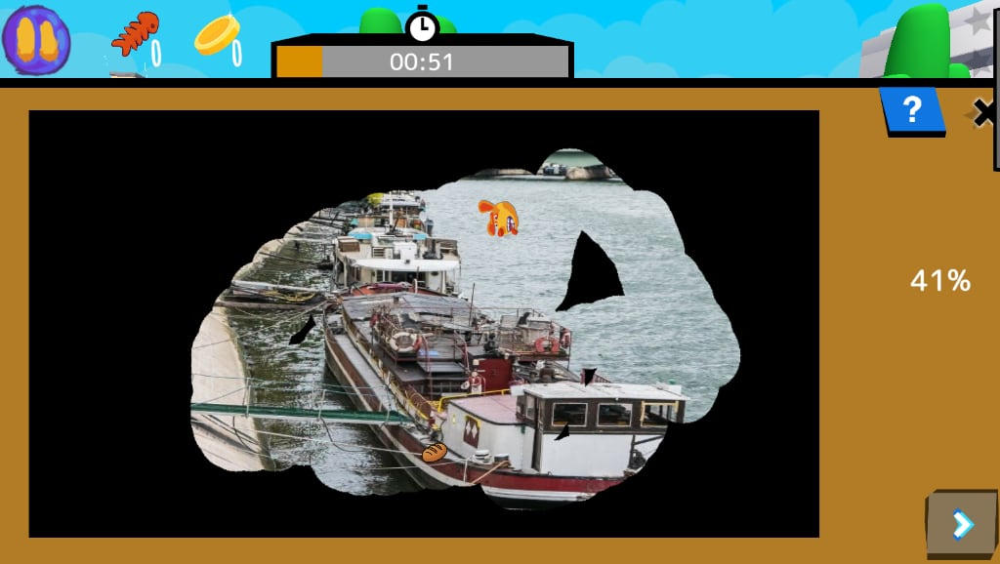
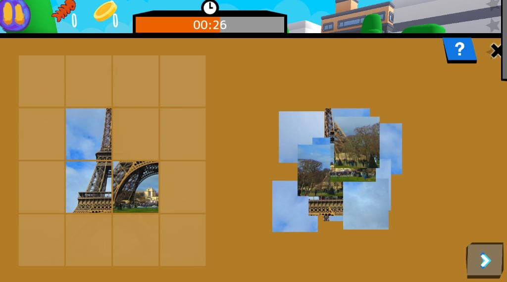

# Activities

## Toile

Nettoyer toute la surface

Categories:

  - **Coordination**: Contrôler des mouvements précis et le timing.
  - **Observation**: Repérer des détails et des motifs dans des images/scènes.
  - **Attention**: Se concentrer sur l’information utile et ignorer les distractions.

Skills:

  - **Coordination et timing**:  drag
  - **Motricité fine**: Réaliser de petits mouvements précis des mains/doigts.
  - **Attention partagée**: Gérer plusieurs tâches ou sources en même temps.
  - **Discrimination visuelle**: Repérer de petites différences et apparier.

A 2D minigame where the player is tasked with dragging a finger across the screen to clean a canvas. There will be obstacles scattered around the screen, moving between two points at varying speeds depending on the difficulty. If the player touches at least 1 of them, a point will be deducted once the minigame is finished (the amount of points deducted does not increase as the player makes more mistakes). A point will also be deducted upon skipping the minigame. There may be treasures hidden under the line: when the player traces over them, they are revealed and glow a little. The player can pick them up by tapping them.
Input Variable: Background image and the images of the moving obstacles

Credits:
  - Valeria Passarella (Italy)
  - [Stefano Cecere](https://stefanocecere.com) (Italy)

## Puzzle

Remettre les pièces en place

Categories:

  - **Résolution de problèmes**: Analyser des situations et trouver des solutions efficaces.
  - **Observation**: Repérer des détails et des motifs dans des images/scènes.

Skills:

  - **Raisonnement spatial**:  assemble
  - **Visualisation**: Imaginer objets et actions en esprit.
  - **Discrimination visuelle**: Repérer de petites différences et apparier.
  - **Planification**: Choisir des étapes et un ordre pour atteindre un but.

Goal: Remember pictures better by interacting with them and not just looking at them
gameplay: Reconstructing an image based on parts of it Moving objects with  your cursor / mouse
Input Variable:  image 

Credits:
  - Vieri Toti (Italy)
  - [Stefano Cecere](https://stefanocecere.com) (Italy)

## Correspondre

faire correspondre des éléments par un point commun

Categories:

  - **Observation**: Repérer des détails et des motifs dans des images/scènes.
  - **Attention**: Se concentrer sur l’information utile et ignorer les distractions.

Skills:

  - **Mémoire de travail**: Garder peu d’infos pendant un court moment.
  - **Rappel spatial**: Se souvenir d’où sont les choses.
  - **Appariement & association**: Associer des éléments qui vont ensemble.
  - **Attention sélective**: Se concentrer sur la cible et ignorer les distractions.

**goal**: couple the pairs of cards, by similitude, logic, relationship, category

**gameplay**: Drag and drop the items to be "paired" 

**controls**: drag with the finger or the mouse

**input Variables**:

- How many items (from 2 to 7)
- a list of coupled  images

Credits:
  - [Stefano Cecere](https://stefanocecere.com) (Italy)

## Mémoire

le jeu de mémoire classique

Categories:

  - **Mémoire**: Maintenir et actualiser des informations pour les réutiliser.
  - **Observation**: Repérer des détails et des motifs dans des images/scènes.

Skills:

  - **Mémoire de travail**: Garder peu d’infos pendant un court moment.
  - **Rappel spatial**: Se souvenir d’où sont les choses.
  - **Appariement & association**: Associer des éléments qui vont ensemble.
  - **Attention sélective**: Se concentrer sur la cible et ignorer les distractions.

goal: select all the couples of identical images
gameplay: you are given a set of covered images. you click two images to uncover them if they are identical the stay front side. you win when you find them all
input variables: a set of images

Credits:
  - [Stefano Cecere](https://stefanocecere.com) (Italy)

## Compter l'argent

le jeu de mémoire classique

Categories:

  - **Numératie**: Utiliser les nombres et l’argent au quotidien.
  - **Résolution de problèmes**: Analyser des situations et trouver des solutions efficaces.
  - **Mathématiques**: Pratiquer les mathématiques formelles et la résolution structurée de problèmes.

Skills:

  - **Calcul d’argent**: Additionner et combiner pièces/billets jusqu’à un montant.
  - **Calcul numérique**:  subtract
  - **Raisonnement proportionnel**: Comparer des rapports et ajuster des quantités.
  - **Planification**: Choisir des étapes et un ordre pour atteindre un but.
  - **Attention sélective**: Se concentrer sur la cible et ignorer les distractions.

goal: Examine the coins and banknotes given and select the ones that add up to the amount of money requested.
gameplay: the player is tasked with analysing and understanding the value of a sum of coins. The minigame uses a combination of both metal coins and banknotes, so that it may be adapted to the specific currency of many different countries.
  

Credits:
  - Valeria Passarella (Italy)
  - [Stefano Cecere](https://stefanocecere.com) (Italy)

## Commande

mettre les éléments dans le bon ordre

Categories:

  - **Séquençage**: Organiser des éléments dans un ordre logique ou chronologique.
  - **Observation**: Repérer des détails et des motifs dans des images/scènes.

Skills:

  - **Ordre & séquençage**: Mettre des étapes/événements dans le bon ordre.
  - **Appariement & association**: Associer des éléments qui vont ensemble.
  - **Attention sélective**: Se concentrer sur la cible et ignorer les distractions.
  - **Discrimination visuelle**: Repérer de petites différences et apparier.
  - **Planification**: Choisir des étapes et un ordre pour atteindre un but.

**goal**: Find the right sequence of items and drag them in place
**gameplay**: Drag and drop the items in the correct order. 
**controls**: drag with the finger or the mouse

Input Variables:
- How many items (from 3 to 7)
- Items images

Credits:
  - Lorenzo Castrovilli (Italy)
  - [Stefano Cecere](https://stefanocecere.com) (Italy)

## Piano

mémoire séquentielle et répétition. également musicale

Categories:

  - **Musique**:  notes
  - **Mémoire**: Maintenir et actualiser des informations pour les réutiliser.
  - **Attention**: Se concentrer sur l’information utile et ignorer les distractions.

Skills:

  - **Sens du rythme**: Garder la pulsation et reproduire des rythmes.
  - **Mémoire auditive**: Se souvenir et répéter sons ou suites parlées.
  - **Séquençage**: Mémoriser l’ordre d’éléments ou d’événements.
  - **Attention sélective**: Se concentrer sur la cible et ignorer les distractions.
  - **Motricité fine**: Réaliser de petits mouvements précis des mains/doigts.

goal: Play a given melody (by sounds / colors). it can work as a memory game also!
gameplay: We hear a notes sequence and have to repeat it. We press play and hear the sequence and highlight notes. When we press keys, we “play” a sequence. If done properly: we win.

Input Variables:
- Notes sequence
- Scoresheet texture

Credits:
  - [Stefano Cecere](https://stefanocecere.com) (Italy)

