# Cards(fr)

> [!note] Educators: help improving these cards!
> **Comments and feedback**: [discuss in the Forum](https://antura.discourse.group)  
> **Improve translations**: [comment here](https://docs.google.com/spreadsheets/d/1M3uOeqkbE4uyDs5us5vO-nAFT8Aq0LGBxjjT_CSScWw/edit?gid=415931977#gid=415931977)  

Total found: **384**

## International

### Affiche de l'école française {#object_french_school_poster}
{ loading=lazy }

Un grand tableau avec des informations qui s'affiche sur les murs des salles de classe dans les écoles françaises.

- Type: Object
- Subjects: Education
- Country: International
- Image credit: CC0
- Quests: [Jules Verne et les transports (fr_03)](../quests/quest/fr_03.md)

---

### Alpes {#alps}
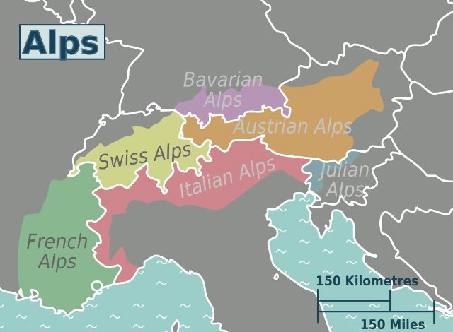{ loading=lazy }

Une haute chaîne de montagnes en Europe.

- Type: Place
- Subjects: Geography, Environment
- Country: International
- Topics: [mont blanc](../topics/index.md#mont_blanc)
- Image credit: CC_BY_SA | Drat70 | [source](https://commons.wikimedia.org/wiki/File:Alps_regions.svg)
- Quests: [Mont Blanc et montagnes (fr_08)](../quests/quest/fr_08.md)

---

### Animaux du zoo {#zoo_animals}
{ loading=lazy }

Carte créée automatiquement pour le thème « Animaux du zoo ».

- Type: None
- Country: International
- Topics: [Zoo Animals](../topics/index.md#zoo)
- Image credit: CC_BY | Palickap | [source](https://commons.wikimedia.org/wiki/File:Zoo_Wrocław,_plan.jpg)

---

### Antura {#antura}
{ loading=lazy }

Le personnage principal de ce jeu vidéo

- Type: Concept
- Country: International
- Topics: [Antura's world](../topics/index.md#antura-world)
- Image credit: CC0

---

### Apiculteur {#beekeeper}
{ loading=lazy }

Une personne qui s’occupe des abeilles et récolte le miel.

- Type: Person
- Subjects: Community, Animal, Food
- Country: International
- Image credit: CC_BY | Michael Gäbler | [source](https://commons.wikimedia.org/wiki/File:Beekeeper_keeping_bees.jpg)
- Quests: [Pain d'épices et marché alimentaire (pl_06)](../quests/quest/pl_06.md)

---

### Balle {#ball}
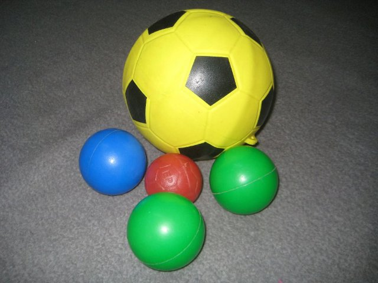{ loading=lazy }

Un objet rond utilisé dans de nombreux jeux.

- Type: Object
- Subjects: Sport, Recreation
- Country: International
- Image credit: CC_BY_SA | Marco Gualazzini | [source](https://commons.wikimedia.org/wiki/File:Playing_in_the_Nuba_mountains.jpg)
- Quests: [Découvrir Varsovie (pl_01)](../quests/quest/pl_01.md)

---

### Banane {#food_banana}
{ loading=lazy }

Moelleux, jaunes et faciles à peler. Plein d'énergie pour la journée !

- Type: Object
- Country: International
- Image credit: CC0 | [source](https://commons.wikimedia.org/wiki/File:Banana_on_whitebackground.jpg)
- Quests: [Le zoo (pl_04)](../quests/quest/pl_04.md)

---

### Bananier {#plant_banana}
{ loading=lazy }

Une grande plante aux feuilles géantes et aux bananes jaunes. Ses fruits poussent en grappes pendantes !

- Type: Object
- Country: International
- Image credit: CC0 | [source](https://commons.wikimedia.org/wiki/File:Musa_JPG01.jpg)
- Quests: [Le zoo (pl_04)](../quests/quest/pl_04.md)

---

### bateau fluvial {#boat_river}
{ loading=lazy }

Un bateau qui navigue sur les rivières. Les rivières sont comme des routes faites d'eau !

- Type: Place
- Subjects: Geography, Environment
- Country: International
- Topics: [Seine Bridges](../topics/index.md#seine_bridges)
- Image credit: CC0
- Quests: [Paris Seine (fr_10)](../quests/quest/fr_10.md)

---

### Bateau pour marchandises {#boat_for_goods}
{ loading=lazy }

Un grand bateau qui transporte des cartons, de la nourriture et d’autres choses d’un endroit à un autre.

- Type: Place
- Subjects: Geography, Environment
- Country: International
- Image credit: CC0

---

### Belgique {#country_belgium}
{ loading=lazy }

Un pays d'Europe. Sa capitale est Bruxelles.

- Type: Place
- Subjects: Geography, Culture
- Country: International
- Topics: [Countries around France](../topics/index.md#france_countries_around)
- Image credit: CC_BY | Loc7798_R01.jpg: Marc Ryckaert (MJJR)
derivative work: Kabelleger (talk) | [source](https://commons.wikimedia.org/wiki/File:Loc7798_R01_alt.jpg)

---

### Bern {#capital_bern}
{ loading=lazy }

La capitale de la Suisse.

- Type: Place
- Subjects: Geography, Culture
- Country: International
- Topics: [Countries around France](../topics/index.md#france_countries_around)
- Image credit: CC_BY_SA | Daniel Kraft | [source](https://commons.wikimedia.org/wiki/File:Bern_Panorama_von_Rosengarten_20211007.jpg)

---

### Beurre {#butter}
{ loading=lazy }

Une matière grasse jaune issue du lait, utilisée pour la cuisine et la pâtisserie.

- Type: Object
- Subjects: Food, Animal
- Country: International
- Topics: [Gingerbread](../topics/index.md#gingerbread)
- Image credit: CC0 | Antoine Vollon | [source](https://commons.wikimedia.org/wiki/File:Antoine_Vollon_-_Mound_of_Butter_-_National_Gallery_of_Art.jpg)
- Quests: [Pain d'épices et marché alimentaire (pl_06)](../quests/quest/pl_06.md)

---

### Billet pour la Tour Eiffel {#eiffel_tower_ticket}
{ loading=lazy }

Un document spécial qui vous permet de visiter la célèbre haute tour de Paris, en France.

- Type: Object
- Subjects: Science
- Country: International
- Topics: [Eiffel Tower](../topics/index.md#eiffel-tower)
- Image credit: CC0
- Quests: [Paris ! (fr_01)](../quests/quest/fr_01.md)

---

### Biélorussie {#country_belarus}
{ loading=lazy }

Un pays d'Europe. Sa capitale est Minsk.

- Type: Place
- Subjects: Geography, Culture
- Country: International
- Topics: [Poland Countries](../topics/index.md#poland_countries_around)
- Image credit: CC0 | [source](https://commons.wikimedia.org/wiki/File:Satellite_image_of_Belarus_in_December_2002.jpg)

---

### Bobsleigh {#bobsled}
{ loading=lazy }

Un traîneau rapide utilisé pour glisser sur la glace.

- Type: Object
- Subjects: Sport, Recreation
- Country: International
- Image credit: CC_BY_SA | Steffen Prößdorf | [source](https://commons.wikimedia.org/wiki/File:2020-02-22_IBSF_World_Championships_Bobsleigh_and_Skeleton_Altenberg_1DX_5978_by_Stepro.jpg)
- Quests: [Mont Blanc et montagnes (fr_08)](../quests/quest/fr_08.md)

---

### Boucher {#butcher}
{ loading=lazy }

Une personne qui vend de la viande.

- Type: Person
- Subjects: Community, Food
- Country: International
- Image credit: CC_BY_SA | Sabina Bajracharya | [source](https://commons.wikimedia.org/wiki/File:A_Butcher_cutting_buffalo_meat.jpg)
- Quests: [Pain d'épices et marché alimentaire (pl_06)](../quests/quest/pl_06.md)

---

### Boulanger {#person_baker}
{ loading=lazy }

Une personne qui fait du pain, des gâteaux et des pâtisseries.

- Type: Person
- Subjects: History, Culture
- Country: International
- Topics: [Baguette](../topics/index.md#baguette), [market traders](../topics/index.md#marketers)
- Image credit: CC0 | [source](https://commons.wikimedia.org/wiki/File:Baker_Oslo.jpg)
- Quests: [Nourriture et marché (fr_09)](../quests/quest/fr_09.md)

---

### Boussole {#math_compass}
{ loading=lazy }

Un outil qui permet de tracer des cercles parfaits. Il possède deux branches, comme des ciseaux.

- Type: Object
- Subjects: Math
- Country: International
- Topics: [Elementary Math](../topics/index.md#elementary-maths)
- Image credit: CC0 | [source](https://commons.wikimedia.org/wiki/File:2023070201_Voigt_Schulzirkel_gespreizt_2023.jpg)
- Quests: [Le système scolaire (fr_02)](../quests/quest/fr_02.md)

---

### Bratislava {#capital_bratislava}
{ loading=lazy }

La capitale de la Slovaquie.

- Type: Place
- Subjects: Geography, Culture
- Country: International
- Image credit: CC_BY_SA | Jakub Hałun | [source](https://commons.wikimedia.org/wiki/File:View_of_Bratislava_from_Nový_most,_20210727_1012_0262.jpg)

---

### Bruxelles {#capital_brussels}
{ loading=lazy }

La capitale de la Belgique.

- Type: Place
- Subjects: Geography, Culture
- Country: International
- Topics: [Countries around France](../topics/index.md#france_countries_around)
- Image credit: CC_BY_SA | Horst J. Meuter | [source](https://commons.wikimedia.org/wiki/File:Atomium,_Brüssel_2.jpg)

---

### Bus {#bus}
{ loading=lazy }

Un gros véhicule qui transporte de nombreuses personnes.

- Type: Object
- Subjects: Transportation, Community
- Country: International
- Image credit: CC_BY_SA | Xosema | [source](https://commons.wikimedia.org/wiki/File:Setra_S6_-_Empresa_Mosquera_-_02.jpg)
- Quests: [Découvrir Varsovie (pl_01)](../quests/quest/pl_01.md)

---

### But {#goal}
{ loading=lazy }

Le filet dans lequel vous essayez de marquer.

- Type: Object
- Subjects: Sport, Recreation
- Country: International
- Image credit: CC_BY_SA | Dietmar Rabich | [source](https://commons.wikimedia.org/wiki/File:Dülmen,_Sportzentrum_Süd_--_2012_--_4121.jpg)
- Quests: [Découvrir Varsovie (pl_01)](../quests/quest/pl_01.md)

---

### Cannelle {#cinnamon}
{ loading=lazy }

Une épice douce fabriquée à partir d'écorce d'arbre.

- Type: Object
- Subjects: Food, Plant
- Country: International
- Topics: [Gingerbread](../topics/index.md#gingerbread)
- Image credit: CC_BY_SA | Simon A. Eugster | [source](https://commons.wikimedia.org/wiki/File:Cinnamomum_verum_spices.jpg)
- Quests: [Pain d'épices et marché alimentaire (pl_06)](../quests/quest/pl_06.md)

---

### Carré {#math_setsquare}
{ loading=lazy }

Un outil en forme de triangle utilisé pour dessiner des lignes droites et des angles droits en mathématiques.

- Type: Object
- Subjects: Math
- Country: International
- Topics: [Elementary Math](../topics/index.md#elementary-maths)
- Image credit: CC0 | [source](https://commons.wikimedia.org/wiki/File:Squadra_45.jpg)
- Quests: [Le système scolaire (fr_02)](../quests/quest/fr_02.md)

---

### Cartable {#school_bag}
{ loading=lazy }

Un sac que les élèves utilisent pour transporter leurs livres, leurs crayons et leurs devoirs à l'école.

- Type: Object
- Subjects: Science
- Country: International
- Image credit: CC0
- Quests: [Le système scolaire (fr_02)](../quests/quest/fr_02.md)

---

### Carte de l'Europe {#concept_europe_map}
{ loading=lazy }

Une carte montrant tous les pays d'Europe. Vous pouvez voir où se trouvent la France, la Pologne, l'Allemagne et d'autres pays.

- Rationale: Maps help kids understand where different countries are and how they connect
- Type: Concept
- Subjects: Geography, Education
- Year: 2000
- Country: International
- Topics: [Flags of Europe](../topics/index.md#flags_euroe)
- Image credit: CC0
- Quests: [Les voisins de la France (fr_00)](../quests/quest/fr_00.md), [Les voisins de la Pologne (pl_00)](../quests/quest/pl_00.md)

---

### Carte de la Tour Eiffel {#eiffel_tower_map}
{ loading=lazy }

Une carte qui montre où se trouve la célèbre haute tour de Paris.

- Type: Object
- Subjects: Community, Culture
- Country: International
- Topics: [Eiffel Tower](../topics/index.md#eiffel-tower)
- Image credit: CC0
- Quests: [Paris ! (fr_01)](../quests/quest/fr_01.md)

---

### Cartes {#antura_cards}
{ loading=lazy }

Chaque carte a quelque chose de spécial à apprendre. Trouvez-les toutes et lisez-les !

- Type: Concept
- Country: International
- Topics: [Antura's world](../topics/index.md#antura-world)
- Image credit: CC0

---

### Cercle {#fr_figure_circle}
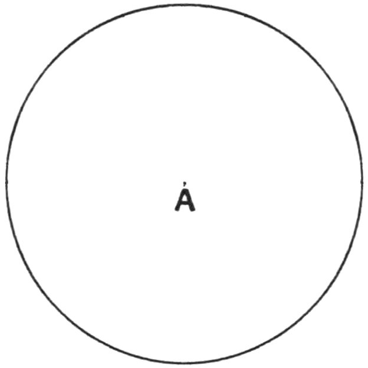{ loading=lazy }

Une forme ronde sans coins. Les cercles ressemblent à des roues, des boules et des pièces de monnaie !

- Type: Concept
- Subjects: Math
- Country: International
- Topics: [Elementary Math](../topics/index.md#elementary-maths)
- Image credit: CC0 | [source](https://commons.wikimedia.org/wiki/File:Squaring_the_circle_a_history_of_the_problem_%281913%29_-_illustration_-_page_29_fig_9.png)
- Quests: [Le système scolaire (fr_02)](../quests/quest/fr_02.md)

---

### Chambres du Parlement polonais {#polish_houses_of_parliament}
{ loading=lazy }

Là où les lois sont faites : la Diète et le Sénat.

- Type: Place
- Subjects: Civics, History, Geography
- Country: International
- Image credit: CC0
- Quests: [Découvrir Varsovie (pl_01)](../quests/quest/pl_01.md)

---

### Chapeau {#hat}
{ loading=lazy }

Un bonnet chaud pour votre tête.

- Type: Object
- Subjects: Health, Safety, Weather
- Country: International
- Topics: [mountain tools](../topics/index.md#mountain_tools)
- Image credit: CC0 | Michael Evans | [source](https://commons.wikimedia.org/wiki/File:Ronald_Reagan_with_cowboy_hat_12-0071M_edit.jpg)
- Quests: [Mont Blanc et montagnes (fr_08)](../quests/quest/fr_08.md)

---

### Chat {#antura_cat}
{ loading=lazy }

Le meilleur ami et compagnon de voyage d'Antura. Curieux, intelligent et toujours prêt à aider !

- Type: Concept
- Country: International
- Topics: [Antura's world](../topics/index.md#antura-world)
- Image credit: CC0

---

### Chimpanzé {#animal_chimpanzee}
{ loading=lazy }

Intelligent et joueur, il adore grimper aux arbres. Il utilise des bâtons et des pierres comme de petits outils !

- Type: None
- Country: International
- Image credit: CC0 | [source](https://commons.wikimedia.org/wiki/File:Common_chimpanzee_(Pan_troglodytes_schweinfurthii)_feeding.jpg)
- Quests: [Le zoo (pl_04)](../quests/quest/pl_04.md)

---

### Château Royal (Varsovie) {#royal_castle_warsaw}
{ loading=lazy }

Un château historique des rois polonais, aujourd'hui un musée.

- Type: Place
- Subjects: History, Culture, Geography
- Country: International
- Image credit: CC0 | Bernardo Bellotto | [source](https://commons.wikimedia.org/wiki/File:Bernardo_Bellotto_-_View_of_Warsaw_from_the_Royal_Castle_-_Google_Art_Project.jpg)
- Quests: [Découvrir Varsovie (pl_01)](../quests/quest/pl_01.md)

---

### Chéri {#honey}
{ loading=lazy }

Un aliment sucré fabriqué par les abeilles.

- Type: Object
- Subjects: Food, Animal
- Country: International
- Topics: [Gingerbread](../topics/index.md#gingerbread)
- Image credit: CC0 | John Severns (Severnjc) | [source](https://commons.wikimedia.org/wiki/File:European_honey_bee_extracts_nectar.jpg)
- Quests: [Pain d'épices et marché alimentaire (pl_06)](../quests/quest/pl_06.md)

---

### Citron {#food_lemon}
{ loading=lazy }

Un fruit jaune au goût très acide. On utilise le citron pour faire de la limonade !

- Type: Object
- Subjects: Food, Culture
- Country: International
- Topics: [Bouillabaisse](../topics/index.md#bouillabaisse)
- Image credit: CC0 | [source](https://commons.wikimedia.org/wiki/File:Lemon.jpg)
- Quests: [Nourriture et marché (fr_09)](../quests/quest/fr_09.md)

---

### Classe {#place_classroom}
{ loading=lazy }

Une salle à l'école où les élèves s'assoient et apprennent de nouvelles choses de leur professeur.

- Type: Place
- Subjects: Education, Community
- Country: International
- Image credit: CC0
- Quests: [Le système scolaire (fr_02)](../quests/quest/fr_02.md), [Jules Verne et les transports (fr_03)](../quests/quest/fr_03.md)

---

### clous de girofle {#cloves}
{ loading=lazy }

Une épice forte utilisée pour ajouter de la saveur aux aliments.

- Type: Object
- Subjects: Food, Plant
- Country: International
- Image credit: CC_BY_SA | Friedrich Haag | [source](https://commons.wikimedia.org/wiki/File:Gewuerze_004_2024_08_10.jpg)
- Quests: [Pain d'épices et marché alimentaire (pl_06)](../quests/quest/pl_06.md)

---

### Commerçants du marché {#market_traders}
{ loading=lazy }

Ceux qui vendent des produits alimentaires et autres marchandises sur les étals des marchés, comme les poissonniers, les fromagers et les marchands de fruits. Ils pèsent, emballent et annoncent les prix du jour.

- Type: Person
- Subjects: Money, Community
- Country: International
- Topics: [market traders](../topics/index.md#marketers)
- Image credit: CC_BY | Market traders in York by DS Pugh | [source](https://commons.wikimedia.org/wiki/File:Market_traders_in_York_-_geograph.org.uk_-_8132100.jpg)

---

### Constitution du 3 mai {#constitution_of_3_may}
{ loading=lazy }

Une constitution polonaise historique célébrée le 3 mai.

- Type: Concept
- Subjects: Civics, History, Time
- Country: International
- Image credit: CC0 | Constitutional Convention | [source](https://commons.wikimedia.org/wiki/File:Constitution_of_the_United_States,_page_1.jpg)
- Quests: [Découvrir Varsovie (pl_01)](../quests/quest/pl_01.md)

---

### Cookies {#antura_cookies}
{ loading=lazy }

De superbes récompenses à collectionner en jouant ! Utilisez-les pour obtenir de nouveaux objets et des surprises.

- Type: Object
- Country: International
- Topics: [Antura's world](../topics/index.md#antura-world)
- Image credit: CC0

---

### Corde {#rope}
{ loading=lazy }

Une ligne solide utilisée pour la sécurité lors de l'escalade.

- Type: Object
- Subjects: Safety, Technology, Sport
- Country: International
- Topics: [mountain tools](../topics/index.md#mountain_tools)
- Image credit: CC_BY_SA | Nevit Dilmen | [source](https://commons.wikimedia.org/wiki/File:Coiled_rope_03235.jpg)
- Quests: [Mont Blanc et montagnes (fr_08)](../quests/quest/fr_08.md)

---

### Crabe {#food_crab}
{ loading=lazy }

Un animal marin doté de grandes pinces et d'une carapace dure. Les crabes marchent latéralement sur la plage !

- Type: Object
- Subjects: Food, Culture
- Country: International
- Topics: [Bouillabaisse](../topics/index.md#bouillabaisse)
- Image credit: CC0 | [source](https://commons.wikimedia.org/wiki/File:Fresh_Crab.jpg)
- Quests: [Nourriture et marché (fr_09)](../quests/quest/fr_09.md)

---

### Crampons {#crampons}
{ loading=lazy }

Poignées métalliques pointues que vous attachez aux bottes pour la glace.

- Type: Object
- Subjects: Safety, Technology, Sport
- Country: International
- Topics: [mountain tools](../topics/index.md#mountain_tools)
- Image credit: CC_BY_SA | Clayoquot | [source](https://commons.wikimedia.org/wiki/File:Strap-on_crampon.JPG)
- Quests: [Mont Blanc et montagnes (fr_08)](../quests/quest/fr_08.md)

---

### Cuisine {#kitchen}
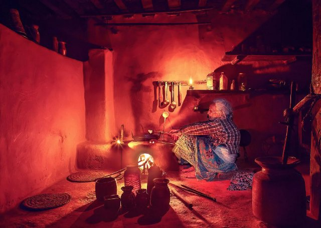{ loading=lazy }

Une pièce où les gens cuisinent et font des pâtisseries.

- Type: Place
- Subjects: Food
- Country: International
- Image credit: CC_BY_SA | Original:  Mithun Kunwar
Derivative work:  Radomianin | [source](https://commons.wikimedia.org/wiki/File:Grandmother_preparing_food_inside_traditional_kitchen_(edited).jpg)
- Quests: [Pain d'épices et marché alimentaire (pl_06)](../quests/quest/pl_06.md)

---

### Cuisiner {#cook}
{ loading=lazy }

Une personne qui prépare de la nourriture.

- Type: Person
- Subjects: Community, Food
- Country: International
- Image credit: CC_BY_SA | Basile Morin | [source](https://commons.wikimedia.org/wiki/File:Kappabashi-dori_streetcorner_(Kitchen_town_-_southern_end)_a_sunny_morning_in_Tokyo_Japan.jpg)
- Quests: [Pain d'épices et marché alimentaire (pl_06)](../quests/quest/pl_06.md)

---

### Danger {#antura_malus}
{ loading=lazy }

À éviter absolument ! Soyez prudents et protégez-vous.

- Type: Concept
- Country: International
- Topics: [Antura's world](../topics/index.md#antura-world)
- Image credit: CC0

---

### Doubler {#fr_figure_line}
{ loading=lazy }

Une ligne droite reliant un point à un autre. Les lignes peuvent être longues ou courtes.

- Type: Concept
- Subjects: Math
- Country: International
- Topics: [Elementary Math](../topics/index.md#elementary-maths)
- Image credit: CC0 | [source](https://commons.wikimedia.org/wiki/File:Squaring_the_circle_a_history_of_the_problem_%281913%29_-_illustration_-_page_29_fig_9.png)
- Quests: [Le système scolaire (fr_02)](../quests/quest/fr_02.md)

---

### Drapeau de l'Ukraine {#flag_ukraine}
{ loading=lazy }

Un drapeau bleu et jaune, comme le ciel et le soleil. Il représente l'Ukraine.

- Type: Concept
- Subjects: Community, Culture
- Country: International
- Topics: [Flags of Europe](../topics/index.md#flags_euroe), [Poland Countries](../topics/index.md#poland_countries_around)
- Image credit: CC0
- Quests: [Les voisins de la France (fr_00)](../quests/quest/fr_00.md), [Les voisins de la Pologne (pl_00)](../quests/quest/pl_00.md)

---

### Drapeau de la Belgique {#flag_belgium}
{ loading=lazy }

Le drapeau belge comporte trois bandes verticales : noire, jaune et rouge. La Belgique est célèbre pour son chocolat et ses gaufres !

- Rationale: Belgium's unique vertical stripes help kids distinguish different flag patterns
- Type: Concept
- Subjects: Geography, Culture
- Year: 1831
- Country: International
- Topics: [Flags of Europe](../topics/index.md#flags_euroe), [Countries around France](../topics/index.md#france_countries_around)
- Image credit: CC0
- Quests: [Les voisins de la France (fr_00)](../quests/quest/fr_00.md)

---

### Drapeau de la Biélorussie {#flag_belarus}
{ loading=lazy }

Le drapeau de la Biélorussie est composé de bandes horizontales rouges et vertes, ornées de magnifiques motifs traditionnels sur les côtés. La Biélorussie est voisine de la Pologne.

- Rationale: Learning neighboring countries helps kids understand regional geography
- Type: Concept
- Subjects: Geography, Culture
- Year: 1995
- Country: International
- Topics: [Poland Countries](../topics/index.md#poland_countries_around)
- Image credit: CC0
- Quests: [Les voisins de la Pologne (pl_00)](../quests/quest/pl_00.md)

---

### Drapeau de la Lituanie {#flag_lithuania}
{ loading=lazy }

Le drapeau est composé de bandes horizontales jaunes, vertes et rouges. La Lituanie est un pays balte doté de magnifiques forêts et plages.

- Rationale: Baltic countries teach kids about northern European geography and Poland's neighbors
- Type: Concept
- Subjects: Geography, Culture
- Year: 1988
- Country: International
- Topics: [Poland Countries](../topics/index.md#poland_countries_around)
- Image credit: CC0
- Quests: [Les voisins de la Pologne (pl_00)](../quests/quest/pl_00.md)

---

### Drapeau de la Russie {#flag_russia}
{ loading=lazy }

Un drapeau à rayures blanches, bleues et rouges. Il représente la Russie.

- Type: Concept
- Subjects: Community, Culture
- Country: International
- Topics: [Poland Countries](../topics/index.md#poland_countries_around)
- Image credit: CC0
- Quests: [Les voisins de la Pologne (pl_00)](../quests/quest/pl_00.md)

---

### Drapeau de la République tchèque {#flag_czech_republic}
{ loading=lazy }

Le drapeau est composé de bandes blanches et rouges avec un triangle bleu. La République tchèque est célèbre pour son magnifique château de Prague et sa cristallerie.

- Rationale: Central European countries help kids understand the region around Poland
- Type: Concept
- Subjects: Geography, Culture
- Year: 1920
- Country: International
- Topics: [Flags of Europe](../topics/index.md#flags_euroe), [Poland Countries](../topics/index.md#poland_countries_around)
- Image credit: CC0
- Quests: [Les voisins de la France (fr_00)](../quests/quest/fr_00.md), [Les voisins de la Pologne (pl_00)](../quests/quest/pl_00.md)

---

### Drapeau de la Slovaquie {#flag_slovakia}
{ loading=lazy }

Un drapeau aux couleurs blanche, bleue et rouge. Il représente la Slovaquie.

- Type: Concept
- Subjects: Community, Culture
- Country: International
- Topics: [Flags of Europe](../topics/index.md#flags_euroe), [Poland Countries](../topics/index.md#poland_countries_around)
- Image credit: CC0
- Quests: [Les voisins de la France (fr_00)](../quests/quest/fr_00.md), [Les voisins de la Pologne (pl_00)](../quests/quest/pl_00.md)

---

### Drapeau de la Suisse {#flag_switzerland}
{ loading=lazy }

Le drapeau suisse est rouge avec une croix blanche au milieu. On dirait une trousse de premiers secours ! La Suisse est célèbre pour ses montagnes et son fromage.

- Rationale: The Swiss flag's unique cross design helps kids remember this mountain country
- Type: Concept
- Subjects: Geography, Culture
- Year: 1889
- Country: International
- Topics: [Flags of Europe](../topics/index.md#flags_euroe), [Countries around France](../topics/index.md#france_countries_around)
- Image credit: CC0
- Quests: [Les voisins de la France (fr_00)](../quests/quest/fr_00.md)

---

### Drapeau du Luxembourg {#flag_luxembourg}
{ loading=lazy }

Le drapeau luxembourgeois est composé de bandes horizontales rouges, blanches et bleu clair. Le Luxembourg est un tout petit pays qui parle trois langues !

- Rationale: Small multilingual countries teach kids about European diversity
- Type: Concept
- Subjects: Geography, Culture
- Year: 1972
- Country: International
- Topics: [Flags of Europe](../topics/index.md#flags_euroe), [Countries around France](../topics/index.md#france_countries_around)
- Image credit: CC0
- Quests: [Les voisins de la France (fr_00)](../quests/quest/fr_00.md)

---

### Eau {#food_water}
{ loading=lazy }

L'eau est essentielle à toute vie

- Type: Object
- Subjects: Food, Culture
- Country: International
- Topics: [Baguette](../topics/index.md#baguette)
- Image credit: CC0

---

### En blocs {#antura_blocky_character}
{ loading=lazy }

Ces drôles de personnages vivent dans ce monde.
Parlez-leur à tous… ils ont des histoires à raconter !

- Type: Concept
- Country: International
- Topics: [Antura's world](../topics/index.md#antura-world)
- Image credit: CC0

---

### Escalade {#climbing}
{ loading=lazy }

Escalader des rochers ou de la glace avec un équipement spécial.

- Type: Concept
- Subjects: Sport, Safety, Recreation
- Country: International
- Topics: [mountain activities](../topics/index.md#mountain_activities)
- Image credit: CC_BY_SA | Original version: Valentin Chapuis
Derivative version: Subsidiary account (image rotated 90 degrees CCW) | [source](https://commons.wikimedia.org/wiki/File:Flo_dans_Juvsøyla_à_Rjukan,_Norvège-rotated.jpg)
- Quests: [Mont Blanc et montagnes (fr_08)](../quests/quest/fr_08.md)

---

### Farine {#food_flour}
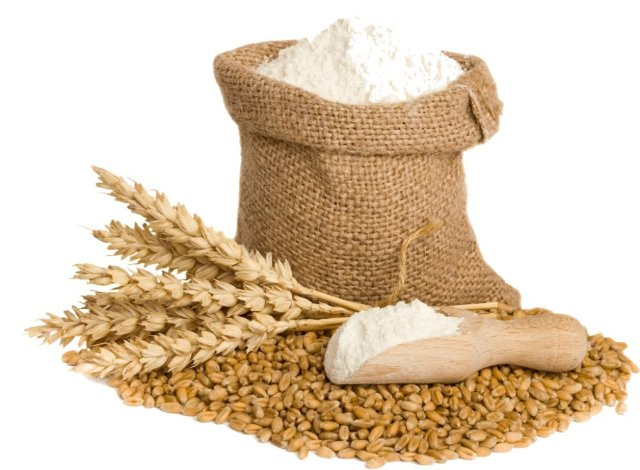{ loading=lazy }

Poudre blanche fabriquée à partir de blé qui est utilisée pour faire du pain.

- Type: Object
- Subjects: Food, Science
- Country: International
- Topics: [Baguette](../topics/index.md#baguette)
- Image credit: CC0

---

### Fer {#iron_material}
{ loading=lazy }

Un outil chauffant utilisé pour lisser et aplatir les vêtements froissés. Attention, les fers à repasser sont très chauds !

- Type: Object
- Subjects: Science
- Country: International
- Topics: [Eiffel Tower](../topics/index.md#eiffel-tower)
- Image credit: CC0

---

### Football (soccer) {#football_soccer}
{ loading=lazy }

Un jeu d’équipe joué avec un ballon que vous frappez.

- Type: Object
- Subjects: Sport, Recreation, Community
- Country: International
- Image credit: CC_BY_SA | Clément Bucco-Lechat | [source](https://commons.wikimedia.org/wiki/File:Algérie_-_Arménie_-_20140531_-_Yacine_Brahimi_(Alg)_face_à_Taron_Voskanyan_(Arm).jpg)
- Quests: [Découvrir Varsovie (pl_01)](../quests/quest/pl_01.md)

---

### Former {#train}
{ loading=lazy }

Les trains transportent rapidement des personnes et des marchandises à travers le pays.

- Type: Object
- Subjects: Transportation
- Country: International
- Topics: [Jules Verne](../topics/index.md#jules_verne)
- Image credit: CC0

---

### Foulard {#scarf}
{ loading=lazy }

Un tissu chaud que vous portez autour du cou.

- Type: Object
- Subjects: Health, Safety, Weather
- Country: International
- Topics: [mountain tools](../topics/index.md#mountain_tools)
- Image credit: CC_BY_SA | Kritzolina | [source](https://commons.wikimedia.org/wiki/File:Colored_silk_scarf_from_India_01.jpg)
- Quests: [Mont Blanc et montagnes (fr_08)](../quests/quest/fr_08.md)

---

### Fromager {#person_cheesemonger}
{ loading=lazy }

Une personne qui vend de nombreux types de fromages.

- Type: Person
- Subjects: History, Culture
- Country: International
- Topics: [market traders](../topics/index.md#marketers)
- Image credit: CC0 | [source](https://commons.wikimedia.org/wiki/File:Paris_-_Cheese_seller,_Rue_Moufetard_-_3397.jpg)
- Quests: [Nourriture et marché (fr_09)](../quests/quest/fr_09.md)

---

### Fusée spatiale {#space_rocket}
{ loading=lazy }

Une fusée qui va dans l'espace.

- Type: Object
- Subjects: Science
- Country: International
- Topics: [Jules Verne](../topics/index.md#jules_verne)
- Image credit: CC0
- Quests: [Jules Verne et les transports (fr_03)](../quests/quest/fr_03.md)

---

### Gants {#gloves}
{ loading=lazy }

Des couvertures chaudes pour vos mains.

- Type: Object
- Subjects: Health, Safety, Weather
- Country: International
- Topics: [mountain tools](../topics/index.md#mountain_tools)
- Image credit: CC_BY_SA | Kippelboy | [source](https://commons.wikimedia.org/wiki/File:Centre_de_Documentació_Museu_Tèxtil_de_Terrassa-_Reserves-_Teixits-_Guants002.JPG)
- Quests: [Mont Blanc et montagnes (fr_08)](../quests/quest/fr_08.md)

---

### Gingembre {#ginger}
{ loading=lazy }

Une racine épicée utilisée en cuisine et en biscuits.

- Type: Object
- Subjects: Food, Plant
- Country: International
- Topics: [Gingerbread](../topics/index.md#gingerbread)
- Image credit: CC0 | Franz Eugen Köhler, Köhler's Medizinal-Pflanzen | [source](https://commons.wikimedia.org/wiki/File:Koeh-146-no_text.jpg)
- Quests: [Pain d'épices et marché alimentaire (pl_06)](../quests/quest/pl_06.md)

---

### Girafe {#animal_giraffe}
{ loading=lazy }

Un animal très grand avec un long cou. Les girafes sont plus hautes que les arbres ! Elles mangent des feuilles inaccessibles aux autres animaux.

- Rationale: Giraffes are fascinating animals that show kids how nature adapts to find food
- Type: Object
- Subjects: Animal, Environment
- Country: International
- Topics: [Zoo Animals](../topics/index.md#zoo)
- Image credit: CC0

---

### Glace {#ice}
{ loading=lazy }

Eau gelée qui peut être très glissante.

- Type: Concept
- Subjects: Weather, Environment, Science
- Country: International
- Topics: [mont blanc](../topics/index.md#mont_blanc)
- Image credit: CC_BY_SA | Andreas Tille | [source](https://commons.wikimedia.org/wiki/File:IceBlockNearJoekullsarlon.jpg)
- Quests: [Mont Blanc et montagnes (fr_08)](../quests/quest/fr_08.md)

---

### glace arctique {#ice_arctic}
{ loading=lazy }

Froid, blanc et brillant comme du verre. Un refuge pour les phoques, les ours et l'aventure !

- Type: Place
- Country: International
- Image credit: CC0 | [source](https://commons.wikimedia.org/wiki/File:Helicopter_View_(3978020016).jpg)
- Quests: [Le zoo (pl_04)](../quests/quest/pl_04.md)

---

### Glacier {#glacier}
{ loading=lazy }

Glace à mouvement lent trouvée sur les hautes montagnes.

- Type: Concept
- Subjects: Geography, Science, Environment
- Country: International
- Image credit: CC_BY | Kelvinsong | [source](https://commons.wikimedia.org/wiki/File:Glacier_diagram.svg)
- Quests: [Mont Blanc et montagnes (fr_08)](../quests/quest/fr_08.md)

---

### Guide de montagne {#mountain_guide}
{ loading=lazy }

Une personne qui aide les gens à grimper en toute sécurité.

- Type: Person
- Subjects: Community, Safety, Education
- Country: International
- Topics: [mont blanc](../topics/index.md#mont_blanc), [mountain activities](../topics/index.md#mountain_activities)
- Image credit: CC_BY | Vyacheslav Argenberg | [source](https://commons.wikimedia.org/wiki/File:Zagedan_Lakes,_Mountaineer,_Mountain_guide,_Caucasus_Mountains,_Karachay-Cherkessia.jpg)
- Quests: [Mont Blanc et montagnes (fr_08)](../quests/quest/fr_08.md)

---

### hangar à bateaux {#boat_house}
{ loading=lazy }

Une maison flottant sur l'eau comme un bateau. On peut vivre dans des maisons-bateaux !

- Type: Place
- Subjects: Geography, Environment
- Country: International
- Image credit: CC0

---

### Huile d'olive {#food_olive_oil}
{ loading=lazy }

Une huile spéciale à base d'olives. On l'utilise pour cuisiner des plats savoureux.

- Type: Object
- Subjects: Food, Culture
- Country: International
- Topics: [Bouillabaisse](../topics/index.md#bouillabaisse)
- Image credit: CC0 | [source](https://commons.wikimedia.org/wiki/File:Oliven_V1.jpg)
- Quests: [Nourriture et marché (fr_09)](../quests/quest/fr_09.md)

---

### Jeune lion mâle {#animal_lion_young_male}
{ loading=lazy }

Devenant fort avec une crinière courte, il apprend à chasser et à protéger sa fierté.

- Type: Object
- Country: International
- Image credit: CC0 | [source](https://commons.wikimedia.org/wiki/File:Young_male_lion,_South_Luangwa_National_Park_(51871439313).jpg)
- Quests: [Le zoo (pl_04)](../quests/quest/pl_04.md)

---

### Jour de l'Indépendance (Pologne) {#independence_day_poland}
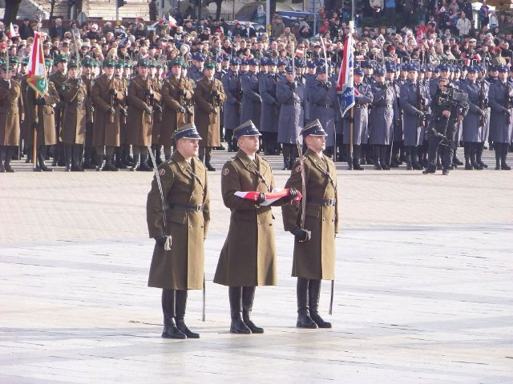{ loading=lazy }

Un jour férié national le 11 novembre.

- Type: Concept
- Subjects: Civics, History, Time
- Country: International
- Image credit: CC_BY_SA | Patryk Matyjaszczyk | [source](https://commons.wikimedia.org/wiki/File:Narodowe_Święto_Niepodległości_2012_01.JPG)
- Quests: [Découvrir Varsovie (pl_01)](../quests/quest/pl_01.md)

---

### Kyiv {#capital_kyiv}
{ loading=lazy }

La capitale de l'Ukraine.

- Type: Place
- Subjects: Geography, Culture
- Country: International
- Image credit: CC_BY_SA | Moahim | [source](https://commons.wikimedia.org/wiki/File:2017_-_Київ_-_Світанок_над_Дніпром.jpg)

---

### L'épée de la sirène {#mermaids_sword}
{ loading=lazy }

L’épée de la sirène qui doit être rendue.

- Type: Object
- Subjects: Culture, History
- Country: International
- Image credit: CC_BY_SA | Guillaume Speurt from Vilnius, Lithuania | [source](https://commons.wikimedia.org/wiki/File:Mermaid_statue_with_sword_(8121475992).jpg)
- Quests: [Découvrir Varsovie (pl_01)](../quests/quest/pl_01.md)

---

### La colonne du roi Sigismond {#king_sigismunds_column}
{ loading=lazy }

Une haute colonne honorant le roi Sigismond sur la place du château.

- Type: Place
- Subjects: History, Culture
- Country: International
- Image credit: CC_BY_SA | Haydn Blackey from Cardiff, Wales | [source](https://commons.wikimedia.org/wiki/File:Column_of_King_Sigismund_III_Vasa_-_Warsaw_(53113393114).jpg)
- Quests: [Découvrir Varsovie (pl_01)](../quests/quest/pl_01.md)

---

### La couronne du roi Sigismond {#king_sigismunds_crown}
{ loading=lazy }

La couronne du roi qui est tombée et qui doit être retrouvée.

- Type: Object
- Subjects: History, Culture
- Country: International
- Image credit: CC_BY_SA | Maciej Szczepańczyk | [source](https://commons.wikimedia.org/wiki/File:Sigismund_Augustus_King_of_Poland_and_Grand_Duke_of_Lithuania_incorporates_fiefdoms,_Duchies_of_Courland_and_Semigalia_into_the_Crown_1569.png)
- Quests: [Découvrir Varsovie (pl_01)](../quests/quest/pl_01.md)

---

### Lait {#food_milk}
{ loading=lazy }

Une boisson blanche issue du lait de vache. Le lait contribue à la solidité des os et des dents !

- Type: Object
- Subjects: Food, Culture
- Country: International
- Topics: [Bouillabaisse](../topics/index.md#bouillabaisse)
- Image credit: CC0 | [source](https://commons.wikimedia.org/wiki/File:Milchflasche_%2812337400564%29.jpg)
- Quests: [Nourriture et marché (fr_09)](../quests/quest/fr_09.md)

---

### Lettre vivante {#antura_livingletter}
{ loading=lazy }

Une lettre sympathique qui aime parler et jouer ! Parlez-lui pour apprendre de nouveaux mots.

- Type: Concept
- Country: International
- Topics: [Antura's world](../topics/index.md#antura-world)
- Image credit: CC0

---

### Levure {#food_yeast}
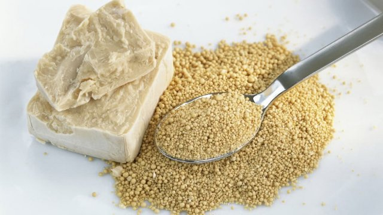{ loading=lazy }

La levure est comme une poudre magique qui rend le pain moelleux et savoureux !

- Type: Object
- Subjects: Food, Culture
- Country: International
- Topics: [Baguette](../topics/index.md#baguette)
- Image credit: CC0

---

### Lion {#animal_lion}
{ loading=lazy }

Un grand félin surnommé le roi des animaux. Il vit en groupes appelés troupes.

- Type: Object
- Subjects: Animal, Environment
- Country: International
- Topics: [Zoo Animals](../topics/index.md#zoo)
- Image credit: CC0
- Quests: [Le zoo (pl_04)](../quests/quest/pl_04.md)

---

### Lionceau {#animal_lion_cub}
{ loading=lazy }

Un petit lion à la fourrure douce et aux grandes pattes. Il passe ses journées à jouer et à rugir doucement.

- Type: Object
- Country: International
- Image credit: CC0 | [source](https://commons.wikimedia.org/wiki/File:Lion_cub_in_Masai_Mara_National_Park.jpg)
- Quests: [Le zoo (pl_04)](../quests/quest/pl_04.md)

---

### Lituanie {#country_lithuania}
{ loading=lazy }

Un pays d'Europe dont la capitale est Vilnius.

- Type: Place
- Subjects: Geography, Culture
- Country: International
- Topics: [Poland Countries](../topics/index.md#poland_countries_around)
- Image credit: CC_BY_SA | Diliff | [source](https://commons.wikimedia.org/wiki/File:Vilnius_Modern_Skyline_At_Dusk,_Lithuania_-_Diliff.jpg)

---

### Lunettes de soleil {#sunglasses}
{ loading=lazy }

Des lunettes qui protègent vos yeux de la lumière vive.

- Type: Object
- Subjects: Health, Safety, Weather
- Country: International
- Topics: [mountain tools](../topics/index.md#mountain_tools)
- Image credit: CC_BY_SA | Sofiane mohammed amri | [source](https://commons.wikimedia.org/wiki/File:2_الحداد.jpg)
- Quests: [Mont Blanc et montagnes (fr_08)](../quests/quest/fr_08.md)

---

### Luxembourg {#country_luxembourg}
{ loading=lazy }

Un pays d'Europe dont la capitale est la ville de Luxembourg.

- Type: Place
- Subjects: Geography, Culture
- Country: International
- Topics: [Countries around France](../topics/index.md#france_countries_around)
- Image credit: CC_BY_SA | Cayambe | [source](https://commons.wikimedia.org/wiki/File:Luxembourg_Pfaffenthal_Alzette_Béinchen_01.jpg)

---

### Léonard de Vinci {#person_leonardodavinci}
{ loading=lazy }

Un artiste et scientifique italien exceptionnel. Il a peint la Joconde et inventé les machines volantes des siècles avant les avions !

- Type: Person
- Subjects: Art, Science, History
- Year: 1452
- Country: International
- Topics: [Louvre](../topics/index.md#louvre)
- Image credit: CC0

---

### Manchot {#animal_penguin}
{ loading=lazy }

Un oiseau qui ne peut pas voler mais qui nage très bien. Il vit dans les régions froides.

- Type: Object
- Subjects: Animal, Environment
- Country: International
- Topics: [Zoo Animals](../topics/index.md#zoo)
- Image credit: CC0 | [source](https://upload.wikimedia.org/wikipedia/commons/1/1d/Penguin_in_Antarctica_jumping_out_of_the_water.jpg)
- Quests: [Le zoo (pl_04)](../quests/quest/pl_04.md)

---

### Manteau {#coat}
{ loading=lazy }

Une veste chaude pour le temps froid.

- Type: Object
- Subjects: Health, Safety, Weather
- Country: International
- Image credit: CC_BY_SA | Calistemon | [source](https://commons.wikimedia.org/wiki/File:White_American_Staffordshire_Terrier_in_Vegemite_coat,_August_2022.jpg)
- Quests: [Mont Blanc et montagnes (fr_08)](../quests/quest/fr_08.md)

---

### Marchand de légumes {#person_greengrocer}
{ loading=lazy }

Une personne qui vend des fruits et légumes frais.

- Type: Person
- Subjects: History, Culture
- Country: International
- Topics: [market traders](../topics/index.md#marketers)
- Image credit: CC0 | [source](https://commons.wikimedia.org/wiki/File:Barcelona_330DSC_0356_(49865911251).jpg)
- Quests: [Nourriture et marché (fr_09)](../quests/quest/fr_09.md)

---

### Marché médiéval {#medieval_market}
{ loading=lazy }

Un marché à l'ancienne où les gens achètent et vendent des marchandises.

- Type: Place
- Subjects: History, Culture, Community
- Country: International
- Image credit: CC_BY_SA | Axel Cotón Gutiérrez | [source](https://commons.wikimedia.org/wiki/File:Feria_Medieval_de_Hämeenlinna_2007_(Horse_Fighting).jpg)
- Quests: [Pain d'épices et marché alimentaire (pl_06)](../quests/quest/pl_06.md)

---

### Maria Skłodowska-Curie {#maria_skodowskacurie}
{ loading=lazy }

Un scientifique qui a remporté deux prix Nobel.

- Type: Person
- Subjects: Science, History
- Country: International
- Image credit: CC0 | Henri Manuel | [source](https://commons.wikimedia.org/wiki/File:Marie_Curie_c._1920s.jpg)
- Quests: [Découvrir Varsovie (pl_01)](../quests/quest/pl_01.md)

---

### Marmotte {#marmot}
{ loading=lazy }

Un animal de montagne à fourrure qui siffle.

- Type: Object
- Subjects: Animal, Environment, Science
- Country: International
- Image credit: CC_BY_SA | Photography captured by Giles Laurent | [source](https://commons.wikimedia.org/wiki/File:071_Wild_marmot_at_Grand_Muveran_Nature_Reserve_Photo_by_Giles_Laurent.jpg)
- Quests: [Mont Blanc et montagnes (fr_08)](../quests/quest/fr_08.md)

---

### Mathématiques élémentaires {#elementary_maths}
Chiffres et formes de la vie quotidienne : compter, additionner et soustraire, fractions simples, mesurer, lire l'heure et utiliser l'argent.

- Type: None
- Country: International
- Topics: [Elementary Math](../topics/index.md#elementary-maths)

---

### Mazurek Dąbrowskiego {#mazurek_dabrowskiego}
{ loading=lazy }

L'hymne national de la Pologne.

- Type: Concept
- Subjects: Music, History, Culture
- Country: International
- Image credit: CC0 | Józef Wybicki (1747–1822) | [source](https://commons.wikimedia.org/wiki/File:Mazurek_Dąbrowskiego_manuscript.jpg)
- Quests: [Découvrir Varsovie (pl_01)](../quests/quest/pl_01.md)

---

### Menu de la cantine {#object_canteen_menu}
{ loading=lazy }

Une liste des aliments autorisés à la cantine. Elle vous aide à choisir vos repas !

- Type: Object
- Subjects: Community, Culture
- Country: International
- Topics: [French School](../topics/index.md#frenchschool)
- Image credit: CC0 | CC0 - Valeria | [source](https://pixabay.com/photos/menu-restaurant-diner-cafe-8165227/)
- Quests: [Le système scolaire (fr_02)](../quests/quest/fr_02.md)

---

### mer Baltique {#baltic_sea}
{ loading=lazy }

Une vaste mer d'Europe du Nord, où se rencontrent la Pologne, l'Allemagne et d'autres pays. Elle possède de magnifiques plages et est réputée pour ses trésors d'ambre !

- Rationale: The Baltic Sea teaches kids about marine geography and Poland's coastal access
- Type: Place
- Subjects: Geography, Environment
- Country: International
- Topics: [gdansk](../topics/index.md#gdansk)
- Image credit: CC0
- Quests: [Le collier d'ambre de Gdańsk (pl_05)](../quests/quest/pl_05.md)

---

### Minsk {#capital_minsk}
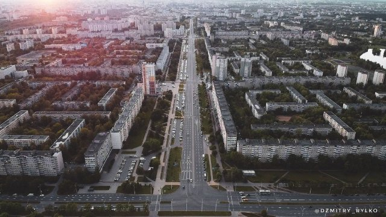{ loading=lazy }

La capitale de la Biélorussie.

- Type: Place
- Subjects: Geography, Culture
- Country: International
- Image credit: CC0 | Dzmitry Rylko | [source](https://commons.wikimedia.org/wiki/File:Minsk,_Belarus,_Serebryanka.jpg)

---

### Monnaie euro {#currency_euro}
{ loading=lazy }

Monnaie utilisée dans de nombreux pays d'Europe. Vous pouvez acheter des jouets et des glaces avec des euros !

- Type: Concept
- Subjects: Money, Geography
- Country: International
- Image credit: CC0 | [source](https://commons.wikimedia.org/wiki/File:Euro_coins_and_banknotes_%28cropped%29.jpg)
- Quests: [Nourriture et marché (fr_09)](../quests/quest/fr_09.md)

---

### Mont Blanc {#place_mont_blanc}
{ loading=lazy }

La plus haute montagne d'Europe occidentale. Recouverte de neige toute l'année.

- Type: Place
- Subjects: Geography, Environment
- Country: International
- Topics: [mont blanc](../topics/index.md#mont_blanc)
- Image credit: CC0

---

### Montagne {#mountain}
{ loading=lazy }

Les piliers de la terre

- Type: Concept
- Subjects: Environment, Education
- Country: International
- Topics: [mont blanc](../topics/index.md#mont_blanc), [mountain activities](../topics/index.md#mountain_activities), [mountain tools](../topics/index.md#mountain_tools)
- Image credit: CC_BY | Vyacheslav Argenberg | [source](https://commons.wikimedia.org/wiki/File:Himalayas,_Ama_Dablam,_Nepal.jpg)
- Quests: [Mont Blanc et montagnes (fr_08)](../quests/quest/fr_08.md)

---

### Monument Nicolas Copernic (Varsovie) {#nicolaus_copernicus_monument_warsaw}
{ loading=lazy }

Un monument à l'astronome Nicolas Copernic.

- Type: Place
- Subjects: Science, History, Culture
- Country: International
- Image credit: CC_BY_SA | Rhododendrites | [source](https://commons.wikimedia.org/wiki/File:Staszic_Palace_(22226p).jpg)
- Quests: [Découvrir Varsovie (pl_01)](../quests/quest/pl_01.md)

---

### Moscou {#capital_moscow}
{ loading=lazy }

La capitale de la Russie.

- Type: Place
- Subjects: Geography, Culture
- Country: International
- Image credit: CC_BY_SA | Dmitry A. Mottl (cropped by King of Hearts) | [source](https://commons.wikimedia.org/wiki/File:Moscow_State_University_crop.jpg)

---

### Moule à pain d'épices {#gingerbread_mold}
{ loading=lazy }

Un outil de forme qui permet de créer des formes de biscuits amusantes.

- Type: Object
- Subjects: Food, Art
- Country: International
- Topics: [Gingerbread](../topics/index.md#gingerbread)
- Image credit: CC_BY_SA | Piotr Kuczyński | [source](https://commons.wikimedia.org/wiki/File:Traditional_gingerbread_mold_2_(Piotr_Kuczynski).jpg)
- Quests: [Pain d'épices et marché alimentaire (pl_06)](../quests/quest/pl_06.md)

---

### Neige {#snow}
{ loading=lazy }

Eau gelée qui tombe par temps froid.

- Type: Concept
- Subjects: Weather, Environment, Science
- Country: International
- Topics: [mont blanc](../topics/index.md#mont_blanc)
- Image credit: CC_BY_SA | Psy guy | [source](https://commons.wikimedia.org/wiki/File:Snow_Scene_at_Shipka_Pass_1.JPG)
- Quests: [Mont Blanc et montagnes (fr_08)](../quests/quest/fr_08.md)

---

### Numéro 0 {#number_0}
{ loading=lazy }

Ce numéro est superflu, mais il est important ! Il vient avant tous les autres.

- Type: None
- Country: International
- Image credit: CC0

---

### Numéro 1 {#number_1}
{ loading=lazy }

Le tout premier chiffre ! Il ne signifie qu'une chose.

- Type: None
- Country: International
- Image credit: CC0

---

### Numéro 2 {#number_2}
{ loading=lazy }

Une paire, comme deux yeux ou deux chaussures. Il adore avoir un ami !

- Type: None
- Country: International
- Image credit: CC0

---

### Numéro 3 {#number_3}
{ loading=lazy }

Trois signifie un groupe, comme un trépied ou un tricycle !

- Type: None
- Country: International
- Image credit: CC0

---

### Numéro 4 {#number_4}
{ loading=lazy }

Quatre pieds assurent la stabilité, comme des pieds de table. C'est solide et équilibré !

- Type: None
- Country: International
- Image credit: CC0

---

### Orange {#food_orange}
{ loading=lazy }

Un fruit rond et orange, au goût sucré et juteux. L'orange est riche en vitamine C !

- Type: Object
- Subjects: Food, Culture
- Country: International
- Topics: [Bouillabaisse](../topics/index.md#bouillabaisse)
- Image credit: CC0 | [source](https://commons.wikimedia.org/wiki/File:Orange-Fruit-Pieces.jpg)
- Quests: [Nourriture et marché (fr_09)](../quests/quest/fr_09.md)

---

### Pain {#food_bread}
{ loading=lazy }

Un délicieux aliment à base de farine et d'eau. Vous pouvez faire des sandwichs avec du pain !

- Type: Object
- Subjects: Food, Culture
- Country: International
- Topics: [Bouillabaisse](../topics/index.md#bouillabaisse)
- Image credit: CC0 | [source](https://commons.wikimedia.org/wiki/File:French_bread_DSC09293.jpg)
- Quests: [Nourriture et marché (fr_09)](../quests/quest/fr_09.md)

---

### Palais de la culture et de la science {#palace_of_culture_and_science}
{ loading=lazy }

Un grand bâtiment pour les musées, les théâtres et l'apprentissage.

- Type: Place
- Subjects: Culture, Education, History
- Country: International
- Image credit: CC_BY_SA | A.Savin
- Quests: [Découvrir Varsovie (pl_01)](../quests/quest/pl_01.md)

---

### Palais présidentiel {#presidential_palace}
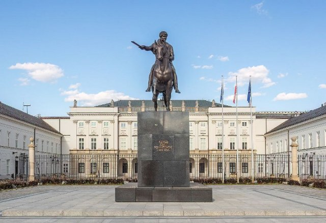{ loading=lazy }

La résidence officielle du président de la Pologne.

- Type: Place
- Subjects: Civics, History, Culture
- Country: International
- Image credit: CC_BY_SA | Rhododendrites | [source](https://commons.wikimedia.org/wiki/File:Warsaw_Presidential_Palace_(22248p).jpg)
- Quests: [Découvrir Varsovie (pl_01)](../quests/quest/pl_01.md)

---

### Panneau de DANGER {#danger_sign}
{ loading=lazy }

Un panneau avertissant d'un danger imminent. Soyez extrêmement prudent.

- Type: Object
- Subjects: Safety
- Country: International
- Topics: [Stree safety](../topics/index.md#street-safety)
- Image credit: CC0 | Government of Singapore - Land Transport Authority, Public domain, via Wikimedia Commons | [source](https://commons.wikimedia.org/wiki/File:Singapore_road_sign_-_Warning_-_Other_danger.svg)

---

### Panneau STOP {#stop_sign}
{ loading=lazy }

Un panneau rouge qui signifie que vous devez arrêter votre véhicule.

- Type: Object
- Subjects: Safety, Transportation
- Country: International
- Topics: [Stree safety](../topics/index.md#street-safety)
- Image credit: CC0

---

### Paris {#capital_paris}
{ loading=lazy }

Paris, capitale de la France, possède une célèbre tour haute appelée la Tour Eiffel !

- Type: Place
- Subjects: Geography, Culture
- Country: International
- Topics: [France country](../topics/index.md#france-country), [Baguette](../topics/index.md#baguette), [Eiffel Tower](../topics/index.md#eiffel-tower), [Louvre](../topics/index.md#louvre), [Notre Dame](../topics/index.md#notredame)
- Image credit: CC0 | Yann Caradec from Paris, France, CC BY-SA 2.0 <https://creativecommons.org/licenses/by-sa/2.0>, via Wikimedia Commons | [source](https://commons.wikimedia.org/wiki/File:La_Tour_Eiffel_vue_de_la_Tour_Saint-Jacques,_Paris_ao%C3%BBt_2014_(2).jpg)
- Quests: [Paris ! (fr_01)](../quests/quest/fr_01.md)

---

### Passerelles {#place_bridge_people}
{ loading=lazy }

De petits ponts pour les piétons. Ils vous protègent de la circulation.

- Type: Place
- Subjects: Geography, Environment
- Country: International
- Topics: [Seine Bridges](../topics/index.md#seine_bridges)
- Image credit: CC0
- Quests: [Paris Seine (fr_10)](../quests/quest/fr_10.md)

---

### Pièces {#coins}
{ loading=lazy }

Petite monnaie ronde en métal.

- Type: Object
- Subjects: Money
- Country: International
- Image credit: CC_BY_SA | Livioandronico2013 | [source](https://commons.wikimedia.org/wiki/File:Coins_of_the_Italian_Republic_(500_Lire)_silver_(Caravels).png)
- Quests: [Pain d'épices et marché alimentaire (pl_06)](../quests/quest/pl_06.md)

---

### Pièces de złoty {#zoty_coins}
{ loading=lazy }

Monnaie polonaise (złoty) représentée sous forme de pièces de monnaie.

- Type: Object
- Subjects: Money, Geography
- Country: International
- Image credit: CC0 | Kaźmirz Stronczyński | [source](https://commons.wikimedia.org/wiki/File:Czerwony_złoty_gdański_1577r.jpg)
- Quests: [Découvrir Varsovie (pl_01)](../quests/quest/pl_01.md)

---

### Plant de pommiers {#plant_apple}
{ loading=lazy }

Un arbre aux fleurs roses et aux fruits rouges savoureux. Il adore le soleil et nous offre des pommes croquantes !

- Type: Object
- Country: International
- Image credit: CC0 | [source](https://commons.wikimedia.org/wiki/File:Tree_with_red_apples_in_Barkedal_4.jpg)
- Quests: [Le zoo (pl_04)](../quests/quest/pl_04.md)

---

### Plante d'acacia {#tree_wattle}
{ loading=lazy }

Une plante couverte de minuscules fleurs dorées. Elle illumine la terre de sa lueur jaune !

- Type: Object
- Country: International
- Image credit: CC0 | [source](https://commons.wikimedia.org/wiki/File:Acacia_sp._(51489535138).jpg)
- Quests: [Le zoo (pl_04)](../quests/quest/pl_04.md)

---

### Plante orange {#plant_orange}
{ loading=lazy }

Un arbre vert brillant aux oranges rondes et juteuses. Son parfum frais et sucré rappelle celui du soleil !

- Type: Object
- Country: International
- Image credit: CC0 | [source](https://commons.wikimedia.org/wiki/File:Citrus_sinensis_JPG01.jpg)
- Quests: [Le zoo (pl_04)](../quests/quest/pl_04.md)

---

### Poisson {#food_fish}
{ loading=lazy }

Un animal qui vit et nage dans l'eau. Les poissons ont des nageoires et des branchies pour respirer sous l'eau.

- Type: Object
- Subjects: Food, Culture
- Country: International
- Topics: [Bouillabaisse](../topics/index.md#bouillabaisse)
- Image credit: CC0 | [source](https://commons.wikimedia.org/wiki/File:Grouper_fish_for_Sale.jpg)
- Quests: [Nourriture et marché (fr_09)](../quests/quest/fr_09.md)

---

### Poissonnier {#person_fishmonger}
{ loading=lazy }

Une personne qui vend du poisson frais et des fruits de mer.

- Type: Person
- Subjects: History, Culture
- Country: International
- Topics: [market traders](../topics/index.md#marketers)
- Image credit: CC0 | [source](https://commons.wikimedia.org/wiki/File:Fishmonger_weighing_fish_at_Payang_Market,_Kuala_Terengganu.jpg)
- Quests: [Nourriture et marché (fr_09)](../quests/quest/fr_09.md)

---

### Poivre Sel {#food_pepper_salt}
{ loading=lazy }

Des épices qui rehaussent le goût des aliments. Le sel est blanc et le poivre est noir avec de petits morceaux.

- Type: Object
- Subjects: Food, Culture
- Country: International
- Topics: [Bouillabaisse](../topics/index.md#bouillabaisse)
- Image credit: CC0 | [source](https://commons.wikimedia.org/wiki/File:Salt_and_Pepper_Shakers_%284572668303%29.jpg)
- Quests: [Nourriture et marché (fr_09)](../quests/quest/fr_09.md)

---

### Pologne {#country_poland}
{ loading=lazy }

Un pays d'Europe dont la capitale est Varsovie. La Pologne est célèbre pour ses scientifiques comme Copernic et ses délicieux pierogi !

- Type: Place
- Subjects: Geography, Culture
- Country: International
- Topics: [Poland country](../topics/index.md#poland-country), [Poland Countries](../topics/index.md#poland_countries_around)
- Image credit: CC_BY_SA | Diego Delso | [source](https://commons.wikimedia.org/wiki/File:Basílica_de_Nuestra_Señora_de_Licheń,_Stary_Licheń,_Polonia,_2016-12-21,_DD_39-41_HDR.jpg)

---

### Pomme {#food_apple}
{ loading=lazy }

Rouge, rond et croquant sous la dent. Un fruit savoureux qui vous garde en forme !

- Type: Object
- Country: International
- Image credit: CC0 | [source](https://commons.wikimedia.org/wiki/File:Red_Apple.jpg)
- Quests: [Le zoo (pl_04)](../quests/quest/pl_04.md)

---

### Pont du Château {#place_castle_bridge}
{ loading=lazy }

Un pont près d'un château. Les châteaux sont de grands bâtiments solides où vivaient autrefois rois et reines.

- Type: Place
- Subjects: Culture, Community
- Country: International
- Image credit: CC0

---

### Pont pour trains {#place_bridge_trains}
{ loading=lazy }

Un pont spécial construit suffisamment solide pour que les trains lourds puissent traverser l'eau.

- Type: Place
- Subjects: Geography, Environment
- Country: International
- Topics: [Seine Bridges](../topics/index.md#seine_bridges)
- Image credit: CC0
- Quests: [Paris Seine (fr_10)](../quests/quest/fr_10.md)

---

### Pont pour voitures {#place_bridge_cars}
{ loading=lazy }

Une route qui traverse l'eau pour que les voitures puissent traverser les rivières et les lacs.

- Type: Place
- Subjects: Geography, Environment
- Country: International
- Topics: [Seine Bridges](../topics/index.md#seine_bridges)
- Image credit: CC0
- Quests: [Paris Seine (fr_10)](../quests/quest/fr_10.md)

---

### Portail {#antura_portal}
{ loading=lazy }

Une porte magique qui vous mène vers de nouveaux horizons. Entrez et découvrez où elle vous mène !

- Type: Object
- Country: International
- Topics: [Antura's world](../topics/index.md#antura-world)
- Image credit: CC0

---

### Prague {#capital_prague}
{ loading=lazy }

La capitale de la République tchèque.

- Type: Place
- Subjects: Geography, Culture
- Country: International
- Image credit: CC_BY_SA | Dmitry A. Mottl | [source](https://commons.wikimedia.org/wiki/File:Vltava_river_in_Prague.jpg)

---

### Président {#person_president}
{ loading=lazy }

Le dirigeant choisi pour diriger le pays. Les citoyens votent aux élections.

- Type: Person
- Subjects: History, Culture
- Country: International
- Image credit: CC0 | Aaron Shikler | [source](https://commons.wikimedia.org/wiki/File:John_F_Kennedy_Official_Portrait.jpg)

---

### Randonnée {#hiking}
{ loading=lazy }

Promenade sur les sentiers en pleine nature.

- Type: Concept
- Subjects: Recreation, Sport, Environment
- Country: International
- Topics: [mountain activities](../topics/index.md#mountain_activities)
- Image credit: CC_BY_SA | Diego Delso | [source](https://commons.wikimedia.org/wiki/File:Roca_de_la_Ley,_Parque_Nacional_de_Þingvellir,_Suðurland,_Islandia,_2014-08-16,_DD_022.JPG)
- Quests: [Mont Blanc et montagnes (fr_08)](../quests/quest/fr_08.md)

---

### Renard {#animal_fox}
{ loading=lazy }

Un prédateur intelligent qui vit dans les bois. Sa queue douce le tient chaud.

- Type: None
- Country: International
- Image credit: CC0 | [source](https://commons.wikimedia.org/wiki/File:Renard_roux_en_for%C3%AAt.jpg)
- Quests: [Le zoo (pl_04)](../quests/quest/pl_04.md)

---

### Robert Lewandowski {#robert_lewandowski}
{ loading=lazy }

Un célèbre footballeur polonais.

- Type: Person
- Subjects: Sport, Culture
- Country: International
- Image credit: CC_BY_SA | Екатерина Лаут | [source](https://commons.wikimedia.org/wiki/File:Robert_Lewandowski_2018_(cropped).jpg)
- Quests: [Découvrir Varsovie (pl_01)](../quests/quest/pl_01.md)

---

### Russie {#country_russia}
{ loading=lazy }

Un pays d'Europe. Sa capitale est Moscou.

- Type: Place
- Subjects: Geography, Culture
- Country: International
- Topics: [Poland Countries](../topics/index.md#poland_countries_around)
- Image credit: CC_BY_SA | Canes | [source](https://commons.wikimedia.org/wiki/File:Мечеть_Санкт-Петербурга._Майолика_портала.jpg)

---

### Règle {#math_ruler}
{ loading=lazy }

Un outil droit utilisé pour mesurer la longueur des objets. Les règles comportent des chiffres et des lignes.

- Type: Object
- Subjects: Math
- Country: International
- Topics: [Elementary Math](../topics/index.md#elementary-maths)
- Image credit: CC0 | [source](https://commons.wikimedia.org/wiki/File:Righello.jpg)
- Quests: [Le système scolaire (fr_02)](../quests/quest/fr_02.md)

---

### République tchèque {#country_czech_republic}
{ loading=lazy }

Un pays d'Europe dont la capitale est Prague.

- Type: Place
- Subjects: Geography, Culture
- Country: International
- Topics: [Poland Countries](../topics/index.md#poland_countries_around)
- Image credit: CC_BY_SA | Tadeáš Bednarz | [source](https://commons.wikimedia.org/wiki/File:Daniel_Souček_U21_Czech_Republic_vs_Greece_10-10-2019.jpg)

---

### Sac à dos {#backpack}
{ loading=lazy }

Un sac que vous portez sur votre dos.

- Type: Object
- Subjects: Recreation, Transportation, Education
- Country: International
- Topics: [mountain tools](../topics/index.md#mountain_tools)
- Image credit: CC_BY_SA | FOTO:Fortepan — ID 20607: Adományozó/Donor: Wein Sarolta. archive copy at the Wayback Machine | [source](https://commons.wikimedia.org/wiki/File:Colorful,_backpack_Fortepan_20607.jpg)
- Quests: [Mont Blanc et montagnes (fr_08)](../quests/quest/fr_08.md)

---

### Sel {#food_salt}
{ loading=lazy }

Des cristaux blancs qui améliorent le goût des aliments.

- Type: Object
- Subjects: Food, Culture
- Country: International
- Topics: [Baguette](../topics/index.md#baguette)
- Image credit: CC0

---

### Singe {#animal_monkey}
{ loading=lazy }

Un animal intelligent qui peut grimper et jouer. Certains singes vivent en grandes familles.

- Type: Object
- Subjects: Animal, Environment
- Country: International
- Topics: [Zoo Animals](../topics/index.md#zoo)
- Image credit: CC0

---

### Ski {#skiing}
{ loading=lazy }

Glisser sur la neige avec des skis.

- Type: Concept
- Subjects: Sport, Recreation
- Country: International
- Topics: [mountain activities](../topics/index.md#mountain_activities)
- Image credit: CC_BY | Letartean | [source](https://commons.wikimedia.org/wiki/File:Quebec_Sprint_Cross-country_Skiing_World_Cup_2012_(4)_V2.jpg)
- Quests: [Mont Blanc et montagnes (fr_08)](../quests/quest/fr_08.md)

---

### Slovaquie {#country_slovakia}
{ loading=lazy }

Un pays d'Europe dont la capitale est Bratislava.

- Type: Place
- Subjects: Geography, Culture
- Country: International
- Topics: [Poland Countries](../topics/index.md#poland_countries_around)
- Image credit: CC_BY_SA | Oto Zapletal | [source](https://commons.wikimedia.org/wiki/File:Suspension_pedestrian_bridge_over_the_Orava_River_in_Dolny_Kubín,_the_Slovak_republic_01.jpg)

---

### Soleil {#sun}
{ loading=lazy }

Une lumière vive qui peut se refléter sur la neige.

- Type: Concept
- Subjects: Science, Weather, Environment
- Country: International
- Image credit: CC0 | NASA/SDO (AIA) | [source](https://commons.wikimedia.org/wiki/File:The_Sun_by_the_Atmospheric_Imaging_Assembly_of_NASA's_Solar_Dynamics_Observatory_-_20100819.jpg)
- Quests: [Mont Blanc et montagnes (fr_08)](../quests/quest/fr_08.md)

---

### Sommet {#summit}
{ loading=lazy }

Le sommet d'une montagne.

- Type: Concept
- Subjects: Geography, Environment, Education
- Country: International
- Topics: [mont blanc](../topics/index.md#mont_blanc)
- Image credit: CC_BY | Mountaineer | [source](https://commons.wikimedia.org/wiki/File:Summitting_Island_Peak.jpg)
- Quests: [Mont Blanc et montagnes (fr_08)](../quests/quest/fr_08.md)

---

### Stade national (Varsovie) {#national_stadium_warsaw}
{ loading=lazy }

Un stade moderne pour les matchs de football et les concerts.

- Type: Place
- Subjects: Sport, Culture, Community
- Country: International
- Image credit: CC_BY_SA | Arne Müseler | [source](https://commons.wikimedia.org/wiki/File:National_Stadium_Warsaw_aerial_view_2.jpg)
- Quests: [Découvrir Varsovie (pl_01)](../quests/quest/pl_01.md)

---

### Statue des guerres et de Sawa {#wars_and_sawa_statue}
{ loading=lazy }

Une statue représentant la légende de la ville sur les guerres et Sawa.

- Type: Place
- Subjects: Culture, History
- Country: International
- Image credit: CC_BY_SA | Wistula
- Quests: [Découvrir Varsovie (pl_01)](../quests/quest/pl_01.md)

---

### Sucre {#food_sugar}
{ loading=lazy }

Le sucre est fabriqué à partir de plantes comme la betterave ou la canne à sucre. Il apporte de l'énergie et donne un goût délicieux aux gâteaux et aux biscuits.

- Type: Object
- Subjects: Food, Science
- Country: International
- Image credit: CC0 | Romain Behar, Public domain, via Wikimedia Commons | [source](https://commons.wikimedia.org/wiki/File:Sucre_blanc_cassonade_complet_rapadura.jpg)

---

### Suisse {#country_switzerland}
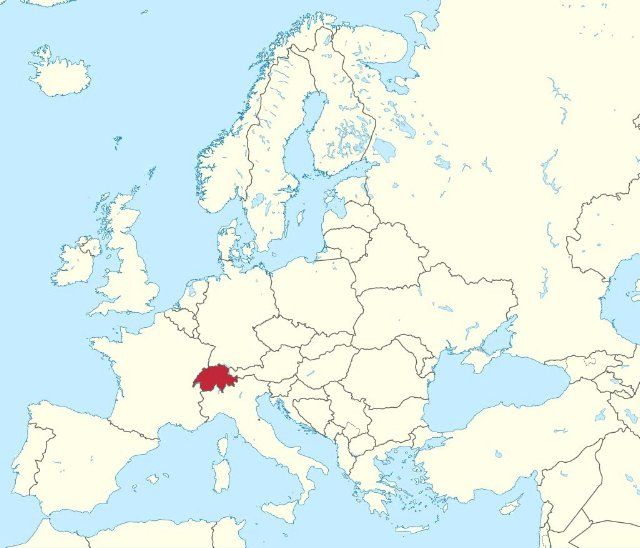{ loading=lazy }

Un pays d'Europe dont la capitale est Berne. La Suisse est célèbre pour ses montagnes et son fromage.

- Type: Place
- Subjects: Geography, Culture
- Country: International
- Topics: [Countries around France](../topics/index.md#france_countries_around)
- Image credit: CC_BY_SA | Giles Laurent | [source](https://commons.wikimedia.org/wiki/File:016_Wild_Golden_Eagle_in_flight_at_Pfyn-Finges_(Switzerland)_Photo_by_Giles_Laurent.jpg)

---

### Symbole cible {#antura_target}
{ loading=lazy }

Si vous voyez cela, allez-y. Cela pourrait être quelque chose d’important !

- Type: Concept
- Country: International
- Image credit: CC0

---

### Sécurité routière {#street_safety}
Des règles qui assurent la sécurité de tous sur la route.

- Type: Concept
- Subjects: Transportation, Civics, Health
- Country: International
- Topics: [Stree safety](../topics/index.md#street-safety)

---

### terrain de football {#soccer_field}
{ loading=lazy }

Le terrain en herbe où se joue le football.

- Type: Place
- Subjects: Sport, Recreation, Community
- Country: International
- Image credit: CC_BY_SA | لا روسا | [source](https://commons.wikimedia.org/wiki/File:Santiagobernabeupanoramav45.JPG)
- Quests: [Découvrir Varsovie (pl_01)](../quests/quest/pl_01.md)

---

### Tomate {#food_tomato}
{ loading=lazy }

Un fruit rouge et rond qui pousse sur les plantes. On utilise les tomates pour faire de la sauce à pizza !

- Type: Object
- Subjects: Food, Culture
- Country: International
- Topics: [Bouillabaisse](../topics/index.md#bouillabaisse)
- Image credit: CC0 | [source](https://commons.wikimedia.org/wiki/File:Tomato_je.jpg)
- Quests: [Nourriture et marché (fr_09)](../quests/quest/fr_09.md)

---

### Tram {#tram}
{ loading=lazy }

Un train urbain qui circule sur des rails dans la rue.

- Type: Object
- Subjects: Transportation, Technology, Community
- Country: International
- Image credit: CC_BY_SA | Chme82 | [source](https://commons.wikimedia.org/wiki/File:Flexity_Tram_Zürich_4001.jpg)
- Quests: [Découvrir Varsovie (pl_01)](../quests/quest/pl_01.md)

---

### Triangle {#fr_figure_triangle}
{ loading=lazy }

Une forme à trois côtés droits et trois coins. Les triangles ressemblent à des parts de pizza !

- Type: Concept
- Subjects: Math
- Country: International
- Topics: [Elementary Math](../topics/index.md#elementary-maths)
- Image credit: CC0 | [source](https://commons.wikimedia.org/wiki/File:Lobatchevski_-_La_Th%C3%A9orie_des_parall%C3%A8les,_1980_-_Fig-1-05.png)
- Quests: [Le système scolaire (fr_02)](../quests/quest/fr_02.md)

---

### Ukraine {#country_ukraine}
{ loading=lazy }

Un pays d'Europe. Sa capitale est Kyiv.

- Type: Place
- Subjects: Geography, Culture
- Country: International
- Image credit: CC_BY_SA | Misha Reme | [source](https://commons.wikimedia.org/wiki/File:Найкращі_миті_життя.jpg)

---

### Un bateau pour les gens {#boat_people}
{ loading=lazy }

Un bateau qui transporte des personnes d’un endroit à un autre à travers l’eau.

- Type: Place
- Subjects: Geography, Environment
- Country: International
- Image credit: CC0

---

### Varsovie {#capital_warsaw}
{ loading=lazy }

La capitale de la Pologne.

- Type: Place
- Subjects: Geography, Culture
- Country: International
- Topics: [Poland country](../topics/index.md#poland-country)
- Image credit: CC_BY_SA | A.Savin | [source](https://commons.wikimedia.org/wiki/File:Warsaw_07-13_img29_View_from_Palace_of_Culture_and_Science.jpg)

---

### Vendeur d'épices {#person_spicevendor}
{ loading=lazy }

Vend des petits pots aux arômes délicieux comme la cannelle, le clou de girofle et le gingembre. Ils contribuent à rendre les plats chaleureux, sucrés et savoureux.

- Type: Person
- Subjects: History, Culture
- Country: International
- Image credit: CC0 | RajaKACEM, CC BY-SA 4.0 <https://creativecommons.org/licenses/by-sa/4.0>, via Wikimedia Commons | [source](https://commons.wikimedia.org/wiki/File:Salesmanspice.jpg)

---

### Vendeur d'œufs {#egg_vendor}
{ loading=lazy }

Une personne qui vend des œufs.

- Type: Person
- Subjects: Community, Food
- Country: International
- Image credit: CC_BY_SA | Elgabarty2002 | [source](https://commons.wikimedia.org/wiki/File:Egg_Seller_in_Nigeria.jpg)
- Quests: [Pain d'épices et marché alimentaire (pl_06)](../quests/quest/pl_06.md)

---

### Vendeur de produits laitiers {#dairy_vendor}
{ loading=lazy }

Une personne qui vend du lait, du beurre et du fromage.

- Type: Person
- Subjects: Community, Food
- Country: International
- Image credit: CC_BY_SA | Something Original (talk) | [source](https://commons.wikimedia.org/wiki/File:Pennsylvania_State_University_Food_Science_Building_and_Berkey_Creamery_May_15,_2010.jpg)
- Quests: [Pain d'épices et marché alimentaire (pl_06)](../quests/quest/pl_06.md)

---

### Vent {#wind}
{ loading=lazy }

Un air en mouvement qui peut sembler fort en montagne.

- Type: Concept
- Subjects: Weather, Environment
- Country: International
- Topics: [mont blanc](../topics/index.md#mont_blanc)
- Image credit: CC0 | Richardfabi | [source](https://commons.wikimedia.org/wiki/File:Windbuchencom.jpg)
- Quests: [Mont Blanc et montagnes (fr_08)](../quests/quest/fr_08.md)

---

### Ville de Luxembourg {#capital_luxembourg_city}
{ loading=lazy }

La capitale du Luxembourg.

- Type: Place
- Subjects: Geography, Culture
- Country: International
- Topics: [Countries around France](../topics/index.md#france_countries_around)
- Image credit: CC_BY_SA | Krzysztof Golik | [source](https://commons.wikimedia.org/wiki/File:City_Hall_of_Luxembourg_City_01.jpg)

---

### Vilnius {#capital_vilnius}
{ loading=lazy }

La capitale de la Lituanie.

- Type: Place
- Subjects: Geography, Culture
- Country: International
- Image credit: CC_BY_SA | Diliff | [source](https://commons.wikimedia.org/wiki/File:Vilnius_Modern_Skyline_At_Dusk,_Lithuania_-_Diliff.jpg)

---

### Voiture {#car}
{ loading=lazy }

Un petit véhicule pour les routes.

- Type: Object
- Subjects: Transportation
- Country: International
- Image credit: CC_BY_SA | Rhododendrites | [source](https://commons.wikimedia.org/wiki/File:Abandoned_car_in_Marine_Park_(10852p).jpg)
- Quests: [Découvrir Varsovie (pl_01)](../quests/quest/pl_01.md)

---

### Vélo {#bike}
{ loading=lazy }

Un véhicule à deux roues sur lequel on pédale.

- Type: Object
- Subjects: Transportation, Sport, Health
- Country: International
- Image credit: CC_BY_SA | Basile Morin | [source](https://commons.wikimedia.org/wiki/File:Parked_bicycle_with_graffitied_building_facade_and_doors_in_Amsterdam.jpg)
- Quests: [Découvrir Varsovie (pl_01)](../quests/quest/pl_01.md)

---

### écoles françaises {#french_schools}
En France, l'école se déroule en quatre grandes étapes : la maternelle (apprentissage ludique pour les petits), l'école élémentaire (lecture, écriture, mathématiques), le collège et le lycée. À la fin du lycée, de nombreux élèves passent un examen important, le baccalauréat.

- Type: Concept
- Subjects: Education, Civics, Culture
- Country: International
- Topics: [French School](../topics/index.md#frenchschool)

---

### Éléphant {#animal_elephant}
{ loading=lazy }

Un gros animal avec une trompe. Les éléphants sont les plus grands animaux terrestres. Ils ont de grandes oreilles et adorent arroser !

- Rationale: Elephants are amazing animals that kids love learning about at the zoo!
- Type: Object
- Subjects: Animal, Environment
- Country: International
- Topics: [Zoo Animals](../topics/index.md#zoo)
- Words: elephant, zoo
- Image credit: CC0
- Quests: [Le zoo (pl_04)](../quests/quest/pl_04.md)

---

### Épicier {#person_grocer}
{ loading=lazy }

Une personne qui vend de nombreux types d’aliments et de boissons.

- Type: Person
- Subjects: History, Culture
- Country: International
- Topics: [market traders](../topics/index.md#marketers)
- Image credit: CC0 | [source](https://commons.wikimedia.org/wiki/File:Mercado_del_Progreso_(7706491614).jpg)
- Quests: [Nourriture et marché (fr_09)](../quests/quest/fr_09.md)

---

### Île-de-France {#ile_de_france}
{ loading=lazy }

Région de France où se trouve Paris, la capitale. De nombreuses personnes y vivent !

- Type: Place
- Subjects: Geography, Environment
- Country: International
- Topics: [Notre Dame](../topics/index.md#notredame)
- Image credit: CC0
- Quests: [Paris ! (fr_01)](../quests/quest/fr_01.md)

---

### Œufs {#eggs}
{ loading=lazy }

Nourriture provenant de poulets utilisée pour la cuisson et la pâtisserie.

- Type: Object
- Subjects: Food, Animal
- Country: International
- Topics: [Gingerbread](../topics/index.md#gingerbread)
- Image credit: CC_BY_SA | George Chernilevsky | [source](https://commons.wikimedia.org/wiki/File:Eggs_in_basket_2020_G1.jpg)
- Quests: [Pain d'épices et marché alimentaire (pl_06)](../quests/quest/pl_06.md)

## France

### 24 Heures du Mans {#24_hours_of_le_mans}
{ loading=lazy }

Une course automobile qui dure 24 heures. Les équipes roulent jour et nuit.

- Type: Concept
- Subjects: Sport, Culture, History
- Country: France
- Image credit: CC0

---

### Allons enfants {#marseillaise_1}
{ loading=lazy }

Les premiers mots de la première ligne de l’hymne.

- Type: Object
- Subjects: Music, Education, Culture
- Country: France
- Topics: [marseillaise music](../topics/index.md#marseillaise_music)
- Image credit: CC0 | [source](https://commons.wikimedia.org/wiki/File:La_Marseillaise_chant_national_fran%C3%A7ais_de_Rouget_de_L%27Isle_Transcription_de_Langevin-2.jpg)
- Audio credit: PublicDomain | [source](https://commons.wikimedia.org/wiki/File:La_Marseillaise_(1914_Recording).ogg)
- Quests: [La Marseillaise (fr_11)](../quests/quest/fr_11.md)

---

### Arc {#bow}
{ loading=lazy }

Une arme qui tire des flèches.

- Type: Object
- Subjects: History, Technology
- Country: France
- Image credit: CC0 | Harold Dean Carsey (1886-1947) | [source](https://commons.wikimedia.org/wiki/File:Clara_Bow,_grayscale.jpg)

---

### Arc de Triomphe {#arc_de_triomphe}
{ loading=lazy }

Une grande arche à Paris, érigée en l'honneur des héros. On peut la voir briller au bout d'une longue avenue !

- Type: Place
- Country: France
- Image credit: CC0
- Quests: [La Marseillaise (fr_11)](../quests/quest/fr_11.md)

---

### Arc-boutant {#flying_buttress}
{ loading=lazy }

Bras de pierre à l'extérieur qui aident à soutenir les hauts murs.

- Type: Concept
- Subjects: Technology, History, Art
- Country: France
- Image credit: CC_BY_SA | Acroterion | [source](https://commons.wikimedia.org/wiki/File:Amiens_Cathedral_gallery_roof_and_buttresses_1980-1.jpg)
- Quests: [Paris ! (fr_01)](../quests/quest/fr_01.md)

---

### Armure {#armor}
{ loading=lazy }

Vêtement de protection en métal pour chevalier.

- Type: Object
- Subjects: History, Safety
- Country: France
- Image credit: CC0 | [source](https://commons.wikimedia.org/wiki/File:Armor_MET_DP271145.jpg)

---

### Ascenseurs de la Tour Eiffel {#eiffel_tower_elevators}
{ loading=lazy }

Ascenseurs qui emmènent les visiteurs en haut de la tour de fer.

- Type: Object
- Subjects: Technology, Transportation
- Country: France
- Image credit: CC0 | Louis-Emile Durandelle | [source](https://commons.wikimedia.org/wiki/File:Louis-Emile_Durandelle,_The_Eiffel_Tower_-_State_of_the_Construction,_1888.jpg)
- Quests: [Paris ! (fr_01)](../quests/quest/fr_01.md)

---

### Baguette française {#food_baguette}
{ loading=lazy }

Un pain long et croustillant, l'aliment le plus célèbre en France. Les Français achètent des baguettes fraîches tous les jours à la boulangerie !

- Rationale: Baguettes are iconic French culture that kids can easily understand and remember
- Type: Object
- Subjects: Food, Culture
- Year: 1700
- Country: France
- Topics: [Baguette](../topics/index.md#baguette)
- Image credit: CC0
- Quests: [Paris ! (fr_01)](../quests/quest/fr_01.md), [DEV (dev)](../quests/quest/dev.md)

---

### Bateau sur la Seine {#boat_eiffel_tower}
{ loading=lazy }

Un bateau exceptionnel qui navigue sur la Seine à Paris. Depuis l'eau, vous pourrez admirer la Tour Eiffel et d'autres magnifiques monuments !

- Rationale: Boat tours help kids see Paris from a different perspective and understand river transportation
- Type: Concept
- Subjects: Transportation, Geography, Culture
- Year: 1900
- Country: France
- Image credit: CC0
- Quests: [Paris Seine (fr_10)](../quests/quest/fr_10.md)

---

### Bouillabaisse {#bouillabaisse}
{ loading=lazy }

Une soupe de poisson typique de Marseille, dans le sud de la France. Elle est composée de différentes variétés de poissons et dégage une délicieuse odeur !

- Type: Object
- Subjects: Food, Culture
- Year: 1700
- Country: France
- Topics: [Bouillabaisse](../topics/index.md#bouillabaisse)
- Image credit: CC0 | [source](https://www.pexels.com/photo/delicious-red-soup-on-table-17568746/)
- Quests: [Nourriture et marché (fr_09)](../quests/quest/fr_09.md)

---

### Carte de la Seine {#seine_map}
{ loading=lazy }

Une image qui montre la Seine et où elle coule à travers le territoire.

- Type: Object
- Subjects: Geography, Environment
- Country: France
- Image credit: CC0
- Quests: [Paris Seine (fr_10)](../quests/quest/fr_10.md)

---

### Carte de la Seine à Paris {#seine_map_in_paris}
{ loading=lazy }

Une image qui montre comment la Seine traverse la ville de Paris.

- Type: Object
- Subjects: Science
- Country: France
- Image credit: CC0
- Quests: [Paris Seine (fr_10)](../quests/quest/fr_10.md)

---

### Casque {#helmet}
{ loading=lazy }

Un chapeau en métal qui protège la tête.

- Type: Object
- Subjects: History, Safety
- Country: France
- Image credit: CC0 | Jebulon | [source](https://commons.wikimedia.org/wiki/File:Cavalier_Garde_Républicaine_trois-quart_dos.jpg)

---

### Casque (sécurité routière) {#helmet_street_safety}
{ loading=lazy }

Un casque pour protéger votre tête lorsque vous roulez.

- Type: Object
- Subjects: Safety, Health, Education
- Country: France
- Topics: [Stree safety](../topics/index.md#street-safety)
- Image credit: CC_BY | Paul Arps from The Netherlands | [source](https://commons.wikimedia.org/wiki/File:Safety_helmet_(Myanmar_2013)_(11772851273).jpg)

---

### Catapulte {#catapult}
{ loading=lazy }

Une machine qui lance des pierres loin.

- Type: Object
- Subjects: Technology, History
- Country: France
- Image credit: CC_BY_SA | Jacek Halicki | [source](https://commons.wikimedia.org/wiki/File:2023_Proca_neurobalistyczna.jpg)

---

### Cathédrale {#cathedral}
{ loading=lazy }

Une très grande et importante église dans une ville.

- Type: Place
- Subjects: Culture, History, Education
- Country: France
- Image credit: CC_BY_SA | Richard Bartz, Munich aka Makro Freak | [source](https://commons.wikimedia.org/wiki/File:Svyato_Mihailovsky_Cathedral_Izhevsk_Russia_Richard_Bartz.jpg)
- Quests: [Paris ! (fr_01)](../quests/quest/fr_01.md)

---

### Chambre royale {#royal_bedroom}
{ loading=lazy }

Une chambre élégante avec un grand lit à baldaquin.

- Type: Place
- Subjects: Culture, History
- Country: France
- Image credit: CC0 | Aleksander Gryglewski | [source](https://commons.wikimedia.org/wiki/File:Aleksander_Gryglewski_-_Interior_of_the_royal_bedroom_at_the_Wilanów_Palace_-_MP_184_MNW_-_National_Museum_in_Warsaw.jpg)

---

### Chapeau à plumes {#feathered_hat}
{ loading=lazy }

Un beau chapeau avec une plume pour le style.

- Type: Object
- Subjects: Culture, History
- Country: France
- Image credit: CC0 | Gustav Klimt | [source](https://commons.wikimedia.org/wiki/File:Gustav_Klimt_019.jpg)

---

### Charte de la laïcité {#concept_charter_of_secularism}
{ loading=lazy }

Un ensemble de règles visant à respecter les croyances de chacun. Il contribue à une coexistence pacifique.

- Type: Concept
- Subjects: Community, Culture
- Year: 2013
- Country: France
- Topics: [French School](../topics/index.md#frenchschool)
- Image credit: CC0 | [source](https://camille-claudel.ecollege.haute-garonne.fr/le-college/charte-de-la-laicite/)
- Quests: [Le système scolaire (fr_02)](../quests/quest/fr_02.md), [Jules Verne et les transports (fr_03)](../quests/quest/fr_03.md)

---

### Chaussures de danse {#dancing_shoes}
{ loading=lazy }

Chaussures conçues pour danser dans une salle de bal.

- Type: Object
- Subjects: Culture, Recreation
- Country: France
- Image credit: CC_BY | Aoife Cawley | [source](https://commons.wikimedia.org/wiki/File:Wiki_loves_folklore_dance_shoe.png)

---

### Château de Chambord {#chateau_de_chambord}
{ loading=lazy }

Un grand palais avec de nombreuses fenêtres et jardins.

- Type: Place
- Subjects: History, Culture, Geography
- Country: France
- Image credit: CC_BY_SA | Benh LIEU SONG | [source](https://commons.wikimedia.org/wiki/File:Chambord_Castle_Northwest_facade.jpg)

---

### Château de Chinon {#castle_chinon}
{ loading=lazy }

Le château de Chinon est une puissante forteresse de pierre perchée sur une colline surplombant la Loire. Jadis, des rois y séjournèrent et Jeanne d'Arc vint y rencontrer le futur roi de France.

- Type: Place
- Subjects: History
- Country: France
- Image credit: CC0
- Quests: [Un conte de deux châteaux (fr_05)](../quests/quest/fr_05.md)

---

### Château de Chinon {#chateau_de_chinon}
{ loading=lazy }

Une solide forteresse en pierre utilisée pour la défense.

- Type: Place
- Subjects: History, Geography, Culture
- Country: France
- Image credit: CC_BY_SA | Benjamin Smith | [source](https://commons.wikimedia.org/wiki/File:Chinon_-_Château_vu_depuis_la_plage.jpg)

---

### Cinq semaines en ballon {#book_five_weeks_in_a_balloon}
{ loading=lazy }

Un livre de Jules Verne sur la traversée de l'Afrique en montgolfière. Plein d'aventures et de découvertes !

- Type: Object
- Subjects: Literature
- Year: 1863
- Country: France
- Topics: [Jules Verne](../topics/index.md#jules_verne)
- Image credit: CC0
- Quests: [Jules Verne et les transports (fr_03)](../quests/quest/fr_03.md)

---

### Code d'Hammourabi {#code_of_hammurabi}
{ loading=lazy }

Une pierre sur laquelle sont gravées de très vieilles lois.

- Type: Object
- Subjects: History, Civics
- Country: France
- Image credit: CC_BY | Mbzt | [source](https://commons.wikimedia.org/wiki/File:P1050763_Louvre_code_Hammurabi_face_rwk.JPG)
- Quests: [Paris ! (fr_01)](../quests/quest/fr_01.md)

---

### Collège en France {#education_college_fr}
{ loading=lazy }

Collège en France pour les enfants de 11 à 15 ans. Les élèves apprennent de nombreuses matières et se préparent au lycée.

- Rationale: Understanding the French school system helps kids compare education across countries
- Type: Concept
- Subjects: Education, Culture
- Year: 1975
- Country: France
- Topics: [French School](../topics/index.md#frenchschool)
- Image credit: CC0 | Marie Gaultier, CC BY-SA 4.0 <https://creativecommons.org/licenses/by-sa/4.0>, via Wikimedia Commons | [source](https://commons.wikimedia.org/wiki/File:Ecole_Sup%C3%A9rieure_d%27Agricultures.jpg)
- Quests: [Le système scolaire (fr_02)](../quests/quest/fr_02.md), [Jules Verne et les transports (fr_03)](../quests/quest/fr_03.md)

---

### Concernant {#note_re}
{ loading=lazy }

Une note de musique.

- Type: Concept
- Subjects: Music, Education
- Country: France
- Topics: [Musical Notes](../topics/index.md#musical_notes)
- Image credit: CC_BY_SA | Youlaus | [source](https://commons.wikimedia.org/wiki/File:Nota_Ré_4_(Piano).png)

---

### Couronnement de Napoléon (David) {#coronation_of_napoleon_david}
{ loading=lazy }

Un immense tableau représentant une cérémonie d’un empereur français.

- Type: Object
- Subjects: Art, History
- Country: France
- Image credit: CC0 | Jacques-Louis David / Georges Rouget | [source](https://commons.wikimedia.org/wiki/File:Jacques-Louis_David_-_The_Coronation_of_Napoleon_(1805-1807).jpg)
- Quests: [Paris ! (fr_01)](../quests/quest/fr_01.md)

---

### De la patrie {#marseillaise_2}
{ loading=lazy }

Paroles de la première ligne de l’hymne.

- Type: Object
- Subjects: Music, Education, Culture
- Country: France
- Topics: [marseillaise music](../topics/index.md#marseillaise_music)
- Image credit: CC0 | [source](https://commons.wikimedia.org/wiki/File:La_Marseillaise_chant_national_fran%C3%A7ais_de_Rouget_de_L%27Isle_Transcription_de_Langevin-2.jpg)
- Audio credit: PublicDomain | [source](https://commons.wikimedia.org/wiki/File:La_Marseillaise_(1914_Recording).ogg)
- Quests: [La Marseillaise (fr_11)](../quests/quest/fr_11.md)

---

### De la Terre à la Lune {#book_from_earth_to_moon}
{ loading=lazy }

Un livre de Jules Verne sur la Lune dans un grand canon ! Il a été écrit avant l'existence des vraies fusées.

- Type: Object
- Subjects: Literature, Space, Science
- Year: 1865
- Country: France
- Topics: [Jules Verne](../topics/index.md#jules_verne)
- Image credit: CC0
- Quests: [Jules Verne et les transports (fr_03)](../quests/quest/fr_03.md)

---

### Drapeau de la France {#flag_france}
{ loading=lazy }

Le drapeau français comporte trois bandes verticales : bleu, blanc et rouge. Ces couleurs représentent la liberté, l'égalité et la fraternité !

- Rationale: The French flag is essential for teaching French national identity and values
- Type: Concept
- Subjects: Geography, Culture
- Year: 1794
- Country: France
- Topics: [Flags of Europe](../topics/index.md#flags_euroe), [France country](../topics/index.md#france-country)
- Image credit: CC0
- Quests: [Les voisins de la France (fr_00)](../quests/quest/fr_00.md)

---

### Drapeau de Monaco {#flag_monaco}
{ loading=lazy }

Le drapeau de Monaco est composé de bandes horizontales rouges et blanches. Monaco est une petite ville, mais célèbre pour ses voitures de luxe et ses palais royaux en bord de mer !

- Rationale: Monaco shows kids how small places can be special and important
- Type: Concept
- Subjects: Geography, Culture
- Year: 1881
- Country: France
- Topics: [Flags of Europe](../topics/index.md#flags_euroe), [Countries around France](../topics/index.md#france_countries_around)
- Image credit: CC0
- Quests: [Les voisins de la France (fr_00)](../quests/quest/fr_00.md)

---

### Entrée du circuit du Mans {#le_mans_racetrack_entrance}
{ loading=lazy }

La zone d'entrée du circuit du Mans.

- Type: Place
- Subjects: Geography, Sport, Culture
- Country: France
- Image credit: CC_BY_SA | Neuwieser from Germany | [source](https://commons.wikimedia.org/wiki/File:24h_Le_Mans_2014_(16043688764).jpg)

---

### Est arrivé {#marseillaise_4}
{ loading=lazy }

Paroles de la première ligne de l’hymne.

- Type: Object
- Subjects: Music, Education, Culture
- Country: France
- Topics: [marseillaise music](../topics/index.md#marseillaise_music)
- Image credit: CC0 | [source](https://commons.wikimedia.org/wiki/File:La_Marseillaise_chant_national_fran%C3%A7ais_de_Rouget_de_L%27Isle_Transcription_de_Langevin-2.jpg)
- Audio credit: PublicDomain | [source](https://commons.wikimedia.org/wiki/File:La_Marseillaise_(1914_Recording).ogg)
- Quests: [La Marseillaise (fr_11)](../quests/quest/fr_11.md)

---

### Exposition universelle (1889) {#worlds_fair_1889}
{ loading=lazy }

La grande exposition universelle où la Tour Eiffel a été présentée.

- Type: Concept
- Subjects: History, Culture
- Country: France
- Image credit: CC0 | imp. de Erhard (Paris), 1889 | [source](https://commons.wikimedia.org/wiki/File:Plan_général_exposition_universelle_de_1889.jpg)
- Quests: [Paris ! (fr_01)](../quests/quest/fr_01.md)

---

### Fa {#note_fa}
{ loading=lazy }

Une note de musique.

- Type: Concept
- Subjects: Music, Education
- Country: France
- Topics: [Musical Notes](../topics/index.md#musical_notes)
- Image credit: CC_BY | Aleksey Gnilenkov | [source](https://commons.wikimedia.org/wiki/File:Nong_Fa_Lake.jpg)

---

### Failles {#loopholes}
{ loading=lazy }

Fenêtres étroites pour tirer des flèches en toute sécurité.

- Type: Concept
- Subjects: History, Technology
- Country: France
- Image credit: CC_BY_SA | A.-K. D. | [source](https://commons.wikimedia.org/wiki/File:Cross_shaped_loophole.jpg)

---

### Façade du château (fenêtres) {#castle_facade_windows}
{ loading=lazy }

Un mur avant avec de nombreuses grandes fenêtres pour la lumière et la vue.

- Type: Concept
- Subjects: Culture, Technology
- Country: France
- Image credit: CC_BY_SA | Scotch Mist | [source](https://commons.wikimedia.org/wiki/File:Brzeg_Castle_03.jpg)

---

### Feux de signalisation {#traffic_lights}
{ loading=lazy }

Des lampadaires qui vous indiquent quand vous devez vous ARRÊTER ou PARTIR.

- Type: Object
- Subjects: Safety, Education, Transportation
- Country: France
- Topics: [Stree safety](../topics/index.md#street-safety)
- Image credit: CC0

---

### Flèches {#arrows}
{ loading=lazy }

Des bâtons pointus tirés d'un arc.

- Type: Object
- Subjects: History, Technology
- Country: France
- Image credit: CC_BY | Julian Herzog (Website) | [source](https://commons.wikimedia.org/wiki/File:Red_Arrows_Formation_Duxford_Flying_Finale_2024_02.jpg)

---

### France {#country_france}
{ loading=lazy }

Un pays d'Europe. Sa capitale est Paris.

- Type: Place
- Subjects: Geography, Culture
- Country: France
- Topics: [Countries around France](../topics/index.md#france_countries_around), [France country](../topics/index.md#france-country)
- Image credit: CC_BY_SA | Another one of my pictures:

This photograph was taken by Medium69 (William Crochot) and released under the license stated below. You are free to use it for any purpose as long as you credit the author (William Crochot), the Source (Wikimedia Commons) and the license (CC-BY-SA 4.0) in close relation to the image.

Please do not upload an updated image here without consultation with the Author. The author would like to make corrections only at his own source RAW. This ensures that the changes are preserved.Please if you think that any changes should be required, please inform the author.Otherwise you can upload a new image with a new name. Please use one of the templates derivative or extract. | [source](https://commons.wikimedia.org/wiki/File:Homme_statue_-_214.jpg)

---

### Gare du Mans {#le_mans_train_station}
{ loading=lazy }

La gare où vous prenez le train pour rentrer chez vous.

- Type: Place
- Subjects: Geography, Transportation, Community
- Country: France
- Image credit: CC_BY_SA | Radomianin | [source](https://commons.wikimedia.org/wiki/File:Man_at_Dundas_subway_station,_Toronto,_2008-05-06.jpg)

---

### Gargouille {#gargoyle}
{ loading=lazy }

Une statue drôle ou effrayante qui fonctionne également comme une gouttière.

- Type: Concept
- Subjects: Art, Technology, History
- Country: France
- Image credit: CC_BY_SA | Martinvl | [source](https://commons.wikimedia.org/wiki/File:Gargoyle_depicting_Hodgetts,_Chichester_Cathedral.jpg)
- Quests: [Paris ! (fr_01)](../quests/quest/fr_01.md)

---

### Gustave Eiffel {#gustave_eiffel}
{ loading=lazy }

L'homme qui a construit la tour Eiffel ! C'était un ingénieur passionné de construction en fer et il a créé la tour la plus célèbre du monde.

- Type: Person
- Subjects: History, Culture, Science
- Year: 1832
- Country: France
- Topics: [Eiffel Tower](../topics/index.md#eiffel-tower)
- Image credit: CC0
- Quests: [Paris ! (fr_01)](../quests/quest/fr_01.md)

---

### Herse {#portcullis}
{ loading=lazy }

Une lourde porte qui s'abaisse pour bloquer la porte.

- Type: Object
- Subjects: Technology, History, Safety
- Country: France
- Image credit: CC_BY | Kevin King from Pensacola, FL, US of A | [source](https://commons.wikimedia.org/wiki/File:Cahir_Castle_Portcullis_by_Kevin_King.jpg)

---

### Incendie de Notre-Dame {#notre_dame_de_paris_fire}
{ loading=lazy }

En 2019, un important incendie a endommagé la magnifique cathédrale Notre-Dame de Paris. De nombreuses personnes se sont mobilisées pour sauver cet important édifice.

- Rationale: This event teaches kids about protecting cultural heritage and community cooperation
- Type: Concept
- Subjects: History, Culture, Environment
- Year: 2019
- Country: France
- Topics: [Notre Dame](../topics/index.md#notredame)
- Image credit: CC0
- Quests: [Paris ! (fr_01)](../quests/quest/fr_01.md)

---

### Jardins formels {#formal_gardens}
{ loading=lazy }

Jardins décoratifs pour promenades et fêtes.

- Type: Place
- Subjects: Culture, Environment
- Country: France
- Image credit: CC_BY_SA | Urban at French Wikipedia | [source](https://commons.wikimedia.org/wiki/File:Orangerie.jpg)

---

### Jean Michel Jarre {#jean_michel_jarre}
{ loading=lazy }

Un musicien français célèbre pour la musique électronique

- Type: Person
- Subjects: Music, Culture, Technology
- Year: 2000
- Country: France
- Image credit: CC0 | [source](https://commons.wikimedia.org/wiki/File:Jean_Michel_a_Roman_Bomboš.jpg)

---

### Jules Verne {#jules_verne}
{ loading=lazy }

Un écrivain français qui a imaginé des aventures extraordinaires avant même qu'elles ne soient possibles ! Il a écrit sur les sous-marins, les fusées et les voyages autour du monde.

- Rationale: Jules Verne shows kids how imagination and science can work together
- Type: Person
- Subjects: Literature, Science, History
- Year: 1828
- Country: France
- Topics: [Jules Verne](../topics/index.md#jules_verne)
- Image credit: CC0
- Quests: [Jules Verne et les transports (fr_03)](../quests/quest/fr_03.md)

---

### La {#note_la}
{ loading=lazy }

Une note de musique.

- Type: Concept
- Subjects: Music, Education
- Country: France
- Topics: [Musical Notes](../topics/index.md#musical_notes)
- Image credit: CC_BY_SA | Basile Morin | [source](https://commons.wikimedia.org/wiki/File:Karst_peaks_and_green_paddy_fields_under_a_stormy_sky,_South_view_from_Mount_Nam_Xay,_Vang_Vieng,_Laos.jpg)

---

### La liberté guidant le peuple {#art_liberty_leading_the_people}
{ loading=lazy }

Un célèbre tableau sur la liberté et le courage. Il représente une femme courageuse brandissant le drapeau français et menant le peuple à la lutte pour ses droits.

- Rationale: This painting teaches kids about fighting for freedom and the French Revolution
- Type: Object
- Subjects: Art, History, Culture
- Year: 1830
- Country: France
- Topics: [Louvre](../topics/index.md#louvre)
- Image credit: CC0

---

### La Marseillaise {#marseillaise_music}
{ loading=lazy }

L'hymne national français. On le chante lors des grands événements et des compétitions sportives.

- Type: Concept
- Subjects: Music, Culture
- Year: 1885
- Country: France
- Topics: [marseillaise music](../topics/index.md#marseillaise_music)
- Image credit: CC0
- Audio credit: PublicDomain | [source](https://commons.wikimedia.org/wiki/File:La_Marseillaise_(1914_Recording).ogg)
- Quests: [La Marseillaise (fr_11)](../quests/quest/fr_11.md)

---

### Le jour de la gloire {#marseillaise_3}
{ loading=lazy }

Paroles de la première ligne de l’hymne.

- Type: Object
- Subjects: Music, Education, Culture
- Country: France
- Topics: [marseillaise music](../topics/index.md#marseillaise_music)
- Image credit: CC0 | [source](https://commons.wikimedia.org/wiki/File:La_Marseillaise_chant_national_fran%C3%A7ais_de_Rouget_de_L%27Isle_Transcription_de_Langevin-2.jpg)
- Audio credit: PublicDomain | [source](https://commons.wikimedia.org/wiki/File:La_Marseillaise_(1914_Recording).ogg)
- Quests: [La Marseillaise (fr_11)](../quests/quest/fr_11.md)

---

### Le Mans {#le_mans}
{ loading=lazy }

Une ville de France, célèbre pour une course automobile de 24 heures.

- Type: Place
- Subjects: Geography, Culture, Community
- Country: France
- Image credit: CC_BY_SA | Selbymay | [source](https://commons.wikimedia.org/wiki/File:Le_Mans_-_Cathedrale_St_Julien_ext_autumn.jpg)

---

### Le scribe assis {#the_seated_scribe}
{ loading=lazy }

Une ancienne statue égyptienne d'une personne en train d'écrire.

- Type: Object
- Subjects: Art, History
- Country: France
- Image credit: CC_BY_SA | Rama | [source](https://commons.wikimedia.org/wiki/File:The_seated_scribe-E_3023-IMG_4267-gradient-contrast.jpg)
- Quests: [Paris ! (fr_01)](../quests/quest/fr_01.md)

---

### Le serment des Horaces (David) {#oath_of_the_horatii_david}
{ loading=lazy }

Un tableau représentant trois frères faisant une promesse courageuse.

- Type: Object
- Subjects: Art, History
- Country: France
- Image credit: CC0 | Jacques-Louis David | [source](https://commons.wikimedia.org/wiki/File:Jacques-Louis_David,_Le_Serment_des_Horaces.jpg)
- Quests: [Paris ! (fr_01)](../quests/quest/fr_01.md)

---

### Le tour du monde en quatre-vingts jours {#book_around_the_world_80_days}
{ loading=lazy }

Un livre passionnant de Jules Verne sur les voyages autour du monde très rapidement en utilisant des trains, des bateaux et des montgolfières !

- Type: Object
- Subjects: Literature
- Year: 1873
- Country: France
- Topics: [Jules Verne](../topics/index.md#jules_verne)
- Image credit: CC0
- Quests: [Jules Verne et les transports (fr_03)](../quests/quest/fr_03.md)

---

### Loire {#loire_river}
{ loading=lazy }

Un long fleuve en France avec de nombreux châteaux le long de ses rives.

- Type: Place
- Subjects: Geography, Environment
- Country: France
- Image credit: CC_BY_SA | Ввласенко | [source](https://commons.wikimedia.org/wiki/File:Loire_river_near_Amboise_in_September._France.jpg)

---

### Luth {#lute}
{ loading=lazy }

Un instrument à cordes joué à la cour.

- Type: Object
- Subjects: Music, Culture, History
- Country: France
- Image credit: CC_BY | Ching | [source](https://commons.wikimedia.org/wiki/File:Lute_(by_Princess_Ruto,_2013-02-11).jpg)

---

### Lycée en France {#education_lycee_fr}
{ loading=lazy }

Lycée en France pour les adolescents de 16 à 18 ans. Les élèves étudient dur pour l'examen du baccalauréat pour aller à l'université.

- Rationale: The Lycée system shows kids the path to higher education in France
- Type: Concept
- Subjects: Education, Culture
- Year: 1975
- Country: France
- Topics: [French School](../topics/index.md#frenchschool)
- Image credit: CC0 | Émeric, CC BY-SA 3.0 <https://creativecommons.org/licenses/by-sa/3.0>, via Wikimedia Commons | [source](https://commons.wikimedia.org/wiki/File:Atelier_lyc%C3%A9e_Chevrollier.jpg)
- Quests: [Le système scolaire (fr_02)](../quests/quest/fr_02.md)

---

### Masque de mascarade {#masquerade_mask}
{ loading=lazy }

Un masque pour les fêtes et les bals.

- Type: Object
- Subjects: Culture, History, Recreation
- Country: France
- Image credit: CC_BY_SA | David Jackson | [source](https://commons.wikimedia.org/wiki/File:BLW_Yoruba_Epa_Mask.jpg)

---

### Mi {#note_mi}
{ loading=lazy }

Une note de musique.

- Type: Concept
- Subjects: Music, Education
- Country: France
- Topics: [Musical Notes](../topics/index.md#musical_notes)
- Image credit: CC_BY | Dwight Burdette | [source](https://commons.wikimedia.org/wiki/File:Lenawee_County_Courthouse_Adrian_Michigan.JPG)

---

### Montgolfière {#hot_air_balloon}
{ loading=lazy }

Un ballon volant à l'air chaud. Le premier à voler en France.

- Type: Object
- Subjects: Transportation
- Country: France
- Image credit: CC0
- Quests: [Jules Verne et les transports (fr_03)](../quests/quest/fr_03.md)

---

### Notre-Dame de Paris {#notre_dame_de_paris}
{ loading=lazy }

Une magnifique cathédrale parisienne. Ses vitraux colorés racontent des histoires.

- Type: Place
- Subjects: Geography, Environment
- Year: 1885
- Country: France
- Topics: [Notre Dame](../topics/index.md#notredame)
- Image credit: CC0
- Quests: [Paris ! (fr_01)](../quests/quest/fr_01.md)

---

### Parapet {#parapet}
{ loading=lazy }

Le muret au bord des remparts.

- Type: Concept
- Subjects: History, Technology
- Country: France
- Image credit: CC_BY_SA | Johann Jaritz | [source](https://commons.wikimedia.org/wiki/File:Feldkirchen_Kirchgasse_6_Wohn-und_Geschäftshaus_Parapet-Fenster_06062019_7122.jpg)

---

### Partition musicale {#musical_score}
{ loading=lazy }

Les notes écrites et les paroles d'une chanson.

- Type: Object
- Subjects: Education, Music
- Country: France
- Topics: [Musical Notes](../topics/index.md#musical_notes)
- Image credit: CC0 | Claude Joseph Rouget de Lisle | [source](https://commons.wikimedia.org/wiki/File:La_Marseillaise_chant_national_français_de_Rouget_de_L'Isle_Transcription_de_Langevin-2.jpg)

---

### Passage piéton {#zebra_crossing}
{ loading=lazy }

Bandes blanches là où les gens traversent la rue.

- Type: Object
- Subjects: Safety, Education, Transportation
- Country: France
- Topics: [Stree safety](../topics/index.md#street-safety)
- Image credit: CC_BY_SA | Shuets Udono | [source](https://commons.wikimedia.org/wiki/File:Japanese_car_accident.jpg)

---

### Passeur {#boatman}
{ loading=lazy }

Une personne qui rame en barque sur la Loire.

- Type: Person
- Subjects: Community, Transportation
- Country: France
- Image credit: CC_BY | Vyacheslav Argenberg | [source](https://commons.wikimedia.org/wiki/File:Perhentian_Islands,_Boatman,_Malaysia.jpg)

---

### Persienne {#louvre}
{ loading=lazy }

Un immense musée rempli d'œuvres d'art. C'est là que vit la Joconde.

- Type: Place
- Subjects: Art, Culture, History
- Year: 1793
- Country: France
- Topics: [Louvre](../topics/index.md#louvre)
- Image credit: CC0
- Quests: [Paris ! (fr_01)](../quests/quest/fr_01.md)

---

### Piano {#piano}
{ loading=lazy }

Un instrument à clavier utilisé pour jouer des mélodies et des accords.

- Type: Object
- Subjects: Music, Education
- Country: France
- Topics: [Musical Notes](../topics/index.md#musical_notes)
- Image credit: CC0 | Unknown authorUnknown author | [source](https://commons.wikimedia.org/wiki/File:Hupfeld_piano_played_(2018-10-04_@pxhere_1546039).jpg)

---

### Pirates français {#pirates}
{ loading=lazy }

De braves marins qui sillonnaient les mers pour le roi de France. On les appelait corsaires et ils protégeaient les navires français de l'ennemi.

- Rationale: Pirates capture kids' imagination while teaching about maritime history and French naval power
- Type: Concept
- Subjects: History, Culture, Transportation
- Year: 1600
- Country: France
- Image credit: CC0 | [source](https://commons.wikimedia.org/wiki/File:Forbin_et_Jean_Bart_capture_en_1689.jpg)
- Quests: [Nourriture et marché (fr_09)](../quests/quest/fr_09.md)

---

### Pont Alexandre III {#pont_alexandre_iii}
{ loading=lazy }

Un beau pont à Paris avec des décorations fantaisistes et des statues dorées dessus.

- Type: Place
- Subjects: Geography, Environment
- Country: France
- Image credit: CC0
- Quests: [Paris Seine (fr_10)](../quests/quest/fr_10.md)

---

### Pont-levis {#drawbridge}
{ loading=lazy }

Un pont qui se lève pour protéger l'entrée d'un château.

- Type: Object
- Subjects: Technology, History, Safety
- Country: France
- Image credit: CC_BY_SA | Chuck Homler, Focus On Wildlife | [source](https://commons.wikimedia.org/wiki/File:Bufflehead-Tacony-MT.jpg)

---

### Pyramide du Louvre {#louvre_pyramid}
{ loading=lazy }

La pyramide de verre qui constitue l’entrée moderne du Louvre.

- Type: Place
- Subjects: Art, Culture, Technology
- Country: France
- Image credit: CC_BY_SA | Benh LIEU SONG (Flickr) | [source](https://commons.wikimedia.org/wiki/File:Louvre_Courtyard,_Looking_West.jpg)
- Quests: [Paris ! (fr_01)](../quests/quest/fr_01.md)

---

### Remparts {#ramparts}
{ loading=lazy }

De hauts murs sur lesquels vous pouvez marcher pour garder le château.

- Type: Concept
- Subjects: History, Technology
- Country: France
- Image credit: CC_BY_SA | Txllxt TxllxT | [source](https://commons.wikimedia.org/wiki/File:Pardubice_-_Zámek_Pardubice_-_Ramparts_View_SSE_-_Renaissance_architecture.jpg)

---

### Rosace {#rose_window}
{ loading=lazy }

Un grand vitrail rond qui raconte des histoires avec la lumière.

- Type: Concept
- Subjects: Art, Culture, History
- Country: France
- Image credit: CC_BY_SA | Diliff | [source](https://commons.wikimedia.org/wiki/File:Amiens_Cathedral_Organ_and_Rose_Window,_Picardy,_France_-_Diliff.jpg)
- Quests: [Paris ! (fr_01)](../quests/quest/fr_01.md)

---

### Révolution française {#french_revolution}
{ loading=lazy }

Une époque dans les années 1790 où la France a changé de gouvernement.

- Type: Concept
- Subjects: History, Civics, Time, Culture
- Country: France
- Topics: [marseillaise music](../topics/index.md#marseillaise_music)
- Image credit: CC_BY_SA | [source](https://commons.wikimedia.org/wiki/File:11-french_revolution_1789.jpg)

---

### Salle de bal {#ballroom}
{ loading=lazy }

Une grande salle pour danser et écouter de la musique.

- Type: Place
- Subjects: Culture, History
- Country: France
- Words: 
- Image credit: CC_BY_SA | P e z i | [source](https://commons.wikimedia.org/wiki/File:Parkhotel_Schoenbrunn_Ballsaal_DSC_5115w.jpg)

---

### Scooter {#scooter}
{ loading=lazy }

Une petite trottinette à deux roues.

- Type: Object
- Subjects: Transportation, Recreation, Safety
- Country: France
- Image credit: CC_BY_SA | Spurzem - Lothar Spurzem | [source](https://commons.wikimedia.org/wiki/File:Zündapp_Bella_R_154_(2008-05-21)_Seitenansicht_ret.jpg)

---

### Seine {#seine}
{ loading=lazy }

Un fleuve de 777 kilomètres de long dans le nord de la France

- Type: Place
- Subjects: Geography
- Country: France
- Image credit: CC0
- Quests: [Paris Seine (fr_10)](../quests/quest/fr_10.md)

---

### Si {#note_si}
{ loading=lazy }

Une note de musique.

- Type: Concept
- Subjects: Music, Education
- Country: France
- Topics: [Musical Notes](../topics/index.md#musical_notes)
- Image credit: CC_BY_SA | Bureau international des poids et mesures, International Bureau of Weights and Measures (BIPM) | [source](https://commons.wikimedia.org/wiki/File:SI_Logo_with_defining_constants.png)

---

### Sol {#note_sol}
{ loading=lazy }

Une note de musique.

- Type: Concept
- Subjects: Music, Education
- Country: France
- Topics: [Musical Notes](../topics/index.md#musical_notes)
- Image credit: CC_BY_SA | kallerna | [source](https://commons.wikimedia.org/wiki/File:Sol_de_Mañana_2018.jpg)

---

### Sous-marin (Le Nautilus) {#submarine_nautilus}
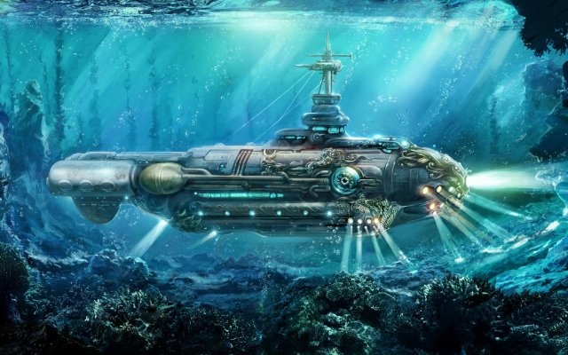{ loading=lazy }

Un sous-marin du roman de Jules Verne. Il pouvait explorer les profondeurs marines.

- Type: Object
- Subjects: Literature, Science
- Country: France
- Topics: [Jules Verne](../topics/index.md#jules_verne)
- Image credit: CC0
- Quests: [Jules Verne et les transports (fr_03)](../quests/quest/fr_03.md)

---

### Tour Eiffel {#eiffel_tower}
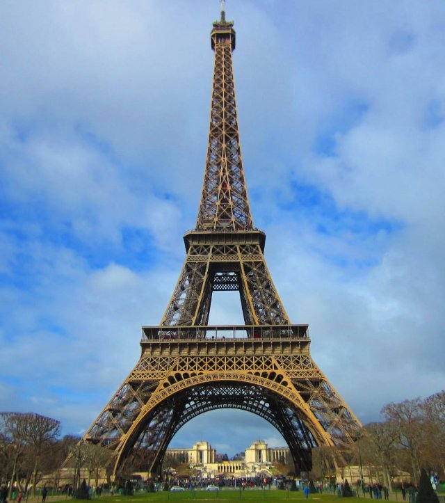{ loading=lazy }

Une haute tour, symbole de Paris. Construite en fer, elle mesure 300 mètres de haut. De là-haut, on peut admirer toute la ville.

- Type: Place
- Subjects: Geography, History, Culture
- Year: 1889
- Country: France
- Topics: [Eiffel Tower](../topics/index.md#eiffel-tower)
- Image credit: CC0
- Quests: [Paris ! (fr_01)](../quests/quest/fr_01.md)

---

### Ut {#note_do}
{ loading=lazy }

Une note de musique.

- Type: Concept
- Subjects: Music, Education
- Country: France
- Topics: [Musical Notes](../topics/index.md#musical_notes)
- Image credit: CC_BY_SA | BrownHairedGirl | [source](https://commons.wikimedia.org/wiki/File:Dominican_Republic_Ireland_Locator.png)

---

### Val de Loire {#loire_valley}
{ loading=lazy }

Une région française célèbre avec de nombreux châteaux.

- Type: Place
- Subjects: Geography, History, Culture
- Country: France
- Image credit: CC_BY_SA | Suavemarimagno | [source](https://commons.wikimedia.org/wiki/File:Val-de-loire-montsoreau-lever-de-soleil.jpg)

---

### Victoire ailée de Samothrace {#winged_victory_of_samothrace}
{ loading=lazy }

Une célèbre sculpture antique d'une déesse avec des ailes.

- Type: Object
- Subjects: Art, History
- Country: France
- Image credit: CC_BY_SA | Rijin | [source](https://commons.wikimedia.org/wiki/File:Winged_Victory_of_Samothrace_(1).jpg)
- Quests: [Paris ! (fr_01)](../quests/quest/fr_01.md)

---

### Vingt Mille Lieues sous les mers {#book_20000_leagues_under_the_sea}
{ loading=lazy }

Un livre de Jules Verne relatant des aventures sous-marines à bord du sous-marin Nautilus. Vous y rencontrerez des créatures marines géantes !

- Type: Object
- Subjects: Literature
- Year: 1871
- Country: France
- Topics: [Jules Verne](../topics/index.md#jules_verne)
- Image credit: CC0
- Quests: [Jules Verne et les transports (fr_03)](../quests/quest/fr_03.md)

---

### Voiture de course {#race_car}
{ loading=lazy }

Une voiture très rapide utilisée sur les pistes de course.

- Type: Object
- Subjects: Sport, Technology
- Country: France
- Image credit: CC_BY_SA | user:AngMoKio | [source](https://commons.wikimedia.org/wiki/File:Porsche_race_car_Verschuur_amk.jpg)

---

### Vélo {#bicycle}
{ loading=lazy }

Un véhicule à deux roues sur lequel on pédale.

- Type: Object
- Subjects: Transportation, Health, Recreation
- Country: France
- Image credit: CC_BY_SA | Basile Morin | [source](https://commons.wikimedia.org/wiki/File:Parked_bicycle_with_graffitied_building_facade_and_doors_in_Amsterdam.jpg)

---

### Xylophone {#xylophone}
{ loading=lazy }

Un instrument avec des barres sur lesquelles on frappe pour prendre des notes.

- Type: Object
- Subjects: Music, Education
- Country: France
- Image credit: CC_BY | Mayor McGinn | [source](https://commons.wikimedia.org/wiki/File:Mayor_westlake_play_03_(8532405090).jpg)

---

### École maternelle {#education_ecole_maternelle_fr}
{ loading=lazy }

École pour les petits de 3 à 5 ans. On apprend en jouant et en explorant.

- Type: Concept
- Subjects: Education, Culture
- Year: 1975
- Country: France
- Topics: [French School](../topics/index.md#frenchschool)
- Image credit: CC0 | Polymagou, CC BY-SA 4.0 <https://creativecommons.org/licenses/by-sa/4.0>, via Wikimedia Commons | [source](https://commons.wikimedia.org/wiki/File:%C3%89cole_maternelle_Paul-Langevin,_Les_Clayes-sous-Bois,_Yvelines_9-3.jpg)
- Quests: [Le système scolaire (fr_02)](../quests/quest/fr_02.md)

---

### École primaire en France {#education_ecole_primaire_fr}
{ loading=lazy }

École pour les enfants de 6 à 10 ans. Vous apprenez à lire, à écrire et à compter.

- Type: Concept
- Subjects: Education, Culture
- Year: 1975
- Country: France
- Topics: [French School](../topics/index.md#frenchschool)
- Image credit: Licensed
- Quests: [Le système scolaire (fr_02)](../quests/quest/fr_02.md)

---

### Écriture cursive {#concept_cursive_writing}
{ loading=lazy }

Une façon particulière d'écrire où toutes les lettres d'un mot sont reliées entre elles. En France, les enfants apprennent cette écriture à l'école.

- Rationale: Cursive writing is an important part of French education and cultural identity
- Type: Concept
- Subjects: Education, Culture, Art
- Year: 1800
- Country: France
- Topics: [French School](../topics/index.md#frenchschool)
- Image credit: CC0 | [source](https://commons.wikimedia.org/wiki/File:BlackBoard_(Blender_classroom_demo).png)
- Quests: [Le système scolaire (fr_02)](../quests/quest/fr_02.md)

---

### Église {#church}
{ loading=lazy }

Un bâtiment spécial où les gens se réunissent pour prier et chanter.

- Type: Place
- Subjects: Culture, Civics, Education
- Country: France
- Image credit: CC_BY_SA | King of Hearts | [source](https://commons.wikimedia.org/wiki/File:Stanford_Memorial_Church_May_2011_HDR_1.jpg)
- Quests: [Paris ! (fr_01)](../quests/quest/fr_01.md)

---

### Épée {#sword}
{ loading=lazy }

Une longue lame utilisée par les chevaliers.

- Type: Object
- Subjects: History, Culture
- Country: France
- Image credit: CC_BY_SA | Rama | [source](https://commons.wikimedia.org/wiki/File:Sword-AO_21069-P5280877-gradient.jpg)

## Poland

### Ambre {#amber}
{ loading=lazy }

Résine d'arbre fossile brillante appelée « Baltic Gold ».

- Type: Object
- Subjects: History, Culture, Science
- Country: Poland
- Topics: [Neptune's fountain](../topics/index.md#neptune_fountain)
- Image credit: CC_BY_SA | Diego Delso | [source](https://commons.wikimedia.org/wiki/File:Fuerte_Amber,_Amber,_India,_2009-12-04,_DD_0019.jpg)
- Quests: [Le collier d'ambre de Gdańsk (pl_05)](../quests/quest/pl_05.md)

---

### Ancien hôtel de ville (Wroclaw) {#wroclaw_old_town_hall}
{ loading=lazy }

Un magnifique édifice gothique sur la place principale. Il possède une horloge célèbre.

- Type: Place
- Subjects: Geography, Environment
- Country: Poland
- Image credit: CC0 | [source](https://upload.wikimedia.org/wikipedia/commons/7/70/Wroclaw-Rathaus.jpg)
- Quests: [Le grand sauvetage des nains de Wrocław (pl_02)](../quests/quest/pl_02.md)

---

### Astronomie {#astronomy}
{ loading=lazy }

La science qui étudie le Soleil, la Lune, les étoiles et les planètes.

- Type: Concept
- Subjects: Science, Space
- Country: Poland
- Topics: [Solar System](../topics/index.md#solar_system)
- Image credit: CC_BY | ESO/Yuri Beletsky (ybialets at eso.org) | [source](https://commons.wikimedia.org/wiki/File:Laser_Towards_Milky_Ways_Centre.jpg)
- Quests: [Copernic et le système solaire (pl_07)](../quests/quest/pl_07.md)

---

### Barge {#barge}
{ loading=lazy }

Un bateau long et plat qui transporte des marchandises sur les rivières.

- Type: Object
- Subjects: Transportation, Geography
- Country: Poland
- Image credit: CC_BY_SA | Dietmar Rabich
- Quests: [Fleuve Oder (pl_03)](../quests/quest/pl_03.md)

---

### Bateau {#boat}
{ loading=lazy }

Un véhicule qui se déplace sur l'eau.

- Type: Object
- Subjects: Transportation
- Country: Poland
- Image credit: CC_BY_SA | Norbert Nagel | [source](https://commons.wikimedia.org/wiki/File:Rowing_boat_on_a_house_roof_-_Fira_-_Santorini_-_Greece_-_02.jpg)
- Quests: [Fleuve Oder (pl_03)](../quests/quest/pl_03.md)

---

### Bateau {#ship}
{ loading=lazy }

Un grand bateau qui transporte des personnes ou des marchandises.

- Type: Object
- Subjects: Transportation
- Country: Poland
- Topics: [Fisherman](../topics/index.md#fisherman)
- Image credit: CC_BY | Christian Ferrer | [source](https://commons.wikimedia.org/wiki/File:Rhapsody_(ship,_1996),_Sète_cf01.jpg)
- Quests: [Le collier d'ambre de Gdańsk (pl_05)](../quests/quest/pl_05.md)

---

### Bébé éléphant {#animal_elephant_baby}
{ loading=lazy }

Petit et joueur, il agite sa petite trompe. Il adore rester près de sa mère.

- Type: None
- Country: Poland
- Image credit: CC0

---

### Carte de l'Oder {#odra_river_map}
{ loading=lazy }

Une carte simple qui montre la rivière Odra en Pologne et la façon dont elle coule vers la mer Baltique

- Type: None
- Subjects: Geography
- Country: Poland
- Image credit: CC0
- Quests: [Fleuve Oder (pl_03)](../quests/quest/pl_03.md)

---

### Carte de Wroklaw {#wroklaw_map}
{ loading=lazy }

Une carte simple de Wrocław montrant la rivière Odra avec ses îles et ses nombreux ponts

- Type: None
- Subjects: Geography
- Country: Poland
- Image credit: CC0
- Quests: [Le grand sauvetage des nains de Wrocław (pl_02)](../quests/quest/pl_02.md), [Fleuve Oder (pl_03)](../quests/quest/pl_03.md)

---

### Chambre d'ambre {#amber_room}
{ loading=lazy }

Une célèbre pièce en ambre avec une histoire mystérieuse.

- Type: Concept
- Subjects: History, Culture
- Country: Poland
- Topics: [Neptune's fountain](../topics/index.md#neptune_fountain)
- Image credit: CC0 | Branson DeCou | [source](https://commons.wikimedia.org/wiki/File:Catherine_Palace_interior_-_Amber_Room_(1).jpg)
- Quests: [Le collier d'ambre de Gdańsk (pl_05)](../quests/quest/pl_05.md)

---

### Collier {#necklace}
{ loading=lazy }

Un collier de perles ou de coquillages que vous portez autour du cou.

- Type: Object
- Subjects: Art, Culture
- Country: Poland
- Topics: [Neptune's fountain](../topics/index.md#neptune_fountain)
- Image credit: CC_BY_SA | W.carter | [source](https://commons.wikimedia.org/wiki/File:Necklace_made_of_rough_diamonds.jpg)
- Quests: [Le collier d'ambre de Gdańsk (pl_05)](../quests/quest/pl_05.md)

---

### Coquillage {#seashell}
{ loading=lazy }

Une coquille dure provenant d'un animal marin ; idéale pour l'artisanat.

- Type: Object
- Subjects: Animal, Environment, Art
- Country: Poland
- Topics: [Neptune's fountain](../topics/index.md#neptune_fountain)
- Image credit: CC0 | George Chernilevsky | [source](https://commons.wikimedia.org/wiki/File:Flexopecten_ponticus_2008_G1.jpg)
- Quests: [Le collier d'ambre de Gdańsk (pl_05)](../quests/quest/pl_05.md)

---

### Coupeur {#cutter}
{ loading=lazy }

Un petit bateau de pêche utilisé en mer.

- Type: Object
- Subjects: Transportation, Technology
- Country: Poland
- Image credit: CC_BY_SA | Gordon Leggett | [source](https://commons.wikimedia.org/wiki/File:2009-12-06_USCGC_Key_Biscayne_WPB1339.jpg)
- Quests: [Le collier d'ambre de Gdańsk (pl_05)](../quests/quest/pl_05.md)

---

### Côte de la mer Baltique {#baltic_sea_coast}
{ loading=lazy }

La côte sablonneuse le long de la mer Baltique.

- Type: Place
- Subjects: Geography, Environment
- Country: Poland
- Topics: [gdansk](../topics/index.md#gdansk)
- Image credit: CC_BY_SA | Radomianin | [source](https://commons.wikimedia.org/wiki/File:Baltic_Sea_view_from_Schmiedeberg_hill_in_Rerik,_2025-06-23.jpg)
- Quests: [Le collier d'ambre de Gdańsk (pl_05)](../quests/quest/pl_05.md)

---

### Directeur du zoo {#zoo_director}
{ loading=lazy }

La personne qui dirige le zoo et aide les visiteurs.

- Type: Person
- Subjects: Community, Education
- Country: Poland
- Topics: [wroclaw zoo](../topics/index.md#wroclaw_zoo)
- Image credit: CC0 | USFWS Pacific | [source](https://commons.wikimedia.org/wiki/File:USFWS_director_visits_Oregon_Zoo_(51946414879).jpg)
- Quests: [Le zoo (pl_04)](../quests/quest/pl_04.md)

---

### Drapeau de la Pologne {#flag_poland}
{ loading=lazy }

Le drapeau polonais est orné de bandes horizontales blanches et rouges. La Pologne est célèbre pour ses scientifiques comme Copernic et ses délicieux pierogi !

- Rationale: The Polish flag is essential for Polish language learning and cultural identity
- Type: Concept
- Subjects: Geography, Culture
- Year: 1919
- Country: Poland
- Topics: [Poland country](../topics/index.md#poland-country)
- Image credit: CC0
- Quests: [Les voisins de la Pologne (pl_00)](../quests/quest/pl_00.md)

---

### Drapeau de Wrocław {#wroclaw_flag}
{ loading=lazy }

Le drapeau de la ville qu'il faut retrouver et restituer.

- Type: Object
- Subjects: Culture, Community, History
- Country: Poland
- Image credit: CC0 | [source](https://commons.wikimedia.org/wiki/File:POL_Wroc%C5%82aw_flag.svg)
- Quests: [Le zoo (pl_04)](../quests/quest/pl_04.md)

---

### Enclos pour animaux {#animal_enclosure}
{ loading=lazy }

Un espace sûr conçu pour que les animaux puissent vivre au zoo.

- Type: Place
- Subjects: Animal, Safety
- Country: Poland
- Topics: [wroclaw zoo](../topics/index.md#wroclaw_zoo)
- Image credit: CC0 | Pearson Scott Foresman | [source](https://commons.wikimedia.org/wiki/File:Corral_(PSF).png)
- Quests: [Le zoo (pl_04)](../quests/quest/pl_04.md)

---

### Expert nain {#dwarf_expert}
{ loading=lazy }

Un guide sympathique qui connaît tout sur les nains.

- Type: Person
- Subjects: Education, Culture
- Country: Poland
- Topics: [Wroclaw Dwarves](../topics/index.md#wroclaw_dwarves)
- Image credit: CC_BY | Tomasz Gąsior | [source](https://commons.wikimedia.org/wiki/File:Kaczmaruś_dwarf_02.jpg)
- Quests: [Le grand sauvetage des nains de Wrocław (pl_02)](../quests/quest/pl_02.md)

---

### Filet de pêche {#fishing_net}
{ loading=lazy }

Un filet utilisé pour attraper du poisson.

- Type: Object
- Subjects: Technology, Community
- Country: Poland
- Topics: [Fisherman](../topics/index.md#fisherman)
- Image credit: CC0 | Jebulon | [source](https://commons.wikimedia.org/wiki/File:Fishing_net_Karystos_Euboea_Greece.jpg)
- Quests: [Le collier d'ambre de Gdańsk (pl_05)](../quests/quest/pl_05.md)

---

### Flots {#waves}
{ loading=lazy }

Eau en mouvement sur la mer.

- Type: Concept
- Subjects: Environment, Science
- Country: Poland
- Topics: [Fisherman](../topics/index.md#fisherman)
- Image credit: CC_BY_SA | Roger McLassus | [source](https://commons.wikimedia.org/wiki/File:2006-01-14_Surface_waves.jpg)
- Quests: [Le collier d'ambre de Gdańsk (pl_05)](../quests/quest/pl_05.md)

---

### Fontaine multimédia de Wrocław {#wroclaw_multimedia_fountain}
{ loading=lazy }

De l'eau qui danse avec de la musique et des lumières colorées.

- Type: Place
- Subjects: Culture, Technology, Recreation
- Country: Poland
- Image credit: CC_BY_SA | Piotr Walczak & Konradr | [source](https://commons.wikimedia.org/wiki/File:Wrocławska_fontanna_Piotr_Walczak2.jpg)
- Quests: [Le grand sauvetage des nains de Wrocław (pl_02)](../quests/quest/pl_02.md)

---

### Frédéric Chopin {#fryderyk_chopin}
{ loading=lazy }

Célèbre compositeur polonais pour le piano, il a composé une musique magnifique qui évoque la danse ou les histoires. Sa musique rend les gens heureux ou tristes.

- Rationale: Chopin introduces kids to classical music and shows how music can express emotions
- Type: Person
- Subjects: Music, History, Culture
- Year: 1810
- Country: Poland
- Topics: [Warsaw](../topics/index.md#warsaw)
- Image credit: CC0
- Quests: [Découvrir Varsovie (pl_01)](../quests/quest/pl_01.md)

---

### Gardien de zoo {#zoo_keeper}
{ loading=lazy }

Une personne qui s'occupe des animaux au zoo.

- Type: Person
- Subjects: Community, Animal, Education
- Country: Poland
- Topics: [wroclaw zoo](../topics/index.md#wroclaw_zoo)
- Image credit: CC_BY_SA | 좀비 브렌다 | [source](https://commons.wikimedia.org/wiki/File:Hadada_Ibis_perched_on_Dallas_Zoo_keeper.jpg)
- Quests: [Le zoo (pl_04)](../quests/quest/pl_04.md)

---

### Gdańsk {#gdansk}
{ loading=lazy }

Une ville portuaire en Pologne sur la mer Baltique.

- Type: Place
- Subjects: Geography, History, Culture
- Country: Poland
- Topics: [gdansk](../topics/index.md#gdansk), [Neptune's fountain](../topics/index.md#neptune_fountain)
- Image credit: CC_BY_SA | Diego Delso | [source](https://commons.wikimedia.org/wiki/File:Calle_Dlugie_Pobrzeze,_Gdansk,_Polonia,_2013-05-20,_DD_05.jpg)
- Quests: [Le collier d'ambre de Gdańsk (pl_05)](../quests/quest/pl_05.md)

---

### Grue Żuraw {#zuraw_crane}
{ loading=lazy }

Une ancienne grue portuaire et une porte de ville sur la rivière.

- Type: Place
- Subjects: History, Technology, Geography
- Country: Poland
- Image credit: CC_BY_SA | Jacek Halicki | [source](https://commons.wikimedia.org/wiki/File:2024_Żuraw_wieżowy,_ul._Letnia_w_Kłodzku_(2).jpg)
- Quests: [Le collier d'ambre de Gdańsk (pl_05)](../quests/quest/pl_05.md)

---

### Guerres et Sawa {#wars_and_sawa}
{ loading=lazy }

Deux personnages légendaires ont donné son nom à Varsovie. Wars était un guerrier courageux et Sawa était une belle sirène vivant dans la Vistule.

- Type: Concept
- Subjects: Community, Culture
- Year: 1300
- Country: Poland
- Topics: [Warsaw](../topics/index.md#warsaw)
- Image credit: CC0 | [source](https://en.m.wikipedia.org/wiki/File:Rzeźba_Warsa_i_Sawy_01.jpg)
- Quests: [Découvrir Varsovie (pl_01)](../quests/quest/pl_01.md)

---

### Hôtel de ville de Torun {#torun_town_hall}
{ loading=lazy }

Un grand bâtiment gothique à Toruń à côté de la place du marché.

- Type: Place
- Subjects: History, Geography, Culture
- Country: Poland
- Image credit: CC_BY_SA | Krzysztof Golik | [source](https://commons.wikimedia.org/wiki/File:Old_town_hall_in_Torun_(6).jpg)
- Quests: [Pain d'épices et marché alimentaire (pl_06)](../quests/quest/pl_06.md)

---

### Hôtel de ville principal {#main_town_hall}
{ loading=lazy }

Un grand hôtel de ville avec une tour et un musée.

- Type: Place
- Subjects: History, Culture
- Country: Poland
- Image credit: CC_BY_SA | Diego Delso | [source](https://commons.wikimedia.org/wiki/File:Ayuntamiento_Principal,_Gdansk,_Polonia,_2013-05-20,_DD_01.jpg)
- Quests: [Le collier d'ambre de Gdańsk (pl_05)](../quests/quest/pl_05.md)

---

### Jeune éléphant {#animal_elephant_young}
{ loading=lazy }

Curieux et apprenant, il suit les adultes. Il s'entraîne à utiliser sa trompe tous les jours !

- Type: None
- Country: Poland
- Image credit: CC0

---

### Joint {#seal}
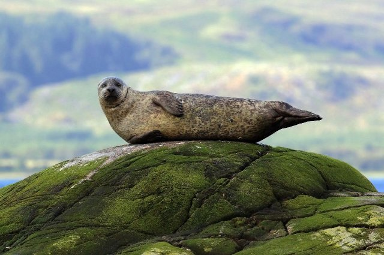{ loading=lazy }

Un animal marin sauvage qui se repose sur les plages.

- Type: Object
- Subjects: Animal, Environment, Safety
- Country: Poland
- Image credit: CC_BY_SA | Charles J. Sharp | [source](https://commons.wikimedia.org/wiki/File:Common_seal_(Phoca_vitulina)_2.jpg)
- Quests: [Le collier d'ambre de Gdańsk (pl_05)](../quests/quest/pl_05.md)

---

### Jupiter {#jupiter}
{ loading=lazy }

La plus grande planète, célèbre pour la Grande Tache Rouge.

- Type: Object
- Subjects: Space, Science
- Country: Poland
- Topics: [Solar System](../topics/index.md#solar_system)
- Image credit: CC0 | NASA/JPL/Space Science Institute | [source](https://commons.wikimedia.org/wiki/File:Portrait_of_Jupiter_from_Cassini.jpg)
- Quests: [Copernic et le système solaire (pl_07)](../quests/quest/pl_07.md)

---

### Kayak {#kayak}
{ loading=lazy }

Un petit bateau sur lequel on pagaie.

- Type: Object
- Subjects: Recreation, Sport
- Country: Poland
- Image credit: CC_BY_SA | 0x010C
- Quests: [Fleuve Oder (pl_03)](../quests/quest/pl_03.md)

---

### La fontaine de Neptune {#neptune_s_fountain}
{ loading=lazy }

Une célèbre fontaine de Gdańsk avec la statue du dieu de la mer.

- Type: Place
- Subjects: History, Culture, Community
- Country: Poland
- Topics: [Neptune's fountain](../topics/index.md#neptune_fountain)
- Image credit: CC_BY_SA | Diego Delso | [source](https://commons.wikimedia.org/wiki/File:Monumento_Neptuno,_Gdansk,_Polonia,_2013-05-20,_DD_03.jpg)
- Quests: [Le collier d'ambre de Gdańsk (pl_05)](../quests/quest/pl_05.md)

---

### la Vistule {#vistula_river}
{ loading=lazy }

Le plus long fleuve de Pologne ; il coule vers la mer Baltique.

- Type: Place
- Subjects: Geography, Environment
- Country: Poland
- Image credit: CC_BY_SA | Jakub Hałun | [source](https://commons.wikimedia.org/wiki/File:20200529_Widok_ze_Skały_Okrążek_na_Opactwo_w_Tyńcu_1735_2128.jpg)
- Quests: [Le grand sauvetage des nains de Wrocław (pl_02)](../quests/quest/pl_02.md)

---

### La Vistule (Wisła) {#place_vistula_river}
{ loading=lazy }

Le plus long fleuve de Pologne s'appelle Wisła ou Vistule. Il traverse Cracovie et Varsovie.

- Type: Place
- Subjects: Geography, Environment
- Country: Poland
- Topics: [Odra river](../topics/index.md#odra_river), [Wroclaw](../topics/index.md#wroclaw)
- Image credit: CC0
- Quests: [Fleuve Oder (pl_03)](../quests/quest/pl_03.md)

---

### Le roi Sigismond III {#person_king_sigismund}
{ loading=lazy }

Roi de Pologne, il fit construire de nombreux et magnifiques édifices à Varsovie. Sa statue se dresse sur une haute colonne au centre-ville.

- Rationale: Historical kings help kids understand how cities were built and developed over time
- Type: Person
- Subjects: History, Culture
- Year: 1566
- Country: Poland
- Image credit: CC0 | Pieter Soutman, Public domain, via Wikimedia Commons | [source](https://commons.wikimedia.org/wiki/File:Soutman_Sigismund_III_Vasa_in_coronation_robes.jpg)
- Quests: [Découvrir Varsovie (pl_01)](../quests/quest/pl_01.md)

---

### Lentille {#lens}
{ loading=lazy }

Un morceau de verre ou de plastique transparent qui courbe la lumière.

- Type: Object
- Subjects: Science, Technology
- Country: Poland
- Topics: [Telescope](../topics/index.md#telescope)
- Image credit: CC_BY_SA | Christian David | [source](https://commons.wikimedia.org/wiki/File:Village_de_Lens.jpg)
- Quests: [Copernic et le système solaire (pl_07)](../quests/quest/pl_07.md)

---

### Louveteau {#cub}
{ loading=lazy }

Un bébé lion.

- Type: Concept
- Subjects: Animal, Science
- Country: Poland
- Image credit: CC_BY_SA | Charles J. Sharp | [source](https://commons.wikimedia.org/wiki/File:Eurasian_brown_bear_(Ursus_arctos_arctos)_cub_14_months.jpg)
- Quests: [Le zoo (pl_04)](../quests/quest/pl_04.md)

---

### Mairie {#town_hall}
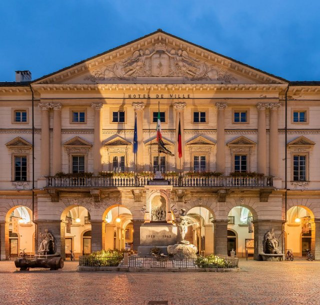{ loading=lazy }

Le lieu où les dirigeants de la ville travaillent et se rencontrent.

- Type: Concept
- Subjects: Civics, Community, History
- Country: Poland
- Image credit: CC_BY_SA | Krzysztof Golik | [source](https://commons.wikimedia.org/wiki/File:Town_hall_of_Aosta_(3).jpg)
- Quests: [Le grand sauvetage des nains de Wrocław (pl_02)](../quests/quest/pl_02.md)

---

### Maison de Nicolas Copernic {#nicolaus_copernicus_house}
{ loading=lazy }

C'est aujourd'hui un musée où vous pourrez en apprendre davantage sur sa vie et ses réalisations scientifiques.

- Type: Place
- Subjects: Culture, Science
- Country: Poland
- Image credit: CC0 | Pko, CC BY-SA 4.0 <https://creativecommons.org/licenses/by-sa/4.0>, via Wikimedia Commons | [source](https://commons.wikimedia.org/w/index.php?curid=76433849)
- Quests: [Copernic et le système solaire (pl_07)](../quests/quest/pl_07.md)

---

### Maria Curie {#maria_curie}
{ loading=lazy }

Une brillante scientifique polonaise qui a découvert la radioactivité. Elle a été la première femme à recevoir un prix Nobel, et ce, à deux reprises !

- Rationale: Maria Curie inspires kids (especially girls) to pursue science and shows Polish contributions to science
- Type: Person
- Subjects: Science, History
- Year: 1867
- Country: Poland
- Image credit: CC0
- Quests: [Découvrir Varsovie (pl_01)](../quests/quest/pl_01.md)

---

### Mars {#mars}
{ loading=lazy }

La planète rouge avec de la poussière et de grands volcans.

- Type: Object
- Subjects: Space, Science
- Country: Poland
- Topics: [Solar System](../topics/index.md#solar_system)
- Image credit: CC_BY_SA | ESA & MPS for OSIRIS Team MPS/UPD/LAM/IAA/RSSD/INTA/UPM/DASP/IDA, CC BY-SA 3.0 IGO | [source](https://commons.wikimedia.org/wiki/File:OSIRIS_Mars_true_color.jpg)
- Quests: [Copernic et le système solaire (pl_07)](../quests/quest/pl_07.md)

---

### Maître des clés nain {#keymaster_dwarf}
{ loading=lazy }

Une statue de nain gardant l'ascenseur avec une grosse clé.

- Type: Object
- Subjects: Culture
- Country: Poland
- Topics: [Wroclaw Dwarves](../topics/index.md#wroclaw_dwarves)
- Image credit: CC_BY_SA | Pnapora | [source](https://commons.wikimedia.org/wiki/File:100matolog_(Tooth-dwarf)_Wroclaw_dwarf_02.JPG)
- Quests: [Le grand sauvetage des nains de Wrocław (pl_02)](../quests/quest/pl_02.md)

---

### Mercure {#mercury}
{ loading=lazy }

La planète la plus proche du Soleil ; petite et très rapide.

- Type: Object
- Subjects: Space, Science
- Country: Poland
- Topics: [Solar System](../topics/index.md#solar_system)
- Image credit: CC0 | NASA/Johns Hopkins University Applied Physics Laboratory/Carnegie Institution of Washington. Edited version of Image:Mercury in color - Prockter07.jpg by Papa Lima Whiskey. | [source](https://commons.wikimedia.org/wiki/File:Mercury_in_color_-_Prockter07_centered.jpg)
- Quests: [Copernic et le système solaire (pl_07)](../quests/quest/pl_07.md)

---

### Modèle héliocentrique {#heliocentric_model}
{ loading=lazy }

L'idée que le Soleil est au centre et que les planètes tournent autour de lui.

- Type: Concept
- Subjects: Science, Space, History
- Country: Poland
- Topics: [Solar System](../topics/index.md#solar_system)
- Image credit: CC0 | Andreas Cellarius | [source](https://commons.wikimedia.org/wiki/File:1661_Cellarius's_chart_illustrating_Copernicus'_heliocentric_model_of_the_universe.jpg)
- Quests: [Copernic et le système solaire (pl_07)](../quests/quest/pl_07.md)

---

### Monnaie du zloty {#currency_zloty}
{ loading=lazy }

La monnaie polonaise s'appelle le złoty. Les pièces et les billets arborent des symboles polonais.

- Type: Concept
- Subjects: Money, Geography
- Country: Poland
- Topics: [Pierogi Recipe](../topics/index.md#pierogi)
- Image credit: CC0 | [source](https://commons.wikimedia.org/wiki/File:Bitllets_de_banc_polonesos_2024.jpg)
- Quests: [Pain d'épices et marché alimentaire (pl_06)](../quests/quest/pl_06.md)

---

### Monument à Chopin {#chopin_monument}
{ loading=lazy }

Une grande statue du parc Łazienki de Varsovie est dédiée à Frédéric Chopin. C'est également le lieu de concerts de piano en plein air très populaires en été. (L'arbre sous lequel il est assis est un saule polonais typique.)

- Type: Object
- Subjects: Music, Culture
- Country: Poland
- Topics: [Warsaw](../topics/index.md#warsaw)
- Image credit: CC0 | Ethan Doyle White, CC BY-SA 4.0 <https://creativecommons.org/licenses/by-sa/4.0>, via Wikimedia Commons | [source](https://commons.wikimedia.org/wiki/File:The_Chopin_Monument_in_Warsaw.jpg)
- Quests: [Découvrir Varsovie (pl_01)](../quests/quest/pl_01.md)

---

### Mouette {#seagull}
{ loading=lazy }

Un oiseau marin qui vit près de la côte.

- Type: Object
- Subjects: Animal, Environment
- Country: Poland
- Image credit: CC_BY_SA | Diliff | [source](https://commons.wikimedia.org/wiki/File:Black-headed_Gull_-_St_James's_Park,_London_-_Nov_2006.jpg)
- Quests: [Le collier d'ambre de Gdańsk (pl_05)](../quests/quest/pl_05.md)

---

### Nain amoureux des animaux {#animal_lover_dwarf}
{ loading=lazy }

Une statue naine qui aime le zoo et les animaux.

- Type: Object
- Subjects: Culture, Animal, Education
- Country: Poland
- Topics: [Wroclaw Dwarves](../topics/index.md#wroclaw_dwarves)
- Image credit: CC_BY | Klearchos Kapoutsis from Santorini, Greece | [source](https://commons.wikimedia.org/wiki/File:Gołębnik,_the_Flying_Dwarf..._(5629227878).jpg)
- Quests: [Le grand sauvetage des nains de Wrocław (pl_02)](../quests/quest/pl_02.md)

---

### Nain polonais (gnomes de Wrocław) {#polish_dwarf}
{ loading=lazy }

De petites statues de nains se cachent un peu partout à Wrocław. Les trouver est un jeu de ville amusant.

- Type: Concept
- Subjects: Community, Culture
- Year: 1700
- Country: Poland
- Topics: [Wroclaw Dwarves](../topics/index.md#wroclaw_dwarves)
- Image credit: CC0
- Quests: [Découvrir Varsovie (pl_01)](../quests/quest/pl_01.md), [Le grand sauvetage des nains de Wrocław (pl_02)](../quests/quest/pl_02.md)

---

### Nains de Wrocław {#wroclaw_dwarfs}
{ loading=lazy }

De petites statues à travers la ville qui aiment jouer des tours.

- Type: Concept
- Subjects: Culture, Community, History
- Country: Poland
- Topics: [Wroclaw Dwarves](../topics/index.md#wroclaw_dwarves)
- Image credit: CC_BY_SA | Matti Blume | [source](https://commons.wikimedia.org/wiki/File:Dwarf,_Wroclaw_(P1180336).jpg)
- Quests: [Le grand sauvetage des nains de Wrocław (pl_02)](../quests/quest/pl_02.md)

---

### Navigation {#navigation}
{ loading=lazy }

Trouver son chemin en mer à l'aide de lumières, de cartes et d'outils.

- Type: Concept
- Subjects: Technology, Geography
- Country: Poland
- Topics: [Fisherman](../topics/index.md#fisherman)
- Image credit: CC0 | [source](https://commons.wikimedia.org/wiki/File:Table_of_Geography_and_Hydrography,_Cyclopaedia,_Volume_1.jpg)
- Quests: [Le collier d'ambre de Gdańsk (pl_05)](../quests/quest/pl_05.md)

---

### Neptune {#neptune}
{ loading=lazy }

Le dieu de la mer des vieilles histoires.

- Type: Concept
- Subjects: Culture, History
- Country: Poland
- Topics: [Solar System](../topics/index.md#solar_system)
- Image credit: CC0 | NASA | [source](https://commons.wikimedia.org/wiki/File:Neptune_Full.jpg)
- Quests: [Copernic et le système solaire (pl_07)](../quests/quest/pl_07.md)

---

### Nicolas Copernic {#nicolaus_copernicus}
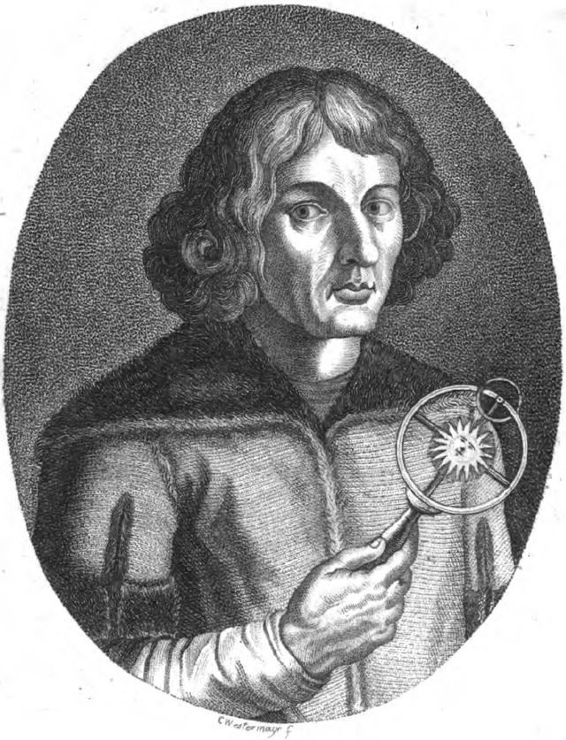{ loading=lazy }

Un brillant scientifique polonais a découvert que la Terre tourne autour du Soleil, et non l'inverse ! Cela a révolutionné notre compréhension de l'espace.

- Rationale: Copernicus teaches kids about scientific discovery and Polish contributions to astronomy
- Type: Person
- Subjects: Science, History, Space
- Year: 1473
- Country: Poland
- Topics: [Telescope](../topics/index.md#telescope)
- Image credit: CC0
- Quests: [Copernic et le système solaire (pl_07)](../quests/quest/pl_07.md)

---

### Oculaire {#eyepiece}
{ loading=lazy }

La petite lentille à travers laquelle vous regardez sur un télescope.

- Type: Object
- Subjects: Science, Technology
- Country: Poland
- Topics: [Telescope](../topics/index.md#telescope)
- Image credit: CC_BY | SvonHalenbach | [source](https://commons.wikimedia.org/wiki/File:Newtonianscope-eyepiece-detail.JPG)
- Quests: [Copernic et le système solaire (pl_07)](../quests/quest/pl_07.md)

---

### Olga Tokarczuk {#olga_tokarczuk}
{ loading=lazy }

Un célèbre écrivain polonais qui vit à Wrocław.

- Type: Person
- Subjects: Literature, Culture
- Country: Poland
- Image credit: CC_BY_SA | Harald Krichel | [source](https://commons.wikimedia.org/wiki/File:Olga_Tokarczuk-9739.jpg)
- Quests: [Le grand sauvetage des nains de Wrocław (pl_02)](../quests/quest/pl_02.md)

---

### Pain d'épices torunois {#gingerbread}
{ loading=lazy }

une friandise traditionnelle polonaise à base d'épices et de miel, souvent façonnée dans de beaux motifs.

- Type: Object
- Subjects: Food
- Country: Poland
- Topics: [Gingerbread](../topics/index.md#gingerbread), [Pierogi Recipe](../topics/index.md#pierogi)
- Image credit: CC0 | Marcin Floryan, CC BY 2.5 <https://creativecommons.org/licenses/by/2.5>, via Wikimedia Commons | [source](https://commons.wikimedia.org/w/index.php?curid=1300867)
- Quests: [Pain d'épices et marché alimentaire (pl_06)](../quests/quest/pl_06.md)

---

### Panorama de Racławicka {#panorama_racawicka}
{ loading=lazy }

Un tableau géant tout autour de vous sur une bataille historique.

- Type: Place
- Subjects: History, Art, Culture
- Country: Poland
- Image credit: CC_BY_SA | Barbara Maliszewska
- Quests: [Le grand sauvetage des nains de Wrocław (pl_02)](../quests/quest/pl_02.md)

---

### Paon {#peacock}
{ loading=lazy }

Un oiseau coloré avec une grande queue de plumes.

- Type: Object
- Subjects: Animal, Science, Art
- Country: Poland
- Image credit: CC_BY_SA | Jebulon | [source](https://commons.wikimedia.org/wiki/File:Paonroue.JPG)
- Quests: [Le zoo (pl_04)](../quests/quest/pl_04.md)

---

### Passerelle {#footbridge}
{ loading=lazy }

Un pont piétonnier. Interdit aux voitures.

- Type: Object
- Subjects: Transportation, Community
- Country: Poland
- Topics: [Odra river](../topics/index.md#odra_river)
- Image credit: CC_BY_SA | Basile Morin | [source](https://commons.wikimedia.org/wiki/File:Front_view_of_a_wooden_footbridge_over_a_lagoon,_trees_and_mountains_in_Vang_Vieng,_Laos.jpg)
- Quests: [Fleuve Oder (pl_03)](../quests/quest/pl_03.md)

---

### Perroquet {#parrot}
{ loading=lazy }

Un oiseau brillant qui peut copier des sons.

- Type: Object
- Subjects: Animal, Science
- Country: Poland
- Image credit: CC_BY | Luc Viatour | [source](https://commons.wikimedia.org/wiki/File:Ara_ararauna_Luc_Viatour.jpg)
- Quests: [Le zoo (pl_04)](../quests/quest/pl_04.md)

---

### Phare de Gdańsk {#gdansk_lighthouse}
{ loading=lazy }

Un phare historique qui aide les navires à trouver le port.

- Type: Place
- Subjects: History, Geography, Transportation
- Country: Poland
- Topics: [gdansk](../topics/index.md#gdansk)
- Image credit: CC_BY_SA | Yanek | [source](https://commons.wikimedia.org/wiki/File:Gdańsk,_Kapitanat_Portu_-_Port_Północny_-_fotopolska.eu_(304857).jpg)
- Quests: [Le collier d'ambre de Gdańsk (pl_05)](../quests/quest/pl_05.md)

---

### Pierogi polonais {#pierogi}
{ loading=lazy }

Raviolis farcis de pommes de terre, de fromage ou de fruits. C'est un plat polonais célèbre.

- Type: Object
- Subjects: Food, Culture
- Year: 1600
- Country: Poland
- Topics: [Pierogi Recipe](../topics/index.md#pierogi)
- Image credit: CC0
- Quests: [Pain d'épices et marché alimentaire (pl_06)](../quests/quest/pl_06.md)

---

### Place de la Sky Tower {#sky_tower_plaza}
{ loading=lazy }

Une place moderne où les gens se rencontrent près de la tour.

- Type: Place
- Subjects: Geography, Community, Recreation
- Country: Poland
- Image credit: CC_BY_SA | JamesYoung8167 | [source](https://commons.wikimedia.org/wiki/File:Xiamen_Shimao_Straits_Tower_2016-02-09.jpg)
- Quests: [Le grand sauvetage des nains de Wrocław (pl_02)](../quests/quest/pl_02.md)

---

### Place du marché de Wrocław {#wroclaw_market_square}
{ loading=lazy }

La place principale de la vieille ville, pleine de vie.

- Type: Place
- Subjects: Geography, Culture, Community, History
- Country: Poland
- Image credit: CC_BY_SA | Jacek Halicki | [source](https://commons.wikimedia.org/wiki/File:2016_Wrocław,_Rynek_49.jpg)
- Quests: [Le grand sauvetage des nains de Wrocław (pl_02)](../quests/quest/pl_02.md)

---

### Planétarium {#planetarium}
{ loading=lazy }

Un endroit où vous pouvez voir le ciel et les étoiles à l'intérieur.

- Type: Place
- Subjects: Education, Science, Space
- Country: Poland
- Topics: [Solar System](../topics/index.md#solar_system), [Telescope](../topics/index.md#telescope)
- Image credit: CC0 | Atelier Hermann Walter

Bernhard Müller († 1930)
Karl Walter (* 7. Dezember 1874; † 11. October 1940) | [source](https://commons.wikimedia.org/wiki/File:Planetarium_Pfaffendorfer_Strasse_Leipzig_um_1927.jpg)
- Quests: [Copernic et le système solaire (pl_07)](../quests/quest/pl_07.md)

---

### Pont {#bridge}
{ loading=lazy }

Une structure qui permet aux personnes ou aux véhicules de traverser l'eau.

- Type: Concept
- Subjects: Technology, Transportation
- Country: Poland
- Image credit: CC_BY_SA | W.carter | [source](https://commons.wikimedia.org/wiki/File:Bridge_and_deck_of_Gullbritt.jpg)
- Quests: [Fleuve Oder (pl_03)](../quests/quest/pl_03.md)

---

### Pont de Tumski {#tumski_bridge}
{ loading=lazy }

Un pont célèbre avec des cadenas d'amour et des lanternes à gaz.

- Type: Place
- Subjects: Culture, Geography, Community
- Country: Poland
- Topics: [Odra river](../topics/index.md#odra_river)
- Image credit: CC_BY_SA | Aw58 | [source](https://commons.wikimedia.org/wiki/File:Wrocław,_most_Tumski_widziany_z_bulwaru_Piotra_Włostowica_(MW).jpg)
- Quests: [Fleuve Oder (pl_03)](../quests/quest/pl_03.md)

---

### Pont ferroviaire {#train_bridge}
{ loading=lazy }

Un pont avec des voies pour les trains.

- Type: Object
- Subjects: Transportation, Technology
- Country: Poland
- Topics: [Odra river](../topics/index.md#odra_river)
- Image credit: CC_BY_SA | Kabelleger / David Gubler | [source](https://commons.wikimedia.org/wiki/File:FCCA_GE_C30-7_Infiernillo_Viaduct.jpg)
- Quests: [Fleuve Oder (pl_03)](../quests/quest/pl_03.md)

---

### Pont routier {#road_bridge}
{ loading=lazy }

Un pont pour voitures et bus.

- Type: Object
- Subjects: Transportation
- Country: Poland
- Topics: [Odra river](../topics/index.md#odra_river)
- Image credit: CC_BY_SA | Photographer: Dey.sandip Additional Credit: User Atention for water spot removal. | [source](https://commons.wikimedia.org/wiki/File:Anjarle_Bridge_and_Cows-fix.jpg)
- Quests: [Fleuve Oder (pl_03)](../quests/quest/pl_03.md)

---

### Pont Rędziński {#redzinski_bridge}
{ loading=lazy }

Le plus long pont à haubans de Pologne.

- Type: Place
- Subjects: Geography, Transportation, Technology
- Country: Poland
- Topics: [Odra river](../topics/index.md#odra_river)
- Image credit: CC_BY_SA | Olgierd (Creative Commons licensed only) | [source](https://commons.wikimedia.org/wiki/File:Most_Rędziński_we_Wroclawiu.jpg)
- Quests: [Fleuve Oder (pl_03)](../quests/quest/pl_03.md)

---

### Ponts de Wrocław {#wroclaw_bridges}
{ loading=lazy }

De nombreux ponts traversent la rivière Odra à Wrocław.

- Type: Concept
- Subjects: Geography, Transportation, Community
- Country: Poland
- Topics: [Odra river](../topics/index.md#odra_river), [Wroclaw](../topics/index.md#wroclaw)
- Image credit: CC_BY_SA | Jar.ciurus | [source](https://commons.wikimedia.org/wiki/File:Wroclaw_Most_Mlynski_w_porannej_mgle_przed_switem.jpg)
- Quests: [Fleuve Oder (pl_03)](../quests/quest/pl_03.md)

---

### Port {#port}
{ loading=lazy }

Un endroit où les navires chargent et déchargent.

- Type: Place
- Subjects: Transportation, Community, Geography
- Country: Poland
- Topics: [Fisherman](../topics/index.md#fisherman)
- Image credit: CC_BY | Maxime Raynal from France | [source](https://commons.wikimedia.org/wiki/File:Port_and_lighthouse_overnight_storm_with_lightning_in_Port-la-Nouvelle.jpg)
- Quests: [Le collier d'ambre de Gdańsk (pl_05)](../quests/quest/pl_05.md)

---

### Péniche {#houseboat}
{ loading=lazy }

Un bateau fait pour vivre.

- Type: Object
- Subjects: Transportation, Community
- Country: Poland
- Topics: [Odra river](../topics/index.md#odra_river)
- Image credit: CC_BY_SA | Kritzolina | [source](https://commons.wikimedia.org/wiki/File:Houseboat_in_Copenhagen_Harbor_02.jpg)
- Quests: [Fleuve Oder (pl_03)](../quests/quest/pl_03.md)

---

### Pêcheur {#fisherman}
{ loading=lazy }

Une personne qui attrape du poisson en mer.

- Type: Person
- Subjects: Community, Geography
- Country: Poland
- Topics: [Fisherman](../topics/index.md#fisherman)
- Image credit: CC_BY_SA | Benh LIEU SONG (Flickr) | [source](https://commons.wikimedia.org/wiki/File:Leg_Rowing_Fisherman_Inle_Lake_Myanmar.jpg)
- Quests: [Le collier d'ambre de Gdańsk (pl_05)](../quests/quest/pl_05.md)

---

### Rivière Motława {#motawa_river}
{ loading=lazy }

La rivière qui traverse Gdańsk jusqu'à la mer.

- Type: Place
- Subjects: Geography
- Country: Poland
- Topics: [gdansk](../topics/index.md#gdansk)
- Image credit: CC_BY_SA | John Samuel | [source](https://commons.wikimedia.org/wiki/File:Boat_on_Motława_river_in_Gdańsk.jpg)
- Quests: [Le collier d'ambre de Gdańsk (pl_05)](../quests/quest/pl_05.md)

---

### Rivière Odra {#place_odra_river}
{ loading=lazy }

Un grand fleuve de l'ouest de la Pologne. Il facilite la navigation et le commerce.

- Type: Place
- Subjects: Geography, Environment
- Country: Poland
- Topics: [Odra river](../topics/index.md#odra_river), [Wroclaw](../topics/index.md#wroclaw)
- Image credit: CC0
- Quests: [Fleuve Oder (pl_03)](../quests/quest/pl_03.md)

---

### Salle du Centenaire {#wroclaw_centennial_hall}
{ loading=lazy }

Le Centennial Hall est un immense bâtiment ressemblant à une grande tente avec un toit. Il est très haut. À l'intérieur, vous pouvez assister à différents spectacles, écouter des concerts ou regarder des matchs.

- Type: Place
- Subjects: Culture, Recreation
- Country: Poland
- Image credit: CC0 | Taxiarchos228, FAL, via Wikimedia Commons | [source](https://commons.wikimedia.org/wiki/File:Wroc%C5%82aw_-_Jahrhunderthalle1.jpg)
- Quests: [Le grand sauvetage des nains de Wrocław (pl_02)](../quests/quest/pl_02.md)

---

### Saturne {#saturn}
{ loading=lazy }

Une planète géante avec des anneaux brillants et de nombreuses lunes.

- Type: Object
- Subjects: Space, Science
- Country: Poland
- Topics: [Solar System](../topics/index.md#solar_system)
- Image credit: CC0 | NASA/JPL-Caltech/SSI/Cornell | [source](https://commons.wikimedia.org/wiki/File:Top_view_of_the_rings_of_Saturn_by_Cassini_-_October_10,_2013.jpg)
- Quests: [Copernic et le système solaire (pl_07)](../quests/quest/pl_07.md)

---

### Signe {#sign}
{ loading=lazy }

Un tableau avec des faits simples pour vous aider à apprendre.

- Type: Object
- Subjects: Education, Community
- Country: Poland
- Image credit: CC_BY_SA | Frank Schulenburg | [source](https://commons.wikimedia.org/wiki/File:Railroad_Park_Resort_in_Dunsmuir,_June_2021.jpg)
- Quests: [Le zoo (pl_04)](../quests/quest/pl_04.md)

---

### Sirène de Varsovie {#mermaid_of_warsaw}
{ loading=lazy }

Le symbole de la ville est une sirène courageuse armée d'une épée et d'un bouclier. Vous pouvez admirer sa statue au bord de la rivière.

- Type: Object
- Subjects: Culture, History
- Country: Poland
- Topics: [Warsaw](../topics/index.md#warsaw)
- Image credit: CC0 | Grzegorz Polak, CC BY-SA 2.0 <https://creativecommons.org/licenses/by-sa/2.0>, via Wikimedia Commons | [source](https://commons.wikimedia.org/wiki/File:Syrenka_Warszawska.jpg)
- Quests: [Découvrir Varsovie (pl_01)](../quests/quest/pl_01.md)

---

### Statue du nain de Wrocław {#wroclaw_dwarf_statue}
{ loading=lazy }

Une petite statue de la ville ; les nains sont le symbole de Wrocław.

- Type: Object
- Subjects: Culture, Community, History
- Country: Poland
- Topics: [Wroclaw Dwarves](../topics/index.md#wroclaw_dwarves)
- Image credit: CC_BY_SA | Pnapora | [source](https://commons.wikimedia.org/wiki/File:Trener_(Coach)_Wroclaw_dwarf_01.jpg)
- Quests: [Le grand sauvetage des nains de Wrocław (pl_02)](../quests/quest/pl_02.md)

---

### Système solaire {#solar_system}
{ loading=lazy }

Le Soleil et les huit planètes qui tournent autour de lui.

- Type: Concept
- Subjects: Space, Science
- Country: Poland
- Topics: [Solar System](../topics/index.md#solar_system)
- Image credit: CC0 | Originally uploaded from NASA by Bricktop; edited by Deuar, KFP, TotoBaggins, City303, JCPagc2015 | [source](https://commons.wikimedia.org/wiki/File:Moons_of_solar_system_v7.jpg)
- Quests: [Copernic et le système solaire (pl_07)](../quests/quest/pl_07.md)

---

### Terre {#earth}
{ loading=lazy }

Notre planète natale avec terre, air et eau.

- Type: Object
- Subjects: Space, Science, Geography, Environment
- Country: Poland
- Topics: [Solar System](../topics/index.md#solar_system)
- Image credit: CC0 | NASA/Apollo 17 crew; taken by either Harrison Schmitt or Ron Evans | [source](https://commons.wikimedia.org/wiki/File:The_Earth_seen_from_Apollo_17.jpg)
- Quests: [Copernic et le système solaire (pl_07)](../quests/quest/pl_07.md)

---

### Toruń {#torun}
{ loading=lazy }

Une ville de Pologne où est né Nicolas Copernic.

- Type: Place
- Subjects: Geography, History, Culture
- Country: Poland
- Image credit: CC_BY_SA | Jakub Hałun | [source](https://commons.wikimedia.org/wiki/File:Widok_zza_Wisły_na_Toruń,_20210908_1711_2822.jpg)
- Quests: [Copernic et le système solaire (pl_07)](../quests/quest/pl_07.md)

---

### Télescope {#telescope}
{ loading=lazy }

Un outil qui nous aide à voir des choses lointaines dans le ciel.

- Type: Object
- Subjects: Science, Technology, Space
- Country: Poland
- Topics: [Telescope](../topics/index.md#telescope)
- Image credit: CC_BY_SA | Palonitor | [source](https://commons.wikimedia.org/wiki/File:Kométa_C-2020_F3_(NEOWISE).jpg)
- Quests: [Copernic et le système solaire (pl_07)](../quests/quest/pl_07.md)

---

### Uranus {#uranus}
{ loading=lazy }

Une planète bleu-vert qui tourne sur le côté.

- Type: Object
- Subjects: Space, Science
- Country: Poland
- Topics: [Solar System](../topics/index.md#solar_system)
- Image credit: CC0 | NASA/JPL-Caltech | [source](https://commons.wikimedia.org/wiki/File:Uranus2.jpg)
- Quests: [Copernic et le système solaire (pl_07)](../quests/quest/pl_07.md)

---

### Vénus {#venus}
{ loading=lazy }

Une planète très chaude recouverte de nuages ​​épais.

- Type: Object
- Subjects: Space, Science
- Country: Poland
- Topics: [Solar System](../topics/index.md#solar_system)
- Image credit: CC_BY | ESO/Y. Beletsky | [source](https://commons.wikimedia.org/wiki/File:Mercury,_Venus_and_the_Moon_Align.jpg)
- Quests: [Copernic et le système solaire (pl_07)](../quests/quest/pl_07.md)

---

### Wroclaw : Cathédrale {#wroclaw_cathedral}
{ loading=lazy }

Une grande et importante église où l'on prie. On peut grimper au clocher pour admirer la vue.

- Type: Place
- Subjects: History, Culture
- Country: Poland
- Image credit: CC0 | [source](https://it.m.wikipedia.org/wiki/File:Wroclaw-Archicathedral-116.JPG)
- Quests: [Le grand sauvetage des nains de Wrocław (pl_02)](../quests/quest/pl_02.md)

---

### Wroclaw : Sky Tower {#wroclaw_sky_tower}
{ loading=lazy }

L'un des plus hauts bâtiments de Pologne. Il abrite des boutiques et un belvédère.

- Type: Place
- Subjects: Geography, Community, Culture
- Country: Poland
- Image credit: CC0 | [source](https://it.wikipedia.org/wiki/File:Wrocław,_2006_-_2012_-_budowa_Sky_Tower_-_fotopolska.eu_(311325).jpg)
- Quests: [Le grand sauvetage des nains de Wrocław (pl_02)](../quests/quest/pl_02.md)

---

### Wrocław {#wroclaw}
{ loading=lazy }

Une ville de Pologne avec des rivières, des ponts et de l'histoire.

- Type: Place
- Subjects: Geography, History, Culture
- Country: Poland
- Topics: [Wroclaw Dwarves](../topics/index.md#wroclaw_dwarves), [Wroclaw](../topics/index.md#wroclaw)
- Image credit: CC_BY_SA | Pudelek (Marcin Szala) | [source](https://commons.wikimedia.org/wiki/File:Wrocław_Główny_(Breslau_Hauptbahnhof)_by_night.JPG)
- Quests: [Le zoo (pl_04)](../quests/quest/pl_04.md)

---

### Zoo de Wrocław {#wroclaw_zoo}
{ loading=lazy }

Un grand zoo à Wrocław avec de nombreux animaux à découvrir.

- Type: Place
- Subjects: Geography, Education, Animal
- Country: Poland
- Topics: [wroclaw zoo](../topics/index.md#wroclaw_zoo)
- Image credit: CC_BY | Palickap | [source](https://commons.wikimedia.org/wiki/File:Zoo_Wrocław,_plan.jpg)
- Quests: [Le zoo (pl_04)](../quests/quest/pl_04.md)

---

### École primaire Léonard de Vinci {#primary_school_leonardo_da_vinci}
{ loading=lazy }

C'est un lieu convivial où les enfants apprennent, créent et explorent guidés par la curiosité, l'art et la science.

- Type: None
- Subjects: Education
- Country: Poland
- Image credit: CC0
- Quests: [Le grand sauvetage des nains de Wrocław (pl_02)](../quests/quest/pl_02.md)

---

### Écosystème {#ecosystem}
{ loading=lazy }

Les êtres vivants et leur habitat dans la nature, travaillant ensemble.

- Type: Concept
- Subjects: Environment, Science
- Country: Poland
- Image credit: CC_BY_SA | XCXNXH | [source](https://commons.wikimedia.org/wiki/File:JULY_2024_COBERMS_RESEARCH_WORK_AT_KONGO_VILLAGE.jpg)
- Quests: [Le collier d'ambre de Gdańsk (pl_05)](../quests/quest/pl_05.md)

---

### Église {#iglica}
{ loading=lazy }

Une grande sculpture en métal à côté du Centennial Hall.

- Type: Place
- Subjects: History, Culture
- Country: Poland
- Image credit: CC_BY_SA | Jonashtand | [source](https://commons.wikimedia.org/wiki/File:202206_Iglica,_Wrocław.jpg)
- Quests: [Le zoo (pl_04)](../quests/quest/pl_04.md)

---

### Éléphant adulte {#animal_elephant_adult}
{ loading=lazy }

Grand et fort, doté de longues défenses et d'une trompette puissante, il prend soin du troupeau et montre la voie.

- Type: None
- Country: Poland
- Image credit: CC0

---

### Évêque Nain {#bishop_dwarf}
{ loading=lazy }

Une statue de nain qui pose une question d'église.

- Type: Object
- Subjects: Culture, History
- Country: Poland
- Topics: [Wroclaw Dwarves](../topics/index.md#wroclaw_dwarves)
- Image credit: CC_BY_SA | Teal Reverie | [source](https://commons.wikimedia.org/wiki/File:Dwarf_spider_cephalothorax.jpg)
- Quests: [Le grand sauvetage des nains de Wrocław (pl_02)](../quests/quest/pl_02.md)

## Others

### Allemagne
{ loading=lazy }

Un pays d'Europe. Sa capitale est Berlin.

- Type: Place
- Subjects: Geography, Culture
- Country: Germany
- Topics: [Countries around France](../topics/index.md#france_countries_around), [Poland Countries](../topics/index.md#poland_countries_around)
- Image credit: CC_BY_SA | Ansgar Koreng | [source](https://commons.wikimedia.org/wiki/File:Kloster_Paulinzella,_Thüringen,_170316,_ako_(2).jpg)

---

### Berlin
{ loading=lazy }

La capitale de l'Allemagne.

- Type: Place
- Subjects: Geography, Culture
- Country: Germany
- Topics: [Countries around France](../topics/index.md#france_countries_around)
- Image credit: CC_BY_SA | ArildV | [source](https://commons.wikimedia.org/wiki/File:Berlin_Mitte_June_2023_01.jpg)

---

### Drapeau de l'Allemagne
{ loading=lazy }

Le drapeau allemand comporte trois bandes horizontales : noire, rouge et jaune. L'Allemagne est célèbre pour ses voitures, ses châteaux et ses contes de fées !

- Rationale: The German flag helps kids learn about France's important neighbor country
- Type: Concept
- Subjects: Geography, Culture
- Year: 1949
- Country: Germany
- Topics: [Flags of Europe](../topics/index.md#flags_euroe), [Countries around France](../topics/index.md#france_countries_around), [Poland Countries](../topics/index.md#poland_countries_around)
- Image credit: CC0
- Quests: [Les voisins de la France (fr_00)](../quests/quest/fr_00.md), [Les voisins de la Pologne (pl_00)](../quests/quest/pl_00.md)

---

### Vénus de Milo
{ loading=lazy }

Magnifique statue antique de femme en marbre blanc. Ses bras ont disparu, mais elle reste considérée comme l'une des plus belles statues jamais réalisées.

- Rationale: This statue teaches kids about ancient Greek art and how old things can still be beautiful
- Type: Concept
- Subjects: Art, History, Culture
- Year: 130
- Country: Greece
- Topics: [Louvre](../topics/index.md#louvre)
- Image credit: CC0

---

### Drapeau de l'Italie
{ loading=lazy }

Le drapeau italien comporte trois bandes verticales : verte, blanche et rouge. Ces couleurs rappellent le basilic, la mozzarella et les tomates sur une pizza !

- Rationale: The Italian flag connection to pizza helps kids remember the colors easily
- Type: Concept
- Subjects: Geography, Culture
- Year: 1946
- Country: Italy
- Topics: [Flags of Europe](../topics/index.md#flags_euroe), [Countries around France](../topics/index.md#france_countries_around)
- Image credit: CC0
- Quests: [Les voisins de la France (fr_00)](../quests/quest/fr_00.md)

---

### Italie
{ loading=lazy }

Un pays d'Europe dont la capitale est Rome.

- Type: Place
- Subjects: Geography, Culture
- Country: Italy
- Topics: [Countries around France](../topics/index.md#france_countries_around)
- Image credit: CC_BY_SA | Agnes Monkelbaan | [source](https://commons.wikimedia.org/wiki/File:Bergwandeltocht_van_Peio_Paese_naar_Lago_Covel_(1,839_m)_in_het_Nationaal_park_Stelvio_(Italy)_23.jpg)

---

### La Joconde
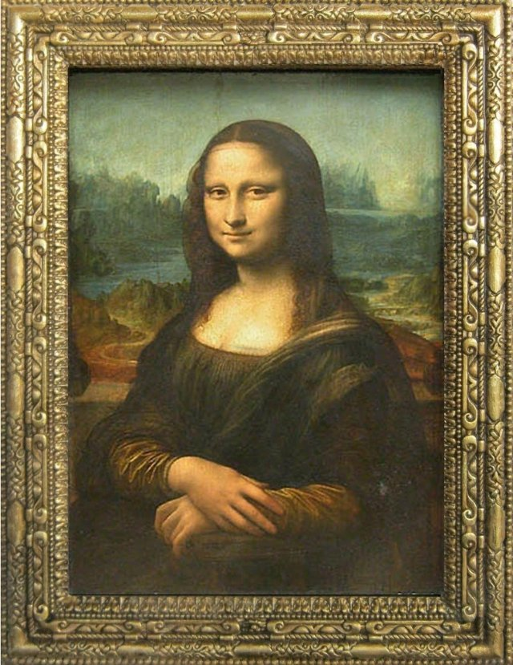{ loading=lazy }

Le tableau le plus célèbre du monde ! Une femme au sourire mystérieux, peinte par Léonard de Vinci. Elle semble vous suivre du regard.

- Rationale: Kids are fascinated by this mysterious painting and it introduces Renaissance art
- Type: Object
- Subjects: Art, History, Culture
- Year: 1503
- Country: Italy
- Topics: [Louvre](../topics/index.md#louvre)
- Words: woman
- Image credit: CC0
- Quests: [Paris ! (fr_01)](../quests/quest/fr_01.md)

---

### Rome
{ loading=lazy }

La capitale de l'Italie.

- Type: Place
- Subjects: Geography, Culture
- Country: Italy
- Topics: [Countries around France](../topics/index.md#france_countries_around)
- Image credit: CC_BY_SA | Dietmar Rabich | [source](https://commons.wikimedia.org/wiki/File:Rome_(Italy),_Piazza_della_Rotonda,_Hub_of_a_Coach_--_2013_--_10.jpg)

---

### Drapeau d'Andorre
{ loading=lazy }

Le drapeau d'Andorre est composé de bandes bleues, jaunes et rouges, avec un blason au centre. Andorre est un petit pays situé entre la France et l'Espagne.

- Rationale: Learning about small countries helps kids understand European diversity
- Type: Concept
- Subjects: Geography, Culture
- Year: 1866
- Country: Spain
- Topics: [Countries around France](../topics/index.md#france_countries_around)
- Image credit: CC0

---

### Drapeau de l'Espagne
{ loading=lazy }

Le drapeau espagnol est orné de bandes horizontales rouges et jaunes. Ces couleurs évoquent le soleil et les poivrons ! L'Espagne a inventé le flamenco.

- Rationale: The Spanish flag helps kids learn about France's southern neighbor and its vibrant culture
- Type: Concept
- Subjects: Geography, Culture
- Year: 1981
- Country: Spain
- Topics: [Flags of Europe](../topics/index.md#flags_euroe), [Countries around France](../topics/index.md#france_countries_around)
- Image credit: CC0
- Quests: [Les voisins de la France (fr_00)](../quests/quest/fr_00.md)

---

### Espagne
{ loading=lazy }

Un pays d'Europe dont la capitale est Madrid. L'Espagne a inventé le flamenco.

- Type: Place
- Subjects: Geography, Culture
- Country: Spain
- Topics: [Countries around France](../topics/index.md#france_countries_around)
- Image credit: CC_BY_SA | Diego Delso | [source](https://commons.wikimedia.org/wiki/File:Palacio_Real_de_Olite,_Navarra,_España,_2015-01-06,_DD_07-09_HDR.JPG)

---

### Madrid
{ loading=lazy }

La capitale de l'Espagne.

- Type: Place
- Subjects: Geography, Culture
- Country: Spain
- Topics: [Countries around France](../topics/index.md#france_countries_around)
- Image credit: CC_BY | Dmitry Dzhus from London | [source](https://commons.wikimedia.org/wiki/File:Madrid_(38624991251).jpg)

