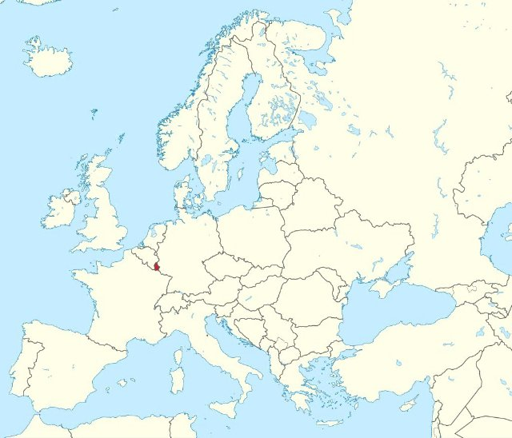

# Les voisins de la France (fr_00)
> [!note] Educators & Designers: help improving this quest!
> **Comments and feedback**: [discuss in the Forum](https://antura.discourse.group/t/fr-00-the-neighbors-of-france/22)  
> **Improve script translations**: [comment the Google Sheet](https://docs.google.com/spreadsheets/d/1FPFOy8CHor5ArSg57xMuPAG7WM27-ecDOiU-OmtHgjw/edit?gid=1044148815#gid=1044148815)  
> **Improve Cards translations**: [comment the Google Sheet](https://docs.google.com/spreadsheets/d/1M3uOeqkbE4uyDs5us5vO-nAFT8Aq0LGBxjjT_CSScWw/edit?gid=415931977#gid=415931977)  
> **Improve the script**: [propose an edit here](https://github.com/vgwb/Antura/blob/main/Assets/_discover/_quests/FR_00%20Geo%20France/FR_00%20Geo%20France%20-%20Yarn%20Script.yarn)  

- Version: 1.00
- Status: Production
- Location: France - France

- Difficulty: Easy
- Duration (min): 15
- Description: Connaissons les voisins de la France

## Design Notes

**Core Subject:** Geography, Flags, and European Countries.

**Player Objectives:**

1. **Flag Hunt:** The player meets a French child who explains that Antura has mixed up all the flags of the neighboring countries.
2. **Country Tour:** The player must help friends from **France, Germany, Italy, Belgium, Spain, Luxembourg, and Switzerland** find their missing flags.
3. **Visual Recognition:** The player must identify flags based on descriptions (e.g., "Red with a white cross" for Switzerland, "Green, white, and red" for Italy).
4. **Chain Reaction:** Finding one flag unlocks the next country's request (e.g., helping Germany leads to Italy).
5. **Completion:** Once all 7 flags are returned, the player completes the map of this part of Europe.

**Educational Content:**

- **Geography:** Introduces the concept of **Europe** and the relative locations of France and its neighbors.
- **Flags:** Teaches the colors and patterns of 7 European flags.
- **Capitals:** Mentions capital cities like **Paris, Berlin, Rome, Brussels, Madrid, Luxembourg City, and Bern**.
- **Cultural Facts:** Includes small facts (e.g., Italy looks like a boot, Germany has castles, Spain has flamenco).

## Topics
### France country {#france-country}
[Open topic page](../../topics/index.md#france-country)  

- Importance: Critical  
- Country: France  
- Target age: Ages6to10

#### Core Card - France
Un pays d'Europe. Sa capitale est Paris.

{ width="200" }
- Type: Place
- Subjects: Geography, Culture

#### Connection (CulturalContext): national symbol - Drapeau de la France
Le drapeau français comporte trois bandes verticales : bleu, blanc et rouge. Ces couleurs représentent la liberté, l'égalité et la fraternité !

{ width="200" }
- Rationale: The French flag is essential for teaching French national identity and values
- Type: Concept
- Subjects: Geography, Culture
- Year: 1794

#### Connection (RelatedTo): country capital - Paris
Paris, capitale de la France, possède une célèbre tour haute appelée la Tour Eiffel !

{ width="200" }
- Type: Place
- Subjects: Geography, Culture

### Countries around France {#france_countries_around}
[Open topic page](../../topics/index.md#france_countries_around)  

- Importance: Medium  
- Country: France  
- Target age: Ages6to10

#### Core Card - France
Un pays d'Europe. Sa capitale est Paris.

{ width="200" }
- Type: Place
- Subjects: Geography, Culture

#### Connection (RelatedTo): neighboring country - Espagne
Un pays d'Europe dont la capitale est Madrid. L'Espagne a inventé le flamenco.

{ width="200" }
- Type: Place
- Subjects: Geography, Culture

#### Connection (CulturalContext): national symbol - Drapeau de l'Espagne
Le drapeau espagnol est orné de bandes horizontales rouges et jaunes. Ces couleurs évoquent le soleil et les poivrons ! L'Espagne a inventé le flamenco.

{ width="200" }
- Rationale: The Spanish flag helps kids learn about France's southern neighbor and its vibrant culture
- Type: Concept
- Subjects: Geography, Culture
- Year: 1981

#### Connection (RelatedTo): neighboring country - Luxembourg
Un pays d'Europe dont la capitale est la ville de Luxembourg.

{ width="200" }
- Type: Place
- Subjects: Geography, Culture

#### Connection (RelatedTo): neighboring country - Italie
Un pays d'Europe dont la capitale est Rome.

{ width="200" }
- Type: Place
- Subjects: Geography, Culture

#### Connection (CulturalContext): national symbol - Drapeau de l'Italie
Le drapeau italien comporte trois bandes verticales : verte, blanche et rouge. Ces couleurs rappellent le basilic, la mozzarella et les tomates sur une pizza !

{ width="200" }
- Rationale: The Italian flag connection to pizza helps kids remember the colors easily
- Type: Concept
- Subjects: Geography, Culture
- Year: 1946

#### Connection (CulturalContext): national symbol - Drapeau du Luxembourg
Le drapeau luxembourgeois est composé de bandes horizontales rouges, blanches et bleu clair. Le Luxembourg est un tout petit pays qui parle trois langues !

{ width="200" }
- Rationale: Small multilingual countries teach kids about European diversity
- Type: Concept
- Subjects: Geography, Culture
- Year: 1972

#### Connection (RelatedTo): neighboring country - Ville de Luxembourg
La capitale du Luxembourg.

{ width="200" }
- Type: Place
- Subjects: Geography, Culture

#### Connection (RelatedTo): neighboring country - Belgique
Un pays d'Europe. Sa capitale est Bruxelles.

{ width="200" }
- Type: Place
- Subjects: Geography, Culture

#### Connection (CulturalContext): national symbol - Drapeau de la Belgique
Le drapeau belge comporte trois bandes verticales : noire, jaune et rouge. La Belgique est célèbre pour son chocolat et ses gaufres !

{ width="200" }
- Rationale: Belgium's unique vertical stripes help kids distinguish different flag patterns
- Type: Concept
- Subjects: Geography, Culture
- Year: 1831

#### Connection (RelatedTo): neighboring country - Suisse
Un pays d'Europe dont la capitale est Berne. La Suisse est célèbre pour ses montagnes et son fromage.

{ width="200" }
- Type: Place
- Subjects: Geography, Culture

#### Connection (CulturalContext): national symbol - Drapeau de la Suisse
Le drapeau suisse est rouge avec une croix blanche au milieu. On dirait une trousse de premiers secours ! La Suisse est célèbre pour ses montagnes et son fromage.

{ width="200" }
- Rationale: The Swiss flag's unique cross design helps kids remember this mountain country
- Type: Concept
- Subjects: Geography, Culture
- Year: 1889

#### Connection (RelatedTo): neighboring country - Bern
La capitale de la Suisse.

{ width="200" }
- Type: Place
- Subjects: Geography, Culture

#### Connection (RelatedTo): neighboring country - Allemagne
Un pays d'Europe. Sa capitale est Berlin.

{ width="200" }
- Type: Place
- Subjects: Geography, Culture

#### Connection (CulturalContext): national symbol - Drapeau de l'Allemagne
Le drapeau allemand comporte trois bandes horizontales : noire, rouge et jaune. L'Allemagne est célèbre pour ses voitures, ses châteaux et ses contes de fées !

{ width="200" }
- Rationale: The German flag helps kids learn about France's important neighbor country
- Type: Concept
- Subjects: Geography, Culture
- Year: 1949

#### Connection (RelatedTo): neighboring country - Berlin
La capitale de l'Allemagne.

{ width="200" }
- Type: Place
- Subjects: Geography, Culture

#### Connection (RelatedTo): neighboring country - Rome
La capitale de l'Italie.

{ width="200" }
- Type: Place
- Subjects: Geography, Culture

#### Connection (RelatedTo): neighboring country - Bruxelles
La capitale de la Belgique.

{ width="200" }
- Type: Place
- Subjects: Geography, Culture

#### Connection (RelatedTo): neighboring country - Madrid
La capitale de l'Espagne.

{ width="200" }
- Type: Place
- Subjects: Geography, Culture

#### Connection (RelatedTo): neighboring country - Drapeau d'Andorre
Le drapeau d'Andorre est composé de bandes bleues, jaunes et rouges, avec un blason au centre. Andorre est un petit pays situé entre la France et l'Espagne.

{ width="200" }
- Rationale: Learning about small countries helps kids understand European diversity
- Type: Concept
- Subjects: Geography, Culture
- Year: 1866

#### Connection (RelatedTo): neighboring country - Drapeau de Monaco
Le drapeau de Monaco est composé de bandes horizontales rouges et blanches. Monaco est une petite ville, mais célèbre pour ses voitures de luxe et ses palais royaux en bord de mer !

{ width="200" }
- Rationale: Monaco shows kids how small places can be special and important
- Type: Concept
- Subjects: Geography, Culture
- Year: 1881

## Additional Cards
#### Carte de l'Europe
Une carte montrant tous les pays d'Europe. Vous pouvez voir où se trouvent la France, la Pologne, l'Allemagne et d'autres pays.

{ width="200" }
- Rationale: Maps help kids understand where different countries are and how they connect
- Type: Concept
- Subjects: Geography, Education
- Year: 2000

## Quest Script

[See the full script here](./fr_00-script.md)

## Words
## Activities
- (none)

## Tasks
- [Collect] FIND_FRENCH_FLAG
- [Collect] FIND_GERMAN_FLAG
- [Collect] FIND_SPANISH_FLAG
- [Collect] FIND_ITALIAN_FLAG
- [Collect] FIND_BELGIUM_FLAG
- [Collect] FIND_LUX_FLAG
- [Collect] FIND_SWISS_FLAG
- [Interact] talk_npc_german
- [Interact] talk_npc_spain
- [Interact] talk_npc_italy
- [Interact] talk_npc_belgium
- [Interact] talk_npc_luxembourg
- [Interact] talk_npc_swiss
- [Interact] talk_npc_french_final
## Credits
- Anne (France) (content)
- Lucie Paillat (France) (content)
- [Stefano Cecere](https://stefanocecere.com) (Italy) (content, design, development)
- Vieri Toti (Italy) (content, design)
