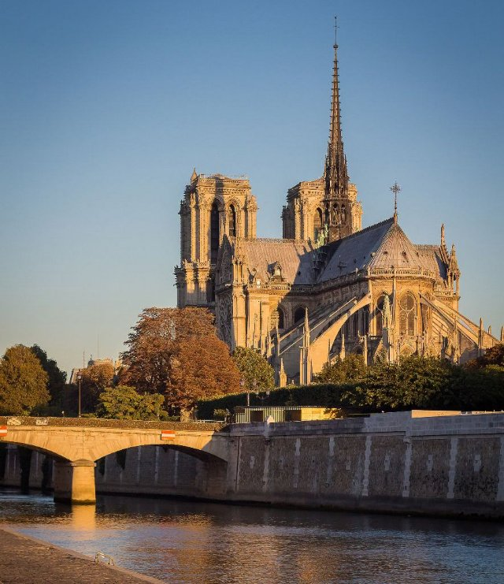
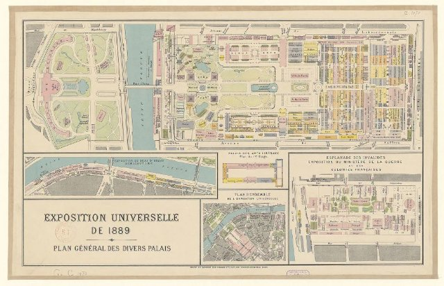
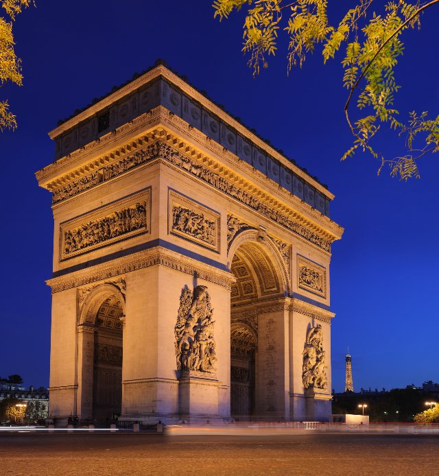

# Paris ! (fr_01)
> [!note] Educators & Designers: help improving this quest!
> **Comments and feedback**: [discuss in the Forum](https://antura.discourse.group/t/fr-01-paris/23/1)  
> **Improve script translations**: [comment the Google Sheet](https://docs.google.com/spreadsheets/d/1FPFOy8CHor5ArSg57xMuPAG7WM27-ecDOiU-OmtHgjw/edit?gid=755037318#gid=755037318)  
> **Improve Cards translations**: [comment the Google Sheet](https://docs.google.com/spreadsheets/d/1M3uOeqkbE4uyDs5us5vO-nAFT8Aq0LGBxjjT_CSScWw/edit?gid=415931977#gid=415931977)  
> **Improve the script**: [propose an edit here](https://github.com/vgwb/Antura/blob/main/Assets/_discover/_quests/FR_01%20Paris/FR_01%20Paris%20-%20Yarn%20Script.yarn)  

- Version: 1.00
- Status: Production
- Location: France - Paris

- Difficulty: Normal
- Duration (min): 20
- Kind:
  - Parkour
  - Seek
  - Orientation
- Description: voyagez dans Paris à la recherche d’Antura !

## Design Notes
## Game Design Notes

Explore Paris tour through iconic landmarks.

Location:
Paris, France

1. Learn about Eiffel Tower construction
2. Bakery and French baguette making with ingredient collection
3. visit Notre-Dame architecture

### Flow

Guide welcomes

**Part 1: La Tour Eiffel and Gustave Eiffel**
Mission: Climb the Eiffel Tower with the elevator.

Collect 5 coins to buy ticket

**Part 2: Notre Dame de Paris**
Mission: find the 3 pieces of the map

**Part 3: La Baguette**
Mission: Learn the art of making the perfect baguette and discover its cultural significance in French society.

## Topics
### Eiffel Tower {#eiffel-tower}
[Open topic page](../../topics/index.md#eiffel-tower)  

What we need to know about the iconic Paris landmark

- Importance: Critical  
- Country: France  
- Target age: Ages3to5  
- Subjects: History

#### Core Card - Tour Eiffel
Une haute tour, symbole de Paris. Construite en fer, elle mesure 300 mètres de haut. De là-haut, on peut admirer toute la ville.

{ width="200" }
- Type: Place
- Subjects: Geography, History, Culture
- Year: 1889

#### Connection (LocatedIn) - Paris
Paris, capitale de la France, possède une célèbre tour haute appelée la Tour Eiffel !

{ width="200" }
- Type: Place
- Subjects: Geography, Culture

#### Connection (CreatedBy): Gustave Eiffel designed and built the tower - Gustave Eiffel
L'homme qui a construit la tour Eiffel ! C'était un ingénieur passionné de construction en fer et il a créé la tour la plus célèbre du monde.

{ width="200" }
- Type: Person
- Subjects: History, Culture, Science
- Year: 1832

#### Connection (MadeOf) - Fer
Un outil chauffant utilisé pour lisser et aplatir les vêtements froissés. Attention, les fers à repasser sont très chauds !

{ width="200" }
- Type: Object
- Subjects: Science

#### Connection (RelatedTo) - Carte de la Tour Eiffel
Une carte qui montre où se trouve la célèbre haute tour de Paris.

{ width="200" }
- Type: Object
- Subjects: Community, Culture

#### Connection (RelatedTo) - Billet pour la Tour Eiffel
Un document spécial qui vous permet de visiter la célèbre haute tour de Paris, en France.

{ width="200" }
- Type: Object
- Subjects: Science

### Notre Dame {#notredame}
[Open topic page](../../topics/index.md#notredame)  

- Importance: High  
- Country: France  
- Target age: Ages6to10  
- Subjects: Culture

#### Core Card - Notre-Dame de Paris
Une magnifique cathédrale parisienne. Ses vitraux colorés racontent des histoires.

{ width="200" }
- Type: Place
- Subjects: Geography, Environment
- Year: 1885

#### Connection (LocatedIn) - Paris
Paris, capitale de la France, possède une célèbre tour haute appelée la Tour Eiffel !

{ width="200" }
- Type: Place
- Subjects: Geography, Culture

#### Connection (TimeContext): notable event - Incendie de Notre-Dame
En 2019, un important incendie a endommagé la magnifique cathédrale Notre-Dame de Paris. De nombreuses personnes se sont mobilisées pour sauver cet important édifice.

{ width="200" }
- Rationale: This event teaches kids about protecting cultural heritage and community cooperation
- Type: Concept
- Subjects: History, Culture, Environment
- Year: 2019

#### Connection (LocatedIn) - Île-de-France
Région de France où se trouve Paris, la capitale. De nombreuses personnes y vivent !

{ width="200" }
- Type: Place
- Subjects: Geography, Environment

### Baguette {#baguette}
[Open topic page](../../topics/index.md#baguette)  

the french bread famous all around the world!

- Importance: Medium  
- Country: France  
- Target age: Ages3to5  
- Subjects: Food

#### Core Card - Baguette française
Un pain long et croustillant, l'aliment le plus célèbre en France. Les Français achètent des baguettes fraîches tous les jours à la boulangerie !

{ width="200" }
- Rationale: Baguettes are iconic French culture that kids can easily understand and remember
- Type: Object
- Subjects: Food, Culture
- Year: 1700

#### Connection (LocatedIn) - Paris
Paris, capitale de la France, possède une célèbre tour haute appelée la Tour Eiffel !

{ width="200" }
- Type: Place
- Subjects: Geography, Culture

#### Connection (CreatedBy) - Boulanger
Une personne qui fait du pain, des gâteaux et des pâtisseries.

{ width="200" }
- Type: Person
- Subjects: History, Culture

#### Connection (MadeOf) - Sel
Des cristaux blancs qui améliorent le goût des aliments.

{ width="200" }
- Type: Object
- Subjects: Food, Culture

#### Connection (MadeOf) - Levure
La levure est comme une poudre magique qui rend le pain moelleux et savoureux !

{ width="200" }
- Type: Object
- Subjects: Food, Culture

#### Connection (MadeOf) - Farine
Poudre blanche fabriquée à partir de blé qui est utilisée pour faire du pain.

{ width="200" }
- Type: Object
- Subjects: Food, Science

#### Connection (MadeOf) - Eau
L'eau est essentielle à toute vie

{ width="200" }
- Type: Object
- Subjects: Food, Culture

## Additional Cards
#### Louvre
Un immense musée rempli d'œuvres d'art. C'est là que vit la Joconde.

{ width="200" }
- Type: Place
- Subjects: Art, Culture, History
- Year: 1793

#### Cathédrale
Une très grande et importante église dans une ville.

{ width="200" }
- Type: Place
- Subjects: Culture, History, Education

#### Église
Un bâtiment spécial où les gens se réunissent pour prier et chanter.

{ width="200" }
- Type: Place
- Subjects: Culture, Civics, Education

#### Ascenseurs de la Tour Eiffel
Ascenseurs qui emmènent les visiteurs en haut de la tour de fer.

{ width="200" }
- Type: Object
- Subjects: Technology, Transportation

#### Arc-boutant
Bras de pierre à l'extérieur qui aident à soutenir les hauts murs.

{ width="200" }
- Type: Concept
- Subjects: Technology, History, Art

#### Gargouille
Une statue drôle ou effrayante qui fonctionne également comme une gouttière.

{ width="200" }
- Type: Concept
- Subjects: Art, Technology, History

#### Rosace
Un grand vitrail rond qui raconte des histoires avec la lumière.

{ width="200" }
- Type: Concept
- Subjects: Art, Culture, History

#### Exposition universelle (1889)
La grande exposition universelle où la Tour Eiffel a été présentée.

{ width="200" }
- Type: Concept
- Subjects: History, Culture

#### Arc de Triomphe
Une grande arche à Paris, érigée en l'honneur des héros. On peut la voir briller au bout d'une longue avenue !

{ width="200" }
- Type: Place

#### Louvre
Un immense musée rempli d'œuvres d'art. C'est là que vit la Joconde.

{ width="200" }
- Type: Place
- Subjects: Art, Culture, History
- Year: 1793

## Quest Script

[See the full script here](./fr_01-script.md)

## Words
## Activities
- [JigsawPuzzle](../../activities/index.md#JigsawPuzzle)
- [Memory](../../activities/index.md#Memory)
- [MoneyCount](../../activities/index.md#MoneyCount)
- [Memory](../../activities/index.md#Memory)
- [CleanCanvas](../../activities/index.md#CleanCanvas)
- [JigsawPuzzle](../../activities/index.md#JigsawPuzzle)
- [Match](../../activities/index.md#Match)

## Tasks
- [Interact] go_eiffell
- [Collect] collect_coins
- [Interact] go_notredame
- [Interact] go_arc
- [Interact] go_louvre
- [Interact] go_baker
## Credits
- Anne (France) (content)
- Fabio Cecere (Italy) (design)
- Lucie Paillat (France) (content)
- [Stefano Cecere](https://stefanocecere.com) (Italy) (design, development)
