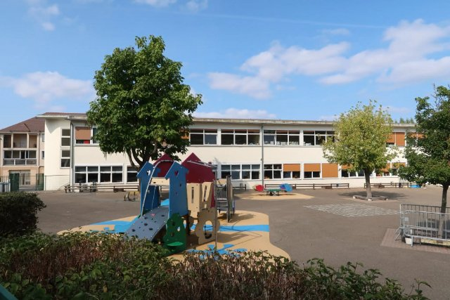
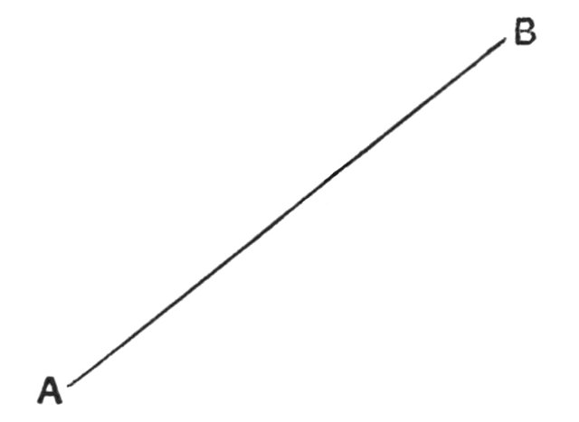

# Le système scolaire (fr_02)
> [!note] Educators & Designers: help improving this quest!
> **Comments and feedback**: [discuss in the Forum](https://antura.discourse.group/t/fr-02-the-school-system/24/1)  
> **Improve script translations**: [comment the Google Sheet](https://docs.google.com/spreadsheets/d/1FPFOy8CHor5ArSg57xMuPAG7WM27-ecDOiU-OmtHgjw/edit?gid=1873232287#gid=1873232287)  
> **Improve Cards translations**: [comment the Google Sheet](https://docs.google.com/spreadsheets/d/1M3uOeqkbE4uyDs5us5vO-nAFT8Aq0LGBxjjT_CSScWw/edit?gid=415931977#gid=415931977)  
> **Improve the script**: [propose an edit here](https://github.com/vgwb/Antura/blob/main/Assets/_discover/_quests/FR_02%20Angers%20School/FR_02%20Angers%20School%20-%20Yarn%20Script.yarn)  

- Version: 1.00
- Status: Production
- Location: France - Angers

- Difficulty: Normal
- Duration (min): 20
## Design Notes
## Game Design Notes

The cat goes to different places until he finds his school. Then he visits the school and finds his class.

### Content
School system : the cats goes a lycée (16-18 ans), to a collège (11-15 ans), to a école maternelle (3-5 ans) and finally goes to an école primaire (6-10 ans), that corresponds to his age, called Jules Verne

A typical day at school

- Morning childcare = garderie du matin
- arrival at the school gate = le portail
- work in class with different subjects/matières : maths, reading & writing
- morning playtime (récréation) on the playground (la cour) 
- lunch at the canteen (la cantine) or at home (à la maison)
- school work with different subjects/matières : PE = EPS (éducation physique et - sportive),  hist/geog = histoire/géographie,  science = sciences, arts= art
- evening childcare = garderie du soir / homework support = aide aux devoirs

School levels with level names and age (CP–6 ans / CE1-7 ans / CE2-8 ans /CM1-9 ans / CM2–10 ans).

### Knowledge content
The French School System: Kids learn the names, age groups, and order of the main schools:

- École Maternelle (3-5 years old)
- École Primaire (6-10 years old) - 5 years total.
- Collège (11-15 years old)
- Lycée (16-18 years old)

**The Baccalauréat**: Kids learn that the Lycée prepares you for a final diploma called le Baccalauréat, which is needed for university.

**Classroom Life**: Kids learn that French students learn to write in cursive, have playtime (la récréation) in the morning and afternoon, and study things like geometry.

**Cultural Values**: Introduction to the principles of French public schools via the national motto and the Charter of Secularism.

## Topics
### French School {#frenchschool}
[Open topic page](../../topics/index.md#frenchschool)  

- Importance: High  
- Country: France  
- Target age: Ages6to10  
- Subjects: Education

#### Core Card - écoles françaises
En France, l'école se déroule en quatre grandes étapes : la maternelle (apprentissage ludique pour les petits), l'école élémentaire (lecture, écriture, mathématiques), le collège et le lycée. À la fin du lycée, de nombreux élèves passent un examen important, le baccalauréat.

{ width="200" }
- Type: Concept
- Subjects: Education, Civics, Culture

#### Connection (PartOf) - École maternelle
École pour les petits de 3 à 5 ans. On apprend en jouant et en explorant.

{ width="200" }
- Type: Concept
- Subjects: Education, Culture
- Year: 1975

#### Connection (PartOf) - École primaire en France
École pour les enfants de 6 à 10 ans. Vous apprenez à lire, à écrire et à compter.

{ width="200" }
- Type: Concept
- Subjects: Education, Culture
- Year: 1975

#### Connection (PartOf) - Lycée en France
Lycée en France pour les adolescents de 16 à 18 ans. Les élèves étudient dur pour l'examen du baccalauréat pour aller à l'université.

{ width="200" }
- Rationale: The Lycée system shows kids the path to higher education in France
- Type: Concept
- Subjects: Education, Culture
- Year: 1975

#### Connection (PartOf) - Collège en France
Collège en France pour les enfants de 11 à 15 ans. Les élèves apprennent de nombreuses matières et se préparent au lycée.

{ width="200" }
- Rationale: Understanding the French school system helps kids compare education across countries
- Type: Concept
- Subjects: Education, Culture
- Year: 1975

#### Connection (Purpose) - Écriture cursive
Une façon particulière d'écrire où toutes les lettres d'un mot sont reliées entre elles. En France, les enfants apprennent cette écriture à l'école.

{ width="200" }
- Rationale: Cursive writing is an important part of French education and cultural identity
- Type: Concept
- Subjects: Education, Culture, Art
- Year: 1800

#### Connection (Purpose) - Menu de la cantine
Une liste des aliments autorisés à la cantine. Elle vous aide à choisir vos repas !

{ width="200" }
- Type: Object
- Subjects: Community, Culture

#### Connection (CulturalContext) - Charte de la laïcité
Un ensemble de règles visant à respecter les croyances de chacun. Il contribue à une coexistence pacifique.

{ width="200" }
- Type: Concept
- Subjects: Community, Culture
- Year: 2013

### Elementary Math {#elementary-maths}
[Open topic page](../../topics/index.md#elementary-maths)  

Numbers and shapes for everyday life: counting, adding and subtracting, simple fractions, measuring, telling time, and using money.

- Importance: Medium  
- Country: International  
- Target age: Ages6to10  
- Subjects: Math

#### Core Card - Mathématiques élémentaires
Chiffres et formes de la vie quotidienne : compter, additionner et soustraire, fractions simples, mesurer, lire l'heure et utiliser l'argent.

{ width="200" }
- Type: None

#### Connection (PartOf): curriculum element - Doubler
Une ligne droite reliant un point à un autre. Les lignes peuvent être longues ou courtes.

{ width="200" }
- Type: Concept
- Subjects: Math

#### Connection (PartOf): curriculum element - Triangle
Une forme à trois côtés droits et trois coins. Les triangles ressemblent à des parts de pizza !

{ width="200" }
- Type: Concept
- Subjects: Math

#### Connection (Purpose): tool used for math - Compas
Un outil qui permet de tracer des cercles parfaits. Il possède deux branches, comme des ciseaux.

{ width="200" }
- Type: Object
- Subjects: Math

#### Connection (Purpose): tool used for math - Règle
Un outil droit utilisé pour mesurer la longueur des objets. Les règles comportent des chiffres et des lignes.

{ width="200" }
- Type: Object
- Subjects: Math

#### Connection (Purpose): tool used for math - Carré
Un outil en forme de triangle utilisé pour dessiner des lignes droites et des angles droits en mathématiques.

{ width="200" }
- Type: Object
- Subjects: Math

#### Connection (PartOf): Previous core card - Cercle
Une forme ronde sans coins. Les cercles ressemblent à des roues, des boules et des pièces de monnaie !

{ width="200" }
- Type: Concept
- Subjects: Math

## Additional Cards
#### Cartable
Un sac que les élèves utilisent pour transporter leurs livres, leurs crayons et leurs devoirs à l'école.

{ width="200" }
- Type: Object
- Subjects: Science

#### Classe
Une salle à l'école où les élèves s'assoient et apprennent de nouvelles choses de leur professeur.

{ width="200" }
- Type: Place
- Subjects: Education, Community

#### Affiche de l'école française
Un grand tableau avec des informations qui s'affiche sur les murs des salles de classe dans les écoles françaises.

{ width="200" }
- Type: Object
- Subjects: Education

## Quest Script

[See the full script here](./fr_02-script.md)

## Words
- water
## Activities
- [Match](../../activities/index.md#Match)
- [Order](../../activities/index.md#Order)

## Tasks
- [Interact] TASK_SCHOOL
- [Collect] TASK_BACKPACK
- [Interact] TASK_CLASSROOM
## Credits
- Anne (France) (content)
- Lucie Paillat (France) (content, design)
- [Stefano Cecere](https://stefanocecere.com) (Italy) (development)
