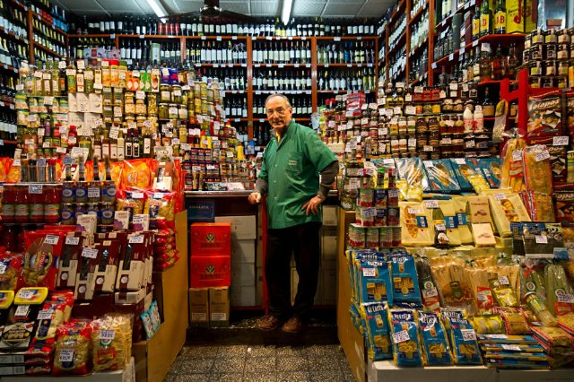

# Nourriture et marché (fr_09)
> [!note] Educators & Designers: help improving this quest!
> **Comments and feedback**: [discuss in the Forum](https://antura.discourse.group/t/fr-09-the-colors-of-the-marseille-market/28/1)  
> **Improve script translations**: [comment the Google Sheet](https://docs.google.com/spreadsheets/d/1FPFOy8CHor5ArSg57xMuPAG7WM27-ecDOiU-OmtHgjw/edit?gid=1243903291#gid=1243903291)  
> **Improve Cards translations**: [comment the Google Sheet](https://docs.google.com/spreadsheets/d/1M3uOeqkbE4uyDs5us5vO-nAFT8Aq0LGBxjjT_CSScWw/edit?gid=415931977#gid=415931977)  
> **Improve the script**: [propose an edit here](https://github.com/vgwb/Antura/blob/main/Assets/_discover/_quests/FR_09%20Food%20&%20Market/FR_09%20Food%20&%20Market%20-%20Yarn%20Script.yarn)  

- Version: 1.00
- Status: Production
- Location: France - Marseille

- Difficulty: Normal
- Duration (min): 15
- Kind:
  - Seek
  - Puzzles
- Description: Visitez le Vieux-Port animé de Marseille ! Apprenez les formules de politesse en achetant les ingrédients d'un célèbre plat local, la bouillabaisse.

## Design Notes

**Core Subject:** Food, Commerce, and Social Etiquette.

**Player Objectives:**

1. **Culinary Mission:** The player meets a Chef who wants to prepare a traditional **Bouillabaisse** (fish stew) but lacks the ingredients.
2. **Market Exploration:** The player must visit four different vendors (Baker, Fishmonger, Cheesemonger, Greengrocer) to find specific items like **fish, bread, tomatoes, and olive oil**.
3. **Social Interaction:** To succeed, the player must use polite greetings ("Bonjour", "Merci") and select the correct items from each vendor's list.
4. **Financial Literacy:** The player pays for items using a mini-game that simulates counting money (Euros).
5. **Final Preparation:** After collecting all 9 ingredients, the player returns to the Chef to match the ingredients to their source (e.g., Fish comes from the Fishmonger) and "cook" the final dish.

**Educational Content:**

- **Cultural Dish:** Introduces _Bouillabaisse_ as a famous specialty of Marseille.
- **Vocabulary:** Focuses on food items (_Fish, Crab, Bread, Milk, Oil, Tomato, Lemon_) and professions (_Baker, Grocer, Fishmonger_).
- **Social Skills:** Reinforces the importance of politeness (greeting before asking) and basic commerce (exchanging money for goods).

## Topics
### market traders {#marketers}
[Open topic page](../../topics/index.md#marketers)  

People who sell food and goods at market stalls—like fishmongers, cheesemongers, and fruit sellers. They weigh, wrap, and call out today’s prices.

- Importance: Medium  
- Country: France  
- Target age: Ages6to10

#### Core Card - Commerçants du marché
Ceux qui vendent des produits alimentaires et autres marchandises sur les étals des marchés, comme les poissonniers, les fromagers et les marchands de fruits. Ils pèsent, emballent et annoncent les prix du jour.

{ width="200" }
- Type: Person
- Subjects: Money, Community

#### Connection (RelatedTo) - Fromager
Une personne qui vend de nombreux types de fromages.

{ width="200" }
- Type: Person
- Subjects: History, Culture

#### Connection (RelatedTo) - Boulanger
Une personne qui fait du pain, des gâteaux et des pâtisseries.

{ width="200" }
- Type: Person
- Subjects: History, Culture

#### Connection (RelatedTo) - Marchand de légumes
Une personne qui vend des fruits et légumes frais.

{ width="200" }
- Type: Person
- Subjects: History, Culture

#### Connection (RelatedTo) - Épicier
Une personne qui vend de nombreux types d’aliments et de boissons.

{ width="200" }
- Type: Person
- Subjects: History, Culture

#### Connection (RelatedTo): Previous core card - Poissonnier
Une personne qui vend du poisson frais et des fruits de mer.

{ width="200" }
- Type: Person
- Subjects: History, Culture

### Bouillabaisse {#bouillabaisse}
[Open topic page](../../topics/index.md#bouillabaisse)  

- Importance: Low  
- Country: France  
- Target age: Ages6to10

#### Core Card - Bouillabaisse
Une soupe de poisson typique de Marseille, dans le sud de la France. Elle est composée de différentes variétés de poissons et dégage une délicieuse odeur !

{ width="200" }
- Type: Object
- Subjects: Food, Culture
- Year: 1700

#### Connection (MadeOf) - Pain
Un délicieux aliment à base de farine et d'eau. Vous pouvez faire des sandwichs avec du pain !

{ width="200" }
- Type: Object
- Subjects: Food, Culture

#### Connection (MadeOf) - Poisson
Un animal qui vit et nage dans l'eau. Les poissons ont des nageoires et des branchies pour respirer sous l'eau.

{ width="200" }
- Type: Object
- Subjects: Food, Culture

#### Connection (MadeOf) - Crabe
Un animal marin doté de grandes pinces et d'une carapace dure. Les crabes marchent latéralement sur la plage !

{ width="200" }
- Type: Object
- Subjects: Food, Culture

#### Connection (MadeOf) - Lait
Une boisson blanche issue du lait de vache. Le lait contribue à la solidité des os et des dents !

{ width="200" }
- Type: Object
- Subjects: Food, Culture

#### Connection (MadeOf) - Orange
Un fruit rond et orange, au goût sucré et juteux. L'orange est riche en vitamine C !

{ width="200" }
- Type: Object
- Subjects: Food, Culture

#### Connection (MadeOf) - Tomate
Un fruit rouge et rond qui pousse sur les plantes. On utilise les tomates pour faire de la sauce à pizza !

{ width="200" }
- Type: Object
- Subjects: Food, Culture

#### Connection (MadeOf) - Citron
Un fruit jaune au goût très acide. On utilise le citron pour faire de la limonade !

{ width="200" }
- Type: Object
- Subjects: Food, Culture

#### Connection (MadeOf) - Huile d'olive
Une huile spéciale à base d'olives. On l'utilise pour cuisiner des plats savoureux.

{ width="200" }
- Type: Object
- Subjects: Food, Culture

#### Connection (MadeOf) - Poivre Sel
Des épices qui rehaussent le goût des aliments. Le sel est blanc et le poivre est noir avec de petits morceaux.

{ width="200" }
- Type: Object
- Subjects: Food, Culture

## Additional Cards
#### Pirates français
De braves marins qui sillonnaient les mers pour le roi de France. On les appelait corsaires et ils protégeaient les navires français de l'ennemi.

{ width="200" }
- Rationale: Pirates capture kids' imagination while teaching about maritime history and French naval power
- Type: Concept
- Subjects: History, Culture, Transportation
- Year: 1600

#### Monnaie euro
Monnaie utilisée dans de nombreux pays d'Europe. Vous pouvez acheter des jouets et des glaces avec des euros !

{ width="200" }
- Type: Concept
- Subjects: Money, Geography

## Quest Script

[See the full script here](./fr_09-script.md)

## Words
## Activities
- [MoneyCount](../../activities/index.md#MoneyCount)
- [MoneyCount](../../activities/index.md#MoneyCount)
- [MoneyCount](../../activities/index.md#MoneyCount)
- [MoneyCount](../../activities/index.md#MoneyCount)
- [MoneyCount](../../activities/index.md#MoneyCount)
- [Match](../../activities/index.md#Match)
- [JigsawPuzzle](../../activities/index.md#JigsawPuzzle)
- [MoneyCount](../../activities/index.md#MoneyCount)
- [MoneyCount](../../activities/index.md#MoneyCount)
- [MoneyCount](../../activities/index.md#MoneyCount)
- [MoneyCount](../../activities/index.md#MoneyCount)
- [MoneyCount](../../activities/index.md#MoneyCount)

## Tasks
- [Collect] COLLECT_THE_INGREDIENTS
- [Interact] go_back_chef
## Credits
- Anne (France) (content)
- Lucie Paillat (France) (content, design)
- [Stefano Cecere](https://stefanocecere.com) (Italy) (development)
- Valeria Passarella (Italy) (design)
