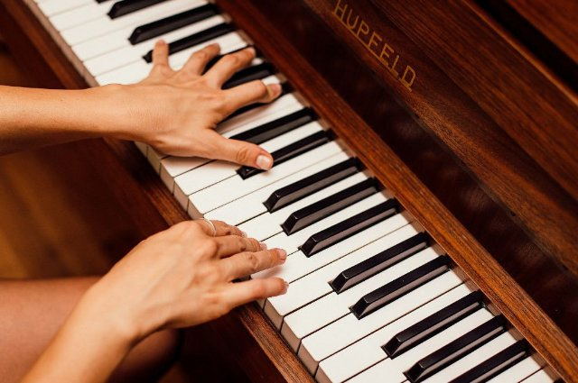

# La Marseillaise (fr_11)
> [!note] Educators & Designers: help improving this quest!
> **Comments and feedback**: [discuss in the Forum](https://antura.discourse.group/t/fr-11-la-marseillaise/30/1)  
> **Improve script translations**: [comment the Google Sheet](https://docs.google.com/spreadsheets/d/1FPFOy8CHor5ArSg57xMuPAG7WM27-ecDOiU-OmtHgjw/edit?gid=849141304#gid=849141304)  
> **Improve Cards translations**: [comment the Google Sheet](https://docs.google.com/spreadsheets/d/1M3uOeqkbE4uyDs5us5vO-nAFT8Aq0LGBxjjT_CSScWw/edit?gid=415931977#gid=415931977)  
> **Improve the script**: [propose an edit here](https://github.com/vgwb/Antura/blob/main/Assets/_discover/_quests/FR_11%20Music%20Marseillese/FR_11%20Music%20Marseillese%20-%20Yarn%20Script.yarn)  

- Version: 1.00
- Status: Development
- Location: France - Paris

- Difficulty: Normal
- Duration (min): 15
- Description: Découvrez l'histoire de l'hymne français et comment le jouer !

## Design Notes
## Game Design Notes

Mission: Play the first part of the French anthem (La Marseillaise)

### Knowledge Content
**History:**  
“La Marseillaise” was written in 1792 and played for the first time in 1795
The historical context of the time it was written - during the French Revolution

**Vocabulary (Putting a Phrase together):**  

- Assembling the first phrase of “La Marseillaise”
- What’s a **Hymn/anthem**

**Musical Knowledge:**  
Knowing the **musical notes** (Do, Re - Mi - Fa - Sol - La - Si) we need a card for each

### Flow

**The Mission - Find the script**  
The band wants to play “La Marseillaise” but the script has been scattered around by Antura, the cat must find the 7 pieces that make up the script that are scattered around the park. Every piece will have a musical note on them, the band will tell you that they are Ut - Re - Mi - Fa - Sol - La - Si.

Using the **activity Order** : **Ut - Re - Mi - Fa - Sol - La - Si**

**Phrase - Find  the words**  
Once the pieces of the song have been put together the leader of the band, Jean Michelle Jarre, is gonna introduce himself and then he will tell the player that the French Hymn is a song that is meant to represent the Nation and unite its people. 
Once the hymn is put together the band will shortly play the song with the lyrics and then Antura acting up again will scatter the first words of the hymn.
The Band remembers them but they’re scared to play without them so they’ll ask the cat to re-order them. With a button you can hear the song.

Using the **activity Order** : **“Allons enfants” - “De la patrie” - “Le jour de la gloire”  - “Est arrivé”** (we need a Card for each part)

**Conclusion - Play the song**  
Once the words are put together the band will say that it was written in 1792 during the French Revolution  and they’ll ask the player to play with them the first part of a Xylophone, giving them a musical score with the notes written on top.
Once done the band will congratulate the cat and Antura calmed down by the music will stop causing trouble. For now.

**Interactions**  
Band Member 1 : “We want to play “La marseillaise!” But Antura has lost all the musical scores! Help us  find them! They’re scattered all around and they are seven like the notes : Ut - Re - Mi - Fa - Sol - La - Si”

**After collecting everything**  
“Thank you for getting everything back!”
Jean :”but the words are all messed up! The band remembers them but we want to have them ordered! You know the National Anthem

**Final Assessment**

**What is “La Marseillaise”?**

- The French National Anthem (correct)
- The English National anthem
- The song of Antura

**What is a National Anthem?**

- A song to represent a Nation and its people (correct)
- A song to represent a War that happened in French
- A song to represent Antura

**When was “La Marseillaise” written?**

- 1792 (correct)
- 2025
- 1970

## Topics
### marseillaise music {#marseillaise_music}
[Open topic page](../../topics/index.md#marseillaise_music)  

- Importance: High  
- Country: France  
- Target age: Ages6to10

#### Core Card - La Marseillaise
L'hymne national français. On le chante lors des grands événements et des compétitions sportives.

{ width="200" }
- Type: Concept
- Subjects: Music, Culture
- Year: 1885

#### Connection (RelatedTo) - Révolution française
Une époque dans les années 1790 où la France a changé de gouvernement.

{ width="200" }
- Type: Concept
- Subjects: History, Civics, Time, Culture

#### Connection (RelatedTo) - Le jour de la gloire
Paroles de la première ligne de l’hymne.

{ width="200" }
- Type: Object
- Subjects: Music, Education, Culture

#### Connection (RelatedTo) - Allons enfants
Les premiers mots de la première ligne de l’hymne.

{ width="200" }
- Type: Object
- Subjects: Music, Education, Culture

#### Connection (RelatedTo) - De la patrie
Paroles de la première ligne de l’hymne.

{ width="200" }
- Type: Object
- Subjects: Music, Education, Culture

#### Connection (RelatedTo) - Est arrivé
Paroles de la première ligne de l’hymne.

{ width="200" }
- Type: Object
- Subjects: Music, Education, Culture

### Musical Notes {#musical_notes}
[Open topic page](../../topics/index.md#musical_notes)  

- Importance: Medium  
- Country: International  
- Target age: Ages6to10

#### Core Card - Partition musicale
Les notes écrites et les paroles d'une chanson.

{ width="200" }
- Type: Object
- Subjects: Education, Music

#### Connection (RelatedTo) - Piano
Un instrument à clavier utilisé pour jouer des mélodies et des accords.

{ width="200" }
- Type: Object
- Subjects: Music, Education

#### Connection (RelatedTo) - La
Une note de musique.

{ width="200" }
- Type: Concept
- Subjects: Music, Education

#### Connection (RelatedTo) - Fa
Une note de musique.

{ width="200" }
- Type: Concept
- Subjects: Music, Education

#### Connection (RelatedTo) - Si
Une note de musique.

{ width="200" }
- Type: Concept
- Subjects: Music, Education

#### Connection (RelatedTo) - Sol
Une note de musique.

{ width="200" }
- Type: Concept
- Subjects: Music, Education

#### Connection (RelatedTo) - Ut
Une note de musique.

{ width="200" }
- Type: Concept
- Subjects: Music, Education

#### Connection (RelatedTo) - Mi
Une note de musique.

{ width="200" }
- Type: Concept
- Subjects: Music, Education

#### Connection (RelatedTo) - Concernant
Une note de musique.

{ width="200" }
- Type: Concept
- Subjects: Music, Education

## Quest Script

[See the full script here](./fr_11-script.md)

## Words
## Activities
- [Order](../../activities/index.md#Order)
- [Order](../../activities/index.md#Order)
- [JigsawPuzzle](../../activities/index.md#JigsawPuzzle)

## Tasks
- [Collect] find_the_script_parts
- [Collect] find_the_words
## Credits
- [Stefano Cecere](https://stefanocecere.com) (Italy) (content, development)
- Vieri Toti (Italy) (content, design, development)
