# Le grand sauvetage des nains de Wrocław (pl_02)
> [!note] Educators & Designers: help improving this quest!
> **Comments and feedback**: [discuss in the Forum](https://antura.discourse.group/t/pl-02-the-great-wroclaw-dwarf-rescue/33/1)  
> **Improve script translations**: [comment the Google Sheet](https://docs.google.com/spreadsheets/d/1FPFOy8CHor5ArSg57xMuPAG7WM27-ecDOiU-OmtHgjw/edit?gid=1721014062#gid=1721014062)  
> **Improve Cards translations**: [comment the Google Sheet](https://docs.google.com/spreadsheets/d/1M3uOeqkbE4uyDs5us5vO-nAFT8Aq0LGBxjjT_CSScWw/edit?gid=415931977#gid=415931977)  
> **Improve the script**: [propose an edit here](https://github.com/vgwb/Antura/blob/main/Assets/_discover/_quests/PL_02%20Wroclaw%20Dwarves/PL_02%20Wroclaw%20Dwarves%20-%20Yarn%20Script.yarn)  

- Version: 1.00
- Status: Production
- Location: Poland - Wrocław

- Difficulty: Difficult
- Duration (min): 40
- Description: Explorez la belle ville de Wrocław, découvrez ses célèbres statues de nains cachées près des monuments.

## Game Design Notes

**Mission Objective**
Explore Wrocław to rescue Antura from the top of the Sky Tower. To get there, the player must free **10 dwarves locked inside magical cages**. Each cage needs a hidden key found through exploration, NPC clues, mini-games, or quizzes. Every rescue teaches one clear fact about Wrocław.

**Characters**

- **The Teacher:** A friendly guide at the Leonardo School Campus who explains the mission and unlocks the Dwarf Tunnels / Trams after the tutorial.
- **Local NPCs:** Children, guides, tourists, a librarian, and landmark helpers who give clues, hide keys, and trigger mini-games.
- **The Keymaster Dwarf:** The final dwarf, locked inside the last magical cage at the Sky Tower elevator. Once freed, he unlocks the elevator.

### Learning Goals

- **City Identity:** Wrocław is the **3rd largest city in Poland** and dwarves are one of its best-known symbols.
- **Landmarks:** Recognize the **Market Square**, **Old Town Hall**, **Cathedral**, **Wrocław ZOO**, **Centennial Hall**, **Multimedia Fountain**, **Panorama Racławicka**, and **Sky Tower**.
- **Vocabulary:**
  - _Town Hall_: A place where city leaders work and meet.
  - _Cathedral_: A large and important church where people pray.
  - _Panorama_: A giant picture that surrounds the viewer.
  - _Plaza_: An open city space where people meet.
- **Culture:**
  - Wrocław dwarves are linked to the city's playful identity and can be introduced as a child-friendly symbol of creativity and freedom.
  - **Olga Tokarczuk** is a Nobel Prize-winning writer connected to Wrocław.

### Gameplay elements

- **NPC Introduction:** Each dwarf starts with an NPC or landmark fact.
- It gives hints if needed
- **Hidden Key:** Each magical cage needs a gold key
- **Protected Key:** The key alone is not enough; it must be used through a local challenge
- **Living Letter Info:** A living letter gives some info on the location
- **Puzzle Gate:** After finding the key, the player solves a short puzzle, quiz, or interaction
- **Rescue Payoff:** Unlock the cage, free the dwarf, and talk to it
- **Hub Travel:** Trams connect the main zones
- **Progressive Unlocking:** The city opens area by area after the tutorial

**Per-Dwarf Loop**

1. Talk to the NPC connected to that dwarf
2. Learn one short fact about the place
3. Search for the hidden key
4. If needed, ask the NPC for a hint
5. Bring the key to the cage
6. Solve the challenge that let unlock the dwarf's cage
7. Talk to the rescued dwarf
8. Add the dwarf to the collection and unlock the next zone

**Key Protection Variants**

The keys can be:

- **Guarded by someone:** A guide, keeper, an animal will only let the player use the key after answering a question or completing a task.
- **Hidden in the scene:** The player must move objects or find the key 

**Map**
The stars are at main NPC

- **No star:** The dwarf location is still unknown.
- **Normal tar:** The location is known, but the dwarf is still locked.
- **Green star:** The dwarf has been freed.

### Areas
- **Area 0: School** — 1 dwarf tutorial -> Unlock Cathedral
- **Area 1: Cathedral** — 1 dwarf - Unlock the map and both mid areas.
- **Area 2: Center** — 3 dwarves - Market Square, Old Town Hall, Panorama
- **Area 3: Centennial** — 3 dwarves - Zoo, Centennial Hall, Fountain
- **Area 4: Sky Tower** — 3 dwarves - Unlock only after both Center and Centennial are complete.

### Areas

#### Area 0: School

- **Location:** Leonardo School
- **Narrative:** The Dwarf Expert explains that Antura is trapped at the top of the Sky Tower and the dwarves turned the elevator lock into a city-wide treasure game.
- **Tutorial Goal:** Learn the NPC -> key -> puzzle -> unlock -> dwarf loop.
- **Reward:** gives the **Dwarf Tunnel Pass**, which activates the tram
- **Variation Type:** Hidden in the scene + simple interaction.

#### Area 1: Cathedral

- **Dwarf 1 - The Bishop**
  - **Location:** Cathedral
  - **Fact:** A cathedral is a large church where people pray.
  - **Challenge:** Find the key in the cathedral area, then pass a short knowledge check to use it.
  - **Hint:** A living letter points to the key.
  - **Reward:** the Map of Wrocław.

#### Area 2: Center

- **Dwarf 2 - The Origin**
  - **Location:** Market Square.
  - **Fact:** Wrocław dwarves are one of the city's symbols.
  - **Challenge:** Find the hidden key in the market (move all plants)
  - **Hint:** A living letter points to the flowerpot where the key is
  - **Reward:** The Origin Dwarf.

- **Dwarf 3 - The Councilor**
  - **Location:** Old Town Hall.
  - **Fact:** The Town Hall is where city leaders work and meet.
  - **Challenge:** Collect 6 books
  - **Hint:** 
  - **Reward:** The Councilor Dwarf.

- **Dwarf 4 - The Painter**
  - **Location:** Panorama Racławicka.
  - **Fact:** A panorama is a giant painting that surrounds the viewer.
  - **Challenge:** Collect the 7 colors to paint
  - **Hint:** 
  - **Reward:** The Painter Dwarf.

#### Area 3: Centennial

- **Dwarf 5 - Animal Lover**
  - **Location:** Wrocław ZOO.
  - **Fact:** Wrocław ZOO is the largest zoo in Poland.
  - **Challenge:** Collect the 7 Animals 
  - **Reward:** The Animal Lover Dwarf.

- **Dwarf 6 - The Architect**
  - **Location:** Centennial Hall.
  - **Fact:** Centennial Hall is a huge building with a distinctive dome
  - **Challenge:** Find the key on top of the Iglica. Lower it with a lever
  - **Reward:** The Architect Dwarf.

- **Dwarf 7 - The Conductor**
  - **Location:** Multimedia Fountain.
  - **Fact:** The fountain is famous for shows that combine water, lights, and music.
  - **Challenge:** turn on the fountinas, finding and playing the 7 notes of the scale
  - **Reward:** The Conductor Dwarf.

#### Area 4: Sky Tower

The Sky Tower unlocks only after both the **Center Hub** and the **Centennial Hub** are completed.

- **Dwarf 8 - The Writer**
  - **Location:** Near the base of the Sky Tower.
  - **Fact:** Olga Tokarczuk is a Nobel Prize-winning writer associated with Wrocław.
  - **Challenge:** get the key moving the libraries
  - **Hint:** points to the reading corner
  - **Reward:** The Writer Dwarf.

- **Dwarf 9 - The Traveler**
  - **Location:** Sky Tower plaza
  - **Fact:** The plaza shows the modern and busy side of the city.
  - **Challenge:** Find the key in the maze
  - **Reward:** The Traveler Dwarf

- **Dwarf 10 - The Keymaster**
  - **Location:** In front of the Sky Tower elevator.
  - **Condition:** The final cage only becomes active after the previous Sky Tower dwarves are freed
  - **Challenge:** Collect 10 keys
  - **Reward:** The Keymaster Dwarf unlocks the elevator

#### Final Assessment

- Ride the elevator to the top of the Sky Tower
- final assessment with 3 short questions:

1. **What is a famous symbol of Wrocław?**
- **A dwarf**
- A fountain
- A cross

1. **What do people do in a cathedral?**
- **They pray**
- They read
- They play

1. **Who is Olga Tokarczuk?**
- **A writer**
- A politician
- A scientist

## Quest Script
[See the full script here](./pl_02-script.md)

## Topics
### Wroclaw {#wroclaw}
[Open topic page](../../topics/index.md#wroclaw)  

- Importance: Medium  
- Country: Poland  
- Target age: Ages6to10  
- Subjects: Geography, Community

#### Core Card - Wrocław
Une ville de Pologne avec des rivières, des ponts et de l'histoire.

{ width="200" }
- Type: Place
- Subjects: Geography, History, Culture

#### Connection (RelatedTo) - Carte de Wroklaw
Une carte simplifiée de Wrocław montrant le fleuve Odra avec ses îles et ses nombreux ponts.

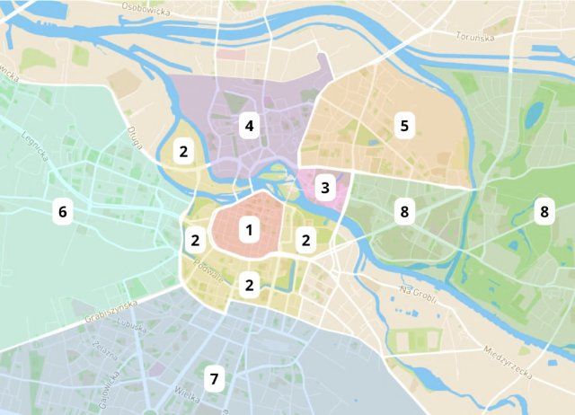{ width="200" }
- Type: Place
- Subjects: Geography

#### Connection (RelatedTo) - Ponts de Wrocław
De nombreux ponts traversent la rivière Odra à Wrocław.

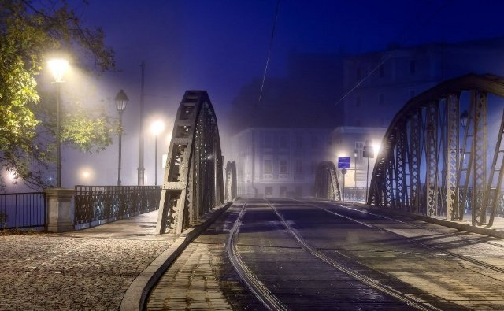{ width="200" }
- Type: Concept
- Subjects: Geography, Transportation, Community

#### Connection (RelatedTo) - Rivière Odra
Un grand fleuve de l'ouest de la Pologne. Il facilite la navigation et le commerce.

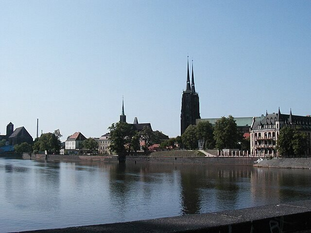{ width="200" }
- Type: Place
- Subjects: Geography, Environment

#### Connection (RelatedTo) - La Vistule (Wisła)
Le plus long fleuve de Pologne s'appelle Wisła ou Vistule. Il traverse Cracovie et Varsovie.

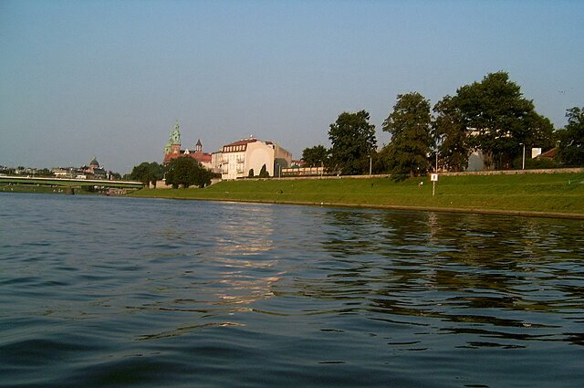{ width="200" }
- Type: Place
- Subjects: Geography, Environment

#### Connection (RelatedTo) - Panorama de Racławicka
Un tableau géant tout autour de vous sur une bataille historique.

{ width="200" }
- Type: Place
- Subjects: History, Art, Culture

#### Connection (RelatedTo) - Mairie
Le lieu où les dirigeants de la ville travaillent et se rencontrent.

{ width="200" }
- Type: Place
- Subjects: Civics, Community, History

#### Connection (RelatedTo) - Wroclaw : Cathédrale
Une grande et importante église où l'on prie. On peut grimper au clocher pour admirer la vue.

{ width="200" }
- Type: Place
- Subjects: History, Culture

#### Connection (RelatedTo) - Salle du Centenaire
Le Centennial Hall est un immense bâtiment ressemblant à une grande tente avec un toit. Il est très haut. À l'intérieur, vous pouvez assister à différents spectacles, écouter des concerts ou regarder des matchs.

{ width="200" }
- Type: Place
- Subjects: Culture, Recreation

#### Connection (RelatedTo) - Nains de Wrocław
De petites statues à travers la ville qui aiment jouer des tours.

{ width="200" }
- Type: Concept
- Subjects: Culture, Community, History

#### Connection (RelatedTo) - Place du marché de Wrocław
La place principale de la vieille ville, pleine de vie.

{ width="200" }
- Type: Place
- Subjects: Geography, Culture, Community, History

#### Connection (RelatedTo) - Fontaine multimédia de Wrocław
De l'eau qui danse avec de la musique et des lumières colorées.

{ width="200" }
- Type: Place
- Subjects: Culture, Technology, Recreation

#### Connection (RelatedTo) - Ancien hôtel de ville (Wroclaw)
Un magnifique édifice gothique sur la place principale. Il possède une horloge célèbre.

{ width="200" }
- Type: Place
- Subjects: Geography, Environment

#### Connection (RelatedTo) - Wroclaw : Sky Tower
L'un des plus hauts bâtiments de Pologne. Il abrite des boutiques et un belvédère.

{ width="200" }
- Type: Place
- Subjects: Geography, Community, Culture

#### Connection (RelatedTo) - Zoo de Wrocław
Un grand zoo à Wrocław avec de nombreux animaux à découvrir.

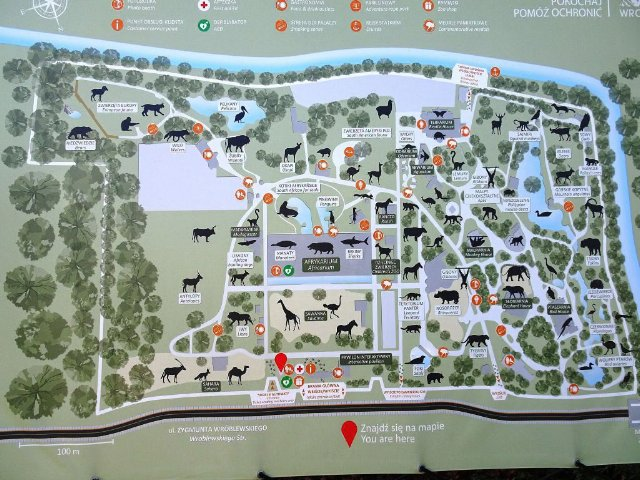{ width="200" }
- Type: Place
- Subjects: Geography, Education, Animal

#### Connection (RelatedTo) - Dalí - Profil du temps
Cette célèbre « horloge fondante » est une statue qui montre que le temps peut être flexible et tortueux, comme dans un rêve !

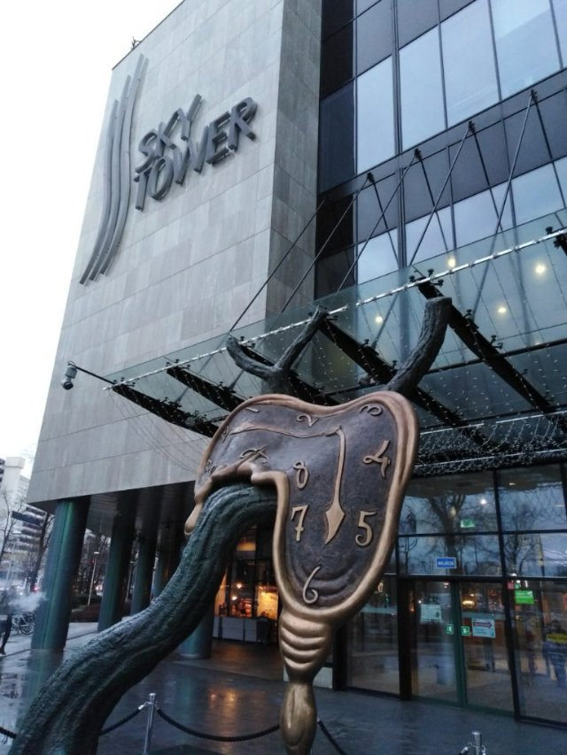{ width="200" }
- Type: Object
- Subjects: Art

### Wroclaw Dwarves {#wroclaw_dwarves}
[Open topic page](../../topics/index.md#wroclaw_dwarves)  

- Importance: Medium  
- Country: Poland  
- Target age: Ages6to10

#### Core Card - Nains de Wrocław
De petites statues à travers la ville qui aiment jouer des tours.

{ width="200" }
- Type: Concept
- Subjects: Culture, Community, History

#### Connection (RelatedTo) - Nain amoureux des animaux
Une statue de nain qui adore le zoo et les animaux.

{ width="200" }
- Type: Object
- Subjects: Culture, Animal, Education

#### Connection (RelatedTo) - Architecte nain
Un nain réfléchi qui aime les formes, les bâtiments et les conceptions ingénieuses.

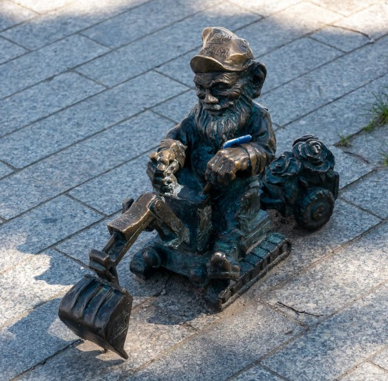{ width="200" }
- Type: Object
- Subjects: Culture

#### Connection (RelatedTo) - Évêque Nain
Une statue de nain qui pose une question sur l'église.

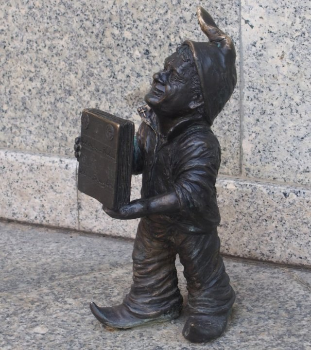{ width="200" }
- Type: Object
- Subjects: Culture, History

#### Connection (RelatedTo) - Nain chef d'orchestre
Un nain plein de vie qui aime l'eau, les lumières et la musique.

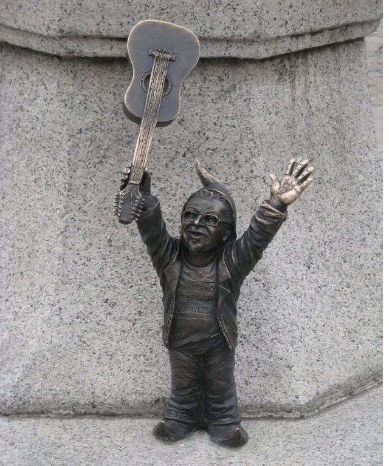{ width="200" }
- Type: Object
- Subjects: Culture

#### Connection (RelatedTo) - Conseiller Nain
Un nain officiel lié à l'ancien hôtel de ville et aux travaux municipaux.

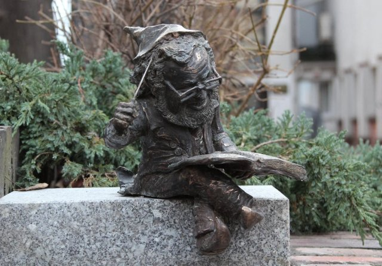{ width="200" }
- Type: Object
- Subjects: Culture

#### Connection (RelatedTo) - Expert nain
Un guide sympathique qui connaît tout sur les nains.

{ width="200" }
- Type: Object
- Subjects: Education, Culture

#### Connection (LocatedIn) - Maître des clés nain
Une statue de nain gardant l'ascenseur avec une grosse clé.

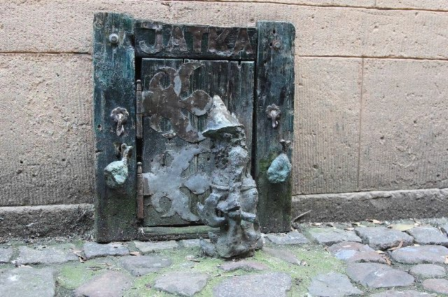{ width="200" }
- Type: Object
- Subjects: Culture

#### Connection (LocatedIn) - Origine Nain
Une statue classique de nain de Wroclaw, coiffé d'un chapeau pointu et chaussé de bottes robustes.

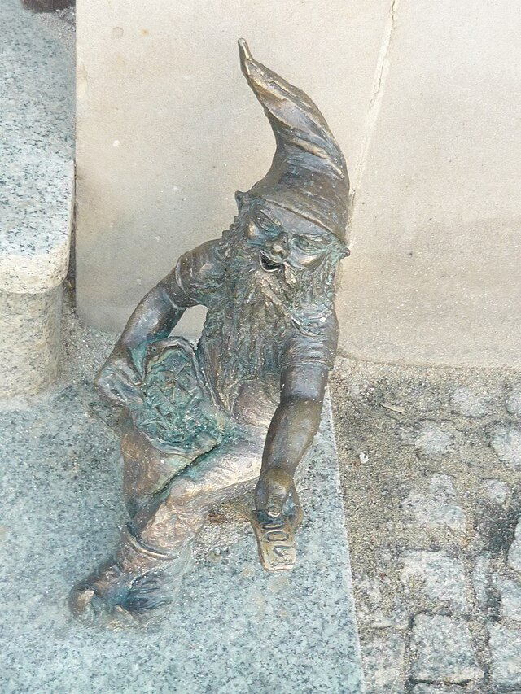{ width="200" }
- Type: Object
- Subjects: Culture

#### Connection (LocatedIn) - Nain peintre
Un nain artiste qui aime les couleurs, la peinture et les grands formats.

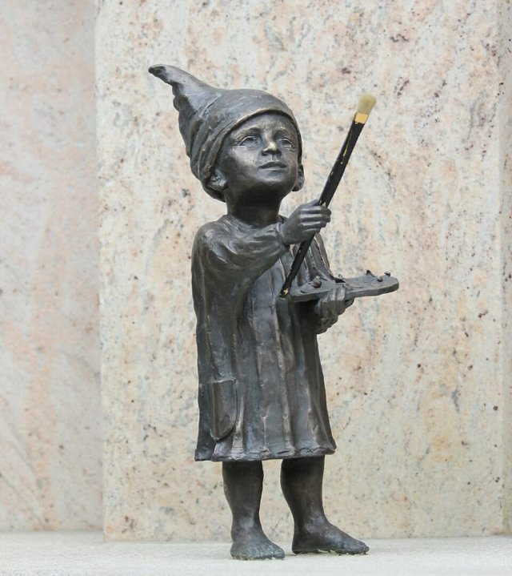{ width="200" }
- Type: Object
- Subjects: Culture

#### Connection (LocatedIn) - Nain voyageur
Un nain aventureux qui adore les endroits animés et les nouveaux chemins.

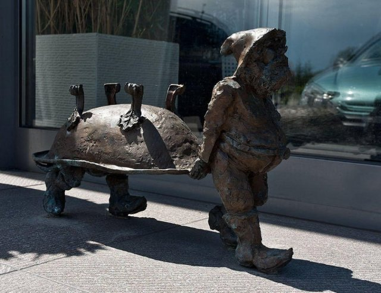{ width="200" }
- Type: Object
- Subjects: Culture

#### Connection (LocatedIn) - Écrivain nain
Un nain discret qui adore les histoires, les livres et la lecture.

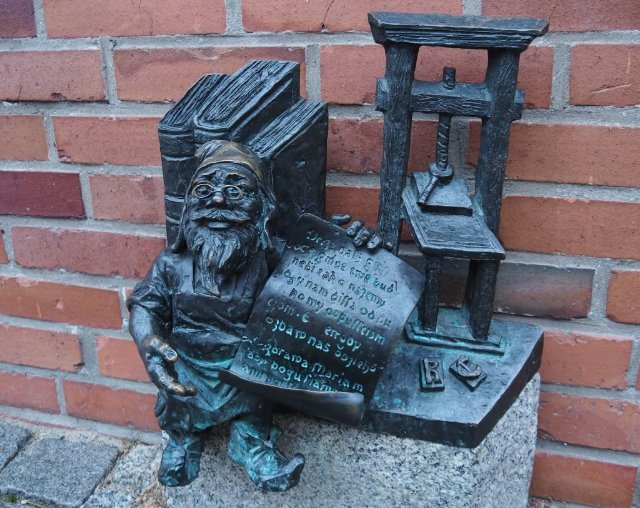{ width="200" }
- Type: Object
- Subjects: Culture

### Musical Notes {#musical_notes}
[Open topic page](../../topics/index.md#musical_notes)  

- Importance: Medium  
- Country: International  
- Target age: Ages6to10

#### Core Card - Gamme musicale
Les sept notes jouées dans l'ordre

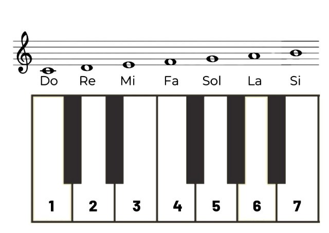{ width="200" }
- Type: Concept

#### Connection (RelatedTo) - Piano
Un instrument à clavier utilisé pour jouer des mélodies et des accords.

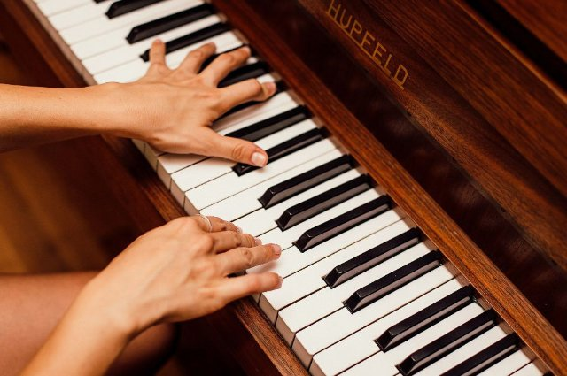{ width="200" }
- Type: Object
- Subjects: Music, Education

#### Connection (RelatedTo) - Do
Une note de musique.

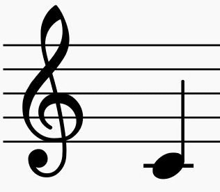{ width="200" }
- Type: Concept
- Subjects: Music, Education

#### Connection (RelatedTo) - Ré
Une note de musique.

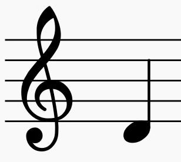{ width="200" }
- Type: Concept
- Subjects: Music, Education

#### Connection (RelatedTo) - Mi
Une note de musique.

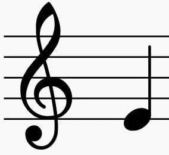{ width="200" }
- Type: Concept
- Subjects: Music, Education

#### Connection (RelatedTo) - Fa
Une note de musique.

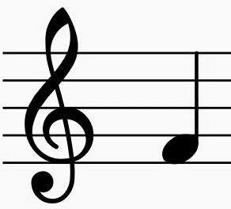{ width="200" }
- Type: Concept
- Subjects: Music, Education

#### Connection (RelatedTo) - Sol
Une note de musique.

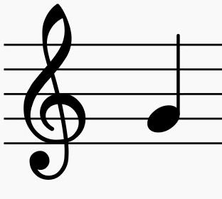{ width="200" }
- Type: Concept
- Subjects: Music, Education

#### Connection (RelatedTo) - La
Une note de musique.

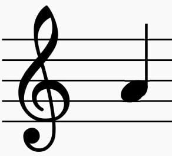{ width="200" }
- Type: Concept
- Subjects: Music, Education

#### Connection (RelatedTo) - Si
Une note de musique.

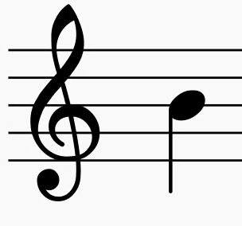{ width="200" }
- Type: Concept
- Subjects: Music, Education

#### Connection (RelatedTo) - Partition musicale
Les notes écrites et les paroles d'une chanson.

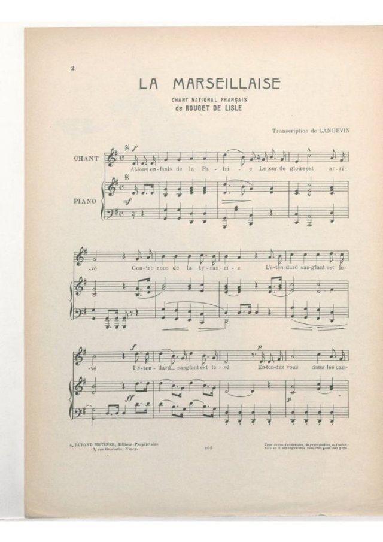{ width="200" }
- Type: Object
- Subjects: Education, Music

## Additional Cards
#### Nain polonais (gnomes de Wrocław)
De petites statues de nains se cachent un peu partout à Wrocław. Les trouver est un jeu de ville amusant.

{ width="200" }
- Type: Concept
- Subjects: Community, Culture
- Year: 1700

#### Olga Tokarczuk
Un célèbre écrivain polonais qui vit à Wrocław.

{ width="200" }
- Type: Person
- Subjects: Literature, Culture

#### Statue du nain de Wrocław
Une petite statue de la ville ; les nains sont le symbole de Wrocław.

{ width="200" }
- Type: Object
- Subjects: Culture, Community, History

#### École primaire Léonard de Vinci
C'est un lieu convivial où les enfants apprennent, créent et explorent guidés par la curiosité, l'art et la science.

{ width="200" }
- Type: Place
- Subjects: Education

#### Tram
Un train urbain qui circule sur des rails dans la rue.

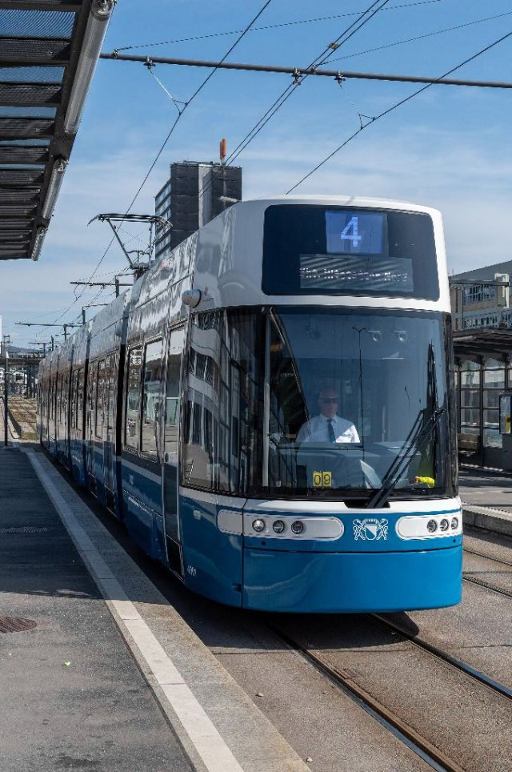{ width="200" }
- Type: Object
- Subjects: Transportation, Technology, Community

## Words
## Activities
- [JigsawPuzzle](../../activities/index.md#JigsawPuzzle)
- [CleanCanvas](../../activities/index.md#CleanCanvas)
- [CleanCanvas](../../activities/index.md#CleanCanvas)
- [Memory](../../activities/index.md#Memory)
- [JigsawPuzzle](../../activities/index.md#JigsawPuzzle)
- [Memory](../../activities/index.md#Memory)
- [JigsawPuzzle](../../activities/index.md#JigsawPuzzle)
- [Order](../../activities/index.md#Order)
- [CleanCanvas](../../activities/index.md#CleanCanvas)
- [Memory](../../activities/index.md#Memory)
- [Match](../../activities/index.md#Match)

## Tasks
- [Collect] dwarf_0
- [Collect] dwarf_1
- [Collect] dwarf_2
- [Collect] dwarf_3
- [Collect] dwarf_4
- [Collect] dwarf_5
- [Collect] dwarf_6
- [Collect] dwarf_7
- [Collect] dwarf_8
- [Collect] dwarf_9
- [Collect] dwarf_10
## Credits
- [Jan Stasienko](mailto:jan.stasienko@dsw.edu.pl) (Poland) (content)
- Lorenzo Castrovilli (Italy) (content, design)
- [Stefano Cecere](https://stefanocecere.com) (Italy) (development)
