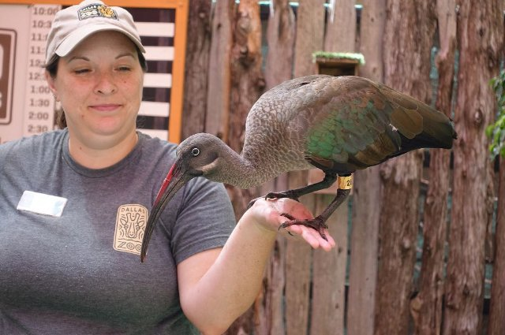
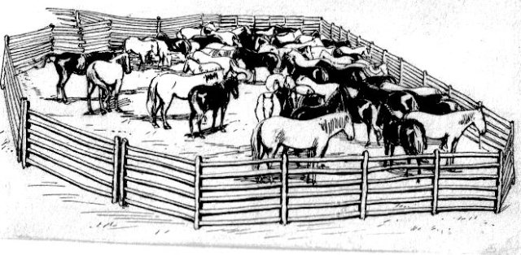
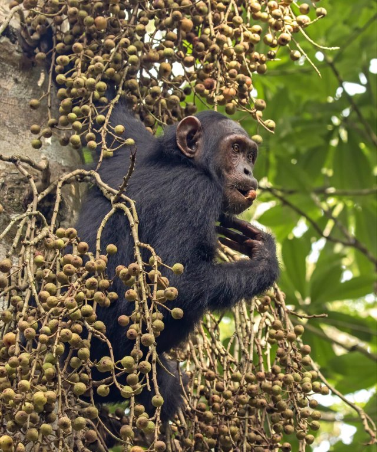

# Le zoo (pl_04)
> [!note] Educators & Designers: help improving this quest!
> **Comments and feedback**: [discuss in the Forum](https://antura.discourse.group/t/pl-04-the-zoo/35/1)  
> **Improve script translations**: [comment the Google Sheet](https://docs.google.com/spreadsheets/d/1FPFOy8CHor5ArSg57xMuPAG7WM27-ecDOiU-OmtHgjw/edit?gid=819047762#gid=819047762)  
> **Improve Cards translations**: [comment the Google Sheet](https://docs.google.com/spreadsheets/d/1M3uOeqkbE4uyDs5us5vO-nAFT8Aq0LGBxjjT_CSScWw/edit?gid=415931977#gid=415931977)  
> **Improve the script**: [propose an edit here](https://github.com/vgwb/Antura/blob/main/Assets/_discover/_quests/PL_04%20Zoo/PL_04%20Zoo%20-%20Yarn%20Script.yarn)  

- Version: 1.00
- Status: Production
- Location: Poland - Wrocław

- Difficulty: Normal
- Duration (min): 20
- Kind:
  - Journey
- Description: Explorez le célèbre zoo de Wrocław

## Design Notes

**Core Subject:** Animals, Logic, and Local Landmarks.

**Player Objectives:**

1. **Detective Work:** The Zoo Director tasks the player with finding the missing **Wrocław Flag**, which disappeared from the famous **Iglica** sculpture.
2. **Suspect Interviews:** The player must visit five animal suspects (Monkey, Lion, Giraffe, Elephant, Penguin) to investigate.
3. **Mini-Games:** To clear each animal's name, the player completes a specific mini-game (e.g., matching fruit for the Monkey, ordering the Lion's growth stages).
4. **Deduction:** After proving all animals are innocent (e.g., the Penguin can't fly, the Giraffe isn't tall enough), the mystery narrows down.
5. **Resolution:** The true culprit is revealed to be **Antura** , who was playing with the flag. The player returns the flag to the Iglica.

**Educational Content:**

- **Local Landmarks:** Features the **Centennial Hall** (UNESCO site) and the **Iglica** (Needle) sculpture.
- **Animal Facts:** Teaches key traits: Giraffes are tall, Elephants have memory, Lions live in prides, Penguins swim but don't fly.
- **Vocabulary:** Focuses on animal names and related terms (_Chimpanzee, Mane, Neck, Ice, Swim_).

**Mission**

The player must act as a detective to find the missing flag of Wrocław. The core gameplay involves visiting five different animal enclosures at the ZOO. To clear each animal as a suspect, the player must complete a unique, themed mini-game. After eliminating all animal suspects, the true culprit is revealed, and the player must retrieve the flag and return it to its rightful place.

**Character**

The ZOO Director: The character who gives the mission and provides information.
The Animals: An Elephant, a Giraffe, a Lion, a Monkey, and a Penguin, each with their own personality and mini-game.

### Knowledge content

**Famous Landmarks:**

- To recognize the Centennial Hall (a UNESCO World Heritage site),
- the Iglica sculpture
- the Wrocław ZOO

**Animal Vocabulary & Facts:**

To learn the names of five animals and a fun fact about each, such as:

- Elephants have excellent memories, Pachyderm = thick Skin, Largest land animal
- Giraffes are the world's tallest mammals.
- Lions are close relatives of cats that live in groups called prides.
- Monkeys are excellent climbers.
- Penguins are birds that do not fly, but they are expert swimmers.

## Topics
### Zoo Animals {#zoo}
[Open topic page](../../topics/index.md#zoo)  

- Importance: Medium  
- Country: International  
- Target age: Ages6to10  
- Subjects: Animal

#### Core Card - Animaux du zoo
Carte créée automatiquement pour le thème « Animaux du zoo ».

{ width="200" }
- Type: None

#### Connection (RelatedTo): Auto from remaining cards - Girafe
Un animal très grand avec un long cou. Les girafes sont plus hautes que les arbres ! Elles mangent des feuilles inaccessibles aux autres animaux.

{ width="200" }
- Rationale: Giraffes are fascinating animals that show kids how nature adapts to find food
- Type: Object
- Subjects: Animal, Environment

#### Connection (RelatedTo) - Lion
Un grand félin surnommé le roi des animaux. Il vit en groupes appelés troupes.

{ width="200" }
- Type: Object
- Subjects: Animal, Environment

#### Connection (RelatedTo) - Singe
Un animal intelligent qui peut grimper et jouer. Certains singes vivent en grandes familles.

{ width="200" }
- Type: Object
- Subjects: Animal, Environment

#### Connection (RelatedTo) - Manchot
Un oiseau qui ne peut pas voler mais qui nage très bien. Il vit dans les régions froides.

{ width="200" }
- Type: Object
- Subjects: Animal, Environment

#### Connection (RelatedTo): Previous core card - Éléphant
Un gros animal avec une trompe. Les éléphants sont les plus grands animaux terrestres. Ils ont de grandes oreilles et adorent arroser !

{ width="200" }
- Rationale: Elephants are amazing animals that kids love learning about at the zoo!
- Type: Object
- Subjects: Animal, Environment
- Words: elephant, zoo

### wroclaw zoo {#wroclaw_zoo}
[Open topic page](../../topics/index.md#wroclaw_zoo)  

- Importance: Medium  
- Country: Poland  
- Target age: Ages6to10

#### Core Card - Zoo de Wrocław
Un grand zoo à Wrocław avec de nombreux animaux à découvrir.

{ width="200" }
- Type: Place
- Subjects: Geography, Education, Animal

#### Connection (RelatedTo) - Gardien de zoo
Une personne qui s'occupe des animaux au zoo.

{ width="200" }
- Type: Person
- Subjects: Community, Animal, Education

#### Connection (RelatedTo) - Enclos pour animaux
Un espace sûr conçu pour que les animaux puissent vivre au zoo.

{ width="200" }
- Type: Place
- Subjects: Animal, Safety

#### Connection (RelatedTo) - Directeur du zoo
La personne qui dirige le zoo et aide les visiteurs.

{ width="200" }
- Type: Person
- Subjects: Community, Education

## Additional Cards
#### Louveteau
Un bébé lion.

{ width="200" }
- Type: Concept
- Subjects: Animal, Science

#### Église
Une grande sculpture en métal à côté du Centennial Hall.

{ width="200" }
- Type: Place
- Subjects: History, Culture

#### Perroquet
Un oiseau brillant qui peut copier des sons.

{ width="200" }
- Type: Object
- Subjects: Animal, Science

#### Paon
Un oiseau coloré avec une grande queue de plumes.

{ width="200" }
- Type: Object
- Subjects: Animal, Science, Art

#### Signe
Un tableau avec des faits simples pour vous aider à apprendre.

{ width="200" }
- Type: Object
- Subjects: Education, Community

#### Wrocław
Une ville de Pologne avec des rivières, des ponts et de l'histoire.

{ width="200" }
- Type: Place
- Subjects: Geography, History, Culture

#### Drapeau de Wrocław
Le drapeau de la ville qu'il faut retrouver et restituer.

{ width="200" }
- Type: Object
- Subjects: Culture, Community, History

#### Chimpanzé
Intelligent et joueur, il adore grimper aux arbres. Il utilise des bâtons et des pierres comme de petits outils !

{ width="200" }
- Type: None

#### Lionceau
Un petit lion à la fourrure douce et aux grandes pattes. Il passe ses journées à jouer et à rugir doucement.

{ width="200" }
- Type: Object

#### Jeune lion mâle
Devenant fort avec une crinière courte, il apprend à chasser et à protéger sa fierté.

{ width="200" }
- Type: Object

#### Pomme
Rouge, rond et croquant sous la dent. Un fruit savoureux qui vous garde en forme !

{ width="200" }
- Type: Object

#### Banane
Moelleux, jaunes et faciles à peler. Plein d'énergie pour la journée !

{ width="200" }
- Type: Object

#### glace arctique
Froid, blanc et brillant comme du verre. Un refuge pour les phoques, les ours et l'aventure !

{ width="200" }
- Type: Place

#### Plant de pommiers
Un arbre aux fleurs roses et aux fruits rouges savoureux. Il adore le soleil et nous offre des pommes croquantes !

{ width="200" }
- Type: Object

#### Bananier
Une grande plante aux feuilles géantes et aux bananes jaunes. Ses fruits poussent en grappes pendantes !

{ width="200" }
- Type: Object

#### Plante orange
Un arbre vert brillant aux oranges rondes et juteuses. Son parfum frais et sucré rappelle celui du soleil !

{ width="200" }
- Type: Object

#### Plante d'acacia
Une plante couverte de minuscules fleurs dorées. Elle illumine la terre de sa lueur jaune !

{ width="200" }
- Type: Object

## Quest Script

[See the full script here](./pl_04-script.md)

## Words
## Activities
- [Memory](../../activities/index.md#Memory)
- [CleanCanvas](../../activities/index.md#CleanCanvas)
- [Order](../../activities/index.md#Order)
- [Match](../../activities/index.md#Match)
- [JigsawPuzzle](../../activities/index.md#JigsawPuzzle)
- [JigsawPuzzle](../../activities/index.md#JigsawPuzzle)
- [Memory](../../activities/index.md#Memory)
- [CleanCanvas](../../activities/index.md#CleanCanvas)
- [Order](../../activities/index.md#Order)
- [JigsawPuzzle](../../activities/index.md#JigsawPuzzle)
- [Match](../../activities/index.md#Match)

## Tasks
- [Collect] TASK_ANIMALS
- [Interact] back_to_director
## Credits
- [Jan Stasienko](mailto:jan.stasienko@dsw.edu.pl) (Poland) (content)
- Lorenzo Castrovilli (Italy) (design)
- [Stefano Cecere](https://stefanocecere.com) (Italy) (development)
- Valeria Passarella (Italy) (design)
- Vieri Toti (Italy) (design)
