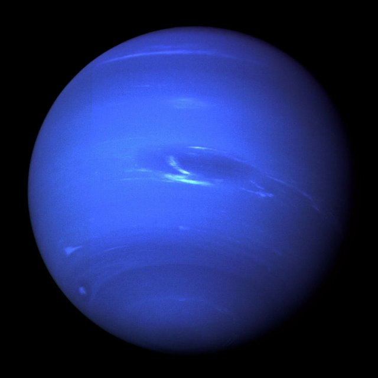
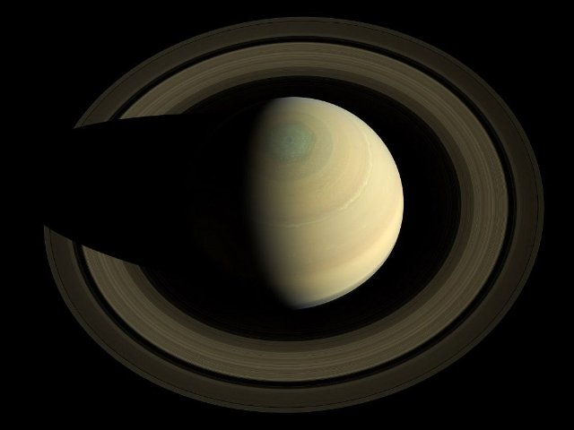

# Copernic et le système solaire (pl_07)
> [!note] Educators & Designers: help improving this quest!
> **Comments and feedback**: [discuss in the Forum](https://antura.discourse.group/t/pl-07-copernicus-and-the-solar-system/38/1)  
> **Improve script translations**: [comment the Google Sheet](https://docs.google.com/spreadsheets/d/1FPFOy8CHor5ArSg57xMuPAG7WM27-ecDOiU-OmtHgjw/edit?gid=783699917#gid=783699917)  
> **Improve Cards translations**: [comment the Google Sheet](https://docs.google.com/spreadsheets/d/1M3uOeqkbE4uyDs5us5vO-nAFT8Aq0LGBxjjT_CSScWw/edit?gid=415931977#gid=415931977)  
> **Improve the script**: [propose an edit here](https://github.com/vgwb/Antura/blob/main/Assets/_discover/_quests/PL_07%20Solar%20System/PL_07%20Solar%20System%20-%20Yarn%20Script.yarn)  

- Version: 1.00
- Status: NeedsReview
- Location: Poland - Toruń

- Difficulty: Normal
- Duration (min): 10
- Description: Découvrez qui était Nicolas Copernic et les 8 planètes du système solaire

## Design Notes
## Game Design Notes
**Mission**  
discover who Nicolaus Copernicus was and how he revolutionised science.
And did you know he was from poland?

### Knowledge
Nicolaus Copernicus and the life of a scientist in the renaissance  

- How does the telescope work?
- The 8 planets of the solar system and their names and order

### Flow
You arrive in Toruń, meeting the guide who welcomes you. He says that apparently Antura got stuck in Nicolaus Copernicus’ house and we need to help him. To do that, you first talk with Nicolaus Kopernik outside of his house – he introduces himself and says that he will help you if you help him first. He says that there is a map of a solar system that needs fixing.  
He asks you to put the planets in the correct order (ACTIVITY ORDER).  
When you do, he explains how people used to think that Earth was in the center of it and how he created the model of the Solar System that has the Sun in the center. You go with him inside of the house looking for Antura. You follow his trail and pass a telescope.  
Copernicus explains what that is and mentions what a planetarium is as well. Eventually you find Antura and take him out of there. Copernicus says he’s glad everything is okay and tells you about himself, who he is, what he’s known for.

## Topics
### Solar System {#solar_system}
[Open topic page](../../topics/index.md#solar_system)  

- Importance: High  
- Country: International  
- Target age: Ages6to10  
- Subjects: Science

#### Core Card - Système solaire
Le Soleil et les huit planètes qui tournent autour de lui.

{ width="200" }
- Type: Concept
- Subjects: Space, Science

#### Connection (RelatedTo) - Mercure
La planète la plus proche du Soleil ; petite et très rapide.

{ width="200" }
- Type: Object
- Subjects: Space, Science

#### Connection (RelatedTo) - Mars
La planète rouge avec de la poussière et de grands volcans.

{ width="200" }
- Type: Object
- Subjects: Space, Science

#### Connection (RelatedTo) - Jupiter
La plus grande planète, célèbre pour la Grande Tache Rouge.

{ width="200" }
- Type: Object
- Subjects: Space, Science

#### Connection (RelatedTo) - Neptune
Le dieu de la mer des vieilles histoires.

{ width="200" }
- Type: Concept
- Subjects: Culture, History

#### Connection (RelatedTo) - Vénus
Une planète très chaude recouverte de nuages ​​épais.

{ width="200" }
- Type: Object
- Subjects: Space, Science

#### Connection (RelatedTo) - Modèle héliocentrique
L'idée que le Soleil est au centre et que les planètes tournent autour de lui.

{ width="200" }
- Type: Concept
- Subjects: Science, Space, History

#### Connection (RelatedTo) - Astronomie
La science qui étudie le Soleil, la Lune, les étoiles et les planètes.

{ width="200" }
- Type: Concept
- Subjects: Science, Space

#### Connection (RelatedTo) - Saturne
Une planète géante avec des anneaux brillants et de nombreuses lunes.

{ width="200" }
- Type: Object
- Subjects: Space, Science

#### Connection (RelatedTo) - Planétarium
Un endroit où vous pouvez voir le ciel et les étoiles à l'intérieur.

{ width="200" }
- Type: Place
- Subjects: Education, Science, Space

#### Connection (RelatedTo) - Terre
Notre planète natale avec terre, air et eau.

{ width="200" }
- Type: Object
- Subjects: Space, Science, Geography, Environment

#### Connection (RelatedTo) - Uranus
Une planète bleu-vert qui tourne sur le côté.

{ width="200" }
- Type: Object
- Subjects: Space, Science

### Telescope {#telescope}
[Open topic page](../../topics/index.md#telescope)  

- Importance: Medium  
- Country: International  
- Target age: Ages6to10  
- Subjects: Science

#### Core Card - Télescope
Un outil qui nous aide à voir des choses lointaines dans le ciel.

{ width="200" }
- Type: Object
- Subjects: Science, Technology, Space

#### Connection (RelatedTo) - Nicolas Copernic
Un brillant scientifique polonais a découvert que la Terre tourne autour du Soleil, et non l'inverse ! Cela a révolutionné notre compréhension de l'espace.

{ width="200" }
- Rationale: Copernicus teaches kids about scientific discovery and Polish contributions to astronomy
- Type: Person
- Subjects: Science, History, Space
- Year: 1473

#### Connection (RelatedTo) - Oculaire
La petite lentille à travers laquelle vous regardez sur un télescope.

{ width="200" }
- Type: Object
- Subjects: Science, Technology

#### Connection (RelatedTo) - Lentille
Un morceau de verre ou de plastique transparent qui courbe la lumière.

{ width="200" }
- Type: Object
- Subjects: Science, Technology

#### Connection (RelatedTo) - Planétarium
Un endroit où vous pouvez voir le ciel et les étoiles à l'intérieur.

{ width="200" }
- Type: Place
- Subjects: Education, Science, Space

## Additional Cards
#### Maison de Nicolas Copernic
C'est aujourd'hui un musée où vous pourrez en apprendre davantage sur sa vie et ses réalisations scientifiques.

{ width="200" }
- Type: Place
- Subjects: Culture, Science

#### Toruń
Une ville de Pologne où est né Nicolas Copernic.

{ width="200" }
- Type: Place
- Subjects: Geography, History, Culture

## Quest Script

[See the full script here](./pl_07-script.md)

## Words
## Activities
- (none)

## Tasks
- (none)
## Credits
- [Jan Stasienko](mailto:jan.stasienko@dsw.edu.pl) (Poland) (content)
- [Stefano Cecere](https://stefanocecere.com) (Italy) (development)
