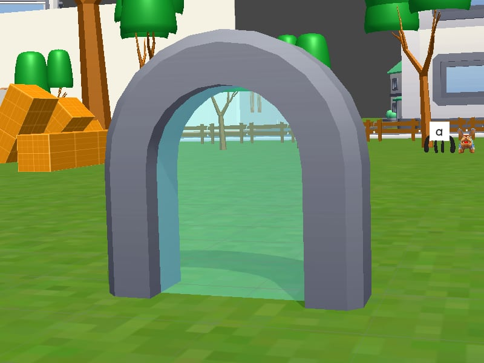

# Tutoriel (tutorial)
> [!note] Educators & Designers: help improving this quest!
> **Comments and feedback**: [discuss in the Forum](https://antura.discourse.group/t/quest-tutorial/41)  
> **Improve script translations**: [comment the Google Sheet](https://docs.google.com/spreadsheets/d/1FPFOy8CHor5ArSg57xMuPAG7WM27-ecDOiU-OmtHgjw/edit?gid=631129787#gid=631129787)  
> **Improve Cards translations**: [comment the Google Sheet](https://docs.google.com/spreadsheets/d/1M3uOeqkbE4uyDs5us5vO-nAFT8Aq0LGBxjjT_CSScWw/edit?gid=415931977#gid=415931977)  
> **Improve the script**: [propose an edit here](https://github.com/vgwb/Antura/blob/main/Assets/_discover/_quests/_TUTORIAL/Tutorial%20-%20Yarn%20Script.yarn)  

- Version: 1.00
- Status: Production
- Location: International

- Difficulty: Tutorial
- Duration (min): 10
- Description: Apprenons à jouer à Antura Discover !

## Topics
### Antura's world {#antura-world}
[Open topic page](../../topics/index.md#antura-world)  

- Importance: Medium  
- Country: International  
- Target age: Ages6to10

#### Core Card - Antura
Le personnage principal de ce jeu vidéo

{ width="200" }
- Type: Concept

#### Connection (RelatedTo) - Cookies
De superbes récompenses à collectionner en jouant ! Utilisez-les pour obtenir de nouveaux objets et des surprises.

{ width="200" }
- Type: Object

#### Connection (RelatedTo) - Portail
Une porte magique qui vous mène vers de nouveaux horizons. Entrez et découvrez où elle vous mène !

{ width="200" }
- Type: Object

#### Connection (RelatedTo) - Cartes
Chaque carte a quelque chose de spécial à apprendre. Trouvez-les toutes et lisez-les !

{ width="200" }
- Type: Concept

#### Connection (RelatedTo) - Chat
Le meilleur ami et compagnon de voyage d'Antura. Curieux, intelligent et toujours prêt à aider !

{ width="200" }
- Type: Concept

#### Connection (RelatedTo) - Lettre vivante
Une lettre sympathique qui aime parler et jouer ! Parlez-lui pour apprendre de nouveaux mots.

{ width="200" }
- Type: Concept

#### Connection (RelatedTo) - En blocs
Ces drôles de personnages vivent dans ce monde.
Parlez-leur à tous… ils ont des histoires à raconter !

{ width="200" }
- Type: Concept

#### Connection (RelatedTo) - Portail
Une porte magique qui vous mène vers de nouveaux horizons. Entrez et découvrez où elle vous mène !

{ width="200" }
- Type: Object

#### Connection (RelatedTo) - Danger
À éviter absolument ! Soyez prudents et protégez-vous.

{ width="200" }
- Type: Concept

## Quest Script

[See the full script here](./tutorial-script.md)

## Words
## Activities
- [CleanCanvas](../../activities/index.md#CleanCanvas)
- [JigsawPuzzle](../../activities/index.md#JigsawPuzzle)
- [Match](../../activities/index.md#Match)
- [Memory](../../activities/index.md#Memory)
- [MoneyCount](../../activities/index.md#MoneyCount)
- [Order](../../activities/index.md#Order)

## Tasks
- [Collect] talk_everybody
- [Interact] open_chest
## Credits
- Fabio Cecere (Italy) (design, development)
- [Stefano Cecere](https://stefanocecere.com) (Italy) (design, development)
