# Topics

Total found: **34**

> [!note] NOTE: connections type can be:
> **Created By** (agent (person/org) who made/discovered/commissioned)  
> **Located In**       (where it is/was)  
> **Is A**             (type/category relation (Baguette is a Bread))  
> **Part Of**         (whole/part relation (Crust is part of Baguette))  
> **Made Of**          (physical composition)  
> **Time Context**     (period/event/date)  
> **Cultural Context** (origin/tradition/symbolism)  
> **Causal**           (clear cause→effect)  
> **Purpose**          (used for…)  
> **Compare**          (compare/Kind similar/contrast/analogy)  
> **Related To**     (whatever else, last choice...)  

## International

### Elementary Math
- Description: Numbers and shapes for everyday life: counting, adding and subtracting, simple fractions, measuring, telling time, and using money.  
- Importance: Medium  
- Subjects: Math  
- Target Age: Ages6to10
- Core card:
    - **[Eleementary Maths](../cards/index.md#elementary_maths)**
    Numbers and shapes for everyday life: counting, adding and subtracting, simple fractions, measuring, telling time, and using money.

- Connected cards:
    - **[Doubler](../cards/index.md#fr_figure_line)** (PartOf)
    Une ligne droite reliant un point à un autre. Les lignes peuvent être longues ou courtes.

    { width="200" }

    - **[Triangle](../cards/index.md#fr_figure_triangle)** (PartOf)
    Une forme à trois côtés droits et trois coins. Les triangles ressemblent à des parts de pizza !

    { width="200" }

    - **[Boussole](../cards/index.md#math_compass)** (Purpose)
    Un outil qui permet de dessiner des cercles parfaits. Il possède deux branches, comme des ciseaux.

    { width="200" }

    - **[Règle](../cards/index.md#math_ruler)** (Purpose)
    Un outil droit utilisé pour mesurer la longueur des objets. Les règles comportent des chiffres et des lignes.

    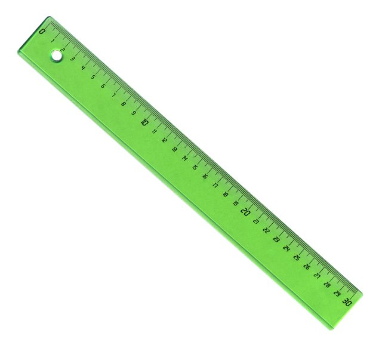{ width="200" }

    - **[Carré](../cards/index.md#math_setsquare)** (Purpose)
    Un outil en forme de triangle utilisé pour dessiner des lignes droites et des angles droits en mathématiques.

    { width="200" }

    - **[Cercle](../cards/index.md#fr_figure_circle)** (PartOf)
    Une forme ronde sans coins. Les cercles ressemblent à des roues, des boules et des pièces de monnaie !

    { width="200" }

- Quests: [Le système scolaire (fr_02)](../quest/fr_02.md)

Credits:
  - Valeria Passarella (Italy)
  - [Stefano Cecere](https://stefanocecere.com) (Italy)

---

### Fisherman
- Importance: Medium  
- Target Age: Ages6to10
- Core card:
    - **[Pêcheur](../cards/index.md#fisherman)**
    Une personne qui attrape du poisson en mer.

    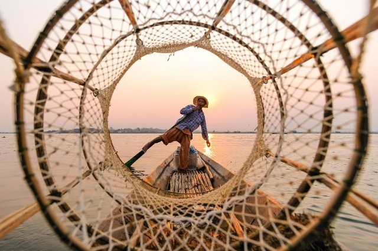{ width="200" }

- Connected cards:
    - **[Port](../cards/index.md#port)** (LocatedIn)
    Un endroit où les navires chargent et déchargent.

    { width="200" }

    - **[Flots](../cards/index.md#waves)** (RelatedTo)
    Eau en mouvement sur la mer.

    { width="200" }

    - **[Navigation](../cards/index.md#navigation)** (RelatedTo)
    Trouver son chemin en mer à l'aide de lumières, de cartes et d'outils.

    { width="200" }

    - **[Filet de pêche](../cards/index.md#fishing_net)** (Purpose)
    Un filet utilisé pour attraper du poisson.

    { width="200" }

    - **[Bateau](../cards/index.md#ship)** (RelatedTo)
    Un grand bateau qui transporte des personnes ou des marchandises.

    { width="200" }

---

### Flags of Europe
- Importance: Medium  
- Target Age: Ages6to10
- Core card:
    - **[Carte de l'Europe](../cards/index.md#concept_europe_map)**
    Une carte montrant tous les pays d'Europe. Vous pouvez voir où se trouvent la France, la Pologne, l'Allemagne et d'autres pays.

    { width="200" }

- Connected cards:
    - **[Drapeau de l'Allemagne](../cards/index.md#flag_germany)** (CulturalContext)
    Le drapeau allemand comporte trois bandes horizontales : noire, rouge et jaune. L'Allemagne est célèbre pour ses voitures, ses châteaux et ses contes de fées !

    { width="200" }

    - **[Drapeau de l'Italie](../cards/index.md#flag_italy)** (CulturalContext)
    Le drapeau italien comporte trois bandes verticales : verte, blanche et rouge. Ces couleurs rappellent le basilic, la mozzarella et les tomates sur une pizza !

    { width="200" }

    - **[Drapeau du Luxembourg](../cards/index.md#flag_luxembourg)** (CulturalContext)
    Le drapeau luxembourgeois est composé de bandes horizontales rouges, blanches et bleu clair. Le Luxembourg est un tout petit pays qui parle trois langues !

    { width="200" }

    - **[Drapeau de Monaco](../cards/index.md#flag_monaco)** (CulturalContext)
    Le drapeau de Monaco est composé de bandes horizontales rouges et blanches. Monaco est une petite ville, mais célèbre pour ses voitures de luxe et ses palais royaux en bord de mer !

    { width="200" }

    - **[Drapeau de la Belgique](../cards/index.md#flag_belgium)** (CulturalContext)
    Le drapeau belge comporte trois bandes verticales : noire, jaune et rouge. La Belgique est célèbre pour son chocolat et ses gaufres !

    { width="200" }

    - **[Drapeau de l'Espagne](../cards/index.md#flag_spain)** (CulturalContext)
    Le drapeau espagnol est orné de bandes horizontales rouges et jaunes. Ces couleurs évoquent le soleil et les poivrons ! L'Espagne a inventé le flamenco.

    { width="200" }

    - **[Drapeau de la Suisse](../cards/index.md#flag_switzerland)** (CulturalContext)
    Le drapeau suisse est rouge avec une croix blanche au milieu. On dirait une trousse de premiers secours ! La Suisse est célèbre pour ses montagnes et son fromage.

    { width="200" }

    - **[Drapeau de la France](../cards/index.md#flag_france)** (CulturalContext)
    Le drapeau français comporte trois bandes verticales : bleu, blanc et rouge. Ces couleurs représentent la liberté, l'égalité et la fraternité !

    { width="200" }

    - **[Flag of Czech Republic](../cards/index.md#flag_czech_republic)** (CulturalContext)
    The flag has white and red stripes with a blue triangle. The Czech Republic is famous for beautiful Prague castle and crystal glass.

    { width="200" }

    - **[Drapeau de la Slovaquie](../cards/index.md#flag_slovakia)** (CulturalContext)
    Un drapeau aux couleurs blanche, bleue et rouge. Il représente la Slovaquie.

    { width="200" }

    - **[Drapeau de l'Ukraine](../cards/index.md#flag_ukraine)** (CulturalContext)
    Un drapeau bleu et jaune, comme le ciel et le soleil. Il représente l'Ukraine.

    { width="200" }

- Quests: [Les voisins de la France (fr_00)](../quest/fr_00.md), [Les voisins de la Pologne (pl_00)](../quest/pl_00.md)

---

### mountain activities
- Importance: Medium  
- Target Age: Ages6to10
- Core card:
    - **[Montagne](../cards/index.md#mountain)**
    Les piliers de la terre

    { width="200" }

- Connected cards:
    - **[Guide de montagne](../cards/index.md#mountain_guide)** (RelatedTo)
    Une personne qui aide les gens à grimper en toute sécurité.

    { width="200" }

    - **[Randonnée](../cards/index.md#hiking)** (RelatedTo)
    Promenade sur des sentiers en pleine nature.

    { width="200" }

    - **[Escalade](../cards/index.md#climbing)** (RelatedTo)
    Escalader des rochers ou de la glace avec un équipement spécial.

    { width="200" }

    - **[Ski](../cards/index.md#skiing)** (RelatedTo)
    Glisser sur la neige avec des skis.

    { width="200" }

- Quests: [Mont Blanc et montagnes (fr_08)](../quest/fr_08.md)

---

### mountain tools
- Description: what we need to stay ssafe in the mountain  
- Importance: Medium  
- Target Age: Ages6to10
- Core card:
    - **[Montagne](../cards/index.md#mountain)**
    Les piliers de la terre

    { width="200" }

- Connected cards:
    - **[Gants](../cards/index.md#gloves)** (RelatedTo)
    Des couvertures chaudes pour vos mains.

    { width="200" }

    - **[Chapeau](../cards/index.md#hat)** (RelatedTo)
    Un bonnet chaud pour votre tête.

    { width="200" }

    - **[Sac à dos](../cards/index.md#backpack)** (RelatedTo)
    Un sac que vous portez sur votre dos.

    { width="200" }

    - **[Corde](../cards/index.md#rope)** (RelatedTo)
    Une ligne solide utilisée pour la sécurité lors de l'escalade.

    { width="200" }

    - **[Crampons](../cards/index.md#crampons)** (RelatedTo)
    Poignées métalliques pointues que vous attachez aux bottes pour la glace.

    { width="200" }

    - **[Foulard](../cards/index.md#scarf)** (RelatedTo)
    Un tissu chaud que vous portez autour du cou.

    { width="200" }

    - **[Lunettes de soleil](../cards/index.md#sunglasses)** (RelatedTo)
    Des lunettes qui protègent vos yeux de la lumière vive.

    { width="200" }

- Quests: [Mont Blanc et montagnes (fr_08)](../quest/fr_08.md)

---

### Musical Notes
- Importance: Medium  
- Target Age: Ages6to10
- Core card:
    - **[Partition musicale](../cards/index.md#musical_score)**
    Les notes écrites et les paroles d'une chanson.

    { width="200" }

- Connected cards:
    - **[Piano](../cards/index.md#piano)** (RelatedTo)
    Un instrument à clavier utilisé pour jouer des mélodies et des accords.

    { width="200" }

    - **[La](../cards/index.md#note_la)** (RelatedTo)
    Une note de musique.

    { width="200" }

    - **[Fa](../cards/index.md#note_fa)** (RelatedTo)
    Une note de musique.

    { width="200" }

    - **[Si](../cards/index.md#note_si)** (RelatedTo)
    Une note de musique.

    { width="200" }

    - **[Sol](../cards/index.md#note_sol)** (RelatedTo)
    Une note de musique.

    { width="200" }

    - **[Ut](../cards/index.md#note_do)** (RelatedTo)
    Une note de musique.

    { width="200" }

    - **[Mi](../cards/index.md#note_mi)** (RelatedTo)
    Une note de musique.

    { width="200" }

    - **[Concernant](../cards/index.md#note_re)** (RelatedTo)
    Une note de musique.

    { width="200" }

- Quests: [La Marseillaise (fr_11)](../quest/fr_11.md)

---

### Solar System
- Importance: High  
- Subjects: Science  
- Target Age: Ages6to10
- Core card:
    - **[Système solaire](../cards/index.md#solar_system)**
    Le Soleil et les huit planètes qui tournent autour de lui.

    { width="200" }

- Connected cards:
    - **[Mercure](../cards/index.md#mercury)** (RelatedTo)
    La planète la plus proche du Soleil ; petite et très rapide.

    { width="200" }

    - **[Mars](../cards/index.md#mars)** (RelatedTo)
    La planète rouge avec de la poussière et de grands volcans.

    { width="200" }

    - **[Jupiter](../cards/index.md#jupiter)** (RelatedTo)
    La plus grande planète, célèbre pour la Grande Tache Rouge.

    { width="200" }

    - **[Neptune](../cards/index.md#neptune)** (RelatedTo)
    Le dieu de la mer des vieilles histoires.

    { width="200" }

    - **[Vénus](../cards/index.md#venus)** (RelatedTo)
    Une planète très chaude recouverte de nuages ​​épais.

    { width="200" }

    - **[Modèle héliocentrique](../cards/index.md#heliocentric_model)** (RelatedTo)
    L'idée que le Soleil est au centre et que les planètes tournent autour de lui.

    { width="200" }

    - **[Astronomie](../cards/index.md#astronomy)** (RelatedTo)
    La science qui étudie le Soleil, la Lune, les étoiles et les planètes.

    { width="200" }

    - **[Saturne](../cards/index.md#saturn)** (RelatedTo)
    Une planète géante avec des anneaux brillants et de nombreuses lunes.

    { width="200" }

    - **[Planétarium](../cards/index.md#planetarium)** (RelatedTo)
    Un endroit où vous pouvez voir le ciel et les étoiles à l'intérieur.

    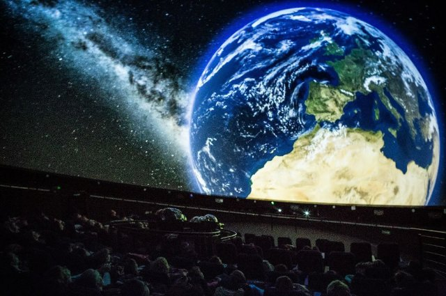{ width="200" }

    - **[Terre](../cards/index.md#earth)** (RelatedTo)
    Notre planète natale avec terre, air et eau.

    { width="200" }

    - **[Uranus](../cards/index.md#uranus)** (RelatedTo)
    Une planète bleu-vert qui tourne sur le côté.

    { width="200" }

- Quests: [Copernic et le système solaire (pl_07)](../quest/pl_07.md)

---

### Stree safety
- Importance: Medium  
- Target Age: Ages6to10
- Core card:
    - **[Sécurité routière](../cards/index.md#street_safety)**
    Des règles qui assurent la sécurité de tous sur la route.

- Connected cards:
    - **[Casque (sécurité routière)](../cards/index.md#helmet_street_safety)** (RelatedTo)
    Un casque de sécurité pour protéger votre tête lorsque vous roulez.

    { width="200" }

    - **[Panneau STOP](../cards/index.md#stop_sign)** (RelatedTo)
    Un panneau rouge qui signifie que vous devez arrêter votre véhicule.

    { width="200" }

    - **[Passage piéton](../cards/index.md#zebra_crossing)** (RelatedTo)
    Bandes blanches là où les gens traversent la rue.

    { width="200" }

    - **[Feux de signalisation](../cards/index.md#traffic_lights)** (RelatedTo)
    Des lampadaires qui vous indiquent quand vous devez vous ARRÊTER ou PARTIR.

    { width="200" }

    - **[Panneau de DANGER](../cards/index.md#danger_sign)** (RelatedTo)
    Un panneau avertissant d'un danger imminent. Soyez extrêmement prudent.

    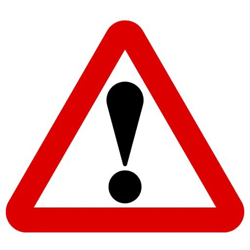{ width="200" }

- Quests: [Se déplacer en ville en toute sécurité (fr_04)](../quest/fr_04.md)

---

### Telescope
- Importance: Medium  
- Subjects: Science  
- Target Age: Ages6to10
- Core card:
    - **[Télescope](../cards/index.md#telescope)**
    Un outil qui nous aide à voir des choses lointaines dans le ciel.

    { width="200" }

- Connected cards:
    - **[Nicolas Copernic](../cards/index.md#nicolaus_copernicus)** (RelatedTo)
    Un brillant scientifique polonais a découvert que la Terre tourne autour du Soleil, et non l'inverse ! Cela a révolutionné notre compréhension de l'espace.

    { width="200" }

    - **[Oculaire](../cards/index.md#eyepiece)** (RelatedTo)
    La petite lentille à travers laquelle vous regardez sur un télescope.

    { width="200" }

    - **[Lentille](../cards/index.md#lens)** (RelatedTo)
    Un morceau de verre ou de plastique transparent qui courbe la lumière.

    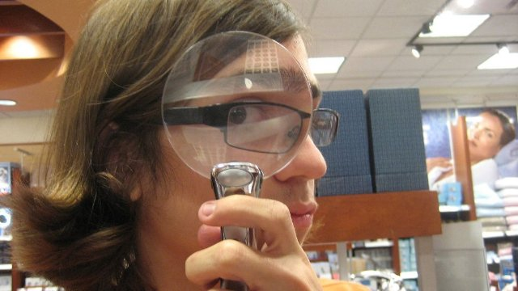{ width="200" }

    - **[Planétarium](../cards/index.md#planetarium)** (RelatedTo)
    Un endroit où vous pouvez voir le ciel et les étoiles à l'intérieur.

    { width="200" }

- Quests: [Copernic et le système solaire (pl_07)](../quest/pl_07.md)

---

### Zoo Animals
- Importance: Medium  
- Subjects: Animal  
- Target Age: Ages6to10
- Core card:
    - **[Zoo Animals](../cards/index.md#zoo_animals)**
    Auto-created card for topic 'Zoo Animals'.

- Connected cards:
    - **[Girafe](../cards/index.md#animal_giraffe)** (RelatedTo)
    Un animal très grand avec un long cou. Les girafes sont plus hautes que les arbres ! Elles mangent des feuilles inaccessibles aux autres animaux.

    { width="200" }

    - **[Lion](../cards/index.md#animal_lion)** (RelatedTo)
    Un grand félin surnommé le roi des animaux. Il vit en groupes appelés troupes.

    { width="200" }

    - **[Singe](../cards/index.md#animal_monkey)** (RelatedTo)
    Un animal intelligent qui peut grimper et jouer. Certains singes vivent en grandes familles.

    { width="200" }

    - **[Manchot](../cards/index.md#animal_penguin)** (RelatedTo)
    Un oiseau qui ne peut pas voler mais qui nage très bien. Il vit dans les régions froides.

    { width="200" }

    - **[Éléphant](../cards/index.md#animal_elephant)** (RelatedTo)
    Un gros animal avec une trompe. Les éléphants sont les plus grands animaux terrestres. Ils ont de grandes oreilles et adorent arroser !

    { width="200" }

- Quests: [Le zoo (pl_04)](../quest/pl_04.md)

## France

### Baguette
- Description: the french bread famous all around the world!  
- Importance: Medium  
- Subjects: Food  
- Target Age: Ages3to5
- Core card:
    - **[Baguette française](../cards/index.md#food_baguette)**
    Un pain long et croustillant, l'aliment le plus célèbre en France. Les Français achètent des baguettes fraîches tous les jours à la boulangerie !

    { width="200" }

- Connected cards:
    - **[Paris](../cards/index.md#capital_paris)** (LocatedIn)
    Paris, capitale de la France, possède une célèbre tour haute appelée la Tour Eiffel !

    { width="200" }

    - **[Boulanger](../cards/index.md#person_baker)** (CreatedBy)
    Une personne qui fait du pain, des gâteaux et des pâtisseries.

    { width="200" }

    - **[SEL](../cards/index.md#food_salt)** (MadeOf)
    Des cristaux blancs qui améliorent le goût des aliments.

    { width="200" }

    - **[Levure](../cards/index.md#food_yeast)** (MadeOf)
    La levure est comme une poudre magique qui rend le pain moelleux et savoureux !

    { width="200" }

    - **[Farine](../cards/index.md#food_flour)** (MadeOf)
    Poudre blanche fabriquée à partir de blé qui est utilisée pour faire du pain.

    { width="200" }

    - **[Eau](../cards/index.md#food_water)** (MadeOf)
    L'eau est essentielle à toute vie

    { width="200" }

- Quests: [Paris ! (fr_01)](../quest/fr_01.md)

---

### Bouillabaisse
- Importance: Low  
- Target Age: Ages6to10
- Core card:
    - **[Bouillabaisse](../cards/index.md#bouillabaisse)**
    Une soupe de poisson typique de Marseille, dans le sud de la France. Elle est composée de différentes variétés de poissons et dégage une délicieuse odeur !

    { width="200" }

- Connected cards:
    - **[PAIN](../cards/index.md#food_bread)** (MadeOf)
    Un délicieux aliment à base de farine et d'eau. Vous pouvez faire des sandwichs avec du pain !

    { width="200" }

    - **[POISSON](../cards/index.md#food_fish)** (MadeOf)
    Un animal qui vit et nage dans l'eau. Les poissons ont des nageoires et des branchies pour respirer sous l'eau.

    { width="200" }

    - **[Crabe](../cards/index.md#food_crab)** (MadeOf)
    Un animal marin doté de grandes pinces et d'une carapace dure. Les crabes marchent latéralement sur la plage !

    { width="200" }

    - **[Lait](../cards/index.md#food_milk)** (MadeOf)
    Une boisson blanche issue du lait de vache. Le lait contribue à la solidité des os et des dents !

    { width="200" }

    - **[Orange](../cards/index.md#food_orange)** (MadeOf)
    Un fruit rond et orange, au goût sucré et juteux. L'orange est riche en vitamine C !

    { width="200" }

    - **[Tomate](../cards/index.md#food_tomato)** (MadeOf)
    Un fruit rouge et rond qui pousse sur les plantes. On utilise les tomates pour faire de la sauce à pizza !

    { width="200" }

    - **[Citron](../cards/index.md#food_lemon)** (MadeOf)
    Un fruit jaune au goût très acide. On utilise le citron pour faire de la limonade !

    { width="200" }

    - **[Huile d'olive](../cards/index.md#food_olive_oil)** (MadeOf)
    Une huile spéciale à base d'olives. On l'utilise pour cuisiner des plats savoureux.

    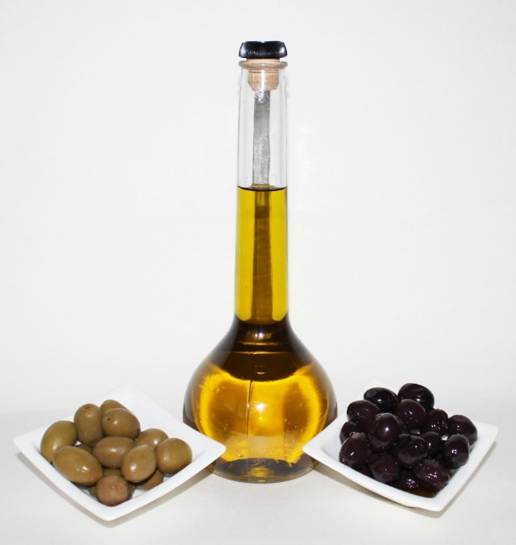{ width="200" }

    - **[Poivre Sel](../cards/index.md#food_pepper_salt)** (MadeOf)
    Des épices qui rehaussent le goût des aliments. Le sel est blanc et le poivre est noir avec de petits morceaux.

    { width="200" }

- Quests: [Nourriture et marché (fr_09)](../quest/fr_09.md)

Credits:
  - Valeria Passarella (Italy)

---

### Countries around France
- Importance: Medium  
- Target Age: Ages6to10
- Core card:
    - **[France](../cards/index.md#country_france)**
    Un pays d'Europe. La capitale est Paris.

    { width="200" }

- Connected cards:
    - **[Suisse](../cards/index.md#country_switzerland)** (RelatedTo)
    Un pays d'Europe dont la capitale est Berne. La Suisse est célèbre pour ses montagnes et son fromage.

    { width="200" }

    - **[Luxembourg](../cards/index.md#country_luxembourg)** (RelatedTo)
    Un pays d'Europe dont la capitale est la ville de Luxembourg.

    { width="200" }

    - **[Italie](../cards/index.md#country_italy)** (RelatedTo)
    Un pays d'Europe. La capitale est Rome.

    { width="200" }

    - **[Drapeau de l'Espagne](../cards/index.md#flag_spain)** (CulturalContext)
    Le drapeau espagnol est orné de bandes horizontales rouges et jaunes. Ces couleurs évoquent le soleil et les poivrons ! L'Espagne a inventé le flamenco.

    { width="200" }

    - **[Drapeau de l'Allemagne](../cards/index.md#flag_germany)** (CulturalContext)
    Le drapeau allemand comporte trois bandes horizontales : noire, rouge et jaune. L'Allemagne est célèbre pour ses voitures, ses châteaux et ses contes de fées !

    { width="200" }

    - **[Drapeau de l'Italie](../cards/index.md#flag_italy)** (CulturalContext)
    Le drapeau italien comporte trois bandes verticales : verte, blanche et rouge. Ces couleurs rappellent le basilic, la mozzarella et les tomates sur une pizza !

    { width="200" }

    - **[Drapeau du Luxembourg](../cards/index.md#flag_luxembourg)** (CulturalContext)
    Le drapeau luxembourgeois est composé de bandes horizontales rouges, blanches et bleu clair. Le Luxembourg est un tout petit pays qui parle trois langues !

    { width="200" }

    - **[Drapeau de la Belgique](../cards/index.md#flag_belgium)** (CulturalContext)
    Le drapeau belge comporte trois bandes verticales : noire, jaune et rouge. La Belgique est célèbre pour son chocolat et ses gaufres !

    { width="200" }

    - **[Drapeau de la Suisse](../cards/index.md#flag_switzerland)** (CulturalContext)
    Le drapeau suisse est rouge avec une croix blanche au milieu. On dirait une trousse de premiers secours ! La Suisse est célèbre pour ses montagnes et son fromage.

    { width="200" }

    - **[Allemagne](../cards/index.md#country_germany)** (RelatedTo)
    Un pays d'Europe. La capitale est Berlin.

    { width="200" }

    - **[Espagne](../cards/index.md#country_spain)** (RelatedTo)
    Un pays d'Europe dont la capitale est Madrid. L'Espagne a inventé le flamenco.

    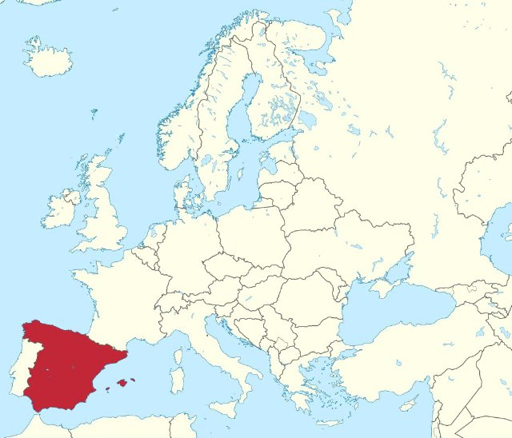{ width="200" }

---

### Eiffel Tower
- Description: What we need to know about the iconic Paris landmark  
- Importance: Critical  
- Subjects: History  
- Target Age: Ages3to5
- Core card:
    - **[Tour Eiffel](../cards/index.md#eiffel_tower)**
    Une haute tour, symbole de Paris. Construite en fer, elle mesure 300 mètres de haut. De là-haut, on peut admirer toute la ville.

    { width="200" }

- Connected cards:
    - **[Paris](../cards/index.md#capital_paris)** (LocatedIn)
    Paris, capitale de la France, possède une célèbre tour haute appelée la Tour Eiffel !

    { width="200" }

    - **[Gustave Eiffel](../cards/index.md#gustave_eiffel)** (CreatedBy)
    L'homme qui a construit la tour Eiffel ! C'était un ingénieur passionné de construction en fer et il a créé la tour la plus célèbre du monde.

    { width="200" }

    - **[Fer](../cards/index.md#iron_material)** (MadeOf)
    Un outil chauffant utilisé pour lisser et aplatir les vêtements froissés. Attention, les fers à repasser sont très chauds !

    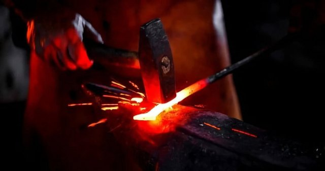{ width="200" }

    - **[Carte de la Tour Eiffel](../cards/index.md#eiffel_tower_map)** (RelatedTo)
    Une carte qui montre où se trouve la célèbre haute tour de Paris.

    { width="200" }

    - **[Billet pour la Tour Eiffel](../cards/index.md#eiffel_tower_ticket)** (RelatedTo)
    Un document spécial qui vous permet de visiter la célèbre haute tour de Paris, en France.

    { width="200" }

- Quests: [Paris ! (fr_01)](../quest/fr_01.md)

---

### France country
- Importance: Critical  
- Target Age: Ages6to10
- Core card:
    - **[France](../cards/index.md#country_france)**
    Un pays d'Europe. La capitale est Paris.

    { width="200" }

- Connected cards:
    - **[Drapeau de la France](../cards/index.md#flag_france)** (CulturalContext)
    Le drapeau français comporte trois bandes verticales : bleu, blanc et rouge. Ces couleurs représentent la liberté, l'égalité et la fraternité !

    { width="200" }

    - **[Paris](../cards/index.md#capital_paris)** (RelatedTo)
    Paris, capitale de la France, possède une célèbre tour haute appelée la Tour Eiffel !

    { width="200" }

- Quests: [Les voisins de la France (fr_00)](../quest/fr_00.md)

---

### French School
- Importance: High  
- Subjects: Education  
- Target Age: Ages6to10
- Core card:
    - **[French Schools](../cards/index.md#french_schools)**
    In France, school happens in four main steps: maternelle (play-and-learn for little kids), école élémentaire (reading, writing, maths), collège (middle school), and lycée (high school). At the end of lycée, many students take a big exam called the baccalauréat (‘le bac’)

- Connected cards:
    - **[École maternelle](../cards/index.md#education_ecole_maternelle_fr)** (PartOf)
    École pour les petits de 3 à 5 ans. On apprend en jouant et en explorant.

    { width="200" }

    - **[École primaire en France](../cards/index.md#education_ecole_primaire_fr)** (PartOf)
    École pour les enfants de 6 à 10 ans. Vous apprenez à lire, à écrire et à compter.

    { width="200" }

    - **[Lycée en France](../cards/index.md#education_lycee_fr)** (PartOf)
    Lycée en France pour les adolescents de 16 à 18 ans. Les élèves étudient dur pour l'examen du baccalauréat pour aller à l'université.

    { width="200" }

    - **[Collège en France](../cards/index.md#education_college_fr)** (PartOf)
    Collège en France pour les enfants de 11 à 15 ans. Les élèves apprennent de nombreuses matières et se préparent au lycée.

    { width="200" }

    - **[Écriture cursive](../cards/index.md#concept_cursive_writing)** (Purpose)
    Une façon particulière d'écrire où toutes les lettres d'un mot sont reliées entre elles. En France, les enfants apprennent cette écriture à l'école.

    { width="200" }

    - **[Menu de la cantine](../cards/index.md#object_canteen_menu)** (Purpose)
    Une liste des aliments autorisés à la cantine. Elle vous aide à choisir vos repas !

    { width="200" }

    - **[Charte de la laïcité](../cards/index.md#concept_charter_of_secularism)** (CulturalContext)
    Un ensemble de règles visant à respecter les croyances de chacun. Il contribue à une coexistence pacifique.

    { width="200" }

- Quests: [Le système scolaire (fr_02)](../quest/fr_02.md)

---

### Jules Verne
- Importance: Medium  
- Target Age: Ages6to10
- Core card:
    - **[Jules Verne](../cards/index.md#jules_verne)**
    A French writer who imagined amazing adventures before they were possible! He wrote about submarines, rockets, and traveling around the world.

    { width="200" }

- Connected cards:
    - **[Around the World in Eighty Days](../cards/index.md#book_around_the_world_80_days)** (RelatedTo)
    An exciting book by Jules Verne about traveling around the whole world very quickly using trains, ships, and hot air balloons!

    { width="200" }

    - **[From the Earth to the Moon](../cards/index.md#book_from_earth_to_moon)** (RelatedTo)
    A book by Jules Verne about going to the Moon in a big cannon! It was written before real rockets existed.

    { width="200" }

    - **[20000 Leagues Under the Sea](../cards/index.md#book_20000_leagues_under_the_sea)** (RelatedTo)
    A book by Jules Verne about underwater adventures in a submarine called the Nautilus. You meet giant sea creatures!

    { width="200" }

    - **[Hot-Air Balloon](../cards/index.md#hot_air_balloon)** (RelatedTo)
    A balloon that flies using hot air. The first one flew in France.

    { width="200" }

    - **[Fusée spatiale](../cards/index.md#space_rocket)** (RelatedTo)
    Une fusée qui va dans l'espace.

    { width="200" }

    - **[Sous-marin (Le Nautilus)](../cards/index.md#submarine_nautilus)** (RelatedTo)
    Un sous-marin du roman de Jules Verne. Il pouvait explorer les profondeurs marines.

    { width="200" }

- Quests: [Jules Verne et les transports (fr_03)](../quest/fr_03.md)

Credits:
  - Lucie Paillat (France)

---

### Louvre
- Importance: Critical  
- Subjects: Art  
- Target Age: Ages6to10
- Core card:
    - **[Persienne](../cards/index.md#louvre)**
    Un immense musée rempli d'œuvres d'art. C'est là que vit la Joconde.

    { width="200" }

- Connected cards:
    - **[Paris](../cards/index.md#capital_paris)** (LocatedIn)
    Paris, capitale de la France, possède une célèbre tour haute appelée la Tour Eiffel !

    { width="200" }

    - **[La Joconde](../cards/index.md#art_monalisa)** (PartOf)
    Le tableau le plus célèbre du monde ! Une femme au sourire mystérieux, peinte par Léonard de Vinci. Elle semble vous suivre du regard.

    { width="200" }

    - **[Léonard de Vinci](../cards/index.md#person_leonardodavinci)** (RelatedTo)
    Un artiste et scientifique italien exceptionnel. Il a peint la Joconde et inventé les machines volantes des siècles avant les avions !

    { width="200" }

    - **[La liberté guidant le peuple](../cards/index.md#art_liberty_leading_the_people)** (PartOf)
    Un célèbre tableau sur la liberté et le courage. Il représente une femme courageuse brandissant le drapeau français et menant le peuple à la lutte pour ses droits.

    { width="200" }

    - **[Vénus de Milo](../cards/index.md#art_venus_milo)** (PartOf)
    Magnifique statue antique de femme en marbre blanc. Ses bras ont disparu, mais elle reste considérée comme l'une des plus belles statues jamais réalisées.

    { width="200" }

- Quests: [Paris ! (fr_01)](../quest/fr_01.md)

---

### market traders
- Description: People who sell food and goods at market stalls—like fishmongers, cheesemongers, and fruit sellers. They weigh, wrap, and call out today’s prices.  
- Importance: Medium  
- Target Age: Ages6to10
- Core card:
    - **[Market traders](../cards/index.md#market_traders)**
    People who sell food and goods at market stalls—like fishmongers, cheesemongers, and fruit sellers. They weigh, wrap, and call out today’s prices.

- Connected cards:
    - **[Fromager](../cards/index.md#person_cheesemonger)** (RelatedTo)
    Une personne qui vend de nombreux types de fromages.

    { width="200" }

    - **[Boulanger](../cards/index.md#person_baker)** (RelatedTo)
    Une personne qui fait du pain, des gâteaux et des pâtisseries.

    { width="200" }

    - **[Marchand de légumes](../cards/index.md#person_greengrocer)** (RelatedTo)
    Une personne qui vend des fruits et légumes frais.

    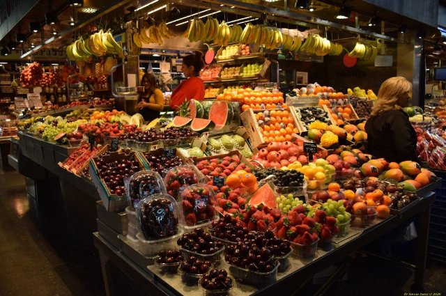{ width="200" }

    - **[Épicier](../cards/index.md#person_grocer)** (RelatedTo)
    Une personne qui vend de nombreux types d’aliments et de boissons.

    { width="200" }

    - **[Poissonnier](../cards/index.md#person_fishmonger)** (RelatedTo)
    Une personne qui vend du poisson frais et des fruits de mer.

    { width="200" }

- Quests: [Nourriture et marché (fr_09)](../quest/fr_09.md)

---

### marseillaise music
- Importance: High  
- Target Age: Ages6to10
- Core card:
    - **[La Marseillaise](../cards/index.md#marseillaise_music)**
    L'hymne national français. On le chante lors des grands événements et des compétitions sportives.

    { width="200" }

- Connected cards:
    - **[Révolution française](../cards/index.md#french_revolution)** (RelatedTo)
    Une époque dans les années 1790 où la France a changé de gouvernement.

    { width="200" }

    - **[Le jour de la gloire](../cards/index.md#marseillaise_3)** (RelatedTo)
    Paroles de la première ligne de l’hymne.

    { width="200" }

    - **[Allons les enfants](../cards/index.md#marseillaise_1)** (RelatedTo)
    Les premiers mots de la première ligne de l’hymne.

    { width="200" }

    - **[De la patrie](../cards/index.md#marseillaise_2)** (RelatedTo)
    Paroles de la première ligne de l’hymne.

    { width="200" }

    - **[Est arrivé](../cards/index.md#marseillaise_4)** (RelatedTo)
    Paroles de la première ligne de l’hymne.

    { width="200" }

- Quests: [La Marseillaise (fr_11)](../quest/fr_11.md)

---

### mont blanc
- Importance: Medium  
- Target Age: Ages6to10
- Core card:
    - **[Mont Blanc](../cards/index.md#place_mont_blanc)**
    La plus haute montagne d'Europe occidentale. Recouverte de neige toute l'année.

    { width="200" }

- Connected cards:
    - **[Guide de montagne](../cards/index.md#mountain_guide)** (RelatedTo)
    Une personne qui aide les gens à grimper en toute sécurité.

    { width="200" }

    - **[Vent](../cards/index.md#wind)** (RelatedTo)
    Un air en mouvement qui peut sembler fort en montagne.

    { width="200" }

    - **[Sommet](../cards/index.md#summit)** (RelatedTo)
    Le sommet d'une montagne.

    { width="200" }

    - **[Alpes](../cards/index.md#alps)** (RelatedTo)
    Une haute chaîne de montagnes en Europe.

    { width="200" }

    - **[Montagne](../cards/index.md#mountain)** (RelatedTo)
    Les piliers de la terre

    { width="200" }

    - **[Neige](../cards/index.md#snow)** (RelatedTo)
    Eau gelée qui tombe par temps froid.

    { width="200" }

    - **[Glace](../cards/index.md#ice)** (RelatedTo)
    Eau gelée qui peut être très glissante.

    { width="200" }

- Quests: [Mont Blanc et montagnes (fr_08)](../quest/fr_08.md)

---

### Notre Dame
- Importance: High  
- Subjects: Culture  
- Target Age: Ages6to10
- Core card:
    - **[Notre-Dame de Paris](../cards/index.md#notre_dame_de_paris)**
    Une magnifique cathédrale de Paris. Ses vitraux colorés racontent des histoires.

    { width="200" }

- Connected cards:
    - **[Paris](../cards/index.md#capital_paris)** (LocatedIn)
    Paris, capitale de la France, possède une célèbre tour haute appelée la Tour Eiffel !

    { width="200" }

    - **[Incendie de Notre-Dame](../cards/index.md#notre_dame_de_paris_fire)** (TimeContext)
    En 2019, un important incendie a endommagé la magnifique cathédrale Notre-Dame de Paris. De nombreuses personnes ont œuvré ensemble pour sauver cet important édifice.

    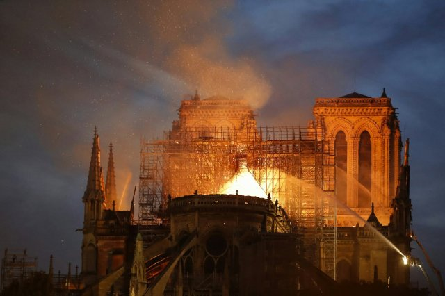{ width="200" }

    - **[Île-de-France](../cards/index.md#ile_de_france)** (LocatedIn)
    Région de France où se trouve la capitale Paris. De nombreuses personnes y vivent !

    { width="200" }

- Quests: [Paris ! (fr_01)](../quest/fr_01.md)

---

### Seine Bridges
- Importance: Medium  
- Target Age: Ages6to10
- Core card:
    - **[Pont pour voitures](../cards/index.md#place_bridge_cars)**
    Une route qui traverse l'eau pour que les voitures puissent traverser les rivières et les lacs.

    { width="200" }

- Connected cards:
    - **[Passerelles](../cards/index.md#place_bridge_people)** (RelatedTo)
    De petits ponts pour les piétons. Ils vous protègent de la circulation.

    { width="200" }

    - **[Pont pour trains](../cards/index.md#place_bridge_trains)** (RelatedTo)
    Un pont spécial construit suffisamment solide pour que les trains lourds puissent traverser l'eau.

    { width="200" }

    - **[bateau fluvial](../cards/index.md#boat_river)** (RelatedTo)
    Un bateau qui navigue sur les rivières. Les rivières sont comme des routes faites d'eau !

    { width="200" }

- Quests: [Paris Seine (fr_10)](../quest/fr_10.md)

## Poland

### gdansk
- Importance: Medium  
- Target Age: Ages6to10
- Core card:
    - **[Gdańsk](../cards/index.md#gdansk)**
    Une ville portuaire en Pologne sur la mer Baltique.

    { width="200" }

- Connected cards:
    - **[Phare de Gdańsk](../cards/index.md#gdansk_lighthouse)** (RelatedTo)
    Un phare historique qui aide les navires à trouver le port.

    { width="200" }

    - **[Rivière Motława](../cards/index.md#motawa_river)** (RelatedTo)
    La rivière qui traverse Gdańsk jusqu'à la mer.

    { width="200" }

    - **[Côte de la mer Baltique](../cards/index.md#baltic_sea_coast)** (RelatedTo)
    La côte sablonneuse le long de la mer Baltique.

    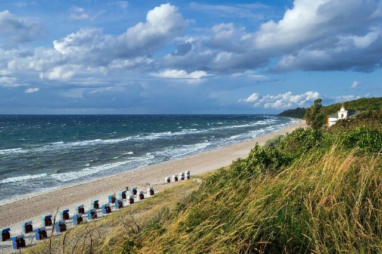{ width="200" }

    - **[mer Baltique](../cards/index.md#baltic_sea)** (RelatedTo)
    Une grande mer du nord de l'Europe, où se rencontrent la Pologne, l'Allemagne et d'autres pays. Elle possède de magnifiques plages et est célèbre pour ses trésors d'ambre !

    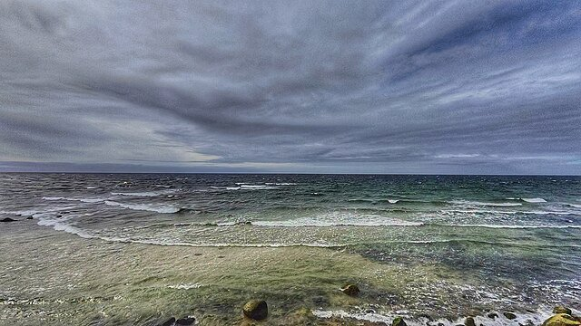{ width="200" }

---

### Gingerbread
- Importance: Medium  
- Subjects: Food  
- Target Age: Ages6to10
- Core card:
    - **[Pain d'épices torunois](../cards/index.md#gingerbread)**
    une friandise traditionnelle polonaise à base d'épices et de miel, souvent façonnée dans de beaux motifs.

    { width="200" }

- Connected cards:
    - **[Moule à pain d'épices](../cards/index.md#gingerbread_mold)** (RelatedTo)
    Un outil de forme qui permet de créer des formes de biscuits amusantes.

    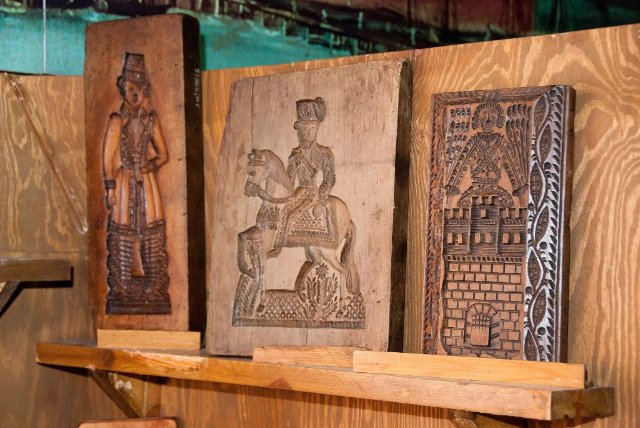{ width="200" }

    - **[Cannelle](../cards/index.md#cinnamon)** (RelatedTo)
    Une épice douce fabriquée à partir d'écorce d'arbre.

    { width="200" }

    - **[Beurre](../cards/index.md#butter)** (RelatedTo)
    Une matière grasse jaune issue du lait, utilisée pour la cuisine et la pâtisserie.

    { width="200" }

    - **[Œufs](../cards/index.md#eggs)** (RelatedTo)
    Nourriture provenant de poulets utilisée pour la cuisson et la pâtisserie.

    { width="200" }

    - **[Gingembre](../cards/index.md#ginger)** (RelatedTo)
    Une racine épicée utilisée en cuisine et dans les biscuits.

    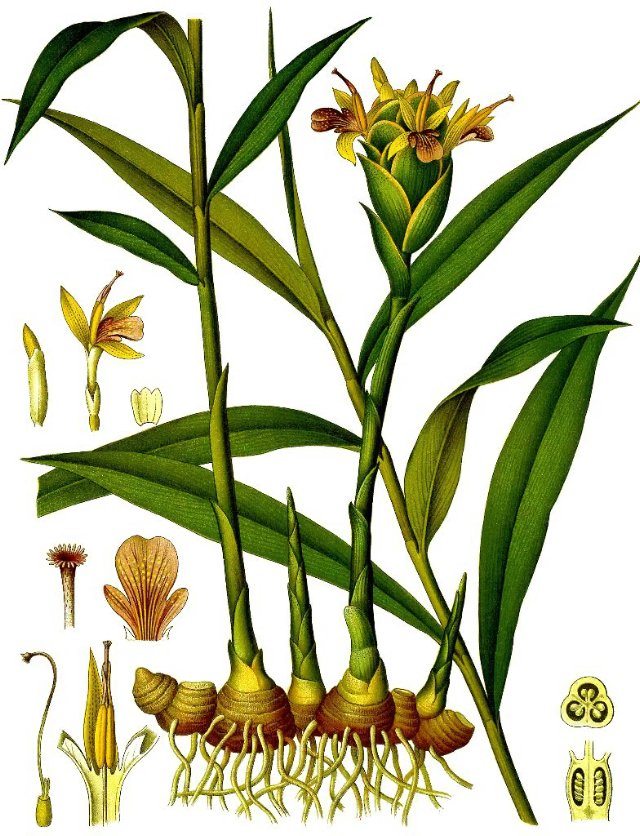{ width="200" }

    - **[Chéri](../cards/index.md#honey)** (RelatedTo)
    Un aliment sucré fabriqué par les abeilles.

    { width="200" }

---

### Neptune's fountain
- Importance: Medium  
- Target Age: Ages6to10
- Core card:
    - **[La fontaine de Neptune](../cards/index.md#neptune_s_fountain)**
    Une célèbre fontaine de Gdańsk avec la statue du dieu de la mer.

    { width="200" }

- Connected cards:
    - **[Ambre](../cards/index.md#amber)** (RelatedTo)
    Résine d'arbre fossile brillante appelée « Or de la Baltique ».

    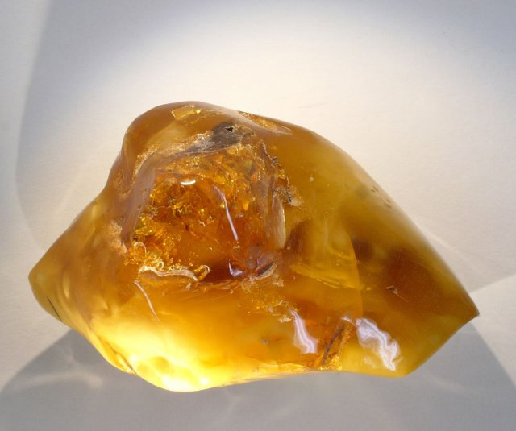{ width="200" }

    - **[Chambre d'ambre](../cards/index.md#amber_room)** (RelatedTo)
    Une célèbre pièce en ambre avec une histoire mystérieuse.

    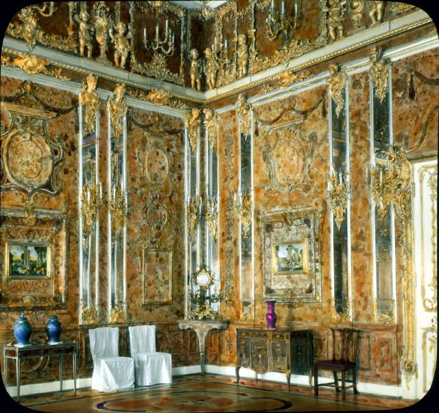{ width="200" }

    - **[Coquillage](../cards/index.md#seashell)** (RelatedTo)
    Une coquille dure provenant d'un animal marin ; idéale pour l'artisanat.

    { width="200" }

    - **[Collier](../cards/index.md#necklace)** (RelatedTo)
    Un collier de perles ou de coquillages que vous portez autour du cou.

    { width="200" }

    - **[Gdańsk](../cards/index.md#gdansk)** (RelatedTo)
    Une ville portuaire en Pologne sur la mer Baltique.

    { width="200" }

---

### Odra river
- Importance: Medium  
- Target Age: Ages6to10
- Core card:
    - **[Rivière Odra](../cards/index.md#place_odra_river)**
    Un grand fleuve de l'ouest de la Pologne. Il facilite la navigation et le commerce.

    { width="200" }

- Connected cards:
    - **[Passerelle](../cards/index.md#footbridge)** (RelatedTo)
    Un pont piétonnier. Interdit aux voitures.

    { width="200" }

    - **[Pont de Tumski](../cards/index.md#tumski_bridge)** (RelatedTo)
    Un pont célèbre avec des cadenas d'amour et des lanternes à gaz.

    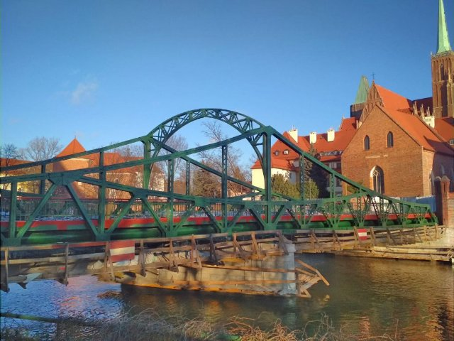{ width="200" }

    - **[Pont Rędziński](../cards/index.md#redzinski_bridge)** (RelatedTo)
    Le plus long pont à haubans de Pologne.

    { width="200" }

    - **[Pont routier](../cards/index.md#road_bridge)** (RelatedTo)
    Un pont pour voitures et bus.

    { width="200" }

    - **[Péniche](../cards/index.md#houseboat)** (RelatedTo)
    Un bateau fait pour vivre.

    { width="200" }

    - **[Pont ferroviaire](../cards/index.md#train_bridge)** (RelatedTo)
    Un pont avec des voies pour les trains.

    { width="200" }

    - **[Ponts de Wrocław](../cards/index.md#wroclaw_bridges)** (RelatedTo)
    De nombreux ponts traversent la rivière Odra à Wrocław.

    { width="200" }

    - **[La Vistule (Wisła)](../cards/index.md#place_vistula_river)** (RelatedTo)
    Le plus long fleuve de Pologne s'appelle Wisła ou Vistule. Il traverse Cracovie et Varsovie.

    { width="200" }

---

### Pierogi Recipe
- Importance: Medium  
- Target Age: Ages6to10
- Core card:
    - **[Pierogi Recipe](../cards/index.md#pierogi_recipe)**
    Make a soft dough, fill with mashed potatoes and farmer’s cheese, seal, boil until they float—then pan-fry in butter with onions.

- Connected cards:
    - **[Pierogi polonais](../cards/index.md#pierogi)** (RelatedTo)
    Raviolis farcis de pommes de terre, de fromage ou de fruits. C'est un plat polonais célèbre.

    { width="200" }

    - **[Monnaie du zloty](../cards/index.md#currency_zloty)** (RelatedTo)
    La monnaie polonaise s'appelle le złoty. Les pièces et les billets arborent des symboles polonais.

    { width="200" }

    - **[Pain d'épices torunois](../cards/index.md#gingerbread)** (RelatedTo)
    une friandise traditionnelle polonaise à base d'épices et de miel, souvent façonnée dans de beaux motifs.

    { width="200" }

- Quests: [Pain d'épices et marché alimentaire (pl_06)](../quest/pl_06.md)

---

### Poland Countries
- Importance: Medium  
- Target Age: Ages6to10
- Core card:
    - **[Pologne](../cards/index.md#country_poland)**
    Un pays d'Europe dont la capitale est Varsovie. La Pologne est célèbre pour ses scientifiques comme Copernic et ses délicieux pierogi !

    { width="200" }

- Connected cards:
    - **[Slovaquie](../cards/index.md#country_slovakia)** (RelatedTo)
    Un pays d'Europe dont la capitale est Bratislava.

    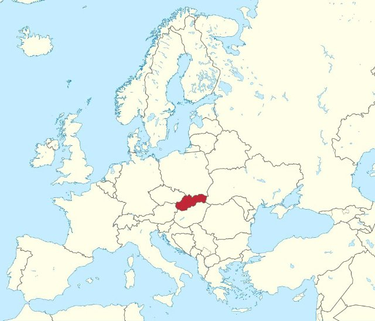{ width="200" }

    - **[République tchèque](../cards/index.md#country_czech_republic)** (RelatedTo)
    Un pays d'Europe dont la capitale est Prague.

    { width="200" }

    - **[Lituanie](../cards/index.md#country_lithuania)** (RelatedTo)
    Un pays d'Europe dont la capitale est Vilnius.

    { width="200" }

    - **[Biélorussie](../cards/index.md#country_belarus)** (RelatedTo)
    Un pays d'Europe. La capitale est Minsk.

    { width="200" }

    - **[Drapeau de la Biélorussie](../cards/index.md#flag_belarus)** (CulturalContext)
    Le drapeau de la Biélorussie est composé de bandes horizontales rouges et vertes, ornées de magnifiques motifs traditionnels sur les côtés. La Biélorussie est voisine de la Pologne.

    { width="200" }

    - **[Drapeau de la Russie](../cards/index.md#flag_russia)** (CulturalContext)
    Un drapeau à rayures blanches, bleues et rouges. Il représente la Russie.

    { width="200" }

    - **[Drapeau de la Slovaquie](../cards/index.md#flag_slovakia)** (CulturalContext)
    Un drapeau aux couleurs blanche, bleue et rouge. Il représente la Slovaquie.

    { width="200" }

    - **[Flag of Czech Republic](../cards/index.md#flag_czech_republic)** (CulturalContext)
    The flag has white and red stripes with a blue triangle. The Czech Republic is famous for beautiful Prague castle and crystal glass.

    { width="200" }

    - **[Drapeau de la Lituanie](../cards/index.md#flag_lithuania)** (CulturalContext)
    Le drapeau est composé de bandes horizontales jaunes, vertes et rouges. La Lituanie est un pays balte doté de magnifiques forêts et plages.

    { width="200" }

    - **[Drapeau de l'Ukraine](../cards/index.md#flag_ukraine)** (CulturalContext)
    Un drapeau bleu et jaune, comme le ciel et le soleil. Il représente l'Ukraine.

    { width="200" }

    - **[Drapeau de l'Allemagne](../cards/index.md#flag_germany)** (CulturalContext)
    Le drapeau allemand comporte trois bandes horizontales : noire, rouge et jaune. L'Allemagne est célèbre pour ses voitures, ses châteaux et ses contes de fées !

    { width="200" }

    - **[Allemagne](../cards/index.md#country_germany)** (RelatedTo)
    Un pays d'Europe. La capitale est Berlin.

    { width="200" }

    - **[Russie](../cards/index.md#country_russia)** (RelatedTo)
    Un pays d'Europe. La capitale est Moscou.

    { width="200" }

---

### Poland country
- Importance: Critical  
- Target Age: Ages6to10
- Core card:
    - **[Pologne](../cards/index.md#country_poland)**
    Un pays d'Europe dont la capitale est Varsovie. La Pologne est célèbre pour ses scientifiques comme Copernic et ses délicieux pierogi !

    { width="200" }

- Connected cards:
    - **[Drapeau de la Pologne](../cards/index.md#flag_poland)** (CulturalContext)
    Le drapeau polonais est orné de bandes horizontales blanches et rouges. La Pologne est célèbre pour ses scientifiques comme Copernic et ses délicieux pierogi !

    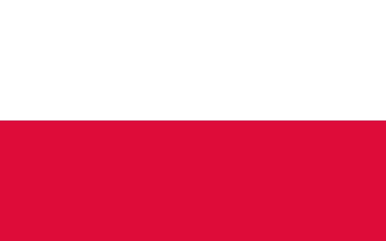{ width="200" }

    - **[Varsovie](../cards/index.md#capital_warsaw)** (RelatedTo)
    La capitale de la Pologne.

    { width="200" }

- Quests: [Les voisins de la Pologne (pl_00)](../quest/pl_00.md)

---

### Warsaw
- Importance: Medium  
- Target Age: Ages6to10
- Core card:
    - **[Monument Chopin](../cards/index.md#chopin_monument)**
    Une grande statue du parc Łazienki de Varsovie est dédiée à Frédéric Chopin. C'est également le lieu de concerts de piano en plein air très populaires en été. (L'arbre sous lequel il est assis est un saule polonais typique.)

    { width="200" }

- Connected cards:
    - **[Sirène de Varsovie](../cards/index.md#mermaid_of_warsaw)** (RelatedTo)
    Le symbole de la ville est une sirène courageuse armée d'une épée et d'un bouclier. Sa statue est visible au bord de la rivière.

    { width="200" }

    - **[Guerres et Sawa](../cards/index.md#wars_and_sawa)** (RelatedTo)
    Deux personnages légendaires ont donné son nom à Varsovie. Wars était un guerrier courageux et Sawa était une belle sirène vivant dans la Vistule.

    { width="200" }

    - **[Frédéric Chopin](../cards/index.md#fryderyk_chopin)** (RelatedTo)
    Célèbre compositeur polonais pour piano, il a composé une musique magnifique qui évoque la danse ou les histoires. Sa musique rend les gens heureux ou tristes.

    { width="200" }

- Quests: [Découvrir Varsovie (pl_01)](../quest/pl_01.md)

---

### Wroclaw
- Importance: Medium  
- Target Age: Ages6to10
- Core card:
    - **[Wrocław](../cards/index.md#wroclaw)**
    Une ville de Pologne avec des rivières, des ponts et de l'histoire.

    { width="200" }

- Connected cards:
    - **[Ponts de Wrocław](../cards/index.md#wroclaw_bridges)** (RelatedTo)
    De nombreux ponts traversent la rivière Odra à Wrocław.

    { width="200" }

    - **[Rivière Odra](../cards/index.md#place_odra_river)** (RelatedTo)
    Un grand fleuve de l'ouest de la Pologne. Il facilite la navigation et le commerce.

    { width="200" }

    - **[La Vistule (Wisła)](../cards/index.md#place_vistula_river)** (RelatedTo)
    Le plus long fleuve de Pologne s'appelle Wisła ou Vistule. Il traverse Cracovie et Varsovie.

    { width="200" }

---

### Wroclaw Dwarves
- Importance: Medium  
- Target Age: Ages6to10
- Core card:
    - **[Nains de Wrocław](../cards/index.md#wroclaw_dwarfs)**
    De minuscules statues à travers la ville qui aiment jouer des tours.

    { width="200" }

- Connected cards:
    - **[Nain amoureux des animaux](../cards/index.md#animal_lover_dwarf)** (RelatedTo)
    Une statue naine qui aime le zoo et les animaux.

    { width="200" }

    - **[Évêque Nain](../cards/index.md#bishop_dwarf)** (RelatedTo)
    Une statue naine qui pose une question d'église.

    { width="200" }

    - **[Expert nain](../cards/index.md#dwarf_expert)** (RelatedTo)
    Un guide sympathique qui connaît tout sur les nains.

    { width="200" }

    - **[Maître des clés nain](../cards/index.md#keymaster_dwarf)** (RelatedTo)
    Une statue naine gardant l'ascenseur avec une grosse clé.

    { width="200" }

    - **[Nain polonais (gnomes de Wrocław)](../cards/index.md#polish_dwarf)** (RelatedTo)
    De petites statues de nains se cachent un peu partout à Wrocław. Les trouver est un jeu de ville amusant.

    { width="200" }

    - **[Statue du nain de Wrocław](../cards/index.md#wroclaw_dwarf_statue)** (RelatedTo)
    Une petite statue de la ville ; les nains sont le symbole de Wrocław.

    { width="200" }

    - **[Wrocław](../cards/index.md#wroclaw)** (LocatedIn)
    Une ville de Pologne avec des rivières, des ponts et de l'histoire.

    { width="200" }

- Quests: [Le grand sauvetage des nains de Wrocław (pl_02)](../quest/pl_02.md)

---

### wroclaw zoo
- Importance: Medium  
- Target Age: Ages6to10
- Core card:
    - **[Zoo de Wrocław](../cards/index.md#wroclaw_zoo)**
    Un grand zoo à Wrocław avec de nombreux animaux à découvrir.

    { width="200" }

- Connected cards:
    - **[Gardien de zoo](../cards/index.md#zoo_keeper)** (RelatedTo)
    Une personne qui s'occupe des animaux au zoo.

    { width="200" }

    - **[Enclos pour animaux](../cards/index.md#animal_enclosure)** (RelatedTo)
    Un espace sûr conçu pour que les animaux puissent vivre au zoo.

    { width="200" }

    - **[Directeur du zoo](../cards/index.md#zoo_director)** (RelatedTo)
    La personne qui dirige le zoo et aide les visiteurs.

    { width="200" }

- Quests: [Le zoo (pl_04)](../quest/pl_04.md)

