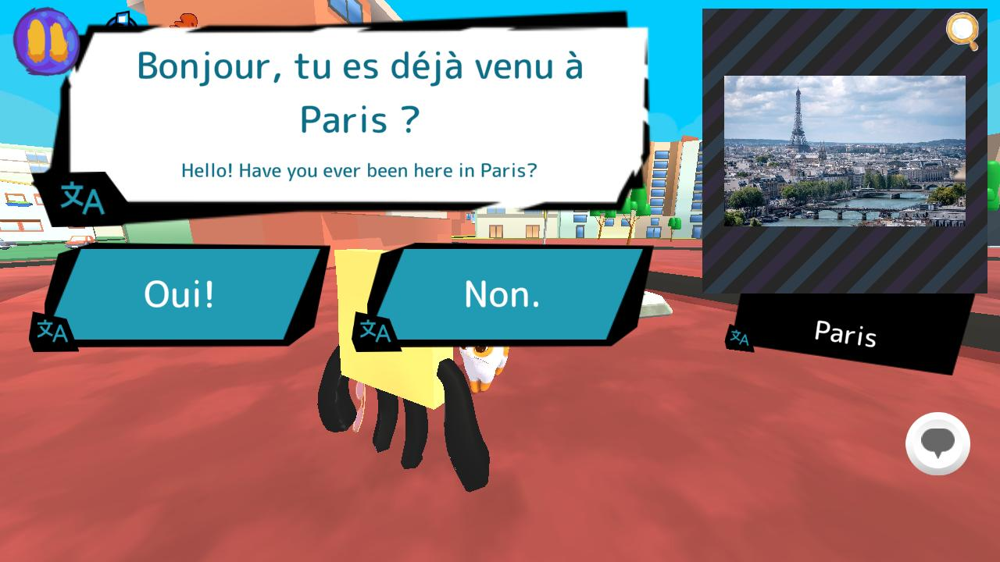
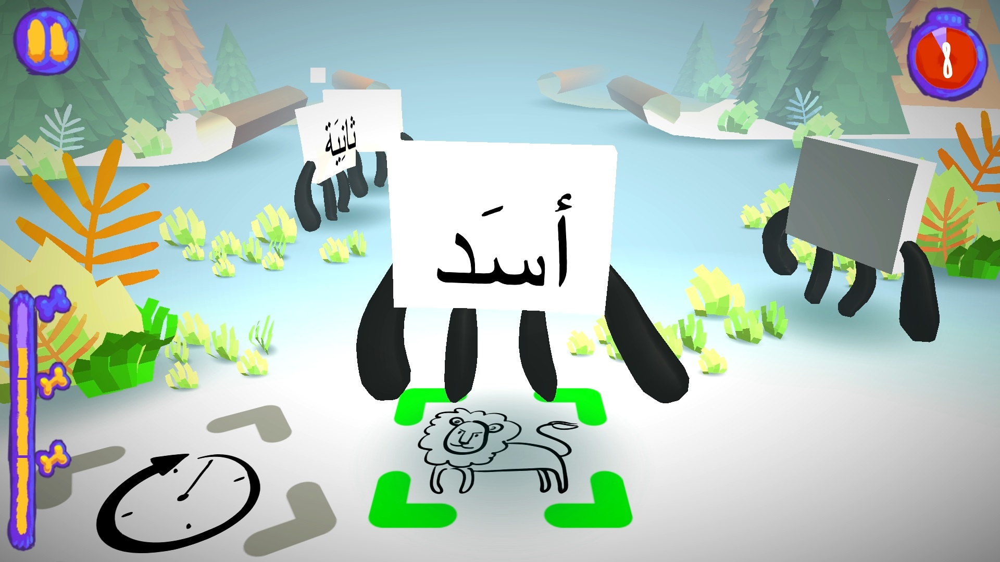

## Antura existe en deux éditions :

<a class="version-card" href="/fr/about/learn-with-antura">
  
  

    
🌍 La nouvelle v3 — en développement actif

    <h2>Learn with Antura</h2>
    
Explorez les quêtes <strong>Discover Cultures</strong> avec votre chat compagnon, collectionnez des cartes de connaissances et apprenez une nouvelle langue en chemin. Conçu pour les enfants migrants et réfugiés, en classe comme à la maison, et actuellement testé en France et en Pologne dans le cadre de notre projet Erasmus+.

    Découvrir Learn with Antura →
  

</a>

<a class="version-card" href="/fr/about/antura-and-the-letters">
  
  

    
🎮 La version originale, la plus récompensée

    <h2>Antura and the Letters</h2>
    
Parcourez <strong>6 mondes</strong> pour apprendre l'alphabet, plus de 250 mots et vos premières phrases à travers des mini-jeux ludiques. Créé pour les enfants réfugiés syriens et lauréat du prix EduApp4Syria et du UNHCR Innovation Award.

    Découvrir Antura and the Letters →
  

</a>

