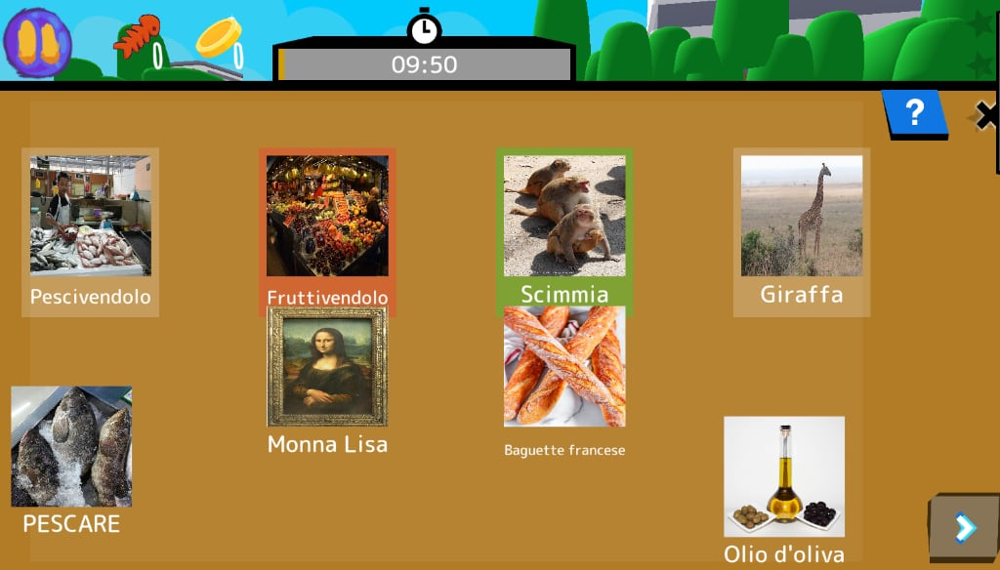
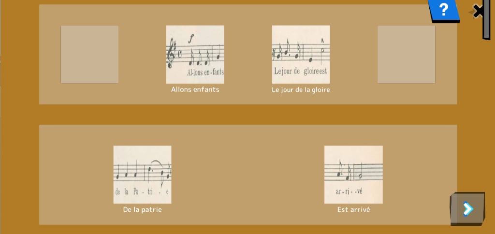
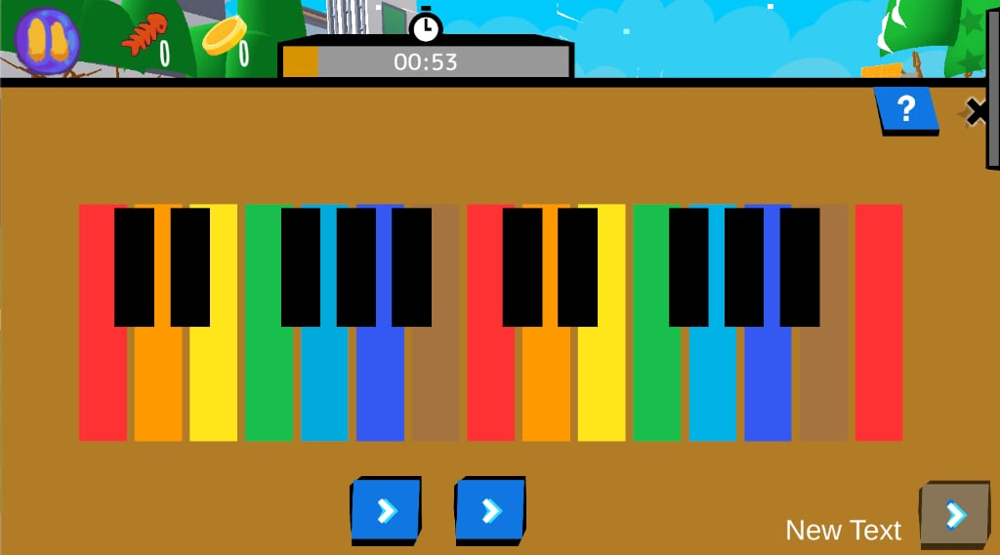

# Comment jouer aux quêtes Découvrir <Badge type="tip" text="new" />

## Choisir une quête

- Depuis le menu Terre, sélectionnez un pays ou une épingle de lieu (souvent une ville).  
- Choisissez une quête pour voir son titre, une courte description et son contenu.  
- En mode Classe : l’enseignant peut verrouiller un pays et laisser choisir les quêtes à l’intérieur.  
- En mode Maison : les quêtes se débloquent généralement une par une. Rejouer améliore le score et révèle des cartes bonus.  

> [!tip]
> Si vous débutez, commencez par la quête tutoriel de chaque pays.  

## Commandes du joueur

**PC / Ordinateur**  

- Touches ASDW = se déplacer (maintenir 2 s pour courir)  
- ESPACE = sauter / interagir / avancer les dialogues  
- SHIFT = courir (optionnel)  
- Souris + bouton droit = déplacer la caméra  
- Souris bouton gauche = interagir  

**Écran tactile**  

- Doigt gauche = se déplacer (maintenir 2 s pour courir)  
- Bouton = sauter / interagir  
- Taper sur les objets = interagir  
- Balayer/faire glisser = déplacer la caméra  

> [!tip] Astuce classe
> Projetez les commandes pour la première séance. Travail en binômes : l’un lit les consignes, l’autre contrôle, puis on inverse.  

## Carte et objectifs

- Bouton Carte : ouvre une carte simple avec votre position et l’objectif principal.  
- Point cible : un marqueur et un faisceau indiquent la direction.  
- Panneau d’objectifs : des indications brèves apparaissent lors des changements (ex. « Parler au Boulanger »).  

> [!tip] Astuce classe
> Demandez aux élèves de reformuler l’objectif actuel avant d’avancer.  

## Types d’interaction

- **Parler** : approcher un personnage et interagir pour démarrer un court dialogue.  
- **Observer** : lire panneaux/affiches/objets pour débloquer des cartes dans le Livre.  
- **Collecter** : ramasser des objets (utilisation automatique quand nécessaire).  
- **Utiliser** : appuyer sur boutons/leviers/dalles pour ouvrir des portes ou déclencher des événements.  
- Naviguer : sauter, éviter les dangers, suivre les chemins sûrs (ex. traverser au vert).  
- Activités : certaines interactions lancent une activité pour entraîner une carte ou une compétence.  

 > [!note]
 > Interagir utilise la même touche que Sauter à proximité d’un PNJ/objet.

## Inventaire et objets

- Jusqu’à 5 emplacements rapides ; les objets disparaissent après usage.  

## Progrès et récompenses

- **Étoiles** : score global de la quête (3 = parfait).  
- **Cartes de connaissance** : débloquées en explorant, parlant, lisant des panneaux, réussissant des tâches.  
- **Gemmes** : monnaie de maîtrise gagnée en terminant quêtes et cartes spéciales.  
- **Cookies** : monnaie ludique pour acheter des éléments cosmétiques.  
- **Succès** : jalons (ex. « Terminer 3 quêtes », « Collecter 20 cartes »).  
- **Bonus/Malus** : bonnes actions (parler, nettoyer) vs. actions risquées (passer au rouge, piétiner des fleurs).  

## Activités dans les quêtes

Des petits jeux de pratique apparaissent pendant les quêtes. Détails ici : [Aperçu des activités](../content/activities/index.md).  

### [Toile](../content/activities/index.md#CleanCanvas)  
révéler l’image en évitant les obstacles.

  

### [Puzzle](../content/activities/index.md#JigsawPuzzle)
reconstituer l’image à partir de pièces.  

  

### [Association](../content/activities/index.md#Match)
apparier des éléments qui vont ensemble.  

  

### [Mémoire](../content/activities/index.md#Memory)
retrouver des paires identiques.  

  

### [Compter l’argent](../content/activities/index.md#MoneyCount)
choisir pièces/billets pour atteindre la somme cible.  

  

### [Ordre](../content/activities/index.md#Order)
mettre des étapes dans le bon ordre.  

  

### [Piano](../content/activities/index.md#Piano)
répéter des séquences de couleurs/sons/notes.  

  

## Accessibilité et modes

- Le mode Classe réduit le bruit et se concentre sur un pays.  
- Sous‑titres et icônes aident les jeunes lecteurs et le multilinguisme.  
- Séances courtes (5–15 min) pour garder l’attention et faciliter le débriefing.  

## Personnalisation (à venir)

- Utiliser les cookies pour acheter des chapeaux, sacs et accessoires pour le chat.  
- Certains objets se débloquent avec des niveaux de gemmes ou des succès.  
- Plus de détails à venir (l’Espace Joueur n’est pas encore finalisé).  
