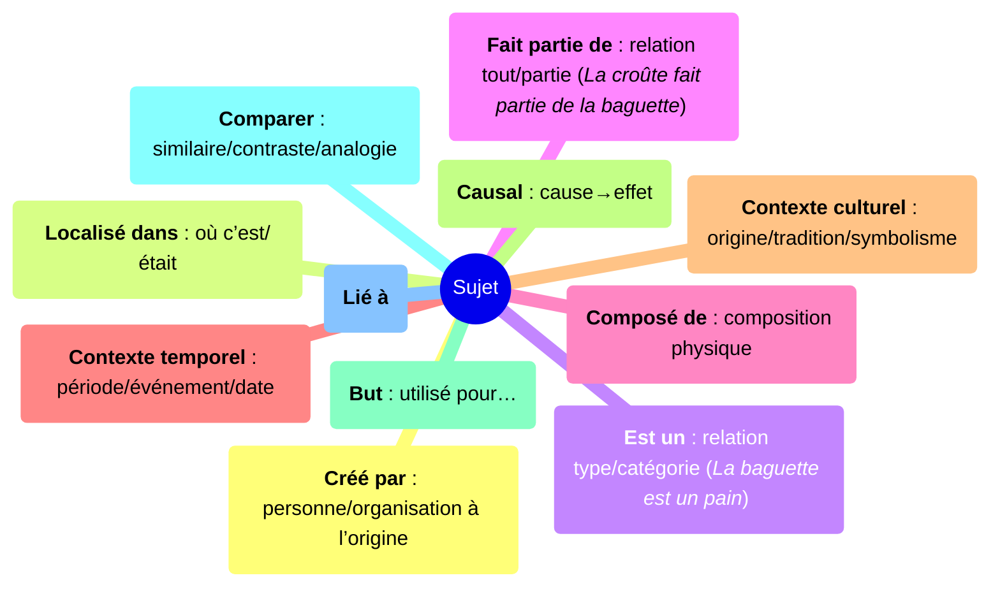

# Détails du module « Découvrir les cultures »

## Contenu

### Mots

On s’appuie sur tous les mots du [module Apprendre une langue](./learnlanguage_module.md).

Les mots sont présentés par les Lettres Vivantes (LL), qui prononcent les mots lorsqu’on interagit et apparaissent dans les dialogues. Cela renforce l’apprentissage de manière ludique et contextuelle.  

> [!note] Base de mots
> Liste actuelle de [tous les mots du jeu](../content/words/index.md)

### Cartes
Au cœur de chaque quête se trouvent des Cartes, « atomes de connaissance » : faits, personnes, lieux, objets, traditions, aliments, faune et flore.

Chaque carte :

- a un **titre** et une **description** simple
- comporte au moins une **image** et peut avoir des **sons**
- est située dans l’espace (une ville, par ex.) et le temps (chronologies)
- reste **cachée jusqu’à la découverte** dans les quêtes
- est toujours accessible depuis le **Livre** du joueur

Chaque carte a un **type**, par ex. :

- **Lieu** (OÙ) : villes, rivières, montagnes, monuments
- **Événement** (QUAND) : événements historiques, fêtes, festivals
- **Personne** (QUI) : personnages historiques, enseignants, amis
- **Objet** (QUOI) : éléments à collecter/interagir
- **Concept** (PENSER) : idées abstraites (amitié, sécurité, paix)
- **Activité** (FAIRE) : jeux, cuisine, sports

et est liée à une ou plusieurs **disciplines** :

Disciplines principales :

- **Art** – produire et créer
- **Culture** – modes de vie
- **Géographie** – où sont les choses
- **Histoire**
- **Littérature** – histoires et livres
- **Maths** – nombres et logique
- **Sciences** – comment ça marche
- **Technologie** – sciences appliquées

Disciplines supplémentaires :

- **Animaux**
- **Alimentation**
- **Musique**
- **Plantes**
- **Loisirs** – danse, bricolage, randonnée, jeux
- **Espace**
- **Sport**
- **Transports** – voitures, avions, bateaux
- **Météo**

Vie sociale et pratique :

- **Éducation civique**
- **Communauté**
- **Éducation**
- **Environnement**
- **Famille**
- **Amitié**
- **Santé**
- **Argent**
- **Sécurité**
- **Temps**

> [!note] Base de cartes
> Liste actuelle de [toutes les cartes du jeu](../content/cards/index.md)

### Sujets
Les sujets sont définis par les enseignants en reliant des cartes et en formant un **graphe de connaissances** visible.

Ces graphes sont au cœur des activités didactiques. Faciles à explorer, ils montrent les liens entre éléments culturels et servent de base aux quêtes/activités.

Voici les types de liens disponibles dans le jeu :

> [!note] Base de sujets
> Liste actuelle de [tous les sujets du jeu](../content/topics/index.md)

## Quêtes

Les quêtes sont de courtes aventures (5–15 min) centrées sur des thèmes culturels/éducatifs, avec 1–2 **sujets**.

Chaque quête combine :

- exploration de lieux authentiques
- rencontres de personnages
- énigmes et mini‑jeux
- collecte d’éléments culturels (**Cartes**)

- Deux niveaux de jeu :
  - Première partie : contenu essentiel.  
  - Rejouer : tâches supplémentaires, objets cachés, fragments de cartes spéciales pour une gemme finale.

### Histoire et gameplay
Chaque quête a son histoire et propose des défis variés, par exemple :

- **Objets cachés** : trouver des objets grâce aux indices (PNJ/panneaux)
- **Collection** : rassembler tous les objets (renforcement mathématique)
- **Énigmes physiques** : labyrinthes, déplacements spatiaux
- **Narratif** : quêtes linéaires avec narrateur
- **Quiz culturels** : PNJ questionnant sur les éléments découverts
- **Mini‑jeux** : artisanat, sports, pratiques culturelles

### Personnages

**Lettres Vivantes (LL)**  
Compagnes principales du module Langue, elles relient des mots aux PNJ. Elles peuvent représenter :

- une lettre (petite LL)
- un mot et son dessin (LL normale)
- une carte (image ou son)

**Personnages « blocky »**  
Humanoïdes façon Minecraft.

**PNJ d’ambiance**  
Pigeons, chats, chiens, voitures, trains, oiseaux (IA).  

### Tâches
« Que dois‑je faire ? » est clarifié par des Tâches. En parlant aux personnages, le joueur reçoit des objectifs à accomplir :

- collecter des objets (tous les ingrédients d’une recette)
- atteindre un lieu (gravir le Mont‑Blanc ou la Tour Eiffel)
- déclencher une action (baisser le pont‑levis du château)

### Système de progression

- Les quêtes se terminent avec 1–3 étoiles selon les erreurs.  
- Les événements bonus/malus influent sur la progression.  

### Cartes spéciales

Rejouer peut révéler des fragments de cartes spéciales, menant à la gemme finale de la quête.  
Une fois maîtrisée, la répétition donne des cookies mais plus de gemmes.

### Activités

Les activités peuvent être intégrées aux quêtes ou lancées séparément depuis le Livre et portent sur des sujets.

> [!note]
> Une nouveauté du framework : demander à une activité de renforcer un sujet, en récupérant automatiquement les cartes à jouer.

- **Ordre** : remettre dans la séquence
- **Piano** : répéter mélodies/couleurs
- **Toile** : nettoyer pour révéler
- **Argent** : compter pièces et billets
- **Puzzle** : images culturelles
- **Mémoire** : paires de cartes
- **Quiz** : réponses texte/image/mixte
- **Évaluations finales** : vérifications après quêtes

Explorer toutes les activités : [Aperçu des activités](../content/activities/index.md).

### Langues
Tous les dialogues sont bilingues : langue maternelle + langue du pays d’accueil (ex. polonais, français), ce qui facilite la compréhension.  
Par défaut, le jeu parle d’abord la langue d’apprentissage puis la langue maternelle, mais l’enseignant peut inverser si besoin.

### Niveaux de difficulté

Le gameplay et le contenu sont classés en trois niveaux :

- Facile
- Normal
- Expert

Les enseignants ajustent la difficulté dans le Panneau pour adapter temps, aides et densité de défis. Certaines quêtes débloquent des tâches optionnelles au rejouer.

### Lieux
Chaque quête se déroule dans un lieu précis (ville/quartier) sélectionnable sur la carte du monde. Deux méthodes de création :

1. **Art abstrait**  
Env. génériques avec modèles 3D communs. Adapté aux sujets peu liés à un emplacement.

2. **Cartes réalistes**  
La ville est construite à partir d’une carte réelle ([OpenStreetMap](https://www.openstreetmap.org)), avec coordonnées/orientation. Idéal pour les quêtes urbaines où l’orientation compte.

## Gameplay

### Menu Terre

Point d’entrée pour explorer monde, pays et quêtes.  
Accès au Livre (réviser) et à la Boutique (personnalisation).  

**Dépendances**  
Certaines quêtes exigent des prérequis.  

### Carte et points cibles

- Le bouton Carte affiche la position et l’objectif principal.  
- Un **cibleur** indique le prochain but ; des indices apparaissent lors des changements.  
- Tâches optionnelles et objets cachés peuvent apparaître en icônes.  

### Interactions et inventaire

- Interactions : Parler, Inspecter, Collecter, Utiliser.  
- Inventaire : jusqu’à 5 emplacements ; usage auto et disparition après utilisation.  

### Modes (Classe vs Maison)

- En mode Classe : focus sur un pays/sujet et quêtes libres à l’intérieur.  
- Mode Maison : tous pays sélectionnables et quêtes débloquées séquentiellement.  

### Accessibilité

- Sous‑titres et icônes aident la lecture et le multilingue.  
- Le mode Classe réduit le bruit.  
- Toutes les phrases sont prononcées dans toutes les langues.  
- Marqueurs de couleur, forme et son.  

### Appareils et commandes

Clavier/souris et tactile. Voir [Comment jouer](./discover_how_to_play.md) pour commandes, carte, interactions et galerie d’activités.  

## Motivation et récompenses

- Cartes de connaissance = preuves d’apprentissage.  
- Gemmes = déblocage de quêtes avancées et d’objets.  
- Cookies = personnalisation du personnage et de l’espace.  
- Étoiles = motivation à compléter et rejouer.  
- Succès = objectifs long terme et défis ludiques.

### Monnaies

- Cookies (poissons) = trouvés dans les quêtes ; se régénèrent avec le temps.  
- Gemmes de connaissance (neurones) = récompense de maîtrise ; représentent le **progrès réel**.  
- Points d’XP = expérience gagnée en jouant ; utilisée pour la progression.

### Boutique / Personnalisation du chat

- Utiliser des cookies pour acheter skins et accessoires.  
- Certains objets se débloquent après certaines gemmes ou cartes.

### Succès
Succès globaux/locaux qui encouragent la rejouabilité.  
Exemples :

- Collecter toutes les cartes
- Acheter des cosmétiques pour le chat
- Finir toutes les quêtes
- Objectifs de maîtrise (3 étoiles partout)
- Objectifs fun (1000 sauts, sprint 60 s, parler à tous)

### Système bonus/malus
Renforce **citoyenneté et conscience culturelle** en récompensant certaines actions.

- Exemples bonus : parler aux PNJ, respecter les feux, ramasser les déchets.  
- Exemples malus : traverser au rouge, abîmer, piétiner les fleurs.  

Ces actions sont consignées dans le Livre pour réfléchir aux comportements.  

## Outils pour enseignants et parents

### Panneau enseignant

- créer une classe et ajouter des joueurs
- pour chaque joueur, ajuster la difficulté, choisir le mode de langue, suivre quêtes et succès  

### Le Livre
Révision de toutes les connaissances : cartes découvertes/non découvertes, gemmes, succès.  
Outil de révision en classe et à la maison.

### Site web
Affiche sujets, cartes, activités couverts pendant une séance.  

### Intégration en classe

Après une quête, les enseignants peuvent :  

- Refaire le graphe de connaissances.  
- L’enrichir avec les idées des élèves.  
- Raconter la quête en classe.  
- Comparer avec des ressources réelles (cartes, livres, visites).  

Exemple de débrief (10 min) :  

- « Quelle carte as‑tu débloquée ? À quoi se relie‑t‑elle ? »  
- Au tableau : « Baguette → Pain → Cuisine française », puis ajouter des idées.  
- Partage en binômes : expliquer un nouveau mot et où il est apparu.  

### Analytique

> [!note]
> Nous respectons la vie privée et l’anonymat. Les données de jeu sont collectées sans identifiants personnels.  
> Le lien élève‑profil (si nécessaire) est géré par l’enseignant selon les politiques de l’établissement.

- Journal des événements (temps de jeu, essais de quêtes, bonus/malus, cartes).  
- Export possible en JSON ou xAPI.  
- En classe, résumés simplifiés (progrès, cartes, succès).  

## Conception des quêtes

- Défini avec le framework open‑source AdventurED.  
- Conçu via l’outil web DiscoverED :  
  - éditeur visuel de flux (histoire + tâches + quiz)  
  - traduction intégrée multi‑langues  
  - création collaborative avec des enseignants  

Docs : Conception des quêtes - https://docs.antura.org/manual/quests/

### Licences et crédits

- Ressources sur‑mesure ou Creative Commons (CC0/CC‑BY).  
- Crédits suivis pour les ressources externes (images, sons, modèles).  
