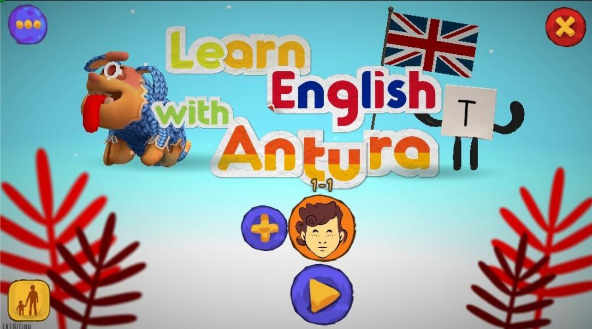
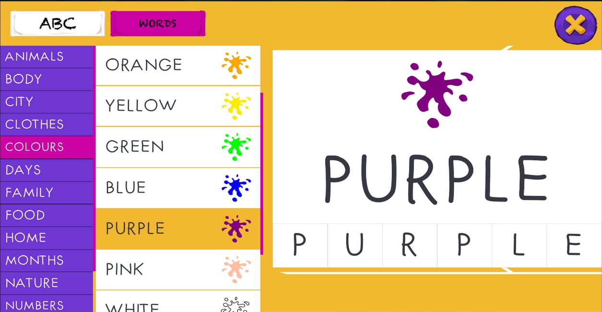
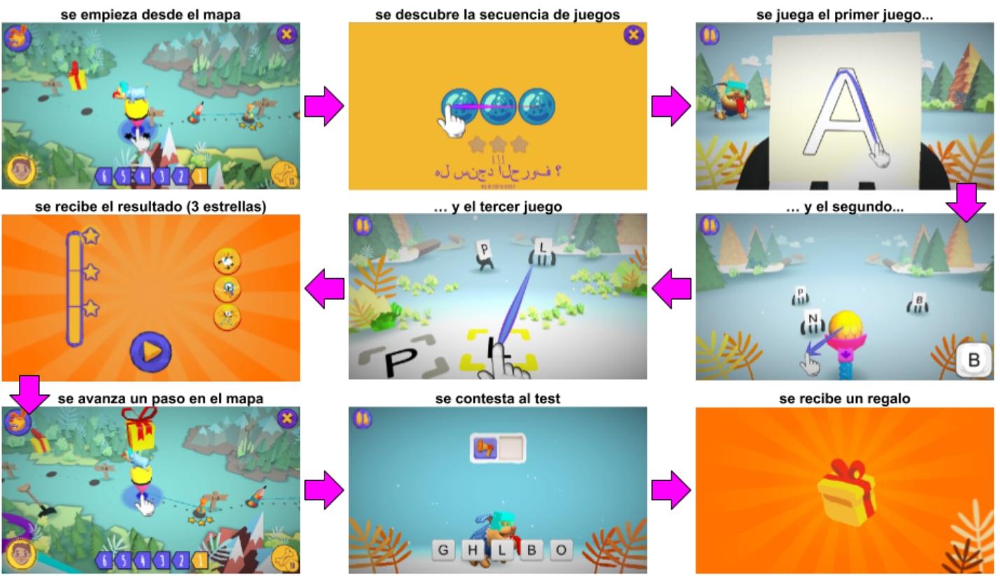
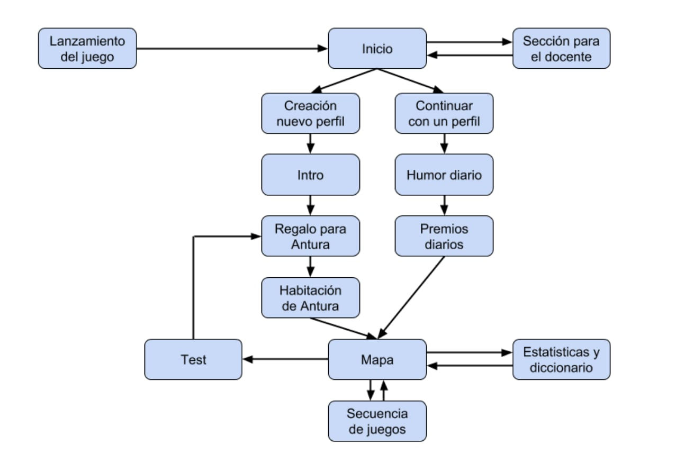
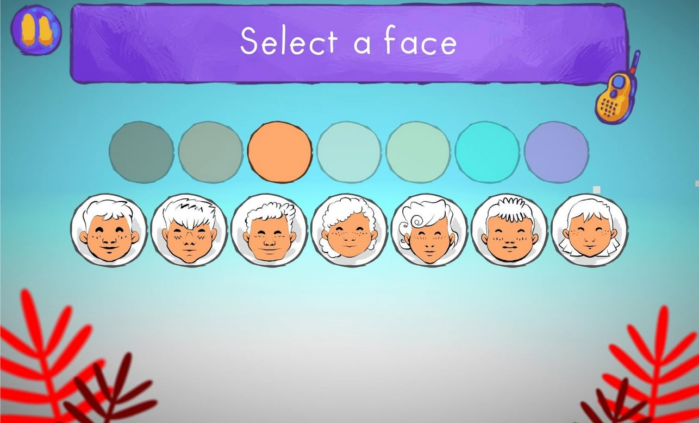
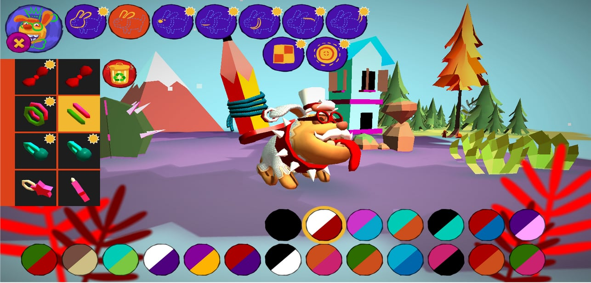
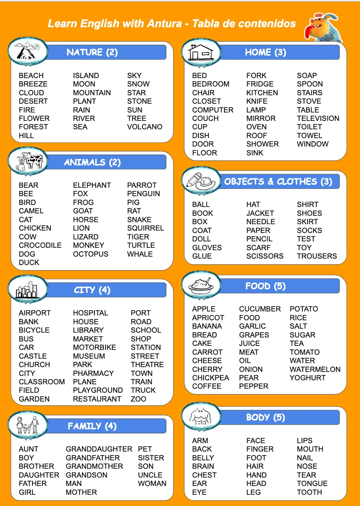
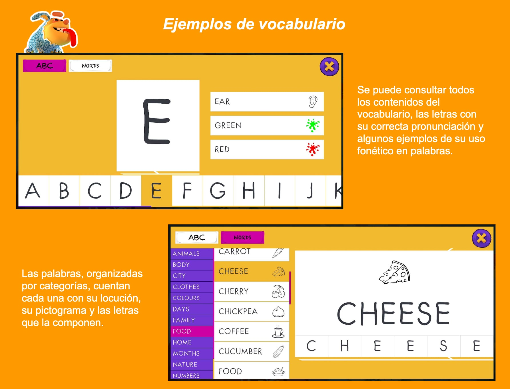

Apprendre les langues
=====================

Apprendre avec Antura est un jeu d’initiation à différentes langues (anglais, français, polonais, espagnol, arabe, …) comme langue seconde, destiné aux enfants de 5 à 9 ans; contenus équivalents au niveau **Pré‑A1** selon le **Cadre européen commun de référence pour les langues**.

Tout au long du jeu, les enfants apprennent l’alphabet complet, plus de 250 mots et une série de phrases et d’expressions simples, de manière ludique.

Le jeu est organisé en 6 mondes; chaque monde comprend entre 15 et 20 unités didactiques, chacune avec un objectif pédagogique spécifique. L’apprentissage se fait grâce à des mini‑jeux et se conclut par un test final pour consolider les acquis.

Modules d’apprentissage actuels
-------------------------------

Langues étrangères:

- Apprendre l’anglais  
- Apprendre le français  
- Apprendre l’allemand  
- Apprendre le hongrois  
- Apprendre l’italien  
- Apprendre le polonais  
- Apprendre le roumain  
- Apprendre l’espagnol  

Apprendre à lire sa langue:

- Apprendre à lire l’arabe  
- Apprendre à lire le persan dari  
- Apprendre à lire le pachto (en cours)  
- Apprendre à lire l’ukrainien (en cours)  

Langues d’interface prises en charge (voix/UI):

- Arabe, Anglais, Français, Allemand, Hongrois, Italien, Pachto (en cours), Persan Dari, Polonais, Roumain, Russe, Espagnol, Ukrainien

Objectifs
---------

L’objectif est d’initier à la langue sans prérequis, en contexte scolaire comme informel, en servant d’outil d’appui pédagogique et de démarche ludique.

Nous familiarisons les enfants avec le vocabulaire de base et la sonorité de la langue (niveau Pré‑A1), avec une grande attention à l’oral tout au long du jeu.

Le vocabulaire comprend plus de 250 mots organisés en thèmes, ainsi que des expressions qui introduisent des notions syntaxiques et grammaticales de façon transversale, pour « éduquer l’oreille ».

Méthodologie
------------

Apprendre avec Antura s’appuie sur un **apprentissage signifiant** dans un environnement ludique renforcé par la récompense. Il complète les approches communicatives par des mécaniques de jeu qui favorisent le **Stealth Learning**: l’enfant se concentre sur le jeu et ses défis, et apprend sans effort de mémorisation explicite.

Le jeu n’explique pas théoriquement: il propose un défi, guide les premiers pas, puis laisse progresser pour construire un modèle mental. À chaque interaction avec une lettre ou un mot, la prononciation correcte est donnée pour renforcer l’apprentissage.

Le contenu relie pictogrammes, prononciations et formes écrites en triangle pour permettre des inférences qui ancrent le vocabulaire via l’usage dans les mini‑jeux. L’écoute et l’association son‑image sont prioritaires.

Par ailleurs, des récompenses (biscuits) permettent d’acheter des accessoires pour personnaliser Antura, ajoutant une motivation à rejouer et à progresser.

Parcours pédagogique
--------------------

Le jeu comprend 6 mondes. Chacun regroupe des ensembles de mots; on travaille environ 50 mots par monde, organisés en groupes de 8 à 12.

Chaque groupe de mots est introduit par des mini‑jeux progressifs: d’abord découvrir, puis reconnaître, puis utiliser dans des phrases. Des phases de consolidation ponctuent l’avancée.

On commence par un monde d’introduction pour se familiariser avec la phonétique (alphabet) et un premier vocabulaire transversal. Mondes:

1) Alphabet  
2) Nature et animaux  
3) Maison, objets et vêtements  
4) Ville et famille  
5) Parties du corps et alimentation  
6) Calendrier, couleurs et nombres  

Fonctionnement
--------------

Voici le schéma des transitions entre sections de l’application:

Création de profil
------------------

Créez des profils personnalisés (visage, couleurs de peau/cheveux/fond). Les profils enseignants se créent depuis la Section Enseignant.

Espace d’Antura
---------------

Personnalisez Antura avec les cadeaux gagnés et dépensez des biscuits pour décorer sa chambre. Les photos prises sont enregistrées dans la galerie de l’appareil.

Carte
----

L’apprentissage est une progression à travers 6 mondes (montagnes, îles, prairie, désert, forêt, ville). Chaque session réussie fait avancer d’une étape; on peut rejouer des étapes pour réviser ou viser 3 étoiles. La carte donne aussi accès à la chambre et au dictionnaire.

Statistiques et dictionnaire
----------------------------

Consultez les statistiques et le dictionnaire: tous les mots du corpus et l’alphabet avec les phonèmes associés. Tous les mini‑jeux sont lançables depuis cette section pour s’entraîner.

Humeur quotidienne et prix
--------------------------

À chaque lancement quotidien, l’élève indique son humeur (5 émoticônes) puis reçoit des biscuits. Le nombre augmente en cas d’usage quotidien.

Section Enseignant
------------------

Section protégée (accès enfant empêché) pour:  

- Créer un profil « Enseignant » avec accès libre à tout le contenu  
- Consulter les progrès d’un profil en observateur  

Code d’accès: appuyer 5 fois sur le bouton vert puis 1 fois sur le rouge. Le profil enseignant démarre à la fin du jeu pour naviguer librement.

Unités didactiques
------------------

Chaque monde comporte 15–20 unités, chacune conclue par un test. Sur la carte: repères filets pour les unités, crayons pour les consolidations, boîtes aux lettres pour les phrases.

Contenus lexicaux
------------------

Monde 1: Alphabet
-----------------

Groupes de lettres:

1. E,I,O,S,T,L 
2. A,R,N,U,C
3. P,M,D,V,G
4. F,B,H,Q,X
5. Y,J,K,Z,W

Séquence type (3 unités):

1) Découvrir les lettres et leur nom  
    - ColorTickle_LetterName  
    - ThrowBalls_LetterName  
    - FastCrowd_LetterName  
    - Assessment_LetterName (test)  

2) Reconnaitre les lettres par leur nom  
    - Song_Alphabet  
    - Egg_LetterName  
    - HideSeek_LetterName  
    - Assessment_LetterName (test)  

3) Découvrir des mots avec les lettres connues  
    - FastCrowd_BuildWord  
    - ThrowBalls_BuildWord  
    - Egg_BuildWord  
    - Assessment_OrderLettersOfWord (test)  

Découvrir le vocabulaire
------------------------

Pour les mondes 2 à 6, environ 50 mots par monde, en sous‑groupes de ~10. Séquence type (4 unités):

1) Découvrir et reconnaitre par l’image et le son  
    - ColorTickle_Image  
    - ThrowBalls_Image  
    - FastCrowd_Image  
    - Balloons_Image  
    - Egg_Image  
    - HideSeek_Image  
    - Assessment_MatchWordToImage (test)  

2) Découvrir par l’écrit, les sons et les dessins  
    - ThrowBalls_BuildWord  
    - FastCrowd_BuildWord  
    - Egg_BuildWord  
    - MixedLetters_BuildWord  
    - Assessment_MatchWordToImage (test)  

3) Reconnaitre par l’écrit, les sons et les dessins  
    - ThrowBalls_Word  
    - FastCrowd_Word  
    - Balloons_Word  
    - Assessment_SelectPronouncedWord (test)  

4) S’habituer à de courtes phrases avec les mots appris  
    - Song_Word  
    - ReadingGame_Phrase  
    - MissingLetter_Phrase  
    - Assessment_QuestionAndReply (test)  

Monde 2: Animaux et nature
--------------------------

Nature:  
BEACH, BREEZE, CLOUD, DESERT, FIRE, FLOWER, FOREST, HILL, ISLAND, MOON, MOUNTAIN, PLANT, RAIN, RIVER, SEA, SKY, SNOW, STAR, STONE, SUN, TREE, VOLCANO

Animaux:  
BEAR, BEE, BIRD, CAMEL, CAT, CHICKEN, COW, CROCODILE, DOG, DUCK, ELEPHANT, FOX, FROG, GOAT, HORSE, LION, LIZARD, MONKEY, OCTOPUS, PARROT, PENGUIN, PIG, RAT, SNAKE, SQUIRREL, TIGER, TURTLE, WHALE

Monde 3: Maison, objets, vêtements
----------------------------------

Maison:  
BED, BEDROOM, CHAIR, CLOSET, COMPUTER, COUCH, CUP, DISH, DOOR, FLOOR, FORK, FRIDGE, KITCHEN, KNIFE, LAMP, MIRROR, OVEN, ROOF, SHOWER, SINK, SOAP, SPOON, STAIRS, STOVE, TABLE, TELEVISION, TOILET, TOWEL, WINDOW

Objets et vêtements:  
BALL, BOOK, BOX, COAT, DOLL, GLOVES, GLUE, HAT, JACKET, NEEDLE, PAPER, PENCIL, SCARF, SCISSORS, SHIRT, SHOES, SKIRT, SOCKS, TEST, TOY, TROUSERS

Monde 4: Ville et famille
-------------------------

Ville:  
AIRPORT, BANK, BICYCLE, BUS, CAR, CASTLE, CHURCH, CITY, CLASSROOM, FIELD, GARDEN, HOSPITAL, HOUSE, LIBRARY, MARKET, MOTORBIKE, MUSEUM, PARK, PHARMACY, PLANE, PLAYGROUND, RESTAURANT, PORT, ROAD, SCHOOL, SHOP, STATION, STREET, THEATRE, TOWN, TRAIN, TRUCK

Famille:  
AUNT, BOY, BROTHER, DAUGHTER, FATHER, GIRL, GRANDDAUGHTER, GRANDFATHER, GRANDMOTHER, GRANDSON, MAN, MOTHER, PET, SISTER, SON, UNCLE, WOMAN

Monde 5: Alimentation et corps
------------------------------

Alimentation:  
APPLE, APRICOT, BANANA, BREAD, CAKE, CARROT, CHEESE, CHERRY, CHICKPEA, COFFEE, CUCUMBER, FOOD, GARLIC, GRAPES, JUICE, MEAT, OIL, ONION, PEAR, PEPPER, POTATO, RICE, SALT, SUGAR, TEA, TOMATO, WATER, WATERMELON, YOGHURT

Corps:  
ARM, BACK, BELLY, BRAIN, CHEST, EAR, EYE, FACE, FINGER, FOOT, HAIR, HAND, HEAD, LEG, LIPS, MOUTH, NAIL, NOSE, TEAR, TONGUE, TOOTH

Monde 6: Calendrier, couleurs, nombres
--------------------------------------

Couleurs:  
BLACK, BLUE, BROWN, GREEN, GREY, ORANGE, PINK, PURPLE, RED, WHITE, YELLOW

Jours et saisons:  
MONDAY, TUESDAY, WEDNESDAY, THURSDAY, FRIDAY, SATURDAY, SUNDAY, SPRING, SUMMER, AUTUMN, WINTER

Nombres:  
ZERO, ONE, TWO, THREE, FOUR, FIVE, SIX, SEVEN, EIGHT, NINE, TEN, ELEVEN, TWELVE, THIRTEEN, FOURTEEN, FIFTEEN, SIXTEEN, SEVENTEEN, EIGHTEEN, NINETEEN, TWENTY

Mois:  
JANUARY, FEBRUARY, MARCH, APRIL, MAY, JUNE, JULY, AUGUST, SEPTEMBER, OCTOBER, NOVEMBER, DECEMBER

