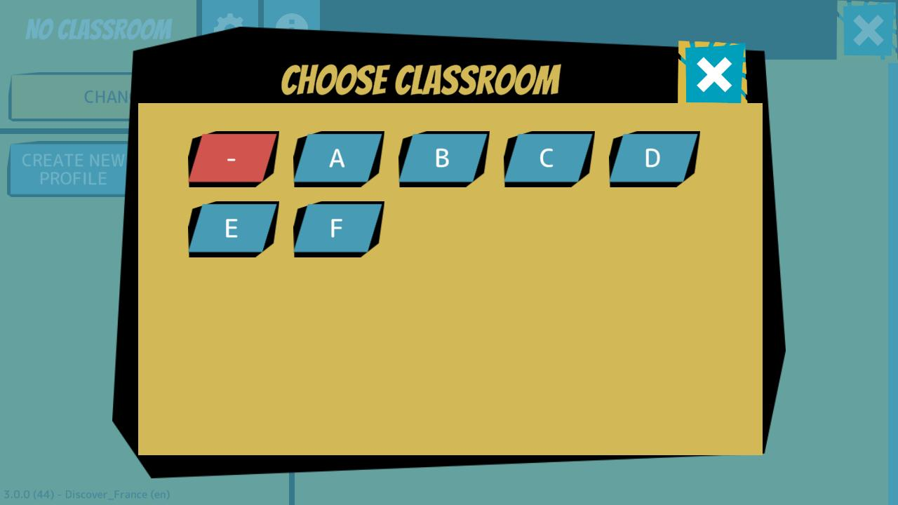
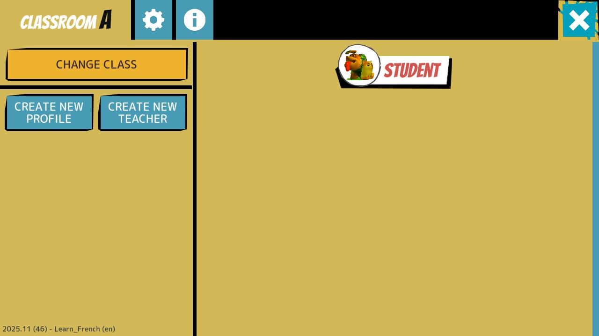
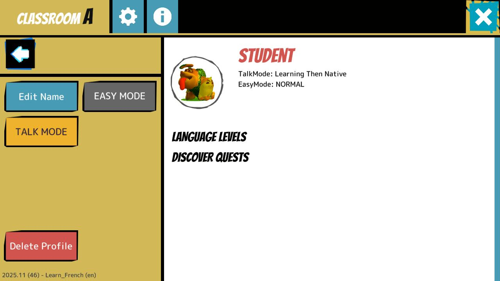

# Configuration

> [!note]
> Le jeu est identique sur toutes les plateformes, les instructions suivantes sont donc valables pour tous les appareils que vous utilisez pour jouer.

## Premiers pas
Lorsque vous lancez le jeu, la première chose qui vous est demandée est votre langue maternelle.
Une douzaine de langues maternelles sont actuellement prises en charge.

Suivez ensuite les instructions pour créer votre premier profil.

> [!note]
> Si l'écran suivant n'apparaît pas, il s'agit d'un bug. Veuillez fermer l'application et la redémarrer. Après le redémarrage de l'application, le bug ne devrait plus se produire.

Votre langue maternelle ne vous est demandée que lors du premier démarrage du jeu, mais vous pouvez toujours la modifier en appuyant sur le bouton de langue situé dans le coin supérieur droit.

> [!note]
> Antura peut être utilisé par les enseignants en classe ou par les familles pour l'apprentissage autonome à la maison (ou ailleurs). Cependant, comme nous testons actuellement plusieurs nouvelles fonctionnalités en France et en Pologne dans le cadre du projet ANTURA Erasmus+, la section suivante se concentre sur les enseignants qui utilisent le jeu dans leurs classes.

## Espace enseignants

Si vos élèves sont répartis en groupes/classes, la première chose à faire est de sélectionner la classe.
Appuyez sur le bouton dans le coin inférieur gauche, puis suivez les instructions pour accéder à l'espace enseignants.

## Sélection de la classe

Une fois dans l'espace enseignants, vous pouvez « changer de classe » : les différentes classes sont définies par une lettre (A, B, C...) ou un chiffre (1, 2, 3...).

> [!note]
> Par défaut, le jeu commence dans la classe « - », ce qui signifie « aucune classe », mais pour une utilisation correcte en classe, il est préférable de toujours sélectionner une classe.
Veuillez attribuer une lettre ou un chiffre unique à chacun de vos groupes/classes et le noter, car vous devrez le sélectionner chaque fois que vous utiliserez Antura avec un groupe/une classe spécifique.

## Créer des profils d'élèves

Une fois la première classe sélectionnée, vous remarquerez que la classe est vide, 

Appuyez sur « Créer un nouveau profil » pour ajouter un élève à cette classe.

> [!note]
> Veuillez ignorer le bouton « Créer un nouvel enseignant ». Il va être supprimé.

## Modifier le nom du profil

Une fois le profil complet, il apparaîtra dans la classe, mais sous le nom standard « STUDENT ».
  

Vous pouvez maintenant sélectionner le profil (en appuyant sur son icône ou son nom)...

... puis définir son nom en appuyant sur « Modifier le nom ».

## Modifier les paramètres du profil

Vous pouvez également activer le « MODE FACILE » (pour réduire la difficulté du jeu pour cet élève en particulier) et sélectionner le « MODE CONVERSATION » (qui détermine les langues que le jeu doit utiliser pour cet élève en particulier).

Les options disponibles sont les suivantes :
- **Native Only** : le jeu utilise uniquement la langue maternelle
- **Learning Language Only** : le jeu utilise uniquement la langue d'apprentissage (c'est-à-dire le français ou le polonais)
- **Langue d'apprentissage puis langue maternelle** : le jeu utilise d'abord la langue d'apprentissage, puis répète dans la langue maternelle
- **Langue maternelle puis langue d'apprentissage** : le jeu utilise d'abord la langue maternelle, puis répète dans la langue d'apprentissage

> [!REMARQUE IMPORTANTE]
> Tous les profils sont uniquement enregistrés localement sur l'appareil sur lequel ils ont été créés. Chaque élève doit donc toujours utiliser le même appareil afin de pouvoir utiliser son propre profil. Il est fort probable que vous deviez créer un seul profil __par classe__ sur chaque appareil, car celui-ci sera toujours utilisé par le même élève lorsque vous serez dans cette classe !

## Se préparer à jouer

Une fois que vous avez terminé de créer et de modifier le profil de votre classe, vous pouvez revenir au menu principal en appuyant sur la flèche de retour à gauche et sur le bouton X en haut à droite de l'écran.

> [!Rappel]
> Avant de laisser un élève jouer, vous devez définir sa langue maternelle en appuyant sur le bouton situé dans le coin supérieur droit.

## Sélectionner ce qu'il faut apprendre

Appuyez sur le bouton Jouer situé sous le profil actif pour sélectionner ce que vous souhaitez apprendre.
Le jeu propose une liste de livres que vous pouvez faire défiler en glissant l'écran vers la droite ou vers la gauche.
Chaque livre représente un programme différent, un ensemble de contenus à apprendre sur un sujet spécifique. Le jeu prend actuellement en charge deux types principaux de programmes :
- **Apprendre les langues** : une introduction à une langue étrangère
- **Découvrir un pays et sa culture** : pour aider à l'intégration des enfants migrants dans leur pays d'accueil

> [!note]
> En arabe et en persan, vous pouvez également **apprendre à lire** dans votre langue maternelle, mais ce programme d'alphabétisation a beaucoup en commun avec **l'apprentissage d'une langue**, nous nous concentrerons donc sur ce dernier dans ce manuel.

Pour les tests du projet ANTURA Erasmus+ en France et en Pologne, nous nous concentrerons sur 4 livres :
- Découvrir la France et apprendre le français
- Découvrir la Pologne et apprendre le polonais

Les sections suivantes expliquent en détail les modules [Apprendre les langues](./learnlanguage_module.md) et [Découvrir la culture](./discover_introduction.md), en plus de présenter un guide sur [Comment les utiliser en classe](./classroom_guide.md)
