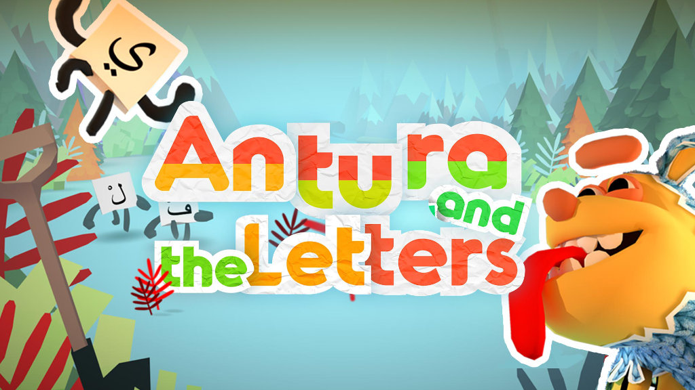

this documentation website is dedicated to Teachers, Designers and Developers, maintained by the Antura Core Team directly inside the project repository as an handbook for whatever can't be put inside the Source Code itself.

- **Antura Docs:** [docs.antura.org](http://docs.antura.org)
- **GitHub project:** [github.com/vgwb/Antura](https://github.com/vgwb/Antura)
- **Public Website:** [www.antura.org](http://www.antura.org)

- [Changelog](Changelog.md) history of app releases and major changelog
- [User, Tester and Dev HowTo](HowTo/) several HowTo guides
- [Game Design](GameDesign/)
- [Project Architecture and Modules](Modules/) mostly for Developers
- [MiniGames](Minigames/) Design and Developer docs
- [API](API/) the automatically generated DoxyGen docs
- [Credits](Credits.md)

## Issues and Contacts
Did you find an issue or error in these docs or have some suggestions?
please help us improve by [opening a issue](https://github.com/vgwb/Antura/issues)

## License

Antura is licensed under the BSD 2-clause "Simplified" License and the Creative Commons Attribution 4.0 International.
Copyright [TH Köln / Cologne Game Lab](http://www.colognegamelab.de/), [Video Games Without Borders](http://vgwb.org) & [Wixel Studios](www.wixelstudios.com)

