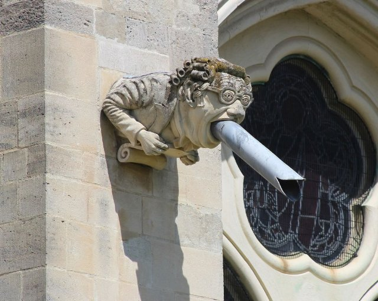
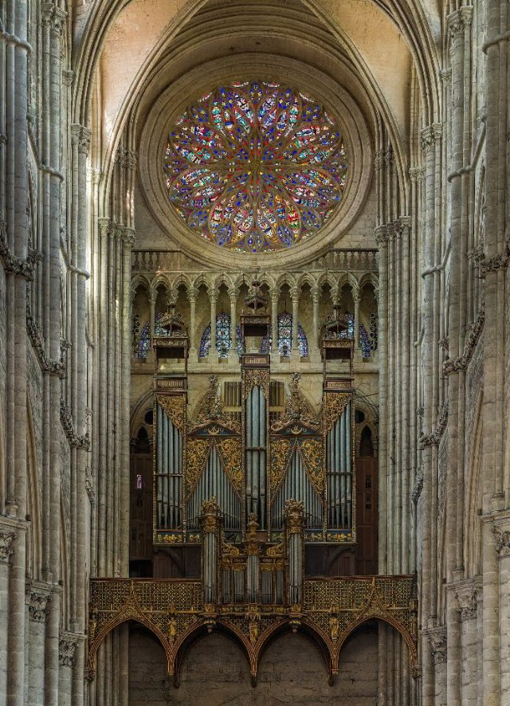

# Parigi! (fr_01)
> [!note] Educators & Designers: help improving this quest!
> **Comments and feedback**: [discuss in the Forum](https://antura.discourse.group/t/fr-01-paris/23/1)  
> **Improve script translations**: [comment the Google Sheet](https://docs.google.com/spreadsheets/d/1FPFOy8CHor5ArSg57xMuPAG7WM27-ecDOiU-OmtHgjw/edit?gid=755037318#gid=755037318)  
> **Improve Cards translations**: [comment the Google Sheet](https://docs.google.com/spreadsheets/d/1M3uOeqkbE4uyDs5us5vO-nAFT8Aq0LGBxjjT_CSScWw/edit?gid=415931977#gid=415931977)  
> **Improve the script**: [propose an edit here](https://github.com/vgwb/Antura/blob/main/Assets/_discover/_quests/FR_01%20Paris/FR_01%20Paris%20-%20Yarn%20Script.yarn)  

- Version: 1.00
- Status: Production
- Location: France - Parigi

- Difficulty: Normal
- Duration (min): 20
- Kind:
  - Parkour
  - Seek
  - Orientation
- Description: viaggia per Parigi cercando Antura!

## Design Notes
## Game Design Notes

Explore Paris tour through iconic landmarks.

Location:
Paris, France

1. Learn about Eiffel Tower construction
2. Bakery and French baguette making with ingredient collection
3. visit Notre-Dame architecture

### Flow

Guide welcomes

**Part 1: La Tour Eiffel and Gustave Eiffel**
Mission: Climb the Eiffel Tower with the elevator.

Collect 5 coins to buy ticket

**Part 2: Notre Dame de Paris**
Mission: find the 3 pieces of the map

**Part 3: La Baguette**
Mission: Learn the art of making the perfect baguette and discover its cultural significance in French society.

## Topics
### Eiffel Tower {#eiffel-tower}
[Open topic page](../../topics/index.md#eiffel-tower)  

What we need to know about the iconic Paris landmark

- Importance: Critical  
- Country: France  
- Target age: Ages3to5  
- Subjects: History

#### Core Card - Torre Eiffel
Un'alta torre, simbolo di Parigi. È fatta di ferro e alta 300 metri. È possibile salire e ammirare l'intera città.

{ width="200" }
- Type: Place
- Subjects: Geography, History, Culture
- Year: 1889

#### Connection (LocatedIn) - Parigi
La capitale della Francia. Parigi ha una famosa torre alta chiamata Torre Eiffel!

{ width="200" }
- Type: Place
- Subjects: Geography, Culture

#### Connection (CreatedBy): Gustave Eiffel designed and built the tower - Gustave Eiffel
L'uomo che costruì la Torre Eiffel! Era un ingegnere che amava costruire in ferro e creò la torre più famosa del mondo.

{ width="200" }
- Type: Person
- Subjects: History, Culture, Science
- Year: 1832

#### Connection (MadeOf) - Ferro
Uno strumento caldo utilizzato per rendere i vestiti stropicciati lisci e piatti. Attenzione, i ferri da stiro sono molto caldi!

{ width="200" }
- Type: Object
- Subjects: Science

#### Connection (RelatedTo) - Mappa della Torre Eiffel
Una mappa che mostra dove si trova la famosa torre alta di Parigi.

{ width="200" }
- Type: Object
- Subjects: Community, Culture

#### Connection (RelatedTo) - biglietto per la Torre Eiffel
Una carta speciale che ti consente di visitare la famosa torre alta di Parigi, in Francia.

{ width="200" }
- Type: Object
- Subjects: Science

### Notre Dame {#notredame}
[Open topic page](../../topics/index.md#notredame)  

- Importance: High  
- Country: France  
- Target age: Ages6to10  
- Subjects: Culture

#### Core Card - Notre-Dame de Paris
Una splendida cattedrale di Parigi. Le sue vetrate colorate raccontano storie.

{ width="200" }
- Type: Place
- Subjects: Geography, Environment
- Year: 1885

#### Connection (LocatedIn) - Parigi
La capitale della Francia. Parigi ha una famosa torre alta chiamata Torre Eiffel!

{ width="200" }
- Type: Place
- Subjects: Geography, Culture

#### Connection (TimeContext): notable event - Incendio di Notre-Dame
Nel 2019, un grande incendio ha danneggiato la splendida Cattedrale di Notre-Dame a Parigi. Molte persone hanno collaborato per salvare questo importante edificio.

{ width="200" }
- Rationale: This event teaches kids about protecting cultural heritage and community cooperation
- Type: Concept
- Subjects: History, Culture, Environment
- Year: 2019

#### Connection (LocatedIn) - Île-de-France
Una regione della Francia dove si trova la capitale Parigi. Qui vivono moltissime persone!

{ width="200" }
- Type: Place
- Subjects: Geography, Environment

### Baguette {#baguette}
[Open topic page](../../topics/index.md#baguette)  

the french bread famous all around the world!

- Importance: Medium  
- Country: France  
- Target age: Ages3to5  
- Subjects: Food

#### Core Card - Baguette francese
Un pane lungo e croccante, il più famoso in Francia. I francesi comprano baguette fresche ogni giorno dal panettiere!

{ width="200" }
- Rationale: Baguettes are iconic French culture that kids can easily understand and remember
- Type: Object
- Subjects: Food, Culture
- Year: 1700

#### Connection (LocatedIn) - Parigi
La capitale della Francia. Parigi ha una famosa torre alta chiamata Torre Eiffel!

{ width="200" }
- Type: Place
- Subjects: Geography, Culture

#### Connection (CreatedBy) - Panettiere
Una persona che prepara pane, torte e pasticcini.

{ width="200" }
- Type: Person
- Subjects: History, Culture

#### Connection (MadeOf) - Sale
Cristalli bianchi che migliorano il sapore del cibo.

{ width="200" }
- Type: Object
- Subjects: Food, Culture

#### Connection (MadeOf) - Lievito
Il lievito è come una polvere magica che rende il pane morbido e gustoso!

{ width="200" }
- Type: Object
- Subjects: Food, Culture

#### Connection (MadeOf) - Farina
Polvere bianca ricavata dal grano, utilizzata per fare il pane.

{ width="200" }
- Type: Object
- Subjects: Food, Science

#### Connection (MadeOf) - Acqua
L'acqua è essenziale per tutta la vita

{ width="200" }
- Type: Object
- Subjects: Food, Culture

## Additional Cards
#### Louvre
Un enorme museo pieno d'arte. È lì che vive la Monna Lisa.

{ width="200" }
- Type: Place
- Subjects: Art, Culture, History
- Year: 1793

#### Cattedrale
Una chiesa molto grande e importante in una città.

{ width="200" }
- Type: Place
- Subjects: Culture, History, Education

#### Chiesa
Un edificio speciale dove le persone si incontrano per pregare e cantare.

{ width="200" }
- Type: Place
- Subjects: Culture, Civics, Education

#### Ascensori della Torre Eiffel
Ascensori che portano i visitatori sulla torre di ferro.

{ width="200" }
- Type: Object
- Subjects: Technology, Transportation

#### Arco rampante
Braccia in pietra all'esterno che aiutano a sostenere alte mura.

{ width="200" }
- Type: Concept
- Subjects: Technology, History, Art

#### Gargoyle
Una statua divertente o spaventosa che funziona anche come sgorgatore di pioggia.

{ width="200" }
- Type: Concept
- Subjects: Art, Technology, History

#### Rosone
Una grande vetrata rotonda che racconta storie attraverso la luce.

{ width="200" }
- Type: Concept
- Subjects: Art, Culture, History

#### Esposizione universale (1889)
La grande esposizione universale in cui venne esposta la Torre Eiffel.

{ width="200" }
- Type: Concept
- Subjects: History, Culture

#### Arco di Trionfo
Un grande arco a Parigi, costruito in onore degli eroi. Lo si può vedere splendere alla fine di un lungo viale!

{ width="200" }
- Type: Place

#### Louvre
Un enorme museo pieno d'arte. È lì che vive la Monna Lisa.

{ width="200" }
- Type: Place
- Subjects: Art, Culture, History
- Year: 1793

## Quest Script

[See the full script here](./fr_01-script.md)

## Words
## Activities
- [JigsawPuzzle](../../activities/index.md#JigsawPuzzle)
- [Memory](../../activities/index.md#Memory)
- [MoneyCount](../../activities/index.md#MoneyCount)
- [Memory](../../activities/index.md#Memory)
- [CleanCanvas](../../activities/index.md#CleanCanvas)
- [JigsawPuzzle](../../activities/index.md#JigsawPuzzle)
- [Match](../../activities/index.md#Match)

## Tasks
- [Interact] go_eiffell
- [Collect] collect_coins
- [Interact] go_notredame
- [Interact] go_arc
- [Interact] go_louvre
- [Interact] go_baker
## Credits
- Anne (France) (content)
- Fabio Cecere (Italy) (design)
- Lucie Paillat (France) (content)
- [Stefano Cecere](https://stefanocecere.com) (Italy) (design, development)
