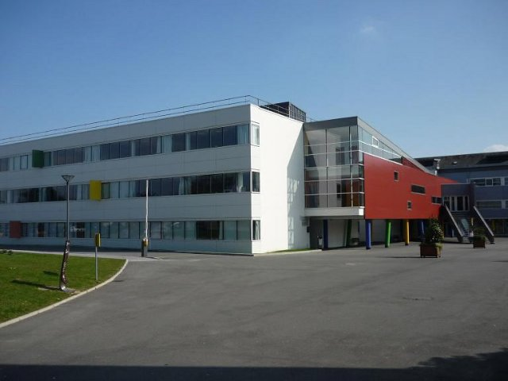
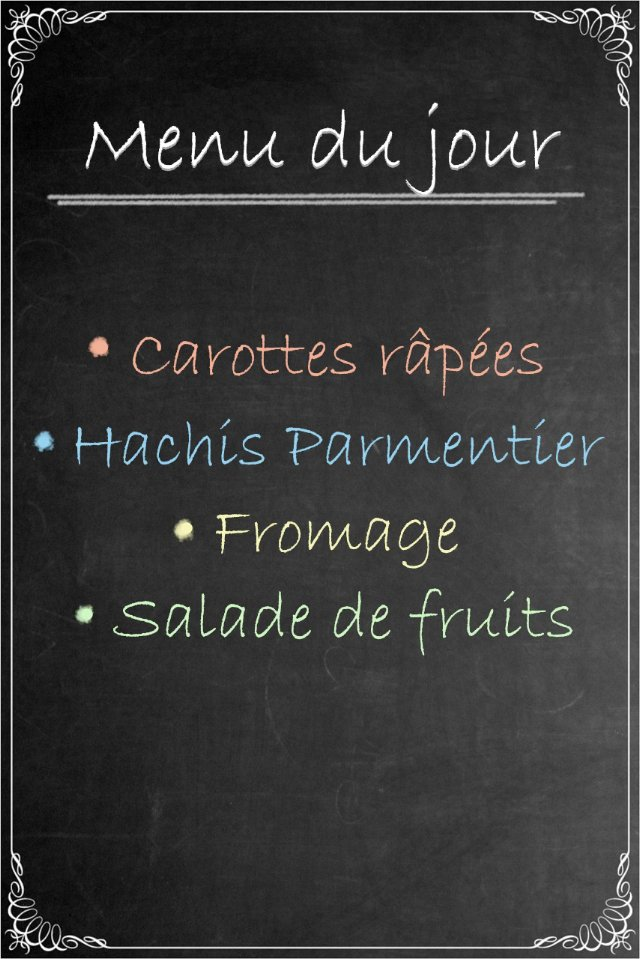

# Il sistema scolastico (fr_02)
> [!note] Educators & Designers: help improving this quest!
> **Comments and feedback**: [discuss in the Forum](https://antura.discourse.group/t/fr-02-the-school-system/24/1)  
> **Improve script translations**: [comment the Google Sheet](https://docs.google.com/spreadsheets/d/1FPFOy8CHor5ArSg57xMuPAG7WM27-ecDOiU-OmtHgjw/edit?gid=1873232287#gid=1873232287)  
> **Improve Cards translations**: [comment the Google Sheet](https://docs.google.com/spreadsheets/d/1M3uOeqkbE4uyDs5us5vO-nAFT8Aq0LGBxjjT_CSScWw/edit?gid=415931977#gid=415931977)  
> **Improve the script**: [propose an edit here](https://github.com/vgwb/Antura/blob/main/Assets/_discover/_quests/FR_02%20Angers%20School/FR_02%20Angers%20School%20-%20Yarn%20Script.yarn)  

- Version: 1.00
- Status: NeedsReview
- Location: France - Angers

- Difficulty: Normal
- Duration (min): 20
## Design Notes
## Game Design Notes

The cat goes to different places until he finds his school. Then he visits the school and finds his class.

### Content
School system : the cats goes a lycée (16-18 ans), to a collège (11-15 ans), to a école maternelle (3-5 ans) and finally goes to an école primaire (6-10 ans), that corresponds to his age, called Jules Verne

A typical day at school

- Morning childcare = garderie du matin
- arrival at the school gate = le portail
- work in class with different subjects/matières : maths, reading & writing
- morning playtime (récréation) on the playground (la cour) 
- lunch at the canteen (la cantine) or at home (à la maison)
- school work with different subjects/matières : PE = EPS (éducation physique et - sportive),  hist/geog = histoire/géographie,  science = sciences, arts= art
- evening childcare = garderie du soir / homework support = aide aux devoirs

School levels with level names and age (CP–6 ans / CE1-7 ans / CE2-8 ans /CM1-9 ans / CM2–10 ans).

### Knowledge content
The French School System: Kids learn the names, age groups, and order of the main schools:

- École Maternelle (3-5 years old)
- École Primaire (6-10 years old) - 5 years total.
- Collège (11-15 years old)
- Lycée (16-18 years old)

**The Baccalauréat**: Kids learn that the Lycée prepares you for a final diploma called le Baccalauréat, which is needed for university.

**Classroom Life**: Kids learn that French students learn to write in cursive, have playtime (la récréation) in the morning and afternoon, and study things like geometry.

**Cultural Values**: Introduction to the principles of French public schools via the national motto and the Charter of Secularism.

## Topics
### French School {#frenchschool}
[Open topic page](../../topics/index.md#frenchschool)  

- Importance: High  
- Country: France  
- Target age: Ages6to10  
- Subjects: Education

#### Core Card - Scuole francesi
In Francia, la scuola si articola in quattro fasi principali: maternelle (scuola materna), école élémentaire (scuola elementare), collège (scuola media) e lycée (scuola superiore). Al termine del lycée, molti studenti sostengono un importante esame chiamato baccalauréat (‘le bac’).

- Type: Concept
- Subjects: Education, Civics, Culture

#### Connection (PartOf) - École Maternelle
Scuola per bambini dai 3 ai 5 anni. Si impara giocando ed esplorando.

{ width="200" }
- Type: Concept
- Subjects: Education, Culture
- Year: 1975

#### Connection (PartOf) - Scuola primaria in Francia
Scuola per bambini dai 6 ai 10 anni. Si impara a leggere, scrivere e contare.

{ width="200" }
- Type: Concept
- Subjects: Education, Culture
- Year: 1975

#### Connection (PartOf) - Liceo in Francia
Scuola superiore in Francia per adolescenti dai 16 ai 18 anni. Gli studenti studiano duramente per sostenere l'esame di Baccalauréat, che permette loro di accedere all'università.

{ width="200" }
- Rationale: The Lycée system shows kids the path to higher education in France
- Type: Concept
- Subjects: Education, Culture
- Year: 1975

#### Connection (PartOf) - Collège in Francia
Scuola media in Francia per ragazzi dagli 11 ai 15 anni. Gli studenti studiano molte materie e si preparano per la scuola superiore.

{ width="200" }
- Rationale: Understanding the French school system helps kids compare education across countries
- Type: Concept
- Subjects: Education, Culture
- Year: 1975

#### Connection (Purpose) - Scrittura corsiva
Un modo speciale di scrivere in cui tutte le lettere di una parola sono collegate. In Francia, i bambini imparano a scrivere in questo modo a scuola.

{ width="200" }
- Rationale: Cursive writing is an important part of French education and cultural identity
- Type: Concept
- Subjects: Education, Culture, Art
- Year: 1800

#### Connection (Purpose) - Menù della mensa
Un elenco che mostra quali alimenti puoi mangiare a scuola. Ti aiuta a scegliere cosa mangiare!

{ width="200" }
- Type: Object
- Subjects: Community, Culture

#### Connection (CulturalContext) - Carta della Laicità
Un insieme di regole per rispettare le convinzioni di tutti. Aiuta le persone a vivere insieme in pace.

{ width="200" }
- Type: Concept
- Subjects: Community, Culture
- Year: 2013

### Elementary Math {#elementary-maths}
[Open topic page](../../topics/index.md#elementary-maths)  

Numbers and shapes for everyday life: counting, adding and subtracting, simple fractions, measuring, telling time, and using money.

- Importance: Medium  
- Country: International  
- Target age: Ages6to10  
- Subjects: Math

#### Core Card - Matematica elementare
Numeri e forme per la vita di tutti i giorni: contare, addizionare e sottrarre, frazioni semplici, misurare, leggere l'ora e usare il denaro.

- Type: None

#### Connection (PartOf): curriculum element - Linea
Un segno dritto che va da un punto all'altro. Le linee possono essere lunghe o corte.

{ width="200" }
- Type: Concept
- Subjects: Math

#### Connection (PartOf): curriculum element - Triangolo
Una forma con tre lati dritti e tre angoli. I triangoli sembrano fette di pizza!

{ width="200" }
- Type: Concept
- Subjects: Math

#### Connection (Purpose): tool used for math - Bussola
Uno strumento che ti aiuta a disegnare cerchi perfetti. Ha due gambe come forbici.

{ width="200" }
- Type: Object
- Subjects: Math

#### Connection (Purpose): tool used for math - Governate
Uno strumento dritto usato per misurare la lunghezza degli oggetti. I righelli hanno numeri e linee.

{ width="200" }
- Type: Object
- Subjects: Math

#### Connection (Purpose): tool used for math - Piazza
Strumento a forma di triangolo utilizzato per disegnare linee rette e angoli retti in matematica.

{ width="200" }
- Type: Object
- Subjects: Math

#### Connection (PartOf): Previous core card - Cerchio
Una forma rotonda senza angoli. I cerchi sembrano ruote, palline e monete!

{ width="200" }
- Type: Concept
- Subjects: Math

## Additional Cards
#### Cartella
Una borsa che gli studenti usano per portare a scuola libri, matite e compiti.

{ width="200" }
- Type: Object
- Subjects: Science

#### Aula
Un'aula della scuola dove gli studenti si siedono e imparano cose nuove dal loro insegnante.

{ width="200" }
- Type: Place
- Subjects: Education, Community

## Quest Script

[See the full script here](./fr_02-script.md)

## Words
- water
## Activities
- [Match](../../activities/index.md#Match)
- [Order](../../activities/index.md#Order)

## Tasks
- [Interact] TASK_SCHOOL
- [Collect] TASK_BACKPACK
- [Interact] TASK_CLASSROOM
## Credits
- Anne (France) (content)
- Lucie Paillat (France) (content, design)
- [Stefano Cecere](https://stefanocecere.com) (Italy) (development)
