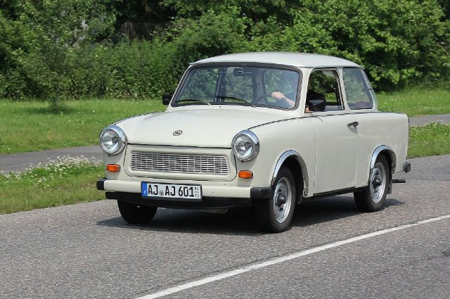
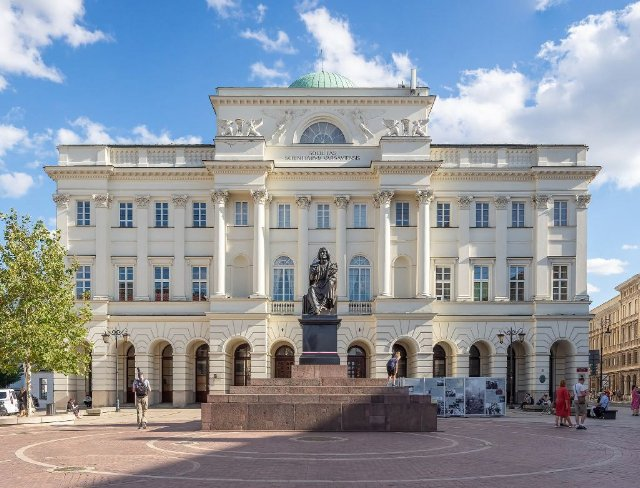

# Scopri Varsavia (pl_01)
> [!note] Educators & Designers: help improving this quest!
> **Comments and feedback**: [discuss in the Forum](https://antura.discourse.group/t/pl-01-discover-warszawa/32/1)  
> **Improve script translations**: [comment the Google Sheet](https://docs.google.com/spreadsheets/d/1FPFOy8CHor5ArSg57xMuPAG7WM27-ecDOiU-OmtHgjw/edit?gid=1983275331#gid=1983275331)  
> **Improve Cards translations**: [comment the Google Sheet](https://docs.google.com/spreadsheets/d/1M3uOeqkbE4uyDs5us5vO-nAFT8Aq0LGBxjjT_CSScWw/edit?gid=415931977#gid=415931977)  
> **Improve the script**: [propose an edit here](https://github.com/vgwb/Antura/blob/main/Assets/_discover/_quests/PL_01%20Warsaw/PL_01%20Warsaw%20-%20Yarn%20Script.yarn)  

- Version: 1.00
- Status: Development
- Location: Poland - Varsavia

- Difficulty: Normal
- Duration (min): 20
- Description: Esplora la capitale polacca per risolvere il caos lasciato da Antura

## Design Notes
## Game Design Notes

Complete Warsaw exploration following Antura through capital landmarks. Meet Mermaid of Warsaw, experience Chopin's music, learn Wars & Sawa legend, visit parliament, encounter Maria Curie at Palace of Culture, and conclude at National Stadium with sports activities.

### Knowledge Content
Buildings:

- Mermaid of Warsaw
- Palace of Culture and Science
- Royal Castle
- Polish Houses of Parliament
- National Stadium
- Chopin Monument
- King Sigismund’s Column
- Wars and Sawa statue (and legend)
- Nicolaus Copernicus Monument
- Presidential Palace
Polish flag, złoty
The river Wisła

Music:

- National anthem “Mazurek Dąbrowskiego”
- a Chopin’s music piece  or a polish folk song like “Czerwone Jabłuszko”/”Mam chusteczkę haftowaną” 

Constitution of 3 May, Independence day
Maria Curie-Skłodowska

Vocabulary:  sport: football (soccer), ball, goal/gate, soccer field
Transport: train, tram, bus, car, bike

### Flow

You are greeted in Warsaw, the capital of Poland by the Guide. He asks you for your help. It seems that Antura has been creating chaos since it arrived here and somebody needs to stop it and fix it. He points you in the direction of the Mermaid of Warsaw.

**Mermaid of Warsaw**  
You meet with the Mermaid of Warsaw, who is missing her sword. She tells you that she saw Antura disturb other monuments of Warsaw and tried to stop him but in the process he managed to take her sword away. She asks you to retrieve it, and help other monuments while you follow Antura’s trail. She points you to the Chopin Monument. She also asks you if you know how the transportation works in Warsaw and explains the vocabulary and types of transport.

**Chopin Monument**  
Once you find the Chopin Monument, you can see that it seems the music notes to his music piece are missing. To get them back, you have to recreate the melody. 
[Activity Piano]
When you do, Chopin’s statue thanks you and tells you about himself.  He also tells you that he saw Antura with the Mermaid’s sword going in the direction of Nicolaus Copernicus’ Monument.
—-

**Wars and Sawa statue**  
Once you get there, you meet with Wars. Apparently Sawa seems to be missing and he is asking you to find her. Once you follow her trail, you can see her by the Wisła river. You learn about the river from Sawa and convince her to go back to Wars. She says they got separated during the chaos that Antura was creating. Once you go back with her, they tell you the legend about them and the origin of the city. They also say that you should head in the direction of King Sigismund’s Column.

**King Sigismund’s Column**
When you go to King Sigismund’s Column, he greets you and introduces himself. He explains that he used to be a king of Poland and tells you about the Royal Castle, later mentioning that right now the country is governed by the Parliament. He asks you to find his missing crown [task] which has been knocked off his head while Antura was running by. It is not far from him. Once you complete the task, he tells you to go to the Sejm, since apparently that is where the Mermaid’s Sword has been left.

**President and Houses of Parliament**  
Once you go there, you meet the President who explains what the Polish Houses of Parliament are and tells you about the Presidential Palace. He says he has the Mermaid’s sword, but before you go to give it back to her, he asks you to help with a little thing. Apparently Antura stole the colours from the Polish flag and needs you to give them back. You then learn how the Polish flag looks and need to choose the correct colours for the flag. The President thanks you for your help.  He wants to share some more facts with you and asks you if you know about the 3 May Constitution Day in Poland. He then explains what it means. 

**Mermaid of Warsaw**
You go back to the Mermaid of Warsaw and you give back her sword. She tells you, she is a symbol of Warsaw and tells you about herself. Then she says that she has heard Antura has also messed with a few other places. She points you to the Palace of Culture and Science. 

**Palace of Culture and Science and Maria Skłodowska-Curie**
Once you get there, you meet Maria Skłodowska-Curie. She explains that although she is not associated with this place, it is called The Palace of Culture and Science and she herself is connected to scientific fields. She explains its role today and tells a little bit about herself. She also asks you for a favor. Antura seems to have misplaced her wallet. She asks you to retrieve it and you need to follow the trail of coins that are polish złoty until you find it and bring it back. She thanks you and explains that in Poland this is the currency. She also says that she has heard some commotion at the National Stadium.

**National Stadium and national anthem**
You go to the  National Stadium, where you meet Robert Lewandowski. He tells you a little about the Stadium and you are challenged by him to score 5 goals (minigame) to cheer everybody up after Antura’s visit. 

When you manage to do it, he explains to you some vocabulary associated with sport. The people at the stadium also sing the national anthem and Robert Lewandowski tells you about the Independence Day in Poland that takes place on the 11th of November. 
Then the Guide comes and he says that you have managed to clear the commotion that Antura left behind him. In the meantime Antura seems to have left the city. 

**Final Assessment**
Question 1: How does the polish flag look? (with a few pictures to choose from)
Question 2: Math the picture with words (the vocabulary)

### Resources
**Palace of Culture and Science**
A tall, historic skyscraper in Warsaw built in the 1950s as a gift from the Soviet Union. Today it houses theaters, museums, offices, and a viewing terrace.

**Royal Castle**
The Royal Castle in Warsaw was once the official residence of Polish kings and is now a museum. It was rebuilt after World War II and features grand halls, royal paintings, and historic furniture.

**Polish Houses of Parliament**
The main government buildings in Warsaw where Polish laws are debated and passed. The complex includes both chambers of Parliament: the Sejm and the Senate.	

**National Stadium**
A modern sports arena in Warsaw built for the 2012 UEFA European Championship. It hosts football matches, concerts, and public events.

**Chopin Monument**
A large statue in Warsaw’s Łazienki Park dedicated to Frédéric Chopin, Poland’s most famous composer. It’s also the site of popular open-air piano concerts in summer. (the special tree he is sitting under is a typical polish.. Willow )

**King Sigismund’s Column,**
A tall monument in Castle Square honoring the Polish king who moved the capital from Kraków to Warsaw. It’s one of the city’s oldest and most famous landmarks.

**Wars and Siwa statue**
The statue is based on a local legend about a fisherman named Wars who lived by the Vistula River. One night, he discovered a mysterious mermaid named Sawa singing by the shore; they became friends, and the city that grew nearby was named after them — Warsawa, now Warsaw.

**Mermaid of Warsaw**
The mermaid is a symbol of Warsaw and appears on the city’s coat of arms. A statue of her stands by the river, holding a sword and shield to protect the city.

**Presidential Palace**
The Presidential Palace in Warsaw is the official residence of the President of Poland. It’s a historic building with elegant architecture, often used for important ceremonies and state events.

## Topics
### Warsaw {#warsaw}
[Open topic page](../../topics/index.md#warsaw)  

- Importance: Medium  
- Country: Poland  
- Target age: Ages6to10

#### Core Card - Monumento a Chopin
Una grande statua nel Parco Łazienki di Varsavia, dedicata a Frédéric Chopin. È anche sede di popolari concerti di pianoforte all'aperto in estate. (L'albero speciale sotto cui è seduto è un tipico salice polacco)

{ width="200" }
- Type: Object
- Subjects: Music, Culture

#### Connection (RelatedTo) - Sirena di Varsavia
Il simbolo della città è una coraggiosa sirena con spada e scudo. La sua statua è visibile lungo il fiume.

{ width="200" }
- Type: Object
- Subjects: Culture, History

#### Connection (RelatedTo) - Guerre e Sawa
Due figure leggendarie che diedero il nome a Varsavia: Wars era un coraggioso guerriero e Sawa era una bellissima sirena che viveva nel fiume Vistola.

{ width="200" }
- Type: Concept
- Subjects: Community, Culture
- Year: 1300

#### Connection (RelatedTo) - Fryderyk Chopin
Un famoso compositore polacco per pianoforte. Ha scritto musica meravigliosa che sembra danzare o raccontare storie. La sua musica trasmette felicità o tristezza.

{ width="200" }
- Rationale: Chopin introduces kids to classical music and shows how music can express emotions
- Type: Person
- Subjects: Music, History, Culture
- Year: 1810

## Additional Cards
#### Palla
Un oggetto rotondo utilizzato in molti giochi.

{ width="200" }
- Type: Object
- Subjects: Sport, Recreation

#### Bicicletta
Un veicolo a due ruote su cui si pedala.

{ width="200" }
- Type: Object
- Subjects: Transportation, Sport, Health

#### Autobus
Un veicolo di grandi dimensioni che trasporta molte persone.

{ width="200" }
- Type: Object
- Subjects: Transportation, Community

#### Auto
Un piccolo veicolo per le strade.

{ width="200" }
- Type: Object
- Subjects: Transportation

#### Costituzione del 3 maggio
Una storica costituzione polacca celebrata il 3 maggio.

{ width="200" }
- Type: Concept
- Subjects: Civics, History, Time

#### Calcio
Un gioco di squadra in cui si calcia una palla.

{ width="200" }
- Type: Object
- Subjects: Sport, Recreation, Community

#### Obiettivo
La rete in cui si cerca di segnare.

{ width="200" }
- Type: Object
- Subjects: Sport, Recreation

#### Giorno dell'Indipendenza (Polonia)
Festa nazionale l'11 novembre.

{ width="200" }
- Type: Concept
- Subjects: Civics, History, Time

#### Colonna di Re Sigismondo
Un'alta colonna in onore di Re Sigismondo nella Piazza del Castello.

{ width="200" }
- Type: Place
- Subjects: History, Culture

#### Corona di Re Sigismondo
La corona del re che è caduta e deve essere ritrovata.

{ width="200" }
- Type: Object
- Subjects: History, Culture

#### Maria Skłodowska-Curie
Una brillante scienziata polacca che scoprì la radioattività. Fu la prima donna a vincere il Premio Nobel, e lo vinse due volte!

{ width="200" }
- Rationale: Maria Curie inspires kids (especially girls) to pursue science and shows Polish contributions to science
- Type: Person
- Subjects: Science, History
- Year: 1867

#### Maria Skłodowska-Curie
Uno scienziato che ha vinto due premi Nobel.

{ width="200" }
- Type: Person
- Subjects: Science, History

#### Mazurek Dąbrowskiego
Inno nazionale polacco.

{ width="200" }
- Type: Concept
- Subjects: Music, History, Culture

#### Spada della sirena
La spada della sirena che deve essere restituita.

{ width="200" }
- Type: Object
- Subjects: Culture, History

#### Stadio Nazionale (Varsavia)
Uno stadio moderno per partite di calcio e concerti.

{ width="200" }
- Type: Place
- Subjects: Sport, Culture, Community

#### Monumento a Nicola Copernico (Varsavia)
Monumento all'astronomo Niccolò Copernico.

{ width="200" }
- Type: Place
- Subjects: Science, History, Culture

#### Palazzo della Cultura e della Scienza
Un edificio alto per musei, teatri e centri di apprendimento.

{ width="200" }
- Type: Place
- Subjects: Culture, Education, History

#### Re Sigismondo III
Re di Polonia, che costruì molti splendidi edifici a Varsavia. La sua statua si erge su un'alta colonna nel centro della città.

{ width="200" }
- Rationale: Historical kings help kids understand how cities were built and developed over time
- Type: Person
- Subjects: History, Culture
- Year: 1566

#### Nano polacco (gnomi di Breslavia)
Piccole statue di nani si nascondono in giro per Breslavia. Trovarle è un divertente gioco cittadino.

{ width="200" }
- Type: Concept
- Subjects: Community, Culture
- Year: 1700

#### Camere del Parlamento polacco
Dove vengono fatte le leggi: il Sejm e il Senato.

{ width="200" }
- Type: Place
- Subjects: Civics, History, Geography

#### Palazzo presidenziale
La residenza ufficiale del Presidente della Polonia.

{ width="200" }
- Type: Place
- Subjects: Civics, History, Culture

#### Roberto Lewandowski
Un famoso calciatore polacco.

{ width="200" }
- Type: Person
- Subjects: Sport, Culture

#### Castello Reale (Varsavia)
Uno storico castello dei re polacchi, ora un museo.

{ width="200" }
- Type: Place
- Subjects: History, Culture, Geography

#### Campo da calcio
Il campo erboso dove si gioca a calcio.

{ width="200" }
- Type: Place
- Subjects: Sport, Recreation, Community

#### Tram
Un treno urbano che corre sui binari della strada.

{ width="200" }
- Type: Object
- Subjects: Transportation, Technology, Community

#### Guerre e statua di Sawa
Una statua che raffigura la leggenda della città su Wars e Sawa.

{ width="200" }
- Type: Place
- Subjects: Culture, History

#### Monete Złoty
Denaro polacco (złoty) raffigurato come monete.

{ width="200" }
- Type: Object
- Subjects: Money, Geography

## Quest Script

[See the full script here](./pl_01-script.md)

## Words
## Activities
- (none)

## Tasks
- (none)
## Credits
- [Jan Stasienko](mailto:jan.stasienko@dsw.edu.pl) (Poland) (content)
- Lorenzo Castrovilli (Italy) (design)
- [Stefano Cecere](https://stefanocecere.com) (Italy) (development)
- Valeria Passarella (Italy) (design)
- Vieri Toti (Italy) (design)
