# Il grande salvataggio dei nani di Breslavia (pl_02)
> [!note] Educators & Designers: help improving this quest!
> **Comments and feedback**: [discuss in the Forum](https://antura.discourse.group/t/pl-02-the-great-wroclaw-dwarf-rescue/33/1)  
> **Improve script translations**: [comment the Google Sheet](https://docs.google.com/spreadsheets/d/1FPFOy8CHor5ArSg57xMuPAG7WM27-ecDOiU-OmtHgjw/edit?gid=1721014062#gid=1721014062)  
> **Improve Cards translations**: [comment the Google Sheet](https://docs.google.com/spreadsheets/d/1M3uOeqkbE4uyDs5us5vO-nAFT8Aq0LGBxjjT_CSScWw/edit?gid=415931977#gid=415931977)  
> **Improve the script**: [propose an edit here](https://github.com/vgwb/Antura/blob/main/Assets/_discover/_quests/PL_02%20Wroclaw%20Dwarves/PL_02%20Wroclaw%20Dwarves%20-%20Yarn%20Script.yarn)  

- Version: 1.00
- Status: NeedsReview
- Location: Poland - Breslavia

- Difficulty: Normal
- Duration (min): 20
- Description: Esplora la splendida città di Breslavia e scopri le sue famose statue di nani nascoste vicino ai monumenti.

## Design Notes
## Game Design Notes

**Mission Objective**
The player must explore a stylized, open-hub map of Wrocław to locate **10 unique dwarf statues**. By interacting with landmarks and completing mini-games, players learn about the city’s history and culture. The ultimate goal is to collect all 10 dwarves to convince the "Keymaster Dwarf" to unlock the Sky Tower elevator and rescue Antura.

**Primary Characters** * **The Dwarf Expert:** A friendly guide based at the Leonardo School who introduces the lore and provides the player with "Dwarf Tunnel" access.

**The Keymaster Dwarf:** The final "gatekeeper" at the Sky Tower who requires a full collection of 10 dwarves to proceed.

### Knowledge Content & Educational Goals

- **City Facts:** Wrocław is the 3rd largest city in Poland; Dwarves are the official symbol.
- **Landmark Recognition:** Identifying the **Old Town Hall**, **The Cathedral**, **Centennial Hall**, and **Sky Tower**.
- **Vocabulary & Concepts:**  
  - _Town Hall:_ Where city leaders work.
  - _Cathedral:_ A large, important church for prayer.
  - _Panorama:_ A giant, 360-degree painting.
- **Cultural Figures:** Recognition of Nobel Prize winner **Olga Tokarczuk**.

### Gameplay Mechanics

- **The Hunt:** Simple exploration and point-and-click collection.
- **Dwarf Tunnels (Fast Travel):** Magical portals that allow the player to jump between three main hubs: **Old Town**, **Green Zone**, and **Sky Tower District**.
- **Activities:** Each dwarf discovery triggers a **Jigsaw Puzzle** related to that specific landmark or fact.
- **Special Interaction:** A mandatory **Quiz** at the Cathedral to unlock the Bishop Dwarf.

### Flow

#### **Phase 1: The Briefing**

- **Location:** Leonardo School Campus.
- **Event:** The Dwarf Expert explains that Antura is stuck atop the Sky Tower. The dwarves have locked the elevator as a game.
- **Tutorial:** The Expert introduces the **Dwarf Tunnels** to help the player navigate the large city.

#### **Phase 2: The Old Town Hub (Dwarves 1-3)**

- **Dwarf 1 - The Origin:** Found near the Market Square. Teaches the history of dwarves as a resistance symbol (2003/1980s).
- **Dwarf 2 - The Councilor:** Located at the **Old Town Hall**. Focuses on the role of city leaders.
- **Dwarf 3 - The Bishop:** Located at the **Cathedral**. Requires a quiz about what a Cathedral is (a place to pray).

#### **Phase 3: The Green Zone Hub (Dwarves 4-7)**

- **Dwarf 4 - Animal Lover:** Located at the **Wrocław ZOO**. Fact: It is the largest ZOO in Poland.
- **Dwarf 5 - The Architect:** Located at **Centennial Hall**. Fact: A huge building for shows and sports with a unique dome roof.
- **Dwarf 6 - The Conductor:** Located at the **Multimedia Fountain**. Fact: One of the largest in Europe, using lights and music.
- **Dwarf 7 - The Painter:** Located at **Panorama Racławicka**. Fact: A giant battle painting (15m x 114m) that surrounds the viewer.

#### **Phase 4: The Modern Hub & Finale (Dwarves 8-10)**

- **Dwarf 8 - The Writer:** Located near the base of the Sky Tower. Introduces **Olga Tokarczuk**, Nobel Prize-winning writer living in Wrocław.
- **Dwarf 9 - The Traveler:** Found in the modern plaza of the Sky Tower. Represents the modern growth of the city.
- **Dwarf 10 - The Keymaster:** Stands directly in front of the Sky Tower elevator.

#### **Phase 5: The Summit**

- The elevator unlocks. The player reaches the observation deck.
- **Final Assessment:** A 2-question recap (Symbol of the city? Size of the city?).
- **Outcome:** Quest Complete! Antura is rescued (or has just moved to the next quest location).

## Topics
### Wroclaw Dwarves {#wroclaw_dwarves}
[Open topic page](../../topics/index.md#wroclaw_dwarves)  

- Importance: Medium  
- Country: Poland  
- Target age: Ages6to10

#### Core Card - Nani di Breslavia
Piccole statue sparse per la città che amano fare scherzi.

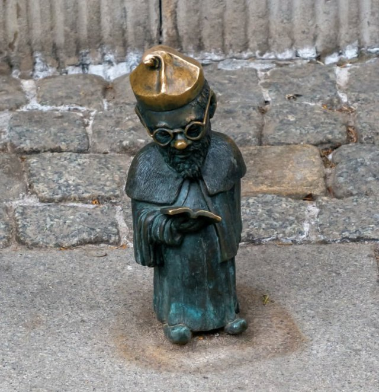{ width="200" }
- Type: Concept
- Subjects: Culture, Community, History

#### Connection (RelatedTo) - Nano amante degli animali
Una statua di un nano che ama lo zoo e gli animali.

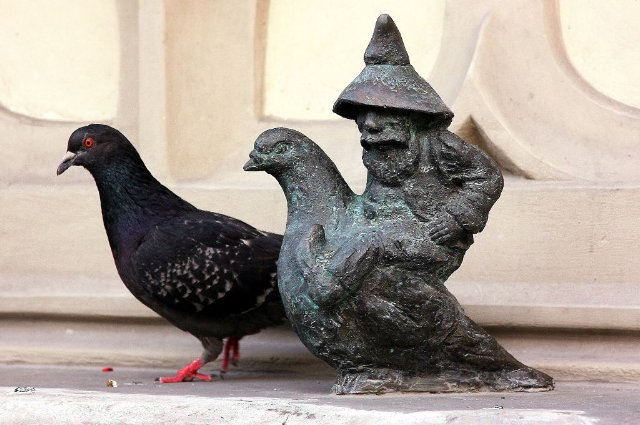{ width="200" }
- Type: Object
- Subjects: Culture, Animal, Education

#### Connection (RelatedTo) - Vescovo nano
Una statua nana che pone una domanda in chiesa.

{ width="200" }
- Type: Object
- Subjects: Culture, History

#### Connection (RelatedTo) - Esperto di nani
Una guida amichevole che sa tutto sui nani.

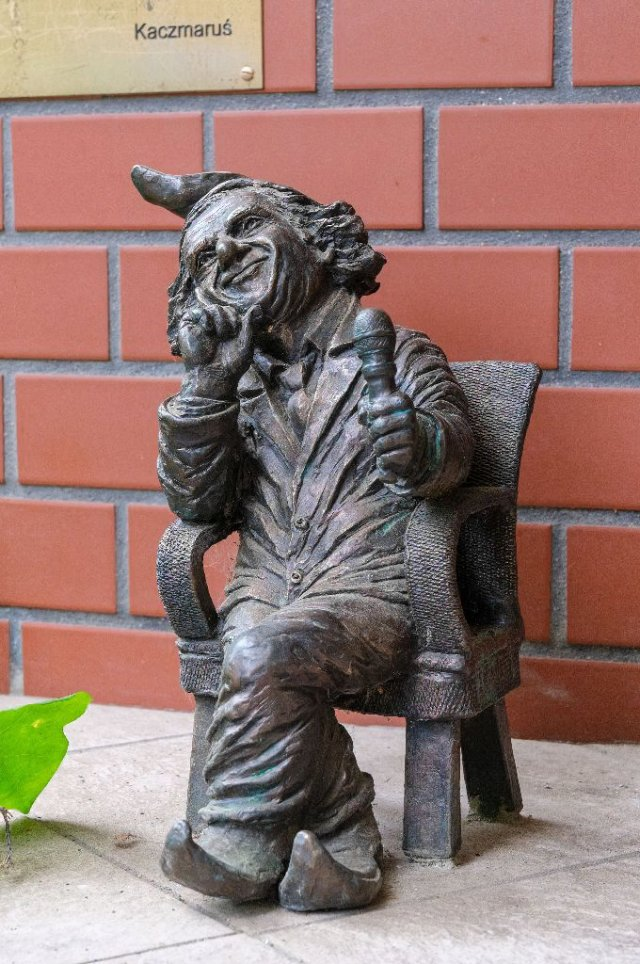{ width="200" }
- Type: Person
- Subjects: Education, Culture

#### Connection (RelatedTo) - Maestro delle Chiavi Nano
Una statua nana sorveglia l'ascensore con una grande chiave.

{ width="200" }
- Type: Object
- Subjects: Culture

#### Connection (RelatedTo) - Nano polacco (gnomi di Breslavia)
Piccole statue di nani si nascondono in giro per Breslavia. Trovarle è un divertente gioco cittadino.

{ width="200" }
- Type: Concept
- Subjects: Community, Culture
- Year: 1700

#### Connection (RelatedTo) - Statua del nano di Breslavia
Una piccola statua cittadina; i nani sono il simbolo di Breslavia.

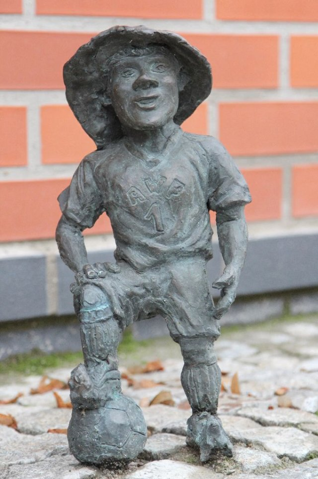{ width="200" }
- Type: Object
- Subjects: Culture, Community, History

#### Connection (LocatedIn) - Breslavia
Una città in Polonia con fiumi, ponti e storia.

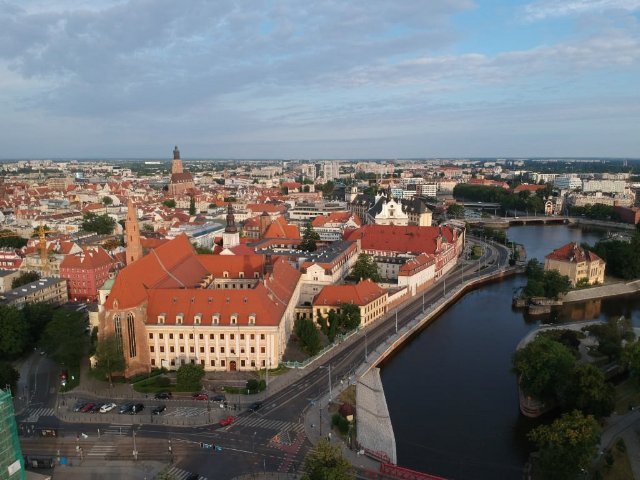{ width="200" }
- Type: Place
- Subjects: Geography, History, Culture

## Additional Cards
#### Sala del Centenario
La Centennial Hall è un enorme edificio che sembra una grande tenda con un tetto. È molto alto. Al suo interno si possono vedere diversi spettacoli, ascoltare concerti o guardare partite sportive.

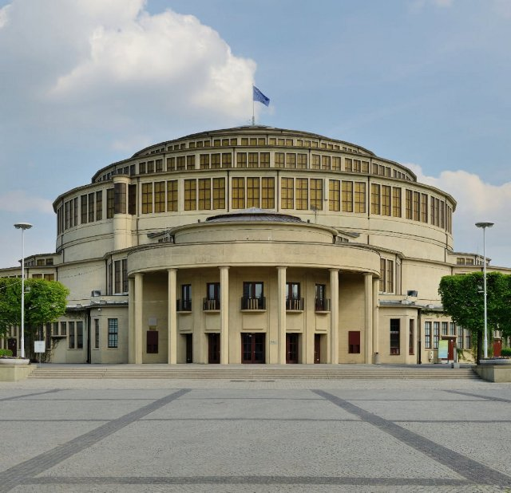{ width="200" }
- Type: Place
- Subjects: Culture, Recreation

#### Olga Tokarczuk
Un famoso scrittore polacco che vive a Breslavia.

{ width="200" }
- Type: Person
- Subjects: Literature, Culture

#### Panorama Racławicka
Un dipinto gigante tutto intorno a te che racconta una battaglia storica.

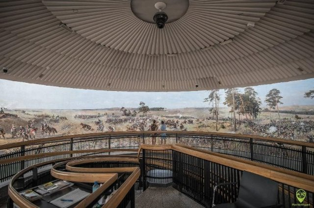{ width="200" }
- Type: Place
- Subjects: History, Art, Culture

#### Sky Tower Plaza
Una piazza moderna dove le persone si incontrano vicino alla torre.

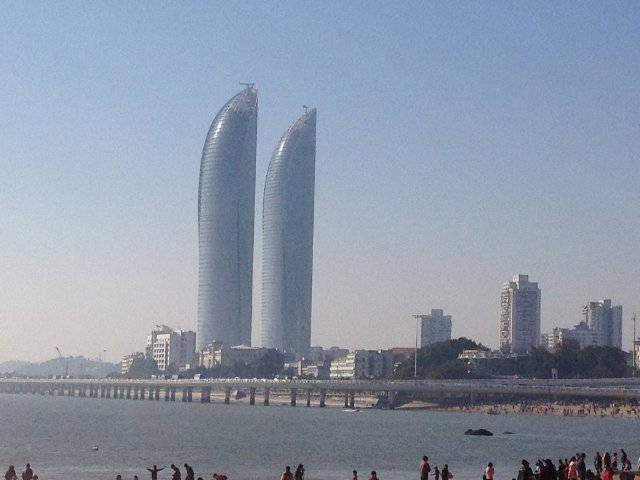{ width="200" }
- Type: Place
- Subjects: Geography, Community, Recreation

#### Municipio
Il luogo in cui i leader della città lavorano e si incontrano.

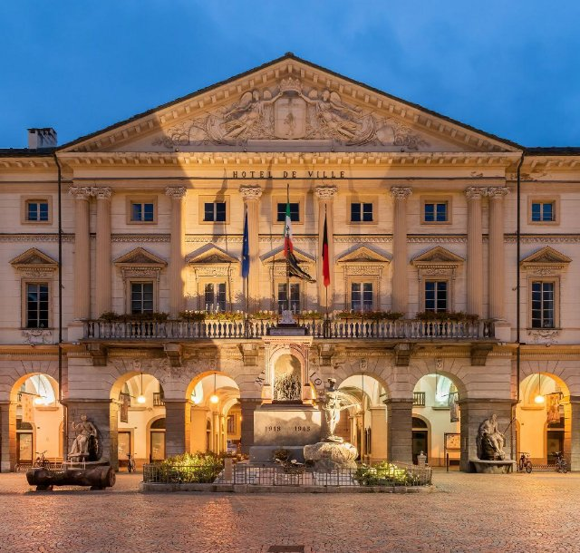{ width="200" }
- Type: Concept
- Subjects: Civics, Community, History

#### fiume Vistola
Il fiume più lungo della Polonia; sfocia nel Mar Baltico.

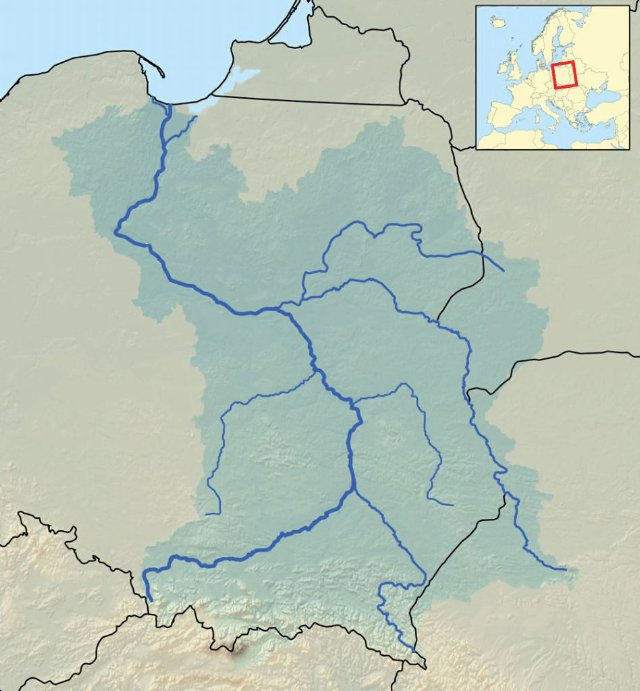{ width="200" }
- Type: Place
- Subjects: Geography, Environment

#### Breslavia: Cattedrale
Una chiesa grande e importante, dove la gente prega. È possibile salire sulla torre per ammirare il panorama.

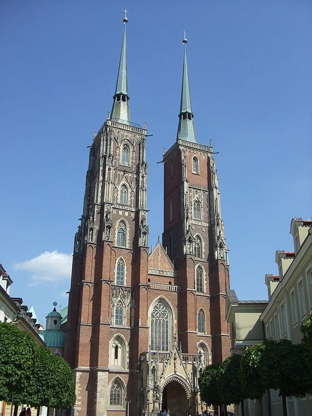{ width="200" }
- Type: Place
- Subjects: History, Culture

#### Piazza del mercato di Breslavia
La piazza principale della Città Vecchia, piena di vita.

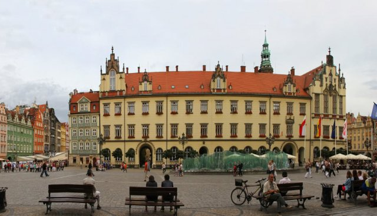{ width="200" }
- Type: Place
- Subjects: Geography, Culture, Community, History

#### Fontana multimediale di Breslavia
Acqua che danza con musica e luci colorate.

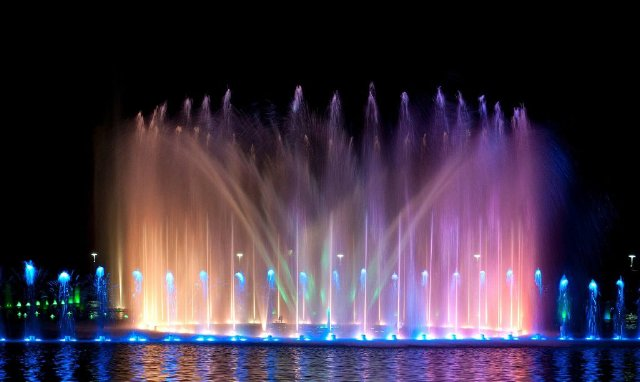{ width="200" }
- Type: Place
- Subjects: Culture, Technology, Recreation

#### Vecchio Municipio (Breslavia)
Uno splendido edificio gotico nella piazza principale. Ha un famoso orologio.

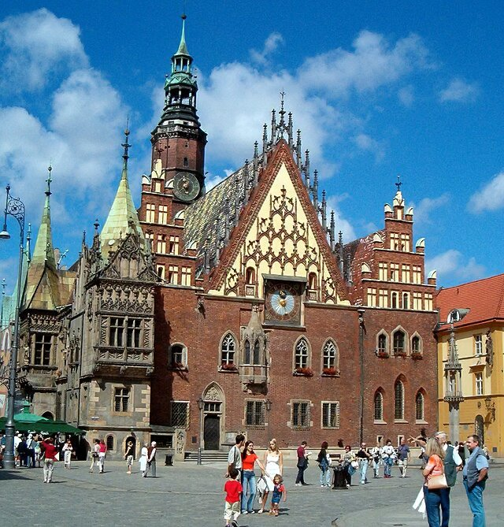{ width="200" }
- Type: Place
- Subjects: Geography, Environment

#### Breslavia: Sky Tower
Uno degli edifici più alti della Polonia. Ospita negozi e un punto panoramico.

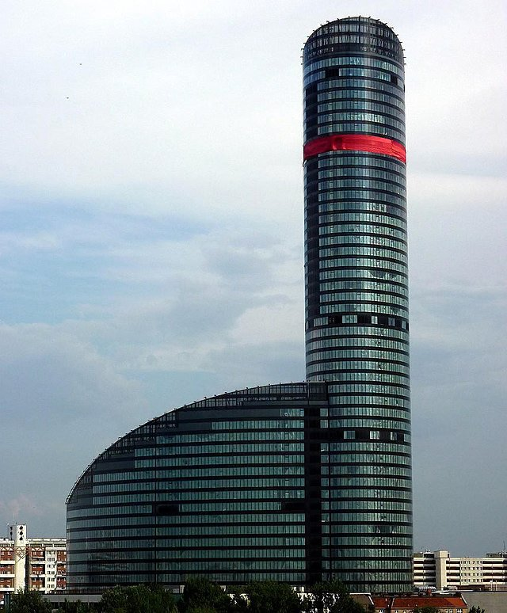{ width="200" }
- Type: Place
- Subjects: Geography, Community, Culture

#### Scuola Primaria Leonardo da Vinci
È un luogo accogliente dove i bambini imparano, creano ed esplorano guidati dalla curiosità, dall'arte e dalla scienza.

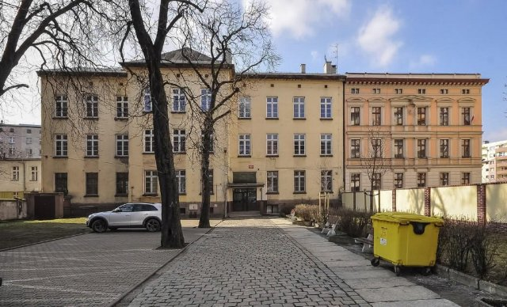{ width="200" }
- Type: None
- Subjects: Education

#### Mappa di Wroklaw
Una semplice mappa di Breslavia che mostra il fiume Odra con le sue isole e numerosi ponti

{ width="200" }
- Type: None
- Subjects: Geography

## Quest Script

[See the full script here](./pl_02-script.md)

## Words
## Activities
- [JigsawPuzzle](../../activities/index.md#JigsawPuzzle)
- [JigsawPuzzle](../../activities/index.md#JigsawPuzzle)

## Tasks
- [Collect] FIND_DWARVES
## Credits
- [Jan Stasienko](mailto:jan.stasienko@dsw.edu.pl) (Poland) (content)
- Lorenzo Castrovilli (Italy) (design)
- [Stefano Cecere](https://stefanocecere.com) (Italy) (development)
- Valeria Passarella (Italy) (design)
- Vieri Toti (Italy) (design)
